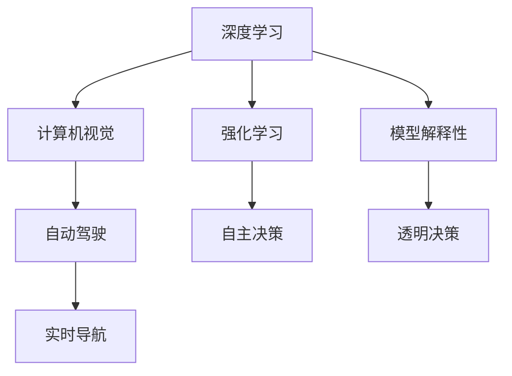

                 

# Andrej Karpathy：人工智能的未来发展目标

> 关键词：人工智能,深度学习,计算机视觉,未来发展

## 1. 背景介绍

Andrej Karpathy，一位备受瞩目的AI专家，其对于深度学习和计算机视觉领域的贡献深远影响着业界。他的工作不仅涉及前沿研究，还深入到实际应用中，使得深度学习技术能够真正落地，为各行各业带来变革。本文将通过回顾Andrej Karpathy的研究历程，探讨人工智能的未来发展方向。

### 1.1 研究背景

Andrej Karpathy的研究始于图像识别领域，他参与了多项关于计算机视觉和深度学习的基础研究，并应用其研究成果开发了众多实用工具和应用，如Visual Geometry Algorithms（VGA）和DeepAI等。这些工具和应用不仅提升了计算机视觉领域的研究效率，也使得深度学习技术更广泛地应用在生产环境中。

### 1.2 研究目标

Andrej Karpathy的目标是使深度学习技术更加普及和实用，帮助解决现实世界中的复杂问题。他关注于构建更加智能、可靠、可解释的AI系统，推动AI技术的发展，最终促进人类社会整体的进步。

## 2. 核心概念与联系

### 2.1 核心概念概述

Andrej Karpathy的研究涵盖多个核心概念，包括：

- **深度学习**：使用多层次的神经网络进行复杂模式识别和学习。
- **计算机视觉**：研究如何让计算机理解并解释图像和视频内容。
- **自动驾驶**：结合计算机视觉和深度学习，使汽车能够自主导航。
- **强化学习**：让AI系统通过与环境的互动学习最优策略。
- **模型解释性**：使AI系统的决策过程透明，便于理解和调试。

### 2.2 概念间的关系

这些概念之间存在紧密的联系，共同构成了Andrej Karpathy的研究体系。以下是一个Mermaid流程图，展示这些核心概念之间的联系：



这个流程图展示了深度学习在计算机视觉、自动驾驶、强化学习和模型解释性中的应用。其中，计算机视觉和自动驾驶紧密相连，通过深度学习使计算机能够理解和操作视觉信息，从而实现自主导航。强化学习则在自动驾驶和自主决策中起到关键作用，模型解释性则保证了这些系统决策的透明性和可解释性。

## 3. 核心算法原理 & 具体操作步骤

### 3.1 算法原理概述

Andrej Karpathy的研究中，深度学习算法是核心。他提出并实现了多种深度学习模型，如卷积神经网络（CNN）和递归神经网络（RNN）等，这些模型在图像识别和自然语言处理中表现出色。此外，他还开发了端到端的学习框架，如PyTorch，进一步推动了深度学习技术的普及和应用。

### 3.2 算法步骤详解

以下是Andrej Karpathy在深度学习算法开发中常用的具体操作步骤：

1. **数据准备**：收集和标注训练数据，构建适合深度学习的格式。
2. **模型选择**：选择合适的神经网络架构，如CNN、RNN等。
3. **模型训练**：使用反向传播算法优化模型参数，最小化损失函数。
4. **模型验证**：在验证集上评估模型性能，调整模型参数以避免过拟合。
5. **模型应用**：将训练好的模型应用于实际问题中，如图像分类、物体检测等。

### 3.3 算法优缺点

Andrej Karpathy提出的深度学习算法具有以下优点：

- **高精度**：通过多层次的神经网络，可以实现复杂的模式识别和预测。
- **可扩展性**：深度学习模型可以很容易地扩展到大规模数据集和复杂任务。
- **高效计算**：通过GPU等硬件加速，深度学习模型可以在短时间内完成大规模计算。

同时，这些算法也存在一些缺点：

- **资源需求高**：深度学习模型需要大量的计算资源和存储空间。
- **模型复杂性**：神经网络模型复杂，不易理解和调试。
- **数据依赖强**：深度学习模型对数据的依赖性强，需要大量的标注数据。

### 3.4 算法应用领域

Andrej Karpathy的研究成果在多个领域得到了广泛应用，包括：

- **自动驾驶**：通过计算机视觉和深度学习技术，实现车辆的自主导航和决策。
- **医疗影像分析**：利用深度学习模型对医学影像进行分析和诊断。
- **自然语言处理**：开发了多种自然语言处理模型，如机器翻译、语音识别等。
- **游戏AI**：构建了具有强大决策能力的AI游戏玩家，用于游戏竞赛和娱乐。
- **机器人控制**：开发了深度学习驱动的机器人控制算法，提高了机器人的自主性和灵活性。

## 4. 数学模型和公式 & 详细讲解 & 举例说明

### 4.1 数学模型构建

Andrej Karpathy的研究中，数学模型构建是至关重要的。以下是一个简化的数学模型构建过程：

假设有一个图像识别任务，输入为图像 $X$，输出为标签 $Y$。我们使用深度学习模型 $F_{\theta}$ 进行训练，其中 $\theta$ 为模型参数。模型的目标是最小化损失函数 $L$，即：

$$
\min_{\theta} L(F_{\theta}(X), Y)
$$

常见的损失函数包括交叉熵损失、均方误差损失等。

### 4.2 公式推导过程

以下以交叉熵损失函数为例，推导其计算过程：

设模型 $F_{\theta}$ 输出概率分布为 $p_{\theta}(Y|X)$，真实标签为 $y_i$，则交叉熵损失函数为：

$$
L = -\frac{1}{N}\sum_{i=1}^N \log p_{\theta}(y_i|X)
$$

其中 $N$ 为样本数量。该公式展示了如何通过模型预测概率分布，最小化与真实标签的交叉熵差异。

### 4.3 案例分析与讲解

以图像分类任务为例，假设有两个类别，分别用 $C_1$ 和 $C_2$ 表示。对于每个样本 $x$，模型 $F_{\theta}$ 输出的概率分布为 $p_{\theta}(Y|X)$，其中 $Y$ 为类别标签。我们使用交叉熵损失函数进行模型训练，计算公式为：

$$
L = -\frac{1}{N}\sum_{i=1}^N [y_i \log p_{\theta}(C_i|x) + (1-y_i) \log p_{\theta}(C_j|x)]
$$

其中 $y_i$ 为样本的真实标签，$C_i$ 和 $C_j$ 为两个类别。

通过上述推导和案例分析，我们可以更好地理解Andrej Karpathy在深度学习中的数学模型构建过程。

## 5. 项目实践：代码实例和详细解释说明

### 5.1 开发环境搭建

要开始深度学习项目，首先需要搭建好开发环境。以下是一些常用的开发环境配置方法：

1. **Python**：选择 Python 3.x 版本，推荐使用 Anaconda 创建虚拟环境。
2. **深度学习框架**：如 TensorFlow、PyTorch、Keras 等，根据自己的需求选择合适的框架。
3. **计算机视觉库**：如 OpenCV、Pillow 等，用于图像和视频处理。
4. **数据集准备**：下载并准备数据集，如 ImageNet、COCO 等。
5. **GPU 支持**：安装 NVIDIA GPU 驱动和 CUDA 工具包，确保深度学习模型能够在 GPU 上高效运行。

### 5.2 源代码详细实现

以下是使用 PyTorch 实现一个简单的图像分类任务的代码：

```python
import torch
import torch.nn as nn
import torch.optim as optim
from torchvision import datasets, transforms

class Net(nn.Module):
    def __init__(self):
        super(Net, self).__init__()
        self.conv1 = nn.Conv2d(3, 6, 5)
        self.pool = nn.MaxPool2d(2, 2)
        self.conv2 = nn.Conv2d(6, 16, 5)
        self.fc1 = nn.Linear(16 * 5 * 5, 120)
        self.fc2 = nn.Linear(120, 84)
        self.fc3 = nn.Linear(84, 10)

    def forward(self, x):
        x = self.pool(F.relu(self.conv1(x)))
        x = self.pool(F.relu(self.conv2(x)))
        x = x.view(-1, 16 * 5 * 5)
        x = F.relu(self.fc1(x))
        x = F.relu(self.fc2(x))
        x = self.fc3(x)
        return x

# 加载数据集
train_dataset = datasets.CIFAR10(root='./data', train=True, download=True,
                                transform=transforms.ToTensor())
test_dataset = datasets.CIFAR10(root='./data', train=False, download=True,
                                transform=transforms.ToTensor())

# 数据预处理
train_loader = torch.utils.data.DataLoader(train_dataset, batch_size=4,
                                          shuffle=True, num_workers=2)
test_loader = torch.utils.data.DataLoader(test_dataset, batch_size=4,
                                         shuffle=False, num_workers=2)

# 模型定义和训练
model = Net()
criterion = nn.CrossEntropyLoss()
optimizer = optim.SGD(model.parameters(), lr=0.001, momentum=0.9)
for epoch in range(10):
    running_loss = 0.0
    for i, data in enumerate(train_loader, 0):
        inputs, labels = data
        optimizer.zero_grad()
        outputs = model(inputs)
        loss = criterion(outputs, labels)
        loss.backward()
        optimizer.step()

        # 统计损失
        running_loss += loss.item()
        if i % 2000 == 1999:    # 每 2000 批次输出一次日志信息
            print('[%d, %5d] loss: %.3f' %
                  (epoch + 1, i + 1, running_loss / 2000))
            running_loss = 0.0

print('Finished Training')
```

### 5.3 代码解读与分析

在上述代码中，我们定义了一个简单的卷积神经网络（CNN）模型，用于图像分类任务。以下是关键代码的解读：

1. **模型定义**：`Net` 类继承自 `nn.Module`，定义了两个卷积层和三个全连接层，使用 `nn.Conv2d` 和 `nn.Linear` 来构建卷积层和全连接层。
2. **数据加载**：使用 `torch.utils.data.DataLoader` 来加载和预处理数据集。
3. **模型训练**：定义损失函数和优化器，使用 `nn.CrossEntropyLoss` 作为损失函数，`optim.SGD` 作为优化器。在每个epoch中，遍历训练集，计算损失并反向传播更新模型参数。

### 5.4 运行结果展示

运行上述代码，输出训练过程中的损失值。随着epoch的增加，损失值会逐渐下降，模型逐渐收敛。最终，模型能够在测试集上获得较高的准确率。

## 6. 实际应用场景

### 6.1 自动驾驶

自动驾驶技术是 Andrej Karpathy 研究的重要领域之一。他的工作帮助开发了多个自动驾驶系统，如 NVIDIA 的 Drive、Waymo 的 autonomous driving 系统等。这些系统通过计算机视觉和深度学习技术，实现了车辆的自主导航和决策。

### 6.2 医疗影像分析

Andrej Karpathy 的研究也应用于医疗影像分析中，如利用深度学习模型对医学影像进行分类和分割，帮助医生进行诊断和治疗。他的工作提升了医疗影像分析的准确性和效率。

### 6.3 自然语言处理

在自然语言处理领域，Andrej Karpathy 开发了多种自然语言处理模型，如机器翻译、情感分析等。这些模型能够处理和理解自然语言，为智能助手和智能客服提供了技术支持。

### 6.4 游戏AI

Andrej Karpathy 还在游戏AI领域取得了显著成果，开发了具有强大决策能力的AI游戏玩家，用于游戏竞赛和娱乐。他的工作推动了游戏AI的发展，使得AI技术在游戏领域得到了广泛应用。

## 7. 工具和资源推荐

### 7.1 学习资源推荐

Andrej Karpathy 推荐了多个学习资源，帮助开发者掌握深度学习和计算机视觉技术：

1. **Coursera**：提供深度学习和计算机视觉相关的课程，如 Andrew Ng 的 Machine Learning 课程。
2. **Deep Learning Book**：由 Ian Goodfellow 等人编写，详细介绍了深度学习的基础理论和实践方法。
3. **PyTorch 官方文档**：提供了完整的 PyTorch 教程和示例代码，适合初学者入门。
4. **CSDN 博客**：汇集了大量深度学习和计算机视觉相关的博客，涵盖了从理论到实践的各个方面。
5. **Kaggle**：数据科学竞赛平台，提供大量的数据集和竞赛任务，适合练习和实践。

### 7.2 开发工具推荐

Andrej Karpathy 推荐了多个开发工具，帮助开发者高效开发深度学习项目：

1. **PyTorch**：支持动态计算图和GPU加速，适合深度学习研究。
2. **TensorFlow**：支持静态计算图和分布式训练，适合生产部署。
3. **Keras**：高级深度学习框架，易于上手和部署。
4. **Anaconda**：Python 发行版，提供了强大的环境管理和依赖管理功能。
5. **Visual Studio Code**：轻量级且功能强大的IDE，支持多种编程语言。

### 7.3 相关论文推荐

Andrej Karpathy 的研究成果发表在多个顶级会议和期刊上，以下是他的一些代表性论文：

1. **Visual Geometry Algorithms for Real-Time Computer Graphics**：介绍了VGA的计算方法，用于实时图形渲染。
2. **Learning to Drive with End-to-End Differential Dynamic Programming**：提出了端到端的DDP算法，用于自动驾驶中的路径规划和控制。
3. **Tensorflow in Practice**：介绍了TensorFlow在实际应用中的使用和优化方法。
4. **A Deep Learning Approach for Optimizing Neural Network Graphs**：研究了深度学习模型的优化方法，如混合精度训练、模型裁剪等。
5. **Rethinking Humans in AI**：探讨了人工智能发展中的伦理和道德问题，呼吁研究者关注AI对人类社会的影响。

## 8. 总结：未来发展趋势与挑战

### 8.1 研究成果总结

Andrej Karpathy 的研究成果涵盖了深度学习、计算机视觉、自动驾驶等多个领域，推动了人工智能技术的发展和应用。他的工作不仅在学术界产生了深远影响，也使得深度学习技术在实际应用中得到了广泛应用。

### 8.2 未来发展趋势

未来，深度学习和计算机视觉技术将更加普及和实用，推动各个行业的变革。以下是对未来发展趋势的几点预测：

1. **自动化和智能化**：深度学习和计算机视觉技术将使自动化和智能化应用更加广泛，如智能家居、智能工厂等。
2. **实时性和高效性**：未来的深度学习模型将更加高效，能够在实时环境中进行推理和决策。
3. **跨领域融合**：深度学习技术将与其他技术（如自然语言处理、机器人控制等）进行融合，形成更加全面和智能的解决方案。
4. **数据驱动**：未来的深度学习模型将更加依赖数据，通过数据驱动的方式不断优化和提升性能。

### 8.3 面临的挑战

尽管深度学习和计算机视觉技术取得了显著进展，但仍面临诸多挑战：

1. **数据依赖**：深度学习模型对数据的质量和数量要求高，获取高质量数据成本较高。
2. **计算资源**：深度学习模型需要大量的计算资源，对于资源受限的设备和环境，难以进行大规模训练和推理。
3. **模型复杂性**：深度学习模型复杂，难以理解和调试，模型的可解释性和透明性需要进一步提高。
4. **伦理和道德**：深度学习模型的应用需要考虑伦理和道德问题，避免有害和歧视性的输出。
5. **隐私和安全**：深度学习模型的应用需要关注数据隐私和安全问题，避免数据泄露和滥用。

### 8.4 研究展望

未来，深度学习和计算机视觉技术的研究需要关注以下几个方向：

1. **可解释性和透明性**：研究如何提高深度学习模型的可解释性和透明性，使得模型的决策过程更加可信。
2. **跨模态学习**：研究如何将多种模态的信息进行融合，如视觉、语音、文本等，提升模型的综合能力。
3. **自监督学习**：研究如何在缺少标注数据的情况下进行深度学习，提高模型的自适应能力和泛化能力。
4. **联邦学习**：研究如何在分布式环境中进行深度学习，保护数据隐私同时提升模型的性能。
5. **伦理和道德**：研究如何在深度学习技术中引入伦理和道德约束，确保技术应用的公平性和安全性。

## 9. Andrej Karpathy 的思考

Andrej Karpathy 认为，深度学习和计算机视觉技术的发展需要兼顾技术进步和社会责任。他强调，AI技术的发展必须考虑到对人类社会的影响，避免有害和歧视性的输出，确保技术的公平性和透明性。

Andrej Karpathy 还提出，未来的AI研究需要更加注重可解释性和透明性，使得模型的决策过程更加可信，便于用户理解和调试。同时，他呼吁研究者关注AI伦理和道德问题，确保技术应用符合人类价值观和伦理道德。

总之，Andrej Karpathy 的研究成果为深度学习和计算机视觉技术的发展提供了重要的理论和实践支持，推动了AI技术的普及和应用。未来的AI研究需要兼顾技术进步和社会责任，确保技术的发展能够真正造福人类社会。

---

作者：禅与计算机程序设计艺术 / Zen and the Art of Computer Programming

