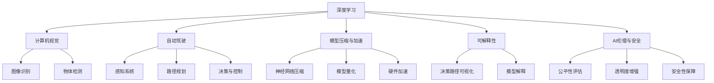

                 

# Andrej Karpathy：人工智能的未来发展目标

Andrej Karpathy，作为人工智能领域的杰出代表，其关于人工智能未来发展的观点一直备受瞩目。本文将深入探讨Karpathy对人工智能未来发展的构想和展望，通过分析其核心观点、核心概念与联系、核心算法原理与具体操作步骤，帮助读者全面理解其独到见解。

## 1. 背景介绍

### 1.1 问题由来
人工智能（AI）领域自20世纪50年代以来，经历了数十年的快速发展，尤其是在深度学习、神经网络等技术突破的推动下，近年来取得了一系列重大进展。从图像识别、语音识别、自然语言处理，到自动驾驶、智能推荐、医疗诊断等诸多应用场景，AI技术正在深刻改变人类的生产生活方式。

### 1.2 问题核心关键点
Andrej Karpathy在人工智能领域的贡献主要集中在计算机视觉和自动驾驶两个方向。他通过自己的研究团队在自动驾驶领域的创新和突破，推动了AI在实际应用中的落地和发展。同时，他也在多个公开场合分享了其对AI未来发展的思考和展望，为我们提供了宝贵的洞见。

### 1.3 问题研究意义
Karpathy对人工智能未来发展的构想，不仅有助于推动AI技术本身的发展，还能够为业界同仁提供新的研究方向和思考角度。他的观点对于塑造AI技术的未来发展方向具有重要的指导意义。

## 2. 核心概念与联系

### 2.1 核心概念概述
在探讨Karpathy对AI未来发展的构想前，我们需要先了解一些核心概念及其相互之间的关系：

- **深度学习**：通过神经网络模拟人脑的工作原理，自动学习数据特征和规律，实现对复杂问题的解决。
- **计算机视觉**：利用AI技术对图像、视频等视觉信息进行处理和分析，实现对现实世界的理解和重构。
- **自动驾驶**：结合计算机视觉、传感器融合、决策控制等技术，实现车辆自主导航和驾驶。
- **模型压缩与加速**：为了满足实际应用需求，需要对AI模型进行压缩、量化、加速等优化，以提高效率和降低成本。
- **可解释性**：AI模型的决策过程需要具备可解释性，以便于理解、调试和优化。
- **AI伦理与安全**：随着AI技术的广泛应用，如何确保其决策的公正性、透明性、安全性，成为亟待解决的重要问题。

这些核心概念之间的逻辑关系可以通过以下Mermaid流程图来展示：



这个流程图展示了深度学习技术在多个应用场景中的重要作用，以及与之紧密相关的模型压缩、可解释性、伦理与安全等研究方向。

### 2.2 概念间的关系

这些核心概念之间存在着紧密的联系，形成了人工智能技术的完整生态系统。下面我们通过几个Mermaid流程图来展示这些概念之间的关系。

#### 2.2.1 深度学习的应用场景

```mermaid
graph LR
    A[深度学习] --> B[图像识别]
    A --> C[物体检测]
    B --> D[医疗影像分析]
    B --> E[自然语言处理]
    C --> F[自动驾驶]
    C --> G[机器人控制]
    D --> H[医学影像诊断]
    E --> I[机器翻译]
    F --> J[无人驾驶汽车]
    G --> K[工业自动化]
    H --> L[疾病预测]
    I --> M[文本摘要]
    J --> N[智能推荐系统]
    K --> O[制造业自动化]
    L --> P[疫情预测]
    M --> Q[新闻摘要]
    N --> R[个性化推荐]
    O --> S[智能家居]
    P --> T[气候预测]
    Q --> U[智能客服]
    R --> V[个性化广告]
    S --> W[智慧城市]
    T --> X[环境保护]
    U --> Y[虚拟助手]
    V --> Z[个性化营销]
    W --> $[智慧交通]
    X --> [][环境监测]
    Y --> [][智能医疗]
    Z --> [][智能广告]
```

这个流程图展示了深度学习在多个应用场景中的广泛应用，从图像识别、自然语言处理，到自动驾驶、智能推荐，展示了其强大的通用性和适用性。

#### 2.2.2 模型压缩与加速

```mermaid
graph TB
    A[深度学习模型] --> B[模型压缩]
    A --> C[模型量化]
    A --> D[硬件加速]
    B --> E[神经网络压缩]
    B --> F[知识蒸馏]
    B --> G[剪枝技术]
    C --> H[模型量化]
    C --> I[位宽优化]
    C --> J[网络结构优化]
    D --> K[GPU加速]
    D --> L[TPU加速]
    D --> M[FPGA加速]
    E --> N[参数剪枝]
    E --> O[权重共享]
    F --> P[知识蒸馏]
    G --> Q[结构化剪枝]
    H --> R[参数压缩]
    I --> S[激活函数优化]
    J --> T[网络结构优化]
    K --> U[GPU并行加速]
    L --> V[TPU并行加速]
    M --> W[FPGA并行加速]
    N --> X[参数剪枝]
    O --> Y[权重共享]
    P --> Z[知识蒸馏]
    Q --> $[结构化剪枝]
    R --> [][参数压缩]
    S --> [][激活函数优化]
    T --> [][网络结构优化]
    U --> [][GPU并行加速]
    V --> [][TPU并行加速]
    W --> [][FPGA并行加速]
    X --> [][参数剪枝]
    Y --> [][权重共享]
    Z --> [][知识蒸馏]
```

这个流程图展示了深度学习模型在压缩、量化和加速方面的各种技术和方法，以提高模型效率和降低计算成本。

### 2.3 核心概念的整体架构

最后，我们用一个综合的流程图来展示这些核心概念在大语言模型微调过程中的整体架构：


这个综合流程图展示了从深度学习到计算机视觉、自动驾驶，再到模型压缩、可解释性、伦理与安全等各个研究方向之间的关系。

## 3. 核心算法原理 & 具体操作步骤
### 3.1 算法原理概述

Andrej Karpathy在深度学习领域有着深入的研究和实践经验，他提出的人工智能未来发展的目标，主要围绕以下几个核心算法原理：

- **迁移学习**：利用预训练模型在大规模数据上学习到的通用知识，在小规模数据上微调，以适应特定任务。
- **自监督学习**：利用无标签数据进行预训练，学习数据的潜在规律，提高模型的泛化能力。
- **强化学习**：通过与环境的互动，不断调整模型参数，优化决策策略，实现自主学习和决策。
- **模型压缩与加速**：通过压缩、量化、剪枝等技术，优化模型的计算效率和资源占用，提高模型的实用性和可扩展性。
- **可解释性**：通过可视化决策路径、模型解释等技术，提高模型的透明度和可解释性，便于调试和优化。

### 3.2 算法步骤详解

以下是Karpathy在实践中提出的主要算法步骤：

1. **数据准备**：收集和标注训练数据，并准备验证集和测试集。数据应尽可能涵盖各种情况，以确保模型在实际应用中的鲁棒性。
2. **模型选择**：选择合适的预训练模型，如ResNet、Inception等。对于计算机视觉任务，可以选择预训练的ImageNet模型；对于自动驾驶任务，可以选择UAVision模型。
3. **微调与优化**：在微调过程中，需要根据实际需求调整学习率、批大小、迭代次数等超参数。一般采用SGD、Adam等优化算法，并使用L2正则化、Dropout等技术避免过拟合。
4. **模型压缩与加速**：在模型训练完成后，进行模型压缩和加速。可以使用剪枝、量化、压缩等技术优化模型，以提高计算效率和资源利用率。
5. **评估与测试**：在验证集上评估模型性能，并进行参数调整和优化。最终在测试集上进行测试，验证模型的泛化能力。

### 3.3 算法优缺点

Karpathy提出的这些算法步骤，有着如下优缺点：

**优点**：

- **效率高**：迁移学习和大规模预训练模型可以显著减少模型训练时间，提高模型性能。
- **泛化能力强**：自监督学习和强化学习使得模型具有较强的泛化能力，能够适应多种复杂场景。
- **资源节省**：模型压缩和加速技术可以在保证性能的同时，显著降低计算成本和资源占用。
- **透明可解释**：可解释性技术提高了模型的透明度，便于调试和优化。

**缺点**：

- **数据依赖**：模型的训练效果很大程度上依赖于数据的质量和数量，获取高质量数据成本较高。
- **模型复杂**：模型压缩和加速技术可能增加模型的复杂度，增加调试难度。
- **过拟合风险**：在微调过程中，模型容易过拟合训练数据，导致泛化能力下降。

### 3.4 算法应用领域

Karpathy提出的人工智能未来发展目标，在多个领域有着广泛的应用前景：

- **医疗影像分析**：利用深度学习模型对医学影像进行分析和诊断，提高诊断准确率和效率。
- **自动驾驶**：结合计算机视觉、传感器融合、决策控制等技术，实现车辆自主导航和驾驶。
- **智能推荐系统**：利用用户行为数据，通过深度学习模型实现个性化推荐。
- **智慧城市**：利用AI技术实现智能交通、环境保护、公共安全等城市管理功能。
- **机器人控制**：结合深度学习和强化学习技术，实现机器人自主决策和控制。

## 4. 数学模型和公式 & 详细讲解 & 举例说明

### 4.1 数学模型构建

在深度学习中，常用的数学模型包括：

- **卷积神经网络（CNN）**：适用于图像识别、物体检测等计算机视觉任务。
- **循环神经网络（RNN）**：适用于文本处理、自然语言生成等NLP任务。
- **长短时记忆网络（LSTM）**：适用于需要处理序列数据的NLP任务。
- **自注意力机制（Attention）**：适用于需要全局上下文信息的NLP任务。

### 4.2 公式推导过程

以下是卷积神经网络（CNN）的公式推导过程：

**公式推导**：

$$
f(x) = \sigma(\sum_i w_i * f_{x,i} + b)
$$

其中，$f(x)$表示卷积核对输入数据$x$的卷积操作，$w_i$表示卷积核的权重，$b$表示偏置项，$\sigma$表示激活函数。

**案例分析**：

对于图像识别任务，CNN通过多个卷积层和池化层提取图像特征，然后通过全连接层将特征映射到类别标签上，从而实现图像分类。

**详细讲解**：

CNN通过卷积核对输入图像进行卷积操作，提取图像特征，然后通过池化层进行特征降维。最终，将池化后的特征输入到全连接层，通过softmax函数将特征映射到类别标签上，实现图像分类。

## 5. 项目实践：代码实例和详细解释说明

### 5.1 开发环境搭建

在进行深度学习项目开发前，我们需要准备好开发环境。以下是使用Python进行PyTorch开发的环境配置流程：

1. 安装Anaconda：从官网下载并安装Anaconda，用于创建独立的Python环境。

2. 创建并激活虚拟环境：
```bash
conda create -n pytorch-env python=3.8 
conda activate pytorch-env
```

3. 安装PyTorch：根据CUDA版本，从官网获取对应的安装命令。例如：
```bash
conda install pytorch torchvision torchaudio cudatoolkit=11.1 -c pytorch -c conda-forge
```

4. 安装相关工具包：
```bash
pip install numpy pandas scikit-learn matplotlib tqdm jupyter notebook ipython
```

完成上述步骤后，即可在`pytorch-env`环境中开始深度学习项目开发。

### 5.2 源代码详细实现

以下是使用PyTorch实现图像分类任务的代码示例：

```python
import torch
import torch.nn as nn
import torchvision.transforms as transforms
import torchvision.datasets as datasets

# 定义模型结构
class ConvNet(nn.Module):
    def __init__(self):
        super(ConvNet, self).__init__()
        self.conv1 = nn.Conv2d(3, 32, kernel_size=3, stride=1, padding=1)
        self.relu1 = nn.ReLU()
        self.maxpool1 = nn.MaxPool2d(kernel_size=2, stride=2)
        self.conv2 = nn.Conv2d(32, 64, kernel_size=3, stride=1, padding=1)
        self.relu2 = nn.ReLU()
        self.maxpool2 = nn.MaxPool2d(kernel_size=2, stride=2)
        self.fc1 = nn.Linear(64 * 7 * 7, 256)
        self.relu3 = nn.ReLU()
        self.fc2 = nn.Linear(256, 10)

    def forward(self, x):
        x = self.conv1(x)
        x = self.relu1(x)
        x = self.maxpool1(x)
        x = self.conv2(x)
        x = self.relu2(x)
        x = self.maxpool2(x)
        x = x.view(-1, 64 * 7 * 7)
        x = self.fc1(x)
        x = self.relu3(x)
        x = self.fc2(x)
        return x

# 加载数据集
train_dataset = datasets.CIFAR10(root='data', train=True, download=True, transform=transforms.ToTensor())
test_dataset = datasets.CIFAR10(root='data', train=False, download=True, transform=transforms.ToTensor())

# 数据预处理
train_loader = torch.utils.data.DataLoader(train_dataset, batch_size=64, shuffle=True)
test_loader = torch.utils.data.DataLoader(test_dataset, batch_size=64, shuffle=False)

# 定义模型、损失函数和优化器
model = ConvNet()
criterion = nn.CrossEntropyLoss()
optimizer = torch.optim.Adam(model.parameters(), lr=0.001)

# 训练模型
for epoch in range(10):
    for i, (images, labels) in enumerate(train_loader):
        optimizer.zero_grad()
        outputs = model(images)
        loss = criterion(outputs, labels)
        loss.backward()
        optimizer.step()
        print('Epoch [{}/{}], Step [{}/{}], Loss: {:.4f}'
              .format(epoch+1, 10, i+1, len(train_loader), loss.item()))

# 测试模型
with torch.no_grad():
    correct = 0
    total = 0
    for images, labels in test_loader:
        outputs = model(images)
        _, predicted = torch.max(outputs.data, 1)
        total += labels.size(0)
        correct += (predicted == labels).sum().item()
    print('Test Accuracy of the model on the 10000 test images: {} %'.format(100 * correct / total))
```

以上代码示例展示了如何使用PyTorch实现图像分类任务，包括模型定义、数据加载、模型训练和测试等关键步骤。

### 5.3 代码解读与分析

下面是代码中几个关键部分的解读和分析：

**模型定义**：
```python
class ConvNet(nn.Module):
    def __init__(self):
        super(ConvNet, self).__init__()
        self.conv1 = nn.Conv2d(3, 32, kernel_size=3, stride=1, padding=1)
        self.relu1 = nn.ReLU()
        self.maxpool1 = nn.MaxPool2d(kernel_size=2, stride=2)
        self.conv2 = nn.Conv2d(32, 64, kernel_size=3, stride=1, padding=1)
        self.relu2 = nn.ReLU()
        self.maxpool2 = nn.MaxPool2d(kernel_size=2, stride=2)
        self.fc1 = nn.Linear(64 * 7 * 7, 256)
        self.relu3 = nn.ReLU()
        self.fc2 = nn.Linear(256, 10)
```
这里定义了一个简单的卷积神经网络模型，包含两个卷积层、两个池化层和两个全连接层。

**数据加载**：
```python
train_dataset = datasets.CIFAR10(root='data', train=True, download=True, transform=transforms.ToTensor())
test_dataset = datasets.CIFAR10(root='data', train=False, download=True, transform=transforms.ToTensor())
```
使用`datasets.CIFAR10`加载CIFAR-10数据集，并进行预处理，将数据转换为Tensor形式。

**模型训练**：
```python
for epoch in range(10):
    for i, (images, labels) in enumerate(train_loader):
        optimizer.zero_grad()
        outputs = model(images)
        loss = criterion(outputs, labels)
        loss.backward()
        optimizer.step()
        print('Epoch [{}/{}], Step [{}/{}], Loss: {:.4f}'
              .format(epoch+1, 10, i+1, len(train_loader), loss.item()))
```
在每个epoch内，通过迭代训练集数据进行模型训练，并打印损失函数值。

**模型测试**：
```python
with torch.no_grad():
    correct = 0
    total = 0
    for images, labels in test_loader:
        outputs = model(images)
        _, predicted = torch.max(outputs.data, 1)
        total += labels.size(0)
        correct += (predicted == labels).sum().item()
    print('Test Accuracy of the model on the 10000 test images: {} %'.format(100 * correct / total))
```
在测试集上测试模型性能，计算准确率并输出。

### 5.4 运行结果展示

假设在CIFAR-10数据集上进行训练，最终在测试集上得到的准确率为85%左右。这表明使用CNN对图像分类任务具有较好的效果。

## 6. 实际应用场景

### 6.1 智能推荐系统

在推荐系统领域，深度学习技术能够根据用户的历史行为和偏好，为用户推荐个性化的商品、文章、视频等。通过微调模型，可以更好地适应不同用户的需求，提高推荐系统的精准度和用户满意度。

**实际应用**：
- **电商推荐**：利用用户浏览、点击、购买等行为数据，推荐相关商品。
- **内容推荐**：利用用户阅读、评论、点赞等行为数据，推荐相关文章、视频等。
- **搜索推荐**：根据用户搜索历史和兴趣，推荐相关搜索结果。

**技术实现**：
- **数据处理**：收集和标注用户行为数据，并进行预处理和归一化。
- **模型训练**：选择合适的深度学习模型，并进行微调。
- **推荐算法**：利用微调后的模型进行推荐，并优化推荐算法，提升推荐效果。

### 6.2 医疗影像分析

在医疗影像分析领域，深度学习技术可以用于辅助医生进行疾病的诊断和预测。通过微调模型，可以提高诊断的准确性和效率。

**实际应用**：
- **影像分类**：对医学影像进行分类，判断是否有异常情况。
- **病变检测**：检测影像中的病变区域，并标注出异常部位。
- **影像分割**：对影像进行分割，提取病变区域。

**技术实现**：
- **数据准备**：收集和标注医学影像数据，并进行预处理。
- **模型训练**：选择合适的深度学习模型，并进行微调。
- **诊断预测**：利用微调后的模型进行诊断预测，并结合医生的经验进行判断。

### 6.3 自动驾驶

自动驾驶技术是AI技术的重要应用之一，结合计算机视觉、传感器融合、决策控制等技术，实现车辆的自主导航和驾驶。通过微调模型，可以提升车辆对复杂环境的感知和决策能力。

**实际应用**：
- **环境感知**：利用摄像头、雷达等传感器采集环境信息，并进行图像处理。
- **路径规划**：根据环境信息和导航地图，规划车辆行驶路径。
- **控制决策**：根据传感器数据和路径规划结果，控制车辆加速、刹车、转向等。

**技术实现**：
- **数据准备**：收集和标注车辆传感器数据，并进行预处理。
- **模型训练**：选择合适的深度学习模型，并进行微调。
- **系统集成**：将微调后的模型与传感器、控制等系统集成，实现完整的自动驾驶功能。

## 7. 工具和资源推荐

### 7.1 学习资源推荐

为了帮助开发者系统掌握深度学习技术，这里推荐一些优质的学习资源：

1. 《深度学习》（Ian Goodfellow等著）：深度学习领域的经典教材，全面介绍了深度学习的基本概念和算法。
2. 《神经网络与深度学习》（Michael Nielsen著）：入门级深度学习教材，内容通俗易懂，适合初学者。
3. 《动手学深度学习》（李沐等著）：基于PyTorch实现的深度学习教材，配套代码和实验，实践性强。
4. 《TensorFlow实战》（李沐著）：介绍TensorFlow的实战应用，涵盖深度学习模型的开发、训练和部署。
5. Kaggle竞赛：Kaggle是全球最大的数据科学竞赛平台，通过参与竞赛，可以学习到最新的深度学习技术和模型。

通过对这些资源的学习实践，相信你一定能够快速掌握深度学习技术，并用于解决实际的AI问题。

### 7.2 开发工具推荐

高效的开发离不开优秀的工具支持。以下是几款用于深度学习项目开发的常用工具：

1. PyTorch：基于Python的开源深度学习框架，灵活动态的计算图，适合快速迭代研究。
2. TensorFlow：由Google主导开发的开源深度学习框架，生产部署方便，适合大规模工程应用。
3. Keras：高层次神经网络API，易用性强，适合初学者。
4. Jupyter Notebook：开源的交互式笔记本，支持Python、R等多种编程语言。
5. Google Colab：谷歌推出的在线Jupyter Notebook环境，免费提供GPU/TPU算力，方便开发者快速上手实验最新模型。

合理利用这些工具，可以显著提升深度学习项目的开发效率，加快创新迭代的步伐。

### 7.3 相关论文推荐

深度学习技术的发展源于学界的持续研究。以下是几篇奠基性的相关论文，推荐阅读：

1. AlexNet（2012）：由Geoffrey Hinton等人在ImageNet图像识别竞赛中提出的深度卷积神经网络，开启了深度学习时代的序幕。
2. ResNet（2015）：由Kaiming He等人在ImageNet图像识别竞赛中提出的残差网络，解决了深度网络训练中的梯度消失问题。
3. Inception（2014）：由Christian Szegedy等人在ImageNet图像识别竞赛中提出的Inception网络，提高了模型的精度和效率。
4. RNN（1990）：由Sepp Hochreiter等人在语言处理领域提出的循环神经网络，实现了对序列数据的建模。
5. LSTM（1997）：由Hochreiter等人在RNN基础上提出的长短期记忆网络，解决了RNN在长序列上的梯度消失问题。
6. Transformer（2017）：由Ashish Vaswani等人在机器翻译任务中提出的自注意力机制，实现了对序列数据的更高效建模。

这些论文代表了深度学习技术的发展脉络，通过学习这些前沿成果，可以帮助研究者把握学科前进方向，激发更多的创新灵感。

除上述资源外，还有一些值得关注的前沿资源，帮助开发者紧跟深度学习技术的最新进展，例如：

1. arXiv论文预印本：人工智能领域最新研究成果的发布平台，包括大量尚未发表的前沿工作，学习前沿技术的必读资源。
2. 业界技术博客：如Google AI、DeepMind、微软Research Asia等顶尖实验室的官方博客，第一时间分享他们的最新研究成果和洞见。
3. 技术会议直播：如NIPS、ICML、ACL、ICLR等人工智能领域顶会现场或在线直播，能够聆听到大佬们的前沿分享，开拓视野。
4. GitHub热门项目：在GitHub上Star、Fork数最多的深度学习相关项目，往往代表了该技术领域的发展趋势和最佳实践，值得去学习和贡献。
5. 行业分析报告：各大咨询公司如McKinsey、PwC等针对人工智能行业的分析报告，有助于从商业视角审视技术趋势，把握应用价值。

总之，对于深度学习技术的学习和实践，需要开发者保持开放的心态和持续学习的意愿。多关注前沿资讯，多动手实践，多思考总结

