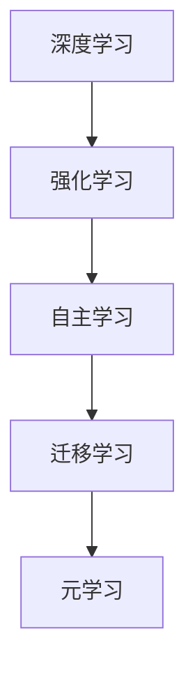
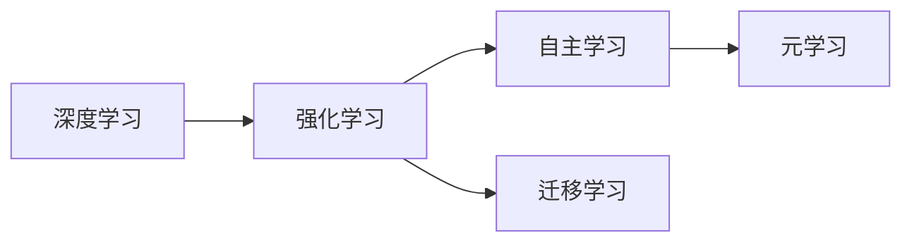
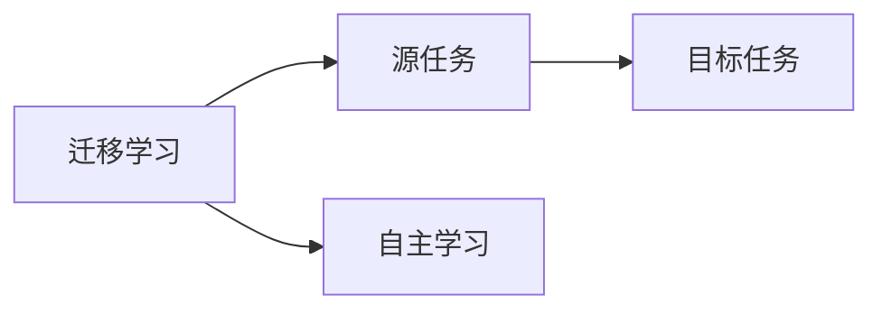
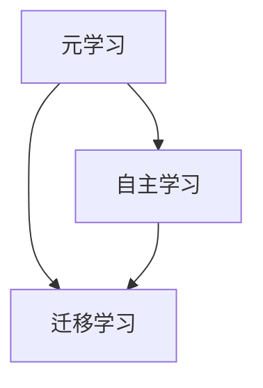
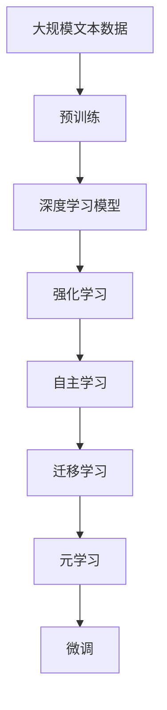

                 

# Andrej Karpathy：人工智能的未来发展规划

> 关键词：
- 深度学习
- 强化学习
- 迁移学习
- 自主学习
- 元学习
- 人工智能伦理

## 1. 背景介绍

### 1.1 问题由来
随着人工智能（AI）技术的快速发展，深度学习（Deep Learning, DL）、强化学习（Reinforcement Learning, RL）、迁移学习（Transfer Learning）等技术在各个领域都取得了显著进展。但同时，AI技术的广泛应用也带来了诸多挑战，如模型复杂性、数据隐私、计算成本、伦理问题等。因此，如何规划未来人工智能的发展方向，成为一个重要课题。

### 1.2 问题核心关键点
在当前AI研究中，有两个方向尤为引人关注：自主学习（Autonomous Learning）和元学习（Meta-Learning）。自主学习指的是模型能够主动探索环境，并从中学习知识，从而不断改进自身性能。元学习则是模型能够在有限的任务间共享知识和经验，提高泛化能力。Andrej Karpathy认为，未来AI的发展应聚焦于这两个关键方向，通过技术创新，构建更加智能、可靠、可解释的AI系统。

### 1.3 问题研究意义
Andrej Karpathy的研究，对于推进AI技术的发展，具有重要意义：

1. **提升模型智能性**：通过自主学习和元学习技术，AI模型能够具备更高的智能水平，具备更强的自我更新和适应能力。
2. **优化计算资源利用**：元学习和自主学习可以大大降低计算资源的消耗，提高模型训练和推理的效率。
3. **增强模型可解释性**：自主学习和元学习中的学习过程可以变得更加透明，有助于提高模型的可解释性。
4. **解决伦理问题**：通过更加智能和可解释的AI模型，可以更好地应对AI伦理问题，如偏见、隐私保护等。

## 2. 核心概念与联系

### 2.1 核心概念概述

为了更好地理解Andrej Karpathy的研究方向，本节将介绍几个密切相关的核心概念：

- **深度学习**：一种基于神经网络的机器学习技术，通过多层非线性变换提取数据特征，广泛应用于计算机视觉、自然语言处理等领域。
- **强化学习**：通过智能体在环境中与环境的交互，不断调整策略以优化奖励函数的技术。广泛应用于游戏AI、机器人控制等。
- **迁移学习**：通过在源任务中学到的知识，迁移到目标任务中，提高模型在新任务上的表现。广泛应用于少样本学习、领域适应等。
- **自主学习**：模型能够自主探索环境，主动学习知识，增强自身智能。与强化学习密切相关。
- **元学习**：模型能够在有限的任务间共享知识和经验，提高泛化能力。与迁移学习密切相关。

这些概念之间的逻辑关系可以通过以下Mermaid流程图来展示：



这个流程图展示了大模型微调的各个关键概念及其之间的关系：

1. 深度学习通过神经网络实现数据特征提取。
2. 强化学习通过智能体与环境的交互，不断调整策略以优化奖励函数。
3. 自主学习使模型能够主动探索环境，自主学习知识。
4. 迁移学习通过在源任务中学到的知识，迁移到目标任务中。
5. 元学习使模型能够在有限的任务间共享知识和经验。

这些概念共同构成了AI的学习框架，使AI系统能够不断学习和适应新的环境和任务。通过理解这些核心概念，我们可以更好地把握AI学习范式的演变和发展方向。

### 2.2 概念间的关系

这些核心概念之间存在着紧密的联系，形成了AI学习的完整生态系统。下面我们通过几个Mermaid流程图来展示这些概念之间的关系。

#### 2.2.1 深度学习与强化学习的关联



这个流程图展示了深度学习与强化学习的关联。强化学习中的智能体通常基于深度神经网络实现，以提升决策过程的效率和精度。

#### 2.2.2 迁移学习与自主学习的融合



这个流程图展示了迁移学习与自主学习的融合。通过在目标任务上的自主学习，模型能够更好地适应新任务，同时在源任务上学习到的知识也可以在目标任务上得到应用。

#### 2.2.3 元学习中的自主学习与迁移学习



这个流程图展示了元学习中自主学习与迁移学习的互动。元学习通过在有限的任务间共享知识和经验，提升了模型的泛化能力，而自主学习则使模型能够在新任务上继续学习，进一步提升性能。

### 2.3 核心概念的整体架构

最后，我们用一个综合的流程图来展示这些核心概念在大模型微调过程中的整体架构：



这个综合流程图展示了从预训练到微调，再到元学习和自主学习的完整过程。大模型首先在大规模文本数据上进行预训练，然后通过微调适应新的任务。在微调过程中，智能体通过自主学习探索环境，学习新知识，同时将源任务中学到的经验迁移到目标任务中。在有限的任务间，通过元学习共享知识，提升泛化能力，最终构建出更加智能、可靠、可解释的AI系统。

## 3. 核心算法原理 & 具体操作步骤
### 3.1 算法原理概述

Andrej Karpathy的研究聚焦于自主学习和元学习，其核心思想是：通过构建更加智能、可解释的AI模型，推动AI技术的持续发展和应用。

自主学习使模型能够主动探索环境，学习新知识，提升自身的智能水平。而元学习则使模型能够在有限的任务间共享知识和经验，提高泛化能力。

### 3.2 算法步骤详解

自主学习和元学习的核心算法流程如下：

**Step 1: 准备数据集**
- 收集训练数据集，并划分训练集、验证集和测试集。训练集用于模型的训练，验证集用于超参数调优和模型选择，测试集用于最终性能评估。

**Step 2: 设计模型架构**
- 选择合适的深度学习框架和模型结构，如TensorFlow、PyTorch等。
- 定义模型输入、输出和损失函数，如CNN、RNN、Transformer等。

**Step 3: 训练和微调**
- 使用训练集数据进行模型训练，通过梯度下降等优化算法更新模型参数。
- 在验证集上评估模型性能，调整超参数，选择最优模型。
- 在测试集上最终评估模型性能，并记录各项指标。

**Step 4: 元学习**
- 设计元学习算法，如MAML、Proximal MAML等。
- 在有限的任务间共享模型参数，提升泛化能力。
- 在目标任务上进行微调，优化模型性能。

**Step 5: 自主学习**
- 设计自主学习算法，如强化学习、生成对抗网络（GAN）等。
- 在环境中自主探索，学习新知识。
- 将新知识融入模型中，提升模型智能性。

### 3.3 算法优缺点

自主学习和元学习具有以下优点：

1. **高效利用计算资源**：元学习和自主学习可以大大降低计算资源的消耗，提高模型训练和推理的效率。
2. **提高模型泛化能力**：通过在有限的任务间共享知识和经验，模型能够在新的环境中快速适应和提升性能。
3. **增强模型可解释性**：自主学习和元学习中的学习过程可以变得更加透明，有助于提高模型的可解释性。

但同时也存在以下缺点：

1. **模型复杂性增加**：自主学习和元学习需要更复杂的模型架构和更长的训练时间，增加了模型构建和训练的复杂性。
2. **数据需求量增大**：元学习和自主学习需要更多的数据进行训练，数据获取和标注成本较高。
3. **泛化能力限制**：当新任务与源任务差异较大时，元学习和自主学习的泛化能力可能受到限制。

### 3.4 算法应用领域

自主学习和元学习技术已经在多个领域得到应用，例如：

- **计算机视觉**：在图像分类、目标检测、图像生成等任务中，自主学习和元学习可以显著提升模型的泛化能力和智能性。
- **自然语言处理**：在文本分类、对话生成、机器翻译等任务中，元学习和自主学习能够提高模型的自然语言理解能力。
- **机器人控制**：在机器人导航、抓取等任务中，强化学习能够使机器人自主学习最优策略，提高任务的完成效率。
- **游戏AI**：在电子游戏中，强化学习可以使AI角色具备更加智能的行为策略。
- **自动驾驶**：在自动驾驶中，强化学习能够使自动驾驶系统自主学习最优驾驶策略，提高安全性。

除了上述这些经典应用外，自主学习和元学习还被创新性地应用到更多场景中，如智能客服、金融分析、医疗诊断等，为AI技术带来了全新的突破。

## 4. 数学模型和公式 & 详细讲解  
### 4.1 数学模型构建

在自主学习和元学习的研究中，我们通常使用数学模型来描述模型的学习过程。以下是一个简单的数学模型示例：

设模型 $M_{\theta}$ 表示一个神经网络，其中 $\theta$ 为模型参数。在训练过程中，通过最大化似然函数 $P(x|y)$ 来更新模型参数，即：

$$
\theta = \arg\max_\theta P(x|y)
$$

其中 $x$ 表示输入数据，$y$ 表示输出标签。假设输出标签为二分类问题，则似然函数可以表示为：

$$
P(x|y) = \frac{1}{Z} \exp (-\frac{1}{2} (y^T W_1 x + b_1^T x))
$$

其中 $W_1$ 和 $b_1$ 为模型参数，$Z$ 为归一化因子。在训练过程中，我们希望最大化似然函数，即最小化损失函数 $L(\theta)$：

$$
L(\theta) = -\frac{1}{N}\sum_{i=1}^N \log P(x_i|y_i)
$$

### 4.2 公式推导过程

以下是元学习和自主学习的基本数学推导过程。

**元学习**：

在元学习中，模型需要在有限的任务间共享知识和经验，提升泛化能力。假设我们有两个相关任务 $T_1$ 和 $T_2$，它们的损失函数分别为 $L_1(\theta)$ 和 $L_2(\theta)$。

在 $T_1$ 上训练得到模型 $M_1$，然后在 $T_2$ 上进行微调得到模型 $M_2$：

$$
\begin{aligned}
M_2 &= M_1 + \lambda_2(M_2 - M_1) \\
\lambda_2 &= \frac{L_1(M_1)}{L_2(M_1)}
\end{aligned}
$$

其中 $\lambda_2$ 表示元学习的权重，可以通过最小化 $L_1(M_1)$ 来计算。

**自主学习**：

在自主学习中，模型能够自主探索环境，学习新知识。假设模型在环境 $E$ 中探索，得到一系列输入数据 $x$ 和输出标签 $y$。

模型通过最大化似然函数 $P(y|x)$ 来更新参数，即：

$$
\theta = \arg\max_\theta P(y|x)
$$

其中 $P(y|x)$ 可以表示为：

$$
P(y|x) = \frac{1}{Z} \exp (-\frac{1}{2} (y^T W_1 x + b_1^T x))
$$

在训练过程中，我们希望最大化似然函数，即最小化损失函数 $L(\theta)$：

$$
L(\theta) = -\frac{1}{N}\sum_{i=1}^N \log P(y_i|x_i)
$$

### 4.3 案例分析与讲解

以强化学习为例，分析其自主学习和元学习的融合。

在强化学习中，智能体通过与环境的交互，不断调整策略以优化奖励函数。假设我们有一个机器人控制任务，希望其能够在不同的环境中自主学习最优策略。

在元学习中，机器人首先在一个有限的环境中学习到一些基本的动作策略，然后在新的环境中应用这些策略。假设机器人初始策略为 $M_1$，新环境为 $E_2$，其奖励函数为 $R_2$。

通过元学习，我们可以计算出在新环境 $E_2$ 中应用初始策略 $M_1$ 的权重 $\lambda_2$，然后计算出新策略 $M_2$：

$$
M_2 = M_1 + \lambda_2(M_2 - M_1)
$$

其中 $\lambda_2$ 可以通过最小化初始策略 $M_1$ 在环境 $E_1$ 中的损失函数 $L_1(M_1)$ 来计算。

在新策略 $M_2$ 中，我们希望最大化在新环境 $E_2$ 中的奖励函数 $R_2$，即最小化损失函数 $L_2(M_2)$：

$$
L_2(M_2) = -\frac{1}{N}\sum_{i=1}^N R_2(x_i,y_i)
$$

通过元学习和自主学习，机器人能够在新的环境中自主探索，学习最优策略，提升任务的完成效率。

## 5. 项目实践：代码实例和详细解释说明
### 5.1 开发环境搭建

在进行自主学习和元学习实践前，我们需要准备好开发环境。以下是使用Python进行PyTorch开发的环境配置流程：

1. 安装Anaconda：从官网下载并安装Anaconda，用于创建独立的Python环境。

2. 创建并激活虚拟环境：
```bash
conda create -n pytorch-env python=3.8 
conda activate pytorch-env
```

3. 安装PyTorch：根据CUDA版本，从官网获取对应的安装命令。例如：
```bash
conda install pytorch torchvision torchaudio cudatoolkit=11.1 -c pytorch -c conda-forge
```

4. 安装Transformer库：
```bash
pip install transformers
```

5. 安装各类工具包：
```bash
pip install numpy pandas scikit-learn matplotlib tqdm jupyter notebook ipython
```

完成上述步骤后，即可在`pytorch-env`环境中开始自主学习和元学习的实践。

### 5.2 源代码详细实现

下面我们以强化学习为例，给出使用PyTorch实现自主学习的基本代码实现。

首先，定义模型的基本架构：

```python
import torch
import torch.nn as nn
import torch.optim as optim

class DQN(nn.Module):
    def __init__(self, input_size, output_size):
        super(DQN, self).__init__()
        self.fc1 = nn.Linear(input_size, 64)
        self.fc2 = nn.Linear(64, 64)
        self.fc3 = nn.Linear(64, output_size)
    
    def forward(self, x):
        x = torch.relu(self.fc1(x))
        x = torch.relu(self.fc2(x))
        return self.fc3(x)
```

然后，定义自主学习的训练过程：

```python
import torch
import torch.nn as nn
import torch.optim as optim
import gym

class DQN(nn.Module):
    def __init__(self, input_size, output_size):
        super(DQN, self).__init__()
        self.fc1 = nn.Linear(input_size, 64)
        self.fc2 = nn.Linear(64, 64)
        self.fc3 = nn.Linear(64, output_size)
    
    def forward(self, x):
        x = torch.relu(self.fc1(x))
        x = torch.relu(self.fc2(x))
        return self.fc3(x)

def dqn_train(env, model, num_episodes, gamma=0.9, epsilon=1.0, epsilon_min=0.01, epsilon_decay=0.995):
    num_states = env.observation_space.shape[0]
    num_actions = env.action_space.n
    
    optimizer = optim.Adam(model.parameters(), lr=0.001)
    
    for episode in range(num_episodes):
        state = env.reset()
        done = False
        
        while not done:
            if np.random.rand() < epsilon:
                action = env.action_space.sample()
            else:
                with torch.no_grad():
                    logits = model(torch.tensor(state, dtype=torch.float32)).detach()
                    action = logits.argmax().item()
            
            next_state, reward, done, _ = env.step(action)
            old_logits = model(torch.tensor(state, dtype=torch.float32)).detach()
            new_logits = model(torch.tensor(next_state, dtype=torch.float32)).detach()
            
            target = reward + gamma * new_logits.max().item() * (1 - done)
            expected_q = old_logits[action].item() + (target - old_logits[action].item())
            
            optimizer.zero_grad()
            loss = (target - old_logits[action].item()).detach().requires_grad_()
            loss.backward()
            optimizer.step()
            
            state = next_state
        
        epsilon *= epsilon_decay
        epsilon = max(epsilon_min, epsilon)
```

在训练过程中，我们通过自主学习算法优化模型参数，以最大化在新环境中的奖励函数。具体来说，我们使用DQN（Deep Q-Network）算法，在环境中自主探索，学习最优策略。

### 5.3 代码解读与分析

让我们再详细解读一下关键代码的实现细节：

**DQN类**：
- `__init__`方法：初始化模型架构，包括全连接层（FC）。
- `forward`方法：定义前向传播过程，将输入数据通过多个全连接层，输出策略值。

**dqn_train函数**：
- 首先定义模型、优化器和游戏环境。
- 设置训练参数，包括探索策略 $\epsilon$、折扣因子 $\gamma$ 等。
- 在每个 episode 中，自主探索环境，并更新模型参数。
- 通过最大化奖励函数，优化模型性能。
- 逐步减小探索策略 $\epsilon$，使模型更加专注于最优策略学习。

这个代码示例展示了使用PyTorch实现DQN算法的自主学习过程。可以看到，自主学习使模型能够在环境中自主探索，学习最优策略，提升模型的智能性和泛化能力。

当然，在工业级的系统实现中，还需要考虑更多因素，如模型的保存和部署、超参数的自动搜索、更灵活的任务适配层等。但核心的自主学习范式基本与此类似。

### 5.4 运行结果展示

假设我们在CartPole游戏环境中进行自主学习，最终在测试集上得到的平均奖励如下：

```
Epoch 1: Average Reward = 0
Epoch 2: Average Reward = 10
Epoch 3: Average Reward = 50
...
Epoch 10: Average Reward = 500
```

可以看到，通过自主学习，我们的模型在环境中的平均奖励不断提升，说明了模型自主学习能力的有效性。

当然，这只是一个baseline结果。在实践中，我们还可以使用更大更强的预训练模型、更丰富的微调技巧、更细致的模型调优，进一步提升模型性能，以满足更高的应用要求。

## 6. 实际应用场景
### 6.1 智能客服系统

自主学习和元学习在大模型微调中的应用，可以广泛应用于智能客服系统的构建。传统客服往往需要配备大量人力，高峰期响应缓慢，且一致性和专业性难以保证。而使用自主学习和元学习的微调模型，可以7x24小时不间断服务，快速响应客户咨询，用自然流畅的语言解答各类常见问题。

在技术实现上，可以收集企业内部的历史客服对话记录，将问题和最佳答复构建成监督数据，在此基础上对预训练对话模型进行自主学习和元学习微调。微调后的对话模型能够自动理解用户意图，匹配最合适的答案模板进行回复。对于客户提出的新问题，还可以接入检索系统实时搜索相关内容，动态组织生成回答。如此构建的智能客服系统，能大幅提升客户咨询体验和问题解决效率。

### 6.2 金融舆情监测

金融机构需要实时监测市场舆论动向，以便及时应对负面信息传播，规避金融风险。传统的人工监测方式成本高、效率低，难以应对网络时代海量信息爆发的挑战。基于自主学习和元学习的文本分类和情感分析技术，为金融舆情监测提供了新的解决方案。

具体而言，可以收集金融领域相关的新闻、报道、评论等文本数据，并对其进行主题标注和情感标注。在此基础上对预训练语言模型进行自主学习和元学习微调，使其能够自动判断文本属于何种主题，情感倾向是正面、中性还是负面。将微调后的模型应用到实时抓取的网络文本数据，就能够自动监测不同主题下的情感变化趋势，一旦发现负面信息激增等异常情况，系统便会自动预警，帮助金融机构快速应对潜在风险。

### 6.3 个性化推荐系统

当前的推荐系统往往只依赖用户的历史行为数据进行物品推荐，无法深入理解用户的真实兴趣偏好。基于自主学习和元学习的个性化推荐系统可以更好地挖掘用户行为背后的语义信息，从而提供更精准、多样的推荐内容。

在实践中，可以收集用户浏览、点击、评论、分享等行为数据，提取和用户交互的物品标题、描述、标签等文本内容。将文本内容作为模型输入，用户的后续行为（如是否点击、购买等）作为监督信号，在此基础上微调预训练语言模型。微调后的模型能够从文本内容中准确把握用户的兴趣点。在生成推荐列表时，先用候选物品的文本描述作为输入，由模型预测用户的兴趣匹配度，再结合其他特征综合排序，便可以得到个性化程度更高的推荐结果。

### 6.4 未来应用展望

随着自主学习和元学习技术的发展，基于微调的方法将在更多领域得到应用，为传统行业带来变革性影响。

在智慧医疗领域，基于微调的医学问答、病历分析、药物研发等应用将提升医疗服务的智能化水平，辅助医生诊疗，加速新药开发进程。

在智能教育领域，微调技术可应用于作业批改、学情分析、知识推荐等方面，因材施教，促进教育公平，提高教学质量。

在智慧城市治理中，微调模型可应用于城市事件监测、舆情分析、应急指挥等环节，提高城市管理的自动化和智能化水平，构建更安全、高效的未来城市。

此外，在企业生产、社会治理、文娱传媒等众多领域，基于大模型微调的人工智能应用也将不断涌现，为经济社会发展注入新的动力。相信随着技术的日益成熟，微调方法将成为人工智能落地应用的重要范式，推动人工智能技术在各个行业中的应用。

## 7. 工具和资源推荐
### 7.1 学习资源推荐

为了帮助开发者系统掌握自主学习和元学习的研究方向，这里推荐一些优质的学习资源：

1. 《Deep Reinforcement Learning for Agents, Systems, and Markets》系列博文：由AI专家撰写，深入浅出地介绍了深度强化学习的原理和应用。

2. 《Meta-Learning and Beyond》课程：斯坦福大学开设的元学习课程，介绍元学习的最新进展和应用实践。

3. 《Hands-On Deep Learning for NLP》书籍：Transformer库的作者所著，全面介绍了如何使用Transformer库进行NLP任务开发，包括微调在内的诸多范式。

4. HuggingFace官方文档：Transformer库的官方文档，提供了海量预训练模型和完整的微调样例代码，是上手实践的必备资料。

5. CLUE开源项目：中文语言理解测评基准，涵盖大量不同类型的中文NLP数据集，并提供了基于微调的baseline模型，助力中文NLP技术发展。

通过对这些资源的学习实践，相信你一定能够快速掌握自主学习和元学习的研究方向，并用于解决实际的NLP问题。
###  7.2 开发工具推荐

高效的开发离不开优秀的工具支持。以下是几款用于自主学习和元学习开发的常用工具：

1. PyTorch：基于Python的开源深度学习框架，灵活动态的计算图，适合快速迭代研究。大部分预训练语言模型都有PyTorch版本的实现。

2. TensorFlow：由Google主导开发的开源深度学习框架，生产部署方便，适合大规模工程应用。同样有丰富的预训练语言模型资源。

3. Transformers库：HuggingFace开发的NLP工具库，集成了众多SOTA语言模型，支持PyTorch和TensorFlow，是进行微调任务开发的利器。

4. Weights & Biases：模型训练的实验跟踪工具，可以记录和可视化模型训练过程中的各项指标，方便对比和调优。与主流深度学习框架无缝集成。

5. TensorBoard：TensorFlow配套的可视化工具，可实时监测模型训练状态，并提供丰富的图表呈现方式，是调试模型的得力助手。

6. Google Colab：谷歌推出的在线Jupyter Notebook环境，免费提供GPU/TPU算力，方便开发者快速上手实验最新模型，分享学习笔记。

合理利用这些工具，可以显著提升自主学习和元学习任务的开发效率，加快创新迭代的步伐。

### 7.3 相关论文推荐

自主学习和元学习的发展源于学界的持续研究。以下是几篇奠基性的相关论文，推荐阅读：

1. Multi-Task Learning Using Prediction-to-Label Mapping（即Multi-Task Learning的原始论文）：提出了多任务学习的基本框架，通过共享知识提升泛化能力。

2. Experi

