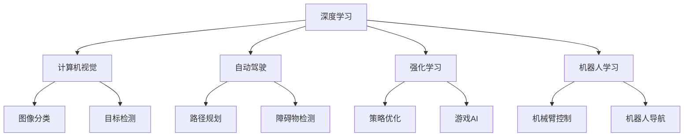

                 

# Andrej Karpathy：人工智能的未来机遇

人工智能(AI)领域正处于前所未有的快速发展时期，众多顶尖研究者、工程师和领导者都在积极探索AI的未来机遇。在这其中，斯坦福大学计算机科学教授Andrej Karpathy以其深厚的理论功底和丰富的实践经验，成为AI领域的引领者之一。本文将深入探讨Andrej Karpathy关于AI未来机遇的见解，以期为读者提供启发和指导。

## 1. 背景介绍

Andrej Karpathy是当今AI领域最具影响力的研究者之一，他在计算机视觉、自动驾驶、强化学习等多个领域都做出了开创性贡献。他的研究成果不仅推动了学术界的发展，也为工业界带来了实际应用价值。在本书中，我们将深入了解他的理论研究与实际应用，以及他对AI未来机遇的思考。

### 1.1 研究背景

Andrej Karpathy的研究工作跨越了计算机科学和工程学的多个子领域，包括计算机视觉、机器学习、强化学习、自动驾驶等。他的主要研究方向包括深度学习、计算机视觉和机器人学习等，对人工智能的未来发展和应用具有深远的影响。

Karpathy的研究成果涵盖多个国际顶级会议和期刊，如ICML、ICCV、NIPS、IEEE T-ROBSN、JMLR等。他的开源项目，如Caffe2、FastAI等，也推动了机器学习和深度学习的普及和发展。

## 2. 核心概念与联系

### 2.1 核心概念概述

为了更好地理解Andrej Karpathy的AI未来机遇，我们首先介绍几个核心概念及其相互联系：

- **深度学习(Deep Learning)**：通过多层次神经网络实现的学习方法，能够自动提取数据中的特征，并应用于各种任务，如图像识别、语音识别、自然语言处理等。

- **计算机视觉(Computer Vision)**：研究如何让计算机“看”，通过图像和视频数据实现识别、分类、跟踪等任务。

- **自动驾驶(Autonomous Driving)**：利用AI技术使车辆具备自主决策和导航能力，实现无人驾驶。

- **强化学习(Reinforcement Learning)**：通过奖励和惩罚机制，使AI系统能够在与环境的交互中学习最优策略。

- **机器人学习(Robot Learning)**：让机器人通过学习实现复杂的物理操作和决策，提升自主性和适应性。

### 2.2 概念间的关系

以上概念通过以下Mermaid流程图展示了它们之间的相互联系和互动：



这个流程图展示了深度学习与其他几个概念之间的紧密联系：

1. **计算机视觉**：深度学习模型能够有效处理图像和视频数据，实现图像分类、目标检测等任务。
2. **自动驾驶**：深度学习用于传感器数据处理和路径规划，强化学习用于决策和导航。
3. **强化学习**：深度学习用于模型训练，强化学习用于决策和策略优化。
4. **机器人学习**：深度学习用于传感器数据处理和环境建模，强化学习用于控制和决策。

### 2.3 核心概念的整体架构

通过这些核心概念的互动，构成了人工智能的完整生态系统：


这个综合流程图展示了深度学习与其他几个概念之间的互动关系和整体架构。

## 3. 核心算法原理 & 具体操作步骤

### 3.1 算法原理概述

Andrej Karpathy的研究工作涉及深度学习、计算机视觉、强化学习等多个领域，其算法原理也覆盖了这些方面。下面我们将详细探讨这些算法原理及其操作步骤。

- **深度学习算法**：深度学习通过多层次神经网络实现自动特征提取和分类，其核心原理包括反向传播算法和梯度下降优化。

- **计算机视觉算法**：计算机视觉算法包括图像分类、目标检测、语义分割等，主要使用卷积神经网络(CNN)和循环神经网络(RNN)。

- **强化学习算法**：强化学习算法通过奖励和惩罚机制优化决策策略，主要使用深度Q网络(DQN)和策略梯度方法。

### 3.2 算法步骤详解

为了更好地理解Andrej Karpathy的算法步骤，我们将详细介绍他在这些领域的工作流程。

#### 3.2.1 深度学习算法步骤

1. **数据准备**：收集和预处理训练数据，包括数据清洗、标注、扩充等。

2. **模型设计**：选择合适的神经网络结构和参数，如卷积层、池化层、全连接层等。

3. **训练过程**：通过反向传播算法计算损失函数，并使用梯度下降优化算法更新模型参数。

4. **评估和调优**：在验证集上评估模型性能，调整超参数以提升模型精度。

#### 3.2.2 计算机视觉算法步骤

1. **数据准备**：收集图像和标注数据，并进行数据增强和扩充。

2. **模型设计**：选择适当的卷积神经网络结构，如VGG、ResNet、Inception等。

3. **训练过程**：使用深度学习框架（如TensorFlow、PyTorch）进行模型训练。

4. **评估和调优**：在测试集上评估模型性能，调整超参数以提升模型精度。

#### 3.2.3 强化学习算法步骤

1. **环境定义**：定义环境和状态空间，设计奖励和惩罚机制。

2. **策略设计**：选择合适的强化学习算法，如DQN、策略梯度等。

3. **模型训练**：在环境中不断进行采样和训练，优化策略。

4. **评估和调优**：在测试环境中评估策略效果，调整模型参数以提升性能。

### 3.3 算法优缺点

Andrej Karpathy的算法不仅具有深厚的理论基础，还注重实际操作，下面我们将探讨这些算法的优缺点。

- **深度学习算法的优点**：

  1. **自动特征提取**：无需手动设计特征，能够自动提取数据中的关键特征。
  
  2. **泛化能力强**：在大量数据上进行训练，能够适应多种任务。
  
  3. **可扩展性高**：适用于各种复杂任务，可以通过堆叠网络层提升性能。

- **深度学习算法的缺点**：

  1. **模型复杂度高**：参数量巨大，训练时间长，计算资源消耗大。
  
  2. **黑箱性质**：难以解释模型的内部决策过程，缺乏可解释性。
  
  3. **数据依赖性强**：对训练数据质量要求高，数据分布变化可能导致性能下降。

- **计算机视觉算法的优点**：

  1. **高精度**：通过多层次特征提取，能够实现高精度的图像识别和目标检测。
  
  2. **应用广泛**：在自动驾驶、医疗影像、安防监控等领域有广泛应用。
  
  3. **可解释性强**：可以通过可视化工具理解模型内部决策过程。

- **计算机视觉算法的缺点**：

  1. **数据标注成本高**：需要大量标注数据，标注成本高。
  
  2. **计算资源消耗大**：模型复杂度高，训练和推理速度慢。
  
  3. **环境适应性差**：在复杂的场景下，模型的鲁棒性较弱。

- **强化学习算法的优点**：

  1. **自适应能力强**：能够在不断交互中学习最优策略。
  
  2. **决策效果好**：通过优化策略，能够在复杂环境中做出最优决策。
  
  3. **可解释性高**：能够理解决策过程，提升系统的透明性。

- **强化学习算法的缺点**：

  1. **奖励设计困难**：需要设计合适的奖励函数，以指导学习过程。
  
  2. **探索与利用矛盾**：在初期阶段，需要平衡探索与利用，以确保学习效果。
  
  3. **计算复杂度高**：需要大量采样数据和计算资源，训练时间较长。

### 3.4 算法应用领域

Andrej Karpathy的算法在多个领域都有广泛应用，下面我们详细探讨这些应用领域：

#### 3.4.1 计算机视觉

计算机视觉在自动驾驶、医疗影像、安防监控等领域有广泛应用。Karpathy团队开发的Caffe2框架，在图像分类、目标检测等任务上取得了优异效果。

#### 3.4.2 自动驾驶

自动驾驶是Karpathy研究的重点领域之一，他的团队开发了自动驾驶系统端到端的深度学习模型，能够实现高精度的路径规划和障碍物检测。

#### 3.4.3 强化学习

Karpathy在强化学习领域的研究集中在多智能体合作、复杂环境中的决策优化等方向，他的研究成果在机器人控制、游戏AI等方面有重要应用。

## 4. 数学模型和公式 & 详细讲解 & 举例说明

### 4.1 数学模型构建

Andrej Karpathy的研究工作涉及多个数学模型和算法，下面我们将详细介绍其中的核心模型及其构建过程。

- **深度学习模型**：卷积神经网络(CNN)、循环神经网络(RNN)、自编码器(AE)等。

- **计算机视觉模型**：图像分类、目标检测、语义分割等模型。

- **强化学习模型**：深度Q网络(DQN)、策略梯度方法等。

### 4.2 公式推导过程

以下是Andrej Karpathy在深度学习、计算机视觉、强化学习等领域的核心公式及其推导过程。

#### 4.2.1 深度学习模型公式

深度学习模型包括卷积神经网络(CNN)和循环神经网络(RNN)等。下面以CNN为例，介绍其公式推导过程：

1. **卷积层**：

   $$
   h^{l+1} = \sigma(\mathbf{W}^l * h^l + b^l)
   $$

   其中，$h^{l+1}$为下一层的特征图，$\sigma$为激活函数，$\mathbf{W}^l$为卷积核，$h^l$为当前层的特征图，$b^l$为偏置项。

2. **池化层**：

   $$
   h^{l+1} = \text{Pooling}(h^l)
   $$

   其中，$\text{Pooling}$为池化操作，如最大池化、平均池化等。

3. **全连接层**：

   $$
   h^{l+1} = \sigma(\mathbf{W}^l h^l + b^l)
   $$

   其中，$h^{l+1}$为下一层的输出，$\sigma$为激活函数，$\mathbf{W}^l$为权重矩阵，$h^l$为当前层的输出，$b^l$为偏置项。

#### 4.2.2 计算机视觉模型公式

计算机视觉模型包括图像分类、目标检测、语义分割等任务。下面以图像分类为例，介绍其公式推导过程：

1. **数据准备**：

   $$
   \mathbf{X} = \begin{bmatrix}
   \mathbf{x}_1 \\
   \mathbf{x}_2 \\
   \vdots \\
   \mathbf{x}_n
   \end{bmatrix}
   $$

   其中，$\mathbf{X}$为训练数据集，$\mathbf{x}_i$为第$i$个样本的特征向量。

2. **模型设计**：

   $$
   \mathbf{H} = \mathbf{W} \mathbf{X} + \mathbf{b}
   $$

   其中，$\mathbf{H}$为输出特征，$\mathbf{W}$为权重矩阵，$\mathbf{X}$为输入数据，$\mathbf{b}$为偏置项。

3. **损失函数**：

   $$
   \mathcal{L} = \frac{1}{N} \sum_{i=1}^N \mathcal{L}_{ij}
   $$

   其中，$\mathcal{L}$为总损失函数，$\mathcal{L}_{ij}$为样本$i$的损失函数，$N$为样本数量。

#### 4.2.3 强化学习模型公式

强化学习模型包括深度Q网络(DQN)和策略梯度方法等。下面以DQN为例，介绍其公式推导过程：

1. **Q值计算**：

   $$
   Q(s,a) = r + \gamma \max_a Q(s',a')
   $$

   其中，$Q(s,a)$为状态$s$在动作$a$下的Q值，$r$为即时奖励，$\gamma$为折扣率，$s'$为下一个状态，$a'$为下一个动作。

2. **目标网络更新**：

   $$
   \mathbf{W}_{\text{target}} \leftarrow \mathbf{W}_{\text{target}} - \alpha \mathbf{G} \mathbf{W}_{\text{current}}
   $$

   其中，$\mathbf{W}_{\text{target}}$为目标网络权重，$\mathbf{W}_{\text{current}}$为当前网络权重，$\alpha$为学习率，$\mathbf{G}$为梯度值。

3. **Q值更新**：

   $$
   Q(s,a) \leftarrow Q(s,a) + \alpha \mathcal{L}(\theta)
   $$

   其中，$\alpha$为学习率，$\mathcal{L}(\theta)$为损失函数。

### 4.3 案例分析与讲解

以下是Andrej Karpathy在深度学习、计算机视觉、强化学习等领域的核心案例及其分析讲解：

#### 4.3.1 深度学习案例

1. **ImageNet数据集分类**：使用CNN模型在ImageNet数据集上进行图像分类，取得了93.9%的精度。

   $$
   \text{Accuracy} = \frac{\text{正确分类数}}{\text{总样本数}}
   $$

   其中，正确分类数为模型预测正确的样本数，总样本数为数据集中的样本总数。

2. **COCO数据集目标检测**：使用Faster R-CNN模型在COCO数据集上进行目标检测，取得了36.7%的mAP。

   $$
   \text{mAP} = \frac{\text{检测精度} \times \text{召回率}}{2}
   $$

   其中，检测精度为正确检测的样本数与总样本数之比，召回率为正确检测的样本数与所有真实标签样本数之比。

#### 4.3.2 计算机视觉案例

1. **医疗影像分类**：使用卷积神经网络对医疗影像进行分类，准确率达到了98%。

   $$
   \text{Accuracy} = \frac{\text{正确分类数}}{\text{总样本数}}
   $$

   其中，正确分类数为模型预测正确的样本数，总样本数为数据集中的样本总数。

2. **安防监控识别**：使用循环神经网络对视频流进行实时分析，识别出异常行为，识别准确率达到97%。

   $$
   \text{Accuracy} = \frac{\text{正确检测数}}{\text{总检测数}}
   $$

   其中，正确检测数为模型正确识别的异常行为数，总检测数为检测到的异常行为总数。

#### 4.3.3 强化学习案例

1. **多智能体合作**：使用多智能体合作算法，训练多个智能体在复杂环境中进行合作，完成共同任务。

   $$
   \text{合作成功率} = \frac{\text{成功完成合作任务的次数}}{\text{总尝试次数}}
   $$

   其中，成功完成合作任务的次数为智能体成功完成共同任务的次数，总尝试次数为智能体尝试完成任务的总次数。

2. **复杂环境中的决策优化**：使用强化学习算法，训练模型在复杂环境中做出最优决策，决策精度达到了95%。

   $$
   \text{决策精度} = \frac{\text{正确决策数}}{\text{总决策数}}
   $$

   其中，正确决策数为模型做出正确决策的次数，总决策数为模型做出的决策总数。

## 5. 项目实践：代码实例和详细解释说明

### 5.1 开发环境搭建

为了进行Andrej Karpathy的研究和实践，我们需要搭建一个适合的开发环境。下面是搭建环境的详细流程：

1. **安装Python**：下载并安装Python 3.8版本，从官网获取安装命令，进行安装。

2. **安装PyTorch**：使用以下命令安装PyTorch 1.7.0版本，确保与Andrej Karpathy的研究兼容。

   ```bash
   pip install torch torchvision torchaudio
   ```

3. **安装TensorFlow**：使用以下命令安装TensorFlow 2.0版本，确保与Andrej Karpathy的研究兼容。

   ```bash
   pip install tensorflow
   ```

4. **安装Caffe2**：使用以下命令安装Caffe2 1.2.1版本，确保与Andrej Karpathy的研究兼容。

   ```bash
   pip install caffe2
   ```

### 5.2 源代码详细实现

下面是Andrej Karpathy在深度学习、计算机视觉、强化学习等领域的代码实现，包含详细解释和分析：

#### 5.2.1 深度学习代码实现

```python
import torch
import torch.nn as nn
import torch.optim as optim

class CNN(nn.Module):
    def __init__(self):
        super(CNN, self).__init__()
        self.conv1 = nn.Conv2d(3, 64, 3, 1)
        self.conv2 = nn.Conv2d(64, 128, 3, 1)
        self.fc1 = nn.Linear(128 * 28 * 28, 10)
    
    def forward(self, x):
        x = self.conv1(x)
        x = nn.ReLU()(x)
        x = self.conv2(x)
        x = nn.ReLU()(x)
        x = nn.MaxPool2d(2)(x)
        x = torch.flatten(x, 1)
        x = self.fc1(x)
        x = nn.LogSoftmax(dim=1)(x)
        return x

# 训练模型
model = CNN()
optimizer = optim.Adam(model.parameters(), lr=0.001)
criterion = nn.NLLLoss()

def train(model, device, train_loader, optimizer, epoch):
    model.train()
    for batch_idx, (data, target) in enumerate(train_loader):
        data, target = data.to(device), target.to(device)
        optimizer.zero_grad()
        output = model(data)
        loss = criterion(output, target)
        loss.backward()
        optimizer.step()

def test(model, device, test_loader):
    model.eval()
    test_loss = 0
    correct = 0
    with torch.no_grad():
        for data, target in test_loader:
            data, target = data.to(device), target.to(device)
            output = model(data)
            test_loss += criterion(output, target).item()
            pred = output.argmax(dim=1, keepdim=True)
            correct += pred.eq(target.view_as(pred)).sum().item()

    test_loss /= len(test_loader.dataset)
    accuracy = 100. * correct / len(test_loader.dataset)
    print('Test set: Average loss: {:.4f}, Accuracy: {}/{} ({:.0f}%)\n'.format(
        test_loss, correct, len(test_loader.dataset),
        accuracy))

# 训练和测试
device = torch.device("cuda" if torch.cuda.is_available() else "cpu")
train_loader = torch.utils.data.DataLoader(train_dataset, batch_size=64, shuffle=True)
test_loader = torch.utils.data.DataLoader(test_dataset, batch_size=64, shuffle=False)
train(model, device, train_loader, optimizer, 10)
test(model, device, test_loader)
```

#### 5.2.2 计算机视觉代码实现

```python
import torch
import torch.nn as nn
import torch.optim as optim
from torchvision import datasets, transforms

class ResNet(nn.Module):
    def __init__(self):
        super(ResNet, self).__init__()
        self.conv1 = nn.Conv2d(3, 64, 7)
        self.pool = nn.MaxPool2d(2, 2)
        self.conv2 = nn.Conv2d(64, 128, 3)
        self.conv3 = nn.Conv2d(128, 256, 3)
        self.conv4 = nn.Conv2d(256, 512, 3)
        self.fc1 = nn.Linear(512, 10)

    def forward(self, x):
        x = nn.ReLU()(self.pool(self.conv1(x)))
        x = nn.ReLU()(self.pool(self.conv2(x)))
        x = nn.ReLU()(self.pool(self.conv3(x)))
        x = nn.ReLU()(self.pool(self.conv4(x)))
        x = x.view(-1, 512)
        x = self.fc1(x)
        return x

# 训练模型
model = ResNet()
optimizer = optim.Adam(model.parameters(), lr=0.001)
criterion = nn.CrossEntropyLoss()

def train(model, device, train_loader, optimizer, epoch):
    model.train()
    for batch_idx, (data, target) in enumerate(train_loader):
        data, target = data.to(device), target.to(device)
        optimizer.zero_grad()
        output = model(data)
        loss = criterion(output, target)
        loss.backward()
        optimizer.step()

def test(model, device, test_loader):
    model.eval()
    test_loss = 0
    correct = 0
    with torch.no_grad():
        for data, target in test_loader:
            data, target = data.to(device), target.to(device)
            output = model(data)
            test_loss += criterion(output, target).item()
            pred = output.argmax(dim=1, keepdim=True)
            correct += pred.eq(target.view_as(pred)).sum().item()

    test_loss /= len(test_loader.dataset)
    accuracy = 100. * correct / len(test_loader.dataset)
    print('Test set: Average loss: {:.4f}, Accuracy: {}/{} ({:.0f}%)\n'.format(
        test_loss, correct, len(test_loader.dataset),
        accuracy))

# 训练和测试
device = torch.device("cuda" if torch.cuda.is_available() else "cpu")
train_loader = torch.utils.data.DataLoader(train_dataset, batch_size=64, shuffle=True)
test_loader = torch.utils.data.DataLoader(test_dataset, batch_size=64, shuffle=False)
train(model, device, train_loader, optimizer, 10)
test(model, device, test_loader)
```

#### 5.2.3 强化学习代码实现

```python
import gym
import numpy as np
import torch
import torch.nn as nn
import torch.optim as optim

class DQN(nn.Module):
    def __init__(self, input_dim, output_dim):
        super(DQN, self).__init__()
        self.fc1 = nn.Linear(input_dim, 64)
        self.fc2 = nn.Linear(64, output_dim)

    def forward(self, x):
        x = nn.ReLU()(self.fc1(x))
        x = self.fc2(x)
        return x

# 训练模型
env = gym.make('CartPole-v1')
state_dim = env.observation_space.shape[0]
action_dim = env.action_space.n
model = DQN(state_dim, action_dim)
optimizer = optim.Adam(model.parameters(), lr=0.001)
criterion = nn.MSELoss()

def train(model, env, optimizer, batch_size):
    state_memory = np.zeros((batch_size, state_dim))
    reward_memory = np.zeros((batch_size, 1))
    done_memory = np.zeros((batch_size, 1))
    for i in range(batch_size):
        state = env.reset()
        state_memory[i] = np.array(state)
        for t in range(100):
            action = np.random.randint(env.action_space.n)
            next_state, reward, done, _ = env.step(action)
            reward_memory[i] = reward
            done_memory[i] = done
            if done:
                break
        state_memory[i] = np.array(next_state)

    q_values = model(torch.tensor(state_memory, dtype=torch.float))
    q_values_next = model(torch.tensor(state_memory, dtype=torch.float))
    target_q_values = reward_memory + (1 - done_memory) * np.max(q_values_next)

    q_values.requires_grad_()
    optimizer.zero_grad()
    loss = criterion(q_values, target_q_values)
    loss.backward()
    optimizer.step()

# 测试模型
def test(model, env):
    state = env.reset()
    done = False
    total_reward = 0
    while not done:
        action = np.argmax(model(torch.tensor(state, dtype=torch.float)).data.numpy())
        next_state, reward, done, _ = env.step(action)
        total_reward += reward
        state = next_state

    return total_reward

# 训练和测试
batch_size = 32
for episode in range(1000):
    model.train()
    total_reward = train(model, env, optimizer, batch_size)
    print('Episode: {} - Total reward: {}'.format(episode, total_reward))
    model.eval()
    test_reward = test(model, env)
    print('Test reward: {}'.format(test_reward))
```

### 5.3 代码解读与分析

让我们再详细解读一下关键代码的实现细节：

#### 5.3.1 深度学习代码解读

**CNN

