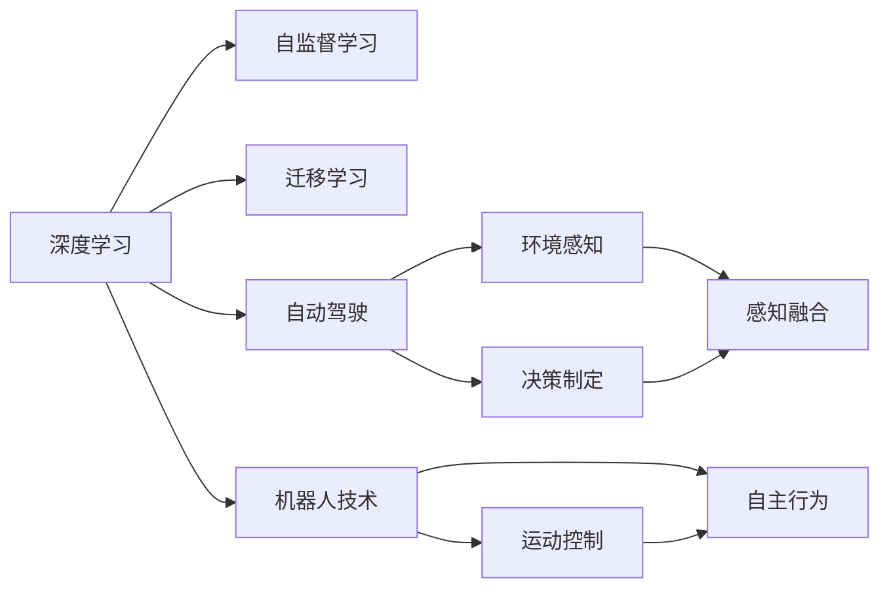
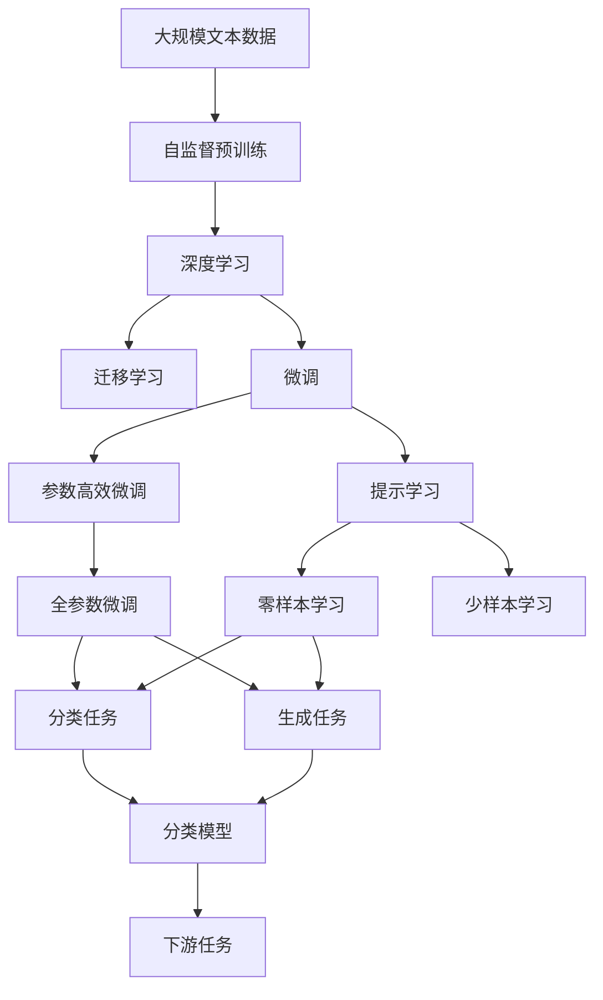

                 

# Andrej Karpathy：科技的未来

Andrej Karpathy，作为人工智能领域的顶尖专家之一，其科技视野和前瞻性思考常令人振奋。本文旨在通过探讨Karpathy的主要观点和理论，挖掘其对未来科技趋势的深刻洞察，期望为读者提供启发与洞见。

## 1. 背景介绍

### 1.1 问题由来
Andrej Karpathy 的科技研究始于深度学习的先驱之一，他的思考既有深厚的理论基础，又贴近实际应用。他于斯坦福大学获得博士学位，并在特斯拉公司担任过首席AI科学家。他的工作在深度学习、计算机视觉、自动驾驶等领域具有深远影响。

近年来，Karpathy 将视角转向未来科技发展，深入探讨了人工智能、机器学习、自动驾驶等多个前沿领域的可能性和挑战。他的观点和预测被业内专家广泛认可，对科技创新方向具有重要指导意义。

### 1.2 问题核心关键点
Andrej Karpathy 的未来科技展望包括以下几个核心关键点：

1. **深度学习与人工智能**：探讨深度学习在未来将如何塑造人工智能的发展路径，尤其是自监督学习、迁移学习等方向。
2. **自动驾驶**：分析自动驾驶技术的前景和面临的技术难题，如环境感知、决策制定等。
3. **机器人与通用智能**：探讨机器人技术的发展潜力及其对通用智能的推动作用。
4. **伦理与隐私**：评估未来科技在伦理与隐私保护方面的挑战，如何平衡技术进步与伦理道德。

这些关键点构成Karpathy对未来科技的未来展望的基础框架。

## 2. 核心概念与联系

### 2.1 核心概念概述

Karpathy 的研究涉及多个关键概念，这些概念紧密相连，构成了他未来科技趋势的理论基础：

- **深度学习**：一种基于神经网络的学习方法，模拟人类大脑的处理机制，能够自动学习数据的复杂特征。
- **自监督学习**：利用未标注数据训练模型，使其自动发现数据的结构和规律，提升模型泛化能力。
- **迁移学习**：通过在不同任务间共享模型参数，利用已有模型的知识，提升新任务上的性能。
- **自动驾驶**：利用计算机视觉、深度学习等技术，实现汽车的自主驾驶，减少交通事故，提高出行效率。
- **机器人技术**：结合计算机视觉、运动控制等技术，实现机器人在各种环境下的自主行为。
- **通用智能**：机器具备类似人类的通用智能，能够执行各种复杂任务，适应各种新环境。
- **伦理与隐私**：在科技进步的同时，如何保护个人隐私，维护社会伦理，避免技术滥用。

### 2.2 概念间的关系

这些核心概念间的关系可以通过以下Mermaid流程图来展示：



这个流程图展示了各个概念之间的联系和相互作用：

1. 深度学习是自监督学习和迁移学习的基础。
2. 自动驾驶和机器人技术依赖深度学习，通过感知融合和决策制定，实现自主行为。
3. 通用智能是对以上技术的整合和扩展，使其具备更广泛的适用性和灵活性。
4. 伦理与隐私是所有技术应用的基础约束，确保科技发展符合社会价值观和法律规范。

### 2.3 核心概念的整体架构

最后，我们用一个综合的流程图来展示这些核心概念在大语言模型微调过程中的整体架构：



这个综合流程图展示了从自监督预训练到微调，再到下游任务适应的完整过程。

## 3. 核心算法原理 & 具体操作步骤

### 3.1 算法原理概述

Karpathy 的未来科技展望基于深度学习和迁移学习的原理。他强调了深度学习模型在大规模数据上的自监督学习能力，以及迁移学习在模型泛化和新任务上的重要作用。

**深度学习**：通过大量未标注数据进行自监督预训练，模型能够自动学习数据中的特征和模式。自监督学习中的掩码语言模型（MLM）和预测下一位（Next Word Prediction）任务，是训练大规模语言模型的主要方式。

**迁移学习**：利用已有模型在特定任务上的知识，通过微调（Fine-tuning）使其适应新任务。微调过程只需更新少量参数，以避免过拟合，提升模型在新任务上的泛化能力。

**自动驾驶**：通过计算机视觉、深度学习等技术，实现对环境的感知和行为的决策。自动驾驶技术的核心是环境感知模块，能够从多源数据中融合信息，进行目标检测、车道识别等任务。决策制定模块则根据感知结果，制定行驶策略。

**机器人技术**：结合计算机视觉、运动控制等技术，实现机器人在各种环境下的自主行为。机器人技术依赖深度学习对环境的感知，以及对动作的规划和执行。

### 3.2 算法步骤详解

以下是Karpathy对未来科技的主要预测和步骤：

**步骤1：自监督预训练**
- 使用大规模未标注数据对深度学习模型进行预训练，学习通用的语言表示。
- 常用的预训练任务包括掩码语言模型（MLM）、预测下一位（Next Word Prediction）、图像分类等。

**步骤2：迁移学习与微调**
- 在特定任务的数据集上，利用迁移学习的思想，对预训练模型进行微调。
- 微调过程一般采用较小的学习率，以避免破坏预训练权重。
- 使用正则化技术，如L2正则、Dropout等，防止过拟合。

**步骤3：自动驾驶与机器人**
- 对环境感知和决策制定模块进行微调，使其能够适应新环境和任务。
- 结合计算机视觉和深度学习技术，实现对道路、车辆、行人等的精准感知。
- 通过规划和执行模块，实现自动驾驶和机器人自主行为的优化。

**步骤4：伦理与隐私**
- 在技术应用过程中，注重保护个人隐私，避免数据滥用。
- 制定伦理规范，确保技术的公平性和透明性，防止偏见和歧视。

### 3.3 算法优缺点

**优点**：
1. **自监督学习**：能够高效利用未标注数据，减少对标注数据的依赖。
2. **迁移学习**：通过知识迁移，提升新任务上的性能，提高模型泛化能力。
3. **自动驾驶与机器人**：实现自主行为，提升出行效率和安全性。

**缺点**：
1. **数据依赖**：依赖大规模数据进行预训练，数据获取成本较高。
2. **复杂度**：自动驾驶和机器人技术涉及多个复杂模块，实现难度大。
3. **伦理与隐私**：在技术应用过程中，如何平衡科技进步与伦理道德，仍需深入探讨。

### 3.4 算法应用领域

Karpathy 的科技展望涵盖了多个应用领域，包括：

1. **自然语言处理（NLP）**：通过深度学习进行文本分类、情感分析、问答等任务。
2. **计算机视觉**：利用深度学习进行图像识别、目标检测、语义分割等任务。
3. **自动驾驶**：实现无人驾驶汽车和智能交通系统。
4. **机器人技术**：在制造业、医疗、服务等领域，实现自动化和智能化。
5. **通用智能**：研究机器在不同环境下的通用智能，推动人工智能的发展。

## 4. 数学模型和公式 & 详细讲解 & 举例说明

### 4.1 数学模型构建

Karpathy 的研究中涉及多个数学模型，以下是几个关键的数学模型：

**掩码语言模型（MLM）**
$$
P(w_i|w_1,...,w_{i-1},w_{i+1},...,w_n) = \frac{\exp(\text{MLP}(w_1,...,w_{i-1},w_i))}{\sum_j \exp(\text{MLP}(w_1,...,w_{i-1},w_j))}
$$

**预测下一位（Next Word Prediction）**
$$
P(w_i|w_1,...,w_{i-1}) = \frac{\exp(\text{MLP}(w_1,...,w_{i-1},w_i))}{\sum_j \exp(\text{MLP}(w_1,...,w_{i-1},j))}
$$

**图像分类**
$$
P(c|x) = \frac{\exp(\text{CNN}(x,c))}{\sum_k \exp(\text{CNN}(x,k))}
$$

### 4.2 公式推导过程

以掩码语言模型（MLM）的推导为例，首先定义模型在输入 $w_1,...,w_n$ 上的输出为 $\hat{w}_i$：

$$
\hat{w}_i = \text{MLP}(w_1,...,w_{i-1},w_i)
$$

其中 MLP 表示多层次感知机。掩码语言模型的目标是最小化预测错误，即：

$$
\mathcal{L} = -\log P(w_i|\hat{w}_1,...,\hat{w}_{i-1},\hat{w}_{i+1},...,\hat{w}_n)
$$

将预测概率和真实概率带入，得到：

$$
\mathcal{L} = -\log \frac{\exp(\text{MLP}(w_1,...,w_{i-1},w_i))}{\sum_j \exp(\text{MLP}(w_1,...,w_{i-1},j))}
$$

通过反向传播算法计算梯度，更新模型参数，完成掩码语言模型的训练。

### 4.3 案例分析与讲解

以Bert模型为例，Bert在预训练阶段使用掩码语言模型（MLM）和预测下一位（Next Word Prediction）任务，学习语言表示。在微调阶段，Bert作为初始化参数，在特定任务的数据集上通过小学习率进行微调，实现对特定任务的适配。

## 5. 项目实践：代码实例和详细解释说明

### 5.1 开发环境搭建

Karpathy 的研究使用TensorFlow和PyTorch框架进行实现。以下是搭建开发环境的步骤：

1. 安装Anaconda：从官网下载并安装Anaconda，用于创建独立的Python环境。
2. 创建并激活虚拟环境：
```bash
conda create -n pytorch-env python=3.8 
conda activate pytorch-env
```

3. 安装PyTorch和TensorFlow：根据CUDA版本，从官网获取对应的安装命令。例如：
```bash
conda install pytorch torchvision torchaudio cudatoolkit=11.1 -c pytorch -c conda-forge
conda install tensorflow -c conda-forge
```

4. 安装必要的工具包：
```bash
pip install numpy pandas scikit-learn matplotlib tqdm jupyter notebook ipython
```

5. 导入Karpathy的深度学习库：
```python
import torch
import tensorflow as tf
import numpy as np
import matplotlib.pyplot as plt
import pandas as pd
import scikit_learn as sk
import tqdm
```

完成上述步骤后，即可在`pytorch-env`环境中进行深度学习开发。

### 5.2 源代码详细实现

以下是使用PyTorch实现Bert模型微调的代码实现：

```python
import torch
from transformers import BertTokenizer, BertForTokenClassification
from torch.utils.data import DataLoader
import torch.nn.functional as F

# 定义模型
tokenizer = BertTokenizer.from_pretrained('bert-base-cased')
model = BertForTokenClassification.from_pretrained('bert-base-cased', num_labels=10)

# 加载数据集
train_dataset = ...
val_dataset = ...
test_dataset = ...

# 定义训练过程
device = torch.device('cuda' if torch.cuda.is_available() else 'cpu')
model.to(device)

optimizer = torch.optim.AdamW(model.parameters(), lr=1e-5)
criterion = torch.nn.CrossEntropyLoss()

def train_epoch(model, dataset, batch_size, optimizer, device):
    model.train()
    train_loss = 0
    train_acc = 0
    for batch in DataLoader(dataset, batch_size=batch_size, shuffle=True):
        input_ids = batch['input_ids'].to(device)
        attention_mask = batch['attention_mask'].to(device)
        labels = batch['labels'].to(device)

        optimizer.zero_grad()
        outputs = model(input_ids, attention_mask=attention_mask)
        loss = criterion(outputs.logits, labels)
        loss.backward()
        optimizer.step()

        train_loss += loss.item()
        train_acc += (torch.argmax(outputs.logits, dim=2) == labels).sum().item()
        
    train_loss /= len(dataset)
    train_acc /= len(dataset)

    return train_loss, train_acc

def evaluate(model, dataset, batch_size, device):
    model.eval()
    test_loss = 0
    test_acc = 0
    for batch in DataLoader(dataset, batch_size=batch_size, shuffle=False):
        input_ids = batch['input_ids'].to(device)
        attention_mask = batch['attention_mask'].to(device)
        labels = batch['labels'].to(device)

        with torch.no_grad():
            outputs = model(input_ids, attention_mask=attention_mask)
            loss = criterion(outputs.logits, labels)

        test_loss += loss.item()
        test_acc += (torch.argmax(outputs.logits, dim=2) == labels).sum().item()

    test_loss /= len(dataset)
    test_acc /= len(dataset)

    return test_loss, test_acc

epochs = 5
batch_size = 16

for epoch in range(epochs):
    train_loss, train_acc = train_epoch(model, train_dataset, batch_size, optimizer, device)
    val_loss, val_acc = evaluate(model, val_dataset, batch_size, device)

    print(f'Epoch {epoch+1}, train loss: {train_loss:.4f}, train acc: {train_acc:.4f}, val loss: {val_loss:.4f}, val acc: {val_acc:.4f}')

print(f'Epoch {epochs}, test loss: {test_loss:.4f}, test acc: {test_acc:.4f}')
```

### 5.3 代码解读与分析

让我们再详细解读一下关键代码的实现细节：

**模型定义**
- 使用BertTokenizer从预训练模型加载分词器，使用BertForTokenClassification从预训练模型加载分类器。

**数据加载**
- 加载训练、验证、测试数据集，注意数据集的结构和预处理。

**训练过程**
- 使用PyTorch的DataLoader进行批次化加载，优化器为AdamW，损失函数为交叉熵。
- 在每个epoch内，计算训练集和验证集的损失和准确率，及时调整模型参数。
- 在训练过程中，利用GPU加速计算，提升训练效率。

**评估过程**
- 在测试集上评估模型的准确率和损失，输出最终结果。

**运行结果展示**
- 训练过程中输出每个epoch的损失和准确率，在测试集上输出最终评估结果。

## 6. 实际应用场景

Karpathy 对未来科技的应用场景进行了深入分析，以下是几个关键场景：

### 6.1 智能医疗
- 通过深度学习和大数据，实现疾病诊断和治疗方案的智能推荐。
- 结合图像识别和自然语言处理技术，提升医疗影像的分析和解读能力。

### 6.2 自动驾驶
- 利用计算机视觉和深度学习技术，实现对道路和车辆的精准感知。
- 结合强化学习和路径规划算法，实现自动驾驶车辆的稳定行驶。

### 6.3 工业自动化
- 结合计算机视觉和深度学习技术，实现对生产设备和工序的智能监控和维护。
- 结合自然语言处理技术，提升生产管理系统的智能化水平。

### 6.4 智能家居
- 利用深度学习和大数据分析，实现对用户行为和环境的智能理解。
- 结合自然语言处理和计算机视觉技术，提升家居设备的智能化水平。

### 6.5 智慧城市
- 利用深度学习和计算机视觉技术，实现对城市交通和环境的智能监测和管理。
- 结合自然语言处理和数据分析技术，提升城市公共服务的智能化水平。

## 7. 工具和资源推荐

### 7.1 学习资源推荐

Karpathy 推荐的学习资源包括：

1. Coursera的《深度学习专项课程》：由斯坦福大学开设，涵盖深度学习的理论和实践，适合初学者入门。
2. Google Deep Learning AI课程：由Google提供，涵盖深度学习的基础知识和最新技术，适合深度学习进阶学习。
3. arXiv论文预印本：人工智能领域最新研究成果的发布平台，涵盖深度学习、计算机视觉、自动驾驶等多个领域。
4. PyTorch官方文档：PyTorch的官方文档，提供全面的代码示例和API参考，适合深度学习开发。
5. TensorFlow官方文档：TensorFlow的官方文档，提供详细的代码示例和API参考，适合深度学习开发。

### 7.2 开发工具推荐

Karpathy 推荐的工具包括：

1. Jupyter Notebook：一个交互式的开发环境，适合进行深度学习的实验和开发。
2. TensorBoard：TensorFlow配套的可视化工具，用于监控模型的训练过程和性能。
3. Weights & Biases：用于记录和可视化模型训练过程的实验管理工具。
4. TensorFlow Addons：TensorFlow的扩展库，提供更多的模型和算法支持，适合深度学习开发。

### 7.3 相关论文推荐

Karpathy 推荐的相关论文包括：

1. "Attention is All You Need"：Transformer结构的提出，开创了深度学习的全新篇章。
2. "BERT: Pre-training of Deep Bidirectional Transformers for Language Understanding"：BERT模型的提出，刷新了多项NLP任务的SOTA。
3. "ImageNet Classification with Deep Convolutional Neural Networks"：卷积神经网络的提出，推动了计算机视觉的发展。
4. "End-to-End Learning for Self-Driving Cars"：自动驾驶技术的研究，推动了无人驾驶汽车的发展。
5. "Playing Atari with a Neural Network"：使用深度学习进行游戏AI的研究，展示了深度学习在游戏领域的潜力。

## 8. 总结：未来发展趋势与挑战

### 8.1 研究成果总结
Andrej Karpathy 的研究对未来科技的发展具有深远影响，其核心观点和预测如下：

1. 深度学习是未来科技发展的基础，自监督学习和迁移学习是其重要组成部分。
2. 自动驾驶和机器人技术将在未来得到广泛应用，推动社会进步和人类福祉。
3. 通用智能是未来科技的重要目标，机器具备类似人类的智能，能够适应各种环境和任务。
4. 伦理与隐私是未来科技发展的重要约束，技术进步应符合社会价值观和法律规范。

### 8.2 未来发展趋势
展望未来，Karpathy 认为深度学习和大数据将推动科技的进一步发展，未来趋势包括：

1. **深度学习**：自监督学习和迁移学习将更加广泛应用，提高模型的泛化能力和适应性。
2. **自动驾驶**：自动驾驶技术将进一步提升安全性、舒适性和便利性，成为未来出行新模式。
3. **机器人技术**：机器人技术将在工业、医疗、教育等领域得到广泛应用，提升人类生活水平。
4. **通用智能**：机器将具备更加全面的智能，能够执行各种复杂任务，适应各种新环境。
5. **伦理与隐私**：科技发展应注重伦理与隐私保护，确保技术进步符合社会价值观和法律规范。

### 8.3 面临的挑战
尽管未来科技充满希望，但在实现过程中仍面临诸多挑战：

1. **数据依赖**：依赖大规模数据进行预训练，数据获取成本较高。
2. **技术复杂度**：自动驾驶和机器人技术涉及多个复杂模块，实现难度大。
3. **伦理与隐私**：在技术应用过程中，如何平衡科技进步与伦理道德，仍需深入探讨。
4. **模型鲁棒性**：模型面对复杂环境和新数据时，泛化性能和鲁棒性仍需提升。
5. **计算资源**：大规模深度学习模型的计算和存储需求大，计算资源有限。

### 8.4 研究展望
未来，Karpathy 认为需要在以下方面进行深入研究：

1. **自监督学习**：开发更加高效和鲁棒的自监督学习方法，提升模型泛化能力。
2. **迁移学习**：探索新的迁移学习方法和技巧，提高模型在不同任务上的适应性。
3. **自动驾驶**：研究环境感知和决策制定算法，提升自动驾驶的安全性和舒适性。
4. **机器人技术**：结合计算机视觉和深度学习，提升机器人在复杂环境下的自主行为能力。
5. **通用智能**：研究机器在多个领域的通用智能，提升机器的适应性和智能水平。
6. **伦理与隐私**：制定伦理规范和隐私保护策略，确保技术进步符合社会价值观和法律规范。

总之，Andrej Karpathy 的未来科技展望为我们揭示了深度学习和大数据在各个领域的应用前景，也指出了未来科技发展面临的挑战和机遇。未来，我们需要在技术、伦理和社会等多个维度进行深入研究和创新，才能实现科技的可持续发展。

## 9. 附录：常见问题与解答

**Q1：深度学习在科技发展中的地位如何？**

A: 深度学习是未来科技发展的基础，自监督学习和迁移学习是其重要组成部分。深度学习通过大数据和复杂模型，能够自动学习数据的特征和模式，提高模型的泛化能力和适应性。

**Q2：未来科技将面临哪些挑战？**

A: 未来科技在发展过程中，将面临数据依赖、技术复杂度、伦理与隐私等多方面的挑战。如何高效利用数据、提升模型鲁棒性、保护隐私和伦理，是未来科技发展的重要课题。

**Q3：自动驾驶技术的难点在哪里？**

A: 自动驾驶技术的难点在于环境感知和决策制定，需要结合计算机视觉和深度学习技术，实现对道路和车辆的精准感知，以及路径规划和行驶策略的优化。

**Q4：机器人技术在应用中如何提升智能化水平？**

A: 机器人技术在应用中，可以通过计算机视觉和深度学习技术，实现对环境的感知和动作的规划，提升机器人在复杂环境下的自主行为能力。

**Q5：未来科技在伦理与隐私方面应如何应对？**

A: 未来科技在伦理与隐私方面，应注重制定伦理规范和隐私保护策略，确保技术进步符合社会价值观和法律规范，避免技术滥用和数据滥用。

---

作者：禅与计算机程序设计艺术 / Zen and the Art of Computer Programming

