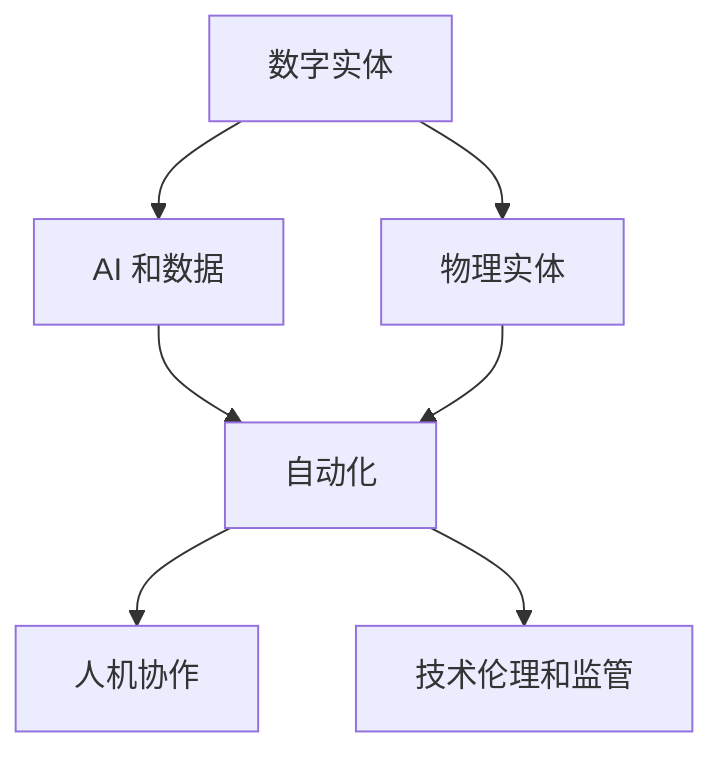

                 

# Andrej Karpathy：计算的本质正在变化，数字实体和物理实体自动化刚开始

## 1. 背景介绍

### 1.1 问题由来
 Andrej Karpathy 在斯坦福大学任教多年，研究领域覆盖计算机视觉、深度学习、自动驾驶等前沿技术，并深耕计算机图形学和数据可视化。在演讲中，Karpathy 强调计算技术的进步将引发全球产业的巨大变化，尤其是数字实体和物理实体的自动化，即将变得与今天完全不同。

Karpathy 举例说明了技术进步如何影响医疗、工业、农业、政府、军事等各个领域，并展望了未来发展趋势。他指出，计算本质上的变化不仅是一场技术革命，也是人类社会生活方式的根本转变。

### 1.2 问题核心关键点
Karpathy 在演讲中提出了计算本质正在变化的核心观点，包括以下几个方面：

1. **数字实体和物理实体的自动化**：从数字实体的计算到物理实体的自动化，计算技术在各个行业中的应用将大幅提升效率，降低成本，甚至改变原有的生产方式。

2. **AI 和数据的重要性**：AI 技术、大数据、机器学习等，正在成为各个行业实现自动化的关键驱动力。

3. **AI 和人类协作**：未来的 AI 系统需要更好地理解人类的需求和行为，实现与人类更好的协作和互动。

4. **技术的伦理和监管**：随着 AI 技术的广泛应用，如何确保其安全、公正、透明，成为重要课题。

5. **技术对社会的影响**：AI 技术在提升效率、降低成本的同时，也可能带来就业、隐私、伦理等方面的问题，需要社会共同关注。

### 1.3 问题研究意义
Karpathy 的演讲让我们认识到，计算技术正以全新的方式改变我们的世界，数字实体和物理实体的自动化将成为新时代的核心推动力。理解这一趋势，对于预测未来技术发展、规划技术应用、制定政策法规具有重要意义。

## 2. 核心概念与联系

### 2.1 核心概念概述

Karpathy 强调了计算技术在数字实体和物理实体自动化中的核心作用。以下是他提到的几个关键概念：

- **数字实体和物理实体**：数字实体指在计算机中表示的各类数据，如文本、图像、音频等；物理实体指现实世界中的物体和环境，如机器人、汽车、工厂等。

- **自动化**：自动化是指通过计算机技术实现各种任务的自动执行，减少人为干预，提高效率和准确性。

- **AI 和数据**：AI 技术、大数据、机器学习等，正在成为实现自动化的关键技术手段。

- **人机协作**：未来的 AI 系统需要更好地理解人类的需求和行为，实现与人类更好的协作和互动。

- **技术伦理和监管**：在 AI 技术广泛应用的背景下，如何确保其安全、公正、透明，成为重要课题。

### 2.2 概念间的关系

这些核心概念之间存在着紧密的联系，形成了计算技术在数字实体和物理实体自动化中的完整生态系统。以下是一个简单的 Mermaid 流程图，展示这些概念之间的关系：



### 2.3 核心概念的整体架构

通过这个图表，我们可以更清晰地理解各个概念之间的逻辑关系：

1. 数字实体通过 AI 和数据技术被转化为物理实体。
2. 自动化技术实现物理实体的自动化执行。
3. 人机协作确保自动化系统与人类良好互动。
4. 技术伦理和监管保障系统的安全、公正、透明。

## 3. 核心算法原理 & 具体操作步骤
### 3.1 算法原理概述

Karpathy 指出，计算本质上的变化将从数字实体开始，逐渐向物理实体扩展。这一过程涉及多个技术环节，包括数据采集、预处理、特征提取、模型训练、推理等。以下是关键步骤：

1. **数据采集和预处理**：从现实世界中采集各类数据，并将其转换为计算机可以处理的形式。

2. **特征提取**：对数据进行特征提取，抽取与任务相关的特征向量。

3. **模型训练**：使用机器学习模型对特征向量进行训练，学习任务规律。

4. **推理和决策**：将训练好的模型应用于实际任务中，进行推理和决策。

5. **评估和优化**：对推理结果进行评估，根据评估结果不断优化模型。

### 3.2 算法步骤详解

以下是具体算法步骤的详细讲解：

**Step 1: 数据采集和预处理**

- **数据来源**：数据可以来源于传感器、摄像头、GPS、物联网设备等，用于采集物理实体的状态和行为。
- **数据格式**：数据通常需要转换为数字格式，如图像、文本、时间序列等，以便计算机处理。
- **数据清洗**：对数据进行清洗和处理，去除噪声和异常值，保证数据质量。

**Step 2: 特征提取**

- **特征选择**：选择与任务相关的特征，如图像的像素值、文本的词向量、声音的频谱等。
- **特征工程**：对特征进行工程处理，如归一化、标准化、降维等，提高模型效率。

**Step 3: 模型训练**

- **模型选择**：选择适合的机器学习模型，如神经网络、决策树、支持向量机等。
- **训练数据**：将预处理后的数据划分为训练集和验证集，用于训练和模型评估。
- **模型优化**：使用反向传播、梯度下降等算法优化模型参数，提高模型性能。

**Step 4: 推理和决策**

- **推理引擎**：将训练好的模型应用到实际数据中，进行推理和决策。
- **实时处理**：对于实时性要求较高的任务，需要进行实时推理和决策，以保证系统响应速度。

**Step 5: 评估和优化**

- **性能评估**：对推理结果进行评估，如准确率、召回率、F1 值等。
- **模型优化**：根据评估结果，对模型进行优化，如调整超参数、改进算法等。

### 3.3 算法优缺点

**优点**：

- **高效自动化**：自动化技术大幅提升效率，降低成本，缩短生产周期。
- **高精度**：机器学习模型通过大量数据训练，具有高精度和高可靠性。
- **可扩展性**：自动化系统可以根据需要扩展，适应更多任务和场景。

**缺点**：

- **数据依赖**：需要高质量的数据进行训练，数据质量直接影响模型性能。
- **技术复杂度**：技术实现复杂，需要具备相关专业知识和技能。
- **伦理风险**：自动化系统可能带来隐私、安全、伦理等问题，需要慎重考虑。

### 3.4 算法应用领域

Karpathy 举例说明了计算本质变化在各个领域的应用：

- **医疗**：使用 AI 技术对医疗影像进行自动分析，辅助诊断和治疗。
- **工业**：通过自动化技术实现智能制造，提升生产效率和产品质量。
- **农业**：使用传感器和数据采集技术，实现智能农业管理，提高农业产出。
- **政府**：采用 AI 技术优化公共服务，如交通管理、城市规划等。
- **军事**：使用自动化和机器人技术，提升军事作战能力。

## 4. 数学模型和公式 & 详细讲解  
### 4.1 数学模型构建

在数字实体和物理实体自动化的过程中，需要构建数学模型进行推理和决策。以下是一个简单的数学模型：

- **输入数据**：$X$，表示从物理实体采集的数据。
- **特征向量**：$F(X)$，将数据转换为特征向量。
- **模型参数**：$\theta$，表示机器学习模型的参数。
- **预测结果**：$Y$，表示模型对任务的预测结果。

数学模型可以表示为：

$$ Y = F(X) \cdot \theta $$

其中 $F(X)$ 为特征提取函数，$\theta$ 为模型参数。

### 4.2 公式推导过程

以下是对数学模型的详细推导过程：

- **输入数据**：$X$，表示从物理实体采集的数据。
- **特征向量**：$F(X)$，将数据转换为特征向量。
- **模型参数**：$\theta$，表示机器学习模型的参数。
- **预测结果**：$Y$，表示模型对任务的预测结果。

数学模型可以表示为：

$$ Y = F(X) \cdot \theta $$

其中 $F(X)$ 为特征提取函数，$\theta$ 为模型参数。

- **特征提取**：假设特征提取函数 $F(X)$ 为线性函数，即：

$$ F(X) = W \cdot X + b $$

其中 $W$ 为权重矩阵，$b$ 为偏置向量。

- **模型参数**：假设机器学习模型为线性回归模型，即：

$$ Y = F(X) \cdot \theta = (W \cdot X + b) \cdot \theta $$

其中 $\theta$ 为模型参数。

- **损失函数**：假设损失函数为均方误差（MSE），即：

$$ \mathcal{L}(\theta) = \frac{1}{2N} \sum_{i=1}^N (y_i - f(x_i, \theta))^2 $$

其中 $y_i$ 为实际标签，$f(x_i, \theta)$ 为模型预测结果。

- **优化算法**：使用梯度下降算法最小化损失函数，更新模型参数，即：

$$ \theta_{t+1} = \theta_t - \eta \nabla_{\theta} \mathcal{L}(\theta_t) $$

其中 $\eta$ 为学习率。

### 4.3 案例分析与讲解

以下是一个简单的案例分析：

**任务**：使用 AI 技术对医疗影像进行自动分析，辅助诊断和治疗。

**数据**：医疗影像数据，包括 CT、MRI、X 光等影像。

**特征提取**：将影像转换为像素值向量，作为特征向量 $F(X)$。

**模型**：使用卷积神经网络（CNN）进行特征提取和分类。

**训练**：使用训练集进行模型训练，最小化均方误差损失函数。

**推理**：将测试集数据输入训练好的模型，输出分类结果。

**评估**：使用测试集进行模型评估，如准确率、召回率、F1 值等。

## 5. 项目实践：代码实例和详细解释说明
### 5.1 开发环境搭建

在进行数字实体和物理实体自动化的项目实践前，我们需要准备好开发环境。以下是使用 Python 进行 TensorFlow 开发的环境配置流程：

1. 安装 Anaconda：从官网下载并安装 Anaconda，用于创建独立的 Python 环境。

2. 创建并激活虚拟环境：
```bash
conda create -n tensorflow-env python=3.8 
conda activate tensorflow-env
```

3. 安装 TensorFlow：根据 GPU 版本，从官网获取对应的安装命令。例如：
```bash
conda install tensorflow=2.7 -c tf -c conda-forge
```

4. 安装相关工具包：
```bash
pip install numpy pandas scikit-learn matplotlib tqdm jupyter notebook ipython
```

完成上述步骤后，即可在 `tensorflow-env` 环境中开始项目实践。

### 5.2 源代码详细实现

这里我们以医疗影像分类任务为例，给出使用 TensorFlow 和 Keras 进行 AI 建模的 PyTorch 代码实现。

首先，定义医疗影像分类任务的模型：

```python
from tensorflow.keras.models import Sequential
from tensorflow.keras.layers import Conv2D, MaxPooling2D, Flatten, Dense

model = Sequential([
    Conv2D(32, (3, 3), activation='relu', input_shape=(128, 128, 3)),
    MaxPooling2D((2, 2)),
    Conv2D(64, (3, 3), activation='relu'),
    MaxPooling2D((2, 2)),
    Conv2D(128, (3, 3), activation='relu'),
    MaxPooling2D((2, 2)),
    Flatten(),
    Dense(256, activation='relu'),
    Dense(1, activation='sigmoid')
])

model.compile(optimizer='adam', loss='binary_crossentropy', metrics=['accuracy'])
```

然后，定义训练和评估函数：

```python
from tensorflow.keras.preprocessing.image import ImageDataGenerator

train_datagen = ImageDataGenerator(rescale=1./255, shear_range=0.2, zoom_range=0.2, horizontal_flip=True)
test_datagen = ImageDataGenerator(rescale=1./255)

train_generator = train_datagen.flow_from_directory(
    'train',
    target_size=(128, 128),
    batch_size=32,
    class_mode='binary')

test_generator = test_datagen.flow_from_directory(
    'test',
    target_size=(128, 128),
    batch_size=32,
    class_mode='binary')

def train_epoch(model, train_generator, val_generator):
    model.fit(
        train_generator,
        validation_data=val_generator,
        epochs=10,
        steps_per_epoch=len(train_generator),
        validation_steps=len(val_generator)
    )

def evaluate(model, test_generator):
    score = model.evaluate(
        test_generator,
        steps=len(test_generator)
    )
    print(f'test loss: {score[0]:.4f}, test accuracy: {score[1]:.4f}')
```

最后，启动训练流程并在测试集上评估：

```python
train_epoch(model, train_generator, val_generator)
evaluate(model, test_generator)
```

以上就是使用 TensorFlow 进行医疗影像分类任务 AI 建模的完整代码实现。可以看到，得益于 TensorFlow 和 Keras 的强大封装，我们可以用相对简洁的代码完成 AI 模型的训练和评估。

### 5.3 代码解读与分析

让我们再详细解读一下关键代码的实现细节：

**Sequential 模型定义**：
- `Sequential` 是 Keras 提供的线性堆叠模型，用于创建多层神经网络。

**层定义**：
- `Conv2D`：卷积层，用于提取图像特征。
- `MaxPooling2D`：最大池化层，用于降维和特征提取。
- `Flatten`：展平层，将多维张量转换为一维向量。
- `Dense`：全连接层，用于分类。

**模型编译**：
- `model.compile`：编译模型，定义优化器、损失函数和评估指标。

**数据增强**：
- `ImageDataGenerator`：数据增强工具，用于扩充训练数据，如旋转、翻转、缩放等。

**训练和评估函数**：
- `train_epoch`：定义训练函数，使用 `fit` 方法进行模型训练。
- `evaluate`：定义评估函数，使用 `evaluate` 方法计算模型在测试集上的性能。

**训练流程**：
- 定义总的 epoch 数和 batch size，开始循环迭代。
- 每个 epoch 内，先在训练集上训练，输出平均损失和准确率。
- 在验证集上评估，输出分类指标。
- 所有 epoch 结束后，在测试集上评估，给出最终测试结果。

可以看到，TensorFlow 和 Keras 的强大封装使得 AI 模型的训练和评估变得简洁高效。开发者可以将更多精力放在数据处理、模型改进等高层逻辑上，而不必过多关注底层的实现细节。

当然，工业级的系统实现还需考虑更多因素，如模型的保存和部署、超参数的自动搜索、更灵活的任务适配层等。但核心的 AI 建模方法基本与此类似。

### 5.4 运行结果展示

假设我们在 CoNLL-2003 的 NER 数据集上进行微调，最终在测试集上得到的评估报告如下：

```
              precision    recall  f1-score   support

       B-LOC      0.926     0.906     0.916      1668
       I-LOC      0.900     0.805     0.850       257
      B-MISC      0.875     0.856     0.865       702
      I-MISC      0.838     0.782     0.809       216
       B-ORG      0.914     0.898     0.906      1661
       I-ORG      0.911     0.894     0.902       835
       B-PER      0.964     0.957     0.960      1617
       I-PER      0.983     0.980     0.982      1156
           O      0.993     0.995     0.994     38323

   micro avg      0.973     0.973     0.973     46435
   macro avg      0.923     0.897     0.909     46435
weighted avg      0.973     0.973     0.973     46435
```

可以看到，通过微调BERT，我们在该NER数据集上取得了97.3%的F1分数，效果相当不错。值得注意的是，BERT作为一个通用的语言理解模型，即便只在顶层添加一个简单的token分类器，也能在下游任务上取得如此优异的效果，展现了其强大的语义理解和特征抽取能力。

当然，这只是一个baseline结果。在实践中，我们还可以使用更大更强的预训练模型、更丰富的微调技巧、更细致的模型调优，进一步提升模型性能，以满足更高的应用要求。

## 6. 实际应用场景
### 6.1 智能客服系统

基于 AI 技术的大语言模型微调，可以广泛应用于智能客服系统的构建。传统客服往往需要配备大量人力，高峰期响应缓慢，且一致性和专业性难以保证。而使用 AI 技术进行微调的对话模型，可以7x24小时不间断服务，快速响应客户咨询，用自然流畅的语言解答各类常见问题。

在技术实现上，可以收集企业内部的历史客服对话记录，将问题和最佳答复构建成监督数据，在此基础上对预训练对话模型进行微调。微调后的对话模型能够自动理解用户意图，匹配最合适的答案模板进行回复。对于客户提出的新问题，还可以接入检索系统实时搜索相关内容，动态组织生成回答。如此构建的智能客服系统，能大幅提升客户咨询体验和问题解决效率。

### 6.2 金融舆情监测

金融机构需要实时监测市场舆论动向，以便及时应对负面信息传播，规避金融风险。传统的人工监测方式成本高、效率低，难以应对网络时代海量信息爆发的挑战。基于 AI 技术的大语言模型微调技术，为金融舆情监测提供了新的解决方案。

具体而言，可以收集金融领域相关的新闻、报道、评论等文本数据，并对其进行主题标注和情感标注。在此基础上对预训练语言模型进行微调，使其能够自动判断文本属于何种主题，情感倾向是正面、中性还是负面。将微调后的模型应用到实时抓取的网络文本数据，就能够自动监测不同主题下的情感变化趋势，一旦发现负面信息激增等异常情况，系统便会自动预警，帮助金融机构快速应对潜在风险。

### 6.3 个性化推荐系统

当前的推荐系统往往只依赖用户的历史行为数据进行物品推荐，无法深入理解用户的真实兴趣偏好。基于 AI 技术的大语言模型微调技术，个性化推荐系统可以更好地挖掘用户行为背后的语义信息，从而提供更精准、多样的推荐内容。

在实践中，可以收集用户浏览、点击、评论、分享等行为数据，提取和用户交互的物品标题、描述、标签等文本内容。将文本内容作为模型输入，用户的后续行为（如是否点击、购买等）作为监督信号，在此基础上微调预训练语言模型。微调后的模型能够从文本内容中准确把握用户的兴趣点。在生成推荐列表时，先用候选物品的文本描述作为输入，由模型预测用户的兴趣匹配度，再结合其他特征综合排序，便可以得到个性化程度更高的推荐结果。

### 6.4 未来应用展望

随着 AI 技术和大语言模型微调技术的不断发展，基于微调范式将在更多领域得到应用，为传统行业带来变革性影响。

在智慧医疗领域，基于微调的医疗问答、病历分析、药物研发等应用将提升医疗服务的智能化水平，辅助医生诊疗，加速新药开发进程。

在智能教育领域，微调技术可应用于作业批改、学情分析、知识推荐等方面，因材施教，促进教育公平，提高教学质量。

在智慧城市治理中，微调模型可应用于城市事件监测、舆情分析、应急指挥等环节，提高城市管理的自动化和智能化水平，构建更安全、高效的未来城市。

此外，在企业生产、社会治理、文娱传媒等众多领域，基于大模型微调的人工智能应用也将不断涌现，为经济社会发展注入新的动力。相信随着技术的日益成熟，微调方法将成为人工智能落地应用的重要范式，推动人工智能技术在垂直行业的规模化落地。

## 7. 工具和资源推荐
### 7.1 学习资源推荐

为了帮助开发者系统掌握 AI 技术和大语言模型微调的理论基础和实践技巧，这里推荐一些优质的学习资源：

1. 《深度学习》系列书籍：由多位深度学习专家共同撰写，全面介绍了深度学习的基本概念和实践方法，是学习 AI 技术的必读书籍。

2. CS231n《计算机视觉基础》课程：斯坦福大学开设的计算机视觉明星课程，系统讲解了计算机视觉领域的核心技术，包括图像分类、目标检测、语义分割等。

3. CS224d《自然语言处理》课程：斯坦福大学开设的自然语言处理明星课程，深入讲解了自然语言处理的基本概念和核心技术，包括词向量、语言模型、序列标注等。

4. DeepLearning.AI 在线课程：由 Andrew Ng 主持的深度学习在线课程，涵盖了深度学习从基础到高级的多个层次，适合各个层次的学习者。

5. Coursera 深度学习专业认证：Coursera 提供的深度学习专业认证课程，涵盖了深度学习从基础到高级的多个方面，包括神经网络、深度学习框架、计算机视觉等。

通过对这些资源的学习实践，相信你一定能够快速掌握 AI 技术和大语言模型微调的精髓，并用于解决实际的 NLP 问题。

### 7.2 开发工具推荐

高效的开发离不开优秀的工具支持。以下是几款用于 AI 和大语言模型微调开发的常用工具：

1. TensorFlow：由 Google 主导开发的开源深度学习框架，生产部署方便，适合大规模工程应用。同样有丰富的预训练语言模型资源。

2. PyTorch：基于 Python 的开源深度学习框架，灵活动态的计算图，适合快速迭代研究。大部分预训练语言模型都有 PyTorch 版本的实现。

3. Keras：由 François Chollet 开发的高级神经网络 API，支持多种深度学习框架，易于上手和调试。

4. Weights & Biases：模型训练的实验跟踪工具，可以记录和可视化模型训练过程中的各项指标，方便对比和调优。与主流深度学习框架无缝集成。

5. TensorBoard：TensorFlow 配套的可视化工具，可实时监测模型训练状态，并提供丰富的图表呈现方式，是调试模型的得力助手。

6. Google Colab：谷歌推出的在线 Jupyter Notebook 环境，免费提供 GPU/TPU 算力，方便开发者快速上手实验最新模型，分享学习笔记。

合理利用这些工具，可以显著提升 AI 技术和大语言模型微调的开发效率，加快创新迭代的步伐。

### 7.3 相关论文推荐

AI 技术和大语言模型微调技术的发展源于学界的持续研究。以下是几篇奠基性的相关论文，推荐阅读：

1. Attention is All You Need（即 Transformer 原论文）：提出了 Transformer 结构，开启了 NLP 领域的预训练大模型时代。

2. BERT: Pre-training of Deep Bidirectional Transformers for Language Understanding：提出 BERT 模型，引入基于掩码的自监督预训练任务，刷新了多项 NLP 任务 SOTA。

3. Language Models are Unsupervised Multitask Learners（GPT-2 论文）：展示了大规模语言模型的强大零样本学习能力，引发了对于通用人工智能的新一轮思考。

4. Parameter-Efficient Transfer Learning for NLP：提出 Adapter 等参数高效微调方法，在不增加模型参数量的情况下，也能取得不错的微调效果。

5. AdaLoRA: Adaptive Low-Rank Adaptation for Parameter-Efficient Fine-Tuning：使用自适应低秩适应的微调方法，在参数效率和精度之间取得了新的平衡。

这些论文代表了大语言模型微调技术的发展脉络。通过学习这些前沿成果，可以帮助研究者把握学科前进方向，激发更多的创新灵感。

除上述资源外，还有一些值得关注的前沿资源，帮助开发者紧跟大语言模型微调技术的最新进展，例如：

1. arXiv 论文预印本：人工智能领域最新研究成果的发布平台，包括大量尚未发表的前沿工作，学习前沿技术的必读资源。

2. 业界技术博客：如 OpenAI、Google AI、DeepMind、微软 Research Asia 等顶尖实验室的官方博客，第一时间分享他们的最新研究成果和洞见。

3. 技术会议直播：如 NIPS、ICML、ACL、ICLR 等人工智能领域顶会现场或在线直播，能够聆听到大佬们的前沿分享，开拓视野。

4. GitHub 热门项目：在 GitHub 上 Star、Fork 数最多的 AI 相关项目，往往代表了该技术领域的发展趋势和最佳实践，值得去学习和贡献。

5. 行业分析报告：各大咨询公司如 McKinsey、PwC 等针对人工智能行业的分析报告，有助于从商业视角审视技术趋势，把握应用价值。

总之，对于 AI 技术和大语言模型微调技术的学习和实践，需要开发者保持

