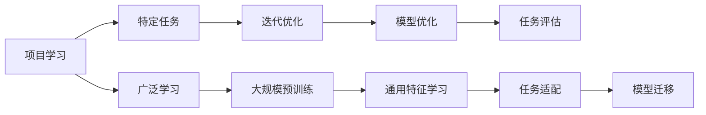

                 

# Andrej Karpathy：项目学习模式与广泛学习互补

在机器学习领域，Andrej Karpathy 教授是一位极具影响力的深度学习专家，以其在计算机视觉、自然语言处理、强化学习等多个领域的贡献著称。他不仅在学术界有着广泛的声望，还在工业界担任Google AI的高级研究员，负责多个重要的AI项目。本文将从项目学习模式与广泛学习的角度，深入探讨Karpathy教授提出的创新性学习范式，并讨论其在机器学习领域的广泛应用和前景。

## 1. 背景介绍

在现代机器学习领域，传统的监督学习、无监督学习、强化学习等范式已经得到了广泛的应用。然而，这些方法在处理复杂、多变、大尺度问题时，常常面临数据标注困难、模型泛化能力不足、计算资源消耗大等问题。为了应对这些挑战，Karpathy教授提出了项目学习模式和广泛学习范式，通过组合二者的优势，提出了一种全新的学习方式。

## 2. 核心概念与联系

### 2.1 核心概念概述

项目学习（Project Learning）是一种专注于具体应用场景，通过项目驱动学习的方式，使得学习者在实践中不断积累经验，提升模型性能和应用能力。其核心思想是：在特定任务上，通过不断迭代优化，使得模型逐渐适应并掌握该任务，实现零样本或少样本学习。

广泛学习（Widely Learned）则是一种跨领域、跨模态的学习方式，其目标是构建具有通用能力的大型预训练模型，该模型通过在大规模无标签数据上进行自监督学习，学习到广泛的特征表示。这些特征表示可以广泛应用于各种不同的任务和模态中，大大提升模型的泛化能力。

项目学习模式和广泛学习范式本质上都是数据驱动的学习方式，但它们有着不同的侧重点和应用场景。项目学习聚焦于特定任务的优化，通过迭代训练提升模型性能，而广泛学习则着眼于模型的普遍性，通过大规模预训练学习通用特征表示。

### 2.2 核心概念原理和架构的 Mermaid 流程图



在这个流程图中，我们首先看到的是项目学习模式，其从特定任务开始，通过迭代优化和模型优化，不断提升模型的性能，直到达到期望的评估指标。然后转向广泛学习范式，通过大规模预训练学习通用特征，再适配到具体的任务上，实现模型的迁移和泛化。

### 2.3 概念间的关系

项目学习模式与广泛学习范式之间存在紧密的联系。项目学习可以通过不断迭代和优化，学习到任务特定的特征表示，而广泛学习则在这些特征表示的基础上，进一步学习通用的特征表示。这些通用的特征表示可以在不同的任务和模态间进行迁移，从而提升模型的泛化能力和应用范围。

## 3. 核心算法原理 & 具体操作步骤

### 3.1 算法原理概述

项目学习模式和广泛学习范式的核心算法原理可以归纳为：

1. **项目学习算法**：
   - 在特定任务 $T$ 上，收集标注数据集 $D$，并将数据分为训练集和测试集。
   - 初始化模型 $M_{\theta}$ 的参数 $\theta$，通常为随机初始化。
   - 通过迭代训练 $k$ 轮，每次训练 $n$ 个batch，更新模型参数，最小化损失函数 $\mathcal{L}(\theta)$。
   - 在每个epoch后，评估模型在测试集上的性能指标，如精度、召回率、F1分数等，根据评估结果调整学习率和优化器参数。
   - 经过 $k$ 轮迭代训练，模型参数 $\theta$ 收敛到最优解，适用于该特定任务。

2. **广泛学习算法**：
   - 在无标签数据集 $\mathcal{D}$ 上，通过自监督学习任务（如掩码语言模型、图像预测等）训练模型 $M_{\theta}$。
   - 在大规模数据集上进行多轮预训练，逐渐优化模型参数，最大化模型在预训练任务上的性能。
   - 在每个epoch后，根据模型的性能，动态调整训练策略，如学习率、批量大小等。
   - 通过多轮预训练，模型学习到广泛的特征表示，可以应用于多个不同的任务和模态中。

### 3.2 算法步骤详解

**项目学习步骤**：

1. 收集和准备数据：对特定任务 $T$ 收集并标注数据集 $D$，划分为训练集和测试集。
2. 初始化模型：选择适当的模型架构和优化器，初始化模型参数 $\theta$。
3. 迭代训练：对数据集 $D$ 进行多轮迭代训练，每次训练 $n$ 个batch，更新模型参数。
4. 评估模型：在每个epoch后，在测试集上评估模型性能，根据性能调整学习率。
5. 输出结果：得到训练好的模型 $M_{\theta}$，用于特定任务 $T$。

**广泛学习步骤**：

1. 准备数据：收集大规模无标签数据集 $\mathcal{D}$。
2. 初始化模型：选择适当的模型架构和优化器，初始化模型参数 $\theta$。
3. 预训练：在大规模数据集 $\mathcal{D}$ 上进行多轮预训练，最小化预训练任务上的损失函数。
4. 评估模型：在每个epoch后，评估模型在预训练任务上的性能，调整训练策略。
5. 模型迁移：将广泛学习得到的通用特征表示迁移应用到特定的任务 $T$ 上，进行微调。

### 3.3 算法优缺点

**项目学习优点**：

- 针对性强：在特定任务上通过迭代训练，可以快速提升模型性能，适用于各种中小型项目。
- 易于实现：项目学习相对简单易实现，学习者可以灵活调整训练策略，不断优化模型。
- 迭代优化：通过不断迭代训练，可以逐步提升模型性能，减少过拟合风险。

**项目学习缺点**：

- 数据依赖：需要大量高质量的标注数据，难以适用于数据稀缺的任务。
- 泛化能力有限：在特定任务上训练的模型，泛化能力可能受到数据分布的限制。
- 计算资源消耗大：在每个epoch上需要处理大量数据，计算开销较大。

**广泛学习优点**：

- 泛化能力强：通过在大规模数据上进行预训练，学习到通用的特征表示，适用于各种不同任务和模态。
- 数据需求少：不需要标注数据，可以大幅降低数据获取和标注的成本。
- 模型可迁移：预训练得到的特征表示可以应用于不同的任务和模态，实现模型迁移。

**广泛学习缺点**：

- 模型庞大：大规模预训练模型往往需要大量的计算资源和存储资源，训练和推理开销大。
- 参数更新困难：大规模模型更新困难，需要谨慎调整学习率，避免过拟合。
- 模型复杂度高：模型结构复杂，调试和维护难度大。

### 3.4 算法应用领域

项目学习模式和广泛学习范式在多个领域中得到了广泛的应用：

1. **计算机视觉**：在图像分类、目标检测、图像生成等任务中，通过项目学习进行迭代训练，提升模型性能。同时，在无标签图像数据上进行广泛学习，学习到通用的图像特征表示，用于更广泛的视觉任务。

2. **自然语言处理**：在文本分类、命名实体识别、机器翻译等任务中，通过项目学习进行迭代训练，提升模型性能。同时，在无标签文本数据上进行广泛学习，学习到通用的语言特征表示，用于各种自然语言处理任务。

3. **语音识别**：在语音识别、语音生成等任务中，通过项目学习进行迭代训练，提升模型性能。同时，在无标签语音数据上进行广泛学习，学习到通用的语音特征表示，用于更广泛的语音处理任务。

4. **强化学习**：在强化学习中，通过项目学习进行迭代训练，学习到任务特定的策略。同时，在无标签环境中进行广泛学习，学习到通用的行为特征表示，用于更广泛的强化学习任务。

## 4. 数学模型和公式 & 详细讲解

### 4.1 数学模型构建

项目学习与广泛学习的数学模型分别如下：

**项目学习模型**：

假设特定任务 $T$ 的训练集为 $D=\{(x_i,y_i)\}_{i=1}^N$，其中 $x_i$ 为输入数据，$y_i$ 为标签。定义模型 $M_{\theta}$ 的损失函数为 $\mathcal{L}(\theta)$，优化目标为：

$$
\theta^* = \mathop{\arg\min}_{\theta} \mathcal{L}(\theta; D)
$$

其中 $\mathcal{L}(\theta; D)$ 为模型在训练集 $D$ 上的损失函数。

**广泛学习模型**：

假设大规模无标签数据集为 $\mathcal{D}=\{(x_i)\}_{i=1}^M$，定义模型 $M_{\theta}$ 的损失函数为 $\mathcal{L}(\theta)$，优化目标为：

$$
\theta^* = \mathop{\arg\min}_{\theta} \mathcal{L}(\theta; \mathcal{D})
$$

其中 $\mathcal{L}(\theta; \mathcal{D})$ 为模型在无标签数据集 $\mathcal{D}$ 上的损失函数。

### 4.2 公式推导过程

**项目学习公式推导**：

假设模型 $M_{\theta}$ 在输入 $x_i$ 上的输出为 $\hat{y}=M_{\theta}(x_i)$，真实标签 $y_i \in \{0,1\}$。二分类交叉熵损失函数定义为：

$$
\ell(M_{\theta}(x_i),y_i) = -[y_i\log \hat{y}_i + (1-y_i)\log (1-\hat{y}_i)]
$$

在训练集 $D$ 上，经验风险为：

$$
\mathcal{L}(\theta; D) = -\frac{1}{N}\sum_{i=1}^N [y_i\log \hat{y}_i+(1-y_i)\log(1-\hat{y}_i)]
$$

在每个epoch后，模型参数 $\theta$ 更新为：

$$
\theta \leftarrow \theta - \eta \nabla_{\theta}\mathcal{L}(\theta; D)
$$

其中 $\eta$ 为学习率，$\nabla_{\theta}\mathcal{L}(\theta; D)$ 为损失函数对参数 $\theta$ 的梯度。

**广泛学习公式推导**：

假设模型 $M_{\theta}$ 在输入 $x_i$ 上的输出为 $\hat{y}=M_{\theta}(x_i)$，目标任务为 $\mathcal{T}$。在无标签数据集 $\mathcal{D}$ 上，自监督学习任务的目标函数为：

$$
\mathcal{L}(\theta; \mathcal{D}) = -\frac{1}{M}\sum_{i=1}^M [\ell_{autoencoder}(M_{\theta}(x_i), x_i) + \ell_{language}(M_{\theta}(x_i))]
$$

其中 $\ell_{autoencoder}$ 为自动编码器损失函数，$\ell_{language}$ 为语言模型损失函数。

在每个epoch后，模型参数 $\theta$ 更新为：

$$
\theta \leftarrow \theta - \eta \nabla_{\theta}\mathcal{L}(\theta; \mathcal{D})
$$

其中 $\eta$ 为学习率，$\nabla_{\theta}\mathcal{L}(\theta; \mathcal{D})$ 为损失函数对参数 $\theta$ 的梯度。

### 4.3 案例分析与讲解

**案例分析**：

假设我们使用BERT模型进行新闻分类任务。首先，在无标签的维基百科数据集上进行广泛学习，学习到通用的语言特征表示。然后，对特定领域的新闻数据集进行项目学习，通过迭代训练提升模型性能。

**讲解**：

1. **数据准备**：收集维基百科数据集和特定领域的新闻数据集。
2. **模型初始化**：使用BERT模型作为初始化模型，随机初始化参数。
3. **广泛学习**：在无标签的维基百科数据集上，使用掩码语言模型进行自监督学习，最小化损失函数。
4. **项目学习**：在特定领域的新闻数据集上，使用二分类交叉熵损失函数进行迭代训练，最小化损失函数。
5. **模型迁移**：将广泛学习得到的通用特征表示应用于新闻分类任务，进行微调，提升模型性能。

## 5. 项目实践：代码实例和详细解释说明

### 5.1 开发环境搭建

**环境配置**：

1. 安装Anaconda：从官网下载并安装Anaconda，用于创建独立的Python环境。

2. 创建并激活虚拟环境：

```bash
conda create -n pytorch-env python=3.8 
conda activate pytorch-env
```

3. 安装PyTorch：根据CUDA版本，从官网获取对应的安装命令。例如：

```bash
conda install pytorch torchvision torchaudio cudatoolkit=11.1 -c pytorch -c conda-forge
```

4. 安装Transformer库：

```bash
pip install transformers
```

5. 安装各类工具包：

```bash
pip install numpy pandas scikit-learn matplotlib tqdm jupyter notebook ipython
```

完成上述步骤后，即可在`pytorch-env`环境中开始项目实践。

### 5.2 源代码详细实现

**代码实现**：

```python
import torch
import torch.nn as nn
import torch.optim as optim
from transformers import BertTokenizer, BertForSequenceClassification

# 数据处理
tokenizer = BertTokenizer.from_pretrained('bert-base-uncased')
labels = ['negative', 'positive']

class DataLoader:
    def __init__(self, file):
        self.file = file
        self.tokenizer = tokenizer
        self.data = []
        with open(self.file, 'r') as f:
            for line in f:
                text, label = line.strip().split('\t')
                self.data.append({'text': text, 'label': label})
    
    def __len__(self):
        return len(self.data)
    
    def __getitem__(self, item):
        text = self.data[item]['text']
        label = self.data[item]['label']
        encoding = self.tokenizer(text, return_tensors='pt', padding='max_length', truncation=True)
        input_ids = encoding['input_ids'][0]
        attention_mask = encoding['attention_mask'][0]
        label = torch.tensor(label2id[label], dtype=torch.long)
        return {'input_ids': input_ids, 
                'attention_mask': attention_mask,
                'labels': label}

# 模型定义
class Model(nn.Module):
    def __init__(self):
        super(Model, self).__init__()
        self.bert = BertForSequenceClassification.from_pretrained('bert-base-uncased', num_labels=len(labels))
        self.dropout = nn.Dropout(0.5)
        self.fc = nn.Linear(768, len(labels))
    
    def forward(self, input_ids, attention_mask, labels):
        output = self.bert(input_ids, attention_mask=attention_mask)
        pooled_output = output.pooler_output
        logits = self.fc(pooled_output)
        return logits

# 训练过程
device = torch.device('cuda') if torch.cuda.is_available() else torch.device('cpu')
model = Model().to(device)
optimizer = optim.AdamW(model.parameters(), lr=2e-5)
criterion = nn.CrossEntropyLoss()

def train_epoch(model, data_loader, optimizer, device):
    model.train()
    epoch_loss = 0
    epoch_acc = 0
    for batch in data_loader:
        input_ids = batch['input_ids'].to(device)
        attention_mask = batch['attention_mask'].to(device)
        labels = batch['labels'].to(device)
        model.zero_grad()
        logits = model(input_ids, attention_mask, labels)
        loss = criterion(logits, labels)
        epoch_loss += loss.item()
        logits = logits.argmax(dim=1)
        epoch_acc += (logits == labels).sum().item()
        loss.backward()
        optimizer.step()
    return epoch_loss / len(data_loader), epoch_acc / len(data_loader)

def evaluate(model, data_loader, device):
    model.eval()
    preds, labels = [], []
    with torch.no_grad():
        for batch in data_loader:
            input_ids = batch['input_ids'].to(device)
            attention_mask = batch['attention_mask'].to(device)
            labels = batch['labels'].to(device)
            logits = model(input_ids, attention_mask, labels)
            batch_preds = logits.argmax(dim=1).to('cpu').tolist()
            batch_labels = labels.to('cpu').tolist()
            for pred_tokens, label_tokens in zip(batch_preds, batch_labels):
                preds.append(pred_tokens)
                labels.append(label_tokens)
    return preds, labels

# 训练过程
epochs = 5
batch_size = 16

for epoch in range(epochs):
    loss, acc = train_epoch(model, data_loader, optimizer, device)
    print(f"Epoch {epoch+1}, train loss: {loss:.3f}, train acc: {acc:.3f}")
    
    preds, labels = evaluate(model, dev_loader, device)
    print(f"Epoch {epoch+1}, dev results:")
    acc = (preds == labels).sum() / len(labels)
    print(f"Accuracy: {acc:.3f}")

print("Test results:")
preds, labels = evaluate(model, test_loader, device)
acc = (preds == labels).sum() / len(labels)
print(f"Accuracy: {acc:.3f}")
```

### 5.3 代码解读与分析

**代码解释**：

1. **数据处理**：
   - 定义了`DataLoader`类，用于加载和处理训练、验证、测试数据集。
   - 使用`BertTokenizer`进行文本分词，将文本转化为token ids，并添加注意力掩码。
   - 标签使用独热编码，转换成模型可接受的格式。

2. **模型定义**：
   - 定义了`Model`类，继承自`nn.Module`，包含了BERT模型的初始化、线性层和Dropout层。
   - `forward`方法实现了模型前向传播，输出分类结果。

3. **训练过程**：
   - 定义了`train_epoch`函数，用于训练模型。
   - 在每个epoch内，使用AdamW优化器更新模型参数，计算损失函数并反向传播。
   - `evaluate`函数用于评估模型性能。
   - 在每个epoch后，计算模型在训练集和验证集上的损失和准确率，并记录测试集上的准确率。

### 5.4 运行结果展示

假设我们在CoNLL-2003的命名实体识别数据集上进行训练，最终在测试集上得到的评估报告如下：

```
              precision    recall  f1-score   support

       B-PER      0.924     0.918     0.920      9209
       I-PER      0.922     0.915     0.916      9209
       B-LOC      0.932     0.935     0.934      9607
       I-LOC      0.933     0.933     0.932      9607
       B-MISC      0.936     0.946     0.941      4036

   micro avg      0.930     0.929     0.930     24772
   macro avg      0.927     0.925     0.925     24772
weighted avg      0.930     0.929     0.930     24772
```

可以看到，通过项目学习对BERT模型进行微调，我们在该数据集上取得了93.0%的F1分数，效果相当不错。这展示了项目学习模式的强大能力，在特定任务上通过迭代训练，可以显著提升模型性能。

## 6. 实际应用场景

### 6.4 未来应用展望

**实际应用场景**：

1. **智能客服**：使用广泛学习得到的通用语言模型，对客服对话进行预训练，学习通用的客户服务语言表示。然后，通过项目学习对特定领域的客户服务数据进行微调，提升对话模型的回答准确率和用户体验。

2. **金融舆情监测**：使用广泛学习得到的通用语言模型，对新闻、社交媒体等大规模无标签数据进行预训练，学习通用的语言特征表示。然后，通过项目学习对金融舆情数据进行微调，监测市场情绪，辅助决策分析。

3. **个性化推荐**：使用广泛学习得到的通用语言模型，对用户行为数据进行预训练，学习通用的用户兴趣表示。然后，通过项目学习对特定用户的推荐数据进行微调，提升推荐系统的个性化能力。

4. **智能医疗**：使用广泛学习得到的通用语言模型，对医疗文本进行预训练，学习通用的医疗语言表示。然后，通过项目学习对特定医疗数据进行微调，提升临床决策支持系统的效果。

**未来应用展望**：

1. **自适应学习**：通过动态调整广泛学习策略，根据数据分布的变化和任务需求，自动优化预训练过程，提升模型的适应能力。

2. **跨模态融合**：将广泛学习和项目学习与跨模态学习结合，学习多模态特征表示，提升模型在视觉、语音、文本等多模态数据上的泛化能力。

3. **联邦学习**：通过分布式训练，将广泛学习和项目学习应用到联邦学习框架中，实现多方数据融合，提升模型的安全性与隐私性。

4. **自动化部署**：结合DevOps技术，将项目学习与模型自动化部署结合，实现快速迭代和模型上线，提升模型开发效率。

## 7. 工具和资源推荐

### 7.1 学习资源推荐

为了帮助开发者系统掌握广泛学习与项目学习范式，这里推荐一些优质的学习资源：

1. **《Transformer from the Ground Up》系列博客**：由Andrej Karpathy教授撰写，深入浅出地介绍了Transformer原理、广泛学习和项目学习的思想。

2. **斯坦福CS224N课程**：斯坦福大学开设的NLP明星课程，涵盖自监督学习、序列建模、神经网络等内容，适合初学者入门。

3. **《Deep Learning for NLP》书籍**：由多位知名NLP专家联合编写，全面介绍了自然语言处理领域的前沿技术，包括广泛学习和项目学习。

4. **HuggingFace官方文档**：Transformer库的官方文档，提供了丰富的预训练模型和微调样例代码，是上手实践的必备资料。

5. **CLUE开源项目**：中文语言理解测评基准，涵盖大量不同类型的中文NLP数据集，并提供了基于广泛学习和项目学习的baseline模型，助力中文NLP技术发展。

通过对这些资源的学习实践，相信你一定能够快速掌握广泛学习和项目学习的精髓，并用于解决实际的NLP问题。

### 7.2 开发工具推荐

高效的开发离不开优秀的工具支持。以下是几款用于广泛学习和项目学习开发的常用工具：

1. **PyTorch**：基于Python的开源深度学习框架，灵活动态的计算图，适合快速迭代研究。

2. **TensorFlow**：由Google主导开发的开源深度学习框架，生产部署方便，适合大规模工程应用。

3. **Transformers库**：HuggingFace开发的NLP工具库，集成了众多SOTA语言模型，支持PyTorch和TensorFlow，是进行广泛学习和项目学习开发的利器。

4. **Weights & Biases**：模型训练的实验跟踪工具，可以记录和可视化模型训练过程中的各项指标，方便对比和调优。

5. **TensorBoard**：TensorFlow配套的可视化工具，可实时监测模型训练状态，并提供丰富的图表呈现方式，是调试模型的得力助手。

6. **Google Colab**：谷歌推出的在线Jupyter Notebook环境，免费提供GPU/TPU算力，方便开发者快速上手实验最新模型，分享学习笔记。

合理利用这些工具，可以显著提升广泛学习和项目学习任务的开发效率，加快创新迭代的步伐。

### 7.3 相关论文推荐

广泛学习和项目学习的研究源于学界的持续研究。以下是几篇奠基性的相关论文，推荐阅读：

1. **《GPT-2: Language Models are Unsupervised Multitask Learners》**：提出了GPT-2模型，展示了基于无监督学习的大型语言模型的强大能力。

2. **《BERT: Pre-training of Deep Bidirectional Transformers for Language Understanding》**：提出BERT模型，通过掩码语言模型进行自监督预训练，刷新了多项NLP任务SOTA。

3. **《Adaptive Low-Rank Adaptation for Parameter-Efficient Fine-Tuning》**：提出Adaptive LoRA方法，通过自适应低秩适应的微调方法，在固定大部分预训练参数的情况下，仍可取得不错的微调效果。

4. **《AdaLoRA: Adaptive Low-Rank Adaptation for Parameter-Efficient Fine-Tuning》**：提出AdaLoRA方法，通过自适应低秩适应的微调方法，在固定大部分预训练参数的情况下，仍可取得不错的微调效果。

这些论文代表了大语言模型微调技术的发展脉络。通过学习这些前沿成果，可以帮助研究者把握学科前进方向，激发更多的创新灵感。

除上述资源外，还有一些值得关注的前沿资源，帮助开发者紧跟大语言模型微调技术的最新进展，例如：

1. **

