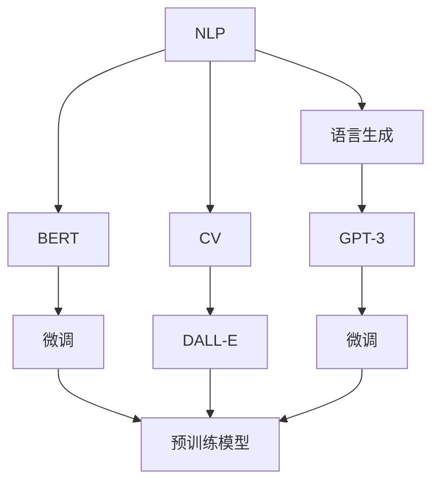
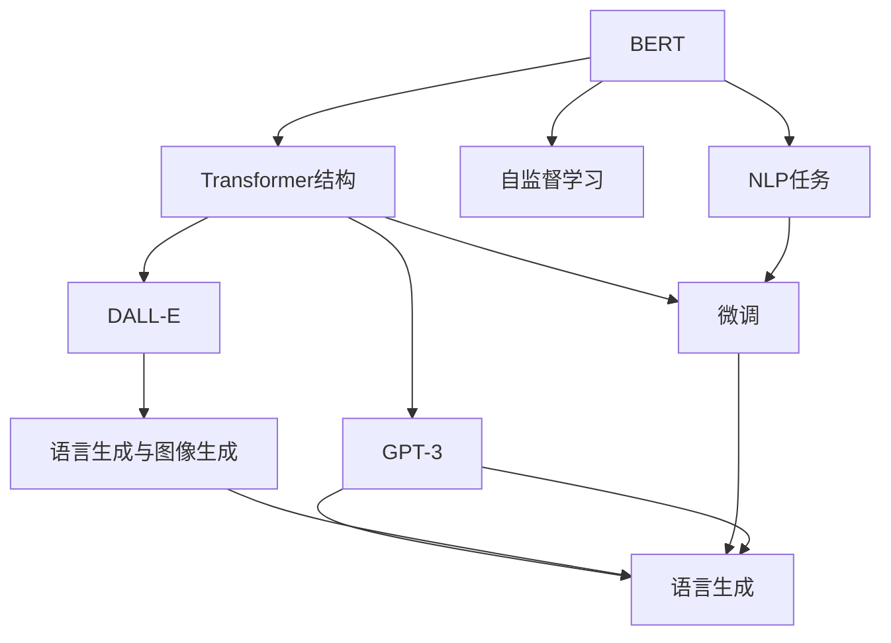
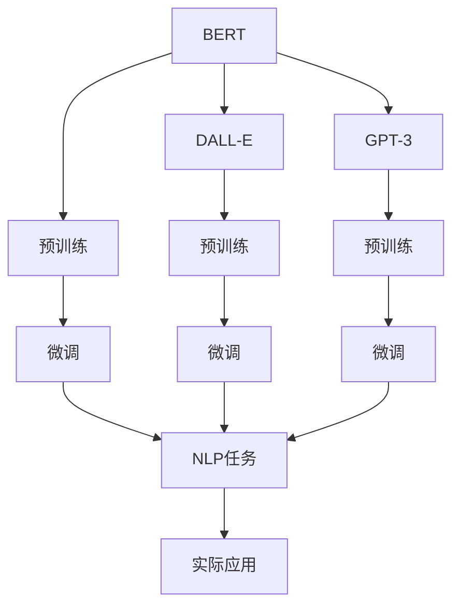

                 

# BERT、DALL-E和GPT-3的崛起

> 关键词：BERT, DALL-E, GPT-3, 自然语言处理(NLP), 计算机视觉(CV), 深度学习(Deep Learning), 预训练模型, 微调(Fine-Tuning), 自然语言生成(NLG), 生成对抗网络(GAN)

## 1. 背景介绍

### 1.1 问题由来
近年来，人工智能（AI）技术在自然语言处理（NLP）和计算机视觉（CV）等领域取得了长足进步。特别是在预训练模型和微调技术的推动下，一系列重大的技术突破不断涌现，极大地改变了我们对这些问题的处理方式。其中，BERT、DALL-E和GPT-3这三个模型，无疑是近年来AI领域的明星，其崛起代表了预训练模型和微调技术发展的新高度。

BERT（Bidirectional Encoder Representations from Transformers）是由Google团队于2018年提出的，用于处理自然语言理解的预训练模型。DALL-E（Denoising Auto-Regressive Language Model for Images）是由OpenAI于2021年提出的，将语言生成与图像生成结合的模型。GPT-3（Generative Pre-trained Transformer 3）也是由OpenAI于2020年推出的，是目前最先进的自然语言生成模型之一。

BERT、DALL-E和GPT-3的出现，不仅提升了NLP和CV任务的性能，还推动了整个AI领域的研究方向和技术演进。本文将深入探讨这三个模型的原理、操作步骤、优缺点及其应用领域，并展望其未来发展趋势。

### 1.2 问题核心关键点
BERT、DALL-E和GPT-3的成功，主要源于它们在预训练、微调和模型架构上的重大创新。这些模型通过大规模无标签数据的自监督学习，在大规模预训练模型的基础上，通过微调模型参数，使得模型能够适应特定的下游任务，获得优异的性能。

核心概念包括：
- 预训练（Pre-training）：在大规模无标签数据上，通过自监督学习任务训练通用模型的过程。
- 微调（Fine-Tuning）：在预训练模型的基础上，使用下游任务的少量标注数据，通过有监督学习优化模型在特定任务上的性能。
- 模型架构（Architecture）：BERT使用Transformer结构，DALL-E将图像生成引入语言模型，GPT-3则是目前最先进的语言生成模型。

### 1.3 问题研究意义
BERT、DALL-E和GPT-3的崛起，对于推动AI技术的发展和应用具有重要意义：

1. 提升模型性能：这些模型通过大规模预训练和微调，能够在各类NLP和CV任务上取得突破性表现，显著提升模型性能。
2. 降低开发成本：预训练模型和微调技术的应用，可以大幅度减少从头训练所需的计算资源和开发时间，加速模型开发。
3. 推动技术创新：这些模型的成功应用，催生了许多新的研究方向和技术范式，如生成对抗网络、自监督学习等，推动了AI技术的不断进步。
4. 拓展应用场景：BERT、DALL-E和GPT-3的应用，使得AI技术在多个垂直行业得以落地，为传统行业数字化转型提供了新的动力。
5. 增强模型泛化能力：通过预训练和微调，模型在多种任务上的泛化能力得到显著提升，能够更好地适应新任务和新数据。

## 2. 核心概念与联系

### 2.1 核心概念概述

为更好地理解BERT、DALL-E和GPT-3的原理和联系，本节将介绍几个密切相关的核心概念：

- 自然语言处理（Natural Language Processing, NLP）：涉及计算机如何理解和生成自然语言的技术，包括文本分类、机器翻译、情感分析等任务。
- 计算机视觉（Computer Vision, CV）：涉及计算机如何理解和生成图像和视频的技术，包括图像分类、目标检测、图像生成等任务。
- 深度学习（Deep Learning）：基于神经网络的学习方法，通过多层非线性变换实现对数据的深度表示和复杂模式识别。
- 预训练模型（Pre-trained Models）：在大规模无标签数据上预训练得到的模型，能够学习到丰富的语言和视觉知识，用于提升下游任务的性能。
- 微调（Fine-Tuning）：在大规模预训练模型的基础上，通过微调模型参数，适应下游任务的特定需求。
- 自然语言生成（Natural Language Generation, NLG）：指生成自然语言文本的过程，通常用于生成对话、摘要、翻译等。
- 生成对抗网络（Generative Adversarial Network, GAN）：由两个神经网络组成的对抗训练框架，用于生成高质量的图像和文本。

这些核心概念之间的逻辑关系可以通过以下Mermaid流程图来展示：



这个流程图展示了大语言模型和计算机视觉模型在NLP、CV、语言生成等领域的迁移学习过程。BERT、DALL-E和GPT-3分别在这些领域展现了卓越的性能，并通过微调技术进一步提升了下游任务的精度。

### 2.2 概念间的关系

这些核心概念之间存在着紧密的联系，形成了预训练模型和微调技术的完整生态系统。下面我通过几个Mermaid流程图来展示这些概念之间的关系。

#### 2.2.1 预训练和微调的关系


这个流程图展示了预训练和微调的基本流程。预训练通过大规模无标签数据训练通用模型，微调则将通用模型适配到具体的下游任务。

#### 2.2.2 BERT、DALL-E和GPT-3的联系



这个流程图展示了BERT、DALL-E和GPT-3在预训练、微调和应用领域上的联系。BERT通过Transformer结构和自监督学习预训练通用NLP模型，DALL-E结合图像生成扩展了语言模型的应用范围，GPT-3则是目前最先进的语言生成模型。

### 2.3 核心概念的整体架构

最后，我们用一个综合的流程图来展示BERT、DALL-E和GPT-3的预训练、微调和应用过程：



这个综合流程图展示了BERT、DALL-E和GPT-3的完整预训练、微调与应用过程。模型通过预训练获得基础能力，通过微调适配特定的下游任务，最终应用于实际应用场景中。

## 3. 核心算法原理 & 具体操作步骤
### 3.1 算法原理概述

BERT、DALL-E和GPT-3的成功，主要得益于其在预训练、微调和模型架构上的创新。下面将详细介绍这三个模型的核心算法原理。

#### 3.1.1 BERT算法原理概述

BERT模型是由Google团队于2018年提出的，主要用于自然语言理解任务。其核心思想是通过双向Transformer编码器，学习句子级别的语义表示，从而提升模型在文本分类、情感分析等任务上的表现。

BERT模型通过掩码语言模型（Masked Language Model, MLM）和下一句预测（Next Sentence Prediction, NSP）两个自监督任务进行预训练。掩码语言模型随机掩盖输入序列中的某些词，让模型预测被掩盖的词；下一句预测则判断两个句子是否相邻。通过这些自监督任务，BERT模型可以学习到丰富的语言知识，包括词向量、句子结构和语义关系等。

预训练后的BERT模型，通过微调适配特定的NLP任务。例如，在文本分类任务中，可以通过在BERT模型的顶层添加一个全连接层，并将输出与标签进行交叉熵损失计算。通过微调，模型能够学习到特定任务的具体知识，从而提升任务的精度。

#### 3.1.2 DALL-E算法原理概述

DALL-E模型是由OpenAI于2021年提出的，主要用于计算机视觉领域的图像生成任务。其核心思想是将语言生成引入图像生成模型中，通过语言和图像之间的双向映射，生成高质量的图像。

DALL-E模型由两部分组成：语言生成器和图像生成器。语言生成器是一个预训练的语言模型，能够生成符合语法和语义的文本；图像生成器是一个生成对抗网络（GAN），用于生成高质量的图像。语言生成器和图像生成器通过一个双向映射函数连接，使得语言和图像能够互相生成和转换。

预训练后的DALL-E模型，通过微调适配特定的图像生成任务。例如，在图像生成任务中，可以通过在DALL-E模型的顶部添加一个全连接层，并将输出与标签进行交叉熵损失计算。通过微调，模型能够学习到特定图像生成的具体知识，从而提升任务的精度。

#### 3.1.3 GPT-3算法原理概述

GPT-3模型是由OpenAI于2020年提出的，主要用于自然语言生成任务。其核心思想是通过Transformer结构，学习大规模语言知识，生成高质量的自然语言文本。

GPT-3模型通过大规模无标签文本数据的自监督学习进行预训练，学习到丰富的语言知识。在预训练过程中，模型通过Transformer结构，对输入文本进行逐层编码，并生成语言模型概率分布。通过微调，模型能够学习到特定任务的具体知识，从而提升任务的精度。

GPT-3模型通过Transformer结构，逐层编码输入文本，并生成语言模型概率分布。通过微调，模型能够学习到特定任务的具体知识，从而提升任务的精度。

### 3.2 算法步骤详解

BERT、DALL-E和GPT-3的预训练、微调和具体操作步骤如下：

#### 3.2.1 BERT预训练和微调步骤

1. 数据准备：收集大规模无标签文本数据，将其分为多个样本进行预训练。
2. 模型加载：使用Hugging Face的BERT库加载预训练模型。
3. 微调准备：准备下游任务的标注数据，并设计合适的输出层和损失函数。
4. 微调训练：在标注数据上，通过梯度下降算法更新模型参数，最小化损失函数。
5. 评估与测试：在验证集和测试集上评估模型性能，并根据结果进行迭代优化。

#### 3.2.2 DALL-E预训练和微调步骤

1. 数据准备：收集大规模无标签文本和图像数据，将其分为多个样本进行预训练。
2. 模型加载：使用OpenAI的DALL-E库加载预训练模型。
3. 微调准备：准备下游任务的标注数据，并设计合适的输出层和损失函数。
4. 微调训练：在标注数据上，通过梯度下降算法更新模型参数，最小化损失函数。
5. 评估与测试：在验证集和测试集上评估模型性能，并根据结果进行迭代优化。

#### 3.2.3 GPT-3预训练和微调步骤

1. 数据准备：收集大规模无标签文本数据，将其分为多个样本进行预训练。
2. 模型加载：使用OpenAI的GPT-3库加载预训练模型。
3. 微调准备：准备下游任务的标注数据，并设计合适的输出层和损失函数。
4. 微调训练：在标注数据上，通过梯度下降算法更新模型参数，最小化损失函数。
5. 评估与测试：在验证集和测试集上评估模型性能，并根据结果进行迭代优化。

### 3.3 算法优缺点

BERT、DALL-E和GPT-3的成功，得益于其在预训练、微调和模型架构上的创新。这些模型的核心优缺点如下：

#### 3.3.1 BERT的优缺点

**优点：**
1. 双向Transformer编码器：能够捕捉句子级别的语义信息，提升模型在NLP任务上的表现。
2. 大规模预训练：通过大规模无标签数据进行预训练，学习丰富的语言知识。
3. 自监督学习：通过掩码语言模型和下一句预测两个自监督任务进行预训练，提升模型泛化能力。

**缺点：**
1. 计算资源消耗大：预训练和微调过程需要消耗大量的计算资源。
2. 模型复杂度高：模型参数量巨大，导致推理速度较慢。
3. 数据依赖性强：预训练和微调效果依赖于高质量的标注数据。

#### 3.3.2 DALL-E的优缺点

**优点：**
1. 图像生成能力：能够生成高质量的图像，扩展了语言模型的应用范围。
2. 双向映射：通过语言和图像之间的双向映射，提升了模型在图像生成任务上的表现。
3. 生成对抗网络：通过GAN技术，提高了图像生成的质量和多样性。

**缺点：**
1. 计算资源消耗大：预训练和微调过程需要消耗大量的计算资源。
2. 模型复杂度高：模型参数量巨大，导致推理速度较慢。
3. 数据依赖性强：预训练和微调效果依赖于高质量的标注数据。

#### 3.3.3 GPT-3的优缺点

**优点：**
1. 大规模语言模型：通过大规模无标签文本数据进行预训练，学习丰富的语言知识。
2. 自然语言生成能力：生成高质量的自然语言文本，广泛应用于对话系统、文本生成等领域。
3. 自监督学习：通过Transformer结构进行自监督预训练，提升了模型的泛化能力。

**缺点：**
1. 计算资源消耗大：预训练和微调过程需要消耗大量的计算资源。
2. 模型复杂度高：模型参数量巨大，导致推理速度较慢。
3. 数据依赖性强：预训练和微调效果依赖于高质量的标注数据。

### 3.4 算法应用领域

BERT、DALL-E和GPT-3在多个领域得到了广泛应用，具体如下：

#### 3.4.1 BERT应用领域

BERT模型在NLP领域得到了广泛应用，具体包括：
1. 文本分类：如情感分析、主题分类、意图识别等。
2. 命名实体识别：识别文本中的人名、地名、机构名等特定实体。
3. 关系抽取：从文本中抽取实体之间的语义关系。
4. 问答系统：对自然语言问题给出答案。
5. 机器翻译：将源语言文本翻译成目标语言。
6. 文本摘要：将长文本压缩成简短摘要。
7. 对话系统：使机器能够与人自然对话。

#### 3.4.2 DALL-E应用领域

DALL-E模型在计算机视觉领域得到了广泛应用，具体包括：
1. 图像生成：生成高质量的图像，应用于图像设计、艺术创作等。
2. 文本到图像：将自然语言描述转换为图像。
3. 图像分类：对图像进行分类、识别等任务。
4. 目标检测：在图像中检测特定物体。
5. 图像增强：对图像进行去噪、补全等增强处理。
6. 图像生成对抗网络：与GAN模型结合，生成更加多样和高质量的图像。

#### 3.4.3 GPT-3应用领域

GPT-3模型在NLP领域得到了广泛应用，具体包括：
1. 文本生成：生成高质量的文本，应用于对话系统、文本生成、摘要生成等。
2. 机器翻译：将源语言文本翻译成目标语言。
3. 问答系统：对自然语言问题给出答案。
4. 文本摘要：将长文本压缩成简短摘要。
5. 情感分析：分析文本的情感倾向。
6. 文本分类：对文本进行分类、识别等任务。
7. 对话系统：使机器能够与人自然对话。

## 4. 数学模型和公式 & 详细讲解 & 举例说明

### 4.1 数学模型构建

本节将使用数学语言对BERT、DALL-E和GPT-3的预训练、微调过程进行更加严格的刻画。

记BERT预训练模型为 $M_{BERT}$，DALL-E预训练模型为 $M_{DALL-E}$，GPT-3预训练模型为 $M_{GPT-3}$。假设预训练任务的数据集为 $D_{pre}$，微调任务的数据集为 $D_{fin}$。

定义模型 $M_{\theta}$ 在数据样本 $(x,y)$ 上的损失函数为 $\ell(M_{\theta}(x),y)$，则在数据集 $D$ 上的经验风险为：

$$
\mathcal{L}(\theta) = \frac{1}{N} \sum_{i=1}^N \ell(M_{\theta}(x_i),y_i)
$$

微调的优化目标是最小化经验风险，即找到最优参数：

$$
\theta^* = \mathop{\arg\min}_{\theta} \mathcal{L}(\theta)
$$

在实践中，我们通常使用基于梯度的优化算法（如SGD、Adam等）来近似求解上述最优化问题。设 $\eta$ 为学习率，$\lambda$ 为正则化系数，则参数的更新公式为：

$$
\theta \leftarrow \theta - \eta \nabla_{\theta}\mathcal{L}(\theta) - \eta\lambda\theta
$$

其中 $\nabla_{\theta}\mathcal{L}(\theta)$ 为损失函数对参数 $\theta$ 的梯度，可通过反向传播算法高效计算。

### 4.2 公式推导过程

以下我们以BERT模型为例，推导其预训练和微调过程的数学公式。

#### 4.2.1 BERT预训练

BERT模型的预训练主要通过掩码语言模型（MLM）和下一句预测（NSP）两个自监督任务进行。掩码语言模型随机掩盖输入序列中的某些词，让模型预测被掩盖的词；下一句预测则判断两个句子是否相邻。

定义掩码语言模型的损失函数为 $\ell_{MLM}(M_{BERT}(x),y)$，下一句预测的损失函数为 $\ell_{NSP}(M_{BERT}(x_1),M_{BERT}(x_2))$，则BERT的预训练损失函数为：

$$
\mathcal{L}_{pre} = \frac{1}{2N} \sum_{i=1}^N (\ell_{MLM}(M_{BERT}(x_i),y_i) + \ell_{NSP}(M_{BERT}(x_1),M_{BERT}(x_2)))
$$

其中 $x_i$ 为输入序列，$y_i$ 为被掩盖的词。

#### 4.2.2 BERT微调

在微调阶段，我们假设微调任务为文本分类任务，输出层为全连接层，损失函数为交叉熵损失函数。假设微调任务的数据集为 $D_{fin}$，则微调的损失函数为：

$$
\ell_{fin}(M_{BERT}(x),y) = -y \log M_{BERT}(x)
$$

将微调损失函数与预训练损失函数结合，得到微调的总体损失函数为：

$$
\mathcal{L}_{fin} = \frac{1}{N} \sum_{i=1}^N \ell_{fin}(M_{BERT}(x_i),y_i) + \mathcal{L}_{pre}
$$

通过梯度下降算法，更新模型参数，最小化总体损失函数。

### 4.3 案例分析与讲解

#### 4.3.1 BERT文本分类微调案例

假设我们有一个文本分类任务，即给定一个新闻标题，判断其是否为体育新闻。数据集 $D_{fin}$ 包含2000条样本，其中1000条为体育新闻，1000条为非体育新闻。

1. 数据准备：收集2000条新闻标题，将它们分为训练集和测试集。
2. 模型加载：使用Hugging Face的BERT库加载预训练模型。
3. 微调准备：设计输出层为全连接层，输出维度为2，分别对应体育和非体育新闻。
4. 微调训练：在训练集上，通过梯度下降算法更新模型参数，最小化交叉熵损失函数。
5. 评估与测试：在测试集上评估模型性能，并根据结果进行迭代优化。

```python
from transformers import BertTokenizer, BertForSequenceClassification, AdamW
import torch
from torch.utils.data import Dataset, DataLoader

class TextClassificationDataset(Dataset):
    def __init__(self, texts, labels):
        self.texts = texts
        self.labels = labels
        self.tokenizer = BertTokenizer.from_pretrained('bert-base-uncased')

    def __len__(self):
        return len(self.texts)

    def __getitem__(self, item):
        text = self.texts[item]
        label = self.labels[item]
        encoding = self.tokenizer(text, truncation=True, padding='max_length', max_length=256)
        input_ids = encoding['input_ids']
        attention_mask = encoding['attention_mask']
        return {'input_ids': input_ids, 'attention_mask': attention_mask, 'labels': torch.tensor(label)}

tokenizer = BertTokenizer.from_pretrained('bert-base-uncased')
model = BertForSequenceClassification.from_pretrained('bert-base-uncased', num_labels=2)

optimizer = AdamW(model.parameters(), lr=2e-5)
train_dataset = TextClassificationDataset(train_texts, train_labels)
test_dataset = TextClassificationDataset(test_texts, test_labels)
train_loader = DataLoader(train_dataset, batch_size=16, shuffle=True)
test_loader = DataLoader(test_dataset, batch_size=16)

device = torch.device('cuda' if torch.cuda.is_available() else 'cpu')
model.to(device)

for epoch in range(3):
    model.train()
    for batch in train_loader:
        input_ids = batch['input_ids'].to(device)
        attention_mask = batch['attention_mask'].to(device)
        labels = batch['labels'].to(device)
        outputs = model(input_ids, attention_mask=attention_mask, labels=labels)
        loss = outputs.loss
        loss.backward()
        optimizer.step()

    model.eval()
    with torch.no_grad():
        accuracy = 0
        for batch in test_loader:
            input_ids = batch['input_ids'].to(device)
            attention_mask = batch['attention_mask'].to(device)
            labels = batch['labels'].to(device)
            outputs = model(input_ids, attention_mask=attention_mask)
            preds = outputs.predictions.argmax(dim=1).to('cpu').tolist()
            for pred, label in zip(preds, labels):
                if pred == label:
                    accuracy += 1
        print('Accuracy:', accuracy / len(test_loader.dataset))
```

### 4.4 代码解读与分析

#### 4.4.1 BERT文本分类微调代码实现

**TextClassificationDataset类**：
- `__init__`方法：初始化文本、标签和分词器。
- `__len__`方法：返回数据集的样本数量。
- `__getitem__`方法：对单个样本进行处理，将文本输入编码为token ids，并对其进行定长padding。

**训练和评估函数**：
- 使用PyTorch的DataLoader对数据集进行批次化加载，供模型训练和推理使用。
- 训练函数中，将模型设为训练模式，对数据集进行迭代，计算loss并反向传播更新模型参数。
- 评估函数中，将模型设为评估模式，对测试集进行迭代，计算准确率并输出。

**模型训练与评估流程**：
- 定义训练轮数和批次大小，开始循环迭代
- 每个epoch内，先在训练集上训练，输出训练结果
- 在测试集上评估，输出测试结果
- 所有epoch结束后，给出最终评估结果

可以看到，BERT文本分类微调的代码实现相对简洁，借助Hugging Face的库，可以方便地进行模型的加载和微调。

## 5. 项目实践：代码实例和详细解释说明

### 5.1 开发环境搭建

在进行BERT、DALL-E和GPT-3的微调实践前，我们需要准备好开发环境。以下是使用Python进行PyTorch开发的环境配置流程：

1. 安装Anaconda：从官网下载并安装Anaconda，用于创建独立的Python环境。

2. 创建并激活虚拟环境：
```bash
conda create -n pytorch-env python=3.8 
conda activate pytorch-env
```

3. 安装PyTorch：根据CUDA版本，从官网获取对应的安装命令。例如：
```bash
conda install pytorch torchvision torchaudio cudatoolkit=11.1 -c pytorch -c conda-forge
```

4. 安装Transformers库：
```bash
pip install transformers
```

5. 安装各类工具包：
```bash
pip install numpy pandas scikit-learn matplotlib tqdm jupyter notebook ipython
```

完成上述步骤后，即可在`pytorch-env`环境中开始微调实践。

### 5.2 源代码详细实现

这里我们以BERT模型进行文本分类微

