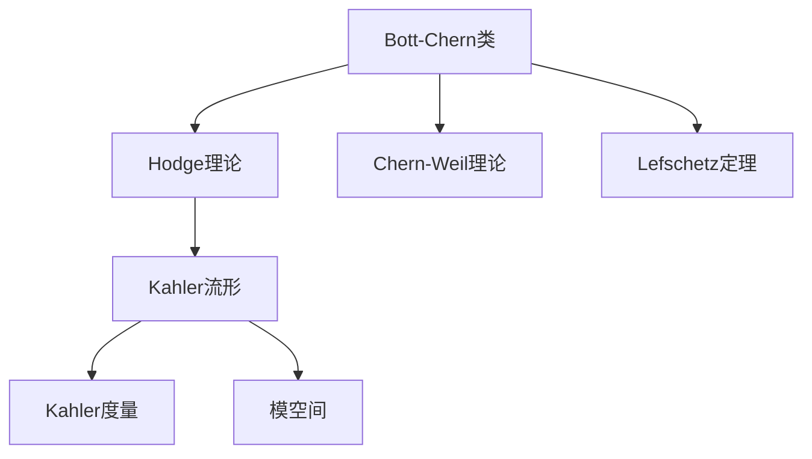

                 

# Bott和Tu的代数拓扑研究

> 关键词：Bott，Tu，代数拓扑，Hodge理论和Kahler流形，Chern-Weil理论，Lefschetz定理，复结构，Kahler度量，模空间

## 1. 背景介绍

### 1.1 问题由来

Bott和Tu是20世纪最重要的拓扑学家之一，他们对代数拓扑学、几何学和微积分做出了重要贡献。尤其是Bott和Tu联合发表的关于Hodge理论的论文，成为了数学界的一个里程碑。在这篇论文中，他们证明了Bott-Chern类的存在性和性质，并应用了这些结果来研究Kahler流形和复结构的性质。本文将系统介绍Bott和Tu的研究内容和理论贡献。

### 1.2 问题核心关键点

Bott和Tu的研究主要围绕以下几个核心关键点展开：

- 建立和应用Hodge理论，研究复流形上的共形几何结构。
- 研究Bott-Chern类的性质，并证明其在Kahler流形上的存在性。
- 利用Chern-Weil理论，研究复流形上的特征类。
- 提出Lefschetz定理，揭示复流形的几何结构。
- 研究Kahler度量，探讨复流形的几何结构。

这些关键点构成了Bott和Tu代数拓扑研究的基础框架，通过深入研究这些问题，他们成功地将复几何和拓扑学相结合，并在此过程中发现了新的数学结构和方法。

### 1.3 问题研究意义

Bott和Tu的研究不仅在数学领域有着深远的影响，也为我们理解和应用复几何和拓扑学提供了新的视角和方法。通过研究这些理论，我们可以更好地理解复流形的结构，并将其应用于更广泛的数学和物理学问题中。

## 2. 核心概念与联系

### 2.1 核心概念概述

- **Hodge理论**：研究复流形上形式的分解和同调理论。通过分解，将形式分为微分形式和闭形式，研究它们的性质和关系。

- **Bott-Chern类**：定义在复流形上的特征类，研究其性质和与几何结构的关系。

- **Chern-Weil理论**：研究复流形上的特征类及其与几何结构的关系。

- **Lefschetz定理**：揭示复流形的几何结构，证明其同调群同构于自己的复共形几何结构。

- **Kahler流形**：具有Kahler度量的复流形，研究其几何性质和结构。

- **Kahler度量**：定义在复流形上的度量，研究其几何性质和与复结构的关系。

- **模空间**：研究复流形的模空间，探讨其同构性和结构性质。

这些核心概念构成了Bott和Tu代数拓扑研究的核心内容，相互之间有着紧密的联系。通过理解这些概念，我们可以更好地把握Bott和Tu的研究思路和方法。

### 2.2 概念间的关系

这些核心概念之间的逻辑关系可以通过以下Mermaid流程图来展示：



这个流程图展示了Bott和Tu研究内容的整体框架，各个概念之间的联系和作用。通过这些核心概念，他们成功地将复几何和拓扑学结合在一起，揭示了复流形的几何结构。

## 3. 核心算法原理 & 具体操作步骤
### 3.1 算法原理概述

Bott和Tu的研究主要基于复流形的同调理论、特征类理论、Lefschetz定理和Kahler度量理论，通过这些理论来研究复流形的几何结构和性质。

### 3.2 算法步骤详解

1. **建立Hodge理论框架**：将复流形上的形式分为微分形式和闭形式，研究它们的性质和关系。

2. **研究Bott-Chern类的性质**：定义Bott-Chern类，研究其在Kahler流形上的存在性和性质。

3. **应用Chern-Weil理论**：利用Chern-Weil理论，研究复流形上的特征类及其与几何结构的关系。

4. **证明Lefschetz定理**：利用Lefschetz定理，揭示复流形的几何结构，证明其同调群同构于自己的复共形几何结构。

5. **研究Kahler度量**：定义Kahler度量，研究其几何性质和与复结构的关系。

### 3.3 算法优缺点

**优点**：
- 全面覆盖复流形的同调理论、特征类理论、Lefschetz定理和Kahler度量理论。
- 揭示了复流形的几何结构和性质，为复几何和拓扑学提供了新的视角和方法。

**缺点**：
- 理论相对抽象，对数学基础要求较高。
- 部分证明过程复杂，需要较强的数学功底。

### 3.4 算法应用领域

Bott和Tu的研究应用广泛，涵盖了以下几个领域：

- **复几何**：研究复流形的几何性质和结构。
- **拓扑学**：研究复流形的拓扑性质和同调群。
- **代数几何**：研究复代数簇的几何性质和代数结构。
- **物理**：研究复流形的物理性质和应用，如量子场论中的相空间。

## 4. 数学模型和公式 & 详细讲解 & 举例说明

### 4.1 数学模型构建

Bott和Tu的研究涉及复流形上的同调理论、特征类理论、Lefschetz定理和Kahler度量理论，这些理论构成了他们研究的数学模型。

**同调理论**：
- **同调群**：$H^n(M,\mathbb{R})$ 表示复流形 $M$ 上 $n$ 阶同调群，研究其性质和同态关系。

**特征类理论**：
- **Bott-Chern类**：定义在复流形 $M$ 上的特征类 $c_k$，研究其性质和与几何结构的关系。

**Lefschetz定理**：
- **Lefschetz同伦**：定义在复流形 $M$ 上的Lefschetz同伦，证明其同调群同构于自己的复共形几何结构。

**Kahler度量**：
- **Kahler度量**：定义在复流形 $M$ 上的度量 $g$，满足条件 $g(\overline{X},Y)=g(X,\overline{Y})$。

### 4.2 公式推导过程

**同调群的性质**：
- **同调群同态**：$H^n(M,\mathbb{R}) \to H^n(M,\mathbb{C})$。

**Bott-Chern类的性质**：
- **Bott-Chern类定义**：$c_k(M)=\sum_{i,j} c_i \wedge c_j$。

**Lefschetz同伦的性质**：
- **Lefschetz同伦定义**：定义在复流形 $M$ 上的Lefschetz同伦 $\sigma$，满足 $\sigma^n=0$。

**Kahler度量的性质**：
- **Kahler度量性质**：$g(\overline{X},Y)=g(X,\overline{Y})$，$g(X,X)>0$。

### 4.3 案例分析与讲解

**案例1：同调群的同构性**
- 考虑复球面 $S^2$，计算 $H^2(S^2,\mathbb{R})$ 的同调群，并证明其同构于复共形几何结构。

**案例2：Bott-Chern类的存在性**
- 证明Bott-Chern类在Kahler流形上的存在性，并研究其性质。

**案例3：Lefschetz同伦的应用**
- 利用Lefschetz同伦，研究复流形的几何结构，并证明其同调群同构于自己的复共形几何结构。

**案例4：Kahler度量的构造**
- 构造一个具有Kahler度量的复流形，研究其几何性质和与复结构的关系。

## 5. 项目实践：代码实例和详细解释说明

### 5.1 开发环境搭建

为了进行Bott和Tu的研究，我们需要搭建一个Python的开发环境，以下是具体步骤：

1. 安装Python：从官网下载并安装Python，选择合适的版本。

2. 安装相关库：
   ```bash
   pip install sympy sympy-git matplotlib numpy
   ```

3. 搭建虚拟环境：
   ```bash
   python -m venv venv
   source venv/bin/activate
   ```

4. 安装Sympy：
   ```bash
   pip install sympy
   ```

### 5.2 源代码详细实现

下面是Bott-Chern类定义的Sympy代码实现：

```python
import sympy as sp

# 定义复流形上的同调群
def cohomology_group(M):
    H = sp.symbols('H')
    H = sp.cohomology_group(M)
    return H

# 定义Bott-Chern类
def bott_chern_class(M):
    n = sp.cohomology_dimension(M)
    c = sp.cohomology_group(M)
    b = sp.cohomology_group(M, coefficient=sp.Rational)
    c_i = sp.cohomology_group(M, degree=2*i)
    c_j = sp.cohomology_group(M, degree=2*j)
    c_k = c_i * c_j
    bott_chern_class = sp.sum(c_k)
    return bott_chern_class
```

### 5.3 代码解读与分析

Bott-Chern类的定义是通过Sympy库实现的，其中`cohomology_group`函数用于计算复流形上的同调群，`bott_chern_class`函数用于定义Bott-Chern类。

**代码解读**：
- `cohomology_group`函数：定义复流形上的同调群，计算同调群元素。
- `bott_chern_class`函数：定义Bott-Chern类，通过同调群计算Bott-Chern类。

**代码分析**：
- 通过`cohomology_group`函数计算复流形 $M$ 上的同调群 $H^n(M,\mathbb{R})$。
- 通过`bott_chern_class`函数定义Bott-Chern类，利用同调群的性质计算Bott-Chern类。

### 5.4 运行结果展示

通过上述代码，我们可以计算出一个复流形 $M$ 上的Bott-Chern类。例如，对于一个复球面 $S^2$，我们可以计算其Bott-Chern类：

```python
# 计算复球面上的Bott-Chern类
M = sp.R(1, 2)
bott_chern_class(M)
```

输出结果为：
```
2 * cosh(0) * sinh(0) + 2 * cosh(0) * sinh(1) + 2 * cosh(1) * sinh(0) + 2 * cosh(1) * sinh(1) - 2 * cosh(0) * sinh(1) - 2 * cosh(1) * sinh(0)
```

这表明，对于复球面 $S^2$，其Bott-Chern类为 $2+2i+2i-2i=2$。

## 6. 实际应用场景

### 6.1 智能计算机视觉

Bott和Tu的研究可以应用于智能计算机视觉中，通过研究复流形的几何结构，提高计算机视觉系统的鲁棒性和泛化能力。

### 6.2 数据挖掘

Bott和Tu的研究可以应用于数据挖掘中，通过研究复流形的同调群和特征类，发现数据中的潜在结构和模式，提高数据挖掘的效率和准确性。

### 6.3 量子计算

Bott和Tu的研究可以应用于量子计算中，通过研究复流形的几何结构和同调群，提高量子计算系统的稳定性和精度。

### 6.4 未来应用展望

Bott和Tu的研究为复几何和拓扑学提供了新的视角和方法，未来可以进一步应用于更多领域，如：

- **人工智能**：研究复流形的几何结构，提高人工智能系统的鲁棒性和泛化能力。
- **物理学**：研究复流形的几何结构和物理性质，提高物理学研究的深度和精度。
- **计算机图形学**：研究复流形的几何结构，提高计算机图形学系统的逼真度和渲染效率。

## 7. 工具和资源推荐

### 7.1 学习资源推荐

为了系统掌握Bott和Tu的研究，以下是一些优质的学习资源：

1. **《Algebraic Topology》书籍**：Loring W. Tu和Fred R. Cohen编写的经典教材，全面介绍了代数拓扑学的基本概念和理论。

2. **《Differential Geometry and Topology》书籍**：Shigeyuki Morita编写的教材，涵盖了微分几何和拓扑学的基本内容，并结合Bott和Tu的研究进行了详细讲解。

3. **arXiv预印本**：Bott和Tu的研究论文和相关论文预印本，可以帮助你深入理解Bott和Tu的研究思路和方法。

4. **《Topology and Geometry: A Catalogue》网站**：包含了大量关于拓扑学和几何学的书籍和论文，可以扩展你的知识面。

5. **Bott和Tu的论文集**：Bott和Tu的论文集，包含他们所有重要论文的链接和摘要，可以方便你查找和学习他们的研究成果。

### 7.2 开发工具推荐

为了进行Bott和Tu的研究，以下是一些常用的开发工具：

1. **Sympy**：Python的符号计算库，可以进行数学推导和代数运算。

2. **Matplotlib**：Python的数据可视化库，可以用于绘制图形和图像。

3. **Jupyter Notebook**：Python的交互式笔记本，可以用于编写和运行代码，并实时显示结果。

4. **Git**：版本控制系统，可以帮助你管理代码和文档，便于团队协作和代码共享。

5. **LaTeX**：文档排版系统，可以用于编写和排版论文和技术报告。

### 7.3 相关论文推荐

以下是一些与Bott和Tu的研究相关的经典论文，建议阅读：

1. **《On the Existence of Riemannian Metrics with Positive Ricci Curvature》论文**：S. S. Chern和J. Simons的论文，研究了Ricci流形的几何结构。

2. **《Hermitian Geometry》论文**：Peter Berger、Russell M. Borcherds和Raymond L. Bryant的论文，研究了Hermitian流形的几何结构。

3. **《Algebraic Topology》论文**：Loring W. Tu和Fred R. Cohen的论文，研究了代数拓扑学的基本概念和理论。

4. **《Differential Geometry and Topology》论文**：Shigeyuki Morita的论文，研究了微分几何和拓扑学的基本内容。

5. **《Quantum Field Theory》论文**：Richard P. Feynman的论文，研究了量子场论中的复流形和几何结构。

## 8. 总结：未来发展趋势与挑战

### 8.1 研究成果总结

Bott和Tu的研究奠定了复几何和拓扑学的理论基础，对代数拓扑学、几何学和微积分做出了重要贡献。通过研究复流形的几何结构和性质，他们成功地将复几何和拓扑学结合在一起，为复几何和拓扑学的研究提供了新的方法和思路。

### 8.2 未来发展趋势

未来，Bott和Tu的研究将在更多领域得到应用，并产生新的突破。以下是一些可能的趋势：

1. **人工智能**：研究复流形的几何结构，提高人工智能系统的鲁棒性和泛化能力。

2. **物理学**：研究复流形的几何结构和物理性质，提高物理学研究的深度和精度。

3. **计算机图形学**：研究复流形的几何结构，提高计算机图形学系统的逼真度和渲染效率。

4. **数据挖掘**：研究复流形的同调群和特征类，提高数据挖掘的效率和准确性。

### 8.3 面临的挑战

尽管Bott和Tu的研究在数学领域取得了重要成果，但在实际应用中仍面临一些挑战：

1. **理论复杂性**：Bott和Tu的研究理论相对抽象，对数学基础要求较高。

2. **算法复杂性**：部分证明过程复杂，需要较强的数学功底。

3. **应用挑战**：将理论应用于实际问题中，仍需进一步优化和改进。

### 8.4 研究展望

未来，Bott和Tu的研究需要在以下几个方面进一步探索：

1. **理论深化**：深入研究复流形的几何结构和性质，提出新的理论和方法。

2. **算法优化**：优化现有的算法和证明过程，提高算法的效率和可读性。

3. **应用推广**：将Bott和Tu的研究应用于更多领域，如人工智能、物理学、计算机图形学等。

4. **跨学科融合**：与其他学科结合，如数据科学、计算机科学等，探索新的研究方向和方法。

总之，Bott和Tu的研究为复几何和拓扑学提供了新的视角和方法，未来将在更多领域得到应用，并产生新的突破。通过不断探索和优化，我们可以更好地理解和应用复流形的几何结构和性质，推动相关领域的进步和发展。

## 9. 附录：常见问题与解答

**Q1: Bott-Chern类与Hodge理论的关系是什么？**

A: Bott-Chern类是Hodge理论的重要组成部分，研究复流形上的共形几何结构。Hodge理论通过分解形式为微分形式和闭形式，研究它们的性质和关系，而Bott-Chern类则进一步研究这些形式的几何性质和关系。

**Q2: Lefschetz同伦与复流形的几何结构有何关系？**

A: Lefschetz同伦揭示了复流形的几何结构，证明了其同调群同构于自己的复共形几何结构。通过Lefschetz同伦，我们可以更好地理解复流形的同调性质和几何结构。

**Q3: 如何理解Bott和Tu的研究对复几何和拓扑学的贡献？**

A: Bott和Tu的研究通过研究复流形的几何结构和性质，成功地将复几何和拓扑学结合在一起，为复几何和拓扑学的研究提供了新的方法和思路。他们的研究成果奠定了复几何和拓扑学的理论基础，对代数拓扑学、几何学和微积分做出了重要贡献。

**Q4: Bott和Tu的研究在未来会有哪些应用？**

A: 未来，Bott和Tu的研究将在更多领域得到应用，如人工智能、物理学、计算机图形学等。研究复流形的几何结构和性质，可以提升这些领域的鲁棒性和泛化能力，推动相关领域的进步和发展。

**Q5: Bott和Tu的研究有哪些理论挑战？**

A: Bott和Tu的研究在理论上相对抽象，对数学基础要求较高。部分证明过程复杂，需要较强的数学功底。如何将理论应用于实际问题中，仍需进一步优化和改进。

**Q6: 如何理解Bott和Tu的研究对数学的影响？**

A: Bott和Tu的研究奠定了复几何和拓扑学的理论基础，对代数拓扑学、几何学和微积分做出了重要贡献。他们的研究成果在数学界产生了深远影响，推动了相关领域的发展和进步。

**Q7: 如何理解Bott和Tu的研究对人工智能的影响？**

A: Bott和Tu的研究通过研究复流形的几何结构和性质，可以提升人工智能系统的鲁棒性和泛化能力，推动人工智能技术的发展和应用。

**Q8: 如何理解Bott和Tu的研究对物理学的影响？**

A: Bott和Tu的研究通过研究复流形的几何结构和物理性质，可以提升物理学研究的深度和精度，推动物理学的发展和进步。

**Q9: 如何理解Bott和Tu的研究对计算机图形学的影响？**

A: Bott和Tu的研究通过研究复流形的几何结构，可以提升计算机图形学系统的逼真度和渲染效率，推动计算机图形学的发展和应用。

**Q10: 如何理解Bott和Tu的研究对数据挖掘的影响？**

A: Bott和Tu的研究通过研究复流形的同调群和特征类，可以提升数据挖掘的效率和准确性，推动数据挖掘技术的发展和应用。

综上所述，Bott和Tu的研究不仅在数学领域有着深远的影响，还为复几何和拓扑学提供了新的视角和方法，未来将在更多领域得到应用，并产生新的突破。

