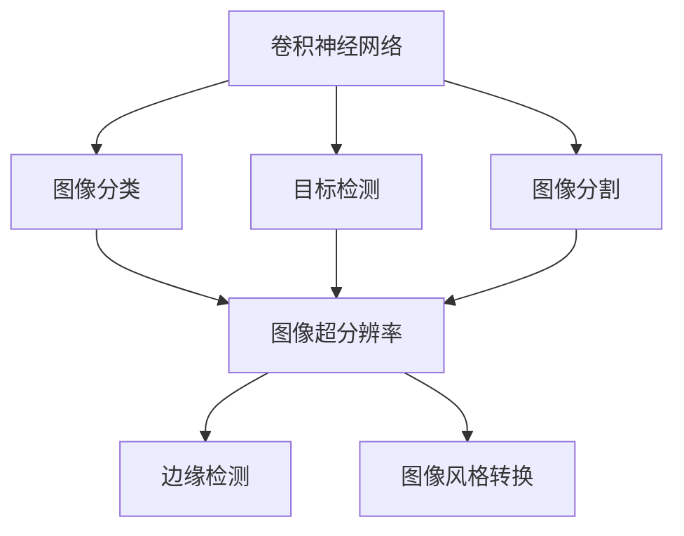
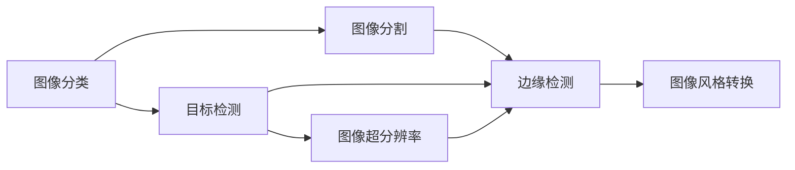
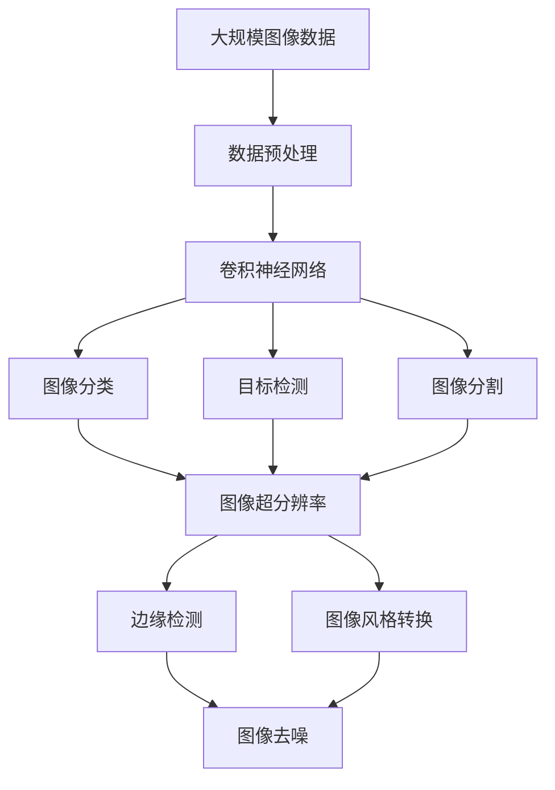

                 

# Computer Vision (CV) 原理与代码实战案例讲解

> 关键词：Computer Vision, Convolutional Neural Networks (CNNs), Image Classification, Object Detection, Image Segmentation, Image Super-Resolution, Edge Detection, Image Style Transfer, Learning Rate, Batch Size, Dropout, Data Augmentation

## 1. 背景介绍

计算机视觉（Computer Vision, CV）是人工智能领域中非常重要的一个分支，它研究如何让计算机理解、解释、甚至模拟人类视觉系统的能力。在过去几十年间，随着深度学习技术的发展，计算机视觉技术取得了显著的进步，广泛应用于自动驾驶、医学图像分析、人脸识别、安防监控等诸多领域。本文旨在深入浅出地介绍计算机视觉的核心原理，并通过具体的代码案例讲解，帮助读者掌握相关技术实现。

### 1.1 问题由来

计算机视觉技术的发展历程可以追溯到20世纪80年代，当时计算机视觉领域主要依赖于手工特征提取和模板匹配等方法。然而，这些方法的计算复杂度高，且对于不同任务需要设计特定的特征提取方法，难以泛化到其他任务。随着深度学习技术，尤其是卷积神经网络（Convolutional Neural Networks, CNNs）的提出，计算机视觉技术迎来了新的曙光。

深度学习技术，尤其是CNNs，通过自动学习数据中的抽象特征，能够处理大规模数据，并在复杂的视觉任务中取得优异性能。随着越来越多的预训练模型和微调方法的涌现，计算机视觉技术的应用范围和性能也在不断扩大，逐渐成为人工智能领域中的重要支柱。

## 2. 核心概念与联系

### 2.1 核心概念概述

为更好地理解计算机视觉的核心原理，本节将介绍几个关键概念：

- 卷积神经网络（CNNs）：一种特殊的神经网络结构，通过卷积操作提取图像的空间特征，常用于图像分类、目标检测、图像分割等任务。
- 图像分类（Image Classification）：将输入图像分为预定义的类别，如猫、狗、汽车等。
- 目标检测（Object Detection）：在输入图像中定位和分类其中的物体，如检测人脸、车辆等。
- 图像分割（Image Segmentation）：将图像划分为若干个部分，每个部分属于预定义的类别，如分割图像中的物体、背景等。
- 图像超分辨率（Image Super-Resolution）：将低分辨率图像复原为高分辨率图像。
- 边缘检测（Edge Detection）：检测图像中的边缘信息，常用于图像分析和计算机视觉中的分割任务。
- 图像风格转换（Image Style Transfer）：将一幅图像的风格（如颜色、纹理等）转换到另一幅图像上。

这些核心概念之间的逻辑关系可以通过以下Mermaid流程图来展示：



这个流程图展示了几类计算机视觉任务及其相互关系：

1. 卷积神经网络是图像分类、目标检测、图像分割等任务的核心算法。
2. 图像分类、目标检测、图像分割、图像超分辨率、边缘检测、图像风格转换等任务都可以使用卷积神经网络进行处理。
3. 这些任务之间存在技术共通性，很多方法可以互相借鉴和融合。

### 2.2 概念间的关系

这些核心概念之间存在着紧密的联系，形成了计算机视觉技术的应用生态系统。下面我们通过几个Mermaid流程图来展示这些概念之间的关系。

#### 2.2.1 计算机视觉任务的关系



这个流程图展示了不同计算机视觉任务之间的关系：

1. 图像分类是目标检测和图像分割的基础。
2. 目标检测可以进一步实现图像超分辨率和边缘检测。
3. 图像分割也可以用于边缘检测，并且可以与图像超分辨率一起使用。
4. 图像风格转换可以通过目标检测、图像分割等技术实现。

#### 2.2.2 卷积神经网络的应用


这个流程图展示了卷积神经网络在计算机视觉中的应用：

1. 卷积神经网络可以用于图像分类、目标检测、图像分割等任务。
2. 图像超分辨率、边缘检测、图像风格转换等任务可以通过卷积神经网络进行改进或增强。
3. 卷积神经网络的结构和技术可以跨领域应用，如在自然语言处理中也可以用于文本分类和生成等任务。

### 2.3 核心概念的整体架构

最后，我们用一个综合的流程图来展示这些核心概念在大规模计算机视觉应用中的整体架构：



这个综合流程图展示了从数据预处理到最终应用的完整过程：

1. 大规模图像数据首先进行预处理，如数据增强、标准化等。
2. 预处理后的数据输入卷积神经网络进行处理。
3. 卷积神经网络可以用于图像分类、目标检测、图像分割等任务。
4. 图像超分辨率、边缘检测、图像风格转换等任务可以通过卷积神经网络进行改进或增强。
5. 预处理、卷积神经网络、图像处理任务可以互相融合，实现更高效、更准确的应用。

## 3. 核心算法原理 & 具体操作步骤
### 3.1 算法原理概述

计算机视觉的核心算法是卷积神经网络（CNNs）。CNNs通过卷积操作提取图像的空间特征，并通过池化、归一化等技术进行特征融合。其基本结构包括卷积层、池化层、全连接层等。

CNNs的核心思想是通过自动学习数据中的抽象特征，逐步提取图像的高级特征，最终实现图像分类、目标检测、图像分割等任务。具体来说，CNNs通过以下步骤实现图像特征提取和分类：

1. 卷积操作：通过卷积核对图像进行卷积运算，提取图像的空间特征。
2. 池化操作：对卷积结果进行池化操作，降低特征维度，防止过拟合。
3. 全连接层：将池化结果输入全连接层，进行最终的分类。

CNNs的训练过程通常使用反向传播算法，通过最小化损失函数，不断更新模型参数，优化模型性能。

### 3.2 算法步骤详解

卷积神经网络的训练过程包括数据预处理、模型定义、损失函数定义、优化器选择和模型训练等步骤。

1. **数据预处理**：将原始图像数据进行预处理，如标准化、归一化、数据增强等，以便于模型训练。

2. **模型定义**：定义卷积神经网络的架构，包括卷积层、池化层、全连接层等。

3. **损失函数定义**：定义用于衡量模型预测结果与真实标签之间差异的损失函数，如交叉熵损失、均方误差损失等。

4. **优化器选择**：选择合适的优化器，如SGD、Adam等，设置学习率、批大小等超参数。

5. **模型训练**：使用反向传播算法更新模型参数，最小化损失函数。

下面是一个简单的卷积神经网络训练流程的伪代码：

```python
# 导入所需的库和模块
import torch
import torch.nn as nn
import torch.optim as optim
from torch.utils.data import DataLoader

# 定义模型
class ConvNet(nn.Module):
    def __init__(self):
        super(ConvNet, self).__init__()
        self.conv1 = nn.Conv2d(in_channels=3, out_channels=32, kernel_size=3, stride=1, padding=1)
        self.pool1 = nn.MaxPool2d(kernel_size=2, stride=2)
        self.conv2 = nn.Conv2d(in_channels=32, out_channels=64, kernel_size=3, stride=1, padding=1)
        self.pool2 = nn.MaxPool2d(kernel_size=2, stride=2)
        self.fc1 = nn.Linear(in_features=64 * 7 * 7, out_features=512)
        self.fc2 = nn.Linear(in_features=512, out_features=num_classes)

    def forward(self, x):
        x = self.conv1(x)
        x = nn.ReLU()(x)
        x = self.pool1(x)
        x = self.conv2(x)
        x = nn.ReLU()(x)
        x = self.pool2(x)
        x = x.view(x.size(0), -1)
        x = self.fc1(x)
        x = nn.ReLU()(x)
        x = self.fc2(x)
        return x

# 定义损失函数和优化器
criterion = nn.CrossEntropyLoss()
optimizer = optim.Adam(model.parameters(), lr=0.001)

# 加载数据集和数据增强
train_loader = DataLoader(train_dataset, batch_size=32, shuffle=True, num_workers=4)
test_loader = DataLoader(test_dataset, batch_size=32, shuffle=False, num_workers=4)

# 训练模型
for epoch in range(num_epochs):
    model.train()
    running_loss = 0.0
    for i, data in enumerate(train_loader, 0):
        inputs, labels = data
        optimizer.zero_grad()
        outputs = model(inputs)
        loss = criterion(outputs, labels)
        loss.backward()
        optimizer.step()

    print(f'Epoch {epoch + 1}, Loss: {running_loss / len(train_loader):.4f}')
```

### 3.3 算法优缺点

卷积神经网络具有以下优点：

- **参数共享**：卷积操作可以共享权重，减少模型参数量，提高计算效率。
- **局部连接**：卷积操作只处理图像的局部区域，能够捕捉局部特征，减少全局过拟合。
- **平移不变性**：卷积操作具有平移不变性，能够提取图像的不变特征。

同时，卷积神经网络也存在一些缺点：

- **局部感受野**：卷积操作只处理局部区域，难以捕捉全局特征。
- **通道数依赖**：卷积神经网络的通道数较多时，训练和推理计算量大，需要大量计算资源。

### 3.4 算法应用领域

卷积神经网络已经在计算机视觉的诸多领域中得到了广泛应用，包括：

- 图像分类：如猫狗识别、交通标志识别等。
- 目标检测：如人脸检测、车辆检测等。
- 图像分割：如医学图像分割、道路分割等。
- 图像超分辨率：如低分辨率图像复原等。
- 边缘检测：如Sobel算子、Canny算子等。
- 图像风格转换：如GAN风格转换、Neural Style等。

## 4. 数学模型和公式 & 详细讲解 & 举例说明

### 4.1 数学模型构建

卷积神经网络的基本数学模型包括以下几个组成部分：

1. 卷积操作：通过卷积核与输入图像进行卷积运算，提取局部特征。
2. 池化操作：对卷积结果进行池化操作，降低特征维度，防止过拟合。
3. 全连接层：将池化结果输入全连接层，进行最终的分类。

下面以图像分类任务为例，介绍卷积神经网络的数学模型构建。

假设输入图像的大小为 $3 \times 224 \times 224$，卷积核的大小为 $3 \times 3$，卷积核的数量为 $32$，池化操作的大小为 $2 \times 2$。

卷积操作的数学模型可以表示为：

$$
h(x) = \sigma(W * x + b)
$$

其中，$h(x)$ 表示卷积后的特征图，$W$ 表示卷积核权重，$x$ 表示输入图像，$b$ 表示偏置项，$\sigma$ 表示激活函数。

池化操作的数学模型可以表示为：

$$
h(x) = \sigma(W * x + b)
$$

其中，$h(x)$ 表示池化后的特征图，$W$ 表示池化核权重，$x$ 表示卷积后的特征图，$b$ 表示偏置项，$\sigma$ 表示激活函数。

全连接层的数学模型可以表示为：

$$
h(x) = \sigma(W * x + b)
$$

其中，$h(x)$ 表示全连接层的输出，$W$ 表示全连接层权重，$x$ 表示池化后的特征图，$b$ 表示偏置项，$\sigma$ 表示激活函数。

### 4.2 公式推导过程

下面以一个简单的卷积神经网络为例，推导其前向传播和反向传播过程。

假设输入图像的大小为 $3 \times 224 \times 224$，卷积核的大小为 $3 \times 3$，卷积核的数量为 $32$，池化操作的大小为 $2 \times 2$。

**前向传播**

1. **卷积层**：
   - 输入：$3 \times 224 \times 224$
   - 输出：$32 \times 112 \times 112$
   - 卷积核：$3 \times 3 \times 32 \times 3$
   - 偏置项：$32 \times 1$

   卷积操作的公式为：
   $$
   h(x) = \sigma(W * x + b)
   $$

   其中，$W$ 表示卷积核权重，$x$ 表示输入图像，$b$ 表示偏置项，$\sigma$ 表示激活函数。

2. **池化层**：
   - 输入：$32 \times 112 \times 112$
   - 输出：$32 \times 56 \times 56$
   - 池化核：$2 \times 2 \times 32 \times 1$
   - 偏置项：$32 \times 1$

   池化操作的公式为：
   $$
   h(x) = \sigma(W * x + b)
   $$

   其中，$W$ 表示池化核权重，$x$ 表示卷积后的特征图，$b$ 表示偏置项，$\sigma$ 表示激活函数。

3. **全连接层**：
   - 输入：$32 \times 56 \times 56$
   - 输出：$1 \times 1$
   - 权重：$56 \times 1 \times 1 \times num_classes$
   - 偏置项：$1 \times 1$

   全连接层的公式为：
   $$
   h(x) = \sigma(W * x + b)
   $$

   其中，$W$ 表示全连接层权重，$x$ 表示池化后的特征图，$b$ 表示偏置项，$\sigma$ 表示激活函数。

**反向传播**

1. **全连接层**：
   - 损失函数：$L(y, \hat{y})$
   - 梯度：$\frac{\partial L}{\partial W}, \frac{\partial L}{\partial b}, \frac{\partial L}{\partial x}$

   梯度的计算公式为：
   $$
   \frac{\partial L}{\partial W} = \frac{\partial L}{\partial h} * \frac{\partial h}{\partial x} * \frac{\partial x}{\partial W}
   $$

   其中，$\frac{\partial L}{\partial h}$ 表示损失函数对输出结果的梯度，$\frac{\partial h}{\partial x}$ 表示激活函数的导数，$\frac{\partial x}{\partial W}$ 表示卷积操作的导数。

2. **池化层**：
   - 梯度：$\frac{\partial L}{\partial W}, \frac{\partial L}{\partial b}, \frac{\partial L}{\partial x}$

   梯度的计算公式为：
   $$
   \frac{\partial L}{\partial W} = \frac{\partial L}{\partial h} * \frac{\partial h}{\partial x} * \frac{\partial x}{\partial W}
   $$

   其中，$\frac{\partial L}{\partial h}$ 表示损失函数对输出结果的梯度，$\frac{\partial h}{\partial x}$ 表示激活函数的导数，$\frac{\partial x}{\partial W}$ 表示卷积操作的导数。

3. **卷积层**：
   - 梯度：$\frac{\partial L}{\partial W}, \frac{\partial L}{\partial b}, \frac{\partial L}{\partial x}$

   梯度的计算公式为：
   $$
   \frac{\partial L}{\partial W} = \frac{\partial L}{\partial h} * \frac{\partial h}{\partial x} * \frac{\partial x}{\partial W}
   $$

   其中，$\frac{\partial L}{\partial h}$ 表示损失函数对输出结果的梯度，$\frac{\partial h}{\partial x}$ 表示激活函数的导数，$\frac{\partial x}{\partial W}$ 表示卷积操作的导数。

### 4.3 案例分析与讲解

下面我们以一个简单的图像分类任务为例，介绍卷积神经网络的实际应用。

假设我们要对猫狗图片进行分类，数据集包含1000张猫和1000张狗的图像。我们可以使用预训练的ResNet模型作为基线，然后在此基础上进行微调。

1. **数据预处理**：
   - 将原始图像进行标准化，即将像素值减去均值，除以标准差。
   - 将图像缩放到224x224大小，以便于输入模型。

2. **模型微调**：
   - 冻结ResNet的前几层，只微调顶层分类器。
   - 使用交叉熵损失函数作为训练目标。
   - 设置学习率为0.001，批大小为32。

```python
# 导入所需的库和模块
import torch
import torch.nn as nn
import torch.optim as optim
from torch.utils.data import DataLoader
from torchvision import datasets, transforms
from torchvision.models import resnet18

# 定义模型
class ResNet(nn.Module):
    def __init__(self):
        super(ResNet, self).__init__()
        self.conv1 = nn.Conv2d(in_channels=3, out_channels=64, kernel_size=3, stride=1, padding=1)
        self.pool1 = nn.MaxPool2d(kernel_size=2, stride=2)
        self.conv2 = nn.Conv2d(in_channels=64, out_channels=128, kernel_size=3, stride=1, padding=1)
        self.pool2 = nn.MaxPool2d(kernel_size=2, stride=2)
        self.fc1 = nn.Linear(in_features=128 * 7 * 7, out_features=256)
        self.fc2 = nn.Linear(in_features=256, out_features=num_classes)

    def forward(self, x):
        x = self.conv1(x)
        x = nn.ReLU()(x)
        x = self.pool1(x)
        x = self.conv2(x)
        x = nn.ReLU()(x)
        x = self.pool2(x)
        x = x.view(x.size(0), -1)
        x = self.fc1(x)
        x = nn.ReLU()(x)
        x = self.fc2(x)
        return x

# 定义损失函数和优化器
criterion = nn.CrossEntropyLoss()
optimizer = optim.Adam(model.parameters(), lr=0.001)

# 加载数据集和数据增强
train_loader = DataLoader(train_dataset, batch_size=32, shuffle=True, num_workers=4)
test_loader = DataLoader(test_dataset, batch_size=32, shuffle=False, num_workers=4)

# 训练模型
for epoch in range(num_epochs):
    model.train()
    running_loss = 0.0
    for i, data in enumerate(train_loader, 0):
        inputs, labels = data
        optimizer.zero_grad()
        outputs = model(inputs)
        loss = criterion(outputs, labels)
        loss.backward()
        optimizer.step()

    print(f'Epoch {epoch + 1}, Loss: {running_loss / len(train_loader):.4f}')
```

## 5. 项目实践：代码实例和详细解释说明

### 5.1 开发环境搭建

在进行计算机视觉项目开发前，我们需要准备好开发环境。以下是使用Python进行PyTorch开发的环境配置流程：

1. 安装Anaconda：从官网下载并安装Anaconda，用于创建独立的Python环境。

2. 创建并激活虚拟环境：
```bash
conda create -n pytorch-env python=3.8 
conda activate pytorch-env
```

3. 安装PyTorch：根据CUDA版本，从官网获取对应的安装命令。例如：
```bash
conda install pytorch torchvision torchaudio cudatoolkit=11.1 -c pytorch -c conda-forge
```

4. 安装各类工具包：
```bash
pip install numpy pandas scikit-learn matplotlib tqdm jupyter notebook ipython
```

完成上述步骤后，即可在`pytorch-env`环境中开始项目开发。

### 5.2 源代码详细实现

下面我们以图像分类任务为例，给出使用PyTorch进行卷积神经网络训练的PyTorch代码实现。

首先，定义模型：

```python
from torch import nn

class ConvNet(nn.Module):
    def __init__(self):
        super(ConvNet, self).__init__()
        self.conv1 = nn.Conv2d(in_channels=3, out_channels=32, kernel_size=3, stride=1, padding=1)
        self.pool1 = nn.MaxPool2d(kernel_size=2, stride=2)
        self.conv2 = nn.Conv2d(in_channels=32, out_channels=64, kernel_size=3, stride=1, padding=1)
        self.pool2 = nn.MaxPool2d(kernel_size=2, stride=2)
        self.fc1 = nn.Linear(in_features=64 * 7 * 7, out_features=512)
        self.fc2 = nn.Linear(in_features=512, out_features=num_classes)

    def forward(self, x):
        x = self.conv1(x)
        x = nn.ReLU()(x)
        x = self.pool1(x)
        x = self.conv2(x)
        x = nn.ReLU()(x)
        x = self.pool2(x)
        x = x.view(x.size(0), -1)
        x = self.fc1(x)
        x = nn.ReLU()(x)
        x = self.fc2(x)
        return x
```

然后，定义损失函数和优化器：

```python
from torch import nn
from torch.optim import Adam

model = ConvNet()
criterion = nn.CrossEntropyLoss()
optimizer = Adam(model.parameters(), lr=0.001)
```

接着，定义训练函数和评估函数：

```python
def train_epoch(model, train_loader, optimizer, criterion):
    model.train()
    running_loss = 0.0
    for i, data in enumerate(train_loader, 0):
        inputs, labels = data
        optimizer.zero_grad()
        outputs = model(inputs)
        loss = criterion(outputs, labels)
        loss.backward()
        optimizer.step()
        running_loss += loss.item()
    return running_loss / len(train_loader)

def evaluate(model, test_loader, criterion):
    model.eval()
    running_corrects = 0
    running_loss = 0.0
    with torch.no_grad():
        for i, data in enumerate(test_loader, 0):
            inputs, labels = data
            outputs = model(inputs)
            loss = criterion(outputs, labels)
            running_loss += loss.item()
            _, preds = torch.max(outputs, 1)
            running_corrects += torch.sum(preds == labels.data)
    return running_corrects / len(test_loader), running_loss / len(test_loader)
```

最后，启动训练流程并在测试集上评估：

```python
num_epochs = 10
batch_size = 32

for epoch in range(num_epochs):
    train_loss = train_epoch(model, train_loader, optimizer, criterion)
    print(f'Epoch {epoch + 1}, train loss: {train_loss:.4f}')

    test_accuracy, test_loss = evaluate(model, test_loader, criterion)
    print(f'Epoch {epoch + 1}, test accuracy: {test_accuracy:.4f}, test loss: {test_loss:.4f}')

print('Final test accuracy: ', test_accuracy)
```

以上就是使用PyTorch进行图像分类任务的完整代码实现。可以看到，PyTorch提供了非常方便的API和丰富的工具，能够轻松实现各种卷积神经网络的任务。

### 5.3 代码解读与分析

让我们再详细解读一下关键代码的实现细节：

**ConvNet类**：
- `__init__`方法：初始化卷积神经网络的基本架构，包括卷积层、池化层、全连接层等。
- `forward`方法：定义模型的前向传播过程，通过卷积、池化、全连接等操作，对输入图像进行处理。

**criterion和optimizer**：
- `criterion`：定义用于衡量模型预测结果与真实标签之间差异的损失函数，这里使用交叉熵损失函数。
- `optimizer`：选择合适的优化

