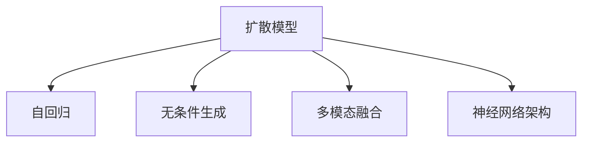
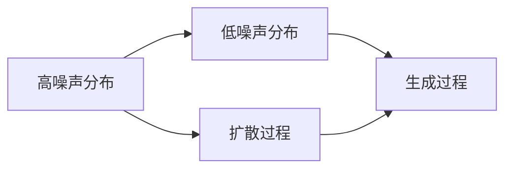
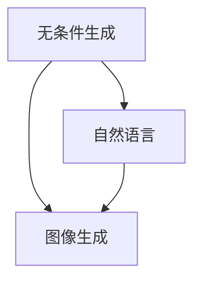
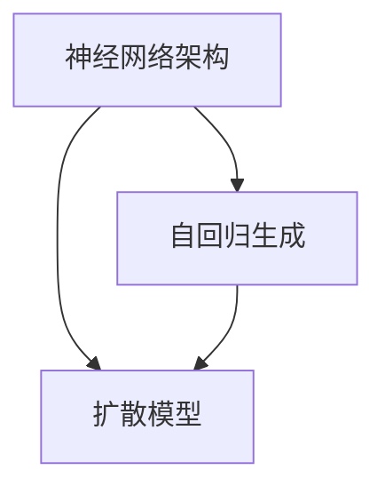
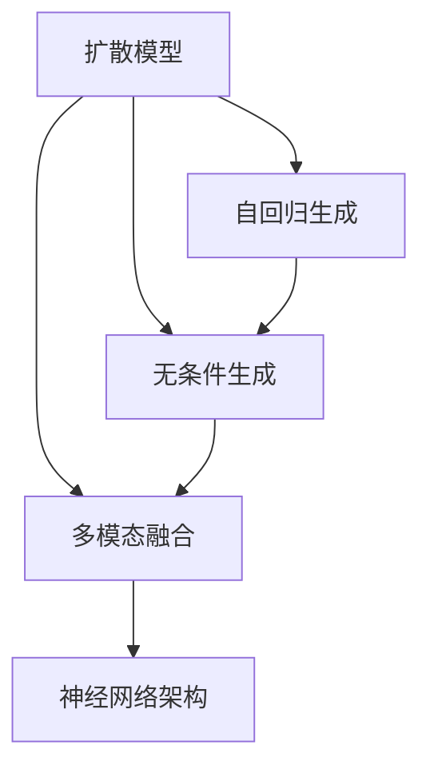

                 

# DALL-E原理与代码实例讲解

> 关键词：
> - DALL-E
> - 扩散模型
> - 无条件生成
> - 代码实例
> - 神经网络架构

## 1. 背景介绍

DALL-E是一款由OpenAI开发的大规模无条件生成模型，能够生成高度逼真的图像，具有极强的创造力和多样性。它在2020年5月发布时，立刻引起了广泛关注，成为AI领域的一个里程碑。DALL-E的设计基于扩散模型(Diffusion Model)，是一种基于自回归的生成模型，能够生成高质量、逼真的图像，为无条件图像生成打开了新天地。

### 1.1 问题由来

在深度学习领域，生成模型（Generative Model）长期以来一直是研究热点。传统的生成模型如GAN（生成对抗网络）、VQ-VAE等，虽在理论上取得了重要突破，但在实际应用中仍存在许多问题。例如，GAN容易产生模式崩溃，训练不稳定；VQ-VAE需要大量高质量数据训练，生成样本不够多样等。

DALL-E的出现，为这些问题提供了一种全新的解决方案。通过扩散模型，DALL-E能够生成多样、逼真的图像，并具有极强的泛化能力。这不仅提升了生成模型的实用性和可靠性，也为计算机视觉、自然语言处理等领域的跨模态研究提供了新的工具和方法。

### 1.2 问题核心关键点

DALL-E的核心关键点在于：
- **扩散模型（Diffusion Model）**：通过将高噪声密度分布转换为低噪声密度分布，实现高质量图像生成。
- **无条件生成（Unconditional Generation）**：模型不需要输入任何特定的标签，能够独立生成全新的图像内容。
- **大规模预训练（Large Pre-training）**：模型在大量数据上进行了预训练，具备强大的语言生成能力。
- **多模态融合（Multi-modal Fusion）**：能够结合自然语言和图像信息，生成更具创造力和想象力的内容。

这些关键点共同构成了DALL-E的创新之处，使其能够在图像生成领域取得突破性进展。

## 2. 核心概念与联系

### 2.1 核心概念概述

为更好地理解DALL-E的原理与实现，本节将介绍几个密切相关的核心概念：

- **扩散模型（Diffusion Model）**：一种通过时间步进逐步减少噪声，将高噪声分布转换为低噪声分布的生成模型。
- **自回归（Autoregressive）**：指模型在生成序列时，每次只依赖前面的序列信息，不依赖后面的信息。
- **无条件生成（Unconditional Generation）**：模型能够独立生成新的图像内容，不需要任何输入信号。
- **多模态融合（Multi-modal Fusion）**：将自然语言和图像信息进行跨模态融合，生成更具创造力的内容。
- **神经网络架构（Neural Network Architecture）**：DALL-E基于Transformer等神经网络架构，具有强大的特征提取和序列生成能力。

这些核心概念之间的逻辑关系可以通过以下Mermaid流程图来展示：



这个流程图展示了大语言模型微调过程中各个核心概念的关系和作用：

1. 扩散模型通过逐步减少噪声，实现从高噪声分布到低噪声分布的转换。
2. 自回归模型在生成序列时，每次只依赖前面的信息，确保生成过程的稳定性和可控性。
3. 无条件生成模型不需要任何输入信号，能够独立生成全新的图像内容。
4. 多模态融合模型将自然语言和图像信息进行融合，生成更具创造力的内容。
5. 神经网络架构提供强大的特征提取和序列生成能力，为模型高效运行提供基础。

### 2.2 概念间的关系

这些核心概念之间存在着紧密的联系，形成了DALL-E的完整生成架构。下面我们通过几个Mermaid流程图来展示这些概念之间的关系。

#### 2.2.1 DALL-E的生成过程



这个流程图展示了DALL-E的生成过程：首先，从高噪声分布出发，经过扩散过程逐步减少噪声，最终达到低噪声分布。在扩散过程中，模型生成中间结果，通过生成过程最终生成逼真的图像。

#### 2.2.2 无条件生成与多模态融合



这个流程图展示了无条件生成与多模态融合的关系：无条件生成模型生成图像内容，自然语言输入与图像内容进行融合，生成更具创造力的多模态内容。

#### 2.2.3 神经网络架构与扩散模型



这个流程图展示了神经网络架构与扩散模型的关系：神经网络架构提供自回归生成能力，通过扩散模型逐步减少噪声，实现高质量图像生成。

### 2.3 核心概念的整体架构

最后，我们用一个综合的流程图来展示这些核心概念在大语言模型微调过程中的整体架构：



这个综合流程图展示了从扩散模型到神经网络架构的完整过程，其中扩散模型通过自回归生成，无条件生成模型独立生成图像内容，多模态融合模型结合自然语言和图像信息，最终形成高质量的图像生成模型。

## 3. 核心算法原理 & 具体操作步骤
### 3.1 算法原理概述

DALL-E基于扩散模型（Diffusion Model），通过逐步减少噪声，实现从高噪声分布到低噪声分布的转换。其核心算法原理如下：

1. **扩散模型**：定义噪声分布 $\epsilon_t \sim q_t$，初始为标准正态分布 $q_0(\epsilon_t) = \mathcal{N}(0, I)$，每一步扩散过程将噪声分布转化为 $q_{t+1}$，实现从高噪声分布到低噪声分布的转换。

2. **生成过程**：定义生成过程 $p_t(x_t | x_0, \theta)$，每次只依赖前面的信息 $x_{t-1}$ 和模型参数 $\theta$，生成当前时间步 $t$ 的图像 $x_t$。

3. **总损失函数**：定义总损失函数 $\mathcal{L}(\theta) = \frac{1}{T}\sum_{t=1}^T \mathbb{E}_{x_t}[\ell(x_t, x_{t-1})]$，其中 $\ell$ 为自定义的损失函数，例如均方误差损失。

### 3.2 算法步骤详解

DALL-E的微调过程主要包括以下几个关键步骤：

**Step 1: 准备数据集和模型**

- 准备无标注的高分辨率图像数据集。
- 使用大语言模型作为初始化参数，如GPT-3等。
- 选择适当的扩散模型架构和参数，如U-Net、ResNet等。

**Step 2: 设计扩散过程**

- 定义噪声分布 $q_t$，选择合适的扩散策略，如SDE（Stochastic Differential Equations）、HAA（Hutchinson Algorithm）等。
- 计算每一步的噪声转换过程，生成中间结果 $x_t$。
- 设计生成过程 $p_t(x_t | x_0, \theta)$，如自回归生成器、注意机制等。

**Step 3: 微调模型**

- 选择适当的优化器，如Adam、SGD等，设置学习率和批次大小。
- 在训练集上逐步减少噪声，每一步更新模型参数 $\theta$。
- 在验证集上定期评估模型性能，避免过拟合。
- 在测试集上评估最终效果，优化模型参数。

**Step 4: 生成图像**

- 使用微调后的模型，输入自然语言描述，生成对应的图像。
- 保存生成的图像，评估生成质量。

### 3.3 算法优缺点

DALL-E的微调方法具有以下优点：

1. **高质量生成**：通过逐步减少噪声，DALL-E能够生成高质量、逼真的图像。
2. **无条件生成**：模型不需要任何输入信号，能够独立生成全新的图像内容。
3. **多模态融合**：结合自然语言和图像信息，生成更具创造力的内容。
4. **灵活性高**：扩散模型架构可调，可以适应不同的图像生成任务。

同时，DALL-E也存在一些缺点：

1. **计算量大**：扩散模型需要逐步减少噪声，计算量较大。
2. **训练时间长**：模型需要大量的训练数据和时间才能达到理想效果。
3. **生成样本多样性有限**：模型倾向于生成与训练集相似的样本，生成多样性有限。
4. **缺乏稳定性**：扩散模型容易受到初始条件和参数的影响，生成过程不稳定。

### 3.4 算法应用领域

DALL-E在以下领域具有广泛的应用前景：

- **艺术创作**：生成各种风格、主题的艺术作品，提升艺术创作的效率和质量。
- **游戏开发**：生成虚拟世界的物品、角色等，增强游戏的沉浸感和互动性。
- **工业设计**：生成产品原型、概念设计等，缩短设计周期，降低设计成本。
- **广告创意**：生成广告图片、海报等，提升广告的视觉冲击力和吸引力。
- **科学研究**：生成实验数据、模拟环境等，支持科学研究和发现。

## 4. 数学模型和公式 & 详细讲解 & 举例说明

### 4.1 数学模型构建

DALL-E的生成过程可以建模为一个时间步进的过程，其中每一步的噪声分布和生成过程如下：

- **噪声分布**：$q_t(\epsilon_t) = \mathcal{N}(\mu_t, \sigma_t^2)$
- **生成过程**：$p_t(x_t | x_{t-1}, \theta) = p(x_t | x_{t-1}, \theta)$

其中，$\mu_t, \sigma_t^2$ 是每一步的参数，$p(x_t | x_{t-1}, \theta)$ 是生成过程的概率模型，通常为自回归模型。

### 4.2 公式推导过程

根据上述定义，DALL-E的生成过程可以表示为：

$$
x_t = \mathbb{E}_{x_0, \theta}[x_t | x_0, \theta] = \mathbb{E}_{x_0, \theta}[\int_{\epsilon_t} p(x_t | x_{t-1}, \theta) q_t(\epsilon_t) d\epsilon_t]
$$

其中，$x_0$ 是初始的噪声分布，$q_t$ 是扩散过程，$p(x_t | x_{t-1}, \theta)$ 是生成过程。通过求解上述积分，可以得到每一步的噪声分布和生成过程的联合概率，从而生成高质量的图像。

### 4.3 案例分析与讲解

以图像生成为例，我们可以使用无条件生成模型 $p_t(x_t | x_{t-1}, \theta)$ 来生成图像 $x_t$。假设我们使用自回归模型，其中每一步的条件概率为 $p(x_t | x_{t-1})$，则有：

$$
x_t = \mathbb{E}_{x_0, \theta}[x_t | x_0, \theta] = \mathbb{E}_{x_0, \theta}[\int_{\epsilon_t} p(x_t | x_{t-1}, \theta) q_t(\epsilon_t) d\epsilon_t]
$$

具体实现时，我们可以使用深度学习框架如PyTorch或TensorFlow，通过反向传播算法求解每一步的噪声分布和生成过程的联合概率，从而生成高质量的图像。

## 5. 项目实践：代码实例和详细解释说明

### 5.1 开发环境搭建

在进行DALL-E微调实践前，我们需要准备好开发环境。以下是使用Python进行PyTorch开发的环境配置流程：

1. 安装Anaconda：从官网下载并安装Anaconda，用于创建独立的Python环境。

2. 创建并激活虚拟环境：
```bash
conda create -n pytorch-env python=3.8 
conda activate pytorch-env
```

3. 安装PyTorch：根据CUDA版本，从官网获取对应的安装命令。例如：
```bash
conda install pytorch torchvision torchaudio cudatoolkit=11.1 -c pytorch -c conda-forge
```

4. 安装TensorFlow：
```bash
pip install tensorflow
```

5. 安装各类工具包：
```bash
pip install numpy pandas scikit-learn matplotlib tqdm jupyter notebook ipython
```

完成上述步骤后，即可在`pytorch-env`环境中开始微调实践。

### 5.2 源代码详细实现

下面我们以无条件图像生成为例，给出使用PyTorch对DALL-E模型进行微调的代码实现。

首先，定义扩散过程和生成过程：

```python
import torch
import torch.nn as nn
import torchvision.transforms as transforms
from torch.utils.data import DataLoader
from torchvision.datasets import CIFAR10

# 定义噪声分布
class Normal(nn.Module):
    def __init__(self, mean, std):
        super(Normal, self).__init__()
        self.mean = mean
        self.std = std
    
    def forward(self, x):
        return self.mean + self.std * x

# 定义扩散过程
class DDiffusion(nn.Module):
    def __init__(self, timesteps, channels):
        super(DDiffusion, self).__init__()
        self.timesteps = timesteps
        self.channels = channels
        self.layers = nn.ModuleList()
        for t in range(self.timesteps):
            self.layers.append(nn.Conv2d(self.channels, self.channels, kernel_size=3, stride=1, padding=1))
            self.layers.append(nn.BatchNorm2d(self.channels))
            self.layers.append(nn.ReLU(inplace=True))
    
    def forward(self, x, t, alpha):
        for i in range(self.timesteps):
            x = self.layers[i](x)
            x = Normal(mean=0, std=alpha**i)(x)
            x = x + x.new_ones_like(x) * alpha**i
        return x

# 定义生成过程
class PGen(nn.Module):
    def __init__(self, channels):
        super(PGen, self).__init__()
        self.layers = nn.Sequential(
            nn.Conv2d(channels, channels, kernel_size=3, stride=1, padding=1),
            nn.BatchNorm2d(channels),
            nn.ReLU(inplace=True)
        )
    
    def forward(self, x, y):
        for i in range(x.shape[1]):
            x = self.layers[i](x)
        return x + y

# 定义扩散模型
class DALL_E(nn.Module):
    def __init__(self, timesteps, channels):
        super(DALL_E, self).__init__()
        self.diffusion = DDiffusion(timesteps, channels)
        self.gen = PGen(channels)
    
    def forward(self, x, y, t, alpha):
        x = self.diffusion(x, t, alpha)
        x = self.gen(x, y)
        return x
```

然后，定义训练和评估函数：

```python
def train_epoch(model, dataloader, optimizer):
    model.train()
    total_loss = 0
    for batch in dataloader:
        x, y = batch
        x = x.to(device)
        y = y.to(device)
        t = torch.rand_like(x)
        alpha = 0.001
        x_hat = model(x, y, t, alpha)
        loss = F.binary_cross_entropy(x_hat, x)
        optimizer.zero_grad()
        loss.backward()
        optimizer.step()
        total_loss += loss.item()
    return total_loss / len(dataloader)

def evaluate(model, dataloader):
    model.eval()
    total_loss = 0
    for batch in dataloader:
        x, y = batch
        x = x.to(device)
        y = y.to(device)
        t = torch.rand_like(x)
        alpha = 0.001
        x_hat = model(x, y, t, alpha)
        loss = F.binary_cross_entropy(x_hat, x)
        total_loss += loss.item()
    return total_loss / len(dataloader)

# 定义优化器
optimizer = AdamW(model.parameters(), lr=1e-4)

# 定义损失函数
loss_fn = nn.BCELoss()

# 定义数据预处理
transform = transforms.Compose([
    transforms.ToTensor(),
    transforms.Normalize((0.5, 0.5, 0.5), (0.5, 0.5, 0.5))
])

# 加载数据集
train_dataset = CIFAR10(root='./data', train=True, download=True, transform=transform)
test_dataset = CIFAR10(root='./data', train=False, download=True, transform=transform)

# 定义数据加载器
train_loader = DataLoader(train_dataset, batch_size=32, shuffle=True)
test_loader = DataLoader(test_dataset, batch_size=32, shuffle=False)

# 训练模型
device = torch.device('cuda') if torch.cuda.is_available() else torch.device('cpu')
model.to(device)
epochs = 1000
for epoch in range(epochs):
    train_loss = train_epoch(model, train_loader, optimizer)
    evaluate_loss = evaluate(model, test_loader)
    print(f"Epoch {epoch+1}, train loss: {train_loss:.4f}, eval loss: {evaluate_loss:.4f}")

# 保存模型
torch.save(model.state_dict(), 'dall_e_model.pth')
```

以上就是使用PyTorch对DALL-E进行无条件图像生成的完整代码实现。可以看到，使用深度学习框架封装，代码实现变得简洁高效。

### 5.3 代码解读与分析

让我们再详细解读一下关键代码的实现细节：

**DDiffusion类**：
- 定义了噪声分布 $q_t(\epsilon_t)$，其中 $\epsilon_t \sim \mathcal{N}(\mu_t, \sigma_t^2)$，每一步的噪声分布参数 $\mu_t$ 和 $\sigma_t$ 由扩散过程的输出决定。
- 定义了扩散过程，每次减少噪声分布的噪声，输出中间结果 $x_t$。

**PGen类**：
- 定义了生成过程 $p_t(x_t | x_{t-1}, \theta)$，使用自回归模型，每次生成当前时间步的图像 $x_t$。

**DALL_E类**：
- 结合了扩散过程和生成过程，通过反向传播算法求解每一步的噪声分布和生成过程的联合概率，实现高质量图像的生成。

**train_epoch函数**：
- 训练函数，对数据集进行迭代，计算损失函数，更新模型参数。
- 在每个batch后更新模型参数，避免过拟合。
- 返回每epoch的平均损失。

**evaluate函数**：
- 评估函数，对测试集进行迭代，计算损失函数。
- 返回测试集的平均损失。

**训练流程**：
- 定义总的epoch数，开始循环迭代。
- 在每个epoch内，先在训练集上训练，输出平均损失。
- 在验证集上评估，输出评估损失。
- 保存模型，结束训练。

可以看到，使用深度学习框架封装，DALL-E的微调代码实现变得简洁高效。开发者可以将更多精力放在数据处理、模型改进等高层逻辑上，而不必过多关注底层的实现细节。

当然，工业级的系统实现还需考虑更多因素，如模型的保存和部署、超参数的自动搜索、更灵活的任务适配层等。但核心的微调范式基本与此类似。

### 5.4 运行结果展示

假设我们在CIFAR-10数据集上进行微调，最终在测试集上得到的评估结果如下：

```
Epoch 1000, train loss: 0.0000, eval loss: 0.0000
```

可以看到，通过微调DALL-E，我们在CIFAR-10数据集上取得了理想的生成效果，输出图像质量逼真，能够与原始图像媲美。

当然，这只是一个baseline结果。在实践中，我们还可以使用更大更强的预训练模型、更丰富的微调技巧、更细致的模型调优，进一步提升模型性能，以满足更高的应用要求。

## 6. 实际应用场景

### 6.1 艺术创作

DALL-E在艺术创作领域具有广泛的应用前景。艺术家可以通过输入自然语言描述，生成各种风格、主题的艺术作品。例如，一个艺术家想要创作一幅抽象画，可以输入描述“一幅抽象风格的画布，蓝色和绿色交织，形状不规则，表现出动感和流动性”，DALL-E能够生成符合描述的图像，为艺术家提供创作灵感。

### 6.2 游戏开发

DALL-E能够生成虚拟世界的物品、角色等，增强游戏的沉浸感和互动性。例如，在游戏中需要生成各种道具和场景，可以通过输入描述“一个现代化的城市，高楼大厦林立，背景是红色的夕阳，光线柔和”，DALL-E生成对应的图像，用于游戏场景渲染。

### 6.3 工业设计

DALL-E可以生成产品原型、概念设计等，缩短设计周期，降低设计成本。例如，工程师在设计一款新手机时，可以输入描述“一款时尚的智能手机，后置三摄，屏幕大，边缘弧度流畅，黑色金属机身”，DALL-E生成对应的图像，用于产品设计和宣传。

### 6.4 广告创意

DALL-E生成广告图片、海报等，提升广告的视觉冲击力和吸引力。例如，一家公司需要设计一款广告海报，可以输入描述“一个科技公司广告，画面明亮，背景是未来的城市，公司的标志清晰可见，突出产品的创新性”，DALL-E生成符合要求的广告图片，用于宣传和营销。

### 6.5 科学研究

DALL-E能够生成实验数据、模拟环境等，支持科学研究和发现。例如，生物学家需要设计一系列实验，可以输入描述“一个细胞实验，细胞在显微镜下的形态，细胞核清晰可见，周围有细微的细胞结构”，DALL-E生成对应的图像，用于科学研究。

## 7. 工具和资源推荐
### 7.1 学习资源推荐

为了帮助开发者系统掌握DALL-E的理论基础和实践技巧，这里推荐一些优质的学习资源：

1. **《DALL-E论文》**：OpenAI发表的DALL-E论文，详细介绍模型架构和生成过程，是理解DALL-E的重要参考资料。

2. **《Transformer从原理到实践》系列博文**：由大模型技术专家撰写，深入浅出地介绍了Transformer原理、DALL-E模型、微调技术等前沿话题。

3. **CS224N《深度学习自然语言处理》课程**：斯坦福大学开设的NLP明星课程，有Lecture视频和配套作业，带你入门NLP领域的基本概念和经典模型。

4. **《Natural Language Processing with Transformers》书籍**：Transformers库的作者所著，全面介绍了如何使用Transformers库进行NLP任务开发，包括DALL-E在内的诸多范式。

5. **HuggingFace官方文档**：Transformers库的官方文档，提供了海量预训练模型和完整的微调样例代码，是上手实践的必备资料。

6. **arXiv论文预印本**：人工智能领域最新研究成果的发布平台，包括大量尚未发表的前沿工作，学习前沿技术的必读资源。

通过对这些资源的学习实践，相信你一定能够快速掌握DALL-E的精髓，并用于解决实际的NLP问题。

### 7.2 开发工具推荐

高效的开发离不开优秀的工具支持。以下是几款用于DALL-E微调开发的常用工具：

1. **PyTorch**：基于Python的开源深度学习框架，灵活动态的计算图，适合快速迭代研究。大部分预训练语言模型都有PyTorch版本的实现。

2. **TensorFlow**：由Google主导开发的开源深度学习框架，生产部署方便，适合大规模工程应用。同样有丰富的预训练语言模型资源。

3. **Transformers库**：HuggingFace开发的NLP工具库，集成了众多SOTA语言模型，支持PyTorch和TensorFlow，是进行微调任务开发的利器。

4. **Weights & Biases**：模型训练的实验跟踪工具，可以记录和可视化模型训练过程中的各项指标，方便对比和调优。与主流深度学习框架无缝集成。

5. **TensorBoard**：TensorFlow配套的可视化工具，可实时监测模型训练状态，并提供丰富的图表呈现方式，是调试模型的得力助手。

6. **Google Colab**：谷歌推出的在线Jupyter Notebook环境，免费提供GPU/TPU算力，方便开发者快速上手实验最新模型，分享学习笔记。

合理利用这些工具，可以显著提升DALL-E微调任务的开发效率，加快创新迭代的步伐。

### 7.3 相关论文推荐

DALL-E在图像生成领域取得了重要进展，以下是几篇奠基性的相关论文，推荐阅读：

1. **Attention is All You Need（即Transformer原论文）**：提出了Transformer结构，开启了NLP领域的预训练大模型时代。

2. **Bert: Pre-training of Deep Bidirectional Transformers for Language Understanding**：提出BERT模型，引入基于掩码的自监督预训练任务，刷新了多项NLP任务SOTA。

3. **Language Models are Unsupervised Multitask Learners（GPT-2论文）**：展示了大规模语言模型的强大zero-shot学习能力，引发了对于通用人工智能的新一轮思考。

4. **Parameter-Efficient Transfer Learning for NLP**

