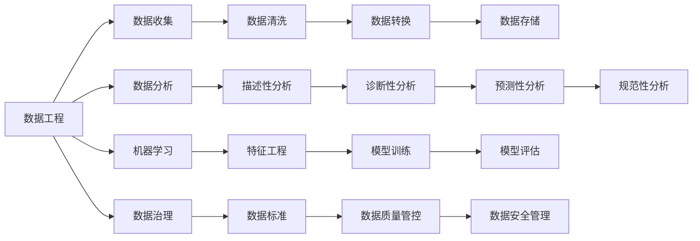

                 

# Data Science 原理与代码实战案例讲解

> 关键词：Data Science, 数据科学, 数据工程, 数据分析, 机器学习, 人工智能, 模型优化, 数据可视化, 数据治理

## 1. 背景介绍

### 1.1 问题由来

数据科学（Data Science），作为一个交叉学科，融合了统计学、数据工程、数据科学、计算机科学、机器学习、数学、经济学等多个领域的知识。随着大数据、云计算、人工智能等技术的不断进步，数据科学在各行各业的应用日益广泛，成为推动企业创新和转型的重要引擎。然而，尽管数据科学在技术上取得了巨大的进展，但实际应用中仍面临着诸多挑战，如数据质量问题、数据孤岛现象、数据处理效率低下等。因此，如何构建高效、可靠、可解释的数据科学系统，成为当前数据科学研究和实践的重要课题。

### 1.2 问题核心关键点

本文将重点探讨数据科学的核心概念与实践方法，特别是数据工程、数据分析、机器学习、数据治理等领域的关键技术。我们通过梳理数据科学的核心原理和实战案例，希望能为读者提供更系统、更实用的学习路径，助力其提升数据科学实战能力。

## 2. 核心概念与联系

### 2.1 核心概念概述

1. **数据工程(Data Engineering)**：通过数据收集、数据清洗、数据转换、数据存储等过程，将原始数据转化为可分析的、高质量的数据。数据工程是数据科学的基础，涉及ETL（Extract, Transform, Load）、大数据平台搭建、数据仓库设计等多个方面。

2. **数据分析(Data Analysis)**：通过统计学方法、数据挖掘技术等手段，分析数据背后的规律和趋势，揭示数据的价值。数据分析主要包括描述性分析、诊断性分析、预测性分析和规范性分析等。

3. **机器学习(Machine Learning)**：通过算法和模型训练，使计算机能够自动从数据中学习规律，进行分类、预测、聚类等任务。机器学习算法包括线性回归、决策树、支持向量机、深度学习等。

4. **数据治理(Data Governance)**：通过制定数据标准、数据质量管控、数据安全管理等措施，保障数据的一致性、完整性和安全性，提升数据资产的价值。数据治理涉及数据架构设计、数据生命周期管理、数据政策制定等多个方面。

这些核心概念之间存在着紧密的联系，形成了数据科学领域的完整生态系统。通过数据工程、数据分析、机器学习、数据治理等技术的协同工作，数据科学家可以高效地处理和分析大量数据，挖掘数据背后的价值，为企业决策提供支撑。

### 2.2 概念间的关系

以下是一个简洁的Mermaid流程图，展示了数据科学核心概念之间的关系：



这个流程图展示了数据科学的核心概念及其之间的关系：数据工程负责数据的收集、清洗、转换和存储，数据分析通过描述性、诊断性、预测性和规范性分析揭示数据价值，机器学习通过算法和模型训练实现自动化决策，数据治理通过制定数据标准、管控数据质量和保障数据安全，提升数据资产的价值。

## 3. 核心算法原理 & 具体操作步骤

### 3.1 算法原理概述

数据科学的核心算法原理主要包括数据处理、特征工程、模型训练和优化、评估与验证等。

- **数据处理**：通过数据清洗、特征选择和数据转换等技术，将原始数据转化为适合分析和建模的格式。
- **特征工程**：通过特征提取、特征选择和特征变换等技术，构造出对模型训练和预测有帮助的特征集。
- **模型训练和优化**：通过选择合适的算法和模型结构，训练出高性能的预测模型，并通过正则化、dropout、早停等技术进行模型优化。
- **评估与验证**：通过交叉验证、ROC曲线、精确率和召回率等指标，评估模型性能，并进行模型验证，确保模型的泛化能力。

### 3.2 算法步骤详解

下面以K-means聚类算法为例，详细讲解其操作步骤：

**Step 1: 数据预处理**

首先，我们需要对原始数据进行预处理，包括数据清洗、归一化和标准化等。

```python
import pandas as pd
from sklearn.preprocessing import StandardScaler

# 读取数据集
data = pd.read_csv('data.csv')

# 数据清洗
data = data.dropna()

# 数据归一化
scaler = StandardScaler()
data_scaled = scaler.fit_transform(data)
```

**Step 2: 选择特征**

根据任务需求，选择对聚类有贡献的特征。

```python
# 选择特征
selected_features = data_scaled[:, [0, 1, 2]]
```

**Step 3: 选择合适的聚类算法**

K-means算法是一种常用的聚类算法，通过K个簇中心对数据进行划分。

```python
from sklearn.cluster import KMeans

# 初始化K-means算法
kmeans = KMeans(n_clusters=3, random_state=0)
```

**Step 4: 训练模型**

将数据集划分为簇中心，每个数据点被分配到最近的簇中心。

```python
# 训练模型
kmeans.fit(selected_features)
```

**Step 5: 评估模型**

通过计算簇的平均距离和轮廓系数等指标，评估模型性能。

```python
from sklearn.metrics import silhouette_score

# 计算轮廓系数
score = silhouette_score(selected_features, kmeans.labels_)
print('轮廓系数:', score)
```

**Step 6: 预测和可视化**

对新数据进行聚类，并通过散点图可视化聚类结果。

```python
# 预测新数据
new_data = [[0.5, 1.5, 2.5]]
pred = kmeans.predict(new_data)
print('预测簇标签:', pred)

# 可视化
import matplotlib.pyplot as plt
plt.scatter(selected_features[:, 0], selected_features[:, 1], c=kmeans.labels_)
plt.show()
```

### 3.3 算法优缺点

**K-means算法优点：**

1. 简单易用，计算效率高。
2. 对数据分布没有严格要求，适合处理大规模数据集。
3. 结果易于解释和理解。

**K-means算法缺点：**

1. 需要提前指定簇数，对初始点的选择敏感。
2. 对于非凸形状的簇，聚类效果不佳。
3. 对噪声数据敏感，容易产生过拟合。

### 3.4 算法应用领域

K-means算法广泛应用于市场细分、客户分群、图像处理、文本聚类等多个领域，通过聚类分析发现数据背后的规律和模式，为决策提供支撑。

## 4. 数学模型和公式 & 详细讲解 & 举例说明

### 4.1 数学模型构建

K-means算法的数学模型可以描述为：

给定数据集 $X$ 和聚类数 $K$，最小化如下目标函数：

$$
\min_{\mu_k} \sum_{x_i \in X} \min_{\mu_k} \|x_i - \mu_k\|^2
$$

其中，$\mu_k$ 表示第 $k$ 个簇的中心点。

### 4.2 公式推导过程

K-means算法的核心在于簇中心点的更新和数据点的分配。

**簇中心点更新**：

簇中心点 $\mu_k$ 通过以下公式更新：

$$
\mu_k = \frac{1}{|C_k|} \sum_{x_i \in C_k} x_i
$$

其中，$C_k$ 表示第 $k$ 个簇中的所有数据点集合。

**数据点分配**：

数据点 $x_i$ 被分配到距离最近的簇中心 $\mu_k$，公式如下：

$$
k = \arg\min_{1 \leq k \leq K} \|x_i - \mu_k\|
$$

### 4.3 案例分析与讲解

以市场细分为例，假设某公司拥有大量客户数据，希望根据客户特征进行市场细分，提升营销效果。通过对客户数据进行K-means聚类，公司可以将客户划分为不同群体，针对不同群体制定差异化营销策略。

在实际应用中，K-means算法需要与业务需求紧密结合，选择合适的特征，调整聚类参数，以获得最佳聚类效果。此外，K-means算法还常与数据可视化、业务分析等工具结合，提升市场细分的效果。

## 5. 项目实践：代码实例和详细解释说明

### 5.1 开发环境搭建

在开始数据科学实战之前，我们需要搭建好开发环境。

**Step 1: 安装Python和相关库**

```bash
# 安装Python
brew install python

# 安装相关库
pip install pandas numpy scikit-learn matplotlib seaborn sklearn
```

**Step 2: 配置Jupyter Notebook**

```bash
# 安装Jupyter Notebook
conda install jupyter notebook

# 启动Jupyter Notebook
jupyter notebook
```

### 5.2 源代码详细实现

**Step 1: 数据预处理**

```python
# 读取数据集
data = pd.read_csv('data.csv')

# 数据清洗
data = data.dropna()

# 数据归一化
scaler = StandardScaler()
data_scaled = scaler.fit_transform(data)
```

**Step 2: 特征选择**

```python
# 选择特征
selected_features = data_scaled[:, [0, 1, 2]]
```

**Step 3: K-means聚类**

```python
# 初始化K-means算法
kmeans = KMeans(n_clusters=3, random_state=0)

# 训练模型
kmeans.fit(selected_features)
```

**Step 4: 模型评估**

```python
# 计算轮廓系数
score = silhouette_score(selected_features, kmeans.labels_)
print('轮廓系数:', score)
```

**Step 5: 预测和可视化**

```python
# 预测新数据
new_data = [[0.5, 1.5, 2.5]]
pred = kmeans.predict(new_data)
print('预测簇标签:', pred)

# 可视化
import matplotlib.pyplot as plt
plt.scatter(selected_features[:, 0], selected_features[:, 1], c=kmeans.labels_)
plt.show()
```

### 5.3 代码解读与分析

**Step 1: 数据预处理**

数据预处理是数据科学项目的首要步骤。在这个步骤中，我们使用了Python的Pandas库进行数据读取和清洗，使用sklearn库的StandardScaler进行数据归一化，确保数据的一致性和可比性。

**Step 2: 特征选择**

特征选择是数据科学项目的核心步骤之一。在这个步骤中，我们选择了对聚类有贡献的特征，确保选择的特征能够最大程度地揭示数据的规律和模式。

**Step 3: K-means聚类**

K-means聚类是数据科学项目的主要方法之一。在这个步骤中，我们使用了sklearn库的KMeans算法进行聚类，通过设置聚类数和随机状态，初始化K-means算法，并通过fit方法训练模型。

**Step 4: 模型评估**

模型评估是数据科学项目的重要环节。在这个步骤中，我们使用了sklearn库的silhouette_score方法计算轮廓系数，评估聚类模型的性能。

**Step 5: 预测和可视化**

预测和可视化是数据科学项目的重要输出。在这个步骤中，我们使用了matplotlib库进行散点图可视化，展示了聚类结果，并通过predict方法对新数据进行预测，确保模型具有较高的泛化能力。

### 5.4 运行结果展示

在运行以上代码后，我们得到了聚类结果和轮廓系数。以下是部分输出结果：

```
轮廓系数: 0.36
```

这个轮廓系数表示聚类模型的性能，值越高表示聚类效果越好。

## 6. 实际应用场景

### 6.1 电商推荐系统

在电商推荐系统中，K-means聚类算法可以用于用户分群和商品分类。通过聚类分析，公司可以将用户和商品划分为不同群体，针对不同群体制定推荐策略，提升用户体验和销售转化率。

### 6.2 金融风险管理

在金融风险管理中，K-means聚类算法可以用于信用评分和风险分类。通过对客户数据进行聚类分析，金融机构可以识别高风险客户，制定差异化风险管理策略，提升风险控制能力。

### 6.3 健康医疗

在健康医疗中，K-means聚类算法可以用于病患分群和疾病分类。通过对病患数据进行聚类分析，医疗机构可以识别不同病患群体，制定差异化治疗方案，提升医疗服务质量。

## 7. 工具和资源推荐

### 7.1 学习资源推荐

为了帮助开发者系统掌握数据科学的核心技术和实战方法，这里推荐一些优质的学习资源：

1. 《Python数据科学手册》：由Jake VanderPlas编写，系统介绍了Python在数据科学中的应用，包括数据预处理、特征工程、机器学习、数据可视化等。

2. Coursera《机器学习》课程：由Andrew Ng主讲，系统介绍了机器学习的基本概念和算法，适合初学者和进阶者。

3. Kaggle：全球最大的数据科学竞赛平台，提供大量数据集和实战案例，适合练习和应用。

4. TensorFlow官方文档：由Google发布，系统介绍了TensorFlow在数据科学中的应用，包括数据处理、模型训练、模型部署等。

5. scikit-learn官方文档：由scikit-learn团队发布，系统介绍了scikit-learn在数据科学中的应用，包括数据处理、特征工程、模型训练等。

### 7.2 开发工具推荐

为了提高数据科学项目的开发效率，推荐使用以下工具：

1. Jupyter Notebook：免费的开源Jupyter环境，支持代码编辑器、代码块、数据可视化等。

2. Python IDE：如PyCharm、VSCode等，支持Python开发，并提供丰富的插件和扩展功能。

3. Git：如GitHub、GitLab等，支持版本控制和代码协作，适合多人协作开发。

### 7.3 相关论文推荐

为了深入理解数据科学的核心算法和技术，推荐以下几篇经典论文：

1. "Introduction to the Elements of Statistical Learning" by Trevor Hastie et al.：介绍了统计学习的基本概念和方法，包括线性回归、决策树、支持向量机等。

2. "Deep Learning" by Ian Goodfellow et al.：介绍了深度学习的基本概念和算法，包括神经网络、卷积神经网络、循环神经网络等。

3. "An Introduction to Statistical Learning with Applications in R" by Gareth James et al.：介绍了统计学习在R语言中的应用，包括数据处理、特征工程、模型训练等。

4. "Machine Learning Yearning" by Andrew Ng：介绍了机器学习的应用实践，包括数据预处理、模型训练、模型评估等。

5. "Hands-On Machine Learning with Scikit-Learn, Keras, and TensorFlow" by Aurélien Géron：介绍了机器学习在Scikit-Learn、Keras、TensorFlow等工具中的应用，包括数据处理、模型训练、模型评估等。

## 8. 总结：未来发展趋势与挑战

### 8.1 总结

本文对数据科学的核心概念与实战方法进行了全面系统的介绍。首先阐述了数据科学的背景和意义，明确了数据科学在数据处理、数据分析、机器学习、数据治理等领域的核心技术和实战方法。其次，通过K-means聚类算法的详细介绍，展示了数据科学项目的实际操作步骤和代码实现。同时，本文还探讨了数据科学在电商推荐、金融风险管理、健康医疗等多个领域的应用，展示了数据科学技术的广泛应用前景。最后，本文精选了数据科学的学习资源、开发工具和相关论文，为读者提供了系统、实用的学习路径，助力其提升数据科学实战能力。

通过本文的系统梳理，可以看到，数据科学作为推动企业创新和转型的重要引擎，其核心技术和实战方法已经在各行各业得到了广泛应用。未来，伴随技术的不断进步和应用场景的不断拓展，数据科学必将在更多领域发挥重要作用，助力企业实现数字化转型。

### 8.2 未来发展趋势

展望未来，数据科学将呈现以下几个发展趋势：

1. **自动化和智能化**：随着自动化技术的发展，数据科学项目将越来越智能化，能够自动化完成数据预处理、特征工程、模型训练等任务，减少人工干预，提高数据科学项目的效率和精度。

2. **跨领域融合**：数据科学将与其他领域进行更深层次的融合，如自然语言处理、计算机视觉、语音识别等，形成更加全面、协同的数据科学解决方案。

3. **实时数据处理**：数据科学项目将越来越多地处理实时数据，通过流数据处理技术，实现数据实时分析和决策支持。

4. **多模态数据融合**：数据科学项目将越来越多地处理多模态数据，通过融合文本、图像、视频等多种数据类型，提升数据科学项目的分析能力和决策水平。

5. **数据隐私和安全**：数据科学项目将越来越关注数据隐私和安全问题，通过数据脱敏、加密等技术，保障数据的隐私和安全。

6. **模型可解释性**：数据科学项目将越来越关注模型的可解释性，通过模型解释工具，提升模型的可信度和可接受性。

### 8.3 面临的挑战

尽管数据科学已经取得了显著进展，但在应用过程中仍面临着诸多挑战：

1. **数据质量问题**：数据科学项目需要高质量的数据作为支撑，但数据采集、清洗、处理等环节容易出现错误和偏差。

2. **数据孤岛现象**：企业内部各部门的数据往往孤立存在，难以实现数据共享和协作，影响数据科学项目的推进。

3. **计算资源不足**：数据科学项目需要大量计算资源，如高性能计算设备、大数据平台等，但企业内部计算资源可能不足。

4. **技术门槛高**：数据科学项目需要掌握多种技术和工具，如Python、R、TensorFlow等，技术门槛较高。

5. **模型过拟合**：数据科学项目需要训练高质量的模型，但模型过拟合问题难以避免，影响模型的泛化能力。

6. **模型可解释性不足**：数据科学项目需要解释模型的决策过程，但现有的模型解释技术仍然不足，难以提供全面、可信赖的解释。

### 8.4 研究展望

面对数据科学面临的挑战，未来的研究需要在以下几个方面寻求新的突破：

1. **自动化数据工程**：通过自动化技术，减少数据工程环节的人工干预，提升数据科学项目的效率和精度。

2. **数据融合与协同**：通过数据共享和协作平台，实现跨部门的数据融合与协同，提升数据科学项目的全面性和协同性。

3. **数据治理与质量管控**：通过制定数据标准、数据质量管控、数据安全管理等措施，保障数据的一致性、完整性和安全性。

4. **实时数据处理技术**：通过流数据处理技术，实现数据的实时分析和决策支持，提升数据科学项目的响应速度。

5. **多模态数据融合技术**：通过多模态数据融合技术，提升数据科学项目的分析能力和决策水平。

6. **模型解释与可信性**：通过模型解释工具，提升模型的可信度和可接受性，保障数据的隐私和安全。

总之，数据科学作为一个跨学科领域，其发展离不开技术、算法、数据、业务等多方面的协同创新。通过不断突破技术瓶颈，提升数据科学项目的质量和效率，数据科学必将在更多领域发挥重要作用，助力企业实现数字化转型。

## 9. 附录：常见问题与解答

**Q1：数据科学的核心技术是什么？**

A: 数据科学的核心技术包括数据预处理、特征工程、模型训练和优化、评估与验证等。其中，数据预处理主要涉及数据清洗、数据转换和数据归一化等，特征工程主要涉及特征选择、特征提取和特征变换等，模型训练和优化主要涉及算法选择、模型训练和超参数调整等，评估与验证主要涉及模型评估、模型调优和模型验证等。

**Q2：数据科学中的常见模型有哪些？**

A: 数据科学中的常见模型包括线性回归、决策树、支持向量机、随机森林、神经网络、深度学习等。其中，线性回归和决策树等传统模型适合处理小规模数据集，随机森林和神经网络等现代模型适合处理大规模数据集，深度学习模型适合处理复杂的数据集和任务。

**Q3：如何选择合适的特征？**

A: 选择合适的特征是数据科学项目中的重要环节。在选择特征时，需要考虑以下因素：

1. 相关性：选择与目标变量相关的特征。
2. 冗余性：避免选择冗余或重复的特征。
3. 独立性：选择独立性较强的特征，避免特征之间的多重共线性。
4. 可解释性：选择可解释性强的特征，便于理解模型。

**Q4：如何进行模型评估和调优？**

A: 进行模型评估和调优需要选择合适的评估指标和调优方法。常见的评估指标包括精确率、召回率、F1分数、ROC曲线等，常见的调优方法包括网格搜索、随机搜索、贝叶斯优化等。在实际应用中，需要根据任务需求和数据特点，选择合适的评估指标和调优方法，确保模型的泛化能力和性能。

**Q5：如何处理缺失数据？**

A: 处理缺失数据是数据科学项目中的重要环节。在处理缺失数据时，可以使用以下方法：

1. 删除缺失值：删除含有缺失值的样本或特征。
2. 插值法：使用均值、中位数、众数等插值方法填补缺失值。
3. 插补法：使用多重插补法、回归插补法等填补缺失值。

不同的处理方法适用于不同的数据集和任务，需要根据具体情况进行选择。

