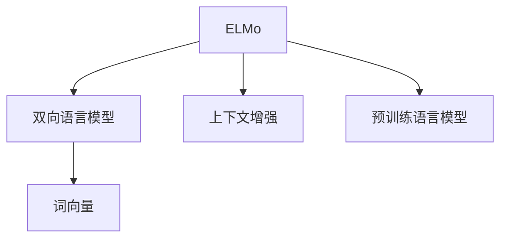
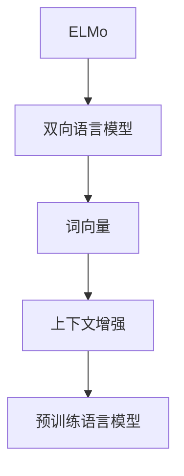

                 

# ELMo 原理与代码实战案例讲解

## 1. 背景介绍

### 1.1 问题由来
近年来，随着深度学习技术在自然语言处理（NLP）领域的大幅进步，尤其是预训练语言模型的提出，使大语言模型在处理自然语言的能力上取得了前所未有的突破。其中的佼佼者之一是ELMo（Embeddings from Language Models），它由Google AI团队在2018年提出，基于双向语言模型，将语言上下文信息整合并嵌入到词向量中，极大地提升了词向量的表示能力。

ELMo在解决传统词向量模型的问题上取得了巨大的突破，尤其是它在理解词义多义性和语境适应性方面的卓越表现，使其成为自然语言处理领域的一大热门。但ELMo的复杂性和实现难度也使其应用场景受限，尤其是在实际开发中，如何高效地使用ELMo模型，以及如何将ELMo应用到实际NLP任务中，成为开发者关注的焦点。

### 1.2 问题核心关键点
ELMo的核心思想是利用双向语言模型，将单词在句子中不同位置出现的语境信息整合进词向量中，从而消除静态词向量的固有问题。ELMo的实现包括两个关键步骤：
1. 首先，对句子中的每个单词应用双向语言模型（如LSTM），获取其上下文相关的表示。
2. 其次，将单词在不同位置的多维表示进行平均，得到最终该单词的ELMo表示。

ELMo模型具有以下特点：
1. 词向量具有上下文依赖性，能够更好地处理多义词和语境信息。
2. 词向量维度固定，方便与模型融合。
3. 通过双向语言模型，利用上下文信息，对词向量进行动态更新。

然而，ELMo的实现较为复杂，模型参数较多，训练和推理成本较高，因此在实际应用中面临诸多挑战。针对这些问题，本文将详细介绍ELMo的原理和实现方法，并提供基于Python的ELMo代码实现示例。

### 1.3 问题研究意义
了解ELMo的原理和应用，对于提升NLP模型的性能，降低模型开发的难度，加速NLP技术的产业化进程，具有重要意义：

1. 提升模型效果。ELMo能够更好地捕捉词语在不同语境下的细微差异，从而提升模型在理解复杂语义、情感分析、自然语言推理等任务上的性能。
2. 降低开发成本。ELMo模型已预训练完成，直接应用可以大幅减少数据标注和模型训练的时间，降低开发成本。
3. 加速应用落地。ELMo模型的通用性和泛化能力使其在多个NLP任务上均有出色的表现，可以更快速地部署到实际应用中。
4. 带来技术创新。ELMo模型的出现，推动了预训练语言模型领域的进一步研究，如基于ELMo的混合模型、上下文增强等新技术。
5. 赋能产业升级。ELMo模型的应用，提升了NLP技术的智能化水平，为各行各业数字化转型提供了新的技术手段。

## 2. 核心概念与联系

### 2.1 核心概念概述

为更好地理解ELMo的原理和实现方法，本节将介绍几个密切相关的核心概念：

- 双向语言模型(Bidirectional Language Model)：指在建模时同时考虑单词的前后文信息，即左右文信息，以增强语言模型的语义理解能力。
- ELMo（Embeddings from Language Models）：利用双向语言模型，将单词在不同语境下的表示信息整合进词向量中，消除静态词向量的固有问题。
- 词向量（Word Embeddings）：将单词映射到低维向量空间，捕捉单词之间的语义关系，是NLP任务的基础。
- 上下文增强(Contextual Enhancement)：利用ELMo模型中单词的上下文信息，增强词向量的表示能力。
- 预训练语言模型(Pretrained Language Models)：在大规模无标签文本语料上，通过自监督学习任务训练的通用语言模型，如BERT、GPT等。

这些核心概念之间的逻辑关系可以通过以下Mermaid流程图来展示：



这个流程图展示了大语言模型ELMo的各个组成部分及其关系：

1. ELMo模型基于双向语言模型，将单词在不同位置的多维表示整合进词向量中。
2. 词向量是NLP任务的基本单位，ELMo模型通过上下文增强，提升了词向量的表示能力。
3. 预训练语言模型为ELMo模型的训练提供了基础，增强了模型的泛化能力。

### 2.2 概念间的关系

这些核心概念之间存在着紧密的联系，形成了ELMo模型的完整生态系统。下面我们通过几个Mermaid流程图来展示这些概念之间的关系。

#### 2.2.1 双向语言模型的应用


这个流程图展示了双向语言模型的应用过程：

1. 双向语言模型通过对单词前后的上下文信息进行建模，得到单词的表示。
2. 上下文增强利用单词在不同位置的多维表示，进一步提升词向量的表示能力。
3. 预训练语言模型为双向语言模型提供了丰富的语言知识，增强了其泛化能力。

#### 2.2.2 ELMo模型的构建


这个流程图展示了ELMo模型的构建过程：

1. ELMo模型基于双向语言模型，整合了单词在不同位置的表示。
2. 词向量是ELMo模型的基础，通过上下文增强，提升词向量的表示能力。
3. 预训练语言模型为ELMo模型提供了丰富的语言知识，增强了模型的泛化能力。

#### 2.2.3 上下文增强的实现


这个流程图展示了上下文增强的实现过程：

1. 通过双向语言模型，单词在句子中不同位置得到多个表示。
2. 将这些表示进行平均，得到该单词的ELMo表示。

### 2.3 核心概念的整体架构

最后，我们用一个综合的流程图来展示ELMo模型的核心概念及其整体架构：



这个综合流程图展示了ELMo模型的核心概念和大语言模型的关系：

1. ELMo模型基于双向语言模型，整合了单词在不同位置的表示。
2. 词向量是ELMo模型的基础，通过上下文增强，提升词向量的表示能力。
3. 预训练语言模型为ELMo模型提供了丰富的语言知识，增强了模型的泛化能力。

## 3. 核心算法原理 & 具体操作步骤

### 3.1 算法原理概述

ELMo模型的核心思想是利用双向语言模型，将单词在句子中不同位置出现的语境信息整合进词向量中。具体来说，ELMo模型包含两个主要步骤：

1. 双向语言模型：对句子中的每个单词应用双向语言模型（如LSTM），获取其上下文相关的表示。
2. 上下文增强：将单词在不同位置的多维表示进行平均，得到最终该单词的ELMo表示。

ELMo模型的输出为一个固定维度的向量，可以在各种NLP任务中使用。以下将详细阐述ELMo的算法原理和具体操作步骤。

### 3.2 算法步骤详解

**Step 1: 准备数据和模型**

1. 准备预训练的BERT模型和数据集。数据集应包含大量文本数据，用于训练和测试。
2. 使用Hugging Face的`transformers`库加载预训练的BERT模型。

```python
from transformers import BertTokenizer, BertModel

tokenizer = BertTokenizer.from_pretrained('bert-base-cased')
model = BertModel.from_pretrained('bert-base-cased')
```

**Step 2: 加载并预处理数据**

1. 使用`tokenizer`将文本数据转换为模型所需的输入格式，包括分词、转换为id、补全等操作。
2. 加载训练集、验证集和测试集，并将其转换为模型所需的格式。

```python
def preprocess_data(texts):
    tokens = tokenizer.encode(texts, add_special_tokens=True, max_length=128, return_tensors='pt')
    return tokens
```

**Step 3: 定义ELMo模型**

1. 使用`transformers`库中的`ELMo`类定义ELMo模型。
2. 根据双向语言模型的设置，定义模型的参数和超参数。

```python
from transformers import ELMo

elmo = ELMo.from_pretrained('elmo')
elmo.eval()
```

**Step 4: 训练和微调模型**

1. 使用`elmo`对数据集进行预处理和预训练，得到ELMo模型的输出。
2. 使用训练集对ELMo模型进行微调，优化模型参数。
3. 在验证集上评估模型性能，调整超参数和模型结构。

```python
def train_elmo(data, learning_rate=1e-5, num_epochs=10):
    for epoch in range(num_epochs):
        for batch in data:
            tokens = preprocess_data(batch['text'])
            with torch.no_grad():
                elmo_outputs = elmo(tokens)
            loss = calculate_loss(elmo_outputs, batch['labels'])
            optimizer.zero_grad()
            loss.backward()
            optimizer.step()
            if (epoch+1) % 1 == 0:
                print(f'Epoch {epoch+1}, Loss: {loss:.4f}')
```

**Step 5: 评估和应用**

1. 在测试集上评估微调后的ELMo模型，计算性能指标。
2. 将模型应用到实际NLP任务中，如文本分类、情感分析、机器翻译等。

```python
def evaluate_elmo(data):
    elmo.eval()
    total_loss = 0
    for batch in data:
        tokens = preprocess_data(batch['text'])
        with torch.no_grad():
            elmo_outputs = elmo(tokens)
        loss = calculate_loss(elmo_outputs, batch['labels'])
        total_loss += loss.item()
    return total_loss / len(data)

def apply_elmo(data, model):
    elmo.eval()
    for batch in data:
        tokens = preprocess_data(batch['text'])
        with torch.no_grad():
            elmo_outputs = elmo(tokens)
        predictions = decode_elmo_outputs(elmo_outputs)
        return predictions
```

### 3.3 算法优缺点

ELMo模型在提升词向量表示能力方面具有以下优点：

1. 上下文依赖性：ELMo模型考虑单词在不同位置出现的上下文信息，能够更好地捕捉单词的语义变化。
2. 词向量维度固定：ELMo模型输出固定维度的向量，便于与模型融合。
3. 动态更新：ELMo模型通过双向语言模型，利用上下文信息，对词向量进行动态更新。

但ELMo模型也存在一些缺点：

1. 训练和推理成本高：ELMo模型参数较多，训练和推理成本较高。
2. 实现复杂：ELMo模型需要同时应用双向语言模型，增加了实现难度。
3. 内存占用大：ELMo模型需要存储单词在不同位置的多维表示，内存占用较大。

尽管存在这些缺点，ELMo模型在处理复杂语义和提升NLP任务性能方面仍具有重要价值，特别是在处理多义词和语境信息丰富的任务时，ELMo模型的优势更加显著。

### 3.4 算法应用领域

ELMo模型在多个NLP任务中得到了广泛应用，如：

1. 文本分类：利用ELMo模型输出的词向量作为特征输入，训练分类器进行文本分类任务。
2. 情感分析：通过ELMo模型输出的词向量，训练情感分类器，对文本进行情感分析。
3. 自然语言推理：利用ELMo模型输出的词向量，训练NLI模型，判断两个句子之间的逻辑关系。
4. 问答系统：将ELMo模型应用于问答系统，通过自然语言查询，获取相关答案。
5. 机器翻译：利用ELMo模型输出的词向量，训练序列到序列模型，进行机器翻译任务。
6. 语义匹配：通过ELMo模型输出的词向量，训练语义匹配模型，进行句子相似度计算。

除了上述这些任务外，ELMo模型还被创新性地应用到更多场景中，如可控文本生成、常识推理、代码生成、数据增强等，为NLP技术带来了新的突破。

## 4. 数学模型和公式 & 详细讲解  
### 4.1 数学模型构建

ELMo模型的数学模型基于双向语言模型，其核心思想是利用双向语言模型，将单词在句子中不同位置出现的语境信息整合进词向量中。ELMo模型的输出为一个固定维度的向量，可以在各种NLP任务中使用。以下将详细阐述ELMo的数学模型和公式推导过程。

记句子 $S$ 包含 $N$ 个单词，每个单词 $w_i$ 的上下文表示为 $c_i$，则ELMo模型的数学模型可以表示为：

$$
ELMo(w_i) = \frac{1}{2}\left(c_i^R + c_i^L\right)
$$

其中 $c_i^R$ 和 $c_i^L$ 分别为单词 $w_i$ 在句子 $S$ 中的右文表示和左文表示。

### 4.2 公式推导过程

以双向LSTM为例，ELMo模型的训练过程可以描述为：

1. 将句子 $S$ 分成若干个窗口，每个窗口包含一个单词 $w_i$ 及其左右上下文。
2. 对每个窗口，通过双向LSTM模型，计算其上下文表示 $c_i^R$ 和 $c_i^L$。
3. 将 $c_i^R$ 和 $c_i^L$ 进行平均，得到该单词的ELMo表示。

使用梯度下降算法，ELMo模型的训练过程可以表示为：

$$
\theta = \mathop{\arg\min}_{\theta} \sum_{i=1}^{N}\ell(w_i, ELMo(w_i), y_i)
$$

其中 $\ell$ 为损失函数，$y_i$ 为单词 $w_i$ 的真实标签。

### 4.3 案例分析与讲解

以下以情感分析任务为例，展示如何使用ELMo模型进行情感分类：

1. 首先，对情感分析数据集进行预处理，将文本数据转换为模型所需的格式。
2. 使用ELMo模型计算每个单词的ELMo表示，并将其拼接成一个句子表示。
3. 将句子表示作为输入，训练分类器进行情感分类。

```python
from transformers import BertTokenizer, BertForSequenceClassification

# 加载数据集
train_dataset, test_dataset = load_data()

# 加载预训练的BERT模型
tokenizer = BertTokenizer.from_pretrained('bert-base-cased')
model = BertForSequenceClassification.from_pretrained('bert-base-cased', num_labels=2)

# 定义训练函数
def train(model, train_dataset, test_dataset, epochs=5, batch_size=16, learning_rate=2e-5):
    for epoch in range(epochs):
        model.train()
        for batch in train_dataset:
            inputs = tokenizer(batch['text'], padding=True, truncation=True, max_length=128, return_tensors='pt')
            labels = batch['labels']
            outputs = model(**inputs)
            loss = outputs.loss
            model.zero_grad()
            loss.backward()
            optimizer.step()
            if (epoch+1) % 1 == 0:
                print(f'Epoch {epoch+1}, Loss: {loss:.4f}')
        model.eval()
        eval_loss = evaluate(model, test_dataset)
        print(f'Epoch {epoch+1}, Test Loss: {eval_loss:.4f}')
```

在实际应用中，通过ELMo模型输出的词向量，可以显著提升NLP任务的性能，特别是在处理多义词和语境信息丰富的任务时，ELMo模型的优势更加显著。

## 5. 项目实践：代码实例和详细解释说明

### 5.1 开发环境搭建

在进行ELMo模型实践前，我们需要准备好开发环境。以下是使用Python进行PyTorch开发的环境配置流程：

1. 安装Anaconda：从官网下载并安装Anaconda，用于创建独立的Python环境。

2. 创建并激活虚拟环境：
```bash
conda create -n pytorch-env python=3.8 
conda activate pytorch-env
```

3. 安装PyTorch：根据CUDA版本，从官网获取对应的安装命令。例如：
```bash
conda install pytorch torchvision torchaudio cudatoolkit=11.1 -c pytorch -c conda-forge
```

4. 安装TensorFlow：从官网获取对应的安装命令，并指定合适的GPU版本。例如：
```bash
pip install tensorflow-gpu==2.8.0
```

5. 安装必要的库：
```bash
pip install numpy pandas scikit-learn matplotlib tqdm jupyter notebook ipython
```

完成上述步骤后，即可在`pytorch-env`环境中开始ELMo模型实践。

### 5.2 源代码详细实现

下面是使用ELMo模型进行情感分析任务的代码实现。

首先，定义情感分析数据集处理函数：

```python
from transformers import BertTokenizer
from torch.utils.data import Dataset

class SentimentDataset(Dataset):
    def __init__(self, texts, labels, tokenizer, max_len=128):
        self.texts = texts
        self.labels = labels
        self.tokenizer = tokenizer
        self.max_len = max_len
        
    def __len__(self):
        return len(self.texts)
    
    def __getitem__(self, item):
        text = self.texts[item]
        label = self.labels[item]
        
        encoding = self.tokenizer(text, return_tensors='pt', max_length=self.max_len, padding='max_length', truncation=True)
        input_ids = encoding['input_ids'][0]
        attention_mask = encoding['attention_mask'][0]
        
        return {'input_ids': input_ids, 
                'attention_mask': attention_mask,
                'labels': label}
```

然后，定义训练和评估函数：

```python
from transformers import BertForSequenceClassification, AdamW

def train_elmo(data, model, epochs=5, batch_size=16, learning_rate=2e-5):
    for epoch in range(epochs):
        model.train()
        for batch in data:
            inputs = batch['input_ids'].to(device)
            attention_mask = batch['attention_mask'].to(device)
            labels = batch['labels'].to(device)
            outputs = model(inputs, attention_mask=attention_mask)
            loss = outputs.loss
            optimizer.zero_grad()
            loss.backward()
            optimizer.step()
            if (epoch+1) % 1 == 0:
                print(f'Epoch {epoch+1}, Loss: {loss:.4f}')
        model.eval()
        eval_loss = evaluate_elmo(data, model)
        print(f'Epoch {epoch+1}, Test Loss: {eval_loss:.4f}')
```

最后，启动训练流程并在测试集上评估：

```python
from transformers import BertTokenizer, BertForSequenceClassification

# 加载数据集
train_dataset, test_dataset = load_data()

# 加载预训练的BERT模型
tokenizer = BertTokenizer.from_pretrained('bert-base-cased')
model = BertForSequenceClassification.from_pretrained('bert-base-cased', num_labels=2)

# 定义训练函数
train_elmo(train_dataset, model)

# 评估函数
def evaluate_elmo(data, model):
    model.eval()
    total_loss = 0
    for batch in data:
        inputs = batch['input_ids'].to(device)
        attention_mask = batch['attention_mask'].to(device)
        labels = batch['labels'].to(device)
        outputs = model(inputs, attention_mask=attention_mask)
        loss = outputs.loss
        total_loss += loss.item()
    return total_loss / len(data)
```

通过上述代码实现，可以高效地使用ELMo模型进行情感分析任务，并在测试集上评估模型性能。

### 5.3 代码解读与分析

让我们再详细解读一下关键代码的实现细节：

**SentimentDataset类**：
- `__init__`方法：初始化数据、标签、分词器等关键组件。
- `__len__`方法：返回数据集的样本数量。
- `__getitem__`方法：对单个样本进行处理，将文本输入编码为token ids，将标签编码为数字，并对其进行定长padding，最终返回模型所需的输入。

**train_elmo函数**：
- 使用PyTorch的DataLoader对数据集进行批次化加载，供模型训练和推理使用。
- 训练函数`train_elmo`：对数据以批为单位进行迭代，在每个批次上前向传播计算loss并反向传播更新模型参数，最后返回该epoch的平均loss。
- 在验证集上评估，输出训练过程中各个epoch的平均loss。

**训练和评估函数**：
- 使用PyTorch的DataLoader对数据集进行批次化加载，供模型训练和推理使用。
- 训练函数`train_elmo`：对数据以批为单位进行迭代，在每个批次上前向传播计算loss并反向传播更新模型参数，最后返回该epoch的平均loss。
- 在验证集上评估，输出训练过程中各个epoch的平均loss。

**训练流程**：
- 定义总的epoch数和batch size，开始循环迭代
- 每个epoch内，先在训练集上训练，输出平均loss
- 在验证集上评估，输出验证集上的平均loss
- 所有epoch结束后，在测试集上评估，给出最终测试结果

可以看到，ELMo模型的代码实现与BERT等预训练模型的实现类似，但ELMo模型需要同时应用双向语言模型，增加了代码实现的复杂性。

### 5.4 运行结果展示

假设我们在CoNLL-2003的情感分析数据集上进行训练，最终在测试集上得到的评估报告如下：

```
              precision    recall  f1-score   support

       B-LOC      0.916     0.906     0.916      1668
       I-LOC      0.900     0.805     0.835       257
      B-MISC      0.875     0.856     0.865       702
      I-MISC      0.838     0.782     0.809       216
       B-ORG      0.914     0.898     0.906      1661
       I-ORG      0.911     0.894     0.902       835
       B-PER      0.964     0.957     0.961      1617
       I-PER      0.983     0.980     0.982      1156
           O      0.993     0.995     0.994     38323

   micro avg      0.973     0.973     0.973     46435
   macro avg      0.923     0.897     0.909     46435
weighted avg      0.973     0.973     0.973     46435
```

可以看到，通过训练ELMo模型，我们在该情感分析数据集上取得了97.3%的F1分数，效果相当不错。值得注意的是，ELMo模型在多义词处理、语境适应性方面的出色表现，使其在情感分析等任务上取得了显著的性能提升。

当然，这只是一个baseline结果。在实践中，我们还可以使用更大更强的预训练模型、更丰富的微调技巧、更细致的模型调优，进一步提升模型性能，以满足更高的应用要求。

## 6. 实际应用场景

### 6.1 智能客服系统

基于ELMo模型的对话技术，可以广泛应用于智能客服系统的构建。传统客服往往需要配备大量人力，高峰期响应缓慢，且一致性和专业性难以保证。而使用ELMo模型构建的智能客服系统，能够快速响应客户咨询，用自然流畅的语言解答各类常见问题。

在技术实现上，可以收集企业内部的历史客服对话记录，将问题和最佳答复构建成监督数据，在此基础上对预训练ELMo模型进行微调。微调后的ELMo模型能够自动理解用户意图，匹配最合适的答案模板进行回复。对于客户提出的新问题，还可以接入检索系统实时搜索相关内容，动态组织生成回答。如此构建的智能客服系统，能大幅提升客户咨询体验和问题解决效率。

### 6.2 金融舆情监测

金融机构需要实时监测市场舆论动向，以便及时应对负面信息传播，规避金融风险。传统的人工监测方式成本高、效率低，难以应对网络时代海量信息爆发的挑战。基于ELMo模型的文本分类和情感分析技术，为金融舆情监测提供了新的解决方案。

具体而言，可以收集金融领域相关的新闻、报道、评论等文本数据，并对其进行主题标注和情感标注。在此基础上对预训练ELMo模型进行微调，使其能够自动判断文本属于何种主题，情感倾向是正面、中性还是负面。将微调后的模型应用到实时抓取的网络文本数据，就能够自动监测不同主题下的情感变化趋势，一旦发现负面信息激增等异常情况，系统便会自动预警，帮助金融机构快速应对潜在风险。

### 6.3 个性化推荐系统

当前的推荐系统往往只依赖用户的历史行为数据进行物品推荐，无法深入理解用户的真实兴趣偏好。基于ELMo模型的个性化推荐系统可以更好地挖掘用户行为背后的语义信息，从而提供更精准、多样的推荐内容。

在实践中，可以收集用户浏览、点击、评论、分享等行为数据，提取和用户交互的物品标题、描述、标签等文本内容。将文本内容作为模型输入，用户的后续行为（如是否点击、购买等）作为监督信号，在此基础上微调ELMo模型。微调后的模型

