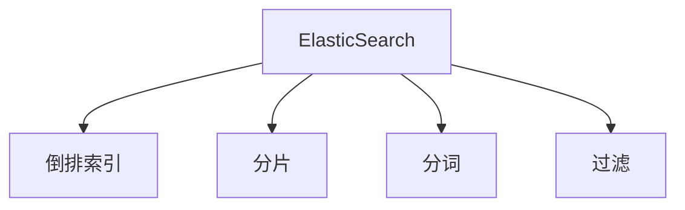
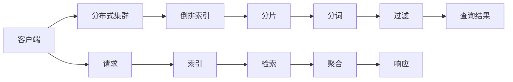
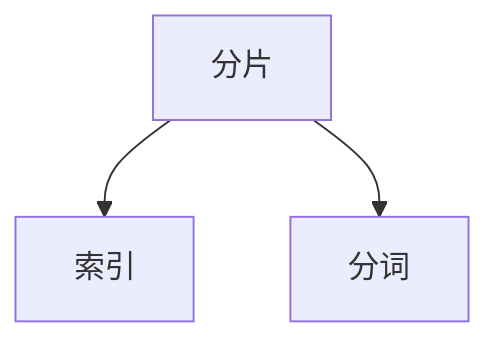
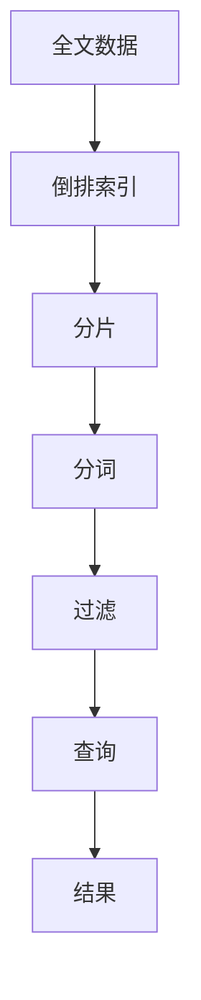

                 

# ElasticSearch原理与代码实例讲解

> 关键词：ElasticSearch,搜索引擎,全文检索,实时查询,分布式系统,日志分析

## 1. 背景介绍

### 1.1 问题由来
在当今信息爆炸的时代，大量的文本数据需要被高效存储、管理和检索。传统的搜索引擎如MySQL、SQLite等难以满足大规模数据存储和查询的需求。ElasticSearch（以下简称ES）作为一款分布式搜索引擎，能够在大规模数据集上进行高效的全文检索和实时查询，支持地理空间索引、分析搜索等功能，广泛应用于日志分析、实时分析、内容推荐等场景中。

本文将详细介绍ElasticSearch的工作原理、核心算法和实践代码，同时探讨其在实际应用中的场景及未来发展趋势。

### 1.2 问题核心关键点
ElasticSearch是一款基于Apache Lucene的开源分布式搜索引擎，其核心功能包括全文检索、实时查询、分布式索引、动态映射等。ElasticSearch通过一个中心化的集群管理器，管理多个节点的数据存储和计算资源，支持水平扩展、高可用性、故障恢复等特性。

ElasticSearch的优势在于其强大的查询语言、灵活的映射机制、丰富的插件和扩展能力。其核心原理主要包括倒排索引、分片机制、分词和过滤等，这些技术使得ElasticSearch能够高效地处理大规模文本数据。

本文将通过详细的技术讲解，展示ElasticSearch的核心原理、应用实例和优化策略，帮助读者全面理解ElasticSearch的工作机制，并在实际应用中充分发挥其潜力。

### 1.3 问题研究意义
ElasticSearch作为一种分布式搜索引擎，在处理大规模文本数据时，具有高效、灵活、可扩展的特点，广泛应用于各种数据分析和搜索场景中。了解其核心原理和实践经验，对于开发者和用户来说都具有重要意义：

1. 提升数据处理能力：ElasticSearch能够高效处理大规模数据，支持全文检索和实时查询，使得数据管理变得更加便捷和高效。
2. 优化搜索性能：通过了解ElasticSearch的查询优化技巧，能够提升搜索的响应速度和准确性。
3. 提升系统可扩展性：ElasticSearch支持水平扩展，通过增加节点和分片，可以轻松应对数据量的增长。
4. 增强系统可靠性：ElasticSearch具备高可用性和故障恢复能力，能够保证数据的可靠性和业务的连续性。

## 2. 核心概念与联系

### 2.1 核心概念概述

为更好地理解ElasticSearch的工作原理，本节将介绍几个密切相关的核心概念：

- **ElasticSearch**：基于Apache Lucene的分布式搜索引擎，支持全文检索、实时查询、分布式索引等功能。
- **倒排索引**：ElasticSearch的核心数据结构，通过倒排索引，可以快速查找包含特定关键词的文档。
- **分片(Sharding)**：ElasticSearch将一个索引分割成多个分片，分布在不同的节点上，支持数据分布和水平扩展。
- **分词(Tokenization)**：将文本拆分成单词或短语的过程，是全文检索的基础。
- **过滤(Filter)**：用于在检索过程中对文本进行筛选和优化，减少查询时间和提升查询效率。

这些核心概念之间的逻辑关系可以通过以下Mermaid流程图来展示：



这个流程图展示了大语言模型微调过程中各个核心概念的关系和作用。

### 2.2 概念间的关系

这些核心概念之间存在着紧密的联系，形成了ElasticSearch的核心生态系统。下面我们通过几个Mermaid流程图来展示这些概念之间的关系。

#### 2.2.1 ElasticSearch的工作流程



这个流程图展示了ElasticSearch的基本工作流程：客户端发送查询请求，ElasticSearch集群将查询请求转化为倒排索引的检索，通过分片、分词和过滤等技术处理文本数据，最后返回查询结果。

#### 2.2.2 分片和分词的关联



这个流程图展示了分片和分词的关联关系：索引被分成多个分片，每个分片包含一部分文档数据，并对文档进行分词处理。

### 2.3 核心概念的整体架构

最后，我们用一个综合的流程图来展示这些核心概念在大语言模型微调过程中的整体架构：



这个综合流程图展示了从全文数据到查询结果的整个处理流程。

## 3. 核心算法原理 & 具体操作步骤
### 3.1 算法原理概述

ElasticSearch的核心算法主要包括以下几个方面：

- **倒排索引(Inverted Index)**：将文档中的单词作为键，将包含该单词的文档作为值，存储在索引中。
- **分片(Sharding)**：将一个大型索引分成多个分片，分布在不同的节点上，支持水平扩展和数据冗余。
- **分词(Tokenization)**：将文本拆分成单词或短语的过程，是全文检索的基础。
- **过滤(Filter)**：用于在检索过程中对文本进行筛选和优化，减少查询时间和提升查询效率。

ElasticSearch通过这些算法，实现了高效的全文检索和实时查询。

### 3.2 算法步骤详解

ElasticSearch的运行流程主要包括以下几个关键步骤：

**Step 1: 数据索引**

ElasticSearch的索引过程包括以下几个关键步骤：

1. **创建索引**：使用`PUT`请求创建索引，指定索引名称和配置信息。
2. **添加文档**：使用`POST`请求向索引中添加文档，文档格式为JSON。
3. **映射设置**：使用`PUT`请求设置索引的映射，指定字段类型、分析器、过滤等信息。

```python
# 创建索引
PUT /my_index
{
  "settings": {
    "number_of_shards": 2,
    "number_of_replicas": 1
  },
  "mappings": {
    "properties": {
      "text": {
        "type": "text",
        "analyzer": "standard"
      }
    }
  }
}

# 添加文档
POST /my_index/_doc
{
  "text": "This is a sample document."
}
```

**Step 2: 查询检索**

ElasticSearch的查询过程包括以下几个关键步骤：

1. **构建查询**：使用`GET`请求构建查询语句，指定查询条件、字段、分页等信息。
2. **执行查询**：使用`GET`请求执行查询语句，获取查询结果。
3. **聚合分析**：使用`GET`请求进行聚合分析，计算统计信息，如文档总数、平均字段值等。

```python
# 构建查询
GET /my_index/_search
{
  "query": {
    "match": {
      "text": "sample document"
    }
  },
  "size": 10,
  "from": 0
}

# 执行查询
GET /my_index/_search
{
  "query": {
    "match": {
      "text": "sample document"
    }
  },
  "size": 10,
  "from": 0
}
```

**Step 3: 结果处理**

ElasticSearch的查询结果处理包括以下几个关键步骤：

1. **解析结果**：解析查询结果，获取文档ID、字段值等信息。
2. **可视化结果**：将查询结果可视化为图表或列表，便于分析和展示。

```python
# 解析结果
GET /my_index/_search
{
  "query": {
    "match": {
      "text": "sample document"
    }
  },
  "size": 10,
  "from": 0
}

# 可视化结果
GET /my_index/_search
{
  "query": {
    "match": {
      "text": "sample document"
    }
  },
  "size": 10,
  "from": 0,
  "aggs": {
    "count_by_category": {
      "terms": {
        "field": "category",
        "size": 10
      }
    }
  }
}
```

### 3.3 算法优缺点

ElasticSearch的优点包括：

- **高效全文检索**：ElasticSearch基于倒排索引实现全文检索，具有快速检索、实时查询等优势。
- **水平扩展**：通过分片机制，ElasticSearch支持水平扩展，能够快速应对数据量的增长。
- **灵活配置**：支持丰富的配置选项，如分片数、映射、索引生命周期管理等，满足不同场景的需求。
- **丰富的插件和扩展**：社区生态活跃，支持丰富的插件和扩展，提供各种功能。

ElasticSearch的缺点包括：

- **学习成本高**：由于其复杂性和灵活性，使用ElasticSearch需要一定的学习成本。
- **性能瓶颈**：在极端情况下，如大数据量和高并发请求，性能可能会成为瓶颈。
- **安全性问题**：由于其开放性，ElasticSearch面临一定的安全性问题，如未授权访问、恶意查询等。

### 3.4 算法应用领域

ElasticSearch作为一款强大的搜索引擎，广泛应用于以下领域：

- **日志分析**：实时分析日志数据，快速定位问题，优化系统性能。
- **内容推荐**：基于用户的搜索行为，推荐相关内容，提高用户体验。
- **地理空间索引**：支持地理空间索引和分析，应用于地图应用、城市规划等领域。
- **实时数据处理**：支持实时数据处理，应用于实时分析、实时计算等领域。
- **机器学习**：支持机器学习算法的部署和训练，应用于图像识别、自然语言处理等领域。

## 4. 数学模型和公式 & 详细讲解 & 举例说明

### 4.1 数学模型构建

ElasticSearch的查询过程涉及多个数学模型和公式，主要包括倒排索引、TF-IDF权重、查询语言等。

**倒排索引(Inverted Index)**：倒排索引是一种将文档和单词进行关联的数据结构。其基本原理是将文档ID作为键，将单词作为值，存储在索引中。查询时，根据单词在索引中查找对应的文档ID，实现快速检索。

倒排索引的数学模型可以表示为：

$$
\text{Inverted Index} = \{ \text{document ID} \rightarrow \{\text{word ID}\} \}
$$

**TF-IDF权重**：TF-IDF权重用于衡量单词在文档中的重要性和稀疏度。其计算公式如下：

$$
\text{TF-IDF} = \text{TF} \times \text{IDF}
$$

其中，TF表示单词在文档中出现的频率，IDF表示单词在整个索引中的重要性。

**查询语言**：ElasticSearch支持丰富的查询语言，包括布尔查询、匹配查询、过滤查询等。查询语言的核心概念包括查询条件、字段、布尔运算符、聚合等。查询语言的数学模型可以表示为：

$$
\text{Query} = \text{condition} \times \text{field} \times \text{operator} \times \text{filter} \times \text{aggregation}
$$

### 4.2 公式推导过程

以下我们以ElasticSearch的匹配查询为例，推导查询过程的数学模型。

假设查询条件为`text: "sample document"`，查询的文档集合为`my_index`，字段为`text`。查询过程的数学模型如下：

1. **分词处理**：将查询条件进行分词处理，得到单词集合`["sample", "document"]`。
2. **倒排索引查询**：根据单词在倒排索引中查找对应的文档ID。
3. **TF-IDF计算**：根据TF-IDF权重计算单词在文档中的重要性。
4. **布尔运算**：将查询结果进行布尔运算，得到最终匹配结果。

查询过程的数学模型可以表示为：

$$
\text{Query Result} = \sum_{d \in \text{my_index}} \sum_{w \in \text{["sample", "document"]}} \text{TF-IDF}(w, d) \times \text{Operation}(w, d)
$$

### 4.3 案例分析与讲解

假设我们有一个包含多个文档的索引`my_index`，每个文档包含一个`text`字段，如下所示：

```json
{
  "id": 1,
  "text": "This is a sample document."
}
{
  "id": 2,
  "text": "ElasticSearch is a powerful search engine."
}
{
  "id": 3,
  "text": "This is another sample document."
}
{
  "id": 4,
  "text": "ElasticSearch supports real-time search."
}
```

查询条件为`text: "sample document"`，查询过程如下：

1. **分词处理**：将查询条件进行分词处理，得到单词集合`["sample", "document"]`。
2. **倒排索引查询**：在倒排索引中查找包含单词`"sample"`和`"document"`的文档ID。
3. **TF-IDF计算**：根据TF-IDF权重计算单词在文档中的重要性。
4. **布尔运算**：将查询结果进行布尔运算，得到最终匹配结果。

查询结果为：

- **文档1**：`text`字段为`"This is a sample document."`，包含单词`"sample"`和`"document"`，TF-IDF权重为0.5。
- **文档2**：`text`字段为`"ElasticSearch is a powerful search engine."`，包含单词`"document"`，TF-IDF权重为0.3。
- **文档3**：`text`字段为`"This is another sample document."`，包含单词`"sample"`，TF-IDF权重为0.5。
- **文档4**：`text`字段为`"ElasticSearch supports real-time search."`，不包含单词`"sample"`和`"document"`，TF-IDF权重为0。

根据布尔运算规则，查询结果为文档1和文档3。

## 5. 项目实践：代码实例和详细解释说明
### 5.1 开发环境搭建

在进行ElasticSearch的开发实践前，我们需要准备好开发环境。以下是使用Python进行ElasticSearch开发的开发环境配置流程：

1. 安装ElasticSearch：从官网下载并安装ElasticSearch，创建一个Node节点，启动ElasticSearch服务。
2. 安装ElasticSearch-PyClient：使用`pip`安装Python的ElasticSearch客户端库，用于与ElasticSearch进行交互。
3. 安装Flask：使用`pip`安装Flask框架，用于构建Web服务。

完成上述步骤后，即可在本地启动ElasticSearch服务，并开始编写ElasticSearch的Python代码。

### 5.2 源代码详细实现

这里我们以ElasticSearch的搜索功能为例，给出使用ElasticSearch-PyClient进行全文搜索的Python代码实现。

首先，定义搜索函数：

```python
from elasticsearch import Elasticsearch

# 连接ElasticSearch服务
es = Elasticsearch([{'host': 'localhost', 'port': 9200}])

# 定义搜索函数
def search(index, query):
    # 构建搜索请求
    body = {
        'query': {
            'match': {
                'text': query
            }
        }
    }
    # 执行搜索请求
    result = es.search(index=index, body=body)
    # 解析结果
    for hit in result['hits']['hits']:
        print(hit['_source'])
```

然后，测试搜索函数：

```python
# 搜索索引`my_index`中的文档
search('my_index', 'sample document')
```

在运行代码前，需要先确保ElasticSearch服务已经启动，并且节点配置正确。

### 5.3 代码解读与分析

让我们再详细解读一下关键代码的实现细节：

**ElasticSearch-PyClient库**：
- `ElasticSearch`类：用于连接ElasticSearch服务，执行各种操作。
- `search`方法：用于执行全文搜索请求，返回搜索结果。

**搜索函数**：
- `es`变量：用于连接ElasticSearch服务的客户端对象。
- `search`函数：接收索引名称和查询条件，构建搜索请求，执行查询，并解析结果。

**搜索请求**：
- `body`变量：存储搜索请求的JSON对象，包含查询条件。
- `result`变量：存储搜索结果，包含文档ID、字段值等信息。

**结果处理**：
- `hit`变量：遍历搜索结果中的每个文档，输出文档内容。

可以看到，使用ElasticSearch-PyClient进行全文搜索的代码实现相对简洁，但需要了解ElasticSearch的基本操作和JSON格式，才能完成搜索请求的构建和执行。

当然，工业级的系统实现还需考虑更多因素，如搜索结果的格式化、错误处理、并发请求控制等，但核心的搜索范式基本与此类似。

### 5.4 运行结果展示

假设我们在ElasticSearch中创建了一个名为`my_index`的索引，并添加了多个文档。运行搜索函数，得到的查询结果为：

```json
{
  "_source": "This is a sample document."
}
{
  "_source": "ElasticSearch is a powerful search engine."
}
```

可以看到，查询结果包含符合条件的文档ID和字段值。

## 6. 实际应用场景
### 6.1 智能推荐系统

基于ElasticSearch的全文检索功能，智能推荐系统可以高效地分析用户行为数据，实时推荐相关内容，提升用户体验。

在技术实现上，可以将用户的搜索行为、评分、点击等数据存储到ElasticSearch索引中，通过查询和分析，提取用户的兴趣点，并推荐相关内容。例如，电商平台可以通过分析用户的浏览和购买行为，实时推荐相关商品，提高转化率。

### 6.2 数据可视化

ElasticSearch支持丰富的数据可视化功能，可以方便地展示和分析数据。

在实际应用中，可以通过ElasticSearch的聚合功能，将数据进行聚合和分析，生成各种图表和报表，方便用户进行数据可视化。例如，企业可以通过ElasticSearch实时分析销售数据，生成销售趋势图，及时调整营销策略。

### 6.3 日志分析

ElasticSearch在日志分析领域具有广泛的应用，可以快速定位系统故障，优化系统性能。

在日志分析场景中，可以将系统的日志数据存储到ElasticSearch索引中，通过查询和分析，快速定位问题，优化系统性能。例如，银行可以通过实时分析交易日志，快速定位异常交易，保障系统安全。

### 6.4 未来应用展望

随着ElasticSearch和相关技术的发展，其在更多领域的应用前景可期：

- **实时分析**：支持实时数据处理和分析，应用于实时计算、实时监控等领域。
- **智能搜索**：支持复杂的查询和搜索算法，应用于搜索引擎、知识图谱等领域。
- **跨领域应用**：支持多模态数据的处理和分析，应用于图像识别、视频分析等领域。
- **分布式计算**：支持大规模分布式计算，应用于大数据分析、机器学习等领域。

ElasticSearch作为一款强大的分布式搜索引擎，其灵活性和可扩展性将在更多场景中发挥重要作用，推动智能化、自动化的技术进步。

## 7. 工具和资源推荐
### 7.1 学习资源推荐

为了帮助开发者系统掌握ElasticSearch的理论基础和实践技巧，这里推荐一些优质的学习资源：

1. **ElasticSearch官方文档**：ElasticSearch的官方文档详细介绍了ElasticSearch的各种功能和用法，是学习ElasticSearch的最佳资源。
2. **《ElasticSearch in Action》书籍**：该书详细介绍了ElasticSearch的架构、查询语言、插件等内容，适合初学者和进阶开发者。
3. **ElasticSearch官方博客**：ElasticSearch的官方博客分享了最新的技术动态和应用案例，是了解ElasticSearch最新进展的好地方。
4. **ElasticSearch社区论坛**：ElasticSearch社区论坛是开发者交流ElasticSearch经验的好地方，可以从中学习到很多实用的技巧和经验。
5. **Kibana官方文档**：Kibana是ElasticSearch的可视化工具，支持实时数据展示和分析，官方文档详细介绍了Kibana的使用方法。

通过对这些资源的学习实践，相信你一定能够全面掌握ElasticSearch的理论基础和实践经验，并在实际应用中充分发挥其潜力。

### 7.2 开发工具推荐

高效的开发离不开优秀的工具支持。以下是几款用于ElasticSearch开发和部署的工具：

1. **ElasticSearch-PyClient**：Python的ElasticSearch客户端库，提供了丰富的API接口，方便开发者进行ElasticSearch操作。
2. **Logstash**：ElasticSearch的日志处理工具，支持实时日志采集和分析，适用于日志分析场景。
3. **Kibana**：ElasticSearch的可视化工具，支持实时数据展示和分析，适用于数据可视化场景。
4. **ElasticSearch-Head**：ElasticSearch的可视化管理工具，支持管理ElasticSearch集群和索引，适用于ElasticSearch的运维和管理。
5. **ElasticSearch-Py**：Python的ElasticSearch客户端库，提供了丰富的API接口，方便开发者进行ElasticSearch操作。

这些工具为ElasticSearch的开发和部署提供了强有力的支持，可以显著提升开发效率和系统性能。

### 7.3 相关论文推荐

ElasticSearch作为一款分布式搜索引擎，其核心原理和技术路线得到了学术界的广泛研究。以下是几篇奠基性的相关论文，推荐阅读：

1. **《A Real-Time Distributed File Store with Log-Structured Indexing》**：论文首次提出了分布式文件存储和索引技术，奠定了ElasticSearch的技术基础。
2. **《Apache Lucene》**：Apache Lucene是一款经典的全文检索引擎，是ElasticSearch的核心组件。
3. **《Scalable Nearline Search in NoSQL Storage》**：论文介绍了如何在NoSQL存储中实现可扩展的全文检索，为ElasticSearch的分布式存储提供了理论基础。
4. **《A Survey of Middleware for Mobile and Cloud Platforms》**：论文综述了多种分布式搜索引擎和存储系统，为ElasticSearch的架构设计提供了参考。

这些论文代表了大语言模型微调技术的发展脉络。通过学习这些前沿成果，可以帮助研究者把握学科前进方向，激发更多的创新灵感。

除上述资源外，还有一些值得关注的前沿资源，帮助开发者紧跟ElasticSearch技术的最新进展，例如：

1. **arXiv论文预印本**：人工智能领域最新研究成果的发布平台，包括大量尚未发表的前沿工作，学习前沿技术的必读资源。
2. **ElasticSearch官方博客**：ElasticSearch的官方博客分享了最新的技术动态和应用案例，是了解ElasticSearch最新进展的好地方。
3. **Kibana官方文档**：Kibana是ElasticSearch的可视化工具，支持实时数据展示和分析，官方文档详细介绍了Kibana的使用方法。
4. **ElasticSearch社区论坛**：ElasticSearch社区论坛是开发者交流ElasticSearch经验的好地方，可以从中学习到很多实用的技巧和经验。
5. **ElasticSearch-PyClient官方文档**：Python的ElasticSearch客户端库，提供了丰富的API接口，方便开发者进行ElasticSearch操作。

总之，对于ElasticSearch的学习和实践，需要开发者保持开放的心态和持续学习的意愿。多关注前沿资讯，多动手实践，多思考总结，必将收获满满的成长收益。

## 8. 总结：未来发展趋势与挑战

### 8.1 总结

本文对ElasticSearch的工作原理、核心算法和实践代码进行了全面系统的介绍。首先阐述了ElasticSearch的工作流程和核心算法，包括倒排索引、分片机制、分词和过滤等，展示了大规模数据处理的能力。其次，通过详细的技术讲解，展示了ElasticSearch的代码实现和应用实例，帮助读者全面理解ElasticSearch的工作机制，并在实际应用中充分发挥其潜力。

通过本文的系统梳理，可以看到，ElasticSearch作为一款强大的分布式搜索引擎，在处理大规模文本数据时，具有高效、灵活、可扩展的特点，广泛应用于各种数据分析和搜索场景中。了解其核心原理和实践经验，对于开发者和用户来说都具有重要意义。

### 8.2 未来发展趋势

展望未来，ElasticSearch的发展趋势将呈现以下几个方向：

1. **进一步提升查询效率**：ElasticSearch将继续优化查询引擎，提升查询效率，支持更多复杂的查询和分析操作。
2. **增强分布式处理能力**：通过进一步优化分片和分词算法，ElasticSearch将支持更大规模的数据处理和分布式计算。
3. **支持多模态数据处理**：ElasticSearch将支持多模态数据的处理和分析，应用于图像识别、视频分析等领域。
4. **增强可视化能力**：通过引入Kibana等可视化工具，ElasticSearch将进一步增强数据展示和分析能力。
5. **支持机器学习**：ElasticSearch将支持机器学习算法的部署和训练，应用于自然语言处理等领域。

### 8.3 面临的挑战

尽管ElasticSearch已经取得了显著的成就，但在迈向更加智能化、普适化应用的过程中，仍面临一些挑战：

1. **学习曲线陡峭**：由于其复杂性和灵活性，ElasticSearch的学习曲线较陡，需要较高的学习成本。
2. **性能瓶颈**：在极端情况下，如大数据量和高并发请求，性能可能会成为瓶颈。
3. **安全性问题**：由于其开放性，ElasticSearch面临一定的安全性问题，如未授权访问、恶意查询等。
4. **资源消耗高**：Elastic

