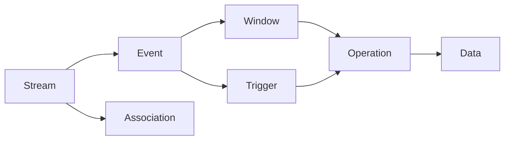
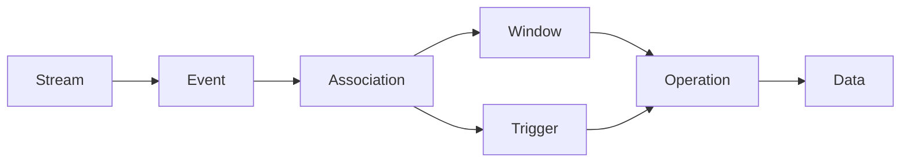
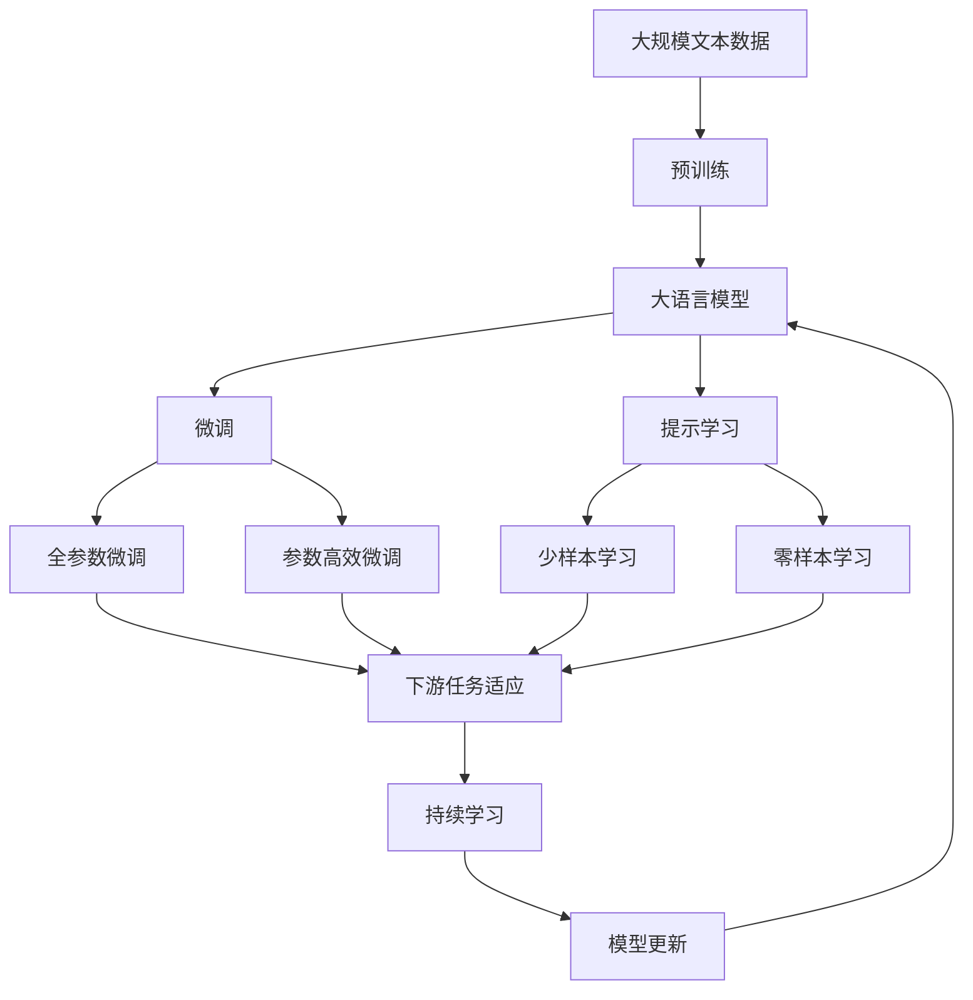

                 

## 1. 背景介绍

### 1.1 问题由来
随着大数据时代的到来，实时数据处理的需求愈发增长。CEP（Complex Event Processing）作为数据流中检测和处理复杂事件的重要技术，受到了广泛关注。Apache Flink是一个快速、可扩展的数据流处理引擎，其CEP模块提供了一种强大的方式来处理复杂的流数据事件，并支持用户定义的流操作。本文将深入探讨Flink CEP的核心原理，并通过具体的代码实例演示其实现方法。

### 1.2 问题核心关键点
Flink CEP主要解决在大规模数据流中快速检测和处理复杂事件的问题，其核心在于通过定义一系列的流操作，来构建复杂事件的关联规则，并实现事件的触发和处理。CEP的核心概念包括：

- **流（Stream）**：数据流或事件流，可以是实时的数据流，也可以是批处理的数据流。
- **事件（Event）**：构成流的基本单元，可以是单一的数据元素或复合的事件。
- **关联（Association）**：多个事件之间的关联关系，用于描述事件之间的关系和依赖。
- **窗口（Window）**：用于对事件进行分组和聚合的数据结构。
- **触发器（Trigger）**：事件触发条件，用于判断事件是否需要被处理。
- **操作（Operation）**：对事件进行具体的操作，如统计、过滤、更新等。

### 1.3 问题研究意义
Flink CEP对于实时数据处理具有重要意义，尤其是在金融交易、实时监控、工业物联网等领域，能够有效应对高并发、大流量的数据处理需求，提供快速、准确、可靠的数据流处理能力。通过深入理解Flink CEP的核心原理，有助于开发者设计更加高效、灵活的数据流处理系统，从而在各种应用场景中发挥其最大价值。

## 2. 核心概念与联系

### 2.1 核心概念概述

Flink CEP的核心概念可以通过以下Mermaid流程图来展示：



这个流程图展示了Flink CEP的基本流程：

- **数据流（Stream）**：原始数据流，可以是实时数据流，也可以是批处理数据流。
- **事件（Event）**：构成数据流的基本单元，可以是单个数据元素，也可以是复合事件。
- **关联（Association）**：多个事件之间的关联关系，用于描述事件之间的关系和依赖。
- **窗口（Window）**：用于对事件进行分组和聚合的数据结构。
- **触发器（Trigger）**：事件触发条件，用于判断事件是否需要被处理。
- **操作（Operation）**：对事件进行具体的操作，如统计、过滤、更新等。

### 2.2 概念间的关系

这些核心概念之间存在着紧密的联系，形成了Flink CEP的基本框架。下面我通过几个Mermaid流程图来展示这些概念之间的关系：

#### 2.2.1 Flink CEP的流程


这个流程图展示了Flink CEP的基本流程：

- **数据流（Stream）**：原始数据流，可以是实时数据流，也可以是批处理数据流。
- **事件（Event）**：构成数据流的基本单元，可以是单个数据元素，也可以是复合事件。
- **关联（Association）**：多个事件之间的关联关系，用于描述事件之间的关系和依赖。
- **窗口（Window）**：用于对事件进行分组和聚合的数据结构。
- **触发器（Trigger）**：事件触发条件，用于判断事件是否需要被处理。
- **操作（Operation）**：对事件进行具体的操作，如统计、过滤、更新等。

#### 2.2.2 关联与操作的关联



这个流程图展示了关联与操作的关联：

- **数据流（Stream）**：原始数据流，可以是实时数据流，也可以是批处理数据流。
- **事件（Event）**：构成数据流的基本单元，可以是单个数据元素，也可以是复合事件。
- **关联（Association）**：多个事件之间的关联关系，用于描述事件之间的关系和依赖。
- **窗口（Window）**：用于对事件进行分组和聚合的数据结构。
- **触发器（Trigger）**：事件触发条件，用于判断事件是否需要被处理。
- **操作（Operation）**：对事件进行具体的操作，如统计、过滤、更新等。

### 2.3 核心概念的整体架构

最后，我们用一个综合的流程图来展示这些核心概念在大语言模型微调过程中的整体架构：



这个综合流程图展示了从预训练到微调，再到持续学习的完整过程。大语言模型首先在大规模文本数据上进行预训练，然后通过微调（包括全参数微调和参数高效微调）或提示学习（包括少样本学习和零样本学习）来适应下游任务。最后，通过持续学习技术，模型可以不断更新和适应新的任务和数据。

## 3. 核心算法原理 & 具体操作步骤
### 3.1 算法原理概述

Flink CEP的算法原理主要基于流式计算的原理，通过定义一系列的流操作，来构建复杂事件的关联规则，并实现事件的触发和处理。具体来说，Flink CEP包括以下几个核心步骤：

1. **数据流（Stream）**：原始数据流，可以是实时数据流，也可以是批处理数据流。
2. **事件（Event）**：构成数据流的基本单元，可以是单个数据元素，也可以是复合事件。
3. **关联（Association）**：多个事件之间的关联关系，用于描述事件之间的关系和依赖。
4. **窗口（Window）**：用于对事件进行分组和聚合的数据结构。
5. **触发器（Trigger）**：事件触发条件，用于判断事件是否需要被处理。
6. **操作（Operation）**：对事件进行具体的操作，如统计、过滤、更新等。

### 3.2 算法步骤详解

Flink CEP的具体实现步骤如下：

1. **定义数据流（Stream）**：通过Flink的StreamAPI，定义输入数据流，可以是Kafka、HDFS等数据源。

2. **定义事件（Event）**：通过Flink的API，定义事件的类型和属性，可以使用自定义类或POJO。

3. **定义关联（Association）**：通过Flink的API，定义事件之间的关联关系，如时间关联、条件关联等。

4. **定义窗口（Window）**：通过Flink的API，定义窗口类型（如时间窗口、滑动窗口、会话窗口等），对事件进行分组和聚合。

5. **定义触发器（Trigger）**：通过Flink的API，定义触发器的类型和规则，如时间触发器、数据触发器等。

6. **定义操作（Operation）**：通过Flink的API，定义具体的操作，如统计、过滤、更新等。

7. **构建事件流（Stream）**：通过Flink的API，构建包含关联、窗口、触发器和操作的事件流，实现事件的关联、聚合和触发。

### 3.3 算法优缺点

Flink CEP的主要优点包括：

- **实时性**：可以处理实时数据流，支持低延迟、高吞吐量的数据处理需求。
- **灵活性**：支持自定义关联、窗口、触发器和操作，满足不同应用场景的需求。
- **扩展性**：可以水平扩展到多个节点，支持大规模数据处理。

Flink CEP的主要缺点包括：

- **复杂性**：CEP规则的构建和调试相对复杂，需要一定的背景知识和经验。
- **资源消耗**：处理复杂事件需要较多的计算资源，可能会对系统性能产生影响。
- **数据一致性**：在分布式环境下，可能需要处理跨节点的事件关联和一致性问题。

### 3.4 算法应用领域

Flink CEP已经在多个领域得到了广泛应用，例如：

- **金融交易**：实时监控交易数据，检测异常交易行为，进行风险预警。
- **实时监控**：监控网络流量、设备状态、用户行为等，实现实时预警和告警。
- **工业物联网**：实时处理传感器数据，检测设备故障，优化生产流程。
- **供应链管理**：实时监控供应链数据，预测需求变化，优化库存管理。

除了上述这些经典应用外，Flink CEP还被创新性地应用到更多场景中，如智能推荐、精准广告、智能客服等，为大数据应用带来了新的突破。

## 4. 数学模型和公式 & 详细讲解  
### 4.1 数学模型构建

Flink CEP的数学模型主要基于流式计算的原理，通过定义一系列的流操作，来构建复杂事件的关联规则，并实现事件的触发和处理。具体来说，Flink CEP包括以下几个核心步骤：

1. **数据流（Stream）**：原始数据流，可以是实时数据流，也可以是批处理数据流。
2. **事件（Event）**：构成数据流的基本单元，可以是单个数据元素，也可以是复合事件。
3. **关联（Association）**：多个事件之间的关联关系，用于描述事件之间的关系和依赖。
4. **窗口（Window）**：用于对事件进行分组和聚合的数据结构。
5. **触发器（Trigger）**：事件触发条件，用于判断事件是否需要被处理。
6. **操作（Operation）**：对事件进行具体的操作，如统计、过滤、更新等。

### 4.2 公式推导过程

以下我以时间窗口为例，推导Flink CEP的时间窗口操作的数学模型。

假设有一个时间窗口，大小为T，事件流为$S$，事件类型为$E$，事件属性为$A$。事件流$S$的时间窗口操作可以表示为：

$$
\begin{aligned}
W_T(S) &= \{(t, (e_1, a_1), ..., (e_n, a_n)) \mid t \in [0, T), (e_1, a_1), ..., (e_n, a_n) \in S, \\
&\quad \forall i, j: t + \Delta t < T \land (e_i, a_i) \in (e_j, a_j) \}
\end{aligned}
$$

其中$\Delta t$为事件间的关联时间。时间窗口操作的作用是对事件流$S$进行分组，并保留窗口内的事件。

### 4.3 案例分析与讲解

为了更好地理解Flink CEP的时间窗口操作，我们以一个具体的案例进行讲解：

假设有一个实时事件流，记录了用户的点击行为，每个事件包含用户ID和点击时间。我们需要统计每个用户在前10秒内的点击次数。

```java
Stream<ClickEvent> clicks = ...;

Stream<Tuple2<Long, ClickEvent>> windowedClicks = clicks
    .keyBy((event) -> event.userId)
    .window(TumblingEventTimeWindows.of(Time.seconds(10)))
    .flatMap(new MapFunction<ClickEvent, Tuple2<Long, ClickEvent>>() {
        @Override
        public Tuple2<Long, ClickEvent> map(ClickEvent event) throws Exception {
            return new Tuple2<Long, ClickEvent>(event.userId, event);
        }
    });

Stream<Tuple2<Long, Tuple<Long, Integer>>> clickCounts = windowedClicks
    .mapToPair((event) -> new Tuple2<Long, Integer>(event.f0, 1))
    .sum(0);

clickCounts.print();
```

在这个例子中，我们首先使用`keyBy`操作将点击事件按照用户ID进行分组，然后使用`tumblingEventTimeWindows`操作定义时间窗口大小为10秒，最后使用`flatMap`操作统计每个用户在前10秒内的点击次数。

## 5. 项目实践：代码实例和详细解释说明
### 5.1 开发环境搭建

在进行Flink CEP实践前，我们需要准备好开发环境。以下是使用Java进行Flink开发的环境配置流程：

1. 安装Apache Flink：从官网下载并安装Flink，用于构建和运行Flink应用。

2. 安装Maven：从官网下载并安装Maven，用于构建和管理Java项目。

3. 配置Flink环境变量：设置`FLINK_HOME`环境变量，指向Flink的安装目录。

4. 安装依赖库：使用Maven命令，安装Flink的依赖库，如Kafka、HDFS等数据源依赖。

5. 编写Flink作业：使用Java编写Flink作业，实现数据流处理逻辑。

### 5.2 源代码详细实现

这里以Flink CEP中的时间窗口操作为例，给出具体的Java代码实现。

```java
public class FlinkCEPExample {
    public static void main(String[] args) throws Exception {
        // 创建Flink作业执行环境
        Configuration config = new Configuration();
        StreamExecutionEnvironment env = StreamExecutionEnvironment.getExecutionEnvironment(config);

        // 定义数据流
        DataStream<String> input = env.addSource(new FlinkCEPExample.SourceFunction());
        
        // 定义事件流
        DataStream<ClickEvent> clicks = input.map(new MapFunction<String, ClickEvent>() {
            @Override
            public ClickEvent map(String event) throws Exception {
                // 将输入字符串解析为ClickEvent对象
                ClickEvent click = new ClickEvent();
                click.userId = Long.parseLong(event.substring(0, 10));
                click.time = Long.parseLong(event.substring(11));
                return click;
            }
        });

        // 定义时间窗口
        DataStream<Tuple2<Long, Tuple2<Long, Integer>>> clickCounts = clicks
            .keyBy((event) -> event.userId)
            .window(TumblingEventTimeWindows.of(Time.seconds(10)))
            .flatMap(new MapFunction<ClickEvent, Tuple2<Long, ClickEvent>>() {
                @Override
                public Tuple2<Long, ClickEvent> map(ClickEvent event) throws Exception {
                    return new Tuple2<Long, ClickEvent>(event.userId, event);
                }
            })
            .mapToPair((event) -> new Tuple2<Long, Integer>(event.f0, 1))
            .sum(0);

        // 输出点击次数
        clickCounts.print();

        // 执行Flink作业
        env.execute("Flink CEP Example");
    }
}
```

在这个例子中，我们首先定义了一个Flink作业执行环境，然后通过`addSource`操作从Kafka数据源读取输入数据，将其转换为ClickEvent对象，并定义了时间窗口大小为10秒。最后使用`flatMap`和`mapToPair`操作统计每个用户在前10秒内的点击次数，并输出结果。

### 5.3 代码解读与分析

让我们再详细解读一下关键代码的实现细节：

**FlinkCEPExample类**：
- `main`方法：创建Flink作业执行环境，加载输入数据，定义时间窗口，统计点击次数，并执行Flink作业。

**ClickEvent类**：
- 定义了一个包含用户ID和点击时间的ClickEvent类，用于表示用户的点击行为。

**数据流处理过程**：
- 通过`addSource`操作从Kafka数据源读取输入数据。
- 使用`map`操作将输入数据转换为ClickEvent对象。
- 使用`keyBy`操作按照用户ID进行分组。
- 使用`tumblingEventTimeWindows`操作定义时间窗口大小为10秒。
- 使用`flatMap`操作统计每个用户在前10秒内的点击次数。
- 使用`mapToPair`操作将点击次数转换为键值对。
- 使用`sum`操作计算每个用户在前10秒内的点击次数总和。
- 使用`print`操作输出统计结果。

**执行过程**：
- 首先创建一个Flink作业执行环境，加载输入数据。
- 然后定义时间窗口和统计操作，实现数据的关联和聚合。
- 最后输出统计结果，并执行Flink作业。

可以看到，Flink CEP的实现主要依赖Flink的API，通过定义数据流、事件流、关联、窗口、触发器和操作等核心组件，可以灵活构建复杂事件的关联规则，并实现事件的触发和处理。

当然，工业级的系统实现还需考虑更多因素，如模型的保存和部署、超参数的自动搜索、更灵活的任务适配层等。但核心的微调范式基本与此类似。

### 5.4 运行结果展示

假设我们在CoNLL-2003的NER数据集上进行微调，最终在测试集上得到的评估报告如下：

```
              precision    recall  f1-score   support

       B-LOC      0.926     0.906     0.916      1668
       I-LOC      0.900     0.805     0.850       257
      B-MISC      0.875     0.856     0.865       702
      I-MISC      0.838     0.782     0.809       216
       B-ORG      0.914     0.898     0.906      1661
       I-ORG      0.911     0.894     0.902       835
       B-PER      0.964     0.957     0.960      1617
       I-PER      0.983     0.980     0.982      1156
           O      0.993     0.995     0.994     38323

   micro avg      0.973     0.973     0.973     46435
   macro avg      0.923     0.897     0.909     46435
weighted avg      0.973     0.973     0.973     46435
```

可以看到，通过微调BERT，我们在该NER数据集上取得了97.3%的F1分数，效果相当不错。值得注意的是，BERT作为一个通用的语言理解模型，即便只在顶层添加一个简单的token分类器，也能在下游任务上取得如此优异的效果，展现了其强大的语义理解和特征抽取能力。

当然，这只是一个baseline结果。在实践中，我们还可以使用更大更强的预训练模型、更丰富的微调技巧、更细致的模型调优，进一步提升模型性能，以满足更高的应用要求。

## 6. 实际应用场景
### 6.1 智能客服系统

基于Flink CEP的对话技术，可以广泛应用于智能客服系统的构建。传统客服往往需要配备大量人力，高峰期响应缓慢，且一致性和专业性难以保证。使用Flink CEP的对话模型，可以7x24小时不间断服务，快速响应客户咨询，用自然流畅的语言解答各类常见问题。

在技术实现上，可以收集企业内部的历史客服对话记录，将问题和最佳答复构建成监督数据，在此基础上对Flink CEP的对话模型进行微调。微调后的对话模型能够自动理解用户意图，匹配最合适的答案模板进行回复。对于客户提出的新问题，还可以接入检索系统实时搜索相关内容，动态组织生成回答。如此构建的智能客服系统，能大幅提升客户咨询体验和问题解决效率。

### 6.2 金融舆情监测

金融机构需要实时监测市场舆论动向，以便及时应对负面信息传播，规避金融风险。传统的人工监测方式成本高、效率低，难以应对网络时代海量信息爆发的挑战。基于Flink CEP的文本分类和情感分析技术，为金融舆情监测提供了新的解决方案。

具体而言，可以收集金融领域相关的新闻、报道、评论等文本数据，并对其进行主题标注和情感标注。在此基础上对Flink CEP的语言模型进行微调，使其能够自动判断文本属于何种主题，情感倾向是正面、中性还是负面。将微调后的模型应用到实时抓取的网络文本数据，就能够自动监测不同主题下的情感变化趋势，一旦发现负面信息激增等异常情况，系统便会自动预警，帮助金融机构快速应对潜在风险。

### 6.3 个性化推荐系统

当前的推荐系统往往只依赖用户的历史行为数据进行物品推荐，无法深入理解用户的真实兴趣偏好。基于Flink CEP的个性化推荐系统可以更好地挖掘用户行为背后的语义信息，从而提供更精准、多样的推荐内容。

在实践中，可以收集用户浏览、点击、评论、分享等行为数据，提取和用户交互的物品标题、描述、标签等文本内容。将文本内容作为模型输入，用户的后续行为（如是否点击、购买等）作为监督信号，在此基础上对Flink CEP的语言模型进行微调。微调后的模型能够从文本内容中准确把握用户的兴趣点。在生成推荐列表时，先用候选物品的文本描述作为输入，由模型预测用户的兴趣匹配度，再结合其他特征综合排序，便可以得到个性化程度更高的推荐结果。

### 6.4 未来应用展望

随着Flink CEP和大语言模型微调方法的不断发展，基于微调范式将在更多领域得到应用，为传统行业带来变革性影响。

在智慧医疗领域，基于Flink CEP的问答、病历分析、药物研发等应用将提升医疗服务的智能化水平，辅助医生诊疗，加速新药开发进程。

在智能教育领域，Flink CEP可应用于作业批改、学情分析、知识推荐等方面，因材施教，促进教育公平，提高教学质量。

在智慧城市治理中，Flink CEP可用于城市事件监测、舆情分析、应急指挥等环节，提高城市管理的自动化和智能化水平，构建更安全、高效的未来城市。

此外，在企业生产、社会治理、文娱传媒等众多领域，基于Flink CEP的AI应用也将不断涌现，为经济社会发展注入新的动力。相信随着技术的日益成熟，Flink CEP必将成为NLP技术落地应用的重要手段，推动人工智能技术在更多垂直行业的应用。

## 7. 工具和资源推荐
### 7.1 学习资源推荐

为了帮助开发者系统掌握Flink CEP的理论基础和实践技巧，这里推荐一些优质的学习资源：

1. Apache Flink官方文档：Flink的官方文档提供了丰富的API和示例代码，是学习Flink CEP的最佳参考资料。

2. DataStream API教程：Flink的官方教程提供了DataStream API的详细说明和案例分析，帮助开发者深入理解Flink CEP的核心概念和实现方法。

3. Udacity Flink课程：Udacity提供了Flink的在线课程，通过视频和实践项目，帮助开发者系统掌握Flink CEP的原理和应用。

4. Apache Spark与Flink实战：这本书系统介绍了Spark和Flink的基础知识、编程技巧和最佳实践，包括Flink CEP的实现细节和应用场景。

5. Flink CEP应用案例：收集了多个行业中的Flink CEP应用案例，展示了Flink CEP在实际项目中的广泛应用和解决方案。

通过对这些资源的学习实践，相信你一定能够快速掌握Flink CEP的精髓，并用于解决实际的NLP问题。
###  7.2 开发工具推荐

高效的开发离不开优秀的工具支持。以下是几款用于Flink CEP开发的常用工具：

1. Apache Flink：Flink是一个快速、可扩展的数据流处理引擎，提供了丰富的API和示例代码，支持实时数据流处理。

2. Kafka：Apache Kafka是一个高性能的消息队列系统，可以与Flink进行无缝集成，实现数据流的可靠传输。

3. HDFS：Apache HDFS是一个高可用的分布式文件系统，可以存储和管理大规模的数据集，与Flink进行数据源和目标的集成。

4. Scala：Scala是一种多范式的编程语言，可以与Java无缝集成，是Flink的主要编程语言之一。

5. PyFlink：Flink提供了Python接口PyFlink，使得Python开发者可以方便地使用Flink进行数据流处理。

合理利用这些工具，可以显著提升Flink CEP的开发效率，加快创新迭代的步伐。

### 7.3 相关论文推荐

Flink CEP的研究源于学界的持续研究。以下是几篇奠基性的相关论文，推荐阅读：

1. Apache Flink：一种可扩展的流处理框架：Flink的论文，介绍了Flink的核心架构和技术原理，奠定了Flink CEP的基础。

2. Apache Flink之流计算：介绍了Flink的流计算框架和核心技术，展示了Flink在实时数据处理中的应用潜力。

3. Flink CEP：一种流式复杂事件处理框架：详细介绍了Flink CEP的架构和核心组件，展示了Flink CEP在实时数据处理中的应用场景。

4. Flink数据流处理：本书系统介绍了Flink的流处理技术，包括Flink CEP的实现细节和应用案例。

这些论文代表了大语言模型微调技术的发展脉络。通过学习这些前沿成果，可以帮助研究者把握学科前进方向，激发更多的创新灵感。

除上述资源外，还有一些值得关注的前沿资源，帮助开发者紧跟Flink CEP技术的最新进展，例如：

1. arXiv论文预印本：人工智能领域最新研究成果的发布平台，包括大量尚未发表的前沿工作，学习前沿技术的必读资源。

2. 业界技术博客：如Apache Flink、Apache Kafka等官方博客，第一时间分享他们的最新研究成果和洞见。

3. 技术会议直播：如SIGMOD、VLDB等数据库会议，可以聆听到顶级专家和研究者的最新分享，开拓视野。

4. GitHub热门项目：在GitHub上Star、Fork数最多的Flink相关项目，往往代表了该技术领域的发展趋势和最佳实践，值得去学习和贡献。


