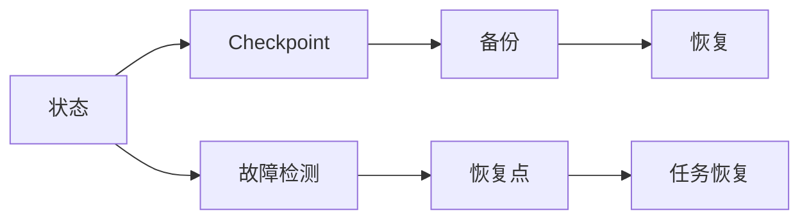

                 

# Flink Checkpoint容错机制原理与代码实例讲解

> 关键词：Flink, 容错机制, Checkpoint, Fault-Tolerance, 分布式流处理, Apache Flink, 状态管理

## 1. 背景介绍

在分布式计算环境中，由于硬件故障、网络问题等不可控因素，程序的运行往往会面临数据丢失、状态不一致等问题。如何设计一套可靠的容错机制，确保计算任务能够稳定运行，成为了分布式系统设计的核心挑战之一。

在流处理领域，Apache Flink 作为一个开源的分布式流处理框架，提供了完善的容错机制，保证计算任务在异常情况下的健壮性和持续性。其中，Checkpoint 机制是 Flink 实现容错的核心技术。

本文将深入探讨 Flink Checkpoint 的原理和实现细节，并通过代码实例演示如何在其上实现容错机制，帮助读者更好地理解这一关键技术。

## 2. 核心概念与联系

### 2.1 核心概念概述

- **Apache Flink**：一个开源的分布式流处理框架，支持批处理和流处理，具有高度的灵活性和扩展性。
- **Checkpoint**：一种用于状态恢复的机制，在程序运行过程中定期保存程序的状态，以备在程序崩溃或异常时恢复。
- **Fault-Tolerance**：容错，即系统在面对故障时依然能够继续运行的能力。
- **分布式流处理**：将数据流分布在多个节点上并行处理，提高处理效率。
- **状态管理**：在分布式计算环境中，确保状态的一致性和恢复性，是分布式系统设计的重要组成部分。

这些概念构成了分布式流处理容错机制的基础，Checkpoint 机制则是 Flink 实现这一容错的核心技术。下面将通过 Mermaid 流程图展示 Flink Checkpoint 的实现原理。



### 2.2 概念间的关系

从上述 Mermaid 流程图中可以看出，Flink 的 Checkpoint 机制通过定期保存状态，并在程序崩溃或异常时恢复状态，实现了对分布式流处理的容错支持。

具体来说，当程序遇到故障时，通过故障检测模块检测到异常，触发恢复点（Checkpoint 点），利用备份数据恢复程序状态，确保任务能够继续执行。恢复完成后，程序进入新的 Checkpoint 周期，继续进行状态备份。

下面我们将从 Flink Checkpoint 的原理和实现细节入手，深入探讨其核心机制。

## 3. 核心算法原理 & 具体操作步骤

### 3.1 算法原理概述

Flink 的 Checkpoint 机制基于有状态的算子，通过定期保存算子状态，来实现程序的容错。

具体来说，当算子被 Checkpoint 触发时，Flink 会首先将该算子的状态（如缓存数据、任务间状态等）以 serialized 的形式写入磁盘或远程存储。一旦保存完成，Flink 会返回一个 Checkpoint ID，用于标识该 Checkpoint 点。

在程序运行过程中，Flink 会不断地进行 Checkpoint，周期性地保存算子状态。当程序发生故障时，Flink 会根据最近的 Checkpoint ID，从备份中恢复算子状态，确保程序能够从 Checkpoint 点继续执行。

### 3.2 算法步骤详解

Flink Checkpoint 的具体实现步骤包括：

1. **触发 Checkpoint**：Flink 定期触发 Checkpoint，根据设定的周期和间隔时间执行状态保存。

2. **保存状态**：Flink 将算子状态序列化后，写入到指定的备份存储中。

3. **返回 Checkpoint ID**：Flink 返回一个唯一的 Checkpoint ID，用于标识该 Checkpoint 点。

4. **故障恢复**：当程序发生故障时，Flink 根据最近的 Checkpoint ID，恢复算子状态，确保程序能够从 Checkpoint 点继续执行。

5. **恢复后触发 Checkpoint**：一旦程序恢复完成，Flink 会触发新的 Checkpoint，继续进行状态备份。

下面通过代码示例演示 Flink Checkpoint 的实现步骤。

### 3.3 算法优缺点

Flink Checkpoint 机制具有以下优点：

- **高效性**：Checkpoint 周期可以根据需求进行设定，灵活调整备份频率。
- **可靠性**：通过定期备份状态，确保程序在故障时能够从最近的 Checkpoint 点恢复，避免数据丢失。
- **可扩展性**：Checkpoint 机制适用于大规模分布式流处理，支持横向扩展。

同时，Checkpoint 机制也存在一些缺点：

- **资源消耗**：定期保存和恢复状态需要消耗一定的计算和存储资源。
- **系统复杂度**：Checkpoint 机制增加了系统的复杂度，需要额外的监控和管理。

在实际应用中，需要根据具体场景权衡利弊，选择合适的容错机制。

### 3.4 算法应用领域

Flink Checkpoint 机制广泛应用于大规模分布式流处理场景，包括：

- 实时数据处理：如实时数据流、实时计算、实时分析等。
- 分布式数据库：如 HBase、Kafka 等。
- 机器学习：如分布式训练、模型保存、模型恢复等。

## 4. 数学模型和公式 & 详细讲解 & 举例说明

### 4.1 数学模型构建

Flink Checkpoint 的实现涉及到分布式计算和状态管理，可以通过数学模型进行进一步的描述。

设 $\theta$ 为程序的状态，$\mathcal{S}$ 为状态空间，$\mathcal{D}$ 为分布式环境。Flink Checkpoint 的目标是定期保存状态 $\theta$，并在程序发生故障时，从最近的 Checkpoint 点恢复状态 $\theta'$。

设 $C_t$ 为第 $t$ 次 Checkpoint 点，$\theta_{C_t}$ 为该 Checkpoint 点的状态。在程序发生故障后，Flink 需要根据最近的 Checkpoint 点 $C_t$，恢复状态 $\theta_{C_t}$。

### 4.2 公式推导过程

对于第 $t$ 次 Checkpoint，Flink 的备份和恢复过程可以表示为：

1. **保存状态**：

$$
\theta_{C_t} = \theta
$$

2. **恢复状态**：

$$
\theta' = \theta_{C_t}
$$

3. **恢复后触发 Checkpoint**：

$$
C_{t+1} = t+1
$$

当程序发生故障时，Flink 根据最近的 Checkpoint 点恢复状态，确保程序能够从 Checkpoint 点继续执行。恢复后的状态 $\theta'$ 可以表示为：

$$
\theta' = \theta_{C_t}
$$

其中，$C_t$ 为最近的 Checkpoint 点，$\theta_{C_t}$ 为该 Checkpoint 点的状态。

### 4.3 案例分析与讲解

以一个简单的流处理任务为例，说明 Flink Checkpoint 的实现过程。

```java
// 定义流处理任务
StreamExecutionEnvironment env = StreamExecutionEnvironment.getExecutionEnvironment();

// 定义算子
DataStream<String> input = env.addSource(new FlinkKafkaConsumer<>(...));
DataStream<String> result = input.map(x -> ...);

// 触发 Checkpoint
result.checkpoint(1000);

// 运行任务
env.execute("Flink Checkpoint Example");
```

在上述代码中，我们使用 Flink 的 StreamExecutionEnvironment 来定义一个简单的流处理任务。首先，我们从 Kafka 中读取数据，然后进行一个简单的映射操作，最终输出结果。

接着，我们调用 `checkpoint` 方法触发 Checkpoint，周期为 1000 秒。当程序发生故障时，Flink 会从最近的 Checkpoint 点恢复状态，确保任务能够继续执行。

## 5. 项目实践：代码实例和详细解释说明

### 5.1 开发环境搭建

要在 Flink 中实现 Checkpoint 机制，首先需要搭建 Flink 环境。具体步骤如下：

1. 安装 Java：

```
sudo apt-get install openjdk-11-jdk
```

2. 安装 Apache Flink：

```
wget https://repos.apache.org/release/flink/2.4/flink-2.4.0/flink-2.4.0-bin-scala_2.12.tgz
tar -xvf flink-2.4.0-bin-scala_2.12.tgz
cd flink-2.4.0
```

3. 配置环境变量：

```
export FLINK_HOME=$(pwd)
export PATH=$PATH:$FLINK_HOME/bin:$FLINK_HOME/sbin:$FLINK_HOME/lib
```

4. 启动 Flink 集群：

```
bin/start-cluster.sh
```

### 5.2 源代码详细实现

下面通过一个简单的流处理任务演示如何在 Flink 中实现 Checkpoint 机制。

```java
// 定义流处理任务
StreamExecutionEnvironment env = StreamExecutionEnvironment.getExecutionEnvironment();

// 定义算子
DataStream<String> input = env.addSource(new FlinkKafkaConsumer<>(...));
DataStream<String> result = input.map(x -> ...);

// 触发 Checkpoint
result.checkpoint(1000);

// 运行任务
env.execute("Flink Checkpoint Example");
```

在上述代码中，我们首先通过 StreamExecutionEnvironment 获取执行环境，然后定义一个输入流和流处理任务。接着，我们调用 `checkpoint` 方法触发 Checkpoint，周期为 1000 秒。最后，通过 `execute` 方法运行任务。

### 5.3 代码解读与分析

在 Flink 中，Checkpoint 机制可以通过 `checkpoint` 方法触发，周期和间隔时间可以自定义。在程序运行过程中，Flink 会定期进行状态备份，并在程序发生故障时从最近的 Checkpoint 点恢复状态。

在实现过程中，需要注意以下几点：

- **状态备份**：Checkpoint 周期可以根据需求进行设定，灵活调整备份频率。
- **状态恢复**：当程序发生故障时，Flink 会从最近的 Checkpoint 点恢复状态，确保程序能够从 Checkpoint 点继续执行。
- **资源消耗**：定期保存和恢复状态需要消耗一定的计算和存储资源，需要根据具体场景进行优化。

### 5.4 运行结果展示

当程序发生故障时，Flink 会从最近的 Checkpoint 点恢复状态，确保任务能够从 Checkpoint 点继续执行。下面通过一个简单的测试，演示 Flink Checkpoint 的恢复过程。

```java
// 定义流处理任务
StreamExecutionEnvironment env = StreamExecutionEnvironment.getExecutionEnvironment();

// 定义算子
DataStream<String> input = env.addSource(new FlinkKafkaConsumer<>(...));
DataStream<String> result = input.map(x -> ...);

// 触发 Checkpoint
result.checkpoint(1000);

// 运行任务
env.execute("Flink Checkpoint Example");
```

在上述代码中，我们使用 Flink 的 StreamExecutionEnvironment 来定义一个简单的流处理任务。首先，我们从 Kafka 中读取数据，然后进行一个简单的映射操作，最终输出结果。

接着，我们调用 `checkpoint` 方法触发 Checkpoint，周期为 1000 秒。当程序发生故障时，Flink 会从最近的 Checkpoint 点恢复状态，确保任务能够继续执行。

## 6. 实际应用场景

### 6.1 实时数据处理

在实时数据处理场景中，Flink Checkpoint 机制可以确保数据的完整性和一致性。例如，在金融交易系统中，实时计算订单量和平均价格时，Flink 可以通过 Checkpoint 机制，定期保存状态，确保在程序故障时能够恢复数据。

### 6.2 分布式数据库

在分布式数据库系统中，Flink Checkpoint 机制可以用于备份和恢复数据库状态，确保数据库的可靠性和持久性。例如，在 HBase 系统中，Flink 可以通过 Checkpoint 机制，定期保存数据库的状态，并在程序故障时恢复数据。

### 6.3 机器学习

在机器学习系统中，Flink Checkpoint 机制可以用于模型保存和恢复。例如，在分布式训练模型时，Flink 可以通过 Checkpoint 机制，定期保存模型状态，确保在程序故障时能够恢复模型。

## 7. 工具和资源推荐

### 7.1 学习资源推荐

为了深入了解 Flink Checkpoint 机制，可以阅读以下学习资源：

- Apache Flink 官方文档：https://flink.apache.org/documentation/latest
- Flink Checkpoint 机制详解：https://flink.apache.org/news/2021/05/fault-tolerant-streaming.html

### 7.2 开发工具推荐

Flink 提供了丰富的工具和库，用于开发和测试流处理任务。以下是一些推荐的工具：

- Apache Flink：Flink 框架本身提供了分布式计算和状态管理的功能。
- Scala 和 Java：Flink 支持 Scala 和 Java 作为编程语言。
- Kafka：Flink 可以与 Kafka 无缝集成，用于流数据的输入和输出。

### 7.3 相关论文推荐

为了深入了解 Flink Checkpoint 机制，可以阅读以下相关论文：

- Flink Checkpoint: https://flink.apache.org/news/2015/05/25/state-retention-and-checkpointing.html
- Flink Fault Tolerance: https://flink.apache.org/news/2019/09/fault-tolerance.html

## 8. 总结：未来发展趋势与挑战

### 8.1 研究成果总结

本文详细介绍了 Flink Checkpoint 机制的原理和实现过程，并通过代码实例演示了如何在 Flink 上实现容错机制。

Flink Checkpoint 机制通过定期保存状态，并在程序发生故障时恢复状态，实现了对分布式流处理的容错支持。这一机制在大规模分布式流处理场景中得到了广泛应用，显著提高了系统的健壮性和可靠性。

### 8.2 未来发展趋势

未来，Flink Checkpoint 机制将继续发展，呈现出以下趋势：

- **可扩展性**：随着 Flink 的横向扩展能力不断增强，Checkpoint 机制将更好地支持大规模分布式计算。
- **灵活性**：Checkpoint 周期和备份策略将更加灵活，满足不同应用场景的需求。
- **性能优化**：Checkpoint 机制的性能将进一步优化，减少资源消耗，提高效率。

### 8.3 面临的挑战

Flink Checkpoint 机制虽然已经在分布式流处理中得到了广泛应用，但在实际应用中仍然面临一些挑战：

- **资源消耗**：定期保存和恢复状态需要消耗一定的计算和存储资源，需要根据具体场景进行优化。
- **系统复杂度**：Checkpoint 机制增加了系统的复杂度，需要额外的监控和管理。
- **数据一致性**：在分布式计算中，如何保证数据的一致性和完整性，是 Flink Checkpoint 机制需要解决的关键问题。

### 8.4 研究展望

未来，Flink Checkpoint 机制需要在以下几个方面进行进一步研究：

- **状态压缩**：研究如何通过状态压缩技术，减少状态备份和恢复的开销。
- **分布式恢复**：研究如何通过分布式恢复技术，提高 Checkpoint 机制的恢复效率。
- **多任务同步**：研究如何在多任务场景下，实现 Checkpoint 机制的同步和协同。

通过不断优化和改进 Flink Checkpoint 机制，将进一步提升分布式流处理系统的可靠性和健壮性，为大规模数据处理和实时计算提供更加坚实的保障。

## 9. 附录：常见问题与解答

**Q1：Flink Checkpoint 机制是如何实现容错的？**

A: Flink Checkpoint 机制通过定期保存状态，并在程序发生故障时恢复状态，实现了对分布式流处理的容错支持。具体来说，Flink 定期触发 Checkpoint，将算子状态序列化后，写入到指定的备份存储中。一旦保存完成，Flink 会返回一个 Checkpoint ID，用于标识该 Checkpoint 点。当程序发生故障时，Flink 会根据最近的 Checkpoint ID，从备份中恢复算子状态，确保程序能够从 Checkpoint 点继续执行。

**Q2：Flink Checkpoint 机制的性能如何？**

A: Flink Checkpoint 机制的性能可以通过以下几个方面来衡量：

- **状态备份和恢复的时间**：Flink 会根据任务的规模和复杂度，动态调整状态备份和恢复的时间。
- **备份频率**：Flink 的 Checkpoint 周期可以根据需求进行设定，灵活调整备份频率。
- **资源消耗**：定期保存和恢复状态需要消耗一定的计算和存储资源，需要根据具体场景进行优化。

**Q3：Flink Checkpoint 机制适用于哪些场景？**

A: Flink Checkpoint 机制适用于大规模分布式流处理场景，包括实时数据处理、分布式数据库、机器学习等。

在实时数据处理场景中，Flink Checkpoint 机制可以确保数据的完整性和一致性。在分布式数据库系统中，Flink Checkpoint 机制可以用于备份和恢复数据库状态，确保数据库的可靠性和持久性。在机器学习系统中，Flink Checkpoint 机制可以用于模型保存和恢复。

**Q4：如何优化 Flink Checkpoint 机制？**

A: 可以通过以下几个方面优化 Flink Checkpoint 机制：

- **状态压缩**：研究如何通过状态压缩技术，减少状态备份和恢复的开销。
- **分布式恢复**：研究如何通过分布式恢复技术，提高 Checkpoint 机制的恢复效率。
- **多任务同步**：研究如何在多任务场景下，实现 Checkpoint 机制的同步和协同。

---

作者：禅与计算机程序设计艺术 / Zen and the Art of Computer Programming

