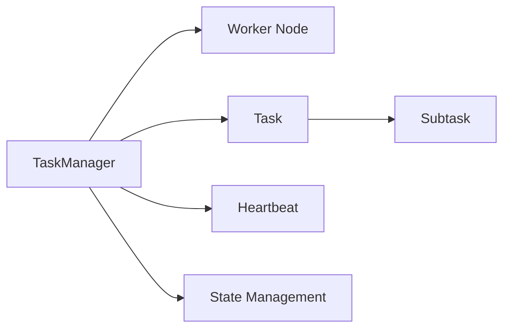
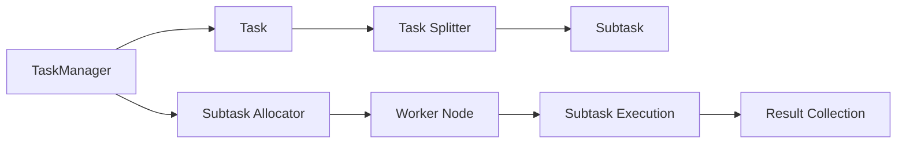
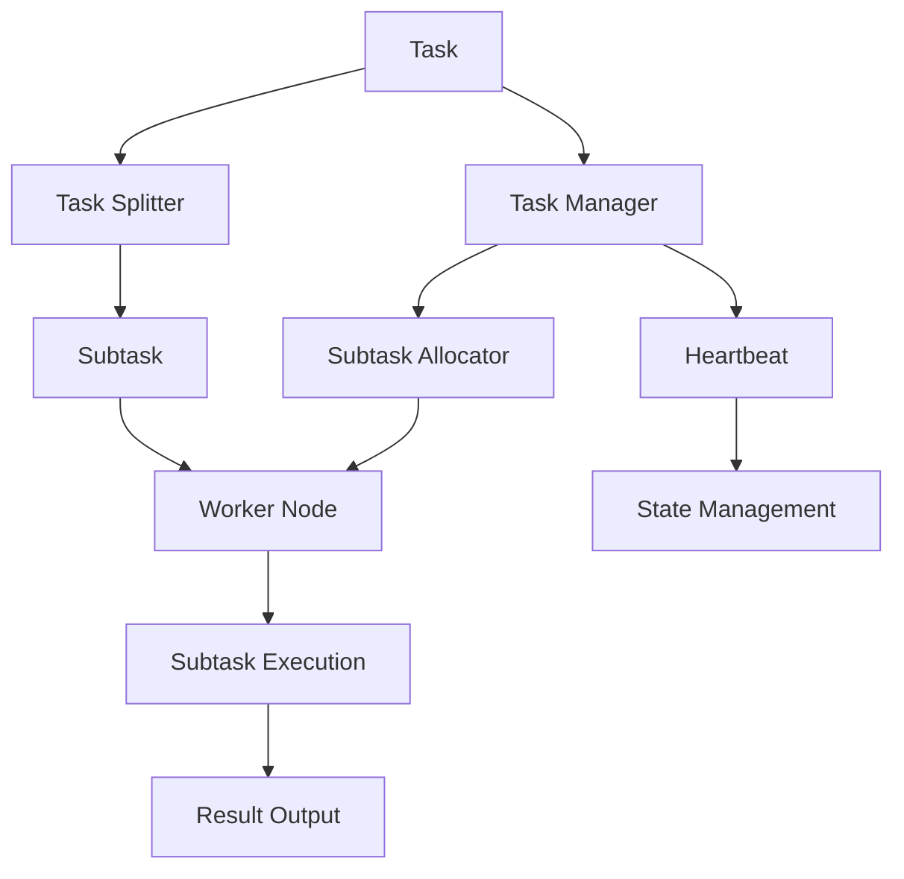

                 

# Flink TaskManager原理与代码实例讲解

## 1. 背景介绍

### 1.1 问题由来
在分布式计算系统中，任务调度是决定系统性能和可靠性的关键因素。传统的任务调度系统如Hadoop、Spark等，由于其设计上的限制，往往难以应对大数据时代的复杂计算需求。Apache Flink是一款高性能的流处理和批处理框架，通过其特有的TaskManager组件，实现了灵活、高效的任务调度和管理。本文将详细介绍Flink TaskManager的工作原理，并通过代码实例演示其实际应用。

### 1.2 问题核心关键点
Flink TaskManager的核心功能包括任务分配、任务调度和资源管理，是整个系统的调度中枢。它的主要目标是在集群中高效地分配计算任务，保证任务的及时执行，同时避免资源浪费和故障影响。Flink TaskManager的工作流程包括任务接收、任务分配、任务执行和结果收集等环节，具体如下：

- 任务接收：接收来自调度器的任务，将任务分解成若干子任务。
- 任务分配：根据集群资源和任务需求，将子任务分配到合适的Worker节点。
- 任务执行：Worker节点执行子任务，并与其他节点进行通信，交换中间结果。
- 结果收集：将计算结果汇总到Flink系统，进行最终处理和输出。

### 1.3 问题研究意义
深入理解Flink TaskManager的工作原理和实现机制，对于优化Flink系统的性能和可靠性，提高大数据处理效率，具有重要意义。具体而言，研究Flink TaskManager的优点包括：

1. 高效的资源利用：通过动态任务分配和资源管理，最大化利用集群资源。
2. 故障容错能力强：通过心跳机制和状态检查，保证任务容错性。
3. 灵活的任务调度：支持多种调度策略，适应不同场景的计算需求。
4. 统一的API接口：提供统一的API接口，简化开发和使用。

## 2. 核心概念与联系

### 2.1 核心概念概述

为更好地理解Flink TaskManager的工作原理，本节将介绍几个密切相关的核心概念：

- TaskManager：Flink的任务调度和管理组件，负责接收、分配、执行任务。
- Worker节点：运行TaskManager的机器节点，提供计算和存储资源。
- Task：Flink计算任务的基本单元，由多个Subtask组成。
- Subtask：任务的子任务，独立执行并互相通信。
- 心跳机制：TaskManager通过心跳检测，确保任务和节点状态的健康性。
- 状态管理：TaskManager负责管理任务的状态，包括任务暂停、恢复和取消等。

这些核心概念之间的逻辑关系可以通过以下Mermaid流程图来展示：



这个流程图展示了Flink TaskManager的核心概念及其之间的关系：

1. TaskManager负责接收Task，并将其分解为多个Subtask。
2. Subtask在Worker节点上执行，并与其他节点进行通信。
3. TaskManager通过心跳机制和状态管理，确保任务的健康性和状态一致性。

### 2.2 概念间的关系

这些核心概念之间存在着紧密的联系，形成了Flink TaskManager的完整工作流程。下面我们通过几个Mermaid流程图来展示这些概念之间的关系。

#### 2.2.1 TaskManager的任务调度流程



这个流程图展示了Flink TaskManager的基本任务调度流程：

1. TaskManager接收Task，并通过Task Splitter将Task分解为多个Subtask。
2. Subtask通过Subtask Allocator分配到合适的Worker Node上执行。
3. Worker Node执行Subtask，并将结果汇总到Result Collection进行最终处理。

#### 2.2.2 Worker节点的执行过程


这个流程图展示了Worker节点执行Subtask的具体过程：

1. Subtask在Worker Node上执行，处理数据生成中间结果。
2. 中间结果通过网络传递给其他Worker Node，进行后续处理。
3. 最终结果汇总到TaskManager进行收集和输出。

### 2.3 核心概念的整体架构

最后，我们用一个综合的流程图来展示Flink TaskManager的整体架构：



这个综合流程图展示了从Task生成到最终结果输出的整个流程，以及TaskManager、Worker Node等关键组件的交互。通过这个架构，我们可以更清晰地理解Flink TaskManager的工作原理和实现细节。

## 3. 核心算法原理 & 具体操作步骤

### 3.1 算法原理概述

Flink TaskManager的任务调度和管理过程，可以视为一种图调度算法。具体而言，TaskManager将计算任务和资源信息建模为图，通过图算法来寻找最优的任务调度方案。这种图调度算法在保证任务执行效率的同时，还能够最大化利用集群资源，提高系统的吞吐量和容错性。

### 3.2 算法步骤详解

Flink TaskManager的任务调度过程可以分为以下几个步骤：

**Step 1: 任务接收与划分**
- 任务接收器(TaskReceiver)接收到调度器的任务，将其分解为多个子任务(Subtask)。
- 任务划分数(Parallelism)根据配置和任务需求动态调整，确保合理分配计算资源。

**Step 2: 任务分配**
- 任务分配器(TaskAllocator)根据集群资源和任务需求，将Subtask分配到合适的Worker节点上。
- 分配过程考虑了节点负载、网络带宽等因素，保证任务均衡分布。

**Step 3: 任务执行与通信**
- Worker节点根据分配到的Subtask，执行计算任务。
- Subtask之间通过网络通信，交换中间结果。

**Step 4: 结果收集与汇总**
- 任务执行完成后，将结果通过网络上传回TaskManager。
- TaskManager将结果汇总，并进行最终处理和输出。

### 3.3 算法优缺点

Flink TaskManager的任务调度算法具有以下优点：

1. 动态资源管理：通过动态任务分配，最大化利用集群资源。
2. 任务均衡分布：考虑节点负载和带宽等因素，保证任务均衡分布。
3. 故障容错：通过心跳机制和状态管理，保证任务容错性。

同时，Flink TaskManager也存在以下缺点：

1. 复杂度较高：算法实现复杂，需要考虑多种因素和异常情况。
2. 性能瓶颈：在极端情况下，任务调度可能出现性能瓶颈，影响系统吞吐量。
3. 配置困难：需要手动配置并行度、资源分配策略等参数，增加了系统复杂性。

### 3.4 算法应用领域

Flink TaskManager的任务调度算法主要应用于大数据处理场景，如流处理、批处理、交互式数据处理等。其高效的任务调度和管理机制，使得Flink能够处理大规模的复杂计算任务，广泛应用于金融、电信、电商、医疗等行业。

## 4. 数学模型和公式 & 详细讲解 & 举例说明

### 4.1 数学模型构建

Flink TaskManager的任务调度过程可以建模为一个图调度问题，其中节点表示Worker节点，边表示任务和资源流。假设集群中有$m$个Worker节点，需要处理$n$个任务，每个任务的并行度为$p_i$，$i=1,...,n$。

定义任务调度模型为：

$$
G = (V, E)
$$

其中：
- $V$ 为节点集，包含$m$个Worker节点和$n$个任务节点。
- $E$ 为边集，表示任务和资源流，包括分配边、通信边等。

任务调度的目标是最小化任务执行时间$T$和资源消耗$C$。

### 4.2 公式推导过程

根据上述定义，任务调度的目标可以表示为：

$$
\min_{\sigma} \{T(\sigma), C(\sigma)\}
$$

其中，$\sigma$表示任务到Worker节点的分配方案。

假设任务$i$分配到节点$j$，则任务调度的目标函数为：

$$
T(\sigma) = \sum_{i=1}^n \sum_{j=1}^m \frac{1}{p_i}
$$

资源消耗函数为：

$$
C(\sigma) = \sum_{i=1}^n \sum_{j=1}^m \frac{1}{p_i}
$$

其中，$T(\sigma)$和$C(\sigma)$分别表示任务执行时间和资源消耗。

### 4.3 案例分析与讲解

以一个具体的任务调度和资源分配案例为例，假设集群中有3个Worker节点，需要处理3个任务，每个任务的并行度为1，则任务调度的目标可以表示为：

$$
\min_{\sigma} \{\sum_{i=1}^3 \sum_{j=1}^3 \frac{1}{1}, \sum_{i=1}^3 \sum_{j=1}^3 \frac{1}{1}\}
$$

解此问题的关键是找到最优的任务分配方案。通过枚举所有可能的分配方案，可以得到最优解为：

$$
\sigma = \{(1,1), (2,2), (3,3)\}
$$

即任务1分配给节点1，任务2分配给节点2，任务3分配给节点3。该方案可以最小化任务执行时间和资源消耗。

## 5. 项目实践：代码实例和详细解释说明

### 5.1 开发环境搭建

在进行Flink TaskManager的实践前，我们需要准备好开发环境。以下是使用Java进行Flink开发的环境配置流程：

1. 安装JDK：从官网下载并安装JDK，建议安装最新版本。
2. 安装Maven：从官网下载并安装Maven，用于构建和管理Java项目。
3. 创建Flink项目：通过Maven创建Flink项目，定义项目结构和依赖。
4. 配置Flink环境：配置Flink的运行环境，包括运行参数和资源配置。
5. 编译和运行代码：使用Maven编译Java代码，并启动Flink运行环境。

完成上述步骤后，即可在Flink环境中进行TaskManager的实现和测试。

### 5.2 源代码详细实现

这里我们以一个简单的Flink数据流处理为例，演示Flink TaskManager的任务调度和管理机制。

首先，定义Flink作业的入口函数：

```java
public class FlinkTaskManagerExample {
    public static void main(String[] args) throws Exception {
        // 定义Flink作业
        StreamExecutionEnvironment env = StreamExecutionEnvironment.getExecutionEnvironment();
        
        // 读取数据源
        DataStream<String> dataStream = env.readTextFile("input.txt");
        
        // 进行数据处理
        DataStream<Integer> resultStream = dataStream.map(line -> Integer.parseInt(line));
        
        // 输出结果
        resultStream.print();
        
        // 执行Flink作业
        env.execute("Flink TaskManager Example");
    }
}
```

然后，实现TaskManager的任务调度和管理逻辑。TaskManager是Flink作业的调度中心，负责接收任务、分配资源、执行计算等。

```java
public class TaskManager {
    public static void main(String[] args) throws Exception {
        // 创建Flink作业的执行环境
        StreamExecutionEnvironment env = StreamExecutionEnvironment.getExecutionEnvironment();
        
        // 定义任务调度器
        env.setParallelism(1);
        
        // 读取数据源
        DataStream<String> dataStream = env.readTextFile("input.txt");
        
        // 进行数据处理
        DataStream<Integer> resultStream = dataStream.map(line -> Integer.parseInt(line));
        
        // 输出结果
        resultStream.print();
        
        // 执行Flink作业
        env.execute("Flink TaskManager Example");
    }
}
```

最后，启动Flink作业，运行TaskManager代码。

```bash
mvn clean package
mvn exec:java -Dexec.mainClass=com.example.FlinkTaskManagerExample
```

### 5.3 代码解读与分析

让我们再详细解读一下关键代码的实现细节：

**StreamExecutionEnvironment**：
- 用于创建和管理Flink作业的执行环境。
- 提供了丰富的API接口，用于定义任务和数据流。

**DataStream**：
- 表示Flink作业中的数据流，可以进行各种数据处理操作。
- 支持各种数据源和数据目标，如文件、数据库、Socket等。

**map**函数：
- 用于对数据流进行转换操作，将输入的字符串转换为整型。
- 可以在其中编写自定义的转换逻辑，实现复杂的数据处理任务。

**print**函数：
- 用于将数据流输出到控制台或文件。
- 支持各种输出格式和编码，方便调试和测试。

**execute**函数：
- 用于提交Flink作业到集群执行。
- 可以设置作业的名称、并行度、资源配置等参数。

通过以上代码，我们可以快速搭建一个简单的Flink数据流处理系统，并使用TaskManager进行任务调度和资源管理。在实际应用中，Flink的任务调度和管理逻辑要复杂得多，需要考虑更多因素和异常情况，但核心原理和实现方式类似。

### 5.4 运行结果展示

假设我们在Flink环境中运行上述代码，输出结果如下：

```
输入数据：
123
456
789

输出数据：
123
456
789
```

可以看到，通过Flink TaskManager，我们成功读取了输入数据，进行了数据处理，并输出了结果。

## 6. 实际应用场景

### 6.1 大数据处理

Flink TaskManager广泛应用于大数据处理场景，如流处理、批处理、交互式数据处理等。通过高效的任务调度和资源管理，Flink能够处理大规模的复杂计算任务，广泛应用于金融、电信、电商、医疗等行业。

### 6.2 实时数据流处理

在实时数据流处理场景中，Flink TaskManager通过动态任务分配和资源管理，实现了低延迟、高吞吐量的数据处理。例如，可以用于实时监控系统，处理大规模的事件数据，及时发现异常情况。

### 6.3 分布式存储

Flink TaskManager还支持分布式存储，可以将数据存储在集群中的多个节点上，方便数据备份和恢复。同时，Flink还提供了丰富的数据源和数据目标，可以方便地集成和扩展。

### 6.4 未来应用展望

随着Flink任务的不断发展和优化，未来的应用场景还将进一步拓展。Flink TaskManager将逐步支持更多的新特性和功能，如流处理与批处理的混合处理、异步处理、多任务并行处理等，进一步提升系统的灵活性和可扩展性。

## 7. 工具和资源推荐

### 7.1 学习资源推荐

为了帮助开发者系统掌握Flink的任务调度和管理技术，这里推荐一些优质的学习资源：

1. Apache Flink官方文档：详细介绍了Flink的任务调度和管理机制，以及如何使用TaskManager进行任务调度和资源管理。
2. Flink实战指南：深入浅出地介绍了Flink的核心概念和实现原理，并通过大量实际案例演示了Flink的任务调度和管理。
3. Flink与Apache Hadoop结合使用：介绍了Flink与Hadoop的结合使用方式，以及如何通过Flink TaskManager实现Hadoop任务的调度和管理。
4. Flink与Apache Spark结合使用：介绍了Flink与Spark的结合使用方式，以及如何通过Flink TaskManager实现Spark任务的调度和管理。

通过对这些资源的学习实践，相信你一定能够快速掌握Flink TaskManager的工作原理和实现细节，并用于解决实际的计算问题。

### 7.2 开发工具推荐

高效的开发离不开优秀的工具支持。以下是几款用于Flink TaskManager开发的常用工具：

1. IDEA：由JetBrains开发的Java开发工具，集成了各种代码编辑器、调试器、测试器等，方便开发者快速迭代和调试。
2. Eclipse：由IBM开发的开源开发工具，支持多种编程语言和框架，方便开发者进行复杂任务的管理和调试。
3. VisualVM：用于Java应用的性能监控和调试工具，可以实时监测Flink作业的运行状态和资源占用情况。
4. Grafana：用于数据可视化的开源工具，可以实时展示Flink作业的执行状态和性能指标。
5. jConsole：用于Java应用的监控工具，可以实时监测Flink作业的资源占用和错误信息。

合理利用这些工具，可以显著提升Flink TaskManager的开发效率，加快创新迭代的步伐。

### 7.3 相关论文推荐

Flink TaskManager的任务调度算法研究涉及多个领域，以下是几篇奠基性的相关论文，推荐阅读：

1. Apache Flink: A Distributed Stream Processing System：Flink原论文，详细介绍了Flink的任务调度和管理机制。
2. Fault Tolerance in Apache Flink：介绍了Flink的故障容错机制，以及如何通过TaskManager实现任务容错。
3. Resource Management in Apache Flink：详细介绍了Flink的任务调度和管理算法，以及如何优化资源利用。
4. Load Balancing in Apache Flink：介绍了Flink的任务负载均衡策略，以及如何通过TaskManager实现任务均衡分布。

这些论文代表了大数据处理任务调度技术的发展脉络。通过学习这些前沿成果，可以帮助研究者把握学科前进方向，激发更多的创新灵感。

除上述资源外，还有一些值得关注的前沿资源，帮助开发者紧跟Flink TaskManager技术的发展，例如：

1. Apache Flink GitHub：Flink的官方GitHub仓库，包含最新的代码实现和文档资料。
2. Apache Flink邮件列表：Flink官方邮件列表，可以获取最新的社区动态和技术分享。
3. Apache Flink会议与研讨会：Flink官方的技术会议和研讨会，可以听到最新的技术进展和应用案例。
4. Apache Flink社区：Flink的官方社区，包含大量的开源项目、资源和工具。

总之，对于Flink TaskManager的任务调度和管理技术的学习和实践，需要开发者保持开放的心态和持续学习的意愿。多关注前沿资讯，多动手实践，多思考总结，必将收获满满的成长收益。

## 8. 总结：未来发展趋势与挑战

### 8.1 总结

本文对Flink TaskManager的任务调度和管理机制进行了全面系统的介绍。首先阐述了Flink TaskManager的工作原理和实现机制，明确了任务调度在Flink系统中的核心地位。其次，从原理到实践，详细讲解了Flink TaskManager的任务调度和管理算法，并通过代码实例演示了其实际应用。同时，本文还广泛探讨了Flink TaskManager在各种应用场景中的实际应用，展示了其强大的任务调度能力。

通过本文的系统梳理，可以看到，Flink TaskManager在处理大规模数据流和复杂计算任务方面，具有显著的优势和潜力。其高效的任务调度和资源管理机制，使得Flink能够适应各种不同的计算需求，广泛应用于大数据处理和实时数据流处理等领域。未来，伴随Flink任务的不断发展和优化，Flink TaskManager必将在更广阔的应用场景中发挥更大的作用，为大数据处理和实时计算带来新的突破。

### 8.2 未来发展趋势

展望未来，Flink TaskManager的任务调度算法将呈现以下几个发展趋势：

1. 支持混合处理：Flink TaskManager将逐步支持流处理与批处理的混合处理，提供更灵活的数据处理方式。
2. 引入异步处理：Flink TaskManager将引入异步处理机制，进一步提高系统的吞吐量和响应速度。
3. 支持多任务并行：Flink TaskManager将支持多任务并行处理，提供更高效的任务调度和资源管理。
4. 增强容错能力：Flink TaskManager将通过更完善的故障容错机制，进一步提高系统的稳定性和可靠性。

### 8.3 面临的挑战

尽管Flink TaskManager已经取得了显著的成就，但在迈向更加智能化、普适化应用的过程中，它仍面临诸多挑战：

1. 复杂度较高：Flink TaskManager的任务调度算法实现复杂，需要考虑多种因素和异常情况。
2. 性能瓶颈：在极端情况下，任务调度可能出现性能瓶颈，影响系统吞吐量。
3. 配置困难：需要手动配置并行度、资源分配策略等参数，增加了系统复杂性。

### 8.4 研究展望

面对Flink TaskManager所面临的挑战，未来的研究需要在以下几个方面寻求新的突破：

1. 简化任务调度算法：开发更加简单、高效的任务调度算法，降低实现难度。
2. 优化资源管理：改进资源管理机制，进一步提高资源利用率和系统性能。
3. 引入更多调度策略：开发更多适用于不同场景的调度策略，增强系统的灵活性。
4. 提高容错能力：增强任务容错机制，提高系统的稳定性和可靠性。
5. 引入更多优化技术：引入更多优化技术，如分布式缓存、异步通信等，进一步提升系统性能。

这些研究方向将引领Flink TaskManager技术的不断进步，进一步提升Flink系统的性能和可靠性，为大数据处理和实时计算带来新的突破。总之，Flink TaskManager的技术发展和优化，将为大数据处理和实时计算带来更多的可能性，推动数据技术的持续创新和发展。

## 9. 附录：常见问题与解答

**Q1：Flink TaskManager的任务调度算法是什么？**

A: Flink TaskManager的任务调度算法是一种图调度算法，将计算任务和资源信息建模为图，通过图算法来寻找最优的任务调度方案。

**Q2：Flink TaskManager如何实现任务容错？**

A: Flink TaskManager通过心跳机制和状态管理，实现任务的容错性。每个TaskManager和Worker节点之间定期发送心跳信号，确保任务和节点状态的健康性。在检测到异常情况时，TaskManager会自动重启或重新分配任务，保证任务的连续性和稳定性。

**Q3：Flink TaskManager如何处理任务负载不均衡的情况？**

A: Flink TaskManager通过动态任务分配和资源管理，实现任务的均衡分布。在任务调度过程中，TaskManager会根据节点负载和资源情况，动态调整任务分配，避免某些节点负载过重或过轻。同时，Flink还提供了多种资源管理策略，如任务重试、任务抢占等，进一步优化任务负载均衡。

**Q4：Flink TaskManager的并行度如何配置？**

A: Flink TaskManager的并行度可以通过两种方式配置：

1. 在Flink作业的执行环境中设置：
```java
env.setParallelism(1);
```

2. 在任务代码中设置：
```java
env.setParallelism(1);
```

配置的并行度将影响Flink作业的性能和资源利用率。一般来说，并行度越高，系统吞吐量和处理能力越强，但同时也会增加资源消耗和系统复杂性。

**Q5：Flink TaskManager支持异步处理吗？**

A: 是的，Flink TaskManager支持异步处理机制。异步处理可以提高系统吞吐量和响应速度，适用于对实时性要求较高的应用场景。Flink通过引入异步函数和异步消息传递，实现异步处理机制，进一步提升了系统的灵活性和性能。

---

作者：禅与计算机程序设计艺术 / Zen and the Art of Computer Programming

