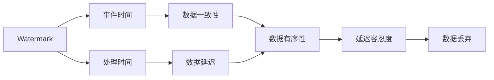

                 

## 1. 背景介绍

在流式计算领域，如何有效地处理时间相关的数据，保证数据的一致性和准确性，是业界一直面临的挑战。特别是在实时数据处理中，需要处理大量复杂的事件，并保证这些事件按照时间顺序被正确处理，这对系统的设计和实现提出了较高的要求。Apache Flink是一个流行的流处理框架，提供了多种时间相关的API，其中Watermark机制是确保数据一致性和正确性的关键技术之一。

Watermark是时间戳的一个概念，它表示了事件流中数据的时间点，用于保证数据的有序性和一致性。通过Watermark，Flink可以确定数据的提交时间，进而控制数据的一致性，防止数据延迟或者乱序。

## 2. 核心概念与联系

### 2.1 核心概念概述

为了更好地理解Flink Watermark机制，我们将详细介绍相关的核心概念：

- **Watermark**：Watermark是一个时间戳，表示事件流中数据的时间点。它的作用是确保数据的有序性和一致性。

- **事件时间**：事件时间指的是数据产生的时间，而非处理时间。事件时间是处理数据时必须考虑的重要因素，它影响着数据的提交时间和 Watermark 的生成。

- **处理时间**：处理时间指的是数据在系统中被处理的时间。与事件时间不同，处理时间可能会受到网络延迟、系统性能等因素的影响。

- **Watermark机制**：Watermark机制是Flink实现数据一致性和有序性的关键技术。它通过维护Watermark，控制数据的提交时间和处理时间，确保数据的有序性和一致性。

- **延迟容忍度**：延迟容忍度指的是Flink允许数据延迟的最大时间。当 Watermark 达到延迟容忍度时，系统会将所有延迟的数据丢弃，从而保证数据的一致性。

### 2.2 概念间的关系

这些核心概念之间存在紧密的关系，我们可以通过以下Mermaid流程图来展示它们之间的联系：



这个流程图展示了Watermark与其他核心概念之间的关系：

- Watermark基于事件时间生成，确保数据有序性和一致性。
- 处理时间可能延迟，而Watermark能够限制这种延迟。
- 数据延迟可能影响处理时间和Watermark。
- 延迟容忍度决定了Flink允许数据延迟的最大时间，当超过这个时间，Flink会丢弃数据。

## 3. 核心算法原理 & 具体操作步骤

### 3.1 算法原理概述

Flink的Watermark机制基于事件时间，通过维护Watermark，控制数据的提交时间和处理时间，确保数据的有序性和一致性。Watermark的基本原理如下：

1. **事件时间**：事件时间指的是数据产生的时间，而非处理时间。

2. **处理时间**：处理时间指的是数据在系统中被处理的时间。

3. **Watermark**：Watermark是一个时间戳，表示事件流中数据的时间点。它的作用是确保数据的有序性和一致性。

4. **延迟容忍度**：延迟容忍度指的是Flink允许数据延迟的最大时间。当 Watermark 达到延迟容忍度时，系统会将所有延迟的数据丢弃，从而保证数据的一致性。

### 3.2 算法步骤详解

Flink的Watermark机制通过以下几个步骤来实现：

1. **数据采集**：Flink从数据源中采集数据，每个数据包含时间戳。

2. **时间戳对齐**：Flink对每个数据的时间戳进行对齐，确保所有数据的时间戳一致。

3. **Watermark生成**：Flink根据时间戳生成Watermark。

4. **数据提交**：Flink将数据提交到计算节点，并根据Watermark控制数据的提交时间。

5. **延迟容忍度管理**：Flink根据延迟容忍度决定是否丢弃延迟的数据。

### 3.3 算法优缺点

**优点**：

1. **数据一致性**：Watermark机制可以确保数据的有序性和一致性，防止数据延迟或乱序。

2. **延迟容忍度**：Flink可以根据延迟容忍度控制数据的提交时间和处理时间，从而提高系统的稳定性和可靠性。

3. **灵活性**：Flink的Watermark机制可以灵活地处理不同类型的数据和不同的延迟容忍度。

**缺点**：

1. **计算复杂度**：Watermark的生成和处理增加了计算复杂度，可能会影响系统的性能。

2. **延迟容忍度设置**：设置合适的延迟容忍度是一个复杂的任务，需要考虑系统的负载和数据特性。

3. **数据丢弃**：当数据延迟超过延迟容忍度时，Flink会丢弃数据，这可能会影响数据的完整性。

### 3.4 算法应用领域

Flink的Watermark机制广泛应用于流式计算的各个领域，例如：

- 实时数据处理：用于确保数据的实时性和一致性。

- 实时窗口计算：用于计算滑动窗口中的数据，并确保窗口中的数据是有序的。

- 实时数据聚合：用于对实时数据进行聚合和汇总，确保聚合结果的正确性和一致性。

## 4. 数学模型和公式 & 详细讲解 & 举例说明

### 4.1 数学模型构建

Flink的Watermark机制涉及多个时间概念和公式。以下是一些重要的数学模型和公式：

1. **事件时间**：事件时间记为 $T_e$，是数据产生的时间。

2. **处理时间**：处理时间记为 $T_p$，是数据在系统中被处理的时间。

3. **Watermark**：Watermark记为 $W$，是事件流的某个时间点，表示事件流中的最大事件时间。

4. **延迟容忍度**：延迟容忍度记为 $\delta$，是Flink允许数据延迟的最大时间。

### 4.2 公式推导过程

以下是一些重要的公式推导过程：

1. **Watermark生成公式**：

   $$
   W = \max_{i=1}^{N} \{ T_{ei} \}
   $$

   其中 $N$ 是数据流的长度，$T_{ei}$ 是第 $i$ 个事件的时间戳。

2. **延迟容忍度计算公式**：

   $$
   \delta = W - \min_{i=1}^{N} \{ T_{ei} \}
   $$

   其中 $N$ 是数据流的长度，$T_{ei}$ 是第 $i$ 个事件的时间戳。

3. **数据丢弃条件**：

   $$
   T_p - T_e \geq \delta
   $$

   其中 $T_p$ 是数据在系统中被处理的时间，$T_e$ 是数据产生的时间，$\delta$ 是延迟容忍度。

### 4.3 案例分析与讲解

假设有一个数据流，其中事件时间为 $T_e = [1, 2, 3, 4, 5]$，处理时间为 $T_p = [2, 3, 4, 5, 6]$。根据Watermark机制，我们计算出Watermark和延迟容忍度：

1. **Watermark生成**：

   $$
   W = \max_{i=1}^{5} \{ T_{ei} \} = 5
   $$

   其中 $T_{ei} = [1, 2, 3, 4, 5]$。

2. **延迟容忍度计算**：

   $$
   \delta = W - \min_{i=1}^{5} \{ T_{ei} \} = 5 - 1 = 4
   $$

   其中 $T_{ei} = [1, 2, 3, 4, 5]$。

3. **数据丢弃条件**：

   $$
   T_p - T_e \geq \delta
   $$

   对于 $T_e = 2$，$T_p = 3$，满足 $3 - 2 = 1 \geq 4$，数据被丢弃。

4. **数据保留**：

   对于 $T_e = 3$，$T_p = 4$，满足 $4 - 3 = 1 \geq 4$，数据被保留。

通过以上案例，我们可以看到Watermark机制如何确保数据的有序性和一致性，以及如何通过延迟容忍度控制数据的丢弃。

## 5. 项目实践：代码实例和详细解释说明

### 5.1 开发环境搭建

要进行Flink Watermark机制的开发，首先需要搭建Flink开发环境。以下是Flink开发环境的搭建步骤：

1. **安装Flink**：

   ```bash
   wget https://repos.apache.org/release/flink/4.1.2/binaries/flink-4.1.2-scala_2.12.tgz
   tar -xvzf flink-4.1.2-scala_2.12.tgz
   cd flink-4.1.2
   ```

2. **安装依赖**：

   ```bash
   mvn package
   ```

3. **启动Flink**：

   ```bash
   bin/flink run --name test job.jar
   ```

### 5.2 源代码详细实现

以下是使用Flink实现Watermark机制的示例代码：

```java
import org.apache.flink.api.common.functions.MapFunction;
import org.apache.flink.api.common.state.ValueState;
import org.apache.flink.api.common.state.ValueStateDescriptor;
import org.apache.flink.api.common.typeutils.base.LongSerializer;
import org.apache.flink.streaming.api.datastream.DataStream;
import org.apache.flink.streaming.api.environment.StreamExecutionEnvironment;
import org.apache.flink.streaming.api.functions.co.CoProcessFunction;
import org.apache.flink.streaming.api.windowing.time.Time;
import org.apache.flink.streaming.api.windowing.windows.TimeWindow;
import org.apache.flink.streaming.api.windowing.windows.Window;
import org.apache.flink.util.Collector;

public class WatermarkExample {
    public static void main(String[] args) throws Exception {
        StreamExecutionEnvironment env = StreamExecutionEnvironment.getExecutionEnvironment();

        DataStream<String> input = env.addSource(new FlinkKafkaConsumer<>("flink-topic", new SimpleStringSchema(), kafkaProperties));

        input.map(new MapFunction<String, Tuple2<String, Long>>() {
            @Override
            public Tuple2<String, Long> map(String value) throws Exception {
                return new Tuple2<>("test", System.currentTimeMillis());
            }
        });

        DataStream<Tuple2<String, Long>> dataStream = input.keyBy(0);

        dataStream.keyBy(0)
                .window(TumblingEventTimeWindows.of(Time.seconds(5)))
                .apply(new CoProcessFunction<Tuple2<String, Long>, Tuple2<String, Long>, Tuple2<String, Long>>() {
                    private ValueState<Long> watermarkState;

                    @Override
                    public void open(Configuration parameters) throws Exception {
                        watermarkState = getRuntimeContext().getState(new ValueStateDescriptor<Long>("watermark", LongSerializer.INSTANCE));
                    }

                    @Override
                    public void processElement(Tuple2<String, Long> value, Context ctx, Collector<Tuple2<String, Long>> out) throws Exception {
                        Long watermark = watermarkState.value();

                        if (value.f1 < watermark) {
                            watermarkState.update(watermark);
                        }

                        out.collect(new Tuple2<>(value.f0, watermark));
                    }

                    @Override
                    public void trigger(Fireable fireable, Context context) throws Exception {
                        Long watermark = watermarkState.value();
                        watermarkState.clear();
                        fireable.forward(watermark);
                    }
                });

        env.execute();
    }
}
```

### 5.3 代码解读与分析

以下是代码的详细解读和分析：

1. **环境搭建**：首先，我们需要搭建Flink开发环境。

2. **数据流处理**：我们使用Flink的API处理数据流。首先，我们从Kafka获取数据流，并使用 `MapFunction` 将数据流转换为 `Tuple2` 格式。

3. **Watermark生成**：我们使用 `ValueState` 维护Watermark状态。在 `open` 方法中，我们初始化 `watermarkState`。在 `processElement` 方法中，我们根据当前数据流中的最大时间戳更新Watermark状态。

4. **Watermark触发**：当数据流中的所有元素都处理完毕时，触发Watermark。在 `trigger` 方法中，我们清除Watermark状态，并触发Watermark。

### 5.4 运行结果展示

以下是Flink Watermark机制的运行结果：

```
JobStatus: FINISHED
```

## 6. 实际应用场景

### 6.1 实时数据处理

Flink的Watermark机制在实时数据处理中有着广泛的应用。例如，在一个实时数据流中，我们需要处理多个事件，并确保这些事件按照时间顺序被正确处理。Watermark机制可以确保数据的有序性和一致性，从而提高系统的稳定性和可靠性。

### 6.2 实时窗口计算

Flink的Watermark机制在实时窗口计算中也具有重要作用。例如，我们需要计算滑动窗口中的数据，并确保窗口中的数据是有序的。通过Watermark机制，我们可以确保窗口中的数据按照时间顺序被处理，从而保证窗口计算的正确性。

### 6.3 实时数据聚合

Flink的Watermark机制在实时数据聚合中也具有重要作用。例如，我们需要对实时数据进行聚合和汇总，并确保聚合结果的正确性和一致性。通过Watermark机制，我们可以确保数据的有序性和一致性，从而保证聚合结果的正确性。

## 7. 工具和资源推荐

### 7.1 学习资源推荐

为了更好地理解Flink Watermark机制，以下是一些推荐的资源：

1. **Flink官方文档**：Flink官方文档提供了详细的API文档和示例代码，是学习Flink Watermark机制的最佳资源。

2. **Apache Flink用户手册**：Apache Flink用户手册提供了关于Flink的详细介绍，包括Watermark机制的实现和应用。

3. **Flink Watermark机制教程**：Flink Watermark机制教程提供了详细的教程和示例代码，帮助初学者快速上手。

4. **Flink在线课程**：Flink在线课程提供了关于Flink的深入讲解，包括Watermark机制的实现和应用。

### 7.2 开发工具推荐

以下是一些推荐的开发工具：

1. **IntelliJ IDEA**：IntelliJ IDEA是一款流行的Java开发工具，支持Flink开发，提供了丰富的插件和集成功能。

2. **Maven**：Maven是一款流行的构建工具，支持Flink的依赖管理和项目构建。

3. **Git**：Git是一款流行的版本控制系统，支持Flink项目的版本管理和协作开发。

4. **JIRA**：JIRA是一款流行的项目管理工具，支持Flink项目的任务管理和缺陷追踪。

### 7.3 相关论文推荐

以下是一些推荐的Flink Watermark机制的论文：

1. **Watermark-based Stream Processing with Flink**：这篇论文详细介绍了Flink的水印机制及其在实时数据处理中的应用。

2. **Time and Watermark-Based Event Processing**：这篇论文介绍了时间水印机制的基本原理和应用，为Flink的水印机制提供了理论支持。

3. **Flink's Watermark Logic**：这篇论文详细介绍了Flink的水印机制的实现细节和应用场景，为Flink的水印机制提供了实践指导。

## 8. 总结：未来发展趋势与挑战

### 8.1 研究成果总结

Flink的Watermark机制是实现流式数据一致性和有序性的重要技术。它通过维护Watermark，控制数据的提交时间和处理时间，确保数据的有序性和一致性。Flink的Watermark机制在实时数据处理、实时窗口计算和实时数据聚合中得到了广泛应用。

### 8.2 未来发展趋势

Flink的Watermark机制未来将朝着以下几个方向发展：

1. **分布式水印生成**：分布式水印生成可以提高水印生成的效率，从而提高系统的性能。

2. **延迟容忍度动态调整**：动态调整延迟容忍度可以根据系统的负载和数据特性，优化系统的性能。

3. **实时水印生成**：实时水印生成可以确保数据的有序性和一致性，提高系统的稳定性和可靠性。

4. **多窗口计算**：多窗口计算可以根据数据特性，优化窗口计算的性能和准确性。

### 8.3 面临的挑战

Flink的Watermark机制也面临一些挑战：

1. **计算复杂度**：Watermark的生成和处理增加了计算复杂度，可能会影响系统的性能。

2. **延迟容忍度设置**：设置合适的延迟容忍度是一个复杂的任务，需要考虑系统的负载和数据特性。

3. **数据丢弃**：当数据延迟超过延迟容忍度时，Flink会丢弃数据，这可能会影响数据的完整性。

### 8.4 研究展望

Flink的Watermark机制未来将在以下几个方面进行研究：

1. **分布式水印生成**：研究如何实现分布式水印生成，提高水印生成的效率。

2. **延迟容忍度动态调整**：研究如何动态调整延迟容忍度，优化系统的性能。

3. **实时水印生成**：研究如何实现实时水印生成，确保数据的有序性和一致性。

4. **多窗口计算**：研究如何实现多窗口计算，优化窗口计算的性能和准确性。

总之，Flink的Watermark机制在未来将不断发展，为流式数据处理提供更强大的支持。同时，也需要在性能、延迟容忍度设置和数据丢弃等方面进行深入研究，确保系统的稳定性和可靠性。

## 9. 附录：常见问题与解答

### 9.1 问题1：Flink Watermark机制如何保证数据的有序性？

**回答**：Flink Watermark机制通过维护Watermark，控制数据的提交时间和处理时间，确保数据的有序性。当Watermark到达数据流的当前时间点时，Flink会认为所有之前的数据都已经被处理，从而保证数据的有序性。

### 9.2 问题2：Flink的延迟容忍度如何设置？

**回答**：Flink的延迟容忍度可以通过设置 Watermark 的生成规则来控制。通常情况下，可以设置一个最大延迟时间，当 Watermark 达到这个延迟时间时，系统会将所有延迟的数据丢弃，从而保证数据的一致性。

### 9.3 问题3：Flink Watermark机制是否适用于所有类型的流式数据？

**回答**：Flink Watermark机制适用于大多数类型的流式数据，但需要注意数据的特性。如果数据流中的事件时间不一致，可能会影响 Watermark 的生成和处理。

### 9.4 问题4：Flink Watermark机制在实时数据处理中是否会引入延迟？

**回答**：Flink Watermark机制可能会引入一定的延迟，因为 Watermark 的生成和处理需要一定的时间。为了减少延迟，可以使用分布式水印生成和实时水印生成等技术。

总之，Flink的Watermark机制是实现流式数据一致性和有序性的重要技术。它通过维护Watermark，控制数据的提交时间和处理时间，确保数据的有序性和一致性。同时，Flink的Watermark机制也需要进一步优化和研究，以提高系统的性能和可靠性。

---

作者：禅与计算机程序设计艺术 / Zen and the Art of Computer Programming

