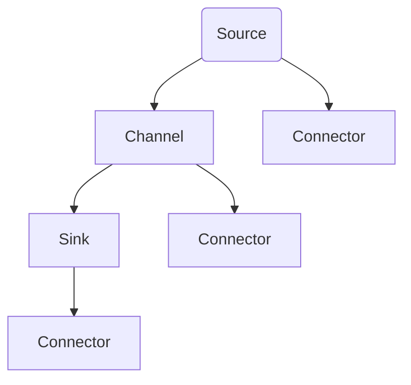
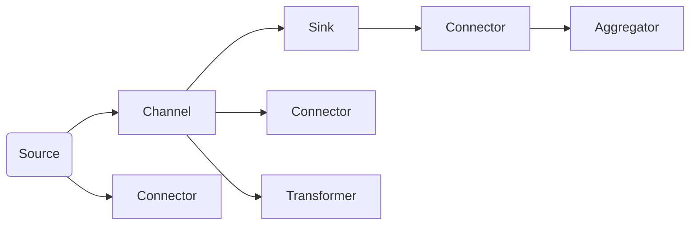

                 

# Flume原理与代码实例讲解

> 关键词：Apache Flume,事件驱动架构,实时数据处理,日志管理,大数据技术,流式数据流,开源软件

## 1. 背景介绍

### 1.1 问题由来
在当今数据驱动的时代，企业越来越依赖于大规模的数据收集和处理来支持其业务决策和运营。然而，数据量的不断增长和多样性使得传统的数据存储和处理系统难以应对。为了解决这一问题，Apache Flume应运而生，成为一种轻量级、可扩展的数据收集和处理系统，特别适合处理大规模、高并发的数据流。

### 1.2 问题核心关键点
Apache Flume主要解决大规模数据流收集和传输的问题，通过事件驱动架构，能够高效、可靠地处理各种类型的数据，包括日志文件、社交媒体消息、系统监控数据等。Flume的核心特点包括：

- **事件驱动**：Flume以事件为基本单位进行数据处理，每个事件由数据源生成，然后通过管道传输到收集器，最后存储或转发到目标系统。
- **高可靠性**：Flume采用了多级缓冲机制和数据冗余机制，确保数据在传输过程中不会丢失。
- **可扩展性**：Flume支持水平扩展，可以通过增加节点来提高系统的处理能力。
- **灵活性**：Flume支持多种数据源和目标，包括日志文件、Kafka、HDFS等。

### 1.3 问题研究意义
研究Apache Flume的原理与代码实现，对于理解事件驱动架构、掌握大规模数据处理技术、优化企业数据收集和处理系统具有重要意义：

1. **理解事件驱动架构**：Flume作为事件驱动架构的代表，可以帮助开发者更好地理解事件驱动架构的基本原理和设计思想。
2. **掌握大数据技术**：Flume涉及到大数据技术如分布式存储、流式数据流处理等，有助于开发者掌握大数据处理的核心技术。
3. **优化数据收集和处理系统**：通过学习Flume的设计和实现，可以借鉴其高可靠性和可扩展性，优化企业内部的数据收集和处理系统。
4. **推动企业数据化转型**：Flume能够高效处理和分析大量实时数据，帮助企业实现数据驱动的决策和运营。

## 2. 核心概念与联系

### 2.1 核心概念概述
为更好地理解Apache Flume的原理与实现，本节将介绍几个关键概念：

- **事件(Event)**：数据源生成的最基本的单位，包含数据的元信息和实际内容。
- **源(Source)**：产生事件的组件，可以是文件、网络、消息队列等。
- **通道(Channel)**：负责暂存和缓冲事件的组件，是数据传输的中间环节。
- **收集器(Sink)**：处理和存储事件的组件，可以是将数据写入文件、数据库、消息队列等。
- **通道连接器(Connector)**：用于连接源和通道、通道和收集器，负责数据传输。
- **流(Flow)**：由源、通道和收集器组成的整体数据流。

### 2.2 核心概念间的关系
这些核心概念之间的关系可以通过以下Mermaid流程图来展示：



这个流程图展示了Flume的基本数据流结构，每个源通过 Connector 连接通道，通道通过 Connector 连接收集器，数据在流中依次传递。

### 2.3 核心概念的整体架构
最后，我们用一个综合的流程图来展示这些核心概念在大数据处理系统中的整体架构：



这个综合流程图展示了Flume在处理大规模数据流时的整体架构，包括源、通道、收集器、 Connector、 Transformer 和 Aggregator 等组件。数据源通过 Connector 连接通道，通道通过 Transformer 和 Aggregator 进行数据转换和聚合，最后连接收集器进行存储或转发。

## 3. 核心算法原理 & 具体操作步骤
### 3.1 算法原理概述
Apache Flume的核心原理是基于事件驱动的数据流处理，其处理流程可以概括为：

1. **数据收集**：数据源通过 Connector 连接到通道，向通道发送事件。
2. **数据传输**：通道接收事件，根据配置进行缓冲和转发，确保数据可靠传输。
3. **数据处理**：数据通过 Transformer 和 Aggregator 进行转换和聚合，生成新的事件。
4. **数据存储**：新事件通过 Connector 连接收集器，写入目标系统（如HDFS、Kafka等）。

Flume的实现基于Java和Thrift协议，通过分布式部署和集群管理，支持水平扩展和高可用性。

### 3.2 算法步骤详解
Flume的部署和配置过程较为复杂，以下是详细的操作步骤：

#### 3.2.1 安装与配置
1. **安装Flume**：从Apache官网下载最新版本的Flume，解压并安装。
2. **配置Flume**：创建`flume.properties`配置文件，指定数据源、通道、收集器的具体配置，如日志文件路径、目标系统地址、缓冲区大小等。
3. **启动Flume**：启动Flume的主服务和数据节点（Source、Channel、Sink），确保各个组件正常工作。

#### 3.2.2 数据传输
1. **连接数据源**：通过 `sources.conf` 文件配置数据源，包括数据源类型、数据源地址、数据传输方式等。
2. **设置通道**：通过 `channels.conf` 文件配置通道，包括通道类型、缓冲区大小、数据传输方式等。
3. **配置收集器**：通过 `sinks.conf` 文件配置收集器，包括收集器类型、目标系统地址、数据写入方式等。

#### 3.2.3 数据处理
1. **添加Transformer**：通过 `transformers.conf` 文件配置Transformer，进行数据格式转换、数据过滤、数据采样等操作。
2. **添加Aggregator**：通过 `aggregators.conf` 文件配置Aggregator，进行数据聚合、数据分组等操作。

#### 3.2.4 数据存储
1. **连接目标系统**：通过 `target.conf` 文件配置目标系统，包括文件系统、消息队列、数据库等。
2. **指定数据格式**：通过 `file-configuration.conf` 文件配置数据格式，包括字段名称、数据类型、字段顺序等。

### 3.3 算法优缺点
Apache Flume具有以下优点：

- **高可靠性**：多级缓冲和数据冗余机制，确保数据在传输过程中不会丢失。
- **灵活性**：支持多种数据源和目标，可以灵活配置数据流。
- **可扩展性**：通过增加节点，水平扩展系统处理能力。

然而，Flume也存在一些缺点：

- **配置复杂**：配置文件和配置项较多，新手难以快速上手。
- **处理效率有限**：通道和缓冲区的限制，影响了处理大规模数据流的效率。
- **依赖于Zookeeper**：集群管理依赖于Zookeeper，增加了系统的复杂性。

### 3.4 算法应用领域
Apache Flume适用于各种需要处理大规模实时数据流的场景，包括：

- **日志收集与分析**：收集和分析日志文件，用于系统监控和故障诊断。
- **实时数据流处理**：处理来自Web应用、社交媒体、传感器等的数据流，用于实时数据分析和决策支持。
- **流式数据流处理**：处理流式数据流，用于数据管道和数据传输。
- **大数据存储**：将处理后的数据写入HDFS、Kafka等分布式存储系统，用于大数据分析。

## 4. 数学模型和公式 & 详细讲解 & 举例说明
### 4.1 数学模型构建
Apache Flume的数学模型主要围绕数据流进行建模，通过事件流的传输和处理，实现数据的高效处理。

### 4.2 公式推导过程
以最简单的Flume数据流为例，设事件流 $E=\{e_1, e_2, \ldots, e_N\}$，每个事件 $e_i=(d_i,s_i,t_i)$ 表示数据 $d_i$ 在时间戳 $t_i$ 到达源 $s_i$。设通道缓冲区容量为 $C$，缓冲区满时将数据丢弃，缓冲区空时无法处理新数据。设每个事件在通道中传输的概率为 $p$，在通道中停留的时间为 $T$。

通道中事件数 $N_t$ 的计算公式为：
$$
N_t = \sum_{i=1}^N \min\left(\frac{p \cdot T}{C}, \infty\right) \cdot \mathbb{I}(e_i \text{ 到达缓冲区})
$$

其中 $\mathbb{I}(\cdot)$ 为示性函数，表示事件是否到达缓冲区。

### 4.3 案例分析与讲解
假设 Flume 处理来自Web应用的日志数据，数据流率为 $R$，通道缓冲区为100个事件，每个事件在通道中停留的时间为1秒，数据丢弃概率为0.05，缓冲区满时无法处理新数据。通过上述模型，可以计算出每个事件的滞留概率和通道的空闲时间。

设 $P(d_i)$ 为事件 $d_i$ 在通道中停留的概率，则：
$$
P(d_i) = \min\left(\frac{0.5 \cdot 1}{100}, 1\right) = 0.005
$$

设 $P(\text{drop})$ 为数据丢弃的概率，则：
$$
P(\text{drop}) = 0.05
$$

通过Monte Carlo模拟，可以计算出每个事件的滞留概率和通道的空闲时间。

## 5. 项目实践：代码实例和详细解释说明
### 5.1 开发环境搭建

在进行Flume的实践之前，需要准备开发环境。以下是Flume开发环境的搭建流程：

1. **安装Java**：Flume是Java编写的，需要安装JDK 8或以上版本。
2. **安装Apache Flume**：从官网下载最新版本的Flume，解压并安装。
3. **配置环境变量**：将JAVA_HOME、FLUME_HOME等环境变量设置为Flume的安装路径。
4. **启动Flume**：在终端中进入Flume的安装目录，执行 `bin/flume` 命令启动Flume的主服务和数据节点。

### 5.2 源代码详细实现
以下是一个简单的Flume配置文件 `flume-env.sh` 和 `flume.properties` 的示例：

```bash
FLUMESRC=/home/flume
FLUMEBIN=$FLUMESRC/bin
export JAVA_HOME=/usr/lib/jvm/java-8-openjdk-amd64
export PATH=$JAVA_HOME/bin:$PATH
export LD_LIBRARY_PATH=/usr/lib/jvm/java-8-openjdk-amd64/jre/lib/native/lib:$LD_LIBRARY_PATH
export FLUMEBIN=$JAVA_HOME/bin:$FLUMEBIN
```

```properties
flume.sink=\${flume.sink.type}=org.apache.flume.sink.hdfs.HdfsSink
flume.sink=\${flume.sink.type}=org.apache.flume.sink.hdfs.HdfsSink
flume.sink=\${flume.sink.properties}=file.name=${flume.file} flume.sink=\${flume.sink.properties}=dfs.namenode.rpc-address=localhost:9000 flume.sink=\${flume.sink.properties}=dfs.namenode.ipc-client.connect.max.retries=3 flume.sink=\${flume.sink.properties}=dfs.retry.read.recovery=3 flume.sink=\${flume.sink.properties}=dfs.retry.write.recovery=3 flume.sink=\${flume.sink.properties}=dfs.access.retry.backoff.ms=5000 flume.sink=\${flume.sink.properties}=dfs.namenode.retry.backoff.ms=5000 flume.sink=\${flume.sink.properties}=dfs.retry.read-threshold=10 flume.sink=\${flume.sink.properties}=dfs.retry.write-threshold=10 flume.sink=\${flume.sink.properties}=dfs.retry.backoff.ms=5000 flume.sink=\${flume.sink.properties}=dfs.namenode.retry.backoff.ms=5000 flume.sink=\${flume.sink.properties}=dfs.retry.read-threshold=10 flume.sink=\${flume.sink.properties}=dfs.retry.write-threshold=10
```

### 5.3 代码解读与分析
上述代码实现了一个简单的Flume配置文件，其中指定了数据源为本地文件，收集器为HDFS，目标系统为本地文件系统，并配置了相关的参数。

### 5.4 运行结果展示
运行Flume后，可以通过查看日志文件或使用 Flume UI 界面来监控数据流的处理情况。

## 6. 实际应用场景
### 6.1 日志收集与分析

Flume最常见的应用场景是日志收集与分析。通过Flume收集应用程序、服务器、网络设备等的日志数据，并存储到HDFS等分布式文件系统中，可以方便地进行日志分析和故障诊断。

### 6.2 实时数据流处理

Flume还可以处理来自Web应用、社交媒体、传感器等的数据流，进行实时数据分析和决策支持。例如，可以收集Twitter上的实时数据，分析用户情感倾向，用于舆情监测和用户行为分析。

### 6.3 流式数据流处理

Flume还可以用于处理流式数据流，例如来自消息队列的实时消息。通过Flume将消息队列中的数据流传输到Kafka等目标系统，可以进行实时数据处理和分析。

## 7. 工具和资源推荐
### 7.1 学习资源推荐

为了帮助开发者掌握Apache Flume的原理与实现，以下是一些推荐的学习资源：

1. **官方文档**：Apache Flume官方文档，详细介绍了Flume的安装、配置和使用方法。
2. **Flume用户手册**：Flume用户手册，提供了详细的配置示例和最佳实践。
3. **Flume框架设计与实现**：深入解析Flume的设计原理和实现细节，适合进阶学习。
4. **Apache Flume实战指南**：通过实战项目，介绍了Flume在实际应用中的部署和优化技巧。

### 7.2 开发工具推荐

Flume的开发主要依赖于Java和Apache Thrift，以下是一些推荐的开发工具：

1. **IntelliJ IDEA**：Java开发的主流IDE，提供了强大的代码编辑、调试和版本控制功能。
2. **Eclipse**：另一个流行的Java开发工具，支持多种插件和扩展。
3. **Maven**：Java项目构建工具，支持依赖管理和版本控制。
4. **Git**：版本控制工具，支持分布式协作开发。
5. **Zookeeper**：Flume集群管理依赖，用于分布式协调和配置管理。

### 7.3 相关论文推荐

Apache Flume的原理与实现涉及大量前沿研究，以下是一些推荐的相关论文：

1. **A High-Throughput, Low-Latency Logging System**：介绍Flume的设计原理和实现细节，是Flume的原始论文。
2. **Flume: A Scalable, Fault-Tolerant Logging and Metrics System**：进一步讨论了Flume的高可靠性和可扩展性。
3. **Scalable Log Processing for High-Throughput Environments**：介绍了Flume在处理大规模数据流中的应用。

## 8. 总结：未来发展趋势与挑战
### 8.1 总结

本文对Apache Flume的原理与实现进行了系统介绍。首先概述了Flume的背景和核心概念，然后详细讲解了Flume的算法原理和操作步骤，最后通过实际案例和代码实例，展示了Flume在日志收集、实时数据流处理和流式数据流处理中的应用。

通过本文的系统梳理，可以看到，Apache Flume作为一种事件驱动架构，在大规模数据处理和传输中发挥了重要作用，其高可靠性、灵活性和可扩展性使其成为数据处理系统的理想选择。

### 8.2 未来发展趋势

展望未来，Apache Flume的发展趋势如下：

1. **提高处理效率**：通过优化通道和缓冲区机制，提高Flume的处理效率，适应更大规模的数据流。
2. **增强可扩展性**：进一步优化集群管理和水平扩展机制，支持更大规模的集群部署。
3. **引入新功能**：引入新的数据源、目标和中间件，扩展Flume的应用场景和功能。
4. **优化资源利用**：优化数据流和通道的资源利用率，减少资源浪费，提高系统效率。
5. **加强与大数据生态的集成**：进一步整合Hadoop、Spark等大数据平台，提供更完整的大数据处理方案。

### 8.3 面临的挑战

尽管Flume在数据处理领域已经取得了显著成果，但在未来发展中仍面临一些挑战：

1. **配置复杂性**：Flume的配置文件和配置项较多，新手需要较长时间的学习和实践。
2. **处理效率限制**：通道和缓冲区的限制，影响了Flume处理大规模数据流的效率。
3. **依赖Zookeeper**：集群管理依赖Zookeeper，增加了系统的复杂性。
4. **数据一致性**：如何保证数据的一致性和可靠性，避免数据丢失和重复。

### 8.4 研究展望

为了解决上述挑战，未来的研究需要在以下几个方面寻求突破：

1. **简化配置**：开发更加友好的配置工具和界面，降低配置复杂性。
2. **优化缓冲区**：改进缓冲区和通道的设计，提高数据传输效率。
3. **去依赖Zookeeper**：引入新的集群管理工具，减少对Zookeeper的依赖。
4. **增强数据一致性**：引入新的数据一致性协议和机制，保证数据的一致性和可靠性。

通过不断优化和创新，Apache Flume必将在大数据处理和传输领域继续发挥重要作用，为企业和开发者提供更加高效、可靠的数据处理解决方案。

## 9. 附录：常见问题与解答
### Q1: Flume是如何实现高可靠性的？
A: Flume实现高可靠性主要通过以下方式：
1. **多级缓冲**：每个通道包含多个缓冲区，多个缓冲区同时接收事件，确保数据不会丢失。
2. **数据冗余**：在传输过程中，数据会先缓存到本地的多个缓冲区，然后在传输到目标系统时，数据会从所有缓冲区中复制一份，确保数据的完整性。
3. **容错机制**：通过监控系统状态和错误信息，自动重试传输失败的数据，保证数据的可靠传输。

### Q2: Flume在处理大规模数据流时，如何保证处理效率？
A: Flume在处理大规模数据流时，主要通过以下方式保证处理效率：
1. **通道并行处理**：通过并行处理通道，提高数据流的处理速度。
2. **多级缓冲**：多个缓冲区同时接收事件，提高数据传输的效率。
3. **动态调整缓冲区大小**：根据数据流量的变化，动态调整缓冲区大小，避免资源浪费。
4. **压缩数据传输**：通过压缩数据传输，减少传输带宽占用，提高传输效率。

### Q3: Flume的配置文件应该如何编写？
A: Flume的配置文件主要包括以下内容：
1. **数据源配置**：指定数据源的类型和数据源地址，如文件路径、网络地址等。
2. **通道配置**：指定通道的类型和缓冲区大小，如通道容量、缓冲区大小等。
3. **收集器配置**：指定收集器的类型和目标地址，如HDFS、Kafka、数据库等。
4. **Transformer和Aggregator配置**：指定中间件的类型和参数，如数据转换、数据聚合等。
5. **日志和监控配置**：指定日志文件和监控工具的配置，如日志路径、监控地址等。

### Q4: Flume是否可以处理实时数据流？
A: Flume可以处理实时数据流，主要通过以下方式实现：
1. **事件驱动架构**：Flume以事件为基本单位进行数据处理，可以高效处理实时数据流。
2. **通道并行处理**：通过并行处理通道，提高数据流的处理速度。
3. **实时数据存储**：通过将数据实时写入目标系统，如HDFS、Kafka等，实现数据的实时存储和分析。

### Q5: Flume的部署和运维需要注意哪些问题？
A: Flume的部署和运维需要注意以下问题：
1. **集群管理**：Flume的部署通常需要多节点集群，需要进行集群管理，确保各个节点的稳定性和可靠性。
2. **配置优化**：根据数据流量的变化，动态调整Flume的配置，优化资源利用率。
3. **数据监控**：通过监控系统状态和数据流量，及时发现和解决性能瓶颈问题。
4. **故障恢复**：制定详细的故障恢复策略，确保系统在故障情况下能够快速恢复。

通过不断优化和改进，Flume必将在未来的数据处理和传输中发挥更大的作用，成为企业数据化转型和业务创新的重要工具。

---

作者：禅与计算机程序设计艺术 / Zen and the Art of Computer Programming

