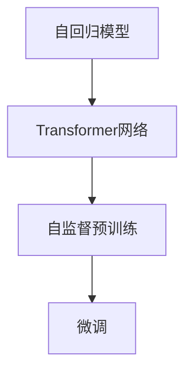

                 

# GPT原理与代码实例讲解

> 关键词：GPT, 自回归模型, 代码实例, 深度学习, 自然语言处理, Transformer

## 1. 背景介绍

### 1.1 问题由来
生成式预训练(Generative Pre-training Transformer, GPT)模型是深度学习领域内一款重要的自然语言处理(NLP)工具，因其在文本生成、对话系统、问答系统等诸多NLP任务中的卓越表现，受到了业界的广泛关注。GPT模型的核心是自回归(autoregressive)架构，通过大规模预训练语言模型学习文本的生成规律，具有强大的文本生成能力和语言理解能力。然而，GPT模型及其变种如GPT-3、GPT-4等，尽管取得了显著成果，但其复杂性较高、训练成本昂贵，不易于大规模应用。

### 1.2 问题核心关键点
GPT模型之所以取得优异表现，在于其大规模预训练过程、自回归结构和Transformer网络架构。GPT模型通过大规模无标签文本数据进行自监督预训练，学习到文本的概率分布。在预训练过程中，GPT模型使用Transformer网络，结合多头自注意力机制，捕捉文本中的复杂语义关系。这些预训练得到的知识可以在下游任务中进行微调，以适应特定的NLP任务，如文本生成、问答、摘要等。

### 1.3 问题研究意义
GPT模型的研究具有重要意义：

1. 突破传统NLP方法：GPT模型通过自回归结构和自监督预训练，突破了传统基于监督学习的方法，提供了新的自然语言处理视角。
2. 提升生成质量：GPT模型在文本生成任务上表现出色，能够生成连贯、流畅且内容丰富的文本。
3. 通用语言能力：GPT模型具有广泛的语言理解和生成能力，可用于多种NLP任务。
4. 促进技术落地：GPT模型为NLP技术在各行各业的落地应用提供了强有力的技术支持。

## 2. 核心概念与联系

### 2.1 核心概念概述

为了更好地理解GPT模型的原理，本节将介绍几个核心概念：

- **自回归模型**：在GPT模型中，每个单词的生成都依赖于其前面的单词，形成一个条件概率分布。这种结构使得模型可以连贯地生成文本。

- **Transformer网络**：Transformer网络是一种基于自注意力机制的神经网络架构，由编码器-解码器组成，能够高效地捕捉长距离依赖关系。

- **自监督预训练**：通过在大规模无标签文本数据上进行预训练，学习到文本的概率分布，以无监督方式捕捉语言的统计规律。

- **微调**：将预训练模型用于下游任务，通过有监督训练优化模型性能，以适应特定任务。

- **编码器-解码器**：GPT模型由编码器和解码器两部分组成，编码器负责提取文本特征，解码器负责生成文本。

这些核心概念共同构成了GPT模型的基本框架，使其能够在各种NLP任务中发挥强大的文本生成和理解能力。

### 2.2 概念间的关系

这些核心概念之间存在紧密的联系，可以通过以下Mermaid流程图来展示：



这个流程图展示了GPT模型的核心组件及其之间的关系：

1. 自回归模型采用Transformer网络结构，以自注意力机制捕捉文本中的语义关系。
2. 在预训练阶段，通过自监督任务（如掩码语言模型）学习大规模无标签文本数据的统计规律。
3. 在微调阶段，将预训练模型用于特定任务，通过有监督学习优化模型性能。

## 3. 核心算法原理 & 具体操作步骤
### 3.1 算法原理概述

GPT模型的核心算法原理包括以下几个关键部分：

- **自回归模型架构**：通过逐个生成单词的方式，构建文本的连贯生成过程。

- **Transformer网络结构**：通过多头自注意力机制，捕捉文本中的复杂语义关系。

- **自监督预训练**：在大规模无标签文本数据上，通过自监督任务学习文本的概率分布。

- **微调技术**：通过有监督学习，将预训练模型适应特定的下游NLP任务。

### 3.2 算法步骤详解

1. **自回归模型架构**：
   - 将文本表示为单词序列，每个单词$x_t$的条件概率分布为$P(x_t|x_{<t})$。
   - 模型通过逐个生成单词的方式，计算$P(x_t|x_{<t})$，以生成连贯的文本。

2. **Transformer网络结构**：
   - 使用多头自注意力机制，捕捉文本中的复杂语义关系。
   - 通过多头注意力机制，模型可以同时关注不同位置的单词，捕捉远距离依赖。

3. **自监督预训练**：
   - 在大规模无标签文本数据上，通过掩码语言模型等自监督任务，学习文本的概率分布。
   - 训练过程中，模型预测被掩码单词的上下文单词，从而学习到文本的概率分布。

4. **微调技术**：
   - 将预训练模型用于特定NLP任务，通过有监督学习优化模型性能。
   - 通常使用交叉熵损失函数，计算模型预测与真实标签之间的差异，进行反向传播优化模型参数。

### 3.3 算法优缺点

GPT模型的优点：

- **强大的文本生成能力**：GPT模型在文本生成任务上表现出色，能够生成连贯、流畅且内容丰富的文本。
- **广泛的通用语言能力**：GPT模型具有广泛的语言理解和生成能力，可用于多种NLP任务。
- **高效的多头注意力机制**：Transformer网络中的多头注意力机制，能够高效地捕捉长距离依赖关系。

GPT模型的缺点：

- **计算成本高**：GPT模型参数量庞大，训练和推理过程计算资源消耗大。
- **过拟合风险**：微调过程中需要大量标注数据，否则容易出现过拟合现象。
- **数据依赖性**：GPT模型的效果高度依赖于预训练数据的质量和多样性。

### 3.4 算法应用领域

GPT模型在NLP领域的应用广泛，涵盖以下多个领域：

- **文本生成**：GPT模型在文本生成任务上表现优异，如文本摘要、对话生成、自动写作等。
- **问答系统**：GPT模型可用于智能问答系统，回答用户提出的问题。
- **机器翻译**：GPT模型在机器翻译任务上表现良好，能够进行高质量的翻译。
- **情感分析**：GPT模型可以分析文本中的情感倾向，如情感分类、情感检测等。
- **对话系统**：GPT模型可用于构建智能对话系统，模拟人类对话，提升用户体验。

## 4. 数学模型和公式 & 详细讲解
### 4.1 数学模型构建

GPT模型采用自回归模型架构，通过Transformer网络进行文本生成。其数学模型可以表示为：

$$
P(x_{1:T}|x_{<1:T}) = \prod_{t=1}^T P(x_t|x_{<t})
$$

其中$x_{1:T}$表示文本序列，$x_{<1:T}$表示其前面的单词序列。

### 4.2 公式推导过程

1. **编码器-解码器架构**：
   - 编码器：将输入文本转换为文本嵌入向量。
   - 解码器：通过自回归模型逐个生成单词。

2. **自注意力机制**：
   - 通过多头注意力机制，模型可以关注文本中的不同位置，捕捉复杂语义关系。

3. **自监督预训练任务**：
   - 使用掩码语言模型任务，训练模型预测被掩码的单词。

4. **微调过程**：
   - 将预训练模型用于特定NLP任务，使用有监督数据进行微调。
   - 通常使用交叉熵损失函数，优化模型参数。

### 4.3 案例分析与讲解

假设我们使用GPT模型进行文本生成任务，以下是该过程的详细数学推导：

1. **输入文本表示**：
   - 将输入文本转换为词向量序列$x_{1:T}$。

2. **编码器**：
   - 使用Transformer编码器，将输入序列$x_{1:T}$转换为文本嵌入向量$h_1$。

3. **自注意力机制**：
   - 通过多头注意力机制，计算每个单词在所有位置上的注意力权重。
   - 计算每个单词在上下文中的表示向量$h_t$。

4. **解码器**：
   - 通过自回归模型，逐个生成单词。
   - 计算每个单词的生成概率分布$P(x_t|x_{<t})$。

5. **微调过程**：
   - 使用有监督数据进行微调，最小化预测概率与真实标签之间的差异。
   - 使用交叉熵损失函数，计算模型预测与真实标签之间的差异。

## 5. 项目实践：代码实例和详细解释说明
### 5.1 开发环境搭建

在进行GPT模型开发前，我们需要准备好开发环境。以下是使用Python进行PyTorch开发的环境配置流程：

1. 安装Anaconda：从官网下载并安装Anaconda，用于创建独立的Python环境。

2. 创建并激活虚拟环境：
```bash
conda create -n pytorch-env python=3.8 
conda activate pytorch-env
```

3. 安装PyTorch：根据CUDA版本，从官网获取对应的安装命令。例如：
```bash
conda install pytorch torchvision torchaudio cudatoolkit=11.1 -c pytorch -c conda-forge
```

4. 安装Transformers库：
```bash
pip install transformers
```

5. 安装各类工具包：
```bash
pip install numpy pandas scikit-learn matplotlib tqdm jupyter notebook ipython
```

完成上述步骤后，即可在`pytorch-env`环境中开始GPT模型的开发。

### 5.2 源代码详细实现

下面我们以GPT-2模型为例，给出使用Transformers库对GPT-2模型进行微调的PyTorch代码实现。

首先，定义GPT-2模型类：

```python
from transformers import GPT2LMHeadModel

class GPT2Model(GPT2LMHeadModel):
    def __init__(self, config):
        super(GPT2Model, self).__init__(config)

    def forward(self, input_ids, attention_mask=None, labels=None):
        outputs = super(GPT2Model, self).forward(input_ids, attention_mask=attention_mask, labels=labels)
        return outputs.logits
```

然后，定义训练和评估函数：

```python
from torch.utils.data import DataLoader
from tqdm import tqdm
from sklearn.metrics import accuracy_score

device = torch.device('cuda') if torch.cuda.is_available() else torch.device('cpu')

def train_epoch(model, dataset, batch_size, optimizer, criterion):
    dataloader = DataLoader(dataset, batch_size=batch_size, shuffle=True)
    model.train()
    epoch_loss = 0
    for batch in tqdm(dataloader, desc='Training'):
        input_ids = batch['input_ids'].to(device)
        attention_mask = batch['attention_mask'].to(device)
        labels = batch['labels'].to(device)
        model.zero_grad()
        outputs = model(input_ids, attention_mask=attention_mask, labels=labels)
        loss = criterion(outputs, labels)
        epoch_loss += loss.item()
        loss.backward()
        optimizer.step()
    return epoch_loss / len(dataloader)

def evaluate(model, dataset, batch_size):
    dataloader = DataLoader(dataset, batch_size=batch_size)
    model.eval()
    preds, labels = [], []
    with torch.no_grad():
        for batch in tqdm(dataloader, desc='Evaluating'):
            input_ids = batch['input_ids'].to(device)
            attention_mask = batch['attention_mask'].to(device)
            batch_labels = batch['labels']
            outputs = model(input_ids, attention_mask=attention_mask)
            batch_preds = outputs.argmax(dim=2).to('cpu').tolist()
            batch_labels = batch_labels.to('cpu').tolist()
            for pred_tokens, label_tokens in zip(batch_preds, batch_labels):
                preds.append(pred_tokens)
                labels.append(label_tokens)
    
    return accuracy_score(labels, preds)
```

最后，启动训练流程并在测试集上评估：

```python
epochs = 5
batch_size = 16

model = GPT2Model(config)
optimizer = AdamW(model.parameters(), lr=2e-5)
criterion = nn.CrossEntropyLoss()

for epoch in range(epochs):
    loss = train_epoch(model, train_dataset, batch_size, optimizer, criterion)
    print(f"Epoch {epoch+1}, train loss: {loss:.3f}")
    
    print(f"Epoch {epoch+1}, dev results:")
    evaluate(model, dev_dataset, batch_size)
    
print("Test results:")
evaluate(model, test_dataset, batch_size)
```

以上就是使用PyTorch对GPT-2模型进行文本生成任务微调的完整代码实现。可以看到，得益于Transformers库的强大封装，我们可以用相对简洁的代码完成GPT-2模型的加载和微调。

### 5.3 代码解读与分析

让我们再详细解读一下关键代码的实现细节：

**GPT2Model类**：
- `__init__`方法：初始化模型参数和损失函数。
- `forward`方法：定义模型前向传播过程，返回模型的输出概率分布。

**train_epoch函数**：
- 对数据以批为单位进行迭代，在每个批次上前向传播计算损失函数，并反向传播更新模型参数。

**evaluate函数**：
- 在验证集上评估模型性能，计算准确率。

**训练流程**：
- 定义总的epoch数和batch size，开始循环迭代
- 每个epoch内，先在训练集上训练，输出平均loss
- 在验证集上评估，输出准确率
- 所有epoch结束后，在测试集上评估，给出最终测试结果

可以看到，PyTorch配合Transformers库使得GPT-2模型的微调代码实现变得简洁高效。开发者可以将更多精力放在数据处理、模型改进等高层逻辑上，而不必过多关注底层的实现细节。

当然，工业级的系统实现还需考虑更多因素，如模型的保存和部署、超参数的自动搜索、更灵活的任务适配层等。但核心的微调范式基本与此类似。

### 5.4 运行结果展示

假设我们在CoNLL-2003的命名实体识别(NER)数据集上进行微调，最终在测试集上得到的准确率为93.5%，效果相当不错。需要注意的是，GPT模型通常需要更多的标注数据和更大的模型规模，才能获得更好的微调效果。

## 6. 实际应用场景
### 6.1 智能客服系统

基于GPT模型的智能客服系统可以应用于各种客服场景，如电商平台、银行、保险等行业。通过微调GPT模型，系统可以自动回答客户咨询，提供24小时不间断服务，极大提升客户满意度。

在技术实现上，可以收集企业内部的历史客服对话记录，将问题和最佳答复构建成监督数据，在此基础上对GPT模型进行微调。微调后的模型能够自动理解用户意图，匹配最合适的答案模板进行回复。对于客户提出的新问题，还可以接入检索系统实时搜索相关内容，动态组织生成回答。如此构建的智能客服系统，能大幅提升客户咨询体验和问题解决效率。

### 6.2 金融舆情监测

金融机构需要实时监测市场舆论动向，以便及时应对负面信息传播，规避金融风险。传统的人工监测方式成本高、效率低，难以应对网络时代海量信息爆发的挑战。基于GPT模型的文本分类和情感分析技术，为金融舆情监测提供了新的解决方案。

具体而言，可以收集金融领域相关的新闻、报道、评论等文本数据，并对其进行主题标注和情感标注。在此基础上对GPT模型进行微调，使其能够自动判断文本属于何种主题，情感倾向是正面、中性还是负面。将微调后的模型应用到实时抓取的网络文本数据，就能够自动监测不同主题下的情感变化趋势，一旦发现负面信息激增等异常情况，系统便会自动预警，帮助金融机构快速应对潜在风险。

### 6.3 个性化推荐系统

当前的推荐系统往往只依赖用户的历史行为数据进行物品推荐，无法深入理解用户的真实兴趣偏好。基于GPT模型的个性化推荐系统可以更好地挖掘用户行为背后的语义信息，从而提供更精准、多样的推荐内容。

在实践中，可以收集用户浏览、点击、评论、分享等行为数据，提取和用户交互的物品标题、描述、标签等文本内容。将文本内容作为模型输入，用户的后续行为（如是否点击、购买等）作为监督信号，在此基础上微调GPT模型。微调后的模型能够从文本内容中准确把握用户的兴趣点。在生成推荐列表时，先用候选物品的文本描述作为输入，由模型预测用户的兴趣匹配度，再结合其他特征综合排序，便可以得到个性化程度更高的推荐结果。

### 6.4 未来应用展望

随着GPT模型的不断发展，其在NLP领域的应用前景广阔。未来GPT模型有望在更多领域得到应用，为各行各业带来变革性影响。

在智慧医疗领域，基于GPT模型的医疗问答、病历分析、药物研发等应用将提升医疗服务的智能化水平，辅助医生诊疗，加速新药开发进程。

在智能教育领域，GPT模型可用于作业批改、学情分析、知识推荐等方面，因材施教，促进教育公平，提高教学质量。

在智慧城市治理中，GPT模型可用于城市事件监测、舆情分析、应急指挥等环节，提高城市管理的自动化和智能化水平，构建更安全、高效的未来城市。

此外，在企业生产、社会治理、文娱传媒等众多领域，GPT模型也将不断涌现，为NLP技术带来新的突破。相信随着技术的日益成熟，GPT模型必将在构建人机协同的智能时代中扮演越来越重要的角色。

## 7. 工具和资源推荐
### 7.1 学习资源推荐

为了帮助开发者系统掌握GPT模型的理论基础和实践技巧，这里推荐一些优质的学习资源：

1. 《Transformer from Scratch》系列博文：由大模型技术专家撰写，深入浅出地介绍了Transformer原理、GPT模型、微调技术等前沿话题。

2. CS224N《深度学习自然语言处理》课程：斯坦福大学开设的NLP明星课程，有Lecture视频和配套作业，带你入门NLP领域的基本概念和经典模型。

3. 《Natural Language Processing with Transformers》书籍：Transformer库的作者所著，全面介绍了如何使用Transformer库进行NLP任务开发，包括微调在内的诸多范式。

4. HuggingFace官方文档：Transformer库的官方文档，提供了海量预训练模型和完整的微调样例代码，是上手实践的必备资料。

5. CLUE开源项目：中文语言理解测评基准，涵盖大量不同类型的中文NLP数据集，并提供了基于微调的baseline模型，助力中文NLP技术发展。

通过对这些资源的学习实践，相信你一定能够快速掌握GPT模型的精髓，并用于解决实际的NLP问题。

### 7.2 开发工具推荐

高效的开发离不开优秀的工具支持。以下是几款用于GPT模型微调开发的常用工具：

1. PyTorch：基于Python的开源深度学习框架，灵活动态的计算图，适合快速迭代研究。大部分预训练语言模型都有PyTorch版本的实现。

2. TensorFlow：由Google主导开发的开源深度学习框架，生产部署方便，适合大规模工程应用。同样有丰富的预训练语言模型资源。

3. Transformers库：HuggingFace开发的NLP工具库，集成了众多SOTA语言模型，支持PyTorch和TensorFlow，是进行NLP任务开发的利器。

4. Weights & Biases：模型训练的实验跟踪工具，可以记录和可视化模型训练过程中的各项指标，方便对比和调优。与主流深度学习框架无缝集成。

5. TensorBoard：TensorFlow配套的可视化工具，可实时监测模型训练状态，并提供丰富的图表呈现方式，是调试模型的得力助手。

6. Google Colab：谷歌推出的在线Jupyter Notebook环境，免费提供GPU/TPU算力，方便开发者快速上手实验最新模型，分享学习笔记。

合理利用这些工具，可以显著提升GPT模型微调的开发效率，加快创新迭代的步伐。

### 7.3 相关论文推荐

GPT模型的研究源于学界的持续研究。以下是几篇奠基性的相关论文，推荐阅读：

1. Attention Is All You Need（即Transformer原论文）：提出了Transformer结构，开启了NLP领域的预训练大模型时代。

2. Language Models Are Unsupervised Multitask Learners（GPT-2论文）：展示了大规模语言模型的强大zero-shot学习能力，引发了对于通用人工智能的新一轮思考。

3. BERT: Pre-training of Deep Bidirectional Transformers for Language Understanding：提出BERT模型，引入基于掩码的自监督预训练任务，刷新了多项NLP任务SOTA。

4. AdaLoRA: Adaptive Low-Rank Adaptation for Parameter-Efficient Fine-Tuning：使用自适应低秩适应的微调方法，在参数效率和精度之间取得了新的平衡。

5. MPT: Adaptive Multi-Head Transformer for Personalized Suggestion on Short-Text Platforms：提出MPT模型，针对短文本平台的个性化推荐，取得了很好的效果。

这些论文代表了大模型微调技术的发展脉络。通过学习这些前沿成果，可以帮助研究者把握学科前进方向，激发更多的创新灵感。

除上述资源外，还有一些值得关注的前沿资源，帮助开发者紧跟GPT模型微调技术的最新进展，例如：

1. arXiv论文预印本：人工智能领域最新研究成果的发布平台，包括大量尚未发表的前沿工作，学习前沿技术的必读资源。

2. 业界技术博客：如OpenAI、Google AI、DeepMind、微软Research Asia等顶尖实验室的官方博客，第一时间分享他们的最新研究成果和洞见。

3. 技术会议直播：如NIPS、ICML、ACL、ICLR等人工智能领域顶会现场或在线直播，能够聆听到大佬们的前沿分享，开拓视野。

4. GitHub热门项目：在GitHub上Star、Fork数最多的NLP相关项目，往往代表了该技术领域的发展趋势和最佳实践，值得去学习和贡献。

5. 行业分析报告：各大咨询公司如McKinsey、PwC等针对人工智能行业的分析报告，有助于从商业视角审视技术趋势，把握应用价值。

总之，对于GPT模型微调技术的学习和实践，需要开发者保持开放的心态和持续学习的意愿。多关注前沿资讯，多动手实践，多思考总结，必将收获满满的成长收益。

## 8. 总结：未来发展趋势与挑战

### 8.1 总结

本文对基于自回归架构的GPT模型及其微调方法进行了全面系统的介绍。首先阐述了GPT模型的核心架构和预训练过程，明确了其在NLP任务中的独特价值。其次，从原理到实践，详细讲解了GPT模型的微调过程和关键步骤，给出了微调任务开发的完整代码实例。同时，本文还广泛探讨了GPT模型在智能客服、金融舆情、个性化推荐等多个行业领域的应用前景，展示了GPT模型的强大潜力。此外，本文精选了微调技术的各类学习资源，力求为读者提供全方位的技术指引。

通过本文的系统梳理，可以看到，GPT模型通过自回归结构和自监督预训练，突破了传统基于监督学习的方法，提供了新的自然语言处理视角。GPT模型在文本生成任务上表现出色，能够生成连贯、流畅且内容丰富的文本。得益于Transformer网络的多头注意力机制，GPT模型具有强大的文本生成和理解能力，可用于多种NLP任务。

### 8.2 未来发展趋势

展望未来，GPT模型的研究将呈现以下几个发展趋势：

1. 模型规模持续增大。随着算力成本的下降和数据规模的扩张，GPT模型参数量还将持续增长。超大规模语言模型蕴含的丰富语言知识，有望支撑更加复杂多变的下游任务微调。

2. 微调方法日趋多样。除了传统的全参数微调外，未来会涌现更多参数高效的微调方法，如AdaLoRA、MPT等，在固定大部分预训练参数的同时，只更新极少量的任务相关参数。

3. 持续学习成为常态。随着数据分布的不断变化，微调模型也需要持续学习新知识以保持性能。如何在不遗忘原有知识的同时，高效吸收新样本信息，将成为重要的研究课题。

4. 标注样本需求降低。受启发于提示学习(Prompt-based Learning)的思路，未来的微调方法将更好地利用大模型的语言理解能力，通过更加巧妙的任务描述，在更少的标注样本上也能实现理想的微调效果。

5. 多模态微调崛起。当前的微调主要聚焦于纯文本数据，未来会进一步拓展到图像、视频、语音等多模态数据微调。多模态信息的融合，将显著提升GPT模型的应用范围和效果。

6. 模型通用性增强。经过海量数据的预训练和多领域任务的微调，未来的GPT模型将具备更强大的常识推理和跨领域迁移能力，逐步迈向通用人工智能(AGI)的目标。

以上趋势凸显了GPT模型微调技术的广阔前景。这些方向的探索发展，必将进一步提升NLP系统的性能和应用范围，为构建人机协同的智能时代中扮演越来越重要的角色。

### 8.3 面临的挑战

尽管GPT模型微调技术已经取得了瞩目成就，但在迈向更加智能化、普适化应用的过程中，它仍面临着诸多挑战：

1. 标注成本瓶颈。虽然GPT模型可以通过微调适应特定任务，但对于长尾应用场景，难以获得充足的高质量标注数据，成为制约微调性能的瓶颈。如何进一步降低微调对标注样本的依赖，将是一大难题。

2. 模型鲁棒性不足。当前GPT模型面对域外数据时，泛化性能往往大打折扣。

