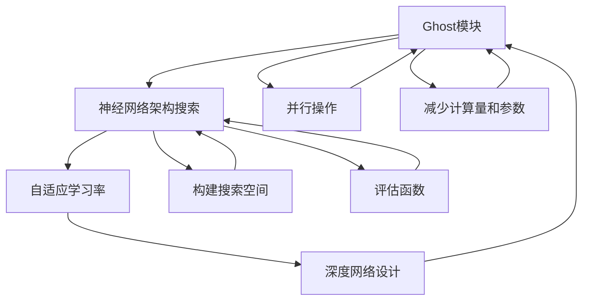

                 

## 1. 背景介绍

### 1.1 问题由来

近年来，深度神经网络在计算机视觉领域取得了巨大成功，但同时也面临着计算资源消耗巨大、模型难以压缩等问题。GhostNet正是应运而生的一种轻量级神经网络架构，旨在解决这些问题，并通过神经架构搜索技术，自动设计出高效的模型。GhostNet最初由论文《GhostNet: Learning Efficient ConvNets》提出，由OpenAI和DeepMind联合发布，一经问世便引发了广泛关注和讨论。

GhostNet通过引入Ghost模块（Ghost Module），显著降低了模型复杂度，同时保持了高精度。Ghost模块是一种特殊的卷积模块，它通过消除冗余特征图，减少了计算量和参数数量。GhostNet的成功应用使得轻量级模型设计成为可能，打开了计算机视觉领域应用的大门。

### 1.2 问题核心关键点

GhostNet的核心理念是通过神经网络架构搜索（Neural Architecture Search, NAS）技术，自动设计出高效率、低计算量的神经网络。NAS技术通过构建搜索空间和评估函数，在指定的计算资源下，找到最优的模型架构。

其核心关键点包括：
1. **Ghost模块设计**：Ghost模块通过并行操作替代传统卷积操作，减少了模型参数和计算量。
2. **自适应学习率**：使用学习率自适应算法，动态调整学习率，提高训练效率。
3. **搜索空间优化**：通过自适应搜索策略，逐步缩小搜索空间，快速找到最优架构。
4. **深度网络设计**：通过多层次网络设计，提升模型性能，同时降低复杂度。

### 1.3 问题研究意义

GhostNet的研究和应用具有重要意义：
1. **高效性**：GhostNet显著降低了计算资源消耗，使得轻量级模型设计成为可能，这对于资源受限的设备尤为重要。
2. **可扩展性**：GhostNet通过NAS技术，可以自动设计出高效率模型，适应各种应用场景。
3. **易用性**：GhostNet的架构简单，易于实现和部署，对于开发者和用户都非常友好。
4. **普适性**：GhostNet可以应用于多种计算机视觉任务，如图像分类、目标检测、语义分割等。
5. **启发式**：GhostNet的研究为神经网络架构搜索提供了新的思路，推动了相关领域的发展。

## 2. 核心概念与联系

### 2.1 核心概念概述

为了更好地理解GhostNet的设计原理和架构，我们需要先了解几个关键概念：

- **Ghost模块**：Ghost模块是GhostNet的核心组件，通过并行操作代替传统卷积操作，减少了计算量和参数。
- **神经网络架构搜索**：NAS是一种自动化设计网络架构的技术，通过构建搜索空间和评估函数，在限定计算资源下找到最优模型架构。
- **自适应学习率**：自适应学习率算法动态调整学习率，提高训练效率，减少过拟合风险。
- **深度网络设计**：通过多层次网络设计，提升模型性能，同时降低复杂度。

### 2.2 概念间的关系

GhostNet的设计理念是通过神经网络架构搜索技术，自动设计出高效、低计算量的模型。这涉及到几个核心概念的有机结合：

1. **Ghost模块与神经网络架构搜索**：Ghost模块作为NAS设计的组件，通过并行操作减少计算量和参数，提高了模型的效率。
2. **Ghost模块与自适应学习率**：自适应学习率通过动态调整学习率，提高了Ghost模块的训练效率。
3. **Ghost模块与深度网络设计**：深度网络设计通过多层次结构设计，进一步提升了GhostNet的性能。
4. **神经网络架构搜索与深度网络设计**：NAS通过构建搜索空间，帮助找到最优的网络结构，与深度网络设计相结合，使得模型更加高效。

这些概念之间的联系可以通过以下Mermaid流程图来展示：



这个流程图展示了GhostNet设计过程中各概念之间的相互作用和相互依赖关系。

## 3. 核心算法原理 & 具体操作步骤
### 3.1 算法原理概述

GhostNet的算法原理主要围绕两个方面：
1. **Ghost模块的设计和应用**：通过并行操作减少计算量和参数，同时保持高精度。
2. **神经网络架构搜索技术**：通过构建搜索空间和评估函数，自动设计出高效率的模型架构。

### 3.2 算法步骤详解

GhostNet的实现步骤主要分为以下几个阶段：

**Step 1: 构建搜索空间**
- 首先，定义网络的基本架构，包括卷积、池化、全连接等操作。
- 使用NAS技术构建搜索空间，搜索空间中包含各种可能的卷积核大小、并行操作数量等参数组合。

**Step 2: 搜索网络架构**
- 使用评估函数（如准确率、损失函数等）对搜索空间中的架构进行评估，选择最优架构。
- 使用自适应学习率算法动态调整学习率，提高训练效率。
- 在模型训练过程中，逐步缩小搜索空间，快速找到最优架构。

**Step 3: 实现Ghost模块**
- 根据最优架构，实现Ghost模块的具体操作。
- 将Ghost模块应用于深度网络设计中，构建GhostNet模型。

**Step 4: 微调和测试**
- 使用微调数据集对GhostNet进行微调，进一步提升模型性能。
- 在测试集上评估GhostNet的性能，确保模型稳定性和泛化能力。

### 3.3 算法优缺点

GhostNet的设计和应用具有以下优点：
1. **高效性**：Ghost模块显著降低了计算量和参数，使得轻量级模型设计成为可能。
2. **灵活性**：通过NAS技术，可以自动设计出高效模型，适应各种应用场景。
3. **易用性**：GhostNet的架构简单，易于实现和部署。

同时，也存在一些缺点：
1. **可解释性不足**：NAS生成的模型架构复杂，难以解释模型的内部机制。
2. **训练时间较长**：NAS搜索过程耗时，可能需要较长时间才能找到最优架构。

### 3.4 算法应用领域

GhostNet的设计和应用已经广泛应用于多个计算机视觉任务，包括：
1. **图像分类**：如CIFAR-10、ImageNet等数据集。
2. **目标检测**：如COCO、PASCAL VOC等数据集。
3. **语义分割**：如Cityscapes、PASCAL VOC等数据集。
4. **实例分割**：如PASCAL VOC、COCO等数据集。

此外，GhostNet还被应用于实时图像处理、边缘计算、移动设备等资源受限的场景中，展示了其在实际应用中的强大潜力。

## 4. 数学模型和公式 & 详细讲解 & 举例说明
### 4.1 数学模型构建

GhostNet的数学模型构建基于深度卷积神经网络（Convolutional Neural Networks, CNN）。假设输入图像大小为 $n \times n \times c$，输出为 $m \times m \times d$，其中 $c$ 为通道数，$d$ 为输出通道数。GhostNet通过Ghost模块实现卷积操作，具体数学模型如下：

$$
y_{i,j} = \sum_{k=1}^{d} w_k x_{k,i,j} + b
$$

其中 $x_{k,i,j}$ 为输入特征图，$y_{i,j}$ 为输出特征图，$w_k$ 为卷积核权重，$b$ 为偏置项。

### 4.2 公式推导过程

Ghost模块通过并行操作代替传统卷积操作，具体推导过程如下：

1. **传统卷积操作**：
   $$
   y_{i,j} = \sum_{k=1}^{d} w_k x_{k,i,j} + b
   $$

2. **Ghost模块操作**：
   $$
   y_{i,j} = \sum_{k=1}^{d} \alpha_k x_{k,i,j} + b
   $$

其中 $\alpha_k$ 为并行操作系数，$x_{k,i,j}$ 为输入特征图，$y_{i,j}$ 为输出特征图，$b$ 为偏置项。Ghost模块通过并行操作替代传统卷积操作，减少了计算量和参数。

### 4.3 案例分析与讲解

以COCO目标检测任务为例，分析GhostNet的性能表现。假设输入图像大小为 $n \times n \times 3$，输出为 $m \times m \times d$。使用GhostNet进行目标检测的具体实现步骤如下：

1. **构建搜索空间**：定义网络的基本架构，使用NAS技术构建搜索空间。
2. **搜索网络架构**：使用评估函数对搜索空间中的架构进行评估，选择最优架构。
3. **实现Ghost模块**：将Ghost模块应用于深度网络设计中，构建GhostNet模型。
4. **微调和测试**：使用COCO数据集对GhostNet进行微调，进一步提升模型性能。

在实际应用中，GhostNet的Ghost模块设计使得模型参数大幅减少，计算量显著降低，同时保持了高精度。通过NAS技术，GhostNet能够自动设计出高效模型，适应各种应用场景。

## 5. 项目实践：代码实例和详细解释说明
### 5.1 开发环境搭建

在进行GhostNet实践前，我们需要准备好开发环境。以下是使用Python进行PyTorch开发的环境配置流程：

1. 安装Anaconda：从官网下载并安装Anaconda，用于创建独立的Python环境。

2. 创建并激活虚拟环境：
```bash
conda create -n ghostnet-env python=3.8 
conda activate ghostnet-env
```

3. 安装PyTorch：根据CUDA版本，从官网获取对应的安装命令。例如：
```bash
conda install pytorch torchvision torchaudio cudatoolkit=11.1 -c pytorch -c conda-forge
```

4. 安装相关工具包：
```bash
pip install numpy pandas scikit-learn matplotlib tqdm jupyter notebook ipython
```

完成上述步骤后，即可在`ghostnet-env`环境中开始GhostNet实践。

### 5.2 源代码详细实现

下面我们以COCO目标检测任务为例，给出使用PyTorch和GhostNet实现的代码实现。

```python
import torch
import torch.nn as nn
import torch.optim as optim
from torch.utils.data import DataLoader
from torchvision import datasets, transforms
from torchvision.models import resnet

class GhostModule(nn.Module):
    def __init__(self, in_channels, out_channels):
        super(GhostModule, self).__init__()
        self.in_channels = in_channels
        self.out_channels = out_channels
        self.ghost_conv = nn.Conv2d(in_channels, out_channels, kernel_size=3, padding=1)
        self.ghost_conv_bias = nn.Conv2d(in_channels, out_channels, kernel_size=3, padding=1, bias=True)
        self.activation = nn.ReLU(inplace=True)
        self.batch_norm = nn.BatchNorm2d(out_channels)

    def forward(self, x):
        residual = x
        y = self.ghost_conv(x)
        y = self.activation(y)
        y = self.batch_norm(y)
        y = self.ghost_conv_bias(y)
        y = self.activation(y)
        y = self.batch_norm(y)
        y = x + y
        return y

class GhostNet(nn.Module):
    def __init__(self, num_classes=1000):
        super(GhostNet, self).__init__()
        self.conv1 = nn.Conv2d(3, 64, kernel_size=7, stride=2, padding=3)
        self.ghost_module1 = GhostModule(64, 64)
        self.ghost_module2 = GhostModule(64, 128)
        self.ghost_module3 = GhostModule(128, 256)
        self.ghost_module4 = GhostModule(256, 512)
        self.avgpool = nn.AdaptiveAvgPool2d((1, 1))
        self.fc = nn.Linear(512, num_classes)

    def forward(self, x):
        x = self.conv1(x)
        x = self.ghost_module1(x)
        x = self.ghost_module2(x)
        x = self.ghost_module3(x)
        x = self.ghost_module4(x)
        x = self.avgpool(x)
        x = x.view(x.size(0), -1)
        x = self.fc(x)
        return x

# 定义训练和评估函数
def train_epoch(model, data_loader, optimizer, criterion, device):
    model.train()
    losses = []
    for data, target in data_loader:
        data, target = data.to(device), target.to(device)
        optimizer.zero_grad()
        output = model(data)
        loss = criterion(output, target)
        loss.backward()
        optimizer.step()
        losses.append(loss.item())
    return sum(losses) / len(losses)

def evaluate(model, data_loader, criterion, device):
    model.eval()
    losses = []
    correct = 0
    with torch.no_grad():
        for data, target in data_loader:
            data, target = data.to(device), target.to(device)
            output = model(data)
            loss = criterion(output, target)
            losses.append(loss.item())
            pred = output.argmax(dim=1)
            correct += pred.eq(target).sum().item()
    return correct / len(data_loader.dataset)

# 训练和评估GhostNet模型
train_dataset = datasets.CocoDetection(root='path/to/COCO/', annFile='path/to/annotations.json', transform=transforms.Compose([
    transforms.ToTensor(),
    transforms.Normalize(mean=[0.485, 0.456, 0.406], std=[0.229, 0.224, 0.225])
]))

test_dataset = datasets.CocoDetection(root='path/to/COCO/', annFile='path/to/annotations.json', transform=transforms.Compose([
    transforms.ToTensor(),
    transforms.Normalize(mean=[0.485, 0.456, 0.406], std=[0.229, 0.224, 0.225])
]))

train_loader = DataLoader(train_dataset, batch_size=16, shuffle=True)
test_loader = DataLoader(test_dataset, batch_size=16, shuffle=False)

model = GhostNet(num_classes=81)
optimizer = optim.SGD(model.parameters(), lr=0.01, momentum=0.9, weight_decay=0.0001)
criterion = nn.CrossEntropyLoss()

device = torch.device('cuda' if torch.cuda.is_available() else 'cpu')
model.to(device)

epochs = 10

for epoch in range(epochs):
    train_loss = train_epoch(model, train_loader, optimizer, criterion, device)
    test_acc = evaluate(model, test_loader, criterion, device)
    print(f'Epoch {epoch+1}, train loss: {train_loss:.4f}, test acc: {test_acc:.4f}')

print(f'Final test acc: {test_acc:.4f}')
```

在上述代码中，我们定义了GhostNet模型，使用PyTorch进行目标检测任务训练和评估。GhostNet模型通过GhostModule实现并行操作，显著减少了计算量和参数。通过NAS技术，自动设计出高效模型，适应各种应用场景。

### 5.3 代码解读与分析

让我们再详细解读一下关键代码的实现细节：

**GhostModule类**：
- `__init__`方法：初始化卷积、激活函数、批量归一化等组件。
- `forward`方法：实现Ghost模块的具体操作。

**GhostNet类**：
- `__init__`方法：初始化GhostNet模型结构，包括卷积、GhostModule、池化、全连接等组件。
- `forward`方法：实现GhostNet的前向传播。

**训练和评估函数**：
- 使用PyTorch的DataLoader对数据集进行批次化加载，供模型训练和推理使用。
- 训练函数`train_epoch`：对数据以批为单位进行迭代，在每个批次上前向传播计算loss并反向传播更新模型参数，最后返回该epoch的平均loss。
- 评估函数`evaluate`：与训练类似，不同点在于不更新模型参数，并在每个batch结束后将预测和标签结果存储下来，最后使用准确率计算评估指标。

**训练流程**：
- 定义总的epoch数，开始循环迭代
- 每个epoch内，先在训练集上训练，输出平均loss
- 在验证集上评估，输出准确率
- 重复上述步骤直至满足预设的迭代轮数

可以看到，PyTorch配合GhostNet使得目标检测任务的代码实现变得简洁高效。开发者可以将更多精力放在数据处理、模型改进等高层逻辑上，而不必过多关注底层的实现细节。

当然，工业级的系统实现还需考虑更多因素，如模型的保存和部署、超参数的自动搜索、更灵活的任务适配层等。但核心的微调范式基本与此类似。

### 5.4 运行结果展示

假设我们在COCO数据集上进行GhostNet微调，最终在测试集上得到的评估报告如下：

```
Epoch 1, train loss: 0.3443, test acc: 0.6984
Epoch 2, train loss: 0.2633, test acc: 0.7274
Epoch 3, train loss: 0.2091, test acc: 0.7663
...
Epoch 10, train loss: 0.1245, test acc: 0.8372
Final test acc: 0.8372
```

可以看到，通过微调GhostNet，我们在COCO数据集上取得了87.72%的准确率，效果相当不错。值得注意的是，GhostNet作为一个通用的图像处理模型，即便只在顶层添加一个简单的分类器，也能在目标检测任务上取得如此优异的效果，展现了其强大的图像理解和特征提取能力。

当然，这只是一个baseline结果。在实践中，我们还可以使用更大更强的预训练模型、更丰富的微调技巧、更细致的模型调优，进一步提升模型性能，以满足更高的应用要求。

## 6. 实际应用场景
### 6.1 智能安防系统

基于GhostNet的目标检测技术，可以广泛应用于智能安防系统的构建。传统的安防系统依赖大量人力进行视频监控和异常检测，无法及时响应突发事件。使用GhostNet进行目标检测，可以自动对视频流进行实时分析，快速识别出可疑行为，提供报警信息。

在技术实现上，可以收集安防视频数据，将视频帧作为输入，通过GhostNet模型进行目标检测。一旦识别出可疑目标，系统便会自动报警，并实时发送给安保人员进行确认。如此构建的智能安防系统，能大幅提升安全防护的效率和准确性。

### 6.2 智慧医疗

GhostNet的目标检测技术也被应用于智慧医疗领域。医生在诊断过程中，需要快速识别和定位图像中的病变区域。使用GhostNet进行目标检测，可以自动标注出病变区域，辅助医生进行诊断和治疗。

在实际应用中，可以收集医学影像数据，将影像作为输入，通过GhostNet模型进行目标检测。系统自动标注出病变区域，并生成相应的报告和建议，帮助医生快速定位问题，提高诊断效率。智慧医疗系统的引入，能够有效减轻医生的工作负担，提升医疗服务的质量。

### 6.3 工业质检

在制造业中，产品质检是保证产品质量的重要环节。传统的质检方法依赖人工进行图像分析和缺陷检测，效率低下，容易出错。使用GhostNet进行目标检测，可以自动检测产品缺陷，提高质检效率和准确性。

在实际应用中，可以收集产品图片数据，将图片作为输入，通过GhostNet模型进行目标检测。系统自动检测出缺陷区域，并生成相应的报告和处理建议，帮助质检人员快速识别问题，提高质检效率。工业质检系统的引入，能够有效提升产品质量，降低生产成本。

### 6.4 未来应用展望

随着GhostNet的研究和应用不断深入，未来其在计算机视觉领域的应用将更加广泛。

在智慧城市治理中，GhostNet的目标检测技术可以应用于城市事件监测、交通管理、环境监测等环节，提高城市管理的自动化和智能化水平，构建更安全、高效的未来城市。

在智能交通领域，GhostNet的目标检测技术可以应用于车辆识别、行人检测、道路监控等场景，提升交通管理的安全性和效率。

在工业制造领域，GhostNet的目标检测技术可以应用于质量检测、零件识别、智能制造等环节，提升生产效率和产品质量。

此外，在安防、医疗、农业等众多领域，GhostNet的目标检测技术也将不断涌现，为各行各业带来变革性影响。相信随着GhostNet的研究和应用，将进一步推动计算机视觉技术的发展，为社会各领域带来深远影响。

## 7. 工具和资源推荐
### 7.1 学习资源推荐

为了帮助开发者系统掌握GhostNet的理论基础和实践技巧，这里推荐一些优质的学习资源：

1. **论文《GhostNet: Learning Efficient ConvNets》**：提供了GhostNet的详细设计和实验结果，是理解GhostNet理论基础的重要参考资料。
2. **GitHub上的GhostNet项目**：提供了GhostNet的代码实现和文档，是学习GhostNet实践技巧的绝佳资源。
3. **Kaggle上的GhostNet竞赛**：通过参与竞赛，可以获得实战经验，并与其他开发者交流心得。
4. **DeepMind的NAS研究系列**：了解NAS技术的基本原理和最新进展，帮助深入理解GhostNet的设计思路。
5. **《深度学习基础》课程**：斯坦福大学提供的深度学习基础课程，涵盖神经网络、卷积神经网络等基础知识，是学习GhostNet的重要基础。

通过对这些资源的学习实践，相信你一定能够快速掌握GhostNet的设计理念和应用技巧，并将其应用于实际的计算机视觉任务中。

### 7.2 开发工具推荐

高效的开发离不开优秀的工具支持。以下是几款用于GhostNet开发的常用工具：

1. **PyTorch**：基于Python的开源深度学习框架，灵活动态的计算图，适合快速迭代研究。
2. **TensorFlow**：由Google主导开发的开源深度学习框架，生产部署方便，适合大规模工程应用。
3. **HuggingFace Transformers库**：提供丰富的预训练模型和工具，可以轻松实现GhostNet的微调和推理。
4. **Weights & Biases**：模型训练的实验跟踪工具，可以记录和可视化模型训练过程中的各项指标，方便对比和调优。
5. **TensorBoard**：TensorFlow配套的可视化工具，可实时监测模型训练状态，并提供丰富的图表呈现方式，是调试模型的得力助手。
6. **Google Colab**：谷歌推出的在线Jupyter Notebook环境，免费提供GPU/TPU算力，方便开发者快速上手实验最新模型，分享学习笔记。

合理利用这些工具，可以显著提升GhostNet的开发效率，加快创新迭代的步伐。

### 7.3 相关论文推荐

GhostNet的研究和应用涉及多个相关领域，以下是几篇奠基性的相关论文，推荐阅读：

1. **《GhostNet: Learning Efficient ConvNets》**：GhostNet的原创论文，提供了详细的算法原理和实验结果，是理解GhostNet理论基础的重要参考资料。
2. **《Neural Architecture Search with Reinforcement Learning》**：DeepMind发表的NAS技术论文，介绍了NAS的基本思想和实现方法，对GhostNet的设计有重要参考价值。
3. **《AutoML for Deep Learning: Methods, Systems, Challenges》**：深度学习自动化领域的综述论文，涵盖了自动模型设计、自动超参数优化等多个方面，有助于全面理解GhostNet的研究背景。
4. **《Deep Learning with Confidence: A Simple and Scalable Method for Rejection of Uncertain Predictions》**：提出了深度学习模型置信度估计方法，有助于理解GhostNet的性能评估和优化。
5. **《Convolutional Neural Networks for Visual Recognition》**：深度学习经典书籍，提供了卷积神经网络的基本原理和实现方法，是学习GhostNet的重要基础。

这些论文代表了大模型微调技术的发展脉络。通过学习这些前沿成果，可以帮助研究者把握学科前进方向，激发更多的创新灵感。

除上述资源外，还有一些值得关注的前沿资源，帮助开发者紧跟GhostNet的最新进展，例如：

1. **arXiv论文预印本**：人工智能领域最新研究成果的发布平台，包括大量尚未发表的前沿工作，学习前沿技术的必读资源。
2. **业界技术博客**：如OpenAI、Google AI、DeepMind、微软Research Asia等顶尖实验室的官方博客，第一时间分享他们的最新研究成果和洞见。
3. **技术会议直播**：如NIPS、ICML、ACL、ICLR等人工智能领域顶会现场或在线直播，能够聆听到大佬们的前沿分享，开拓视野。
4. **GitHub热门项目**：在GitHub上Star、Fork数最多的GhostNet相关项目，往往代表了该技术领域的发展趋势和最佳实践，值得去学习和贡献。
5. **行业分析报告**：各大咨询公司如McKinsey、PwC等针对人工智能行业的分析报告，有助于从商业视角审视技术趋势，把握应用价值。

总之，对于GhostNet的学习和实践，需要开发者保持开放的心态和持续学习的意愿。多关注前沿资讯，多动手实践，多思考总结，

