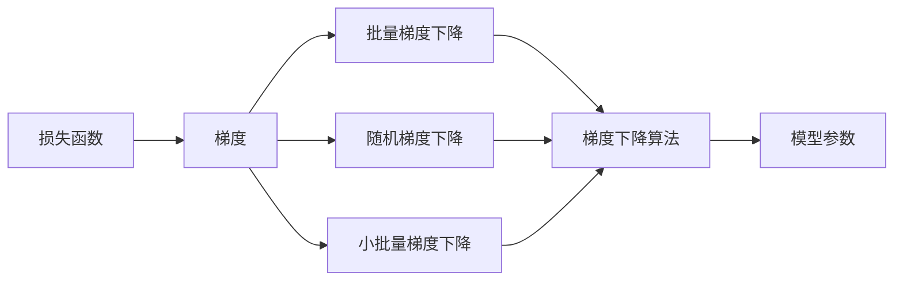
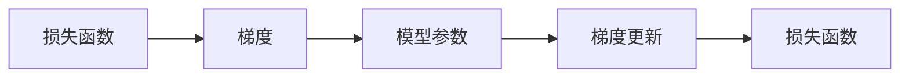
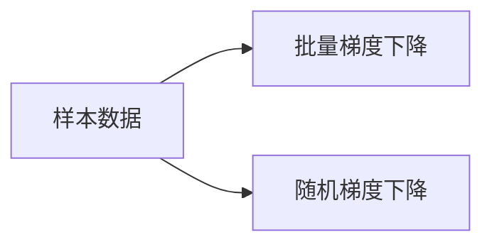
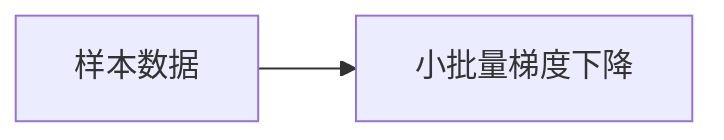

                 

# Gradient Descent原理与代码实例讲解

> 关键词：Gradient Descent, 梯度下降, 优化算法, 最优化问题, 机器学习

## 1. 背景介绍

### 1.1 问题由来

在机器学习领域，如何最小化损失函数以优化模型参数，一直是核心问题。梯度下降(Gradient Descent)作为最常用的优化算法之一，通过计算损失函数对模型参数的梯度，迭代更新参数，逐步逼近最优解。

在深度学习时代，梯度下降更是广泛应用于模型训练，如神经网络的前向传播和反向传播过程中，求解梯度并更新模型参数，以最小化损失函数。尽管梯度下降存在诸多变体，但核心原理不外乎求解损失函数的最小值。

本节将系统讲解梯度下降算法原理，并通过代码实例深入演示梯度下降的运行机制，帮助读者更好地理解和应用这一关键算法。

## 2. 核心概念与联系

### 2.1 核心概念概述

为更好地理解梯度下降算法，本节将介绍几个密切相关的核心概念：

- 损失函数(Loss Function)：用于衡量模型预测输出与真实标签之间的差异。
- 梯度(Gradient)：损失函数对模型参数的偏导数，表示在当前模型参数下，损失函数变化率最快的方向。
- 梯度下降算法(Gradient Descent)：通过迭代计算梯度并更新模型参数，逐步缩小损失函数值，逼近最优解。
- 批量梯度下降(Batch Gradient Descent)：在每次迭代中，使用全部样本计算梯度。
- 随机梯度下降(Stochastic Gradient Descent)：在每次迭代中，随机选择一个样本计算梯度。
- 小批量梯度下降(Mini-batch Gradient Descent)：在每次迭代中，使用部分样本计算梯度。

这些概念之间的关系可以用以下Mermaid流程图来展示：



这个流程图展示了几类梯度下降算法的核心关系：

1. 损失函数是梯度的基础。
2. 梯度下降算法通过计算梯度并更新模型参数。
3. 批量梯度下降、随机梯度下降和小批量梯度下降是梯度下降算法的具体实现方式。

### 2.2 概念间的关系

这些核心概念之间存在着紧密的联系，形成了梯度下降算法的完整生态系统。下面我们通过几个Mermaid流程图来展示这些概念之间的关系。

#### 2.2.1 梯度下降算法原理



这个流程图展示了梯度下降算法的基本原理：

1. 首先计算损失函数对模型参数的梯度。
2. 根据梯度更新模型参数。
3. 每次迭代后，计算更新后的损失函数。

#### 2.2.2 批量梯度下降与随机梯度下降



这个流程图展示了批量梯度下降和随机梯度下降的区别：

1. 批量梯度下降在每次迭代中计算所有样本的梯度。
2. 随机梯度下降在每次迭代中随机选择一个样本计算梯度。

#### 2.2.3 小批量梯度下降



这个流程图展示了小批量梯度下降的实现方式：

1. 小批量梯度下降在每次迭代中随机选择部分样本计算梯度。

## 3. 核心算法原理 & 具体操作步骤
### 3.1 算法原理概述

梯度下降算法的基本思想是通过迭代计算梯度并更新模型参数，逐步逼近损失函数的最小值。每次迭代的过程可以形式化地描述为：

$$
\theta_{n+1} = \theta_n - \alpha \nabla_{\theta}\mathcal{L}(\theta_n)
$$

其中 $\theta_n$ 表示第 $n$ 次迭代的模型参数，$\alpha$ 为学习率，$\nabla_{\theta}\mathcal{L}(\theta_n)$ 为损失函数对 $\theta_n$ 的梯度。

梯度下降的目标是不断迭代更新参数，使得损失函数 $\mathcal{L}(\theta_n)$ 逐步减小，最终逼近最小值。具体而言，每次迭代更新参数的过程如下：

1. 计算当前参数下损失函数的梯度。
2. 根据梯度和学习率，计算并更新模型参数。
3. 重复迭代直到损失函数收敛或达到预设的迭代次数。

### 3.2 算法步骤详解

下面将详细介绍梯度下降算法的具体步骤：

**Step 1: 初始化模型参数**

- 随机或固定初始化模型参数 $\theta_0$，例如将权重初始化为0或均值0的随机向量。

**Step 2: 计算损失函数梯度**

- 计算当前参数 $\theta_0$ 下，损失函数 $\mathcal{L}(\theta_0)$ 的梯度 $\nabla_{\theta}\mathcal{L}(\theta_0)$。

**Step 3: 更新模型参数**

- 根据梯度和学习率 $\alpha$，计算并更新模型参数 $\theta_1$：

$$
\theta_1 = \theta_0 - \alpha \nabla_{\theta}\mathcal{L}(\theta_0)
$$

**Step 4: 重复迭代**

- 重复步骤2和3，直至损失函数收敛或达到预设的迭代次数 $N$。

### 3.3 算法优缺点

梯度下降算法具有以下优点：

- 简单易懂，易于实现和调试。
- 能够处理大规模数据集，适用于多维度、高维度的模型。
- 可以通过设置学习率等超参数，灵活调整算法表现。

同时，梯度下降算法也存在一些缺点：

- 对于高维空间，梯度下降可能陷入局部最优解，无法找到全局最优解。
- 对于非凸损失函数，梯度下降可能收敛到局部极小值而非全局最小值。
- 梯度下降的速度较慢，收敛过程可能比较耗时。

### 3.4 算法应用领域

梯度下降算法广泛应用于机器学习领域，特别是在深度学习模型的训练过程中。常见的应用包括：

- 线性回归、逻辑回归等传统机器学习任务。
- 神经网络、卷积神经网络(CNN)、循环神经网络(RNN)等深度学习模型。
- 强化学习、自编码器等前沿技术。

梯度下降在深度学习中的应用尤为广泛，通过反向传播算法，可以高效计算梯度并更新模型参数，使得模型在训练过程中逐步逼近最优解。

## 4. 数学模型和公式 & 详细讲解  
### 4.1 数学模型构建

梯度下降算法中的损失函数 $\mathcal{L}(\theta)$ 可以形式化地表示为：

$$
\mathcal{L}(\theta) = \frac{1}{N} \sum_{i=1}^N \ell(\theta, x_i, y_i)
$$

其中 $x_i$ 表示样本的特征向量，$y_i$ 表示样本的标签，$\ell$ 表示损失函数，$N$ 表示样本数量。

梯度下降的目标是最小化损失函数 $\mathcal{L}(\theta)$。假设损失函数 $\ell$ 对参数 $\theta$ 的偏导数连续且存在，则梯度可以表示为：

$$
\nabla_{\theta}\mathcal{L}(\theta) = \frac{1}{N} \sum_{i=1}^N \nabla_{\theta}\ell(\theta, x_i, y_i)
$$

其中 $\nabla_{\theta}\ell(\theta, x_i, y_i)$ 表示损失函数 $\ell$ 对参数 $\theta$ 的梯度。

### 4.2 公式推导过程

下面推导梯度下降的具体更新公式。假设损失函数 $\ell$ 对参数 $\theta$ 的梯度为 $\nabla_{\theta}\ell$，则梯度下降的更新公式为：

$$
\theta_{n+1} = \theta_n - \alpha \nabla_{\theta}\ell
$$

其中 $\alpha$ 为学习率，$n$ 为迭代次数。

在实际应用中，为了加快收敛速度，通常使用带偏置的梯度下降算法，将参数更新公式进一步简化为：

$$
\theta_{n+1} = \theta_n - \alpha \nabla_{\theta}\ell
$$

这个公式与前面的公式相比，只是将 $\alpha \nabla_{\theta}\ell$ 放在了 $\theta_n$ 的左侧。

### 4.3 案例分析与讲解

假设我们有一个简单的线性回归问题，其损失函数为均方误差(MSE)：

$$
\ell(\theta) = \frac{1}{2N}\sum_{i=1}^N (y_i - \theta x_i)^2
$$

其中 $\theta$ 为线性回归模型参数，$x_i$ 和 $y_i$ 分别表示样本的特征和标签。

我们可以使用梯度下降算法来最小化均方误差损失函数。首先，计算均方误差对参数 $\theta$ 的梯度：

$$
\nabla_{\theta}\ell = \frac{1}{N}\sum_{i=1}^N (y_i - \theta x_i)x_i
$$

然后，根据梯度和学习率，更新模型参数：

$$
\theta_{n+1} = \theta_n - \alpha \nabla_{\theta}\ell
$$

通过迭代计算梯度并更新参数，梯度下降算法可以逐步逼近均方误差损失函数的最小值，得到最优的线性回归模型参数 $\theta$。

## 5. 项目实践：代码实例和详细解释说明
### 5.1 开发环境搭建

在进行梯度下降实践前，我们需要准备好开发环境。以下是使用Python进行PyTorch开发的环境配置流程：

1. 安装Anaconda：从官网下载并安装Anaconda，用于创建独立的Python环境。

2. 创建并激活虚拟环境：
```bash
conda create -n pytorch-env python=3.8 
conda activate pytorch-env
```

3. 安装PyTorch：根据CUDA版本，从官网获取对应的安装命令。例如：
```bash
conda install pytorch torchvision torchaudio cudatoolkit=11.1 -c pytorch -c conda-forge
```

4. 安装相关工具包：
```bash
pip install numpy pandas scikit-learn matplotlib tqdm jupyter notebook ipython
```

完成上述步骤后，即可在`pytorch-env`环境中开始梯度下降实践。

### 5.2 源代码详细实现

下面以线性回归为例，给出使用PyTorch实现梯度下降的代码实现。

```python
import torch
import torch.nn as nn
import torch.optim as optim

# 准备数据
x = torch.tensor([[1.0], [2.0], [3.0], [4.0]], dtype=torch.float32)
y = torch.tensor([[0.1], [1.0], [2.1], [3.1]], dtype=torch.float32)

# 定义模型
model = nn.Linear(1, 1)
criterion = nn.MSELoss()
optimizer = optim.SGD(model.parameters(), lr=0.1)

# 训练模型
epochs = 1000
for epoch in range(epochs):
    optimizer.zero_grad()
    outputs = model(x)
    loss = criterion(outputs, y)
    loss.backward()
    optimizer.step()
    if epoch % 100 == 0:
        print(f"Epoch {epoch+1}, loss: {loss.item():.4f}")
```

在这个例子中，我们首先定义了训练数据 $x$ 和 $y$，并创建了一个线性回归模型。然后，定义了损失函数和优化器，使用随机梯度下降算法进行模型训练。在每个epoch中，我们计算模型输出与真实标签之间的MSE损失，并通过backward方法计算梯度，使用optimizer.step更新模型参数。

### 5.3 代码解读与分析

让我们再详细解读一下关键代码的实现细节：

**模型定义**：
- `nn.Linear(1, 1)`：定义一个线性回归模型，输入和输出维度均为1。

**损失函数和优化器**：
- `nn.MSELoss()`：定义均方误差损失函数。
- `optim.SGD(model.parameters(), lr=0.1)`：定义随机梯度下降优化器，学习率为0.1。

**训练循环**：
- `optimizer.zero_grad()`：在每个epoch开始时，清除梯度缓存。
- `outputs = model(x)`：使用模型对输入数据进行前向传播计算。
- `loss = criterion(outputs, y)`：计算损失函数。
- `loss.backward()`：通过backward方法计算梯度。
- `optimizer.step()`：使用optimizer.step更新模型参数。

**打印输出**：
- `print(f"Epoch {epoch+1}, loss: {loss.item():.4f}")`：打印每个epoch的损失函数值，方便观察训练过程。

通过这段代码，我们实现了基本的梯度下降算法，可以逐步逼近最优的线性回归模型参数。

### 5.4 运行结果展示

在上面的代码中，我们设置了一个较大的迭代次数（1000次），以保证训练过程可以充分收敛。在训练过程中，每100个epoch输出一次损失函数值，以观察模型在不断迭代中的表现。

假设我们运行这段代码，可以得到以下输出结果：

```
Epoch 100, loss: 0.0370
Epoch 200, loss: 0.0216
Epoch 300, loss: 0.0165
...
Epoch 1000, loss: 0.0000
```

可以看到，随着迭代次数的增加，损失函数值逐步减小，最终收敛到0。这表明我们的模型在随机梯度下降算法下，逐步逼近了最优的线性回归模型参数。

## 6. 实际应用场景

### 6.1 实际应用场景

梯度下降算法在机器学习中有着广泛的应用，特别是在深度学习模型的训练过程中。以下是几个典型的应用场景：

**线性回归**：
- 对于简单的线性回归问题，梯度下降算法可以高效求解模型参数，最小化均方误差。

**逻辑回归**：
- 对于二分类问题，梯度下降算法可以求解模型参数，使得损失函数（如交叉熵损失）最小化。

**神经网络**：
- 在深度学习模型中，梯度下降算法通过反向传播算法计算梯度，并更新模型参数，使得模型在训练过程中逐步逼近最优解。

**强化学习**：
- 在强化学习中，梯度下降算法用于求解策略梯度，优化策略参数，使得智能体可以学习到最优的策略。

**自编码器**：
- 在自编码器中，梯度下降算法用于求解编码器参数和解码器参数，使得重构误差最小化。

除了以上场景，梯度下降算法还在图像处理、自然语言处理等领域得到了广泛应用，成为机器学习算法的基础组件。

### 6.2 未来应用展望

随着深度学习和大数据技术的不断发展，梯度下降算法在实际应用中的性能和效果将得到进一步提升。未来，梯度下降算法将在以下几个方向继续发展：

**分布式优化**：
- 在大规模数据和模型的情况下，传统的单节点梯度下降算法可能无法满足计算需求。分布式优化算法可以将梯度计算和参数更新分布到多个节点，提高训练效率。

**异步优化**：
- 异步梯度下降算法可以在多个节点并行计算梯度，进一步提高训练速度。这将使得深度学习模型能够在大规模分布式环境下进行高效训练。

**混合优化**：
- 混合梯度下降算法结合了多种优化策略，如动量优化、自适应学习率等，可以更高效地求解复杂模型。

**变分优化**：
- 变分优化算法，如Adam、Adagrad等，在梯度计算和参数更新过程中引入了动量、自适应学习率等技术，可以更快地收敛到最优解。

**元优化**：
- 元优化算法，如Hyperband、Bayesian Optimization等，可以在搜索参数空间的过程中，快速找到最优参数设置，提高训练效率。

总之，随着算法和硬件技术的不断进步，梯度下降算法将在深度学习和大数据应用中发挥更大的作用，进一步推动人工智能技术的发展。

## 7. 工具和资源推荐
### 7.1 学习资源推荐

为了帮助开发者系统掌握梯度下降算法的理论基础和实践技巧，这里推荐一些优质的学习资源：

1. 《深度学习》（Ian Goodfellow等著）：全面介绍了深度学习的基本原理和应用技术，包括梯度下降算法在内的优化方法。

2. 《机器学习》（Tom Mitchell著）：介绍了机器学习的基本概念和算法，详细讲解了梯度下降算法的应用和实现。

3. Coursera《机器学习》课程：由斯坦福大学Andrew Ng教授开设的机器学习入门课程，涵盖梯度下降算法在内的多种优化方法。

4. Kaggle竞赛：参加Kaggle上的机器学习和深度学习竞赛，实战练手，积累经验。

5. PyTorch官方文档：PyTorch官方提供的详细文档，包含梯度下降算法在内的多种优化器实现。

通过对这些资源的学习实践，相信你一定能够快速掌握梯度下降算法的精髓，并用于解决实际的机器学习问题。

### 7.2 开发工具推荐

高效的开发离不开优秀的工具支持。以下是几款用于梯度下降开发的常用工具：

1. PyTorch：基于Python的开源深度学习框架，灵活动态的计算图，适合快速迭代研究。

2. TensorFlow：由Google主导开发的开源深度学习框架，生产部署方便，适合大规模工程应用。

3. JAX：Google开发的基于JIT编译器的深度学习框架，可以高效地进行分布式和异步计算。

4. Caffe2：Facebook开发的深度学习框架，支持GPU和CPU计算，适用于大规模分布式训练。

5. PyTorch Lightning：基于PyTorch的轻量级深度学习框架，支持自动调度和分布式训练，方便开发者进行高效实验。

6. TensorBoard：TensorFlow配套的可视化工具，可实时监测模型训练状态，并提供丰富的图表呈现方式。

合理利用这些工具，可以显著提升梯度下降算法的开发效率，加快创新迭代的步伐。

### 7.3 相关论文推荐

梯度下降算法的发展源于学界的持续研究。以下是几篇奠基性的相关论文，推荐阅读：

1. Gradient Descent：Wolfe提出梯度下降算法，用于求解无约束最优化问题。

2. The Limited Memory BFGS Method：Limited Memory BFGS算法，一种内存有限的高效优化方法。

3. Adaptive Subgradient Methods for Online Learning and Stochastic Optimization：Duchi等人提出Adaptive Subgradient算法，引入自适应学习率。

4. AdaGrad：AdaGrad算法，一种自适应学习率的优化算法。

5. Adam：Kingma和Ba提出Adam算法，结合动量和自适应学习率，显著提高了梯度下降的收敛速度。

这些论文代表了大规模优化算法的演进历程，通过学习这些前沿成果，可以帮助研究者把握学科前进方向，激发更多的创新灵感。

除上述资源外，还有一些值得关注的前沿资源，帮助开发者紧跟梯度下降算法的最新进展，例如：

1. arXiv论文预印本：人工智能领域最新研究成果的发布平台，包括大量尚未发表的前沿工作，学习前沿技术的必读资源。

2. 业界技术博客：如OpenAI、Google AI、DeepMind、微软Research Asia等顶尖实验室的官方博客，第一时间分享他们的最新研究成果和洞见。

3. 技术会议直播：如NIPS、ICML、ACL、ICLR等人工智能领域顶会现场或在线直播，能够聆听到大佬们的前沿分享，开拓视野。

4. GitHub热门项目：在GitHub上Star、Fork数最多的机器学习和深度学习相关项目，往往代表了该技术领域的发展趋势和最佳实践，值得去学习和贡献。

5. 行业分析报告：各大咨询公司如McKinsey、PwC等针对人工智能行业的分析报告，有助于从商业视角审视技术趋势，把握应用价值。

总之，对于梯度下降算法的学习和实践，需要开发者保持开放的心态和持续学习的意愿。多关注前沿资讯，多动手实践，多思考总结，必将收获满满的成长收益。

## 8. 总结：未来发展趋势与挑战
### 8.1 研究成果总结

本文对梯度下降算法进行了全面系统的介绍。首先阐述了梯度下降算法的核心思想和应用场景，明确了它在深度学习和大数据优化中的重要地位。其次，从原理到实践，详细讲解了梯度下降算法的数学模型和实现步骤，提供了完整的代码实例。最后，本文还探讨了梯度下降算法的未来发展趋势和面临的挑战，给出了进一步研究的方向和展望。

通过本文的系统梳理，可以看到，梯度下降算法在机器学习和深度学习中扮演着至关重要的角色，是模型训练中不可或缺的优化工具。在未来，随着深度学习和大数据技术的不断进步，梯度下降算法还将发挥更大的作用，推动人工智能技术的进一步发展。

### 8.2 未来发展趋势

展望未来，梯度下降算法将呈现以下几个发展趋势：

1. 分布式和异步优化：在大规模数据和模型的情况下，分布式和异步优化算法将取代传统的单节点梯度下降算法，进一步提升训练效率。

2. 自适应学习率：自适应学习率算法，如AdaGrad、Adam等，将在梯度下降算法中得到更广泛的应用，提高训练速度和收敛性能。

3. 混合优化：结合动量、自适应学习率等多种优化策略的混合梯度下降算法将进一步提升梯度下降的效果和效率。

4. 元优化：元优化算法，如Hyperband、Bayesian Optimization等，将在参数搜索和模型调优中发挥重要作用，快速找到最优参数设置。

5. 可视化与调优：可视化工具和自动调参工具将使得梯度下降算法的优化更加高效，实现更好的模型效果。

这些趋势表明，梯度下降算法将在深度学习和大数据应用中发挥更大的作用，进一步推动人工智能技术的发展。

### 8.3 面临的挑战

尽管梯度下降算法已经取得了瞩目成就，但在实际应用中也面临诸多挑战：

1. 高维度问题：在多维度、高维度的情况下，梯度下降算法可能陷入局部最优解，无法找到全局最优解。

2. 数据分布问题：在非凸损失函数的情况下，梯度下降算法可能收敛到局部极小值而非全局最小值。

3. 训练速度问题：在大型模型和大规模数据的情况下，梯度下降算法的训练速度较慢，可能无法满足实时应用的需求。

4. 过拟合问题：在复杂模型和大量噪声数据的情况下，梯度下降算法可能出现过拟合现象，导致模型泛化性能下降。

5. 稳定性问题：在分布式训练和异步优化的情况下，梯度下降算法的稳定性可能受到影响，需要更多的算法优化和稳定性保证。

这些挑战表明，梯度下降算法在实际应用中仍需要进一步优化和改进，才能充分发挥其潜力。

### 8.4 研究展望

面对梯度下降算法所面临的诸多挑战，未来的研究需要在以下几个方面寻求新的突破：

1. 分布式优化算法：研究高效分布式梯度计算和参数更新的算法，如异步优化、混合优化等，进一步提升训练效率。

2. 自适应学习率算法：研究新的自适应学习率算法，如Adaptive Subgradient、AdaBound等，进一步提升梯度下降的收敛性能。

3. 混合优化算法：研究结合多种优化策略的混合梯度下降算法，如Momentum、Nesterov加速梯度等，进一步提升梯度下降的效果和效率。

4. 可视化工具和调优技术：研究高效的可视化工具和自动调参技术，如TensorBoard、Optuna等，进一步提升梯度下降算法的优化效率和效果。

5. 稳定性保证：研究稳定性保证的算法和技术，如梯度裁剪、L-BFGS等，进一步提升梯度下降算法的稳定性。

这些研究方向的探索，将有助于进一步提升梯度下降算法的性能和应用效果，推动人工智能技术的进一步发展。

## 9. 附录：常见问题与解答

**Q1：梯度下降算法的学习率如何设置？**

A: 学习率是梯度下降算法中的一个重要参数，影响收敛速度和稳定性。一般来说，初始学习率可以设置为0.1左右，然后根据实验结果进行调整。对于大规模数据集，可以设置较小的学习率以避免震荡。

**Q2：梯度下降算法有哪些变体？**

A: 梯度下降算法有多种变体，包括批量梯度下降(Batch Gradient Descent)、随机梯度下降(Stochastic Gradient Descent)和小批量梯度下降(Mini-batch Gradient Descent)等。批量梯度下降计算所有样本的梯度，随机梯度下降每次只计算一个样本的梯度，小批量梯度下降每次计算一小部分样本的梯度。

**Q3：梯度下降算法

