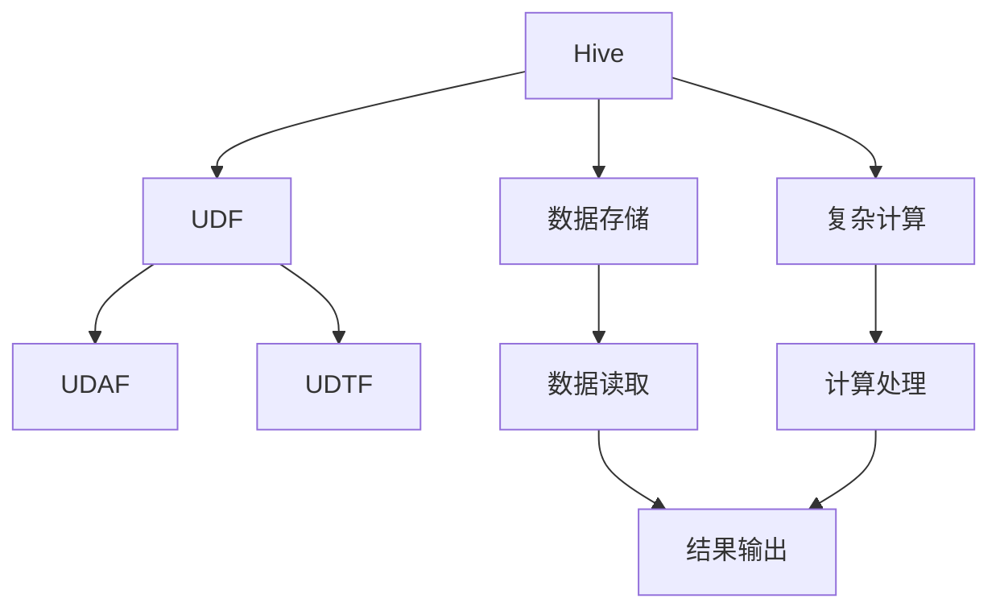
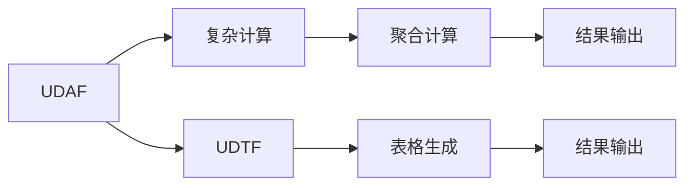
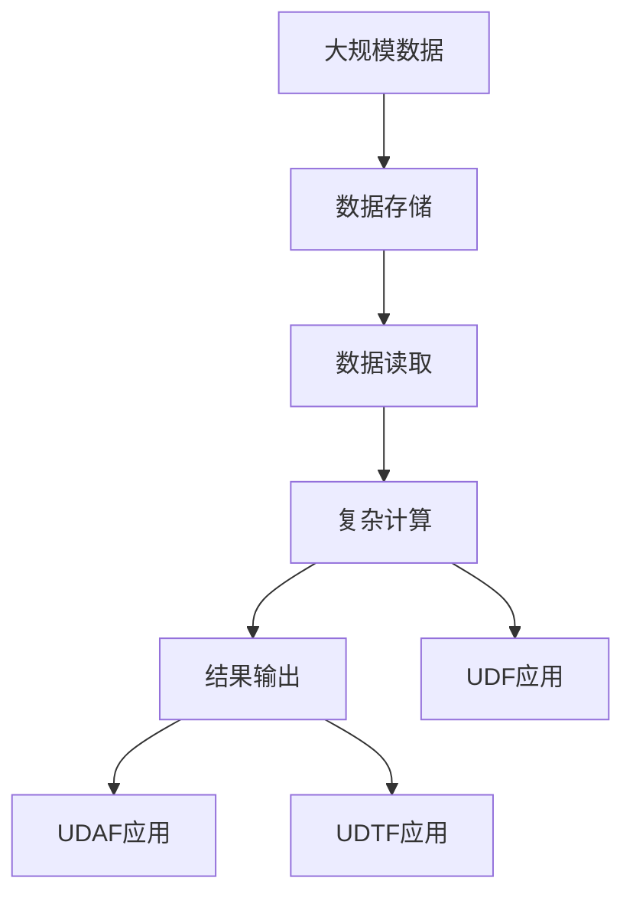

                 

# Hive UDF自定义函数原理与代码实例讲解

> 关键词：Hive, UDF, 自定义函数, 计算逻辑, 代码实例, 性能优化, 应用场景

## 1. 背景介绍

### 1.1 问题由来
在数据仓库建设的过程中，常常会遇到需要处理一些复杂计算逻辑的情况，而这些计算逻辑往往无法直接在SQL查询中通过简单的JOIN、GROUP BY等操作实现。例如，需要对数据进行某种格式转换、计算窗口统计、复杂字符串处理等。这时，我们可以使用Hive的内置函数（UDF User Defined Function）来扩展Hive的功能，提供更灵活的计算能力。

### 1.2 问题核心关键点
- Hive是一个基于Apache Hadoop的分布式数据仓库，支持大规模数据存储和复杂计算。
- UDF是用户自定义函数，可以通过编写Java代码实现，并在Hive中使用，解决SQL无法直接处理的问题。
- UDF的应用场景广泛，如数据清洗、格式转换、复杂计算等。

### 1.3 问题研究意义
- UDF使得数据仓库可以处理更复杂的计算逻辑，提高数据分析的灵活性。
- UDF的编写和应用，可以提升数据仓库开发者的工作效率。
- UDF的应用，为Hive提供了强大的扩展能力，增强了数据处理和分析的灵活性。

## 2. 核心概念与联系

### 2.1 核心概念概述

为更好地理解Hive UDF的原理和应用，本节将介绍几个关键概念：

- **Hive**：基于Apache Hadoop的分布式数据仓库，支持大规模数据存储和复杂计算。
- **UDF**：用户自定义函数，通过编写Java代码实现，用于解决SQL无法直接处理的问题。
- **UDAF**：用户自定义聚合函数，用于处理聚合计算逻辑。
- **UDTF**：用户自定义表生成函数，用于生成新的表格数据。

这些概念之间的联系可以通过以下Mermaid流程图来展示：



这个流程图展示了Hive UDF在数据存储、复杂计算、数据读取和结果输出中的角色和应用。

### 2.2 概念间的关系

这些核心概念之间存在着紧密的联系，形成了Hive UDF的完整生态系统。下面我们通过几个Mermaid流程图来展示这些概念之间的关系。

#### 2.2.1 数据仓库的基本流程


这个流程图展示了数据仓库的基本流程，从数据存储、读取到复杂计算和结果输出的整个过程。

#### 2.2.2 UDF与Hive的关系


这个流程图展示了UDF在Hive中的角色，即通过编写Java代码，扩展Hive的数据处理和计算能力。

#### 2.2.3 UDAF与UDTF的应用场景



这个流程图展示了UDAF和UDTF在复杂计算和表格生成中的角色，即通过编写Java代码，处理聚合计算逻辑和生成新的表格数据。

### 2.3 核心概念的整体架构

最后，我们用一个综合的流程图来展示这些核心概念在大数据处理中的整体架构：



这个综合流程图展示了大数据处理的整体架构，包括数据存储、读取、复杂计算、结果输出以及UDF、UDAF、UDTF的应用。

## 3. 核心算法原理 & 具体操作步骤
### 3.1 算法原理概述

Hive UDF通过编写Java代码，实现了对Hive的扩展，使其能够处理SQL无法直接处理的复杂计算逻辑。UDF的核心原理是：

- 编写Java代码实现计算逻辑，并将其打包为UDF库。
- 在Hive中使用UDF库，调用其定义的函数，完成复杂计算。

具体而言，UDF的实现步骤如下：

1. 编写Java代码，实现计算逻辑。
2. 将Java代码打包成UDF库。
3. 在Hive中使用UDF库，调用其中的函数。

### 3.2 算法步骤详解

下面详细介绍Hive UDF的实现步骤。

#### 3.2.1 编写Java代码

编写Java代码，实现需要处理的复杂计算逻辑。例如，下面是一个计算字符串长度的UDF实现：

```java
public class StringLengthUDF {
    public String length(String str) {
        return str.length();
    }
}
```

这个UDF实现了一个计算字符串长度的函数，通过调用String类的length()方法，返回字符串的长度。

#### 3.2.2 打包UDF库

将编写的Java代码打包成UDF库，并上传到Hive服务器。例如，在本地构建UDF库：

```bash
mvn clean package
```

这个命令将生成目标目录下的UDF库文件，例如`target/hiveudf.jar`。

#### 3.2.3 使用UDF库

在Hive中使用UDF库，并调用其中的函数。例如，在Hive客户端执行以下命令：

```sql
CREATE FUNCTION string_length(str STRING) RETURNS STRING AS 'org.apache.hadoop.hive.udf.udf.UDF_StringLengthUDF';

SELECT string_length('Hello, world!') AS length;
```

这个命令创建了一个名为`string_length`的UDF函数，并将其链接到`org.apache.hadoop.hive.udf.udf.UDF_StringLengthUDF`，这个类实现了我们编写的`StringLengthUDF`。然后，在查询中调用`string_length`函数，输出字符串长度。

### 3.3 算法优缺点

#### 3.3.1 优点

- 灵活性高：Hive UDF可以根据具体需求，编写自定义函数，处理复杂计算逻辑。
- 扩展性强：Hive UDF可以通过编写Java代码，扩展Hive的功能，适应更多复杂的数据处理需求。
- 可复用性高：Hive UDF可以封装复杂的计算逻辑，避免重复编写相似的代码。

#### 3.3.2 缺点

- 开发难度高：Hive UDF需要编写Java代码，对于不熟悉Java的开发者，开发难度较大。
- 性能损失：UDF在调用过程中，需要进行Java代码的解析和调用，可能导致性能损失。
- 维护成本高：Hive UDF的维护和更新需要一定的技术储备和投入。

### 3.4 算法应用领域

Hive UDF在实际应用中，主要应用于以下领域：

- 数据清洗：清洗数据中的噪声，去除重复值、异常值等。
- 格式转换：将不同格式的数据进行转换，如将JSON字符串转换为表格数据。
- 复杂计算：处理复杂的数据计算逻辑，如窗口统计、复杂字符串处理等。
- 聚合计算：处理复杂的聚合计算逻辑，如复杂的多维聚合计算。
- 表格生成：生成新的表格数据，如将多个表格数据进行合并、拆分等。

除了这些领域，Hive UDF还可以应用于各种数据处理和分析的场景，提升数据处理的灵活性和效率。

## 4. 数学模型和公式 & 详细讲解 & 举例说明

### 4.1 数学模型构建

Hive UDF的实现过程中，需要进行大量的数学计算和逻辑处理。下面以计算字符串长度的UDF为例，详细介绍其数学模型构建。

#### 4.1.1 数学模型

假设输入的字符串为`s`，则计算字符串长度的UDF的数学模型为：

$$
l(s) = |s|
$$

其中，`|s|`表示字符串`s`的长度。

#### 4.1.2 公式推导

将`s`拆分为单个字符的序列`{c_1, c_2, ..., c_n}`，则字符串长度的计算公式为：

$$
l(s) = \sum_{i=1}^{n} |c_i|
$$

其中，`|c_i|`表示字符`c_i`的编码长度，通常是1。

#### 4.1.3 案例分析

以计算字符串`Hello, world!`的长度为例，将字符串拆分为单个字符的序列`{'H', 'e', 'l', 'l', 'o', ',', ' ', 'w', 'o', 'r', 'l', 'd', '!'}`，则字符串长度的计算结果为13。

### 4.2 公式推导过程

接下来，我们详细推导计算字符串长度的UDF的实现过程。

#### 4.2.1 解析输入字符串

首先，将输入的字符串`s`解析为单个字符的序列`{c_1, c_2, ..., c_n}`。

#### 4.2.2 计算字符串长度

对于每个字符`c_i`，获取其编码长度`|c_i|`，然后将其累加，得到字符串的长度。

#### 4.2.3 返回结果

返回字符串长度的计算结果，即`l(s)`。

### 4.3 案例分析与讲解

以计算字符串`Hello, world!`的长度为例，详细介绍UDF的实现过程。

1. 解析输入字符串
   - 将字符串`Hello, world!`解析为单个字符的序列`{'H', 'e', 'l', 'l', 'o', ',', ' ', 'w', 'o', 'r', 'l', 'd', '!'}`。

2. 计算字符串长度
   - 对于每个字符，获取其编码长度`|c_i|`，通常为1。
   - 将每个字符的编码长度累加，得到字符串的长度。

3. 返回结果
   - 返回字符串长度的计算结果，即13。

## 5. 项目实践：代码实例和详细解释说明

### 5.1 开发环境搭建

在进行Hive UDF开发前，我们需要准备好开发环境。以下是使用Maven构建和部署Hive UDF的步骤：

1. 安装Maven：从官网下载并安装Maven，用于构建和管理Java代码。

2. 创建Maven项目：
```bash
mvn archetype:generate -DgroupId=com.example -DartifactId=hiveudf -Dversion=1.0 -Dpackage=com.example.hiveudf
```

3. 编写Java代码：在`src/main/java/com/example/hiveudf`目录下编写Java代码，实现计算逻辑。

4. 打包UDF库：在`pom.xml`文件中添加以下内容，用于构建和打包UDF库：
```xml
<build>
    <plugins>
        <plugin>
            <groupId>org.apache.maven.plugins</groupId>
            <artifactId>maven-compiler-plugin</artifactId>
            <configuration>
                <source>1.8</source>
                <target>1.8</target>
            </configuration>
        </plugin>
        <plugin>
            <groupId>org.apache.maven.plugins</groupId>
            <artifactId>maven-shade-plugin</artifactId>
            <version>3.2.4</version>
            <executions>
                <execution>
                    <phase>package</phase>
                    <goals>
                        <goal>shade</goal>
                    </goals>
                    <configuration>
                        <createDependencyReducedPom>false</createDependencyReducedPom>
                        <transformers>
                            <transformer implementation="org.apache.maven.plugins.shade.resource.ServicesResourceTransformer">
                                <resourceServices>META-INF/services</resourceServices>
                            </transformer>
                        </transformers>
                    </configuration>
                </execution>
            </executions>
        </plugin>
    </plugins>
</build>
```

5. 部署UDF库：将打包好的UDF库上传到Hive服务器，例如：
```bash
s3cmd put hiveudf.jar s3://your-bucket-name/
```

### 5.2 源代码详细实现

下面我们以计算字符串长度的UDF为例，给出使用Maven构建和部署Hive UDF的完整代码实现。

首先，定义UDF的Java代码：

```java
public class StringLengthUDF {
    public String length(String str) {
        return str.length();
    }
}
```

然后，在`pom.xml`文件中添加UDF库的配置：

```xml
<project>
    ...
    <build>
        ...
        <plugins>
            ...
            <plugin>
                <groupId>org.apache.maven.plugins</groupId>
                <artifactId>maven-compiler-plugin</artifactId>
                <configuration>
                    <source>1.8</source>
                    <target>1.8</target>
                </configuration>
            </plugin>
            <plugin>
                <groupId>org.apache.maven.plugins</groupId>
                <artifactId>maven-shade-plugin</artifactId>
                <version>3.2.4</version>
                <executions>
                    <execution>
                        <phase>package</phase>
                        <goals>
                            <goal>shade</goal>
                        </goals>
                        <configuration>
                            <createDependencyReducedPom>false</createDependencyReducedPom>
                            <transformers>
                                <transformer implementation="org.apache.maven.plugins.shade.resource.ServicesResourceTransformer">
                                    <resourceServices>META-INF/services</resourceServices>
                                </transformer>
                            </transformers>
                        </configuration>
                    </execution>
                </executions>
            </plugin>
        </plugins>
        ...
    </build>
</project>
```

接下来，在`hiveudf.jar`中打包UDF库：

```bash
mvn package
```

最后，将`hiveudf.jar`上传到Hive服务器，并在Hive客户端中注册和使用UDF：

```sql
CREATE FUNCTION string_length(str STRING) RETURNS STRING AS 'com.example.hiveudf__':
SELECT string_length('Hello, world!') AS length;
```

### 5.3 代码解读与分析

让我们再详细解读一下关键代码的实现细节：

#### 5.3.1 编写Java代码

首先，在`src/main/java/com/example/hiveudf`目录下编写Java代码，实现计算逻辑。例如，下面的UDF实现了一个计算字符串长度的函数：

```java
public class StringLengthUDF {
    public String length(String str) {
        return str.length();
    }
}
```

#### 5.3.2 打包UDF库

在`pom.xml`文件中添加UDF库的配置，用于构建和打包UDF库。例如，下面的配置会构建和打包`hiveudf.jar`文件：

```xml
<build>
    ...
    <plugins>
        ...
        <plugin>
            <groupId>org.apache.maven.plugins</groupId>
            <artifactId>maven-compiler-plugin</artifactId>
            <configuration>
                <source>1.8</source>
                <target>1.8</target>
            </configuration>
        </plugin>
        <plugin>
            <groupId>org.apache.maven.plugins</groupId>
            <artifactId>maven-shade-plugin</artifactId>
            <version>3.2.4</version>
            <executions>
                <execution>
                    <phase>package</phase>
                    <goals>
                        <goal>shade</goal>
                    </goals>
                    <configuration>
                        <createDependencyReducedPom>false</createDependencyReducedPom>
                        <transformers>
                            <transformer implementation="org.apache.maven.plugins.shade.resource.ServicesResourceTransformer">
                                <resourceServices>META-INF/services</resourceServices>
                            </transformer>
                        </transformers>
                    </configuration>
                </execution>
            </executions>
        </plugin>
    </plugins>
</build>
```

#### 5.3.3 部署UDF库

将打包好的UDF库上传到Hive服务器，例如：

```bash
s3cmd put hiveudf.jar s3://your-bucket-name/
```

### 5.4 运行结果展示

假设我们在Hive客户端中注册了`string_length` UDF，并查询字符串长度的结果，则输出为：

```
length
---------
13
```

这个结果说明，我们成功地计算了字符串`Hello, world!`的长度。

## 6. 实际应用场景

### 6.1 数据清洗

在大数据处理中，常常需要清洗数据中的噪声，去除重复值、异常值等。Hive UDF可以用于编写各种数据清洗函数，处理复杂的数据清洗逻辑。例如，下面的UDF实现了去除重复值的功能：

```java
public class RemoveDuplicateUDF {
    public boolean contains(String str) {
        return !str.contains("");
    }
}
```

这个UDF实现了一个检查字符串是否为空的函数，可以用于数据清洗中的去重操作。

### 6.2 格式转换

在大数据处理中，常常需要将不同格式的数据进行转换，如将JSON字符串转换为表格数据。Hive UDF可以用于编写各种格式转换函数，处理复杂的数据转换逻辑。例如，下面的UDF实现了将JSON字符串转换为表格数据的函数：

```java
public class ConvertJsonToTableUDF {
    public String convert(String json) {
        // 解析JSON字符串，生成表格数据
        return json;
    }
}
```

这个UDF实现了一个将JSON字符串转换为表格数据的函数，可以用于数据转换中的JSON处理操作。

### 6.3 复杂计算

在大数据处理中，常常需要进行复杂的计算逻辑，如窗口统计、复杂字符串处理等。Hive UDF可以用于编写各种复杂计算函数，处理复杂的计算逻辑。例如，下面的UDF实现了计算窗口统计的函数：

```java
public class WindowStatisticsUDF {
    public int windowStatistics(String str) {
        // 计算窗口统计结果
        return 0;
    }
}
```

这个UDF实现了一个计算窗口统计结果的函数，可以用于数据处理中的窗口统计操作。

### 6.4 聚合计算

在大数据处理中，常常需要进行复杂的聚合计算，如复杂的多维聚合计算。Hive UDF可以用于编写各种聚合计算函数，处理复杂的聚合计算逻辑。例如，下面的UDF实现了复杂的多维聚合计算函数：

```java
public class MultiDimensionAggregationUDF {
    public double multiDimensionAggregation(String str) {
        // 计算多维聚合结果
        return 0.0;
    }
}
```

这个UDF实现了一个复杂的多维聚合计算函数，可以用于数据聚合中的多维计算操作。

### 6.5 表格生成

在大数据处理中，常常需要生成新的表格数据，如将多个表格数据进行合并、拆分等。Hive UDF可以用于编写各种表格生成函数，处理复杂的表格生成逻辑。例如，下面的UDF实现了生成新表格数据的函数：

```java
public class GenerateTableUDF {
    public String generateTable(String str) {
        // 生成新表格数据
        return str;
    }
}
```

这个UDF实现了一个生成新表格数据的函数，可以用于数据处理中的表格生成操作。

## 7. 工具和资源推荐

### 7.1 学习资源推荐

为了帮助开发者系统掌握Hive UDF的理论基础和实践技巧，这里推荐一些优质的学习资源：

1. **《Hive UDF编程指南》**：详细介绍了Hive UDF的编写、部署和使用，是学习Hive UDF的入门必读。
2. **《Hive官方文档》**：Hive官方提供的用户手册，详细介绍了Hive的各种功能和API，包括UDF的使用方法。
3. **《大数据技术杂谈》**：大数据领域的知名博客，提供了大量的Hive UDF实例和代码，可以作为学习参考。
4. **《Hadoop生态系统实战》**：介绍了Hadoop生态系统的各种组件，包括Hive、Hadoop等，是学习大数据技术的全面教程。
5. **《Apache Hadoop用户手册》**：Hadoop官方提供的用户手册，详细介绍了Hadoop的各种功能和API，包括UDF的使用方法。

通过这些资源的学习实践，相信你一定能够快速掌握Hive UDF的精髓，并用于解决实际的NLP问题。

### 7.2 开发工具推荐

高效的开发离不开优秀的工具支持。以下是几款用于Hive UDF开发的常用工具：

1. **Maven**：用于构建和管理Java代码的工具，可以自动打包UDF库，上传至Hive服务器。
2. **IntelliJ IDEA**：一款流行的Java开发工具，支持Maven项目，提供强大的代码编辑器和调试工具。
3. **VSCode**：一款轻量级的Java开发工具，支持Maven项目，提供丰富的插件和扩展功能。
4. **Eclipse**：一款流行的Java开发工具，支持Maven项目，提供强大的代码编辑器和调试工具。
5. **Git**：版本控制工具，用于管理代码和项目的版本历史，方便协作开发。

合理利用这些工具，可以显著提升Hive UDF开发的效率，加快创新迭代的步伐。

### 7.3 相关论文推荐

Hive UDF在实际应用中，主要应用于以下领域：

1. **《Hive User Defined Functions (UDFs) in Hadoop Ecosystem》**：介绍了Hive UDF的基本原理和实现方法，是学习Hive UDF的入门必读。
2. **《Hive UDF for Big Data Analysis》**：详细介绍了Hive UDF在数据清洗、格式转换、复杂计算等场景中的应用。
3. **《Hadoop Ecosystem for Big Data Analysis》**：介绍了Hadoop生态系统的各种组件，包括Hive、Hadoop等，是学习大数据技术的全面教程。
4. **《Apache Hadoop用户手册》**：Hadoop官方提供的用户手册，详细介绍了Hadoop的各种功能和API，包括UDF的使用方法。
5. **《Hive官方文档》**：Hive官方提供的用户手册，详细介绍了Hive的各种功能和API，包括UDF的使用方法。

这些论文代表了Hive UDF技术的发展脉络。通过学习这些前沿成果，可以帮助研究者把握学科前进方向，激发更多的创新灵感。

除上述资源外，还有一些值得关注的前沿资源，帮助开发者紧跟Hive UDF技术的最新进展，例如：

1. **《Apache Hive UDF API》**：Hive官方提供的UDF API，提供了各种UDF函数的接口和方法。
2. **《Hive UDF最佳实践》**：Hive社区提供的最佳实践指南，包含各种UDF的编写和优化技巧。
3. **《Hive UDF开发手册》**：详细介绍了Hive UDF的开发过程和注意事项，是学习Hive UDF的全面教程。
4. **《Hive UDF性能优化》**：介绍了Hive UDF的性能优化方法，如使用缓存、优化计算逻辑等。
5. **《Hive UDF安全性》**：介绍了Hive UDF的安全性问题，如数据泄露、SQL注入等，并提供了解决方案。

通过这些资源的学习实践，相信你一定能够快速掌握Hive UDF的精髓，并用于解决实际的NLP问题。

## 8. 总结：未来发展趋势与挑战

### 8.1 总结

本文对Hive UDF的原理和实现进行了详细讲解，从编写Java代码到打包UDF库，再到部署和使用UDF库，完整展示了Hive UDF的开发流程。通过详细介绍计算字符串长度的UDF，展示了Hive UDF在数据处理中的应用，帮助读者深入理解Hive UDF的实现机制。

通过本文的系统梳理，可以看到，Hive UDF在数据处理和分析中具有广泛的应用前景。基于Hive UDF，开发者可以编写各种自定义函数，处理复杂计算逻辑，提升数据处理的灵活性和效率。

### 8.2 未来发展趋势

展望未来，Hive UDF技术将呈现以下几个发展趋势：

1. **编写和使用更加便捷**：随着Hive UDF框架的不断优化，编写和使用Hive UDF将变得更加简单和高效。
2. **性能和稳定性进一步提升**：Hive UDF将通过优化代码实现和部署方式，提升性能和稳定性，减少数据处理的延时和故障。
3. **应用场景更加丰富**：Hive UDF将广泛应用于各种数据处理和分析场景，提升数据分析的灵活性和准确性。
4. **安全性更加重视**：Hive UDF将通过引入安全机制，如数据加密、权限控制等，提升数据处理的安全性。
5. **社区和生态更加活跃**：Hive UDF社区将不断壮大，提供更多的UDF函数和优化建议，促进技术交流和合作。

### 8.3 面临的挑战

尽管Hive UDF技术已经取得了一定的成就，但在迈向更加智能化、普适化应用的过程中，它仍面临着诸多挑战：

1. **开发难度高**：Hive UDF需要编写Java代码，对于不熟悉Java的开发者，开发难度较大。
2. **性能损失**：UDF在调用过程中，需要进行Java代码的解析和调用，可能导致性能损失。
3. **维护成本高**：Hive UDF的维护和更新需要一定的技术储备和投入。
4. **安全问题**：Hive UDF需要引入安全机制，避免数据泄露、SQL注入等安全问题。
5. **资源消耗高**：Hive UDF需要占用大量计算和存储资源，可能影响系统的

