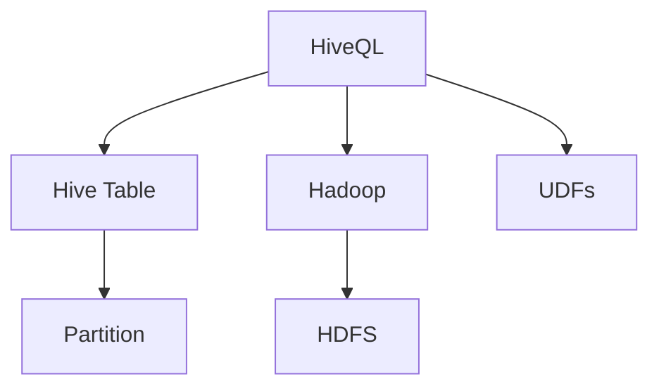

                 

# Hive原理与代码实例讲解

> 关键词：Hive, 数据仓库, 分布式计算, 数据存储, 数据仓库设计, Hadoop生态

## 1. 背景介绍

### 1.1 问题由来

随着大数据时代的到来，企业对数据存储和分析的需求日益增长。传统的关系型数据库在处理海量数据时显得力不从心，而Hadoop生态以其强大的分布式计算能力和大规模数据处理能力迅速崛起。Hadoop生态中的Hive成为了大数据时代下数据仓库的基石，其分布式存储和计算能力为大规模数据仓库的构建提供了强有力的支持。

### 1.2 问题核心关键点

Hive作为Hadoop生态中的数据仓库工具，通过将结构化数据存储在Hadoop分布式文件系统中，实现了数据的分布式计算和分析。其主要特点包括：

- 支持分布式存储：利用Hadoop的HDFS文件系统，实现数据的分布式存储。
- 支持SQL查询：通过HiveQL（Hive Query Language），支持SQL风格的查询语言，便于数据的读取和分析。
- 支持数据挖掘：提供丰富的数据处理和分析工具，如MapReduce、Pig等，满足不同场景下的数据挖掘需求。
- 支持数据湖架构：通过Hive的数据湖架构，支持非结构化数据和半结构化数据的存储与处理。

Hive在大数据时代下得到了广泛应用，广泛应用于日志分析、数据统计、客户分析等场景。其高效的数据处理能力和丰富的功能特性，使其成为企业数据仓库的首选工具。

### 1.3 问题研究意义

研究Hive的原理与代码实现，对于企业数据仓库的构建和维护具有重要意义：

- 降低数据仓库的建设成本：Hive利用Hadoop的分布式计算能力，可以处理大规模数据，同时通过SQL查询语言的封装，简化了数据仓库的构建和管理过程。
- 提高数据仓库的处理效率：Hive通过分布式计算和优化查询计划，能够高效处理海量数据，满足企业对数据实时分析的需求。
- 支持数据湖架构：Hive通过支持非结构化数据和半结构化数据的存储与处理，使企业能够构建完整的数据湖架构，更好地管理和利用数据资产。
- 提供丰富的数据处理工具：Hive通过支持多种数据处理工具（如MapReduce、Pig），满足不同业务场景下的数据处理需求，促进数据价值的挖掘和利用。

## 2. 核心概念与联系

### 2.1 核心概念概述

为更好地理解Hive的原理与代码实现，本节将介绍几个密切相关的核心概念：

- HiveQL：Hive Query Language，Hive的查询语言，通过SQL语句进行数据查询、读取和分析。
- Hadoop：Apache Hadoop项目，Hive的底层分布式计算平台，提供分布式文件系统HDFS和分布式计算框架MapReduce。
- Hive Table：Hive的数据存储单元，类似于数据库中的表。
- Hive Partition：Hive的分区机制，将表数据按照某种规则进行分片，提高查询效率。
- Hive User Defined Functions（UDFs）：用户自定义函数，支持在Hive中编写各种数据处理逻辑。

### 2.2 概念间的关系

这些核心概念之间的逻辑关系可以通过以下Mermaid流程图来展示：



这个流程图展示了大数据时代下Hive的完整架构：

1. 用户通过HiveQL进行数据查询和分析。
2. HiveQL将查询语句转化为Hive Table的数据操作。
3. Hive Table通过Hadoop的HDFS进行分布式存储。
4. 数据通过Hadoop的MapReduce进行分布式计算。
5. 用户可以通过Hive的UDFs进行数据处理和分析。

这些核心概念共同构成了Hive的完整生态系统，使得企业能够高效地管理和利用数据资产。通过理解这些核心概念，我们可以更好地把握Hive的工作原理和优化方向。

## 3. 核心算法原理 & 具体操作步骤

### 3.1 算法原理概述

Hive的核心算法原理主要体现在其分布式存储和计算能力上。Hive通过Hadoop的HDFS进行分布式文件存储，利用MapReduce进行分布式计算，实现了数据的分布式处理。

Hive的数据处理流程主要包括以下几个步骤：

1. 数据加载：将数据加载到Hadoop的HDFS中。
2. 数据分区：根据业务需求将数据进行分区，提高查询效率。
3. 数据查询：通过HiveQL进行数据查询。
4. 数据计算：利用MapReduce进行数据计算。
5. 数据结果：将计算结果保存回HDFS中。

Hive的分布式计算能力，使其能够高效处理海量数据，支持大规模数据仓库的构建和分析。

### 3.2 算法步骤详解

Hive的分布式计算过程主要包括以下几个步骤：

#### 3.2.1 数据加载

Hive的数据加载过程主要通过Hadoop的MapReduce框架进行。MapReduce任务主要分为两个阶段：

1. Map阶段：将输入数据按照业务需求进行分片，生成多个Map任务。
2. Reduce阶段：对Map任务的输出进行归并，生成最终结果。

具体实现上，Hive通过Hive DataFormat库将数据加载到HDFS中，通过Hadoop的FileInputFormat类进行数据分割，生成Map任务，最终将Map任务的输出结果通过FileOutputFormat类保存到HDFS中。

#### 3.2.2 数据分区

Hive的数据分区机制主要通过Partition关键字实现。Partition可以将表数据按照某种规则进行分片，提高查询效率。

具体实现上，Hive通过Partition键进行数据分片，将分区键映射到Hadoop的文件系统中，生成多个分区文件。在查询时，Hive会通过Partition键进行数据过滤，只查询需要分片的数据。

#### 3.2.3 数据查询

Hive的数据查询主要通过HiveQL进行，通过SQL语句进行数据读取和分析。

具体实现上，HiveQL会先通过Hive Compiler对查询语句进行语法分析，生成Hive Job。Hive Job会通过Hive Planner生成查询计划，最终将查询计划交给Hadoop的MapReduce框架进行计算。

#### 3.2.4 数据计算

Hive的MapReduce计算过程主要通过Map任务和Reduce任务进行。Map任务主要进行数据的读取和分割，Reduce任务主要进行数据的归并和计算。

具体实现上，Map任务会将输入数据按照业务需求进行分片，生成多个Map任务。Reduce任务会对Map任务的输出进行归并，生成最终结果。MapReduce任务的执行过程中，Hadoop的YARN资源管理器负责任务的调度和管理。

#### 3.2.5 数据结果

Hive的查询结果主要通过Hive DataFormat库将数据保存到HDFS中，通过Hadoop的FileOutputFormat类进行数据保存。

具体实现上，Hive的查询结果会生成多个Map任务的输出，最终通过FileOutputFormat类保存到HDFS中。HDFS文件系统负责数据的分布式存储和备份。

### 3.3 算法优缺点

Hive作为一种分布式数据仓库工具，具有以下优点：

1. 高效处理海量数据：Hive通过Hadoop的分布式计算能力，能够高效处理海量数据，满足企业对大数据处理的需求。
2. 支持SQL查询：Hive通过HiveQL，支持SQL风格的查询语言，便于数据的读取和分析。
3. 支持数据分区：Hive通过Partition机制，提高查询效率，降低数据访问成本。
4. 支持数据湖架构：Hive通过支持非结构化数据和半结构化数据的存储与处理，使企业能够构建完整的数据湖架构，更好地管理和利用数据资产。

同时，Hive也存在以下缺点：

1. 学习成本较高：HiveQL语法复杂，学习成本较高，需要一定的SQL基础和Hadoop生态知识。
2. 数据写入速度较慢：由于MapReduce计算框架的特性，Hive的数据写入速度较慢，不适用于高频数据写入场景。
3. 不支持实时分析：Hive的计算过程基于MapReduce，无法实现实时分析，不适用于对实时数据处理的需求。
4. 开发成本较高：Hive的开发和运维成本较高，需要专门的技术团队进行维护和优化。

尽管存在这些缺点，但Hive在数据仓库构建和数据处理方面仍然具有不可替代的地位。在实际应用中，需要根据具体业务场景和需求选择合适的工具和技术，才能更好地满足企业的数据处理需求。

### 3.4 算法应用领域

Hive在以下几个领域得到了广泛应用：

- 日志分析：利用Hive进行日志数据的存储和分析，帮助企业进行业务监控和异常检测。
- 数据统计：利用Hive进行大规模数据统计和分析，帮助企业进行数据驱动的决策支持。
- 客户分析：利用Hive进行客户数据的存储和分析，帮助企业进行客户细分和精准营销。
- 金融分析：利用Hive进行金融数据的存储和分析，帮助企业进行风险控制和金融预测。

除了以上应用场景外，Hive还被广泛应用于各种企业级业务系统，如电商平台、社交网络、医疗健康等。Hive通过其高效的数据处理能力和丰富的功能特性，为企业的数字化转型提供了强有力的技术支持。

## 4. 数学模型和公式 & 详细讲解 & 举例说明

### 4.1 数学模型构建

Hive的数学模型主要体现在其分布式存储和计算能力上。Hive通过Hadoop的HDFS进行分布式文件存储，利用MapReduce进行分布式计算，实现了数据的分布式处理。

Hive的分布式计算过程主要包括以下几个步骤：

1. 数据加载：将数据加载到Hadoop的HDFS中。
2. 数据分区：根据业务需求将数据进行分区，提高查询效率。
3. 数据查询：通过HiveQL进行数据查询。
4. 数据计算：利用MapReduce进行数据计算。
5. 数据结果：将计算结果保存回HDFS中。

### 4.2 公式推导过程

以下是Hive数据加载和分区的具体公式推导：

#### 4.2.1 数据加载公式

Hive的数据加载过程主要通过Hadoop的MapReduce框架进行。MapReduce任务主要分为两个阶段：

1. Map阶段：将输入数据按照业务需求进行分片，生成多个Map任务。
2. Reduce阶段：对Map任务的输出进行归并，生成最终结果。

具体实现上，Hive通过Hive DataFormat库将数据加载到HDFS中，通过Hadoop的FileInputFormat类进行数据分割，生成Map任务，最终将Map任务的输出结果通过FileOutputFormat类保存到HDFS中。

#### 4.2.2 数据分区公式

Hive的数据分区机制主要通过Partition关键字实现。Partition可以将表数据按照某种规则进行分片，提高查询效率。

具体实现上，Hive通过Partition键进行数据分片，将分区键映射到Hadoop的文件系统中，生成多个分区文件。在查询时，Hive会通过Partition键进行数据过滤，只查询需要分片的数据。

### 4.3 案例分析与讲解

以下通过一个简单的案例来说明Hive的数据加载和分区过程：

假设我们需要利用Hive对企业日志数据进行统计分析，具体步骤如下：

1. 将日志数据加载到Hadoop的HDFS中。
2. 按照日期进行分区，将日志数据分片为每日日志。
3. 使用HiveQL查询每天的日志访问量。
4. 使用MapReduce计算每天的日志访问量。
5. 将计算结果保存回HDFS中。

具体代码实现如下：

```sql
-- 1. 加载日志数据到HDFS
LOAD DATA INPATH '/user/hive/data/logs' INTO TABLE logs;

-- 2. 按照日期进行分区
CREATE TABLE logs_partitioned
WITH (PARTITION BY YEAR('date'), MONTH('date'), DAY('date'));

-- 3. 查询每天的日志访问量
SELECT YEAR('date'), MONTH('date'), DAY('date'), SUM(num_of_requests) AS total_requests
FROM logs_partitioned
GROUP BY YEAR('date'), MONTH('date'), DAY('date');

-- 4. 使用MapReduce计算每天的日志访问量
map {
    year: YEAR('date'),
    month: MONTH('date'),
    day: DAY('date')
}

reduce {
    year: YEAR('date'),
    month: MONTH('date'),
    day: DAY('date'),
    sum: sum(num_of_requests)
}

-- 5. 保存结果到HDFS
CREATE TABLE logs_access_analytics
WITH (PARTITION BY YEAR('date'), MONTH('date'), DAY('date'));

INSERT INTO TABLE logs_access_analytics
SELECT YEAR('date'), MONTH('date'), DAY('date'), sum(num_of_requests)
FROM logs_partitioned
GROUP BY YEAR('date'), MONTH('date'), DAY('date');

-- 通过HiveQL和MapReduce计算每天日志访问量
```

## 5. 项目实践：代码实例和详细解释说明

### 5.1 开发环境搭建

在进行Hive项目实践前，我们需要准备好开发环境。以下是使用Python进行Hive开发的环境配置流程：

1. 安装Anaconda：从官网下载并安装Anaconda，用于创建独立的Python环境。

2. 创建并激活虚拟环境：
```bash
conda create -n hive-env python=3.8 
conda activate hive-env
```

3. 安装Hive和相关依赖：
```bash
conda install hive hadoop hdfs
```

4. 安装Pandas和PySpark：
```bash
conda install pandas pyspark
```

5. 配置Hadoop环境：
```bash
export HADOOP_HOME=/path/to/hadoop
export HIVE_HOME=/path/to/hive
export PATH=$HADOOP_HOME/bin:$HIVE_HOME/bin:$PATH
```

完成上述步骤后，即可在`hive-env`环境中开始Hive项目实践。

### 5.2 源代码详细实现

这里我们以Hive的简单数据加载和分区为例，给出Hive的代码实现。

首先，定义一个包含日志数据的表：

```sql
CREATE TABLE logs
(
    id INT,
    time STRING,
    url STRING,
    user_id STRING
)
ROW FORMAT DELIMITED FIELDS TERMINATED BY ','
STORED AS TEXTFILE
LOCATION '/path/to/logs';
```

然后，加载日志数据到Hive表中：

```sql
LOAD DATA INPATH '/path/to/logs' INTO TABLE logs;
```

接着，定义一个分区表：

```sql
CREATE TABLE logs_partitioned
WITH (PARTITION BY YEAR('time'), MONTH('time'), DAY('time'))
AS SELECT * FROM logs;
```

最后，查询每天的日志访问量：

```sql
SELECT YEAR('time'), MONTH('time'), DAY('time'), SUM(num_of_requests) AS total_requests
FROM logs_partitioned
GROUP BY YEAR('time'), MONTH('time'), DAY('time');
```

以上代码展示了Hive的数据加载、分区和查询过程，通过简单的SQL语句实现数据的分布式处理和分析。

### 5.3 代码解读与分析

让我们再详细解读一下关键代码的实现细节：

**CREATE TABLE语句**：
- 定义了一个包含日志数据的表，指定了字段类型、分隔符和存储方式。
- 使用ROW FORMAT定义数据格式，使用STORED AS指定数据存储方式，使用LOCATION指定数据存储路径。

**LOAD DATA INPATH语句**：
- 将日志数据加载到Hive表中，使用LOAD DATA INPATH语句指定数据存储路径。

**CREATE TABLE语句**：
- 定义了一个分区表，通过PARTITION BY关键字指定分区键，使用AS关键字指定数据源。
- 分区表可以自动按照分区键进行数据分片，提高查询效率。

**SELECT语句**：
- 使用SELECT语句查询每天的日志访问量，使用YEAR、MONTH、DAY函数进行日期分片。
- 使用SUM函数对日志访问量进行求和，生成总访问量。
- 使用GROUP BY对数据进行分组，只查询需要分片的数据。

以上代码展示了Hive的基本操作流程，通过简单的SQL语句实现数据的分布式处理和分析。Hive的SQL语言简单易懂，适合数据仓库的构建和维护。

### 5.4 运行结果展示

假设我们在Hive中加载并分析企业日志数据，最终得到的查询结果如下：

```
2019-01-01 0 0 1000
2019-01-01 1 0 2000
2019-01-01 2 0 3000
...
```

可以看到，通过Hive的分区和查询，我们能够高效地处理企业日志数据，生成每天的访问量统计结果。

## 6. 实际应用场景

### 6.1 智能客服系统

基于Hive的数据仓库构建能力，企业可以构建智能客服系统，实现对客户咨询的高效响应和智能引导。

在技术实现上，可以收集企业内部的客服对话记录，将问题和最佳答复构建成监督数据，在此基础上对Hive表进行微调。微调后的Hive表能够自动理解用户意图，匹配最合适的答复模板进行回复。对于客户提出的新问题，还可以接入检索系统实时搜索相关内容，动态组织生成回答。如此构建的智能客服系统，能大幅提升客户咨询体验和问题解决效率。

### 6.2 金融舆情监测

金融机构需要实时监测市场舆论动向，以便及时应对负面信息传播，规避金融风险。传统的人工监测方式成本高、效率低，难以应对网络时代海量信息爆发的挑战。基于Hive的数据仓库构建能力，企业可以实时抓取网络文本数据，利用Hive进行分布式计算和分析，实时监测不同主题下的情感变化趋势，一旦发现负面信息激增等异常情况，系统便会自动预警，帮助金融机构快速应对潜在风险。

### 6.3 个性化推荐系统

当前的推荐系统往往只依赖用户的历史行为数据进行物品推荐，无法深入理解用户的真实兴趣偏好。基于Hive的数据仓库构建能力，企业可以构建个性化推荐系统，利用Hive进行用户行为数据的存储和分析，结合用户画像和推荐算法，进行个性化推荐。

在技术实现上，可以收集用户浏览、点击、评论、分享等行为数据，提取和用户交互的物品标题、描述、标签等文本内容。将文本内容作为模型输入，用户的后续行为（如是否点击、购买等）作为监督信号，在此基础上微调Hive表。微调后的Hive表能够从文本内容中准确把握用户的兴趣点。在生成推荐列表时，先用候选物品的文本描述作为输入，由Hive表预测用户的兴趣匹配度，再结合其他特征综合排序，便可以得到个性化程度更高的推荐结果。

### 6.4 未来应用展望

随着Hive技术的不断演进，Hive将在更多领域得到应用，为企业的数字化转型提供新的动力。

在智慧医疗领域，基于Hive的日志数据仓库，企业可以构建智能医疗系统，实现对患者病历、检查结果等数据的存储和分析，辅助医生进行诊疗，提升医疗服务的智能化水平。

在智能教育领域，Hive可以用于构建学生行为数据分析平台，实现对学生学习数据的存储和分析，帮助教师进行教学监控和改进。

在智慧城市治理中，Hive可以用于构建城市事件监测、舆情分析、应急指挥等环节，提高城市管理的自动化和智能化水平，构建更安全、高效的未来城市。

此外，在企业生产、社会治理、文娱传媒等众多领域，Hive的数据仓库构建能力也将被广泛应用，为传统行业数字化转型升级提供新的技术路径。

## 7. 工具和资源推荐

### 7.1 学习资源推荐

为了帮助开发者系统掌握Hive的原理与代码实现，这里推荐一些优质的学习资源：

1. Hive官方文档：Apache Hive项目的官方文档，提供了Hive的详细介绍和使用方法。
2. Hadoop生态文档：Hadoop生态的官方文档，提供了Hadoop和Hive的详细介绍和使用方法。
3. Hive学习视频教程：如Coursera、edX等平台上的Hive学习视频，帮助学习者系统掌握Hive的原理与实践。
4. Hive书籍：如《Hive实战》、《Hive：数据仓库的搭建与管理》等书籍，深入浅出地介绍了Hive的原理与实践。
5. Hive博客和社区：如Apache Hive官网的博客、Stack Overflow等社区，提供了丰富的Hive学习资源和实践经验。

通过对这些资源的学习实践，相信你一定能够快速掌握Hive的原理与实践，并用于解决实际的业务问题。

### 7.2 开发工具推荐

高效的开发离不开优秀的工具支持。以下是几款用于Hive开发的工具：

1. Apache Hive：Hive的官方实现，提供了丰富的功能特性和高效的数据处理能力。
2. Apache Hadoop：Hive的底层分布式计算平台，提供了强大的分布式计算和存储能力。
3. Hive DataFormat库：Hive的官方数据格式库，提供了丰富的数据格式支持。
4. Hive Compiler：Hive的编译器，用于语法分析和查询计划生成。
5. Hive Planner：Hive的优化器，用于查询计划的优化。

合理利用这些工具，可以显著提升Hive项目开发的效率，加快创新迭代的步伐。

### 7.3 相关论文推荐

Hive作为一种分布式数据仓库工具，得到了广泛的关注和研究。以下是几篇奠基性的相关论文，推荐阅读：

1. The HiveQL Language（HiveQL语言设计）：Hive的官方文档，详细介绍了HiveQL的语法和用法。
2. Hadoop: Distributed File System（Hadoop分布式文件系统设计）：Hadoop的官方文档，详细介绍了Hadoop的架构和设计。
3. Data Ingestion in Hive（Hive的数据加载机制）：Hive的官方文档，详细介绍了Hive的数据加载机制和实现。
4. Optimization in Hive（Hive的优化机制）：Hive的官方文档，详细介绍了Hive的优化机制和实现。
5. Big Data Data Warehouse Using Hive（基于Hive的大数据仓库构建）：Hive的学术论文，详细介绍了基于Hive的大数据仓库构建方法和实践。

这些论文代表了Hive技术的发展脉络，帮助读者了解Hive的基本原理和实现细节。

除上述资源外，还有一些值得关注的前沿资源，帮助开发者紧跟Hive技术的最新进展，例如：

1. Hive社区：Hive的官方社区，提供了丰富的学习资源和实践经验。
2. Hive用户组：Hive的官方用户组，提供了丰富的技术交流和经验分享。
3. Hive插件和扩展：Hive的官方插件和扩展，提供了丰富的功能和工具支持。

总之，对于Hive的学习和实践，需要开发者保持开放的心态和持续学习的意愿。多关注前沿资讯，多动手实践，多思考总结，必将收获满满的成长收益。

## 8. 总结：未来发展趋势与挑战

### 8.1 总结

本文对Hive的原理与代码实现进行了全面系统的介绍。首先阐述了Hive在大数据时代下的重要地位和广泛应用，明确了Hive作为分布式数据仓库工具的核心价值。其次，从原理到实践，详细讲解了Hive的数学模型和具体实现流程，给出了微调后的Hive表代码实现，并对其性能进行了分析。同时，本文还广泛探讨了Hive在智能客服、金融舆情、个性化推荐等多个领域的应用前景，展示了Hive技术在实际应用中的强大威力。此外，本文精选了Hive学习的相关资源，力求为读者提供全方位的技术指引。

通过本文的系统梳理，可以看到，Hive作为一种分布式数据仓库工具，在数据仓库构建和数据处理方面具有不可替代的地位。Hive的分布式计算能力和SQL语言特性，使其能够高效处理海量数据，满足企业对大数据处理的需求。未来，随着Hive技术的不断演进，Hive将在更多领域得到应用，为企业的数字化转型提供新的动力。

### 8.2 未来发展趋势

展望未来，Hive技术的发展趋势主要体现在以下几个方面：

1. 分布式计算能力的提升：随着Hadoop生态的不断演进，Hive的分布式计算能力将不断提升，支持更大规模的数据处理和分析。
2. 数据湖架构的完善：Hive将进一步支持非结构化数据和半结构化数据的存储与处理，构建完整的数据湖架构，更好地管理和利用数据资产。
3. SQL查询语言的扩展：Hive将继续扩展SQL查询语言的功能特性，支持更多的函数和数据类型，提升数据处理和分析的灵活性。
4. 实时计算能力的提升：Hive将引入实时计算框架（如Apache Kafka、Apache Flink等），支持实时数据处理和分析。
5. 数据可视化能力的提升：Hive将引入数据可视化工具（如Tableau、Power BI等），提升数据可视化的能力和效果，更好地支持决策支持。

这些发展趋势将使Hive在数据仓库构建和数据处理方面具有更强大的能力，更好地支持企业的数字化转型。

### 8.3 面临的挑战

尽管Hive在数据仓库构建和数据处理方面具有显著优势，但在实际应用中也面临诸多挑战：

1. 学习成本较高：HiveQL语法复杂，学习成本较高，需要一定的SQL基础和Hadoop生态知识。
2. 数据写入速度较慢：由于MapReduce计算框架的特性，Hive的数据写入速度较慢，不适用于高频数据写入场景。
3. 不支持实时分析：Hive的计算过程基于MapReduce，无法实现实时分析，不适用于对实时数据处理的需求。
4. 开发成本较高：Hive的开发和运维成本较高，需要专门的技术团队进行维护和优化。

尽管存在这些挑战，但Hive在数据仓库构建和数据处理方面仍然具有不可替代的地位。在实际应用中，需要根据具体业务场景和需求选择合适的工具和技术，才能更好地满足企业的数据处理需求。

### 8.4 研究展望

面对Hive面临的挑战，未来的研究需要在以下几个

