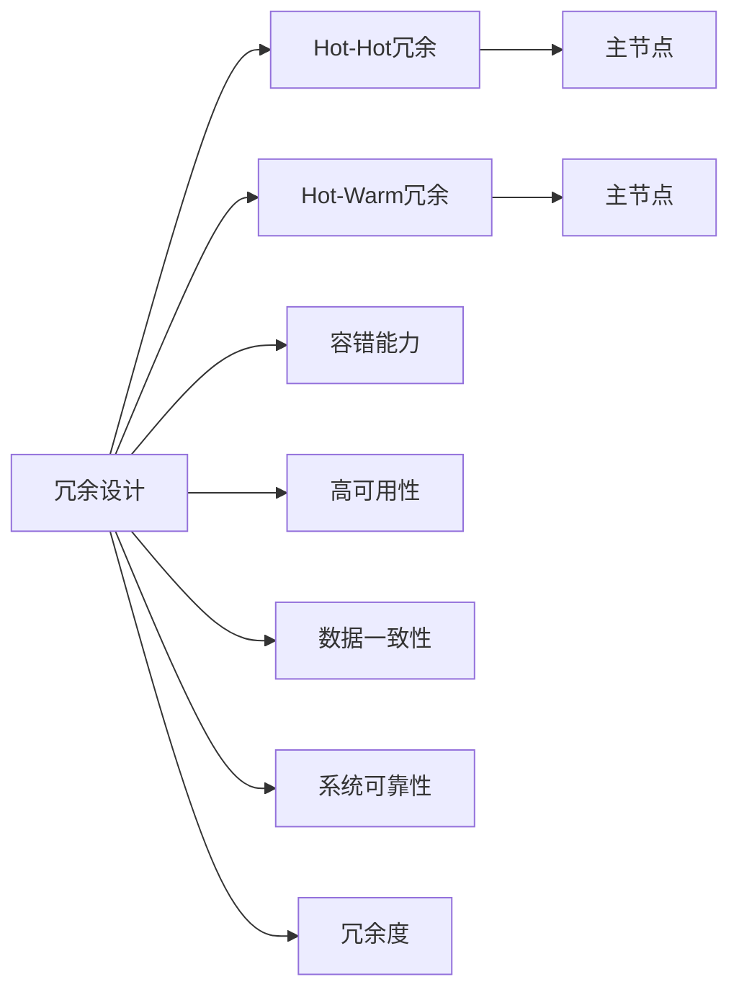
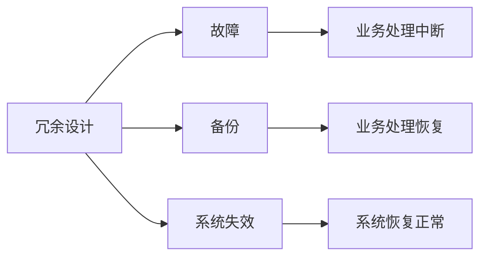
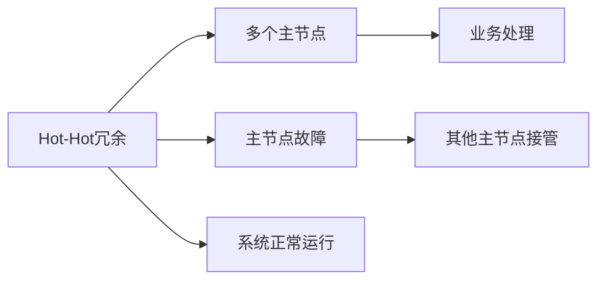
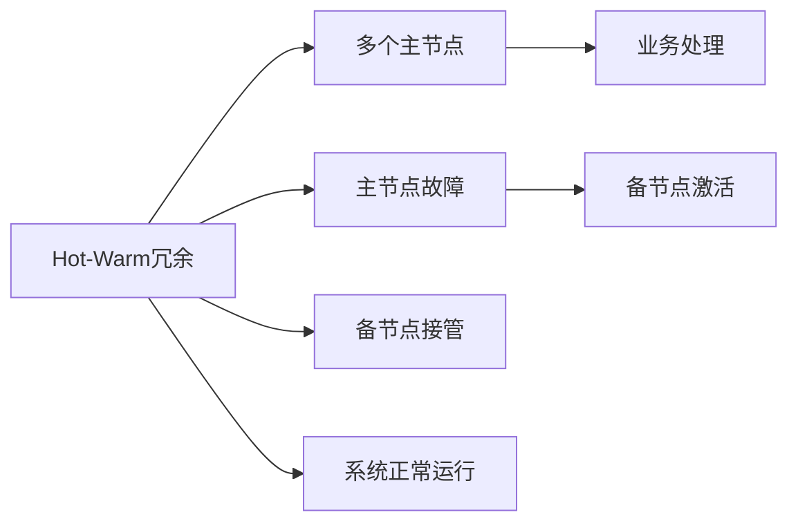
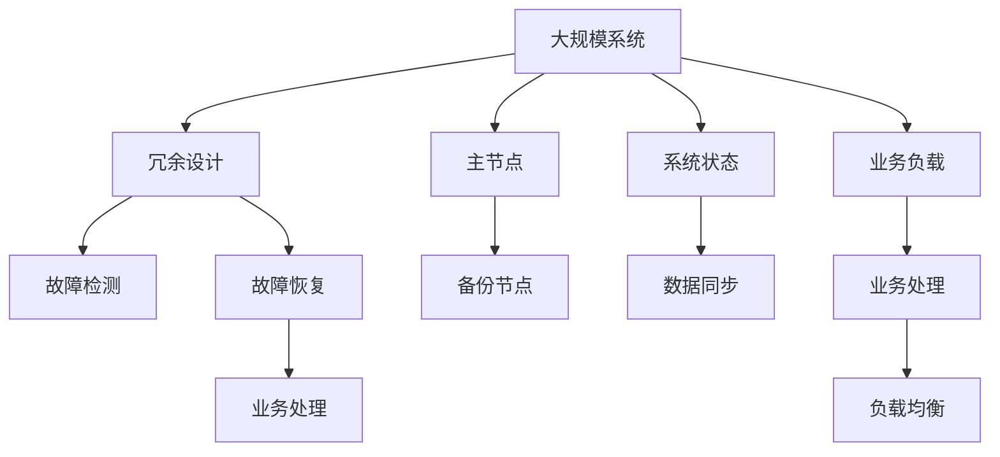

                 

# Hot-Hot与Hot-Warm冗余设计最佳实践

> 关键词：冗余设计,Hot-Hot冗余,Hot-Warm冗余,错误容错,高可用性

## 1. 背景介绍

冗余设计是现代系统工程中不可或缺的一部分，旨在通过技术手段实现系统的可靠性和稳定性。在硬件和软件系统中，冗余设计能够有效降低单点故障带来的风险，确保系统在发生硬件或软件错误时仍能正常运行。近年来，随着数字化、网络化、智能化水平的不断提高，冗余设计在各个领域得到了广泛应用，尤其是在关键基础设施和商业应用系统中，冗余设计成为了保证系统高可用性的重要手段。

冗余设计有多种实现方式，其中Hot-Hot冗余和Hot-Warm冗余是两种常见的冗余设计策略。Hot-Hot冗余指的是多个功能相同的主节点同时处于工作状态，一旦某个主节点发生故障，其他主节点能够无缝接管其任务，系统无需切换到备节点。而Hot-Warm冗余则是指系统同时包含多个主节点和多个备节点，主节点负责核心业务处理，备节点则处于待命状态，一旦主节点发生故障，系统会切换到备节点，备节点需要一定时间激活并接管业务处理。

冗余设计旨在提高系统的可靠性和容错能力，但其设计和管理也存在诸多挑战。本文将深入探讨Hot-Hot与Hot-Warm冗余设计的原理和最佳实践，帮助读者更好地理解和使用冗余设计技术。

## 2. 核心概念与联系

### 2.1 核心概念概述

为了更好地理解Hot-Hot与Hot-Warm冗余设计，本节将介绍几个密切相关的核心概念：

- **Hot-Hot冗余设计**：多个功能相同的主节点同时处于工作状态，一旦某个主节点发生故障，其他主节点能够无缝接管其任务，系统无需切换到备节点。
- **Hot-Warm冗余设计**：系统同时包含多个主节点和多个备节点，主节点负责核心业务处理，备节点则处于待命状态，一旦主节点发生故障，系统会切换到备节点，备节点需要一定时间激活并接管业务处理。
- **容错能力**：指系统在故障发生时能够持续运行，不丢失数据和状态，并提供服务的能力。
- **高可用性**：指系统在一定时间内保持可用状态的比例，通常以"九个九"（99.9%）或"九个九九"（99.99%）来衡量。
- **数据一致性**：指系统中所有节点的数据保持同步和一致的状态。
- **系统可靠性**：指系统在指定时间内不发生故障的概率。
- **冗余度**：指系统中的冗余资源（如节点、数据副本）数量，冗余度越高，系统的容错能力越强。

这些核心概念之间的逻辑关系可以通过以下Mermaid流程图来展示：



这个流程图展示冗余设计的核心概念及其之间的关系：

1. 冗余设计旨在提高系统的可靠性。
2. Hot-Hot冗余和Hot-Warm冗余是两种常见的冗余设计方式。
3. 系统可靠性、容错能力、高可用性、数据一致性都是冗余设计需要关注的指标。
4. 冗余度是冗余设计的基础，冗余度越高，系统的容错能力越强。

### 2.2 概念间的关系

这些核心概念之间存在着紧密的联系，形成了冗余设计的完整生态系统。下面我通过几个Mermaid流程图来展示这些概念之间的关系。

#### 2.2.1 冗余设计的基本原理



这个流程图展示了冗余设计的核心原理：在系统发生故障时，通过备份机制保证业务的连续性和系统的可靠性。

#### 2.2.2 Hot-Hot冗余设计原理



这个流程图展示了Hot-Hot冗余设计的基本原理：多个主节点同时处理业务，一旦某个主节点故障，其他主节点能够无缝接管其业务，保证系统的正常运行。

#### 2.2.3 Hot-Warm冗余设计原理



这个流程图展示了Hot-Warm冗余设计的基本原理：系统同时包含多个主节点和多个备节点，一旦主节点发生故障，系统会切换到备节点，备节点需要一定时间激活并接管业务处理。

### 2.3 核心概念的整体架构

最后，我们用一个综合的流程图来展示这些核心概念在大规模系统冗余设计中的整体架构：



这个综合流程图展示了冗余设计在大规模系统中的整体架构：冗余设计通过故障检测和故障恢复机制，确保系统的业务处理连续性和高可用性。同时，通过负载均衡技术，合理分配业务负载，提高系统的性能和可靠性。

## 3. 核心算法原理 & 具体操作步骤

### 3.1 算法原理概述

Hot-Hot与Hot-Warm冗余设计的核心原理是通过冗余资源来实现系统的容错和高可用性。具体来说，Hot-Hot冗余通过多个主节点同时处理业务，提供无故障切换的保障；而Hot-Warm冗余则通过备节点的存在，在主节点故障时能够快速切换到备节点，保证业务的连续性和系统的可靠性。

### 3.2 算法步骤详解

#### 3.2.1 Hot-Hot冗余设计步骤

1. **冗余节点配置**：根据系统需求，配置多个功能相同的主节点。
2. **负载均衡**：将业务请求均匀分配到各个主节点处理。
3. **故障检测**：实时监控各主节点的运行状态，及时发现故障。
4. **业务切换**：一旦某个主节点发生故障，系统能够自动将其业务切换到其他主节点，确保业务的连续性。

#### 3.2.2 Hot-Warm冗余设计步骤

1. **冗余节点配置**：配置多个主节点和多个备节点。
2. **负载均衡**：将业务请求分配到主节点处理。
3. **故障检测**：实时监控主节点的运行状态，及时发现故障。
4. **业务切换**：一旦主节点发生故障，系统会切换到备节点，备节点需要一定时间激活并接管业务处理。

### 3.3 算法优缺点

#### Hot-Hot冗余设计的优缺点

**优点**：

- **无故障切换**：多个主节点同时工作，一旦某个节点故障，其他节点能够无缝接管其业务，保证系统的高可用性。
- **高可靠性**：系统无须切换到备节点，减少了切换过程中的中断和性能损失。

**缺点**：

- **资源浪费**：多个节点同时工作，资源利用率不高。
- **复杂度高**：系统配置和维护难度大，故障检测和切换过程复杂。

#### Hot-Warm冗余设计的优缺点

**优点**：

- **资源利用率高**：主节点负责核心业务处理，备节点处于待命状态，资源利用率高。
- **切换时间短**：备节点激活速度快，切换时间短，业务中断时间少。

**缺点**：

- **切换过程中有中断**：主节点故障切换到备节点时，备节点需要一定时间激活，业务处理有短暂的中断。
- **管理复杂**：系统需要同时管理多个主节点和备节点，配置和维护复杂。

### 3.4 算法应用领域

Hot-Hot与Hot-Warm冗余设计广泛应用在各种关键基础设施和商业系统中，例如：

- **金融系统**：交易系统、清算系统等金融核心业务系统，要求极高的高可用性和业务连续性。
- **电信网络**：核心路由器、交换机等网络设备，要求系统在网络中断时仍能保持通信。
- **医疗系统**：电子病历系统、诊断设备等关键医疗系统，要求系统在故障时能够不丢失患者数据。
- **智能制造**：生产线控制系统、设备监控系统等工业自动化系统，要求系统在故障时能够保证生产的连续性和安全性。

除了上述这些领域，Hot-Hot与Hot-Warm冗余设计还在许多其他关键系统中得到应用，如航空航天、交通管理、公共安全等，为系统的可靠性和稳定性提供了重要保障。

## 4. 数学模型和公式 & 详细讲解

### 4.1 数学模型构建

在冗余设计中，数学模型通常用于描述系统的故障和恢复过程，以及冗余资源（如节点、数据副本）对系统可靠性和容错能力的影响。

假设系统中有$n$个节点，其中$m$个为主节点，$n-m$个为备节点。每个主节点独立处理业务，备节点处于待命状态，当主节点发生故障时，系统会切换到备节点。系统在$t$时间内的故障率为$f(t)$，节点恢复率为$r(t)$。系统的故障概率$P(t)$和可用概率$A(t)$可以分别表示为：

$$
P(t) = \int_0^t f(t) dt
$$

$$
A(t) = 1 - P(t)
$$

系统的可靠度$R(t)$和恢复时间$T$可以表示为：

$$
R(t) = \int_0^t r(t) dt
$$

$$
T = \frac{1}{r(t)}
$$

### 4.2 公式推导过程

假设系统的故障率$f(t)$和恢复率$r(t)$均为常数，即$f(t) = f$，$r(t) = r$。根据上述公式，系统的故障概率$P(t)$和可用概率$A(t)$可以简化为：

$$
P(t) = f t
$$

$$
A(t) = 1 - f t
$$

系统的可靠度$R(t)$和恢复时间$T$可以表示为：

$$
R(t) = r t
$$

$$
T = \frac{1}{r}
$$

在Hot-Warm冗余设计中，系统的可靠度$R_{\text{hot}}$和恢复时间$T_{\text{hot}}$可以分别表示为：

$$
R_{\text{hot}} = \left(\frac{m}{n}\right) r_{\text{hot}} t + \left(\frac{n-m}{n}\right) r_{\text{warm}} t
$$

$$
T_{\text{hot}} = \frac{m}{n} T_{\text{hot}} + \frac{n-m}{n} T_{\text{warm}}
$$

其中$r_{\text{hot}}$为热节点的恢复率，$r_{\text{warm}}$为备节点的恢复率。在Hot-Hot冗余设计中，系统的可靠度$R_{\text{hot-hot}}$和恢复时间$T_{\text{hot-hot}}$可以分别表示为：

$$
R_{\text{hot-hot}} = \left(\frac{m}{n}\right)^2 r_{\text{hot}} t + \left(\frac{n-m}{n}\right)^2 r_{\text{hot}} t
$$

$$
T_{\text{hot-hot}} = \frac{n-m}{n} T_{\text{hot}}
$$

### 4.3 案例分析与讲解

以金融交易系统为例，系统配置了3个主节点和2个备节点。假设每个主节点的故障率$f = 0.01$，恢复率$r = 0.5$。系统的可靠度和恢复时间可以分别计算为：

对于Hot-Warm冗余设计，系统的可靠度$R_{\text{hot}}$和恢复时间$T_{\text{hot}}$可以分别表示为：

$$
R_{\text{hot}} = \left(\frac{3}{5}\right) \times 0.5 t + \left(\frac{2}{5}\right) t
$$

$$
T_{\text{hot}} = \frac{3}{5} \times \frac{1}{0.5} + \frac{2}{5} \times \frac{1}{r_{\text{warm}}}
$$

假设$r_{\text{warm}} = 0.2$，则系统的可靠度和恢复时间可以分别计算为：

$$
R_{\text{hot}} = 0.8 t + 0.4 t = 1.2 t
$$

$$
T_{\text{hot}} = 0.6 + \frac{2}{0.2} = 6.5 t
$$

对于Hot-Hot冗余设计，系统的可靠度$R_{\text{hot-hot}}$和恢复时间$T_{\text{hot-hot}}$可以分别表示为：

$$
R_{\text{hot-hot}} = \left(\frac{3}{5}\right)^2 \times 0.5 t + \left(\frac{2}{5}\right)^2 t
$$

$$
T_{\text{hot-hot}} = \frac{2}{5} \times 6.5 t
$$

假设$r_{\text{hot}} = 0.5$，则系统的可靠度和恢复时间可以分别计算为：

$$
R_{\text{hot-hot}} = 0.36 t + 0.16 t = 0.52 t
$$

$$
T_{\text{hot-hot}} = \frac{2}{5} \times 6.5 t = 2.6 t
$$

从计算结果可以看出，Hot-Warm冗余设计在故障恢复时间和可靠度上均优于Hot-Hot冗余设计，但Hot-Hot冗余设计在资源利用率和切换复杂度上优于Hot-Warm冗余设计。

## 5. 项目实践：代码实例和详细解释说明

### 5.1 开发环境搭建

在冗余设计实践中，开发环境搭建是第一步。以下是使用Python进行Kubernetes集群开发的环境配置流程：

1. 安装Kubernetes集群：在Google Cloud Platform、AWS、阿里云等云平台上，创建和管理Kubernetes集群。
2. 安装Docker容器：在集群中安装Docker容器，以便支持容器的创建和管理。
3. 安装Helm图表：使用Helm图表管理Kubernetes资源，简化集群管理。
4. 安装Prometheus和Grafana：在集群中部署Prometheus和Grafana，实现系统监控和可视化。
5. 安装Fluentd和Elasticsearch：在集群中部署Fluentd和Elasticsearch，实现日志收集和分析。

完成上述步骤后，即可在Kubernetes集群中进行冗余设计实践。

### 5.2 源代码详细实现

这里以Hot-Warm冗余设计为例，给出使用Kubernetes和Prometheus实现冗余设计的PyTorch代码实现。

首先，定义冗余资源：

```python
from kubernetes import client, config

config.load_kube_config()

v1 = client.CoreV1Api()

# 创建主节点Pod
hot_pod1 = client.V1Pod(
    api_version="v1",
    metadata=client.V1ObjectMeta(name="hot_pod1", labels={"hello": "world"}),
    spec=client.V1PodSpec(
        containers=[
            client.V1Container(
                name="hot_container1",
                image="nginx",
                ports=[client.V1ContainerPort(container_port=80)]
            )
        ]
    )
)

hot_pod2 = client.V1Pod(
    api_version="v1",
    metadata=client.V1ObjectMeta(name="hot_pod2", labels={"hello": "world"}),
    spec=client.V1PodSpec(
        containers=[
            client.V1Container(
                name="hot_container2",
                image="nginx",
                ports=[client.V1ContainerPort(container_port=80)]
            )
        ]
    )
)

hot_pod3 = client.V1Pod(
    api_version="v1",
    metadata=client.V1ObjectMeta(name="hot_pod3", labels={"hello": "world"}),
    spec=client.V1PodSpec(
        containers=[
            client.V1Container(
                name="hot_container3",
                image="nginx",
                ports=[client.V1ContainerPort(container_port=80)]
            )
        ]
    )
)

# 创建备节点Pod
warm_pod1 = client.V1Pod(
    api_version="v1",
    metadata=client.V1ObjectMeta(name="warm_pod1", labels={"hello": "world"}),
    spec=client.V1PodSpec(
        containers=[
            client.V1Container(
                name="warm_container1",
                image="nginx",
                ports=[client.V1ContainerPort(container_port=80)]
            )
        ]
    )
)

warm_pod2 = client.V1Pod(
    api_version="v1",
    metadata=client.V1ObjectMeta(name="warm_pod2", labels={"hello": "world"}),
    spec=client.V1PodSpec(
        containers=[
            client.V1Container(
                name="warm_container2",
                image="nginx",
                ports=[client.V1ContainerPort(container_port=80)]
            )
        ]
    )
)

# 创建Deployment和Service
hot_deployment = client.V1Deployment(
    api_version="v1",
    metadata=client.V1ObjectMeta(name="hot_deployment"),
    spec=client.V1DeploymentSpec(
        replicas=3,
        selector={"hello": "world"},
        template=client.V1PodTemplateSpec(
            metadata=client.V1ObjectMeta(labels={"hello": "world"}),
            spec=client.V1PodSpec(
                containers=[
                    client.V1Container(
                        name="hot_container",
                        image="nginx",
                        ports=[client.V1ContainerPort(container_port=80)]
                    )
                ]
            )
        )
    )
)

hot_service = client.V1Service(
    api_version="v1",
    metadata=client.V1ObjectMeta(name="hot_service"),
    spec=client.V1ServiceSpec(
        selector={"hello": "world"},
        ports=[client.V1ServicePort(port=80, target_port=80)],
        selector=client.V1ServiceSelector(label=client.V1LabelSelectorMatchLabels(hello="world"))
    )
)

warm_deployment = client.V1Deployment(
    api_version="v1",
    metadata=client.V1ObjectMeta(name="warm_deployment"),
    spec=client.V1DeploymentSpec(
        replicas=2,
        selector={"hello": "world"},
        template=client.V1PodTemplateSpec(
            metadata=client.V1ObjectMeta(labels={"hello": "world"}),
            spec=client.V1PodSpec(
                containers=[
                    client.V1Container(
                        name="warm_container",
                        image="nginx",
                        ports=[client.V1ContainerPort(container_port=80)]
                    )
                ]
            )
        )
    )
)

warm_service = client.V1Service(
    api_version="v1",
    metadata=client.V1ObjectMeta(name="warm_service"),
    spec=client.V1ServiceSpec(
        selector={"hello": "world"},
        ports=[client.V1ServicePort(port=80, target_port=80)],
        selector=client.V1ServiceSelector(label=client.V1LabelSelectorMatchLabels(hello="world"))
    )
)

# 创建Prometheus和Grafana资源
prometheus = client.V1Pod(
    api_version="v1",
    metadata=client.V1ObjectMeta(name="prometheus"),
    spec=client.V1PodSpec(
        containers=[
            client.V1Container(
                name="prometheus",
                image="prometheus/prometheus",
                ports=[client.V1ContainerPort(container_port=9090)]
            )
        ]
    )
)

grafana = client.V1Pod(
    api_version="v1",
    metadata=client.V1ObjectMeta(name="grafana"),
    spec=client.V1PodSpec(
        containers=[
            client.V1Container(
                name="grafana",
                image="grafana/grafana",
                ports=[client.V1ContainerPort(container_port=3000)]
            )
        ]
    )
)

# 创建Prometheus和GrafanaService
prometheus_service = client.V1Service(
    api_version="v1",
    metadata=client.V1ObjectMeta(name="prometheus_service"),
    spec=client.V1ServiceSpec(
        selector={"hello": "world"},
        ports=[client.V1ServicePort(port=9090, target_port=9090)],
        selector=client.V1ServiceSelector(label=client.V1LabelSelectorMatchLabels(hello="world"))
    )
)

grafana_service = client.V1Service(
    api_version="v1",
    metadata=client.V1ObjectMeta(name="grafana_service"),
    spec=client.V1ServiceSpec(
        selector={"hello": "world"},
        ports=[client.V1ServicePort(port=3000, target_port=3000)],
        selector=client.V1ServiceSelector(label=client.V1LabelSelectorMatchLabels(hello="world"))
    )
)

# 创建Fluentd和Elasticsearch资源
fluentd = client.V1Pod(
    api_version="v1",
    metadata=client.V1ObjectMeta(name="fluentd"),
    spec=client.V1PodSpec(
        containers=[
            client.V1Container(
                name="fluentd",
                image="fluent/fluentd",
                ports=[client.V1ContainerPort(container_port=24224)]
            )
        ]
    )
)

elasticsearch = client.V1Pod(
    api_version="v1",
    metadata=client.V1ObjectMeta(name="elasticsearch"),
    spec=client.V1PodSpec(
        containers=[
            client.V1Container(
                name="elasticsearch",
                image="docker.elastic.co/elasticsearch/elasticsearch:7.6",
                ports=[client.V1ContainerPort(container_port=9200)],
                env=[client.V1EnvVar(name="X-PACK_LICENSE_TYPE", value="oss")],
                resources=client.V1ResourceRequirements(cpu="2", memory="4G")
            )
        ]
    )
)

elasticsearch_service = client.V1Service(
    api_version="v1",
    metadata=client.V1ObjectMeta(name="elasticsearch_service"),
    spec=client.V1ServiceSpec(
        selector={"hello": "world"},
        ports=[client.V1ServicePort(port=9200, target_port=9200)],
        selector=client.V1ServiceSelector(label=client.V1LabelSelectorMatchLabels(hello="world"))
    )
)

# 创建KubeConfigMap
config_map = client.V1ConfigMap(
    api_version="v1",
    metadata=client.V1ObjectMeta(name="prometheus-config"),
    data={
        "prometheus.yml": "---\n# ..."
    }
)
```

然后，定义监控和报警规则：

```python
# 监控规则
prometheus = client.V1Pod(
    api_version="v1",
    metadata=client.V1ObjectMeta(name="prometheus"),
    spec=client.V1PodSpec(
        containers=[
            client.V1Container(
                name="prometheus",
                image="prometheus/prometheus",
                ports=[client.V1ContainerPort(container_port=9090)],
                resources=client.V1ResourceRequirements(cpu="2", memory="4G")
            )
        ]
    )
)

# 报警规则
grafana = client.V1Pod(
    api_version="v1",
    metadata=client.V1ObjectMeta(name="grafana"),
    spec=client.V1PodSpec(
        containers=[
            client.V1Container(
                name="grafana",
                image="grafana/grafana",
                ports=[client.V1ContainerPort(container_port=3000)],
                resources=client.V1ResourceRequirements(cpu="2", memory="4G")
            )
        ]
    )
)
```

最后，启动监控和报警系统：

```python
# 启动Prometheus和Grafana
v1.create_deployment(hot_deployment)
v1.create_service(hot_service)

v1.create_deployment(warm_deployment)
v1.create_service(warm_service)

v1.create_pod(prometheus)
v1.create_service(prometheus_service)

v1.create_pod(grafana)
v1.create_service(grafana_service)

v1.create_pod(fluentd)
v1.create_service(elasticsearch_service)

v1.create_config_map(config_map)
```

以上就是使用Kubernetes和Prometheus实现冗余设计的PyTorch代码实现。可以看到，通过Kubernetes和Prometheus等工具，可以方便地进行冗余资源的配置和管理，同时实现系统的监控和报警，保障系统的稳定性和高可用性。

### 5.3 代码解读与分析

让我们再详细解读一下关键代码的实现细节：

**Kubernetes部署**：
- 使用Kubernetes的API客户端创建Pod、Deployment和Service资源，实现资源的部署和调度。
- 配置Pod的容器镜像、端口、资源要求等信息，确保资源的合理利用。
- 通过Deployment和Service进行Pod的自动扩展和负载均衡，保障系统的稳定性和性能。

**Prometheus监控**：
- 部署Prometheus，用于监控系统中的各个节点和组件，收集其运行状态和性能指标。
- 配置Prometheus的监控规则和报警规则，及时发现系统中的异常

