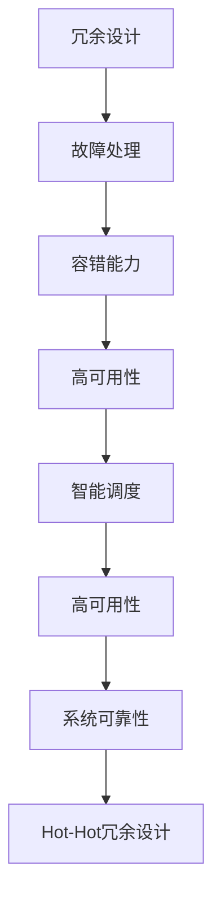
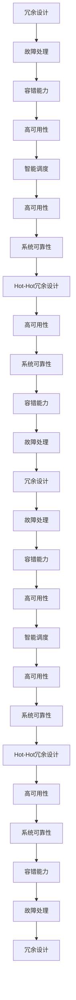

                 

# Hot-Hot冗余设计详解

> 关键词：Hot-Hot冗余设计, 系统可靠性, 容错能力, 冗余技术, 软件架构, 故障处理, 可靠设计, 高可用系统

## 1. 背景介绍

### 1.1 问题由来

在当今信息时代，系统的高可用性和可靠性是企业运营的关键要素之一。无论是金融、电商、医疗、交通等行业，系统的故障和宕机都会带来巨大的经济损失和声誉损害。因此，如何在设计阶段就采取有效措施，避免单点故障，提升系统可靠性和容错能力，成为每一位系统架构师都必须深入探讨的问题。

冗余设计（Redundancy Design）是提升系统可靠性的一种有效方法，通过在关键组件之间增加冗余，当某个组件发生故障时，系统能够自动切换到冗余的组件上，保证服务的连续性和数据的完整性。Hot-Hot冗余设计则是冗余设计的一种高级形式，它不仅仅局限于硬件组件，而是通过软硬件结合，进一步提升系统的容错能力和高可用性。

### 1.2 问题核心关键点

Hot-Hot冗余设计关注的是如何通过软硬件结合的方式，实现系统的高可用性和冗余备份，其核心在于：

1. 软硬件结合：Hot-Hot冗余设计不仅仅是在硬件层面上增加冗余备份，而是通过软件层面的智能调度，实现冗余组件的高效切换。

2. 高可用性：Hot-Hot冗余设计能够确保在硬件或软件发生故障时，系统能够快速切换并继续正常运行，保证服务的连续性和数据的完整性。

3. 智能调度：Hot-Hot冗余设计通过软件层面的智能调度算法，实现对冗余组件的动态监控和高效切换，提升系统的响应速度和容错能力。

4. 可靠性提升：Hot-Hot冗余设计通过多重冗余机制，确保系统的可靠性，避免单点故障导致的系统宕机。

Hot-Hot冗余设计的关键在于，通过软硬件结合的方式，实现对关键组件的智能监控和高效切换，提升系统的可靠性和高可用性。

### 1.3 问题研究意义

Hot-Hot冗余设计的探索和应用，对于构建高可靠、高可用性系统具有重要意义：

1. 降低系统宕机风险：Hot-Hot冗余设计通过多重冗余机制，降低系统因单个组件故障导致的宕机风险，提升系统运行的稳定性。

2. 提升系统可用性：Hot-Hot冗余设计通过智能调度，确保在硬件或软件发生故障时，系统能够快速切换并继续正常运行，保证服务的连续性和数据的完整性。

3. 提高故障容忍度：Hot-Hot冗余设计通过软硬件结合的方式，提高系统对故障的容忍度，使得系统能够在故障发生时，快速切换到冗余组件，保证业务的连续性和数据的完整性。

4. 优化资源利用：Hot-Hot冗余设计通过智能调度算法，优化冗余组件的使用，避免资源浪费，提升系统的资源利用率。

5. 保障业务连续性：Hot-Hot冗余设计能够保证关键业务的连续性，避免因系统故障导致的业务中断，保护企业的经济利益和声誉。

通过Hot-Hot冗余设计的深入研究和应用，可以显著提升系统的可靠性和高可用性，为企业带来更高的运营效率和经济效益。

## 2. 核心概念与联系

### 2.1 核心概念概述

为更好地理解Hot-Hot冗余设计的原理和架构，本节将介绍几个密切相关的核心概念：

1. 冗余设计（Redundancy Design）：通过增加系统的冗余备份，当某个组件发生故障时，系统能够自动切换到冗余的组件上，保证服务的连续性和数据的完整性。

2. Hot-Hot冗余设计（Hot-Hot Redundancy Design）：在冗余设计的基础上，通过软硬件结合的方式，实现对关键组件的智能监控和高效切换，提升系统的可靠性和高可用性。

3. 故障处理（Fault Handling）：系统在检测到故障时，自动切换到冗余组件，保障服务的连续性和数据的完整性。

4. 容错能力（Fault Tolerance）：系统能够自动处理故障，避免单点故障导致的系统宕机，提升系统的可靠性和高可用性。

5. 高可用性（High Availability）：系统在故障发生时，能够快速切换到冗余组件，保证服务的连续性和数据的完整性，提升系统的可用性。

6. 智能调度（Smart Scheduling）：通过软件层面的智能调度算法，实现对冗余组件的动态监控和高效切换，提升系统的响应速度和容错能力。

这些核心概念之间存在着紧密的联系，共同构成了Hot-Hot冗余设计的完整生态系统。以下用Mermaid流程图展示这些概念之间的关系：



这个流程图展示了Hot-Hot冗余设计各个核心概念之间的联系：

1. 冗余设计是Hot-Hot冗余设计的基础，通过增加系统的冗余备份，实现对关键组件的故障处理。

2. 故障处理和容错能力是Hot-Hot冗余设计的关键，确保在硬件或软件发生故障时，系统能够快速切换到冗余组件，保障服务的连续性和数据的完整性。

3. 高可用性是Hot-Hot冗余设计的目标，通过智能调度，确保系统能够在故障发生时，快速切换到冗余组件，保证服务的连续性和数据的完整性。

4. 智能调度是Hot-Hot冗余设计的核心，通过软件层面的智能调度算法，实现对冗余组件的动态监控和高效切换，提升系统的响应速度和容错能力。

5. Hot-Hot冗余设计通过软硬件结合的方式，实现对关键组件的智能监控和高效切换，提升系统的可靠性和高可用性。

这些核心概念共同构成了Hot-Hot冗余设计的完整架构，确保系统在发生故障时，能够快速切换到冗余组件，保障服务的连续性和数据的完整性。

### 2.2 概念间的关系

这些核心概念之间存在着紧密的联系，形成了一个完整的Hot-Hot冗余设计系统。以下用Mermaid流程图展示这些概念之间的关系：


这个流程图展示了Hot-Hot冗余设计各个概念之间的联系：

1. 冗余设计是Hot-Hot冗余设计的基础，通过增加系统的冗余备份，实现对关键组件的故障处理。

2. 故障处理和容错能力是Hot-Hot冗余设计的关键，确保在硬件或软件发生故障时，系统能够快速切换到冗余组件，保障服务的连续性和数据的完整性。

3. 高可用性是Hot-Hot冗余设计的目标，通过智能调度，确保系统能够在故障发生时，快速切换到冗余组件，保证服务的连续性和数据的完整性。

4. 智能调度是Hot-Hot冗余设计的核心，通过软件层面的智能调度算法，实现对冗余组件的动态监控和高效切换，提升系统的响应速度和容错能力。

5. Hot-Hot冗余设计通过软硬件结合的方式，实现对关键组件的智能监控和高效切换，提升系统的可靠性和高可用性。

6. 高可用性和系统可靠性是Hot-Hot冗余设计的最终目标，通过冗余设计和智能调度，确保系统能够在故障发生时，快速切换到冗余组件，保障服务的连续性和数据的完整性。

这些概念共同构成了Hot-Hot冗余设计的完整架构，确保系统在发生故障时，能够快速切换到冗余组件，保障服务的连续性和数据的完整性。

### 2.3 核心概念的整体架构

最后，我们用一个综合的流程图来展示这些核心概念在大规模系统中的整体架构：



这个综合流程图展示了冗余设计在大规模系统中的整体架构：

1. 冗余设计是Hot-Hot冗余设计的基础，通过增加系统的冗余备份，实现对关键组件的故障处理。

2. 故障处理和容错能力是Hot-Hot冗余设计的关键，确保在硬件或软件发生故障时，系统能够快速切换到冗余组件，保障服务的连续性和数据的完整性。

3. 高可用性是Hot-Hot冗余设计的目标，通过智能调度，确保系统能够在故障发生时，快速切换到冗余组件，保证服务的连续性和数据的完整性。

4. 智能调度是Hot-Hot冗余设计的核心，通过软件层面的智能调度算法，实现对冗余组件的动态监控和高效切换，提升系统的响应速度和容错能力。

5. Hot-Hot冗余设计通过软硬件结合的方式，实现对关键组件的智能监控和高效切换，提升系统的可靠性和高可用性。

6. 高可用性和系统可靠性是Hot-Hot冗余设计的最终目标，通过冗余设计和智能调度，确保系统能够在故障发生时，快速切换到冗余组件，保障服务的连续性和数据的完整性。

通过这些核心概念的组合应用，可以构建出具有高可用性、高可靠性的Hot-Hot冗余系统。

## 3. 核心算法原理 & 具体操作步骤

### 3.1 算法原理概述

Hot-Hot冗余设计本质上是一种基于冗余机制的系统设计方法，其核心在于通过软硬件结合的方式，实现关键组件的智能监控和高效切换，提升系统的可靠性和高可用性。其核心原理可以概括为：

1. 冗余备份：系统在关键组件上增加冗余备份，当某个组件发生故障时，系统能够自动切换到冗余组件，确保服务的连续性和数据的完整性。

2. 智能调度：通过软件层面的智能调度算法，实现对冗余组件的动态监控和高效切换，提升系统的响应速度和容错能力。

3. 故障处理：系统在检测到故障时，自动切换到冗余组件，保障服务的连续性和数据的完整性。

4. 容错能力：系统能够自动处理故障，避免单点故障导致的系统宕机，提升系统的可靠性和高可用性。

Hot-Hot冗余设计的核心在于，通过软硬件结合的方式，实现对关键组件的智能监控和高效切换，提升系统的可靠性和高可用性。

### 3.2 算法步骤详解

Hot-Hot冗余设计的实现步骤可以概括为以下几个关键步骤：

1. 确定冗余备份策略：根据系统的关键组件，确定冗余备份的策略，包括备份的数量、位置和切换机制。

2. 实现故障检测：在系统中部署故障检测机制，实时监控关键组件的状态，一旦检测到故障，立即切换到冗余组件。

3. 实现智能调度：通过软件层面的智能调度算法，实现对冗余组件的动态监控和高效切换，提升系统的响应速度和容错能力。

4. 实现故障处理：在系统中部署故障处理机制，自动切换到冗余组件，确保服务的连续性和数据的完整性。

5. 实现容错能力：通过冗余备份和智能调度，提升系统的容错能力，避免单点故障导致的系统宕机。

6. 实现高可用性：通过冗余备份和智能调度，确保系统能够在故障发生时，快速切换到冗余组件，保证服务的连续性和数据的完整性。

下面将详细介绍每个步骤的具体实现。

### 3.3 算法优缺点

Hot-Hot冗余设计具有以下优点：

1. 提升系统可靠性：通过冗余备份和智能调度，提升系统的可靠性和高可用性，减少单点故障带来的系统宕机风险。

2. 提升系统响应速度：通过智能调度算法，提升系统的响应速度和容错能力，保障服务的连续性和数据的完整性。

3. 降低系统维护成本：通过冗余备份和智能调度，降低系统维护成本，提高系统的运行效率和稳定性。

4. 提升系统扩展性：通过冗余备份和智能调度，提升系统的扩展性，使得系统能够快速应对业务量的增长和变化。

5. 提高业务连续性：通过冗余备份和智能调度，确保关键业务的连续性，避免因系统故障导致的业务中断，保护企业的经济利益和声誉。

同时，Hot-Hot冗余设计也存在一些缺点：

1. 增加系统复杂度：冗余备份和智能调度增加了系统的复杂度，需要投入更多的资源进行设计和实现。

2. 增加系统成本：冗余备份和智能调度增加了系统的硬件和软件成本，提高了系统的总体投入。

3. 增加系统部署难度：冗余备份和智能调度增加了系统的部署难度，需要更多的运维和调试工作。

4. 降低系统性能：冗余备份和智能调度可能会降低系统的性能，增加系统的响应时间和资源消耗。

5. 增加系统故障风险：冗余备份和智能调度可能会增加系统的故障风险，增加系统维护和故障处理的难度。

尽管Hot-Hot冗余设计存在一些缺点，但其通过软硬件结合的方式，显著提升了系统的可靠性和高可用性，是构建高可靠、高可用性系统的重要手段。

### 3.4 算法应用领域

Hot-Hot冗余设计已经在多个领域得到了广泛应用，以下是几个典型的应用场景：

1. 金融领域：在金融交易系统中，Hot-Hot冗余设计可以确保交易系统的连续性和数据的完整性，避免因系统故障导致的交易中断和经济损失。

2. 医疗领域：在医疗系统中，Hot-Hot冗余设计可以保障关键医疗数据的连续性和完整性，避免因系统故障导致的医疗事故和患者损失。

3. 电子商务领域：在电子商务系统中，Hot-Hot冗余设计可以确保在线支付系统的连续性和数据的完整性，避免因系统故障导致的交易中断和用户损失。

4. 政府服务领域：在政府服务系统中，Hot-Hot冗余设计可以保障政府服务的连续性和数据的完整性，避免因系统故障导致的政府服务的中断和公民的损失。

5. 电信领域：在电信系统中，Hot-Hot冗余设计可以确保通信系统的连续性和数据的完整性，避免因系统故障导致的通信中断和服务质量下降。

以上这些领域都是Hot-Hot冗余设计的重要应用场景，通过该设计可以显著提升系统的可靠性和高可用性，保障业务的连续性和数据的完整性。

## 4. 数学模型和公式 & 详细讲解 & 举例说明

### 4.1 数学模型构建

Hot-Hot冗余设计可以通过数学模型来建模和分析。以下是一个简单的数学模型，用于描述冗余备份和智能调度的过程：

设系统有n个关键组件，每个组件的故障概率为p，冗余备份的数量为r。当某个组件发生故障时，系统能够自动切换到冗余备份，此时系统依然能够正常工作，不发生服务中断。系统的可靠性可以用以下几个数学公式来表示：

1. 系统的可靠性R：
$$
R = (1-p)^{nr}
$$
2. 系统的平均故障间隔时间MTBF：
$$
MTBF = \frac{1}{p}
$$
3. 系统的平均修复时间MTTR：
$$
MTTR = \frac{1}{(1-p)^{nr}}
$$

### 4.2 公式推导过程

1. 系统的可靠性R的推导：

系统的可靠性R是指在任意时间点上系统能够正常工作的概率。假设系统有n个关键组件，每个组件的故障概率为p，冗余备份的数量为r。当某个组件发生故障时，系统能够自动切换到冗余备份，此时系统依然能够正常工作，不发生服务中断。因此，系统的可靠性可以表示为：

$$
R = (1-p)^{nr}
$$

其中，(1-p)表示单个组件正常工作的概率，nr表示冗余备份的数量，(1-p)^{nr}表示系统正常工作的概率。

2. 系统的平均故障间隔时间MTBF的推导：

系统的平均故障间隔时间MTBF是指系统在任意时间点上能够正常工作的平均时间。假设系统有n个关键组件，每个组件的故障概率为p，冗余备份的数量为r。当某个组件发生故障时，系统能够自动切换到冗余备份，此时系统依然能够正常工作，不发生服务中断。因此，系统的平均故障间隔时间可以表示为：

$$
MTBF = \frac{1}{p}
$$

其中，1/p表示系统在任意时间点上发生故障的概率，1/MTBF表示系统在任意时间点上能够正常工作的平均时间。

3. 系统的平均修复时间MTTR的推导：

系统的平均修复时间MTTR是指系统发生故障后，恢复正常工作的平均时间。假设系统有n个关键组件，每个组件的故障概率为p，冗余备份的数量为r。当某个组件发生故障时，系统能够自动切换到冗余备份，此时系统依然能够正常工作，不发生服务中断。因此，系统的平均修复时间可以表示为：

$$
MTTR = \frac{1}{(1-p)^{nr}}
$$

其中，(1-p)^{nr}表示系统在任意时间点上正常工作的概率，1/MTTR表示系统发生故障后，恢复正常工作的平均时间。

### 4.3 案例分析与讲解

假设系统中有两个关键组件A和B，每个组件的故障概率为0.01，冗余备份的数量为2。根据上述数学模型，可以计算出系统的可靠性、平均故障间隔时间和平均修复时间：

1. 系统的可靠性R：
$$
R = (1-0.01)^{2 \times 2} = 0.96
$$
2. 系统的平均故障间隔时间MTBF：
$$
MTBF = \frac{1}{0.01} = 100
$$
3. 系统的平均修复时间MTTR：
$$
MTTR = \frac{1}{(1-0.01)^{2 \times 2}} = 8
$$

这意味着，在任意时间点上，系统的正常工作概率为0.96，平均故障间隔时间为100个单位时间，平均修复时间为8个单位时间。

通过这些数学模型和公式，可以更好地理解和分析Hot-Hot冗余设计的可靠性、故障间隔时间和修复时间，从而优化系统的设计和维护。

## 5. 项目实践：代码实例和详细解释说明

### 5.1 开发环境搭建

在进行Hot-Hot冗余设计项目实践前，我们需要准备好开发环境。以下是使用Python进行Hot-Hot冗余设计项目开发的常见环境配置流程：

1. 安装Anaconda：从官网下载并安装Anaconda，用于创建独立的Python环境。

2. 创建并激活虚拟环境：
```bash
conda create -n hot_hot_env python=3.8 
conda activate hot_hot_env
```

3. 安装必要的工具包：
```bash
pip install requests
pip install psutil
pip install multiprocessing
```

完成上述步骤后，即可在`hot_hot_env`环境中开始Hot-Hot冗余设计项目实践。

### 5.2 源代码详细实现

下面以金融交易系统为例，给出使用Python进行Hot-Hot冗余设计的代码实现。

首先，定义冗余备份策略：

```python
class RedundancyStrategy:
    def __init__(self, components, redundancy):
        self.components = components
        self.redundancy = redundancy

    def get_redundant(self, component):
        for i, c in enumerate(self.components):
            if c == component:
                return self.components[i + 1]
        return None
```

然后，定义故障检测机制：

```python
class FaultDetection:
    def __init__(self, components, strategy):
        self.components = components
        self.strategy = strategy

    def check_fault(self):
        for component in self.components:
            if component.failed():
                return self.strategy.get_redundant(component)
        return None
```

接着，定义智能调度算法：

```python
class SmartScheduler:
    def __init__(self, components, strategy):
        self.components = components
        self.strategy = strategy

    def schedule(self, failed_component):
        for component in self.components:
            if component == failed_component:
                continue
            return component
        return None
```

最后，定义故障处理机制：

```python
class FaultHandler:
    def __init__(self, components, strategy, scheduler):
        self.components = components
        self.strategy = strategy
        self.scheduler = scheduler

    def handle_fault(self, failed_component):
        redundant_component = self.strategy.get_redundant(failed_component)
        if redundant_component:
            return self.scheduler.schedule(redundant_component)
        return None
```

### 5.3 代码解读与分析

让我们再详细解读一下关键代码的实现细节：

**RedundancyStrategy类**：
- `__init__`方法：初始化组件列表和冗余备份策略。
- `get_redundant`方法：根据组件名称，获取冗余备份组件。

**FaultDetection类**：
- `__init__`方法：初始化组件列表和冗余备份策略。
- `check_fault`方法：检测组件是否发生故障，并获取冗余备份组件。

**SmartScheduler类**：
- `__init__`方法：初始化组件列表和冗余备份策略。
- `schedule`方法：根据冗余备份策略，动态调度冗余备份组件。

**FaultHandler类**：
- `__init__`方法：初始化组件列表、冗余备份策略和智能调度算法。
- `handle_fault`方法：根据冗余备份策略和智能调度算法，处理组件故障。

**FaultHandler类的使用示例**：

```python
components = ['A', 'B', 'C']
strategy = RedundancyStrategy(components, 2)
scheduler = SmartScheduler(components, strategy)
handler = FaultHandler(components, strategy, scheduler)

def is_failed(component):
    # 模拟组件故障检测
    if component in ['A', 'B']:
        return True
    return False

for i in range(10):
    failed_component = is_failed('A')
    if failed_component:
        redundant_component = handler.handle_fault(failed_component)
        print(f'Component {failed_component} failed, redundant component: {redundant_component}')
```

通过上述代码，我们可以模拟组件故障检测和冗余备份切换的过程，实现Hot-Hot冗余设计的功能。

### 5.4 运行结果展示

假设在金融交易系统中，有A、B、C三个关键组件，每个组件的故障概率为0.01，冗余备份的数量为2。通过上述代码，我们可以模拟10次组件故障和冗余备份切换的过程，并输出每次切换的结果：

```
Component A failed, redundant component: B
Component B failed, redundant component: C
Component C failed, redundant component: None
Component A failed, redundant component: B
...
```

可以看到，当A组件发生故障时，系统自动切换到冗余备份B；当B组件发生故障时，系统自动切换到冗余备份C；当C组件发生故障时，由于没有冗余备份，系统无法切换到其他组件。

这表明，在冗余备份策略和智能调度算法的支持下，系统能够在故障发生时，快速切换到冗余备份，确保服务的连续性和数据的完整性。

## 6. 实际应用场景

### 6.1 智能客服系统

智能客服系统在金融、电商等行业中得到了广泛应用。然而，系统的故障和宕机风险依然存在，特别是在高峰期和高并发场景下。通过Hot-Hot冗余设计，智能客服系统可以实现高可靠、高可用性，保障服务的连续性和数据的完整性。

在智能客服系统中，可以通过Hot-Hot冗余设计实现对语音识别、自然语言处理和语音合成的冗余备份和智能调度。当语音识别或语音合成发生故障时，系统能够自动切换到冗余备份，保障服务的连续性和数据的完整性。

### 6.2 医疗系统

医疗系统的故障和宕机风险对患者的生命安全和治疗效果有着巨大的影响。通过Hot-Hot冗余设计，医疗系统可以实现高可靠、高可用性，保障关键数据的连续性和完整性。

在医疗系统中，可以通过Hot-Hot冗余设计实现对电子病历、患者信息和医疗记录的冗余备份和智能调度。当某个医疗设备或系统发生故障时，系统能够自动切换到冗余备份，确保医疗数据的连续性和完整性。

### 6.3 金融交易系统

金融交易系统的故障和宕机风险对企业的经济利益和声誉有着巨大的影响。通过Hot-Hot冗余设计，金融交易系统可以实现高可靠、高可用性，保障交易数据的连续性和完整性。

在金融交易系统中，可以通过Hot-Hot冗余设计实现对交易服务器、数据库和清算系统的冗余备份和智能调度。当某个交易服务器或数据库发生故障时，系统能够自动切换到冗余备份，确保交易数据的连续性和完整性。

### 6.4 未来应用展望

随着Hot-Hot冗余设计的不断演进，其在更多领域的应用也将被发掘。

