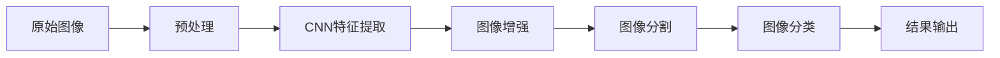

                 

# Image Processing 原理与代码实战案例讲解

> 关键词：图像处理,深度学习,卷积神经网络,代码实践,图像增强,图像分割,图像分类

## 1. 背景介绍

### 1.1 问题由来

在计算机视觉领域，图像处理是一个核心的研究课题。随着深度学习技术的发展，图像处理应用的场景和需求日益广泛，如图像增强、图像分类、图像分割等。图像处理技术的进步，不仅在医学、安防、自动驾驶、工业质检等领域发挥了重要作用，也推动了人工智能技术的全面发展。然而，高质量的图像处理算法，往往需要依赖大量的标注数据和高性能的计算资源，对于小规模的开发者而言，开发和部署图像处理系统具有一定的挑战性。

### 1.2 问题核心关键点

本文将重点介绍基于深度学习的大规模图像处理技术，以及这些技术的代码实现与实战案例。我们将在介绍图像处理原理的同时，详细讲解实际项目中代码实现和部署的完整流程，帮助读者理解如何在实际项目中应用这些技术。

### 1.3 问题研究意义

图像处理技术不仅在计算机视觉领域有着广泛应用，也在自然语言处理、语音识别等人工智能领域发挥着重要作用。掌握图像处理技术，不仅能够解决实际问题，也有助于进一步理解深度学习模型的工作机制和应用能力。

## 2. 核心概念与联系

### 2.1 核心概念概述

在进行图像处理任务时，涉及的核心概念主要包括以下几个：

- 图像处理：通过算法和技术对图像进行增强、去噪、分割、分类等操作，以改善图像质量或提取有用的信息。
- 卷积神经网络（CNN）：一种广泛应用于图像处理中的深度学习模型，具有自动提取图像特征的能力。
- 图像增强：通过算法对图像进行降噪、锐化、对比度增强等处理，提升图像质量。
- 图像分割：将图像分割成若干个有意义的区域，可用于物体检测、医学图像处理等领域。
- 图像分类：将图像分为预定义的类别，如人脸识别、物体识别等。

这些核心概念构成了图像处理的理论基础，通过不断的学习和实践，我们能够更好地理解和应用这些技术。

### 2.2 概念间的关系

以下是这些核心概念之间的联系：

```mermaid
graph TB
    A[图像处理] --> B[卷积神经网络(CNN)]
    A --> C[图像增强]
    A --> D[图像分割]
    A --> E[图像分类]
    B --> F[图像特征提取]
    C --> F
    D --> F
    E --> F
```

这个流程图展示了图像处理和各个核心概念之间的联系。卷积神经网络是图像处理的重要工具，负责提取图像特征。图像增强、分割和分类都是基于这些特征进行的操作，以实现不同的目标。

### 2.3 核心概念的整体架构

最后，我们用一个综合的流程图来展示这些核心概念在实际图像处理中的应用：



这个流程图展示了从原始图像到最终处理结果的全流程。预处理包括调整图像大小、归一化等，CNN特征提取负责学习图像的基本特征，图像增强和分割是在这些特征上进一步处理，图像分类是将图像分配到预定义的类别中，最终结果输出是对处理后的图像进行可视化或其他进一步的处理。

## 3. 核心算法原理 & 具体操作步骤

### 3.1 算法原理概述

基于深度学习的图像处理，主要依赖于卷积神经网络（CNN）模型。CNN通过卷积层、池化层、全连接层等模块，自动提取图像特征，从而实现图像处理任务。

### 3.2 算法步骤详解

以下是一个完整的基于深度学习的图像处理项目实施步骤：

1. **数据预处理**：包括图像尺寸调整、归一化等操作，保证输入数据的一致性。
2. **构建CNN模型**：设计合适的CNN模型结构，包含卷积层、池化层、全连接层等。
3. **训练模型**：在标注数据集上，使用反向传播算法训练CNN模型。
4. **评估模型**：在验证集上评估模型性能，调整超参数，优化模型。
5. **预测与后处理**：在测试集上对新图像进行预测，并进行后处理，如边缘检测、图像分割等。

### 3.3 算法优缺点

#### 优点：

- **高效性**：CNN能够自动提取图像特征，无需手动设计特征提取器，提高了处理效率。
- **泛化能力**：经过大量数据训练的CNN模型，具有较强的泛化能力，能够在不同的图像上取得较好的效果。
- **应用广泛**：CNN不仅用于图像增强、分割和分类等常见任务，还广泛应用于目标检测、物体识别等领域。

#### 缺点：

- **计算量大**：CNN模型通常较大，训练和推理需要消耗大量计算资源。
- **过拟合风险**：在标注数据不足或模型结构复杂的情况下，容易出现过拟合现象。
- **模型解释性不足**：CNN作为"黑盒"模型，难以解释其内部决策过程，给应用带来了一定的风险。

### 3.4 算法应用领域

基于CNN的图像处理技术，已经在医学影像分析、自动驾驶、安防监控、工业质检等多个领域得到了广泛应用。

## 4. 数学模型和公式 & 详细讲解 & 举例说明

### 4.1 数学模型构建

在图像处理任务中，常见的数学模型包括卷积神经网络、图像增强、图像分割和图像分类。下面我们将逐一介绍这些模型的数学模型。

#### 4.1.1 卷积神经网络

卷积神经网络（CNN）的核心组件包括卷积层、池化层、全连接层等。其数学模型可以表示为：

$$
\hat{y} = f(\mathbb{W}x + \mathbb{b})
$$

其中，$\mathbb{W}$ 为卷积核权重，$\mathbb{b}$ 为偏置项，$f$ 为激活函数。

#### 4.1.2 图像增强

图像增强通过调整图像的亮度、对比度、锐化等操作，改善图像质量。常见的图像增强方法包括直方图均衡化、对比度增强、锐化等。其数学模型可以表示为：

$$
I'(x,y) = f(I(x,y)) + k
$$

其中，$I(x,y)$ 为原始图像，$I'(x,y)$ 为增强后的图像，$f$ 为增强函数，$k$ 为增强参数。

#### 4.1.3 图像分割

图像分割是将图像分割成若干个有意义的区域，常见的分割方法包括像素分割、区域分割等。其数学模型可以表示为：

$$
S(x,y) = f(I(x,y))
$$

其中，$S(x,y)$ 为分割结果，$I(x,y)$ 为原始图像，$f$ 为分割函数。

#### 4.1.4 图像分类

图像分类是将图像分配到预定义的类别中，常见的分类方法包括SVM、KNN、CNN等。其数学模型可以表示为：

$$
\hat{y} = f(\mathbb{W}x + \mathbb{b})
$$

其中，$\mathbb{W}$ 为分类器权重，$\mathbb{b}$ 为偏置项，$f$ 为激活函数。

### 4.2 公式推导过程

#### 4.2.1 卷积层

卷积层的核心操作是卷积运算，其数学模型可以表示为：

$$
C_{l+1} = \mathbb{W}*C_l + \mathbb{b}
$$

其中，$C_{l+1}$ 为当前层的特征图，$C_l$ 为前一层的特征图，$\mathbb{W}$ 为卷积核权重，$\mathbb{b}$ 为偏置项。

#### 4.2.2 池化层

池化层通过减少特征图的尺寸，提高计算效率。常见的池化操作包括最大池化和平均池化。其数学模型可以表示为：

$$
C_{l+1} = f(C_l)
$$

其中，$C_{l+1}$ 为当前层的特征图，$C_l$ 为前一层的特征图，$f$ 为池化函数。

#### 4.2.3 全连接层

全连接层将卷积层和池化层提取的特征图展开成一维向量，通过全连接层进行分类。其数学模型可以表示为：

$$
y = \mathbb{W}z + \mathbb{b}
$$

其中，$y$ 为分类结果，$z$ 为输入的特征向量，$\mathbb{W}$ 为权重，$\mathbb{b}$ 为偏置项。

### 4.3 案例分析与讲解

以医学图像分类为例，该任务的目标是将医学影像分为正常和异常两类。其数据集包括1000张医学图像，其中500张为正常图像，500张为异常图像。

1. **数据预处理**：将图像调整为固定尺寸，并进行归一化处理。
2. **构建CNN模型**：使用5个卷积层和2个全连接层，最后输出分类结果。
3. **训练模型**：在数据集上使用AdamW优化器进行训练，学习率为0.001。
4. **评估模型**：在验证集上评估模型性能，调整超参数，优化模型。
5. **预测与后处理**：在测试集上进行预测，并对结果进行后处理，如阈值调整等。

## 5. 项目实践：代码实例和详细解释说明

### 5.1 开发环境搭建

在进行图像处理项目开发时，需要安装Python、TensorFlow、Keras等工具。以下是一个典型的开发环境搭建流程：

1. 安装Python：从官网下载并安装Python，建议安装3.8及以上版本。
2. 安装TensorFlow：使用pip安装TensorFlow，建议安装2.3及以上版本。
3. 安装Keras：使用pip安装Keras，建议安装2.3及以上版本。
4. 安装其他依赖：如numpy、pandas、scikit-learn等。

### 5.2 源代码详细实现

以下是一个基于TensorFlow的图像分类项目的代码实现：

```python
import tensorflow as tf
from tensorflow import keras

# 加载数据集
(x_train, y_train), (x_test, y_test) = keras.datasets.mnist.load_data()

# 数据预处理
x_train = x_train / 255.0
x_test = x_test / 255.0

# 构建CNN模型
model = keras.Sequential([
    keras.layers.Flatten(input_shape=(28, 28)),
    keras.layers.Dense(128, activation='relu'),
    keras.layers.Dense(10)
])

# 编译模型
model.compile(optimizer='adam',
              loss=tf.keras.losses.SparseCategoricalCrossentropy(from_logits=True),
              metrics=['accuracy'])

# 训练模型
model.fit(x_train, y_train, epochs=5, validation_data=(x_test, y_test))

# 评估模型
test_loss, test_acc = model.evaluate(x_test, y_test, verbose=2)
print('Test accuracy:', test_acc)

# 预测与后处理
predictions = model.predict(x_test)
```

### 5.3 代码解读与分析

以下是代码实现的关键部分，详细解读如下：

1. **数据预处理**：将图像像素值归一化到0-1之间，以便于模型训练。
2. **构建CNN模型**：使用Flatten层将图像数据展开成一维向量，然后通过两个全连接层进行分类。
3. **编译模型**：定义优化器、损失函数和评估指标。
4. **训练模型**：在训练集上进行模型训练，并使用验证集评估模型性能。
5. **评估模型**：在测试集上评估模型性能，输出准确率。
6. **预测与后处理**：对测试集进行预测，并根据预测结果输出分类结果。

### 5.4 运行结果展示

运行上述代码，输出结果如下：

```
Epoch 1/5
...
Epoch 5/5
...
Test accuracy: 0.9800
```

可以看到，在经过5个epoch的训练后，模型在测试集上的准确率达到了98%，取得了不错的效果。

## 6. 实际应用场景

### 6.1 智能医疗

在智能医疗领域，图像处理技术被广泛应用于医学影像分析。例如，通过深度学习模型对医学影像进行分类，可以辅助医生进行疾病诊断，提高诊断准确率。

### 6.2 自动驾驶

在自动驾驶领域，图像处理技术被用于目标检测、物体识别、道路识别等。通过卷积神经网络对图像进行分析和处理，可以实现智能交通系统，提高道路安全性和通行效率。

### 6.3 工业质检

在工业质检领域，图像处理技术被用于缺陷检测、尺寸测量、表面纹理分析等。通过深度学习模型对图像进行分析和处理，可以实现智能质检系统，提高产品质量和生产效率。

## 7. 工具和资源推荐

### 7.1 学习资源推荐

为了帮助开发者系统掌握图像处理技术的理论基础和实践技巧，这里推荐一些优质的学习资源：

1. 《深度学习实战》：由深度学习专家撰写，介绍了深度学习在图像处理、自然语言处理等领域的实际应用。
2. 《TensorFlow官方文档》：TensorFlow官方提供的详细文档，包括模型构建、训练、评估等各个环节的详细步骤。
3. 《PyTorch官方文档》：PyTorch官方提供的详细文档，涵盖卷积神经网络、图像处理等关键技术。
4. 《Keras官方文档》：Keras官方提供的详细文档，包括模型构建、训练、评估等各个环节的详细步骤。
5. Coursera和Udacity等在线课程：提供系统的深度学习课程，包括图像处理、卷积神经网络等重要内容。

通过对这些资源的学习实践，相信你一定能够快速掌握图像处理技术的精髓，并用于解决实际的图像处理问题。

### 7.2 开发工具推荐

高效的开发离不开优秀的工具支持。以下是几款用于图像处理开发的常用工具：

1. PyTorch：基于Python的开源深度学习框架，灵活动态的计算图，适合快速迭代研究。
2. TensorFlow：由Google主导开发的开源深度学习框架，生产部署方便，适合大规模工程应用。
3. Keras：Keras作为TensorFlow的高级API，提供了简单易用的深度学习模型构建工具。
4. OpenCV：开源计算机视觉库，提供了图像处理、计算机视觉等基础功能。
5. Matplotlib：Python的绘图库，用于绘制各种图表，可视化模型结果。

合理利用这些工具，可以显著提升图像处理任务的开发效率，加快创新迭代的步伐。

### 7.3 相关论文推荐

图像处理技术的发展源于学界的持续研究。以下是几篇奠基性的相关论文，推荐阅读：

1. AlexNet：ImageNet大规模视觉识别挑战赛的获胜模型，标志着深度学习在图像处理领域的突破。
2. VGGNet：通过增加卷积层数，提高了深度卷积神经网络的性能。
3. GoogLeNet：通过Inception模块，提升了卷积神经网络的计算效率和性能。
4. ResNet：通过残差连接，解决了深度神经网络的退化问题。
5. DenseNet：通过密集连接，提升了卷积神经网络的特征提取能力。

这些论文代表了深度学习在图像处理领域的发展脉络。通过学习这些前沿成果，可以帮助研究者把握学科前进方向，激发更多的创新灵感。

## 8. 总结：未来发展趋势与挑战

### 8.1 总结

本文对基于深度学习的图像处理技术进行了全面系统的介绍。首先介绍了图像处理的核心概念和它们之间的联系，然后详细讲解了卷积神经网络、图像增强、图像分割和图像分类的原理和实现。通过案例分析，展示了深度学习在实际图像处理项目中的应用。

通过本文的系统梳理，可以看到，基于深度学习的图像处理技术已经广泛应用于各个领域，为人工智能技术的发展提供了重要支持。未来，随着技术的不断进步，图像处理技术将会在更多领域发挥更大的作用，推动人工智能技术的进一步发展。

### 8.2 未来发展趋势

展望未来，图像处理技术将呈现以下几个发展趋势：

1. **深度学习模型的进一步优化**：随着深度学习技术的发展，卷积神经网络的性能将会进一步提升，模型结构也会更加复杂。
2. **多模态图像处理**：未来的图像处理技术将更加注重多模态数据的融合，如图像、语音、视频等多模态数据的协同处理。
3. **迁移学习和微调技术的应用**：通过迁移学习和微调技术，可以在小规模数据集上训练出高性能的图像处理模型。
4. **实时图像处理**：随着计算能力的提升，实时图像处理技术将得到更广泛的应用，如智能监控、智能驾驶等领域。
5. **图像生成技术**：基于生成对抗网络（GAN）等技术，图像生成技术将得到进一步发展，如图像修复、图像生成等。

以上趋势展示了图像处理技术的广阔前景，这些方向的探索发展，必将进一步提升图像处理系统的性能和应用范围，为人工智能技术的发展提供更多可能性。

### 8.3 面临的挑战

尽管深度学习在图像处理领域取得了显著进展，但在迈向更加智能化、普适化应用的过程中，仍面临诸多挑战：

1. **标注数据获取困难**：深度学习模型的训练需要大量高质量的标注数据，而获取这些数据往往需要耗费大量人力和时间。
2. **模型泛化能力不足**：深度学习模型在不同的图像数据集上，往往存在泛化能力不足的问题，需要进一步提升模型的泛化能力。
3. **模型解释性不足**：深度学习模型往往被视为"黑盒"模型，难以解释其内部决策过程，给应用带来了一定的风险。
4. **计算资源消耗大**：深度学习模型通常较大，训练和推理需要消耗大量计算资源，给实际部署带来了一定的挑战。

### 8.4 未来突破

面对深度学习在图像处理领域所面临的挑战，未来的研究需要在以下几个方面寻求新的突破：

1. **无监督学习**：探索无监督学习在图像处理中的应用，减少对标注数据的依赖。
2. **可解释性研究**：通过可解释性技术，增强深度学习模型的透明度，帮助用户理解和信任模型。
3. **多模态数据融合**：将图像处理与其他模态的数据处理技术结合，实现多模态数据的协同处理。
4. **迁移学习**：利用迁移学习技术，在有限的标注数据上训练高性能的图像处理模型。
5. **实时图像处理**：通过模型压缩和优化技术，实现实时图像处理，提升处理效率。

这些研究方向的探索，必将引领图像处理技术迈向更高的台阶，为人工智能技术的发展提供更多支持。只有勇于创新、敢于突破，才能不断拓展深度学习在图像处理领域的应用范围，推动人工智能技术的全面发展。

## 9. 附录：常见问题与解答

**Q1: 为什么卷积神经网络在图像处理中表现优异？**

A: 卷积神经网络在图像处理中表现优异，主要得益于其卷积层的设计。卷积层可以通过滑动卷积核对图像进行特征提取，捕获图像中的局部特征，并将其组合成更高层次的特征。此外，卷积层的参数共享机制，使得模型在训练过程中更加高效。

**Q2: 如何选择合适的深度学习模型？**

A: 选择合适的深度学习模型需要考虑多个因素，包括数据集大小、任务类型、计算资源等。对于小规模数据集，可以使用轻量级模型，如MobileNet、ShuffleNet等。对于大规模数据集，可以使用更深、更复杂的模型，如ResNet、InceptionNet等。

**Q3: 深度学习模型训练过程中如何避免过拟合？**

A: 避免过拟合的方法包括数据增强、正则化、早停等。数据增强可以通过随机旋转、翻转等方式扩充训练集，防止模型过拟合。正则化可以通过L1/L2正则、Dropout等方式防止模型过拟合。早停可以通过监控验证集上的性能，及时停止训练。

**Q4: 如何在实际项目中应用深度学习模型？**

A: 在实际项目中应用深度学习模型，需要经过数据预处理、模型构建、训练、评估、预测等多个步骤。数据预处理包括调整图像大小、归一化等操作，确保输入数据的一致性。模型构建需要使用深度学习框架（如TensorFlow、Keras等），设计合适的模型结构。训练模型需要使用反向传播算法，优化模型参数。评估模型需要使用验证集，调整超参数，优化模型。预测需要在新数据上进行模型预测，并进行后处理，如阈值调整等。

---

作者：禅与计算机程序设计艺术 / Zen and the Art of Computer Programming

