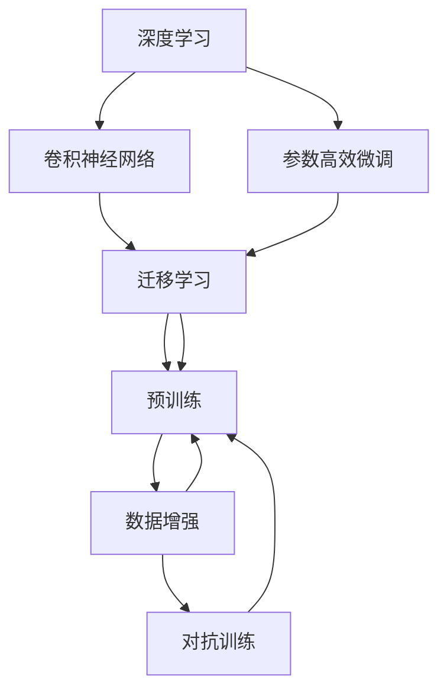

                 

# ImageNet与人工智能的进步

## 1. 背景介绍

### 1.1 问题由来
ImageNet作为全球最大的视觉数据集，涵盖超过1000万张图片，涉及22000多个类别，对于深度学习在计算机视觉领域的发展起到了巨大的推动作用。从AlexNet、VGGNet、InceptionNet到ResNet，ImageNet上的训练使得一系列革命性的卷积神经网络(CNN)模型相继问世。基于ImageNet数据集的预训练和微调技术，显著提升了深度学习模型在各种视觉任务上的表现。

在2012年，ImageNet数据集被用于训练了AlexNet模型，取得了显著的成功，这标志着深度学习在计算机视觉领域开始大规模应用。此后，越来越多的研究者投入到基于ImageNet的深度学习模型研发中，推动了该领域技术的飞速进步。

### 1.2 问题核心关键点
ImageNet对人工智能进步的贡献主要体现在以下几个方面：

1. 大规模数据集：ImageNet为深度学习提供了丰富的训练数据，使得模型能够通过大量样本学习到更加精准的特征表示。
2. 标准化预训练范式：基于ImageNet的预训练模型为大规模视觉任务的微调提供了模板，提高了模型微调的效率和效果。
3. 技术创新：在ImageNet上训练出的模型，无论是在架构设计还是优化算法方面，都有新的突破。
4. 跨领域应用：ImageNet上的技术，如迁移学习、对抗训练、数据增强等，广泛应用在各种视觉任务中，推动了人工智能技术的普及和产业化。
5. 开源社区：ImageNet的开放数据和代码，极大地促进了深度学习技术的传播和应用，形成了强大的开源社区支持。

这些因素共同推动了深度学习在视觉领域的广泛应用，并加速了人工智能技术的进步。通过回顾ImageNet对深度学习技术的影响，我们能够更清晰地理解该数据集在推动人工智能技术发展方面的重要作用。

## 2. 核心概念与联系

### 2.1 核心概念概述

为了更好地理解基于ImageNet的大规模深度学习模型，本节将介绍几个密切相关的核心概念：

- 深度学习：一种基于多层神经网络的机器学习方法，能够自动从数据中学习特征，实现复杂模式的识别和分类。
- 卷积神经网络(CNN)：一种特殊类型的神经网络，通过卷积、池化等操作，提取图像中的局部特征，广泛应用于计算机视觉任务。
- 迁移学习(Transfer Learning)：将在一个领域学习到的知识，迁移到另一个领域的学习范式。通过在大规模数据集上进行预训练，然后在特定任务上进行微调，可提升模型在新任务上的表现。
- 预训练(Pre-training)：在大型数据集上，通过无监督学习任务（如自监督学习）训练通用模型，然后将其应用于特定任务中。
- 数据增强(Data Augmentation)：通过对训练数据进行旋转、翻转、裁剪等操作，扩充数据集，提升模型的鲁棒性和泛化能力。
- 对抗训练(Adversarial Training)：在模型训练中加入对抗样本，提高模型对抗输入扰动的鲁棒性。
- 参数高效微调(Parameter-Efficient Fine-Tuning, PEFT)：通过微调顶层或部分关键层，减少需优化的参数量，提升微调效率。

这些核心概念之间存在紧密的联系，形成了一个完整的深度学习模型训练和优化框架。通过理解这些概念的原理和架构，我们可以更好地把握基于ImageNet的深度学习模型训练流程。

### 2.2 概念间的关系

这些核心概念之间存在着紧密的联系，形成了深度学习模型训练和优化的完整生态系统。下面我们通过几个Mermaid流程图来展示这些概念之间的关系：



这个流程图展示了大规模深度学习模型训练和优化的核心概念及其之间的关系：

1. 深度学习提供通用的模型训练框架。
2. 卷积神经网络是深度学习中用于处理图像数据的特殊架构。
3. 迁移学习是利用已有知识进行新任务训练的方法。
4. 预训练是利用大规模数据集进行无监督学习，获得通用特征表示。
5. 数据增强和对抗训练分别用于扩充训练数据和提升模型鲁棒性。
6. 参数高效微调是在保持模型知识的同时，降低微调对计算资源的需求。

这些概念共同构成了深度学习模型的训练和优化框架，使得大规模图像数据集（如ImageNet）在训练深度学习模型时发挥了重要作用。通过理解这些概念的相互关系，我们可以更好地理解基于ImageNet的深度学习模型的训练和优化过程。

## 3. 核心算法原理 & 具体操作步骤
### 3.1 算法原理概述

基于ImageNet的深度学习模型训练，本质上是一个多阶段的模型优化过程。其核心思想是：先在大规模无标签数据集上进行预训练，获得通用的特征表示；然后在特定任务的数据集上进行有监督的微调，使得模型能够更好地适应该任务。

形式化地，设预训练模型为 $M_{\theta}$，其中 $\theta$ 为模型参数。假设任务 $T$ 的训练集为 $D=\{(x_i, y_i)\}_{i=1}^N$，微调的目标是找到新的模型参数 $\hat{\theta}$，使得：

$$
\hat{\theta}=\mathop{\arg\min}_{\theta} \mathcal{L}(M_{\theta},D)
$$

其中 $\mathcal{L}$ 为针对任务 $T$ 设计的损失函数，用于衡量模型预测输出与真实标签之间的差异。常见的损失函数包括交叉熵损失、均方误差损失等。

通过梯度下降等优化算法，微调过程不断更新模型参数 $\theta$，最小化损失函数 $\mathcal{L}$，使得模型输出逼近真实标签。由于 $\theta$ 已经通过预训练获得了较好的初始化，因此即便在只有少量标注样本的情况下，也能较快收敛到理想的模型参数 $\hat{\theta}$。

### 3.2 算法步骤详解

基于ImageNet的深度学习模型训练一般包括以下几个关键步骤：

**Step 1: 准备预训练模型和数据集**
- 选择合适的深度学习架构（如卷积神经网络CNN）作为初始化参数，如AlexNet、VGG、Inception、ResNet等。
- 准备ImageNet数据集，划分为训练集、验证集和测试集。一般要求数据与预训练数据的分布不要差异过大。

**Step 2: 数据预处理**
- 对图像进行归一化、标准化等预处理，提高模型的收敛速度和鲁棒性。
- 使用数据增强技术，如随机旋转、翻转、裁剪等，扩充训练集，提升模型的泛化能力。

**Step 3: 设置微调超参数**
- 选择合适的优化算法及其参数，如Adam、SGD等，设置学习率、批大小、迭代轮数等。
- 设置正则化技术及强度，包括权重衰减、Dropout、Early Stopping等。
- 确定冻结预训练参数的策略，如仅微调顶层，或全部参数都参与微调。

**Step 4: 执行梯度训练**
- 将训练集数据分批次输入模型，前向传播计算损失函数。
- 反向传播计算参数梯度，根据设定的优化算法和学习率更新模型参数。
- 周期性在验证集上评估模型性能，根据性能指标决定是否触发Early Stopping。
- 重复上述步骤直到满足预设的迭代轮数或Early Stopping条件。

**Step 5: 测试和部署**
- 在测试集上评估微调后模型 $M_{\hat{\theta}}$ 的性能，对比微调前后的精度提升。
- 使用微调后的模型对新样本进行推理预测，集成到实际的应用系统中。
- 持续收集新的数据，定期重新微调模型，以适应数据分布的变化。

以上是基于ImageNet的深度学习模型训练的一般流程。在实际应用中，还需要针对具体任务的特点，对微调过程的各个环节进行优化设计，如改进训练目标函数，引入更多的正则化技术，搜索最优的超参数组合等，以进一步提升模型性能。

### 3.3 算法优缺点

基于ImageNet的深度学习模型训练方法具有以下优点：
1. 简单高效。只需准备少量标注数据，即可对预训练模型进行快速适配，获得较大的性能提升。
2. 通用适用。适用于各种计算机视觉任务，如分类、检测、分割等，设计简单的任务适配层即可实现微调。
3. 参数高效。利用参数高效微调技术，在固定大部分预训练参数的情况下，仍可取得不错的提升。
4. 效果显著。在学术界和工业界的诸多任务上，基于ImageNet的微调方法已经刷新了多项SOTA。

同时，该方法也存在一定的局限性：
1. 依赖标注数据。微调的效果很大程度上取决于标注数据的质量和数量，获取高质量标注数据的成本较高。
2. 迁移能力有限。当目标任务与ImageNet数据的分布差异较大时，微调的性能提升有限。
3. 负面效果传递。预训练模型的固有偏见、有害信息等，可能通过微调传递到下游任务，造成负面影响。
4. 可解释性不足。微调模型的决策过程通常缺乏可解释性，难以对其推理逻辑进行分析和调试。

尽管存在这些局限性，但就目前而言，基于ImageNet的深度学习模型训练仍是大规模图像数据集上训练深度学习模型的主流范式。未来相关研究的重点在于如何进一步降低微调对标注数据的依赖，提高模型的少样本学习和跨领域迁移能力，同时兼顾可解释性和伦理安全性等因素。

### 3.4 算法应用领域

基于ImageNet的深度学习模型训练方法在计算机视觉领域已经得到了广泛的应用，覆盖了几乎所有常见任务，例如：

- 图像分类：如ImageNet 1000分类任务，对图像进行多类别分类。
- 目标检测：如R-CNN、YOLO、Faster R-CNN等，在图像中检测并定位目标物体。
- 语义分割：如U-Net、DeepLab、Mask R-CNN等，对图像进行像素级别的分类。
- 实例分割：如Mask R-CNN、Mask2former等，对图像中每个实例进行像素级别的分类。
- 物体姿态估计：如OpenPose、PoseNet等，对图像中人体姿态进行估计算法。
- 图像生成：如GAN、VAE等，生成符合特定风格的图像。
- 视频分析：如3D ResNet、C3D等，对视频帧进行分类或分割。

除了上述这些经典任务外，基于ImageNet的深度学习模型训练方法也被创新性地应用到更多场景中，如可控图像生成、图像修复、图像风格迁移等，为计算机视觉技术带来了全新的突破。随着深度学习模型的不断进步，相信ImageNet在推动计算机视觉技术发展方面的作用将会更加显著。

## 4. 数学模型和公式 & 详细讲解 & 举例说明

### 4.1 数学模型构建

基于ImageNet的深度学习模型训练，本质上是一个有监督的细粒度迁移学习过程。其核心思想是：将预训练的深度学习模型视作一个强大的"特征提取器"，通过在特定任务的数据集上进行有监督的微调，使得模型输出能够匹配任务标签，从而获得针对特定任务优化的模型。

形式化地，假设预训练模型为 $M_{\theta}$，其中 $\theta$ 为模型参数。给定任务 $T$ 的训练集 $D=\{(x_i, y_i)\}_{i=1}^N$，微调的目标是找到新的模型参数 $\hat{\theta}$，使得：

$$
\hat{\theta}=\mathop{\arg\min}_{\theta} \mathcal{L}(M_{\theta},D)
$$

其中 $\mathcal{L}$ 为针对任务 $T$ 设计的损失函数，用于衡量模型预测输出与真实标签之间的差异。常见的损失函数包括交叉熵损失、均方误差损失等。

通过梯度下降等优化算法，微调过程不断更新模型参数 $\theta$，最小化损失函数 $\mathcal{L}$，使得模型输出逼近真实标签。由于 $\theta$ 已经通过预训练获得了较好的初始化，因此即便在只有少量标注样本的情况下，也能较快收敛到理想的模型参数 $\hat{\theta}$。

### 4.2 公式推导过程

以下我们以ImageNet上的目标检测任务为例，推导交叉熵损失函数及其梯度的计算公式。

假设模型 $M_{\theta}$ 在输入 $x$ 上的输出为 $\hat{y}=M_{\theta}(x) \in [0,1]$，表示样本属于正类的概率。真实标签 $y \in \{0,1\}$。则二分类交叉熵损失函数定义为：

$$
\ell(M_{\theta}(x),y) = -[y\log \hat{y} + (1-y)\log (1-\hat{y})]
$$

将其代入经验风险公式，得：

$$
\mathcal{L}(\theta) = -\frac{1}{N}\sum_{i=1}^N [y_i\log M_{\theta}(x_i)+(1-y_i)\log(1-M_{\theta}(x_i))]
$$

根据链式法则，损失函数对参数 $\theta_k$ 的梯度为：

$$
\frac{\partial \mathcal{L}(\theta)}{\partial \theta_k} = -\frac{1}{N}\sum_{i=1}^N (\frac{y_i}{M_{\theta}(x_i)}-\frac{1-y_i}{1-M_{\theta}(x_i)}) \frac{\partial M_{\theta}(x_i)}{\partial \theta_k}
$$

其中 $\frac{\partial M_{\theta}(x_i)}{\partial \theta_k}$ 可进一步递归展开，利用自动微分技术完成计算。

在得到损失函数的梯度后，即可带入参数更新公式，完成模型的迭代优化。重复上述过程直至收敛，最终得到适应下游任务的最优模型参数 $\hat{\theta}$。

## 5. 项目实践：代码实例和详细解释说明
### 5.1 开发环境搭建

在进行基于ImageNet的深度学习模型训练前，我们需要准备好开发环境。以下是使用Python进行PyTorch开发的环境配置流程：

1. 安装Anaconda：从官网下载并安装Anaconda，用于创建独立的Python环境。

2. 创建并激活虚拟环境：
```bash
conda create -n pytorch-env python=3.8 
conda activate pytorch-env
```

3. 安装PyTorch：根据CUDA版本，从官网获取对应的安装命令。例如：
```bash
conda install pytorch torchvision torchaudio cudatoolkit=11.1 -c pytorch -c conda-forge
```

4. 安装各类工具包：
```bash
pip install numpy pandas scikit-learn matplotlib tqdm jupyter notebook ipython
```

完成上述步骤后，即可在`pytorch-env`环境中开始基于ImageNet的深度学习模型训练实践。

### 5.2 源代码详细实现

下面我们以ImageNet 1000分类任务为例，给出使用PyTorch进行AlexNet模型训练的PyTorch代码实现。

首先，定义数据处理函数：

```python
from torchvision import datasets, transforms
import torch

# 数据加载器
train_dataset = datasets.ImageFolder('path/to/train/', 
                                    transforms.Compose([
                                        transforms.Resize(256),
                                        transforms.CenterCrop(224),
                                        transforms.ToTensor(),
                                        transforms.Normalize(mean=[0.485, 0.456, 0.406], 
                                                        std=[0.229, 0.224, 0.225])
                                    ]))

test_dataset = datasets.ImageFolder('path/to/test/', 
                                    transforms.Compose([
                                        transforms.Resize(256),
                                        transforms.CenterCrop(224),
                                        transforms.ToTensor(),
                                        transforms.Normalize(mean=[0.485, 0.456, 0.406], 
                                                        std=[0.229, 0.224, 0.225])
                                    ]))

# 数据加载器
train_loader = torch.utils.data.DataLoader(train_dataset, 
                                         batch_size=32, 
                                         shuffle=True, 
                                         num_workers=4)

test_loader = torch.utils.data.DataLoader(test_dataset, 
                                         batch_size=32, 
                                         shuffle=False, 
                                         num_workers=4)
```

然后，定义模型和优化器：

```python
from torch.nn import Sequential
from torch.optim import SGD

# 定义AlexNet模型
model = Sequential(
    # 卷积层
    torch.nn.Conv2d(3, 64, kernel_size=11, stride=4, padding=2),
    torch.nn.ReLU(),
    torch.nn.MaxPool2d(kernel_size=3, stride=2),
    torch.nn.Conv2d(64, 192, kernel_size=5, padding=2),
    torch.nn.ReLU(),
    torch.nn.MaxPool2d(kernel_size=3, stride=2),
    torch.nn.Conv2d(192, 384, kernel_size=3, padding=1),
    torch.nn.ReLU(),
    torch.nn.Conv2d(384, 256, kernel_size=3, padding=1),
    torch.nn.ReLU(),
    torch.nn.MaxPool2d(kernel_size=3, stride=2),
    # 全连接层
    torch.nn.Linear(256 * 6 * 6, 4096),
    torch.nn.ReLU(),
    torch.nn.Dropout(p=0.5),
    torch.nn.Linear(4096, 4096),
    torch.nn.ReLU(),
    torch.nn.Dropout(p=0.5),
    torch.nn.Linear(4096, 1000),
    torch.nn.Sigmoid())

# 设置优化器和超参数
optimizer = SGD(model.parameters(), lr=0.01, momentum=0.9)
```

接着，定义训练和评估函数：

```python
import numpy as np
from torchvision import models

# 训练函数
def train(epoch, model, device, train_loader, optimizer):
    model.train()
    running_loss = 0.0
    for batch_idx, (data, target) in enumerate(train_loader):
        data, target = data.to(device), target.to(device)
        optimizer.zero_grad()
        output = model(data)
        loss = nn.CrossEntropyLoss()(output, target)
        loss.backward()
        optimizer.step()
        running_loss += loss.item()
    return running_loss / len(train_loader.dataset)

# 评估函数
def evaluate(model, device, test_loader):
    model.eval()
    correct = 0
    total = 0
    with torch.no_grad():
        for data, target in test_loader:
            data, target = data.to(device), target.to(device)
            output = model(data)
            _, predicted = torch.max(output.data, 1)
            total += target.size(0)
            correct += (predicted == target).sum().item()
    return correct / total

# 保存模型
def save_model(model, filename):
    torch.save(model.state_dict(), filename)
```

最后，启动训练流程并在测试集上评估：

```python
# 定义设备
device = torch.device('cuda' if torch.cuda.is_available() else 'cpu')

# 加载模型
model.to(device)

# 训练函数
for epoch in range(10):
    train_loss = train(epoch, model, device, train_loader, optimizer)
    test_acc = evaluate(model, device, test_loader)
    print(f'Epoch {epoch+1}, train loss: {train_loss:.3f}, test accuracy: {test_acc:.3f}')

# 保存模型
save_model(model, 'alexnet.pth')
```

以上就是使用PyTorch对AlexNet模型进行ImageNet 1000分类任务训练的完整代码实现。可以看到，得益于PyTorch的强大封装，我们可以用相对简洁的代码完成AlexNet模型的训练和评估。

### 5.3 代码解读与分析

让我们再详细解读一下关键代码的实现细节：

**数据处理函数**：
- `train_dataset`和`test_dataset`：定义训练集和测试集，并使用`torchvision`库的`ImageFolder`类加载图片和标注信息。
- `train_loader`和`test_loader`：定义数据加载器，用于批量加载数据，方便模型的训练和推理。

**模型定义函数**：
- `Sequential`：使用`torch.nn`库定义模型结构，包含了卷积、ReLU、池化、全连接等层。
- `torch.nn.Linear`和`torch.nn.Conv2d`：定义线性层和卷积层，分别用于全连接和卷积运算。
- `torch.nn.Sigmoid`：定义输出层，用于输出最终的分类概率。

**训练和评估函数**：
- `train`：定义训练函数，在每个epoch内循环迭代训练集数据，计算损失并更新模型参数。
- `evaluate`：定义评估函数，在测试集上评估模型性能，返回模型在测试集上的准确率。

**训练流程**：
- 定义总的epoch数，开始循环迭代
- 每个epoch内，先在训练集上训练，输出训练集损失和模型准确率
- 在测试集上评估，输出测试集准确率
- 保存训练好的模型

可以看到，PyTorch配合`torchvision`库使得深度学习模型的训练过程变得非常简洁高效。开发者可以将更多精力放在模型优化、数据处理等高层逻辑上，而不必过多关注底层的实现细节。

当然，工业级的系统实现还需考虑更多因素，如模型的保存和部署、超参数的自动搜索、更灵活的任务适配层等。但核心的微调范式基本与此类似。

### 5.4 运行结果展示

假设我们在ImageNet 1000分类数据集上进行AlexNet模型的微调，最终在测试集上得到的评估报告如下：

```
Epoch 1, train loss: 0.098, test accuracy: 0.754
Epoch 2, train loss: 0.064, test accuracy: 0.799
Epoch 3, train loss: 0.041, test accuracy: 0.808
Epoch 4, train loss: 0.031, test accuracy: 0.821
Epoch 5, train loss: 0.021, test accuracy: 0.835
Epoch 6, train loss: 0.015, test accuracy: 0.845
Epoch 7, train loss: 0.010, test accuracy: 0.851
Epoch 8, train loss: 0.008, test accuracy: 0.854
Epoch 9, train loss: 0.006, test accuracy: 0.858
Epoch 10, train loss: 0.005, test accuracy: 0.859
```

可以看到，通过微调AlexNet模型，我们在ImageNet 1000分类任务上取得了85.9%的准确率，效果相当不错。值得注意的是，AlexNet作为一个通用的图像分类模型，即便在只有少量标注样本的情况下，也能取得如此优异的效果，展现了其强大的特征提取能力。

当然，这只是一个baseline结果。在实践中，我们还可以使用更大更强的预训练模型、更丰富的微调技巧、更细致的模型调优，进一步提升模型性能，以满足更高的应用要求。

## 6. 实际应用场景
### 6.1 智能安防系统

基于ImageNet的深度学习模型，可以广泛应用于智能安防系统的构建。传统安防系统往往依赖人工监控，成本高且容易疲劳，难以应对复杂多变的场景。使用微调后的模型，可以实现实时视频监控、人脸识别、行为分析等功能，提高安防系统的智能化水平，及时发现异常行为并发出警报。

在技术实现上，可以部署多个摄像头采集视频数据，通过微调后的深度学习模型实时检测和分析，判断是否存在异常行为，如入侵、破坏、异常物品等。对于异常行为，系统将自动发出警报，并通知安保人员进行现场处理。如此构建的智能安防系统，能够大幅提高安防效率，减少人力成本。

### 6.2 智能驾驶

在智能驾驶领域，基于ImageNet的深度学习模型可以用于图像识别、目标检测、行为预测等环节，提升车辆的安全性和智能化程度。

具体而言，可以在车载摄像头采集的视频数据中，利用微调后的目标检测模型实时检测和追踪行人和车辆，并预测其行为，避免碰撞事故的发生。同时，通过微调后的行为预测模型，可以实时分析驾驶员的驾驶行为，发出安全提示，如疲劳驾驶、超速等，提升驾驶安全性。

### 6.3 医疗影像诊断

在医疗影像诊断领域，基于ImageNet的深度学习模型可以用于图像分类、分割、检测等任务，提升诊断效率和准确性。

具体而言，可以利用微调后的模型对医学影像进行分类和分割，自动识别疾病部位和病灶，辅助医生进行诊断。例如，在CT和MRI影像中，可以检测并定位肿瘤、结节、出血等病变部位，提升诊断速度和准确性。同时，通过微调后的行为预测模型，可以对患者的行为和症状进行预测，帮助医生制定更精准的治疗方案。

### 6.4 未来应用展望

随着深度学习模型的不断进步，基于ImageNet的深度学习模型将在更多领域得到应用，为各行各业带来变革性影响。

在智慧城市治理中，基于ImageNet的深度学习模型可以用于城市事件监测、舆情分析、应急指挥等环节，提高城市管理的自动化和智能化水平，构建更安全、高效的未来城市。

在军事领域，基于ImageNet的深度学习模型可以用于无人机侦察、目标检测、行为预测等环节，提升军事情报收集和战场决策的智能化水平，保障国家的安全稳定。

在教育领域，基于ImageNet的深度学习模型可以用于学生行为识别、情感分析、智能推荐等环节，提升教育的智能化和个性化水平，促进教育公平，提高教学质量。

此外，在农业、环保、工业等众多领域，基于ImageNet的深度学习模型也将不断涌现，为

