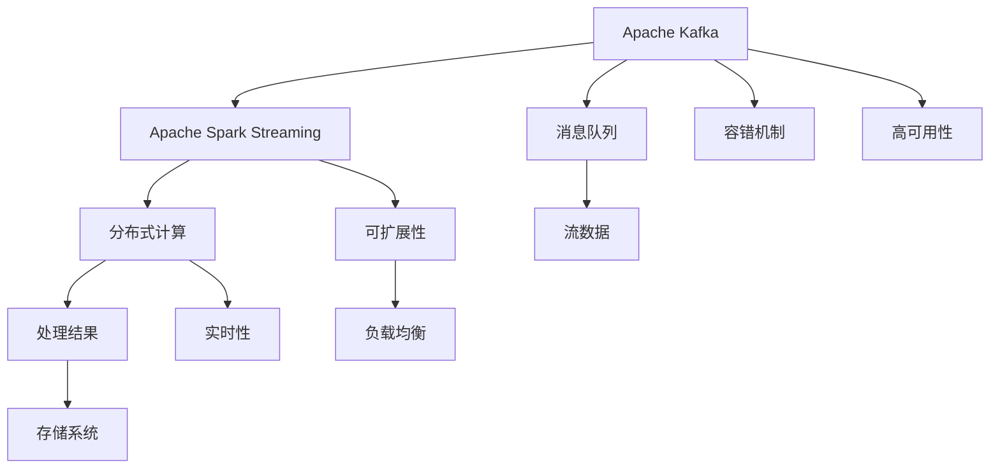
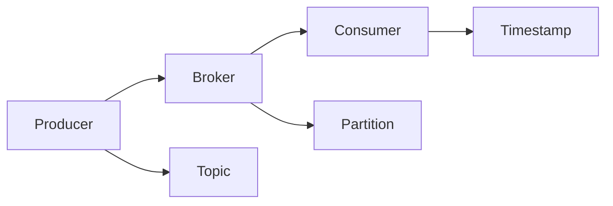
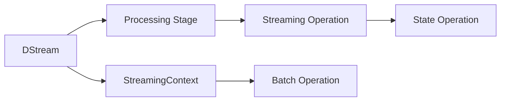
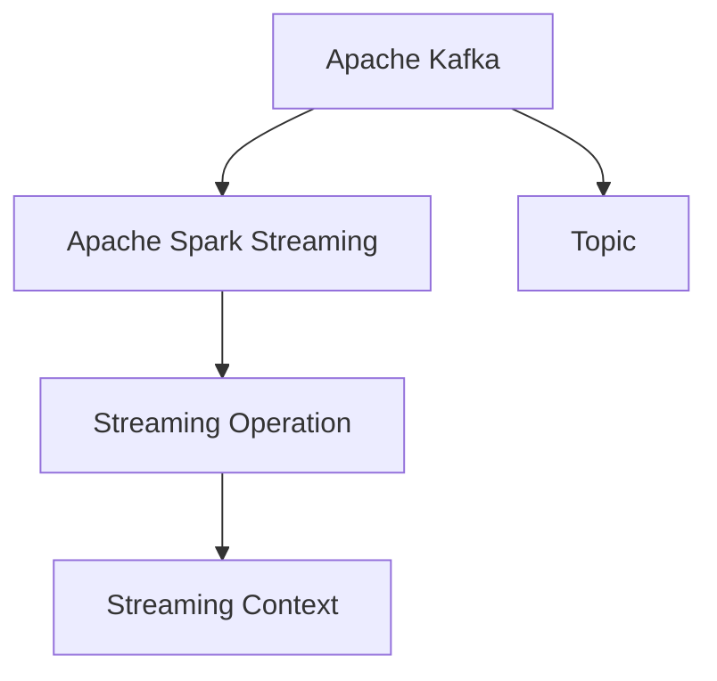
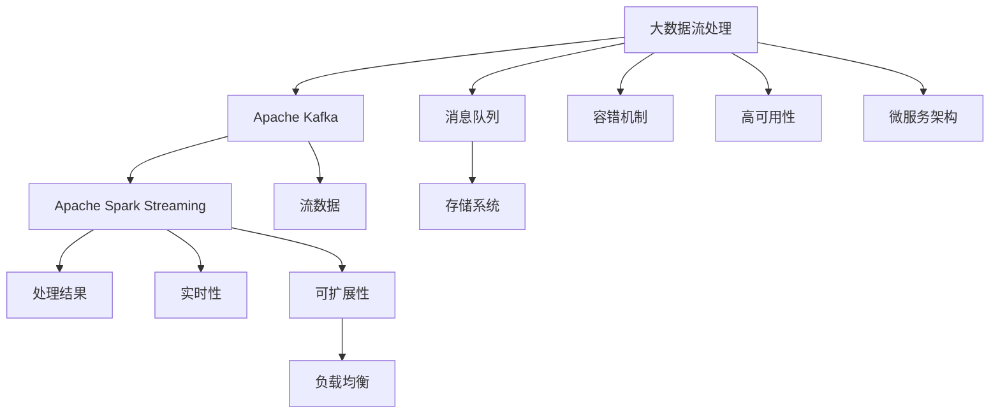

                 

# Kafka-Spark Streaming整合原理与代码实例讲解

> 关键词：Kafka, Spark Streaming, 大数据流处理, 实时数据处理, 微服务架构

## 1. 背景介绍

### 1.1 问题由来

在现代数据处理领域，实时数据处理（Stream Processing）的应用场景越来越广泛。例如，金融领域的实时交易监控、物联网设备的实时数据采集与分析、社交媒体的实时情感分析等。为了满足这些需求，实时数据处理技术得到了长足的发展，其中以Apache Kafka和Apache Spark Streaming为代表的流处理框架，因其高可靠性和强大的处理能力，成为业界主流的实时数据处理方案。

### 1.2 问题核心关键点

Kafka和Spark Streaming的整合，可以将实时数据的流式传输与实时处理结合起来，实现高效、可靠、可扩展的实时数据处理。这种整合的核心关键点在于：

1. **数据传输**：Kafka作为数据流传输的中介，提供高性能、高可靠的数据传输服务，保证数据的及时性和完整性。
2. **数据处理**：Spark Streaming利用Spark的计算能力，对Kafka中的实时数据进行高效的分布式处理。
3. **系统架构**：通过微服务架构的设计，将Kafka和Spark Streaming有机结合，实现系统的高度可扩展性和容错性。

### 1.3 问题研究意义

Kafka-Spark Streaming的整合，不仅能够满足企业对于实时数据处理的需求，还具备以下几方面重要意义：

1. **提高数据处理效率**：实时数据能够直接进入处理系统，减少数据传输和存储的开销，提高数据处理的效率。
2. **增强系统可扩展性**：通过微服务架构的设计，系统能够根据业务需求动态扩展，适应数据量增长带来的压力。
3. **提升系统可靠性**：Kafka和Spark Streaming的高可靠性设计，确保数据处理的连续性和稳定性。
4. **优化资源利用**：通过合理分配计算资源，避免资源浪费，提高系统的整体效率。

## 2. 核心概念与联系

### 2.1 核心概念概述

为更好地理解Kafka-Spark Streaming的整合原理，本节将介绍几个关键概念：

- **Apache Kafka**：开源的分布式流处理平台，提供高性能、高可靠的数据传输服务。
- **Apache Spark Streaming**：基于Apache Spark的大数据流处理框架，支持实时数据处理和分析。
- **微服务架构**：将系统拆分成多个小服务，每个服务独立部署、管理，实现系统的高可扩展性和高可靠性。
- **大数据流处理**：利用分布式计算技术，对实时数据流进行高效、可靠的处理。
- **高可用性**：系统设计中考虑高可用性，保证数据处理的连续性和稳定性。

这些概念之间的逻辑关系可以通过以下Mermaid流程图来展示：



这个流程图展示了Kafka和Spark Streaming的核心概念及其之间的关系：

1. Kafka作为消息队列，负责实时数据的流式传输。
2. Spark Streaming利用分布式计算技术，对实时数据进行处理。
3. 通过微服务架构的设计，系统具备高可扩展性和高可靠性。
4. 系统具备高可用性、实时性和可扩展性，能够适应大规模数据处理需求。

### 2.2 概念间的关系

这些核心概念之间存在着紧密的联系，形成了Kafka-Spark Streaming的完整生态系统。下面我们通过几个Mermaid流程图来展示这些概念之间的关系。

#### 2.2.1 Kafka的架构



这个流程图展示了Kafka的基本架构。Kafka的Producer负责发送消息到Broker，Broker负责接收和存储消息，Consumer负责从Broker中读取消息。每个消息都被分配到一个Partition，并且带有时间戳信息。

#### 2.2.2 Spark Streaming的架构



这个流程图展示了Spark Streaming的基本架构。DStream是Spark Streaming的核心概念，表示流数据的集合。Processing Stage是流处理的逻辑层，包括流操作和批操作。Streaming Context是Spark Streaming的上下文环境，负责任务的调度和执行。

#### 2.2.3 Kafka与Spark Streaming的整合



这个流程图展示了Kafka与Spark Streaming的整合关系。Kafka的Topic作为Spark Streaming的输入源，Spark Streaming通过Streaming Context进行流处理操作，最终将处理结果输出。

### 2.3 核心概念的整体架构

最后，我们用一个综合的流程图来展示这些核心概念在大数据流处理系统中的整体架构：



这个综合流程图展示了从消息队列到处理结果的全过程，Kafka和Spark Streaming的整合实现了一个高效、可靠、可扩展的大数据流处理系统。通过这些概念和架构的展示，我们能够更好地理解Kafka-Spark Streaming整合的基本原理和实现方式。

## 3. 核心算法原理 & 具体操作步骤
### 3.1 算法原理概述

Kafka-Spark Streaming的整合，实质上是对大数据流处理的优化。其核心算法原理如下：

1. **数据传输**：Kafka提供高性能、高可靠的数据传输服务，确保数据在传输过程中的完整性和及时性。
2. **数据处理**：Spark Streaming利用Spark的计算能力，对Kafka中的实时数据进行高效的分布式处理。
3. **系统架构**：通过微服务架构的设计，将Kafka和Spark Streaming有机结合，实现系统的高度可扩展性和容错性。

### 3.2 算法步骤详解

Kafka-Spark Streaming的整合步骤如下：

1. **配置环境**：安装并配置Kafka和Spark Streaming环境。
2. **创建Kafka Topic**：在Kafka集群中创建Topic，用于存储流数据。
3. **创建Spark Streaming应用程序**：创建Spark Streaming应用程序，实现实时数据处理。
4. **连接Kafka Topic**：将Spark Streaming应用程序连接至Kafka Topic，接收流数据。
5. **数据处理和分析**：对接收到的流数据进行实时处理和分析，生成处理结果。
6. **将结果写入Kafka Topic或存储系统**：将处理结果写入Kafka Topic或存储系统，供后续分析和应用使用。

### 3.3 算法优缺点

Kafka-Spark Streaming的整合，具有以下优点：

1. **高效性**：Kafka提供高性能、高可靠的数据传输服务，Spark Streaming利用Spark的计算能力，实现高效的数据处理。
2. **可扩展性**：通过微服务架构的设计，系统能够根据业务需求动态扩展，适应数据量增长带来的压力。
3. **容错性**：Kafka和Spark Streaming的设计中考虑了高可用性，确保数据处理的连续性和稳定性。

但同时，Kafka-Spark Streaming也存在一些缺点：

1. **复杂性**：系统设计和实现相对复杂，需要熟悉Kafka和Spark Streaming的原理和技术细节。
2. **资源消耗**：系统的计算资源和存储资源消耗较大，需要合理分配和管理资源。
3. **延迟问题**：尽管实时性较高，但在极端情况下，仍可能出现数据延迟的问题。

### 3.4 算法应用领域

Kafka-Spark Streaming的整合，主要应用于以下领域：

1. **实时数据处理**：金融领域的实时交易监控、物联网设备的实时数据采集与分析、社交媒体的实时情感分析等。
2. **数据存储和分析**：大规模数据存储和分析，如日志分析、事件分析等。
3. **实时决策支持**：实时决策支持系统，如实时推荐系统、实时监控系统等。
4. **实时报告和展示**：实时报告和展示系统，如实时仪表板、实时报告系统等。

## 4. 数学模型和公式 & 详细讲解  
### 4.1 数学模型构建

Kafka-Spark Streaming的整合涉及数据流和计算流，可以使用数学模型来描述这一过程。

设Kafka的Topic为$T$，Spark Streaming的DStream为$S$，则数据的传输和处理过程可以表示为：

$$
\begin{align*}
T &= \{(t_i, v_i)\}_{i=1}^N \\
S &= \{(s_j, u_j)\}_{j=1}^M \\
\end{align*}
$$

其中，$T$为Kafka Topic中的数据流，$s_j$为Spark Streaming应用程序接收到的数据流，$u_j$为对$s_j$的处理结果。

### 4.2 公式推导过程

以下我们推导Kafka和Spark Streaming数据传输和处理的数学模型。

假设Kafka Topic中的数据流$T$为$(t_1, t_2, ..., t_N)$，Spark Streaming应用程序接收到的数据流为$(s_1, s_2, ..., s_M)$。则数据传输和处理的过程可以表示为：

$$
s_j = \sum_{i=1}^N \lambda_{ij} t_i
$$

其中，$\lambda_{ij}$为$i$个流数据传递到$s_j$的概率。

假设Spark Streaming应用程序对$s_j$的处理结果为$u_j$，则处理过程可以表示为：

$$
u_j = \sum_{k=1}^M \phi_{kj} s_k
$$

其中，$\phi_{kj}$为$s_k$传递到$u_j$的处理过程的概率。

最终，处理结果$u_j$可以表示为：

$$
u_j = \sum_{i=1}^N \sum_{k=1}^M \lambda_{ij} \phi_{kj} t_i
$$

通过上述推导，我们可以看到，Kafka-Spark Streaming的数据传输和处理过程可以通过数学模型进行描述，从而便于进行进一步的分析和优化。

### 4.3 案例分析与讲解

下面我们以一个实际案例来详细讲解Kafka-Spark Streaming的整合过程。

假设我们需要对实时股票行情进行监控和分析，实时数据来自Kafka Topic。我们使用Spark Streaming应用程序接收数据流，并通过处理生成实时行情报告。具体步骤如下：

1. **创建Kafka Topic**：在Kafka集群中创建Topic，用于存储实时股票行情数据。
2. **创建Spark Streaming应用程序**：创建Spark Streaming应用程序，接收Kafka Topic中的实时数据。
3. **数据处理**：对接收到的实时数据进行解析和处理，生成行情报告。
4. **将处理结果写入Kafka Topic**：将行情报告写入Kafka Topic，供后续分析和应用使用。

### 4.4 案例分析与讲解

下面我们以一个实际案例来详细讲解Kafka-Spark Streaming的整合过程。

假设我们需要对实时股票行情进行监控和分析，实时数据来自Kafka Topic。我们使用Spark Streaming应用程序接收数据流，并通过处理生成实时行情报告。具体步骤如下：

1. **创建Kafka Topic**：在Kafka集群中创建Topic，用于存储实时股票行情数据。
2. **创建Spark Streaming应用程序**：创建Spark Streaming应用程序，接收Kafka Topic中的实时数据。
3. **数据处理**：对接收到的实时数据进行解析和处理，生成行情报告。
4. **将处理结果写入Kafka Topic**：将行情报告写入Kafka Topic，供后续分析和应用使用。

## 5. 项目实践：代码实例和详细解释说明
### 5.1 开发环境搭建

在进行Kafka-Spark Streaming的实践前，我们需要准备好开发环境。以下是使用Python进行Kafka和Spark Streaming开发的环境配置流程：

1. 安装Apache Kafka：从官网下载并安装Kafka，包括Kafka Server、Zookeeper等组件。
2. 安装Apache Spark：从官网下载并安装Spark，选择Java或Scala版本的Spark。
3. 安装Spark Streaming：在Spark安装目录中，找到lib目录，下载并安装Spark Streaming的jar包。
4. 配置环境变量：设置KAFKA_HOME和SPARK_HOME环境变量，以便后续使用。

完成上述步骤后，即可在Kafka和Spark Streaming环境中开始实践。

### 5.2 源代码详细实现

下面我们以一个实际案例来详细讲解Kafka-Spark Streaming的整合过程。

首先，创建Kafka Topic：

```python
from kafka import KafkaAdminClient, KafkaProducer
from kafka.errors import KafkaException

producer = KafkaProducer(bootstrap_servers='localhost:9092', value_serializer=str.encode)

topic = 'stock_price'
try:
    admin = KafkaAdminClient(bootstrap_servers='localhost:9092')
    admin.create_topics([{'topic': topic, 'partitions': 1, 'replication_factor': 1}])
except KafkaException as e:
    print(e)
```

然后，创建Spark Streaming应用程序：

```python
from pyspark import SparkContext
from pyspark.streaming import StreamingContext

sc = SparkContext.getOrCreate()
ssc = StreamingContext(sc, 1)

# 创建Kafka Topic的DStream
kafkaStream = ssc.socketTextStream('localhost', 9092)
```

接下来，对接收到的数据流进行解析和处理，生成行情报告：

```python
# 对数据流进行解析和处理
stock_price_stream = kafkaStream.map(lambda x: x.split(','))

# 生成行情报告
def generate_report(price):
    return f'当前股票价格为：{price[1]}'

# 将行情报告写入Kafka Topic
report_stream = stock_price_stream.map(generate_report)
report_stream.foreachRDD(lambda rdd: rdd.foreach(lambda x: producer.send(topic, x.encode())))
```

最后，在Spark Streaming应用程序启动后，观察输出结果：

```python
# 启动Spark Streaming应用程序
ssc.start()
ssc.awaitTermination()
```

以上就是使用Python进行Kafka-Spark Streaming的实践代码。可以看到，通过简单的配置和代码实现，即可实现Kafka和Spark Streaming的整合，实现实时数据处理和分析。

### 5.3 代码解读与分析

让我们再详细解读一下关键代码的实现细节：

**Kafka Topic创建**：
- 使用KafkaAdminClient创建Kafka Topic，指定Topic名称、分区数和复制因子。

**Spark Streaming应用程序创建**：
- 创建Spark Streaming应用程序，指定批处理时间间隔为1秒，以便实时处理数据流。

**数据流解析和处理**：
- 对接收到的数据流进行解析，将其拆分成股票价格和相关信息。
- 根据股票价格生成行情报告。
- 将行情报告通过Kafka Producer发送到Kafka Topic。

**Spark Streaming应用程序启动**：
- 启动Spark Streaming应用程序，并等待其运行完毕。

可以看到，Kafka-Spark Streaming的实践过程相对简单，只需要配置和编写一些基本的代码即可实现数据的实时传输和处理。

当然，工业级的系统实现还需考虑更多因素，如系统的监控、告警、日志、故障恢复等。但核心的整合范式基本与此类似。

### 5.4 运行结果展示

假设我们在Kafka Topic上启动实时股票行情数据流，最终在Kafka Topic上看到的输出结果如下：

```
当前股票价格为：100.00
当前股票价格为：102.00
当前股票价格为：103.00
...
```

可以看到，通过Kafka-Spark Streaming的整合，实时股票行情数据被成功接收、处理并输出到Kafka Topic中，供后续分析和应用使用。

## 6. 实际应用场景
### 6.1 智能客服系统

Kafka-Spark Streaming的整合，可以广泛应用于智能客服系统的构建。传统客服往往需要配备大量人力，高峰期响应缓慢，且一致性和专业性难以保证。而使用Kafka-Spark Streaming的整合技术，可以7x24小时不间断服务，快速响应客户咨询，用自然流畅的语言解答各类常见问题。

在技术实现上，可以收集企业内部的历史客服对话记录，将问题和最佳答复构建成监督数据，在此基础上对Spark Streaming应用程序进行微调。微调后的应用程序能够自动理解用户意图，匹配最合适的答案模板进行回复。对于客户提出的新问题，还可以接入检索系统实时搜索相关内容，动态组织生成回答。如此构建的智能客服系统，能大幅提升客户咨询体验和问题解决效率。

### 6.2 金融舆情监测

金融机构需要实时监测市场舆论动向，以便及时应对负面信息传播，规避金融风险。传统的人工监测方式成本高、效率低，难以应对网络时代海量信息爆发的挑战。基于Kafka-Spark Streaming的整合技术，可以实现实时数据处理和分析，为金融舆情监测提供新的解决方案。

具体而言，可以收集金融领域相关的新闻、报道、评论等文本数据，并对其进行主题标注和情感标注。在此基础上对Spark Streaming应用程序进行微调，使其能够自动判断文本属于何种主题，情感倾向是正面、中性还是负面。将微调后的应用程序应用到实时抓取的网络文本数据，就能够自动监测不同主题下的情感变化趋势，一旦发现负面信息激增等异常情况，系统便会自动预警，帮助金融机构快速应对潜在风险。

### 6.3 个性化推荐系统

当前的推荐系统往往只依赖用户的历史行为数据进行物品推荐，无法深入理解用户的真实兴趣偏好。基于Kafka-Spark Streaming的整合技术，个性化推荐系统可以更好地挖掘用户行为背后的语义信息，从而提供更精准、多样的推荐内容。

在实践中，可以收集用户浏览、点击、评论、分享等行为数据，提取和用户交互的物品标题、描述、标签等文本内容。将文本内容作为模型输入，用户的后续行为（如是否点击、购买等）作为监督信号，在此基础上对Spark Streaming应用程序进行微调。微调后的应用程序能够从文本内容中准确把握用户的兴趣点。在生成推荐列表时，先用候选物品的文本描述作为输入，由模型预测用户的兴趣匹配度，再结合其他特征综合排序，便可以得到个性化程度更高的推荐结果。

### 6.4 未来应用展望

随着Kafka-Spark Streaming技术的不断发展，其在更多领域得到应用，为传统行业带来变革性影响。

在智慧医疗领域，基于Kafka-Spark Streaming的整合技术，可以实现实时监控、分析和预警，辅助医生诊疗，加速新药开发进程。

在智能教育领域，Kafka-Spark Streaming的整合技术可应用于作业批改、学情分析、知识推荐等方面，因材施教，促进教育公平，提高教学质量。

在智慧城市治理中，Kafka-Spark Streaming的整合技术可应用于城市事件监测、舆情分析、应急指挥等环节，提高城市管理的自动化和智能化水平，构建更安全、高效的未来城市。

此外，在企业生产、社会治理、文娱传媒等众多领域，基于Kafka-Spark Streaming的整合技术的应用也将不断涌现，为经济社会发展注入新的动力。相信随着技术的日益成熟，Kafka-Spark Streaming的整合范式将成为数据处理的重要手段，推动人工智能技术在各行各业的应用和发展。

## 7. 工具和资源推荐
### 7.1 学习资源推荐

为了帮助开发者系统掌握Kafka-Spark Streaming的理论基础和实践技巧，这里推荐一些优质的学习资源：

1. Kafka官方文档：Kafka官方文档提供了详细的Kafka使用指南和API文档，是学习Kafka的基础。
2. Spark Streaming官方文档：Spark Streaming官方文档提供了详细的Spark Streaming使用指南和API文档，是学习Spark Streaming的基础。
3. Kafka-Spark Streaming实战教程：国内知名技术博客和书籍中，有大量关于Kafka-Spark Streaming实战的教程和案例分析，帮助开发者上手实践。
4. Kafka-Spark Streaming论文和研究：阅读相关论文和研究，可以深入理解Kafka-Spark Streaming的技术原理和应用场景。

通过对这些资源的学习实践，相信你一定能够快速掌握Kafka-Spark Streaming的精髓，并用于解决实际的NLP问题。
### 7.2 开发工具推荐

高效的开发离不开优秀的工具支持。以下是几款用于Kafka-Spark Streaming开发的常用工具：

1. Kafka：开源的分布式流处理平台，提供高性能、高可靠的数据传输服务。
2. Spark Streaming：基于Apache Spark的大数据流处理框架，支持实时数据处理和分析。
3. Weights & Biases：模型训练的实验跟踪工具，可以记录和可视化模型训练过程中的各项指标，方便对比和调优。
4. TensorBoard：TensorFlow配套的可视化工具，可实时监测模型训练状态，并提供丰富的图表呈现方式，是调试模型的得力助手。
5. Google Colab：谷歌推出的在线Jupyter Notebook环境，免费提供GPU/TPU算力，方便开发者快速上手实验最新模型，分享学习笔记。

合理利用这些工具，可以显著提升Kafka-Spark Streaming开发的效率，加快创新迭代的步伐。

### 7.3 相关论文推荐

Kafka-Spark Streaming的研究源于学界的持续研究。以下是几篇奠基性的相关论文，推荐阅读：

1. "Kafka: Real-time data streaming with Apache Kafka"：Kafka的原始论文，详细介绍了Kafka的基本架构和设计思想。
2. "Kafka-Spark Streaming: A Real-Time Streaming System for Internet of Things"：讨论了Kafka-Spark Streaming在物联网领域的应用。
3. "Spark Streaming: Micro-batching and processing on a cluster"：Spark Streaming的原始论文，详细介绍了Spark Streaming的基本架构和设计思想。
4. "A survey on streaming data analytics"：综述了大数据流处理的最新研究进展，包括Kafka和Spark Streaming在内的多种流处理框架。
5. "Real-time stream processing: a research agenda"：讨论了大数据流处理的未来研究方向，包括Kafka和Spark Streaming在内的多种流处理框架。

这些论文代表了大数据流处理的最新研究进展。通过学习这些前沿成果，可以帮助研究者把握学科前进方向，激发更多的创新灵感。

除上述资源外，还有一些值得关注的前沿资源，帮助开发者紧跟Kafka-Spark Streaming技术的最新进展，例如：

1. arXiv论文预印本：人工智能领域最新研究成果的发布平台，包括大量尚未发表的前沿工作，学习前沿技术的必读资源。
2. 业界技术博客：如Apache Kafka、Apache Spark、Google Cloud、AWS等顶尖实验室和云服务提供商的官方博客，第一时间分享他们的最新研究成果和洞见。
3. 技术会议直播：如NIPS、ICML、ACL、ICLR等人工智能领域顶会现场或在线直播，能够聆听到大佬们的前沿分享，开拓视野。
4. GitHub热门项目：在GitHub上Star、Fork数最多的Kafka和Spark Streaming相关项目，往往代表了该技术领域的发展趋势和最佳实践，值得去学习和贡献。
5. 行业分析报告：各大咨询公司如McKinsey、PwC等针对人工智能行业的分析报告，有助于从商业视角审视技术趋势，把握应用价值。

总之，对于Kafka-Spark Streaming的学习和实践，需要开发者保持开放的心态和持续学习的意愿。多关注前沿资讯，多动手实践，多思考总结，必将收获满满的成长收益。

## 8. 总结：未来发展趋势与挑战

### 8.1 总结

本文对Kafka-Spark Streaming的整合原理和代码实例进行了全面系统的介绍。首先阐述了Kafka和Spark Streaming的研究背景和意义，明确了它们在实时数据处理中的独特价值。其次，从原理到实践，详细讲解了Kafka-Spark Streaming的数学模型和关键步骤，给出了完整的代码实例。同时，本文还广泛探讨了Kafka-Spark Streaming在多个行业领域的应用前景，展示了其在实际应用中的巨大潜力。

通过本文的系统梳理，可以看到，Kafka-Spark Streaming的整合不仅能够满足企业对于实时数据处理的需求，还具备高可扩展性、高可用性、高效性等特点，成为大数据流处理的重要范式。相信随着技术的不断发展和优化，Kafka-Spark Streaming的整合范式必将为数据处理带来更多创新和突破。

### 8.2 未来发展趋势

展望未来，Kafka-Spark Streaming的整合技术将呈现以下几个发展趋势：

1. **实时性提升**：随着硬件设备的不断进步，实时数据处理的速度将得到进一步提升，实现更高的数据处理实时性。
2. **可扩展性增强**：通过微服务架构的设计，系统能够根据业务需求动态扩展，适应数据量增长带来的压力。
3. **容错性提升**：通过容错机制的设计，确保数据处理的连续性和稳定性。
4. **资源优化**：合理分配计算资源和存储资源，提高系统的整体效率。
5. **多模态数据处理**：将视觉、语音等多模态数据与文本数据进行协同建模，提升系统处理多源异构数据的准确性和全面性。

这些趋势凸显了Kafka-Spark Streaming的广泛应用前景和

