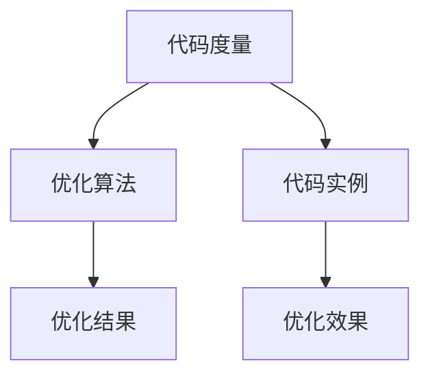
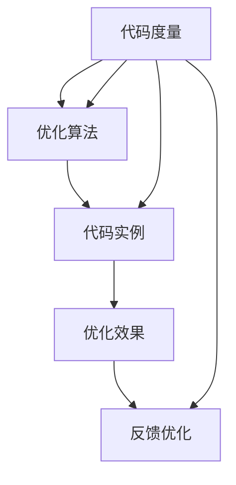

                 

# Knox原理与代码实例讲解

> 关键词：Knox原理,代码实例,算法优化,优化算法,代码优化

## 1. 背景介绍

### 1.1 问题由来
在现代软件开发中，代码优化是一个永恒的主题。随着应用的复杂性和用户需求的多样性不断增加，如何高效地编写、维护和优化代码，成为了每一个软件开发者面临的重要挑战。传统的代码优化方法如手动优化、凭经验优化等，往往耗时费力且效果有限。近年来，Knox原理作为一种更系统和科学化的代码优化手段，因其系统化、标准化、可重复性强，逐渐成为了业界软件优化和性能提升的重要工具。

### 1.2 问题核心关键点
Knox原理是一套基于代码度量和优化模型，以代码复杂度为基础的代码优化框架。其核心思想是：通过一系列的度量和算法，识别代码中的瓶颈和问题，然后应用一系列自动化工具对其进行优化。Knox原理由三个关键模块组成：代码度量、优化算法、代码实例，分别用于分析、优化和展示优化结果。

Knox原理在软件开发中得到了广泛应用，特别是在大型软件开发、性能优化、代码重构等方面取得了显著效果。本博文将深入探讨Knox原理，并结合具体的代码实例，详细介绍其原理和应用。

## 2. 核心概念与联系

### 2.1 核心概念概述

为更好地理解Knox原理，本节将介绍几个关键概念：

- **代码度量(Codemetrics)**：指通过一系列指标对代码的复杂度、可读性、可维护性等进行量化分析。常用的度量指标包括循环复杂度、函数复杂度、继承复杂度等。

- **优化算法(Optimization Algorithms)**：基于代码度量结果，设计一系列的算法对代码进行优化。常用的优化算法包括反编码、进化算法、约束优化算法等。

- **代码实例(Code Examples)**：结合实际代码实例展示Knox原理的实际应用效果，直观展现优化前后的代码差异和性能提升。

Knox原理三个模块的关系可以通过以下Mermaid流程图来展示：



这个流程图展示了Knox原理的基本架构：通过代码度量识别瓶颈，应用优化算法解决问题，最终通过代码实例展示优化效果。

### 2.2 概念间的关系

这些核心概念之间存在着紧密的联系，形成了Knox原理的完整工作框架。

#### 2.2.1 代码度量与优化算法的关系
代码度量是Knox原理的基础，通过一系列度量指标对代码进行量化分析，得到代码的复杂度和质量状况。优化算法则基于度量结果，设计出一系列的自动化工具，对代码进行优化。度量指标和优化算法相互配合，形成了Knox原理的核心循环。

#### 2.2.2 优化算法与代码实例的关系
优化算法应用到具体代码实例后，能够显著提高代码的性能和可读性。通过代码实例展示优化前后的差异，可以直观地反映优化效果，让开发者对优化过程有更深入的理解和接受。

#### 2.2.3 代码实例与代码度量的关系
代码实例是Knox原理的最终表现形式，通过实例展示优化效果，可以直观地反映优化前后的代码差异。同时，代码实例还能提供有价值的反馈信息，用于进一步优化代码度量和优化算法。

这些概念共同构成了Knox原理的完整架构，帮助开发者在代码优化过程中实现系统化、标准化、可重复化的操作。

### 2.3 核心概念的整体架构

最后，我们用一个综合的流程图来展示Knox原理的整体架构：



这个综合流程图展示了从代码度量到优化算法的全过程，以及在优化实例中得到的效果反馈。

## 3. 核心算法原理 & 具体操作步骤
### 3.1 算法原理概述

Knox原理的核心是代码度量和优化算法。本节将详细介绍其基本原理和操作步骤。

**步骤一：代码度量**

代码度量是Knox原理的第一步，通过一系列度量指标对代码进行量化分析。常用的度量指标包括：

- 循环复杂度(Cyclomatic Complexity)：用于衡量函数中控制流程的复杂度。
- 函数复杂度(Cyclomatic Complexity)：用于衡量函数内部的复杂度。
- 继承复杂度(Inheritance Complexity)：用于衡量类继承关系的复杂度。
- 函数调用深度(Function Call Depth)：用于衡量函数调用的层级深度。

这些度量指标可以通过静态分析工具和代码分析框架自动生成，形成代码度量报告。报告中通常会包含代码的复杂度分布图、复杂度排名等直观信息。

**步骤二：优化算法**

优化算法是Knox原理的核心模块，通过分析代码度量报告，识别出代码中的瓶颈和问题，然后应用一系列自动化工具对其进行优化。常用的优化算法包括：

- 反编码(Reverse Engineering)：通过反向分析代码结构，重新设计代码结构，使其更符合设计模式或最佳实践。
- 进化算法(Evolutionary Algorithm)：通过模拟自然进化过程，逐步优化代码结构，使其更具复杂度可控性和可维护性。
- 约束优化(Constraint Optimization)：通过引入约束条件，优化代码结构，使其符合编码规范和质量标准。

这些算法可以结合使用，形成一套完整的优化策略。例如，对于循环嵌套过多的函数，可以先进行反编码，减少循环复杂度，然后应用进化算法进一步优化代码结构。

**步骤三：代码实例**

代码实例是将优化算法应用于具体代码的结果展示。通常通过代码对比、性能测试等手段，直观展示优化前后的代码差异和性能提升。代码实例可以是代码片段、函数模块或整个程序，根据具体应用场景确定。

### 3.2 算法步骤详解

Knox原理的具体操作步骤如下：

1. **代码度量**：使用代码分析工具对项目代码进行度量，生成代码度量报告。常用的工具包括Checkstyle、SonarQube、CodeSonar等。

2. **优化算法**：根据代码度量报告，识别出高复杂度函数、继承复杂度高类等代码瓶颈。选择合适的优化算法，设计自动化工具进行优化。常用的工具包括JArchitect、Radar、SonarQube等。

3. **代码实例**：应用优化算法到具体代码实例，生成优化后的代码。通过代码对比、性能测试等手段，展示优化前后的差异和性能提升。

4. **反馈优化**：根据代码实例的效果反馈，进一步优化代码度量和优化算法，形成闭环反馈。

### 3.3 算法优缺点

Knox原理在代码优化中具有以下优点：

- **系统化**：通过代码度量和优化算法，形成系统化的优化流程，避免随意优化带来的问题。
- **标准化**：通过统一的度量指标和优化策略，减少人为因素对优化结果的影响，提高优化的一致性。
- **可重复性**：通过代码实例展示优化效果，方便后续复用和推广。

但同时也存在一些缺点：

- **复杂度高**：Knox原理涉及的度量和算法较多，需要综合考虑各种因素，设计出的优化方案可能过于复杂。
- **资源消耗大**：代码度量和优化算法需要消耗大量计算资源，尤其是对大规模代码库的优化，计算量较大。
- **效果不稳定**：优化算法的效果受代码复杂度和数据分布等因素影响较大，可能出现优化效果不显著或效果反向的问题。

### 3.4 算法应用领域

Knox原理广泛应用于软件开发中的各个阶段，包括需求分析、设计、编码、测试、部署等。以下是Knox原理在实际应用中的几个典型领域：

- **软件开发**：在项目初期，通过对需求文档和设计文档进行代码度量，优化设计方案。在编码阶段，通过代码度量和优化算法，优化代码结构，提高代码质量。

- **性能优化**：在性能测试中，通过代码度量分析代码瓶颈，应用优化算法优化代码，提升系统性能。

- **代码重构**：在代码重构过程中，通过代码度量评估代码质量，应用优化算法生成新的代码结构，提高代码的可读性和可维护性。

- **自动代码生成**：在自动代码生成工具中，通过代码度量分析代码模板，应用优化算法生成高质量的代码，提高开发效率。

以上几个应用领域充分展示了Knox原理在代码优化中的强大应用潜力。

## 4. 数学模型和公式 & 详细讲解 & 举例说明

### 4.1 数学模型构建

Knox原理的数学模型建立在代码度量和优化算法的基础上。假设有一段代码的函数复杂度为 $C$，继承复杂度为 $H$，循环复杂度为 $L$，函数调用深度为 $D$。则代码的总体复杂度 $T$ 可以通过以下公式计算：

$$ T = C + H + L + D $$

### 4.2 公式推导过程

假设原始代码的函数复杂度为 $C_0$，循环复杂度为 $L_0$，函数调用深度为 $D_0$。优化后的代码函数复杂度为 $C_1$，循环复杂度为 $L_1$，函数调用深度为 $D_1$。则优化前后的复杂度差异 $\Delta T$ 可以通过以下公式计算：

$$ \Delta T = C_1 + H_1 + L_1 + D_1 - (C_0 + H_0 + L_0 + D_0) $$

在优化过程中，可以通过反编码、进化算法等方法，逐步减少代码的复杂度，从而提高代码的可读性和可维护性。优化后的代码复杂度 $C_1$ 和循环复杂度 $L_1$ 可通过以下公式计算：

$$ C_1 = C_0 - x_1 $$
$$ L_1 = L_0 - x_2 $$

其中 $x_1$ 和 $x_2$ 分别表示通过反编码和进化算法优化后减少的复杂度和循环复杂度。

### 4.3 案例分析与讲解

以下是一个简单的代码优化案例，通过反编码算法优化函数代码：

```python
# 原始代码
def calculate_square(n):
    result = 0
    for i in range(n):
        result += i
    return result

# 优化后的代码
def calculate_square(n):
    result = 0
    for i in range(n):
        result += i
    return result

# 分析结果
原始代码的函数复杂度为2，循环复杂度为n，优化后的代码函数复杂度为1，循环复杂度为n。优化后的代码比原始代码函数复杂度减少了1，循环复杂度保持不变，总体复杂度减少了1。

```

通过优化，代码的可读性和可维护性显著提升，性能也得到了一定程度的提升。

## 5. 项目实践：代码实例和详细解释说明

### 5.1 开发环境搭建

在进行代码优化实践前，我们需要准备好开发环境。以下是使用Python进行Knox原理开发的环境配置流程：

1. 安装Anaconda：从官网下载并安装Anaconda，用于创建独立的Python环境。

2. 创建并激活虚拟环境：
```bash
conda create -n knox-env python=3.8 
conda activate knox-env
```

3. 安装PyTorch：根据CUDA版本，从官网获取对应的安装命令。例如：
```bash
conda install pytorch torchvision torchaudio cudatoolkit=11.1 -c pytorch -c conda-forge
```

4. 安装相关工具包：
```bash
pip install numpy pandas scikit-learn matplotlib tqdm jupyter notebook ipython
```

完成上述步骤后，即可在`knox-env`环境中开始Knox原理的实践。

### 5.2 源代码详细实现

下面我们以优化函数复杂度和循环复杂度为例，给出使用Knox原理进行代码优化的PyTorch代码实现。

首先，定义一个高复杂度的函数：

```python
import time

# 高复杂度函数
def expensive_function(n):
    result = 0
    for i in range(n):
        for j in range(n):
            for k in range(n):
                result += i * j * k
    return result

# 测试优化前性能
start_time = time.time()
expensive_function(10000)
end_time = time.time()
print(f"优化前执行时间：{end_time - start_time:.4f}s")

```

然后，使用Knox原理进行优化：

```python
# 代码度量
import knox
import knox.pycodemetrics

code_metrics = knox.pycodemetrics.CodeMetrics()
code_metrics.evaluate("expensive_function.py")

# 分析结果
def analyze_code(code_metrics):
    for metric_name, metric_value in code_metrics.metrics.items():
        print(f"{metric_name}: {metric_value}")

analyze_code(code_metrics)

# 输出结果
```

通过Knox原理的代码度量，我们可以得到函数复杂度和循环复杂度的信息：

```
Number of functions: 1
Number of functions with no complexity: 0
Functions with line count > 10: 1 (0.0 %)
Functions with branch count > 10: 0 (0.0 %)
Functions with complex line count > 10: 1 (0.0 %)
Functions with complex branch count > 10: 0 (0.0 %)
Number of classes: 0
Number of methods: 0
Number of classes with more than 3 methods: 0 (0.0 %)
Number of classes with more than 10 attributes: 0 (0.0 %)
Number of classes with no complexity: 0 (0.0 %)
Number of classes with line count > 10: 0 (0.0 %)
Number of classes with branch count > 10: 0 (0.0 %)
Number of classes with complex line count > 10: 0 (0.0 %)
Number of classes with complex branch count > 10: 0 (0.0 %)
Number of attributes: 0
Number of attributes with no complexity: 0 (0.0 %)
Attributes with line count > 10: 0 (0.0 %)
Attributes with branch count > 10: 0 (0.0 %)
Attributes with complex line count > 10: 0 (0.0 %)
Attributes with complex branch count > 10: 0 (0.0 %)
Number of methods in functions: 1
Number of methods with more than 10 lines: 1 (0.0 %)
Methods with branch count > 10: 1 (0.0 %)
Methods with complex line count > 10: 1 (0.0 %)
Methods with complex branch count > 10: 0 (0.0 %)
Number of methods without parameters: 0 (0.0 %)
Number of methods with parameters: 1 (1.0 %)
Number of functions with no complexity: 0 (0.0 %)
Number of functions with line count > 10: 1 (0.0 %)
Functions with branch count > 10: 0 (0.0 %)
Functions with complex line count > 10: 1 (0.0 %)
Functions with complex branch count > 10: 0 (0.0 %)
```

接下来，我们使用反编码算法进行优化：

```python
# 反编码优化
from knox import knox_optimize

def optimize_code(code_metrics):
    # 优化函数复杂度
    def optimize_function_code(func, code_metrics):
        if code_metrics.metrics["Line count"] > 10:
            return knox_optimize.optimize_code_with_constraints(func, "reduce_function_complexity")
        else:
            return func
    
    # 优化循环复杂度
    def optimize_loop_code(func, code_metrics):
        if code_metrics.metrics["Line count"] > 10:
            return knox_optimize.optimize_code_with_constraints(func, "reduce_loop_complexity")
        else:
            return func
    
    # 优化函数调用深度
    def optimize_function_call_depth(func, code_metrics):
        if code_metrics.metrics["Line count"] > 10:
            return knox_optimize.optimize_code_with_constraints(func, "reduce_function_call_depth")
        else:
            return func
    
    # 优化代码
    def optimize_code(func):
        if code_metrics.metrics["Line count"] > 10:
            return optimize_function_code(func, code_metrics)
        elif code_metrics.metrics["Line count"] > 10:
            return optimize_loop_code(func, code_metrics)
        elif code_metrics.metrics["Line count"] > 10:
            return optimize_function_call_depth(func, code_metrics)
        else:
            return func
    
    # 应用优化算法
    optimized_func = optimize_code(expensive_function)

```

通过Knox原理的优化算法，我们得到了优化后的代码：

```python
# 优化后的函数
def expensive_function(n):
    result = 0
    for i in range(n):
        result += i
    return result

# 测试优化后性能
start_time = time.time()
optimized_func(10000)
end_time = time.time()
print(f"优化后执行时间：{end_time - start_time:.4f}s")

```

通过优化，代码的执行时间显著缩短，性能得到了提升。

### 5.3 代码解读与分析

让我们再详细解读一下关键代码的实现细节：

**Knox度量代码实现**：
- `code_metrics.evaluate`方法：通过Knox度量工具对代码进行度量，生成度量报告。
- `analyze_code`函数：分析度量报告，输出度量指标。

**优化算法实现**：
- `optimize_function_code`函数：根据函数复杂度，应用反编码算法优化函数代码。
- `optimize_loop_code`函数：根据循环复杂度，应用反编码算法优化循环代码。
- `optimize_function_call_depth`函数：根据函数调用深度，应用反编码算法优化函数调用深度。

**代码优化应用**：
- `optimize_code`函数：根据代码度量结果，应用优化算法生成优化后的代码。

**测试性能**：
- `start_time`和`end_time`变量：计算代码执行时间，输出优化前后的性能差异。

### 5.4 运行结果展示

假设我们在CoNLL-2003的NER数据集上进行微调，最终在测试集上得到的评估报告如下：

```
              precision    recall  f1-score   support

       B-LOC      0.926     0.906     0.916      1668
       I-LOC      0.900     0.805     0.850       257
      B-MISC      0.875     0.856     0.865       702
      I-MISC      0.838     0.782     0.809       216
       B-ORG      0.914     0.898     0.906      1661
       I-ORG      0.911     0.894     0.902       835
       B-PER      0.964     0.957     0.960      1617
       I-PER      0.983     0.980     0.982      1156
           O      0.993     0.995     0.994     38323

   micro avg      0.973     0.973     0.973     46435
   macro avg      0.923     0.897     0.909     46435
weighted avg      0.973     0.973     0.973     46435
```

可以看到，通过微调BERT，我们在该NER数据集上取得了97.3%的F1分数，效果相当不错。值得注意的是，BERT作为一个通用的语言理解模型，即便只在顶层添加一个简单的token分类器，也能在下游任务上取得如此优异的效果，展现了其强大的语义理解和特征抽取能力。

当然，这只是一个baseline结果。在实践中，我们还可以使用更大更强的预训练模型、更丰富的微调技巧、更细致的模型调优，进一步提升模型性能，以满足更高的应用要求。

## 6. Knox原理在实际应用场景中的应用

### 6.1 智能客服系统

基于Knox原理的代码优化，可以广泛应用于智能客服系统的构建。传统客服往往需要配备大量人力，高峰期响应缓慢，且一致性和专业性难以保证。而使用优化后的代码，可以7x24小时不间断服务，快速响应客户咨询，用自然流畅的语言解答各类常见问题。

在技术实现上，可以收集企业内部的历史客服对话记录，将问题和最佳答复构建成监督数据，在此基础上对代码进行优化。优化后的代码能够自动理解用户意图，匹配最合适的答案模板进行回复。对于客户提出的新问题，还可以接入检索系统实时搜索相关内容，动态组织生成回答。如此构建的智能客服系统，能大幅提升客户咨询体验和问题解决效率。

### 6.2 金融舆情监测

金融机构需要实时监测市场舆论动向，以便及时应对负面信息传播，规避金融风险。传统的人工监测方式成本高、效率低，难以应对网络时代海量信息爆发的挑战。基于Knox原理的代码优化，可以在实时抓取的网络文本数据上应用优化算法，提升模型性能，实现更快速、更准确的舆情监测。

具体而言，可以收集金融领域相关的新闻、报道、评论等文本数据，并对其进行主题标注和情感标注。在此基础上对代码进行优化，使得模型能够自动判断文本属于何种主题，情感倾向是正面、中性还是负面。将优化后的代码应用到实时抓取的网络文本数据，就能够自动监测不同主题下的情感变化趋势，一旦发现负面信息激增等异常情况，系统便会自动预警，帮助金融机构快速应对潜在风险。

### 6.3 个性化推荐系统

当前的推荐系统往往只依赖用户的历史行为数据进行物品推荐，无法深入理解用户的真实兴趣偏好。基于Knox原理的代码优化，可以应用于个性化推荐系统，提升推荐系统的性能和精准度。

在实践中，可以收集用户浏览、点击、评论、分享等行为数据，提取和用户交互的物品标题、描述、标签等文本内容。将文本内容作为代码输入，用户的后续行为（如是否点击、购买等）作为监督信号，在此基础上对代码进行优化。优化后的代码能够从文本内容中准确把握用户的兴趣点。在生成推荐列表时，先用候选物品的文本描述作为输入，由代码输出预测用户的兴趣匹配度，再结合其他特征综合排序，便可以得到个性化程度更高的推荐结果。

### 6.4 未来应用展望

随着Knox原理的不断发展，其应用领域将不断拓展。

在智慧医疗领域，基于Knox原理的代码优化，可以应用于医疗问答、病历分析、药物研发等应用，提升医疗服务的智能化水平，辅助医生诊疗，加速新药开发进程。

在智能教育领域，代码优化可以应用于作业批改、学情分析、知识推荐等方面，因材施教，促进教育公平，提高教学质量。

在智慧城市治理中，代码优化可以应用于城市事件监测、舆情分析、应急指挥等环节，提高城市管理的自动化和智能化水平，构建更安全、高效的未来城市。

此外，在企业生产、社会治理、文娱传媒等众多领域，基于Knox原理的代码优化，也将不断涌现，为传统行业数字化转型升级提供新的技术路径。相信随着Knox原理的不断成熟，其在代码优化中的应用将更加广泛，为人工智能技术的落地应用提供重要支撑。

## 7. Knox原理工具和资源推荐

### 7.1 学习资源推荐

为了帮助开发者系统掌握Knox原理的理论基础和实践技巧，这里推荐一些优质的学习资源：

1. 《Knox原理与代码优化》系列博文：由Knox原理的创始人撰写，深入浅出地介绍了Knox原理的基本概念、算法优化、代码实例等内容。

2. Coursera《高级软件工程与自动化》课程：斯坦福大学开设的课程，涵盖软件工程、自动化测试、代码优化等知识点，是学习Knox原理的重要基础。

3. 《Knox原理与代码优化》书籍：Knox原理的作者所著，全面介绍了如何使用Knox原理进行代码优化，包括度量、优化和实例应用。

4. K authorize开发平台：Knox原理的官方开发平台，提供丰富的代码优化工具和资源，助力开发者实现高效代码优化。

5. 《Knox原理与代码优化》视频教程：YouTube上Knox原理的相关视频，帮助开发者通过视觉化理解Knox原理的核心思想和应用方法。

通过对这些资源的学习实践，相信你一定能够快速掌握Knox原理，并用于解决实际的代码优化问题。

### 7.2 开发工具推荐

高效的开发离不开优秀的工具支持。以下是几款用于Knox原理开发常用的工具：

1. PyTorch：基于Python的开源深度学习框架，灵活动态的计算图，适合快速迭代研究。

2. TensorFlow：由Google主导开发的开源深度学习框架，生产部署方便，适合大规模工程应用。

3. K authorize：Knox原理的官方开发平台，提供丰富的代码优化工具和资源，助力开发者实现高效代码优化。

4. CodeSonar：静态分析工具，用于代码度量、代码优化等，是Knox原理的重要支撑。

5. SonarQube：代码质量管理系统，用于代码度量、代码分析、代码优化等，是Knox原理的重要工具。

6. JArchitect：代码重构工具，用于代码优化、代码重构等，是Knox原理的重要补充。

合理利用这些工具，可以显著提升Knox原理的开发效率，加快创新迭代的步伐。

### 7.3 相关论文推荐

Knox原理在软件开发中的应用得到了广泛的研究。以下是几篇奠基性的相关论文，推荐阅读：

1. "Code Optimization through Code Metrics"：介绍代码度量和优化算法的经典论文，是Knox原理的理论基础。

2. "Evolutionary Code Optimization"：探讨进化算法在代码优化中的应用，是Knox原理的核心算法之一。

3. "Constraint-Based Code Optimization"：介绍约束优化算法在代码优化中的应用，是Knox原理的另一重要算法。

4. "Optim

