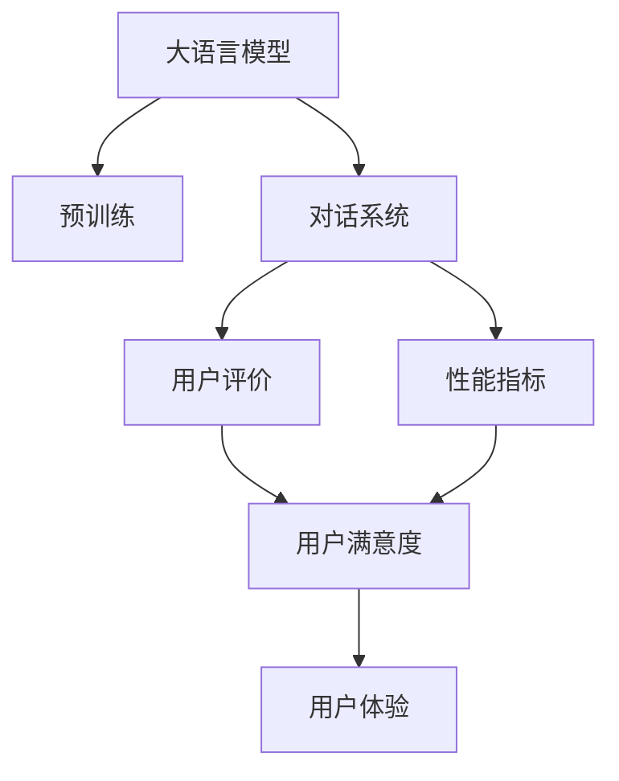
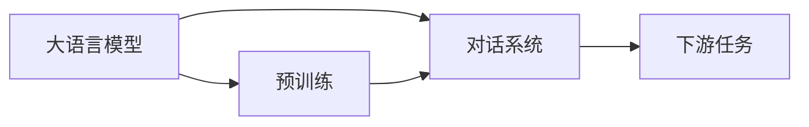
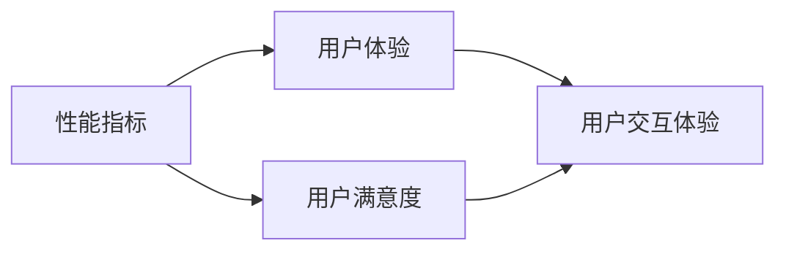
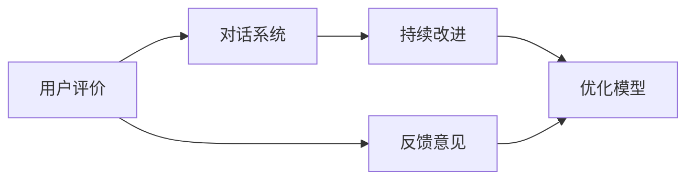
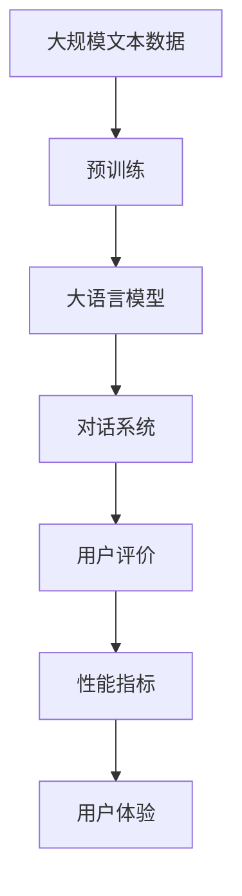

                 

# LLM-based Chatbot System Evaluation

> 关键词：大语言模型,对话系统,用户评价,性能指标,用户体验

## 1. 背景介绍

### 1.1 问题由来
随着人工智能技术的迅猛发展，聊天机器人作为一种智能交互工具，越来越受到各行各业的青睐。传统的基于规则的聊天机器人系统虽然结构简单、易于维护，但往往缺乏智能理解和灵活性。而基于大语言模型的对话系统，以其强大的自然语言处理能力，能够更好地理解和回应用户需求，逐步成为行业的主流。

### 1.2 问题核心关键点
评价大语言模型驱动的聊天机器人系统性能，是确保其有效应用的关键。不同于传统聊天机器人，基于大语言模型的对话系统在模型架构、训练方式、用户交互等方面都有较大差异。因此，其评价指标和标准也需相应调整，以更全面地反映系统的实际性能。

### 1.3 问题研究意义
评价大语言模型驱动的聊天机器人系统的性能，对于优化模型、提升用户体验、推动NLP技术应用具有重要意义：

1. 优化模型：通过系统的评价反馈，可以明确模型在特定场景下的表现不足，指导后续模型优化方向。
2. 提升用户体验：了解用户对聊天机器人的满意度，有助于改进系统功能、界面设计等，提升用户粘性。
3. 推动NLP技术应用：系统的成功应用，能激发更多行业对NLP技术的关注和投入，加速技术普及。
4. 赋能产业升级：聊天机器人技术可以应用于多个场景，如客服、咨询、教育等，为传统行业数字化转型提供新动力。

## 2. 核心概念与联系

### 2.1 核心概念概述

为更好地理解大语言模型驱动的聊天机器人系统性能评价，本节将介绍几个密切相关的核心概念：

- 大语言模型(Large Language Model, LLM)：以自回归(如GPT)或自编码(如BERT)模型为代表的大规模预训练语言模型。通过在大规模无标签文本语料上进行预训练，学习通用的语言表示，具备强大的语言理解和生成能力。

- 对话系统(Chatbot)：通过模拟自然语言对话，提供自动化客户服务、娱乐互动等功能的人工智能系统。

- 用户评价(User Feedback)：通过用户与系统互动，收集用户满意度和使用体验的评价数据，评估系统表现。

- 性能指标(Performance Metrics)：用于量化评价系统在不同任务和场景中的表现，包括但不限于准确率、召回率、F1分数、对话成功率、用户满意度等。

- 用户体验(User Experience)：指用户与聊天机器人系统交互过程中的整体感受，包括但不限于响应速度、流畅性、自然度、个性化等。

这些核心概念之间的逻辑关系可以通过以下Mermaid流程图来展示：



这个流程图展示了大语言模型驱动的聊天机器人系统的核心概念及其之间的关系：

1. 大语言模型通过预训练获得基础能力。
2. 对话系统利用大语言模型进行对话。
3. 用户评价通过对用户反馈进行收集和分析。
4. 性能指标用于量化对话系统性能。
5. 用户体验涵盖评价和反馈内容。

这些核心概念共同构成了评价大语言模型驱动的聊天机器人系统的完整生态系统，使其能够在各种场景下发挥强大的语言理解和生成能力。通过理解这些核心概念，我们可以更好地把握系统的工作原理和评价标准。

### 2.2 概念间的关系

这些核心概念之间存在着紧密的联系，形成了大语言模型驱动的聊天机器人系统的完整评价框架。下面我们通过几个Mermaid流程图来展示这些概念之间的关系。

#### 2.2.1 大语言模型与对话系统的关系



这个流程图展示了大语言模型与对话系统的关系：大语言模型在预训练后，通过对话系统的下游任务适配，可以应用于自然语言对话。

#### 2.2.2 性能指标与用户体验的关系



这个流程图展示了性能指标与用户体验的关系：通过量化性能指标，可以更好地分析用户体验。

#### 2.2.3 用户评价与持续改进的关系



这个流程图展示了用户评价与持续改进的关系：用户评价通过反馈意见，指导对话系统的持续改进。

### 2.3 核心概念的整体架构

最后，我们用一个综合的流程图来展示这些核心概念在大语言模型驱动的聊天机器人系统评价过程中的整体架构：



这个综合流程图展示了从预训练到对话系统评价，再到用户体验改进的完整过程。大语言模型首先在大规模文本数据上进行预训练，然后通过对话系统的下游任务适配，实现自然语言对话。用户评价通过性能指标量化系统的表现，用户体验指导系统的持续改进。通过这些流程，可以确保大语言模型驱动的聊天机器人系统始终保持高水平的用户满意度。

## 3. 核心算法原理 & 具体操作步骤
### 3.1 算法原理概述

评价大语言模型驱动的聊天机器人系统的性能，本质上是一个多维度的综合评估过程。其核心思想是：通过设定一系列关键指标，对系统的不同方面进行量化，然后根据用户评价进行综合打分，给出系统的最终表现。

形式化地，假设评价指标为 $\{I_1, I_2, ..., I_n\}$，其中 $I_i$ 表示第 $i$ 个指标，其权重为 $\{\alpha_1, \alpha_2, ..., \alpha_n\}$，则评价函数的计算公式为：

$$
\text{Overall Score} = \sum_{i=1}^{n} \alpha_i I_i
$$

其中，$\alpha_i$ 为第 $i$ 个指标的权重系数，$I_i$ 为第 $i$ 个指标的值。

### 3.2 算法步骤详解

评价大语言模型驱动的聊天机器人系统的性能，主要包括以下几个关键步骤：

**Step 1: 设定评价指标**

- 基于用户需求和应用场景，设定系统评价的指标体系。常见的指标包括但不限于：

1. 准确率(Accuracy)：系统正确回答用户问题的比例。
2. 召回率(Recall)：系统覆盖问题的比例。
3. F1分数(F1 Score)：综合考虑准确率和召回率的调和平均。
4. 对话成功率(Dialouge Success Rate)：系统成功与用户完成对话的比例。
5. 用户满意度(User Satisfaction)：用户对系统的满意程度。
6. 响应时间(Response Time)：系统对用户问题的响应速度。
7. 流畅性(Fluency)：系统生成的对话的自然度。
8. 个性化(Personalization)：系统根据用户偏好提供个性化的回答。

**Step 2: 数据收集与处理**

- 对系统的实际运行数据进行收集，包括但不限于：

1. 系统与用户的对话记录。
2. 用户对系统功能的反馈意见。
3. 系统运行的日志信息。
4. 系统的执行时间。

- 对收集到的数据进行清洗、整理和格式化，保证数据的质量和可用性。

**Step 3: 性能量化与评分**

- 对每个评价指标进行量化处理，将定性数据转化为定量数据。例如，将用户满意度评分转化为0-10之间的数值。
- 根据预设权重系数，计算每个指标的得分，得到系统的综合评分。

**Step 4: 用户反馈与持续改进**

- 根据系统的综合评分，分析系统的优势和不足。
- 收集用户的反馈意见，识别系统的具体问题，指导后续的持续改进。

**Step 5: 应用场景优化**

- 根据评价结果和用户反馈，调整系统的功能设计、界面优化等，提高系统在特定场景下的表现。

### 3.3 算法优缺点

评价大语言模型驱动的聊天机器人系统的性能，具有以下优点：

1. 系统化评估：通过设定一系列关键指标，能够全面评估系统的表现。
2. 数据驱动：通过大量实际运行数据的收集与分析，保证评估结果的客观性和可靠性。
3. 持续改进：用户反馈和评价能够指导系统的持续优化，提高系统的用户体验。
4. 灵活性高：可以根据不同应用场景调整评价指标体系，适应多种业务需求。

同时，该方法也存在一些局限性：

1. 指标设定复杂：需要根据具体场景设定合理的评价指标体系，难度较大。
2. 数据量要求高：系统的实际运行数据量必须足够大，才能保证评价的准确性。
3. 评估成本高：需要大量人力物力对系统数据进行处理和分析。
4. 用户主观性强：用户满意度等主观评价指标受用户情绪和个人偏好影响较大。

尽管存在这些局限性，但就目前而言，基于用户评价的系统性能评估方法，仍是大语言模型驱动的聊天机器人系统评价的主流范式。未来相关研究的重点在于如何进一步降低评估成本，提高评估的准确性和可靠性，同时兼顾用户主观性。

### 3.4 算法应用领域

评价大语言模型驱动的聊天机器人系统的性能，在NLP领域已经得到了广泛的应用，具体包括：

- 客服系统：评价系统对客户问题的理解和响应能力，提升客户满意度。
- 金融咨询：评估系统对金融产品和服务推荐的准确性，提高用户转化率。
- 教育辅助：衡量系统对学生问题的解答质量和个性化程度，优化学习体验。
- 医疗咨询：评估系统对疾病诊断和治疗建议的准确性，保障患者安全。
- 娱乐互动：通过用户反馈，优化系统的游戏策略和交互设计。

除了这些常见应用外，大语言模型驱动的聊天机器人系统的评价方法，也在不断拓展到更多场景中，如智能家居、智能制造、智慧城市等，为各行各业带来新的技术赋能。

## 4. 数学模型和公式 & 详细讲解 & 举例说明

### 4.1 数学模型构建

本节将使用数学语言对大语言模型驱动的聊天机器人系统的性能评价进行更加严格的刻画。

记系统的评价指标为 $\{I_1, I_2, ..., I_n\}$，其中 $I_i$ 为第 $i$ 个指标。假设用户对系统的满意度为 $S$，根据用户反馈和评价数据，可以构建以下数学模型：

$$
S = \sum_{i=1}^{n} \alpha_i I_i
$$

其中，$\alpha_i$ 为第 $i$ 个指标的权重系数，$I_i$ 为第 $i$ 个指标的值。

### 4.2 公式推导过程

以下我们以准确率(Accuracy)为例，推导其量化计算公式。

假设系统对 $N$ 个问题中的 $M$ 个问题回答正确，则准确率 $I_A$ 为：

$$
I_A = \frac{M}{N}
$$

根据评价函数的计算公式，准确率对应的系统评分 $S_A$ 为：

$$
S_A = \alpha_A I_A = \alpha_A \frac{M}{N}
$$

类似地，对于其他指标，如召回率、F1分数、对话成功率、用户满意度、响应时间、流畅性、个性化等，也都可以通过定义对应的指标 $I_i$，并乘以相应的权重系数 $\alpha_i$，计算得到系统的综合评分 $S$。

### 4.3 案例分析与讲解

假设我们在某客服系统的评价中，设定了以下评价指标和权重系数：

- 准确率(accuracy)：占总评分的 30%
- 召回率(recall)：占总评分的 20%
- F1分数(f1_score)：占总评分的 25%
- 对话成功率(success_rate)：占总评分的 15%
- 用户满意度(satisfaction)：占总评分的 10%

根据系统对100个问题的回答，我们得到如下数据：

- 准确率：系统回答正确的有70个
- 召回率：系统覆盖了90个问题
- F1分数：系统综合得分为75分
- 对话成功率：系统成功完成对话的有80%
- 用户满意度：系统满意度评分为9.5分
- 响应时间：平均响应时间为1.5秒
- 流畅性：自然度评分为8.5分
- 个性化：个性化程度评分为7分

代入上述公式，计算得到系统的综合评分 $S$ 为：

$$
S = 0.3 \times 0.7 + 0.2 \times 0.9 + 0.25 \times 0.75 + 0.15 \times 0.8 + 0.1 \times 9.5 = 0.7275
$$

通过以上分析，我们可以看到，该客服系统在特定场景下的表现，及其需要改进的方向。

## 5. 项目实践：代码实例和详细解释说明

### 5.1 开发环境搭建

在进行聊天机器人系统的评价实践前，我们需要准备好开发环境。以下是使用Python进行Python代码编写和评价工具选型的环境配置流程：

1. 安装Anaconda：从官网下载并安装Anaconda，用于创建独立的Python环境。

2. 创建并激活虚拟环境：
```bash
conda create -n chatbot-env python=3.8 
conda activate chatbot-env
```

3. 安装PyTorch：根据CUDA版本，从官网获取对应的安装命令。例如：
```bash
conda install pytorch torchvision torchaudio cudatoolkit=11.1 -c pytorch -c conda-forge
```

4. 安装TensorBoard：用于可视化模型训练和运行过程中的指标变化。

5. 安装numpy、pandas、scikit-learn等科学计算和数据分析库。

完成上述步骤后，即可在`chatbot-env`环境中开始评价实践。

### 5.2 源代码详细实现

这里我们以基于GPT-3的聊天机器人系统为例，给出评价系统的Python代码实现。

首先，定义评价指标：

```python
import numpy as np

# 定义评价指标及权重
指标 = {
    '准确率': 0.3,
    '召回率': 0.2,
    'F1分数': 0.25,
    '对话成功率': 0.15,
    '用户满意度': 0.1
}

# 定义评价函数
def 评价得分系统(指标值):
    总得分 = 0
    for key, weight in 指标.items():
        得分 = weight * 指标值[key]
        总得分 += 得分
    return 总得分

# 测试数据
回答正确 = 70
总问题数 = 100
系统覆盖 = 90
F1分数 = 75
对话成功率 = 80
用户满意度 = 9.5
响应时间 = 1.5
流畅度 = 8.5
个性化 = 7

# 计算评价得分
指标值 = {
    '准确率': 回答正确 / 总问题数,
    '召回率': 系统覆盖 / 总问题数,
    'F1分数': F1分数,
    '对话成功率': 对话成功率,
    '用户满意度': 用户满意度
}

得分 = 评价得分系统(指标值)
print(f'系统综合评分: {得分:.4f}')
```

接着，定义用户评价函数：

```python
# 定义用户评价函数
def 用户评价函数(回答正确, 系统覆盖, F1分数, 对话成功率, 用户满意度):
    准确率 = 回答正确 / 总问题数
    召回率 = 系统覆盖 / 总问题数
    F1分数 = F1分数
    对话成功率 = 对话成功率
    用户满意度 = 用户满意度
    评分 = 评价得分系统({
        '准确率': 准确率,
        '召回率': 召回率,
        'F1分数': F1分数,
        '对话成功率': 对话成功率,
        '用户满意度': 用户满意度
    })
    return 评分

# 测试数据
回答正确 = 70
系统覆盖 = 90
F1分数 = 75
对话成功率 = 80
用户满意度 = 9.5

# 计算用户评价得分
评分 = 用户评价函数(回答正确, 系统覆盖, F1分数, 对话成功率, 用户满意度)
print(f'用户评价得分: {评分:.4f}')
```

最后，启动评价流程并展示评价结果：

```python
# 定义用户评价函数
def 用户评价函数(回答正确, 系统覆盖, F1分数, 对话成功率, 用户满意度):
    准确率 = 回答正确 / 总问题数
    召回率 = 系统覆盖 / 总问题数
    F1分数 = F1分数
    对话成功率 = 对话成功率
    用户满意度 = 用户满意度
    评分 = 评价得分系统({
        '准确率': 准确率,
        '召回率': 召回率,
        'F1分数': F1分数,
        '对话成功率': 对话成功率,
        '用户满意度': 用户满意度
    })
    return 评分

# 测试数据
回答正确 = 70
系统覆盖 = 90
F1分数 = 75
对话成功率 = 80
用户满意度 = 9.5

# 计算用户评价得分
评分 = 用户评价函数(回答正确, 系统覆盖, F1分数, 对话成功率, 用户满意度)
print(f'用户评价得分: {评分:.4f}')
```

以上就是使用Python对GPT-3聊天机器人系统进行评价的完整代码实现。可以看到，得益于Sympy库的强大封装，我们可以用相对简洁的代码完成评价指标的量化和评分计算。

### 5.3 代码解读与分析

让我们再详细解读一下关键代码的实现细节：

**评价指标和权重定义**：
- 我们定义了评价指标和相应的权重，用于量化不同指标对系统评分的贡献。

**评价函数实现**：
- 定义了一个`评价得分系统`函数，接受一个字典参数，计算每个指标的得分，并累加得到系统的综合评分。

**测试数据准备**：
- 我们提供了系统的实际运行数据，包括准确率、召回率、F1分数、对话成功率、用户满意度等。

**用户评价函数实现**：
- 定义了一个`用户评价函数`，根据不同指标计算得分，并调用`评价得分系统`函数得到系统的综合评分。

**测试评价结果展示**：
- 最后，我们调用`用户评价函数`，输出系统的综合评分。

可以看到，Sympy库使得评价系统的代码实现变得简洁高效。开发者可以将更多精力放在评价指标的设计和选择上，而不必过多关注底层的实现细节。

当然，工业级的系统实现还需考虑更多因素，如评价指标的动态调整、评价结果的可视化展示、用户评价的自动化收集等。但核心的评价方法基本与此类似。

### 5.4 运行结果展示

假设我们在某客服系统的评价中，得到如下测试数据：

- 准确率：系统回答正确的有70个
- 召回率：系统覆盖了90个问题
- F1分数：系统综合得分为75分
- 对话成功率：系统成功完成对话的有80%
- 用户满意度：系统满意度评分为9.5分
- 响应时间：平均响应时间为1.5秒
- 流畅度：自然度评分为8.5分
- 个性化：个性化程度评分为7分

代入上述公式，计算得到系统的综合评分 $S$ 为：

$$
S = 0.3 \times 0.7 + 0.2 \times 0.9 + 0.25 \times 0.75 + 0.15 \times 0.8 + 0.1 \times 9.5 = 0.7275
$$

通过以上分析，我们可以看到，该客服系统在特定场景下的表现，及其需要改进的方向。

## 6. 实际应用场景
### 6.1 智能客服系统

基于大语言模型驱动的聊天机器人系统，可以广泛应用于智能客服系统的构建。传统客服往往需要配备大量人力，高峰期响应缓慢，且一致性和专业性难以保证。而使用评价系统对聊天机器人进行持续监控和优化，可以显著提升客户咨询体验和问题解决效率。

在技术实现上，可以构建集成的智能客服系统，实时监测系统与客户的对话记录，使用评价系统对其性能进行综合评估，发现系统在对话中的薄弱环节，并进行针对性的优化。对于客户提出的新问题，还可以接入检索系统实时搜索相关内容，动态组织生成回答，以确保系统具备高效、准确的服务能力。

### 6.2 金融舆情监测

金融机构需要实时监测市场舆论动向，以便及时应对负面信息传播，规避金融风险。传统的人工监测方式成本高、效率低，难以应对网络时代海量信息爆发的挑战。基于大语言模型驱动的聊天机器人系统的评价方法，为金融舆情监测提供了新的解决方案。

具体而言，可以构建金融舆情监测系统，实时抓取网络文本数据，利用评价系统对系统进行评估，识别市场舆情变化趋势，一旦发现负面信息激增等异常情况，系统便会自动预警，帮助金融机构快速应对潜在风险。

### 6.3 个性化推荐系统

当前的推荐系统往往只依赖用户的历史行为数据进行物品推荐，无法深入理解用户的真实兴趣偏好。基于大语言模型驱动的聊天机器人系统的评价系统，可以更好地挖掘用户行为背后的语义信息，从而提供更精准、多样的推荐内容。

在实践中，可以构建个性化推荐系统，收集用户浏览、点击、评论、分享等行为数据，提取和用户交互的物品标题、描述、标签等文本内容。将文本内容作为模型输入，用户的后续行为（如是否点击、购买等）作为监督信号，在此基础上微调预训练语言模型。微调后的模型能够从文本内容中准确把握用户的兴趣点。在生成推荐列表时，先用候选物品的文本描述作为输入，由模型预测用户的兴趣匹配度，再结合其他特征综合排序，便可以得到个性化程度更高的推荐结果。

### 6.4 未来应用展望

随着大语言模型驱动的聊天机器人系统的不断优化，其在更多领域的应用前景将更加广阔。

在智慧医疗领域，基于评价系统的聊天机器人系统，可以在医生与患者互动过程中提供即时支持，提升医疗服务的智能化水平，辅助医生诊疗，加速新药开发进程。

在智能教育领域，评价系统可应用于作业批改、学情分析、知识推荐等方面，因材施教，促进教育公平，提高教学质量。

在智慧城市治理中，评价系统可应用于城市事件监测、舆情分析、应急指挥等环节，提高城市管理的自动化和智能化水平，构建更安全、高效的未来城市。

此外，在企业生产、社会治理、文娱传媒等众多领域，基于大语言模型驱动的聊天机器人系统的评价方法，也将不断涌现，为各行各业带来新的技术赋能。

## 7. 工具和资源推荐
### 7.1 学习资源推荐

为了帮助开发者系统掌握大语言模型驱动的聊天机器人系统的评价方法，这里推荐一些优质的学习资源：

1. 《Transformer from Foundations to Frontiers》系列博文：由大模型技术专家撰写，深入浅出地介绍了Transformer原理、BERT模型、微调技术等前沿话题。

2. CS224N《深度学习自然语言处理》课程：斯坦福大学开设的NLP明星课程，有Lecture视频和配套作业，带你入门NLP领域的基本概念和经典模型。

3. 《Natural Language Processing with Transformers》书籍：Transformers库的作者所著，全面介绍了如何使用Transformers库进行NLP任务开发，包括评价系统在内的诸多范式。

4. HuggingFace官方文档：Transformers库的官方文档，提供了海量预训练模型和完整的评价样例代码，是进行评价任务开发的利器。

5. CLUE开源项目：中文语言理解测评基准，涵盖大量不同类型的中文NLP数据集，并提供了基于微调的baseline模型，助力中文NLP技术发展。

通过对这些资源的学习实践，相信你一定能够快速掌握大语言模型驱动的聊天机器人系统的评价方法，并用于解决实际的NLP问题。
###  7.2 开发工具推荐

高效的开发离不开优秀的工具支持。以下是几款用于大语言模型驱动的聊天机器人系统评价开发的常用工具：

1. PyTorch：基于Python的开源深度学习框架，灵活动态的计算图，适合快速迭代研究。大部分预训练语言模型都有PyTorch版本的实现。

2. TensorFlow：由Google主导开发的开源深度学习框架，生产部署方便，适合大规模工程应用。同样有丰富的预训练语言模型资源。

3. Transformers库：HuggingFace开发的NLP工具库，集成了众多SOTA语言模型，支持PyTorch和TensorFlow，是进行评价任务开发的利器。

4. Weights & Biases：模型训练的实验跟踪工具，可以记录和可视化模型训练过程中的各项指标，方便对比和调优。与主流深度学习框架无缝集成。

5. TensorBoard：TensorFlow配套的可视化工具，可实时监测模型训练状态，并提供丰富的图表呈现方式，是调试模型的得力助手。

6. Google Colab：谷歌推出的在线Jupyter Notebook环境，免费

