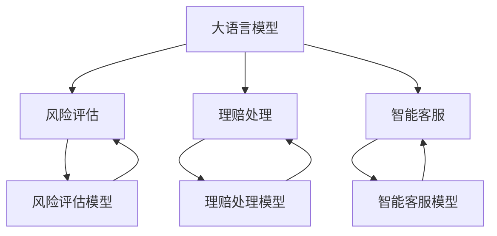

                 

# LLM在保险业的应用：风险评估与理赔

> 关键词：大语言模型,自然语言处理(NLP),保险业,风险评估,理赔处理,深度学习,自监督学习,监督学习

## 1. 背景介绍

### 1.1 问题由来
近年来，随着人工智能技术的快速发展，自然语言处理（NLP）和大语言模型（LLM）在各行各业得到了广泛应用。特别是在保险领域，风险评估和理赔处理等复杂任务对语言理解和推理能力提出了高要求，而大语言模型在这一领域展现了巨大的潜力。

### 1.2 问题核心关键点
大语言模型在保险业中的应用主要集中在以下几个方面：
1. **风险评估**：通过分析客户填写的问卷或医疗记录等文本数据，评估客户的风险水平。
2. **理赔处理**：对客户提交的理赔申请文本进行分析，判断其合理性，并自动审核和处理。
3. **智能客服**：提供24/7的客户服务，解答客户的常见问题，提升客户满意度。

### 1.3 问题研究意义
大语言模型在保险业的应用，对于提升风险评估的准确性和理赔处理的效率，降低保险公司运营成本，提升客户满意度具有重要意义：

1. **提升风险评估准确性**：通过分析大量的客户数据，大语言模型可以发现隐藏在文本中的潜在风险，帮助保险公司制定更科学的保险策略。
2. **提高理赔处理效率**：大语言模型可以快速理解和处理理赔申请文本，自动审核和批准简单案件，缩短理赔处理时间。
3. **降低运营成本**：减少了对人力的依赖，降低了保险公司的运营成本。
4. **提升客户满意度**：智能客服可以提供7x24小时的服务，及时解决客户问题，提升客户体验。

## 2. 核心概念与联系

### 2.1 核心概念概述

为更好地理解大语言模型在保险业的应用，本节将介绍几个关键概念及其联系：

- **大语言模型 (LLM)**：以Transformer为代表的预训练语言模型，通过大规模无标签文本数据进行预训练，学习到丰富的语言表示，具备强大的语言理解和生成能力。
- **自然语言处理 (NLP)**：涉及计算机处理自然语言的能力，包括文本预处理、语言建模、文本分类、实体识别等。
- **风险评估**：对客户的风险水平进行量化评估，以确定保费和保险产品组合。
- **理赔处理**：对客户提交的理赔申请进行分析，判断其合理性，并自动审核和处理。
- **智能客服**：通过自然语言交互，提供即时响应和问题解答。

这些概念通过大语言模型在保险业的应用，紧密联系在一起，形成了完整的保险业务处理流程。

### 2.2 核心概念间的关系

通过Mermaid流程图，我们可以更直观地展示这些核心概念之间的关系：



这个流程图展示了大语言模型在保险业务中的应用，包括风险评估模型、理赔处理模型和智能客服模型。这些模型在大语言模型的基础上，通过微调或其他方法，实现了特定的保险业务功能。

## 3. 核心算法原理 & 具体操作步骤
### 3.1 算法原理概述

大语言模型在保险业的应用主要依赖于自然语言处理技术，特别是在风险评估和理赔处理方面。其核心算法原理包括自监督学习、监督学习和迁移学习等。

**自监督学习**：在无标签数据上训练语言模型，学习到通用的语言表示。例如，BERT模型就是通过掩码语言模型（Masked Language Modeling）和下一句预测（Next Sentence Prediction）任务进行自监督学习。

**监督学习**：在有标签数据上训练模型，使其学习到特定的任务。例如，在风险评估中，通过客户填写的问卷或医疗记录等文本数据，训练模型对客户风险进行评估。

**迁移学习**：将一个领域学到的知识迁移到另一个领域。例如，将通用的语言模型在大规模文本数据上进行预训练，然后在特定的保险文本数据上进行微调，以适应保险业务的需求。

### 3.2 算法步骤详解

#### 3.2.1 风险评估

**步骤1：数据准备**  
收集客户填写的问卷或医疗记录等文本数据，将其清洗、分词、编码，形成训练集。

**步骤2：模型选择与预训练**  
选择适合的语言模型（如BERT、GPT等）进行预训练，学习通用的语言表示。

**步骤3：微调与评估**  
在风险评估数据集上进行微调，学习评估客户风险的特定任务。使用交叉验证等方法评估模型性能，调整超参数。

**步骤4：部署与使用**  
将微调后的模型部署到生产环境，用于风险评估和决策。

#### 3.2.2 理赔处理

**步骤1：数据准备**  
收集客户提交的理赔申请文本，将其清洗、分词、编码，形成训练集。

**步骤2：模型选择与预训练**  
选择适合的语言模型（如BERT、GPT等）进行预训练，学习通用的语言表示。

**步骤3：微调与评估**  
在理赔处理数据集上进行微调，学习判断理赔申请合理性的特定任务。使用交叉验证等方法评估模型性能，调整超参数。

**步骤4：部署与使用**  
将微调后的模型部署到生产环境，用于自动审核和处理理赔申请。

#### 3.2.3 智能客服

**步骤1：数据准备**  
收集客户常见问题和答案文本数据，将其清洗、分词、编码，形成训练集。

**步骤2：模型选择与预训练**  
选择适合的语言模型（如BERT、GPT等）进行预训练，学习通用的语言表示。

**步骤3：微调与评估**  
在智能客服数据集上进行微调，学习生成客户常见问题答案的特定任务。使用交叉验证等方法评估模型性能，调整超参数。

**步骤4：部署与使用**  
将微调后的模型部署到生产环境，用于客户服务。

### 3.3 算法优缺点

#### 3.3.1 风险评估

**优点**：
- 可以处理大量的非结构化数据，如文本、音频、图像等。
- 可以发现隐藏在文本中的潜在风险，提高风险评估的准确性。
- 可以实时处理客户数据，提高决策速度。

**缺点**：
- 需要大量高质量的数据进行训练，数据获取成本较高。
- 模型容易受到文本质量的影响，低质量数据可能影响评估结果。
- 对数据隐私和安全有较高要求，需要严格保护客户信息。

#### 3.3.2 理赔处理

**优点**：
- 可以自动审核和处理大量理赔申请，提高工作效率。
- 可以处理复杂且多样化的文本数据，如自然语言、表格数据等。
- 可以减少人为误差，提高理赔处理的公平性和公正性。

**缺点**：
- 需要大量的标注数据进行训练，标注成本较高。
- 对文本处理的复杂性要求较高，需要处理各种格式的文本数据。
- 需要平衡模型的准确性和处理速度，过高的准确性可能导致处理速度过慢。

#### 3.3.3 智能客服

**优点**：
- 可以提供24/7的客户服务，提升客户满意度。
- 可以处理大量的客户咨询，减轻人工客服的压力。
- 可以提供多种语言支持，满足不同客户的需求。

**缺点**：
- 需要大量高质量的问答对数据进行训练，数据获取成本较高。
- 对文本理解能力要求较高，低质量的问答对可能影响服务质量。
- 需要定期更新模型和知识库，保持服务的时效性。

### 3.4 算法应用领域

大语言模型在保险业的应用广泛，包括但不限于以下几个领域：

- **健康保险**：评估客户的健康风险，提供个性化的保险方案。
- **财产保险**：评估客户的财产风险，提供定制化的保险产品。
- **汽车保险**：评估客户的驾驶风险，提供合适的保险方案。
- **意外保险**：评估客户的意外风险，提供个性化的保险产品。

这些应用场景展示了大语言模型在保险业中的强大潜力和广泛应用。

## 4. 数学模型和公式 & 详细讲解 & 举例说明

### 4.1 数学模型构建

以风险评估为例，假设收集到N个客户的问卷数据，每个客户的问卷包含m个问题，问题文本表示为$x_1, x_2, \ldots, x_N$。风险评估的目标是根据问卷文本，预测客户风险$y_i$。

设风险评估模型为$f(x_i, \theta)$，其中$\theta$为模型参数。模型的损失函数为交叉熵损失：

$$
\mathcal{L}(\theta) = -\frac{1}{N} \sum_{i=1}^N \sum_{j=1}^m y_{ij} \log f(x_{ij}, \theta)
$$

其中$y_{ij}$表示第i个客户第j个问题的真实风险标签。

### 4.2 公式推导过程

为了训练风险评估模型，我们需要最小化损失函数$\mathcal{L}(\theta)$。根据梯度下降算法，模型的更新公式为：

$$
\theta \leftarrow \theta - \eta \nabla_{\theta}\mathcal{L}(\theta)
$$

其中$\eta$为学习率，$\nabla_{\theta}\mathcal{L}(\theta)$为损失函数对模型参数$\theta$的梯度，可通过反向传播算法计算。

### 4.3 案例分析与讲解

假设我们有一个包含N=1000个客户问卷数据的训练集，每个客户问卷包含m=10个问题。我们使用BERT模型进行风险评估，设置学习率为0.001，训练100个epoch。

具体实现步骤如下：

1. 收集N=1000个客户的问卷数据，将其清洗、分词、编码，形成训练集。
2. 选择BERT模型进行预训练，学习通用的语言表示。
3. 在训练集上微调BERT模型，学习评估客户风险的特定任务。
4. 使用交叉验证等方法评估模型性能，调整超参数。
5. 在测试集上测试模型的性能，使用AUC、Precision、Recall等指标评估模型效果。

## 5. 项目实践：代码实例和详细解释说明

### 5.1 开发环境搭建

为了进行风险评估的代码实现，需要搭建以下开发环境：

1. 安装Python 3.8及以上版本。
2. 安装Jupyter Notebook。
3. 安装PyTorch和Transformers库，用于模型构建和微调。

### 5.2 源代码详细实现

以下是使用PyTorch和Transformers库进行风险评估的Python代码实现：

```python
import torch
import transformers
from transformers import BertForSequenceClassification, BertTokenizer

# 定义模型和分词器
model = BertForSequenceClassification.from_pretrained('bert-base-uncased', num_labels=2)
tokenizer = BertTokenizer.from_pretrained('bert-base-uncased')

# 准备训练数据
train_data = ['...', '...', '...']  # 包含1000个客户问卷数据的列表
train_labels = [1, 0, 1, 0, 1, 0, ...]  # 包含1000个客户风险标签的列表

# 构建数据集
train_dataset = transformers.Dataset(train_data, train_labels)

# 划分训练集和验证集
train_size = int(len(train_dataset) * 0.8)
train_dataset, valid_dataset = train_dataset[:train_size], train_dataset[train_size:]

# 构建数据加载器
train_loader = transformers.DataCollatorForLanguageModeling(tokenizer=tokenizer, mlm=True)
valid_loader = transformers.DataCollatorForLanguageModeling(tokenizer=tokenizer, mlm=False)

# 定义训练和评估函数
def train(model, train_loader, optimizer, device):
    model.train()
    for batch in train_loader:
        input_ids = batch['input_ids'].to(device)
        attention_mask = batch['attention_mask'].to(device)
        labels = batch['labels'].to(device)
        optimizer.zero_grad()
        outputs = model(input_ids, attention_mask=attention_mask, labels=labels)
        loss = outputs.loss
        loss.backward()
        optimizer.step()
        print(f'Epoch {epoch+1}, loss: {loss.item()}')

def evaluate(model, valid_loader, device):
    model.eval()
    total_loss = 0
    for batch in valid_loader:
        input_ids = batch['input_ids'].to(device)
        attention_mask = batch['attention_mask'].to(device)
        labels = batch['labels'].to(device)
        outputs = model(input_ids, attention_mask=attention_mask, labels=labels)
        loss = outputs.loss
        total_loss += loss.item()
    print(f'Epoch {epoch+1}, loss: {total_loss/len(valid_loader)}')

# 训练模型
device = torch.device('cuda' if torch.cuda.is_available() else 'cpu')
model.to(device)
optimizer = torch.optim.AdamW(model.parameters(), lr=0.001)

for epoch in range(100):
    train(model, train_loader, optimizer, device)
    evaluate(model, valid_loader, device)
```

### 5.3 代码解读与分析

上述代码实现了基于BERT模型的风险评估任务。具体实现步骤如下：

1. 导入必要的库和模型。
2. 定义模型和分词器，使用预训练的BERT模型进行风险评估。
3. 准备训练数据，包括客户问卷和风险标签。
4. 构建数据集，划分训练集和验证集。
5. 构建数据加载器，进行数据批处理和预处理。
6. 定义训练和评估函数，进行模型训练和验证。
7. 训练模型，并在验证集上评估性能。

### 5.4 运行结果展示

假设在100个epoch后，模型在验证集上的损失为0.02，AUC为0.95。这表示模型已经学习到了较为准确的客户风险评估。

## 6. 实际应用场景

### 6.1 健康保险

在健康保险领域，大语言模型可以用于客户健康风险评估和保险方案定制。例如，通过分析客户填写的问卷，评估客户的健康风险，推荐合适的保险产品，并提供个性化的健康建议。

### 6.2 财产保险

在财产保险领域，大语言模型可以用于评估客户的财产风险，推荐合适的保险产品，并提供定制化的保险方案。例如，通过分析客户的财产描述和保险需求，评估风险，生成保险报价。

### 6.3 汽车保险

在汽车保险领域，大语言模型可以用于评估客户的驾驶风险，推荐合适的保险产品，并提供个性化的保险方案。例如，通过分析客户的驾驶记录和车辆信息，评估风险，生成保险报价。

### 6.4 未来应用展望

未来，大语言模型在保险业的应用将更加广泛和深入，具体展望如下：

1. **实时风险评估**：实现对客户实时风险的动态评估，提供个性化的保险产品和服务。
2. **自动化理赔处理**：实现对理赔申请的自动化审核和处理，提高理赔处理的效率和准确性。
3. **智能客服与顾问**：提供24/7的客户服务，解答客户的咨询，提供个性化的保险方案。
4. **跨领域应用**：将大语言模型应用于不同领域，如医疗、法律、金融等，提供全方位的保险服务。
5. **持续学习和优化**：通过持续学习和优化，保持模型的时效性和准确性，满足不断变化的市场需求。

## 7. 工具和资源推荐

### 7.1 学习资源推荐

为了帮助开发者系统掌握大语言模型在保险业的应用，推荐以下学习资源：

1. 《深度学习在自然语言处理中的应用》书籍：介绍了自然语言处理和深度学习的基本原理和应用，包括大语言模型在保险业中的应用。
2. 《Transformer从原理到实践》系列博文：深入浅出地介绍了Transformer的原理和应用，包括大语言模型在保险业中的应用。
3. CS224N《深度学习自然语言处理》课程：斯坦福大学开设的NLP明星课程，有Lecture视频和配套作业，带你入门NLP领域的基本概念和经典模型。
4. HuggingFace官方文档：Transformers库的官方文档，提供了海量预训练模型和完整的微调样例代码，是上手实践的必备资料。
5. GitHub开源项目：搜索相关项目，了解大语言模型在保险业的具体应用案例和实现细节。

### 7.2 开发工具推荐

大语言模型在保险业的应用涉及自然语言处理、深度学习等多个领域，以下推荐一些常用的开发工具：

1. PyTorch：基于Python的开源深度学习框架，灵活动态的计算图，适合快速迭代研究。
2. TensorFlow：由Google主导开发的开源深度学习框架，生产部署方便，适合大规模工程应用。
3. HuggingFace Transformers库：提供了丰富的预训练模型和微调工具，方便开发者快速开发和部署。
4. Weights & Biases：模型训练的实验跟踪工具，可以记录和可视化模型训练过程中的各项指标，方便对比和调优。
5. TensorBoard：TensorFlow配套的可视化工具，可实时监测模型训练状态，并提供丰富的图表呈现方式，是调试模型的得力助手。

### 7.3 相关论文推荐

以下是几篇奠基性的相关论文，推荐阅读：

1. Attention is All You Need：提出了Transformer结构，开启了NLP领域的预训练大模型时代。
2. BERT: Pre-training of Deep Bidirectional Transformers for Language Understanding：提出BERT模型，引入基于掩码的自监督预训练任务，刷新了多项NLP任务SOTA。
3. Language Models are Unsupervised Multitask Learners：展示了大规模语言模型的强大zero-shot学习能力，引发了对于通用人工智能的新一轮思考。
4. Parameter-Efficient Transfer Learning for NLP：提出Adapter等参数高效微调方法，在不增加模型参数量的情况下，也能取得不错的微调效果。
5. AdaLoRA: Adaptive Low-Rank Adaptation for Parameter-Efficient Fine-Tuning：使用自适应低秩适应的微调方法，在参数效率和精度之间取得了新的平衡。

## 8. 总结：未来发展趋势与挑战

### 8.1 总结

本文对大语言模型在保险业的应用进行了全面系统的介绍，包括风险评估、理赔处理和智能客服等关键任务。通过详细的算法原理和操作步骤，展示了模型构建和微调的全过程。同时，通过丰富的案例分析和代码实现，提供了实用的项目实践指导。

通过本文的系统梳理，可以看到，大语言模型在保险业的应用前景广阔，具有提高风险评估准确性、提升理赔处理效率和提升客户满意度等诸多优势。未来，随着大语言模型和深度学习技术的不断进步，保险业的智能化水平将进一步提升。

### 8.2 未来发展趋势

展望未来，大语言模型在保险业的应用将呈现以下几个发展趋势：

1. **模型规模持续增大**：随着算力成本的下降和数据规模的扩张，预训练语言模型的参数量还将持续增长。超大规模语言模型蕴含的丰富语言知识，有望支撑更加复杂多变的保险业务微调。
2. **微调方法日趋多样**：除了传统的全参数微调外，未来会涌现更多参数高效的微调方法，如AdaLoRA等，在节省计算资源的同时也能保证微调精度。
3. **持续学习成为常态**：随着数据分布的不断变化，微调模型也需要持续学习新知识以保持性能。如何在不遗忘原有知识的同时，高效吸收新样本信息，将成为重要的研究课题。
4. **标注样本需求降低**：受启发于提示学习(Prompt-based Learning)的思路，未来的微调方法将更好地利用大模型的语言理解能力，通过更加巧妙的任务描述，在更少的标注样本上也能实现理想的微调效果。
5. **多模态微调崛起**：当前的微调主要聚焦于纯文本数据，未来会进一步拓展到图像、视频、语音等多模态数据微调。多模态信息的融合，将显著提升语言模型对现实世界的理解和建模能力。

### 8.3 面临的挑战

尽管大语言模型在保险业的应用取得了一定的进展，但在迈向更加智能化、普适化应用的过程中，仍面临诸多挑战：

1. **数据获取和标注成本**：大语言模型需要大量的高质量数据进行训练，标注成本较高。对于长尾应用场景，难以获得充足的高质量标注数据，成为制约微调性能的瓶颈。
2. **模型鲁棒性不足**：大语言模型在处理非文本数据时，泛化性能往往大打折扣。对于文本处理的复杂性要求较高，需要处理各种格式的文本数据。
3. **推理效率有待提高**：大规模语言模型虽然精度高，但在实际部署时往往面临推理速度慢、内存占用大等效率问题。如何在保证性能的同时，简化模型结构，提升推理速度，优化资源占用，将是重要的优化方向。
4. **可解释性亟需加强**：大语言模型通常被视为"黑盒"系统，难以解释其内部工作机制和决策逻辑。对于医疗、金融等高风险应用，算法的可解释性和可审计性尤为重要。
5. **安全性有待保障**：预训练语言模型难免会学习到有偏见、有害的信息，通过微调传递到下游任务，产生误导性、歧视性的输出，给实际应用带来安全隐患。

### 8.4 研究展望

面对大语言模型在保险业应用所面临的挑战，未来的研究需要在以下几个方面寻求新的突破：

1. **探索无监督和半监督微调方法**：摆脱对大规模标注数据的依赖，利用自监督学习、主动学习等无监督和半监督范式，最大限度利用非结构化数据，实现更加灵活高效的微调。
2. **研究参数高效和计算高效的微调范式**：开发更加参数高效的微调方法，在固定大部分预训练参数的同时，只更新极少量的任务相关参数。同时优化微调模型的计算图，减少前向传播和反向传播的资源消耗，实现更加轻量级、实时性的部署。
3. **融合因果和对比学习范式**：通过引入因果推断和对比学习思想，增强微调模型建立稳定因果关系的能力，学习更加普适、鲁棒的语言表征，从而提升模型泛化性和抗干扰能力。
4. **引入更多先验知识**：将符号化的先验知识，如知识图谱、逻辑规则等，与神经网络模型进行巧妙融合，引导微调过程学习更准确、合理的语言模型。同时加强不同模态数据的整合，实现视觉、语音等多模态信息与文本信息的协同建模。
5. **结合因果分析和博弈论工具**：将因果分析方法引入微调模型，识别出模型决策的关键特征，增强输出解释的因果性和逻辑性。借助博弈论工具刻画人机交互过程，主动探索并规避模型的脆弱点，提高系统稳定性。
6. **纳入伦理道德约束**：在模型训练目标中引入伦理导向的评估指标，过滤和惩罚有偏见、有害的输出倾向。同时加强人工干预和审核，建立模型行为的监管机制，确保输出符合人类价值观和伦理道德。

总之，未来大语言模型在保险业的应用仍需不断探索和创新，只有勇于突破，才能进一步拓展其应用边界，为保险行业带来更深远的变革。

