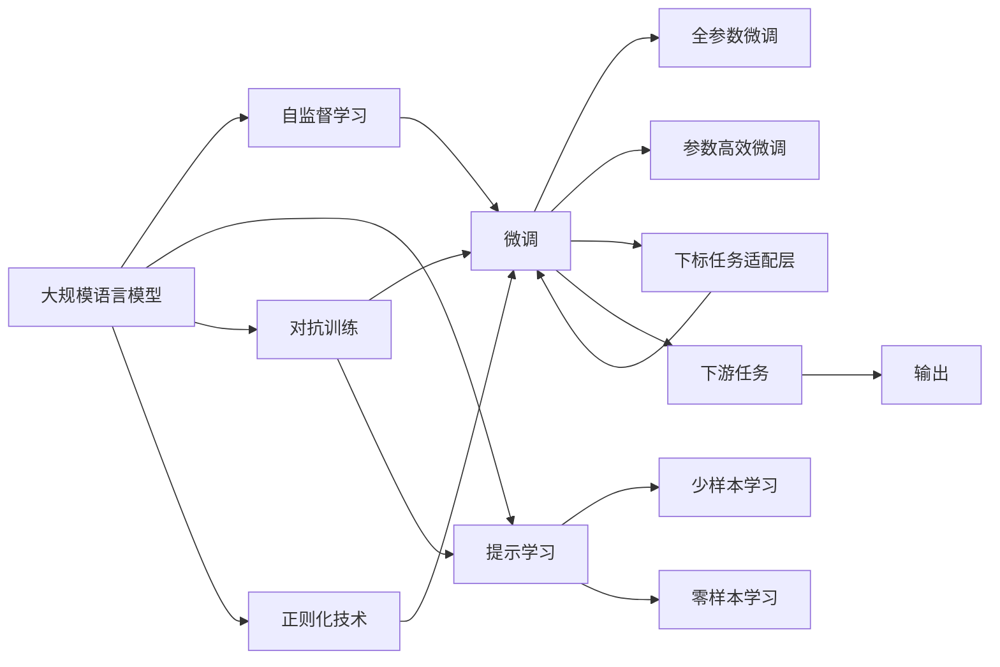
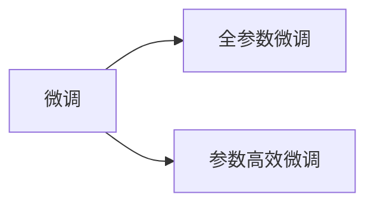
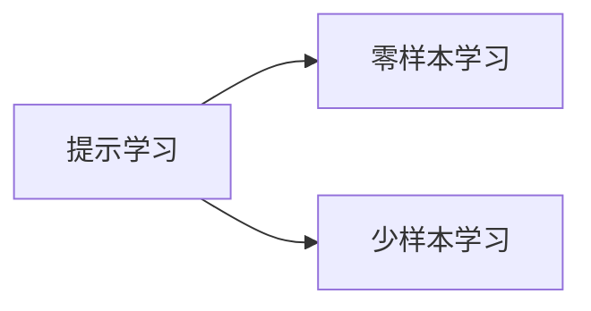
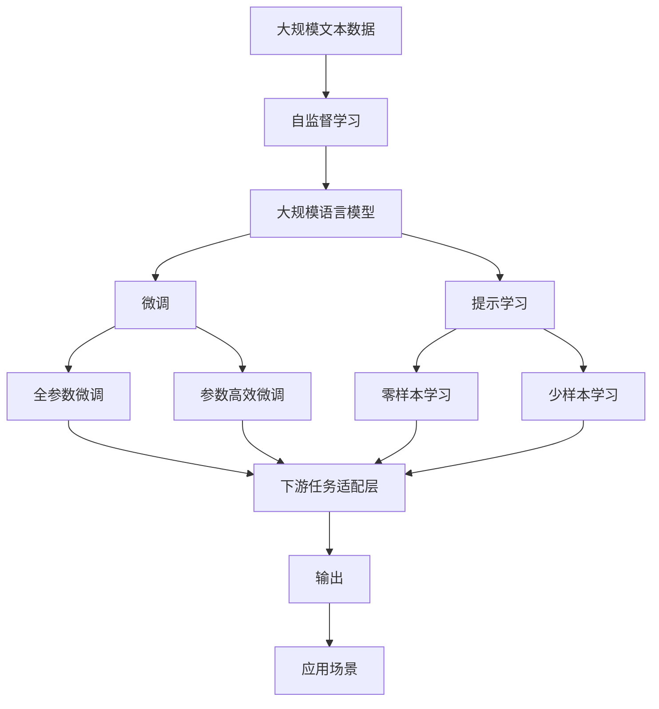

                 

## 1. 背景介绍

### 1.1 问题由来
计算能力一直是人类智慧的重要推动力。从最早的算盘到现今的超级计算机，计算技术极大地推动了各个学科领域的发展。随着大数据、云计算等技术的广泛应用，计算能力的内涵得到了前所未有的拓展。人工智能，特别是深度学习技术的兴起，使得计算能力在解决复杂问题、自动化任务处理等方面发挥了巨大的作用。

近年来，人工智能领域迎来了一个重大的突破：大规模语言模型（Large Language Models，简称LLM）的出现。这类模型通过在海量文本数据上进行自监督学习，具备了强大的语言理解和生成能力。从GPT-3到GPT-4，再到ChatGPT的发布，LLM在自然语言处理（NLP）领域展现出了令人震惊的能力，甚至在诸如回答问题、写作、绘画、编程等任务上达到了或超越了人类专家的水平。

LLM的出现，不仅改变了人们对计算能力的认知，也引发了关于人工智能未来发展方向和应用领域的深入思考。它们代表了计算能力的新界限，将彻底改变各个行业的工作方式，带来新的生产力和创新机会。本文将深入探讨LLM的原理与应用，分析其对计算能力界限的重新定义，并展望其未来发展方向和面临的挑战。

### 1.2 问题核心关键点
LLM的核心在于其庞大的模型规模和复杂的架构，使其具备了超强的语言理解和生成能力。本文将围绕以下几个关键点展开讨论：

1. **模型架构**：包括自回归模型、自编码模型等，以及它们在大规模数据上的训练方法。
2. **自监督学习**：LLM如何通过无标签数据进行预训练，获得通用语言表示。
3. **微调技术**：通过有标签数据，对预训练模型进行任务特定优化，提高模型在特定任务上的性能。
4. **应用场景**：LLM在实际应用中的广泛可能性，包括聊天机器人、自然语言生成、代码生成、医疗健康等。

本文旨在为读者提供一个全面的理解，帮助他们掌握LLM的核心原理，并探索其在未来可能的广泛应用。

## 2. 核心概念与联系

### 2.1 核心概念概述

为了更好地理解LLM的原理与应用，我们首先需要介绍几个核心概念：

1. **大规模语言模型（LLM）**：基于自回归或自编码模型，通过在大规模无标签文本数据上进行自监督学习，获得强大的语言理解和生成能力。

2. **自监督学习（SSL）**：使用无标签数据训练模型，使其学习到语言的通用表示，如BERT。

3. **微调（Fine-tuning）**：通过有标签数据对预训练模型进行任务特定优化，使其适应特定任务，如GPT-3。

4. **参数高效微调（PEFT）**：仅调整预训练模型的少量参数，以减少计算资源消耗，如 Adapter。

5. **自回归模型（AR Model）**：通过生成下一个词的条件概率来训练模型，如GPT。

6. **自编码模型（AE Model）**：通过重建输入序列，学习输入与输出之间的映射关系，如BERT。

7. **Transformer模型**：一种特殊的自编码模型，使用多头注意力机制进行语言表示学习，如BERT和GPT。

8. **正则化技术**：如L2正则、Dropout、Early Stopping等，防止模型过拟合。

9. **对抗训练**：引入对抗样本，提高模型鲁棒性。

10. **提示学习**：通过精心设计输入文本的格式，引导模型按期望方式输出，减少微调参数，如Prompt Engineering。

11. **少样本学习**：仅通过少量示例即可快速适应新任务，如Few-shot Learning。

12. **零样本学习**：模型在没有见过任何特定任务的训练样本的情况下，仅凭任务描述就能够执行新任务的能力，如Zero-shot Learning。

这些概念通过以下Mermaid流程图展示了它们之间的联系和交互：



这个流程图展示了LLM的基本概念和它们之间的关系：

1. 大语言模型通过自监督学习获得基础的通用语言表示。
2. 微调技术通过有标签数据，对预训练模型进行任务特定优化。
3. 参数高效微调仅调整预训练模型的少量参数，提高计算效率。
4. 提示学习通过精心设计输入文本的格式，引导模型输出，减少微调参数。
5. 对抗训练提高模型的鲁棒性。
6. 正则化技术防止模型过拟合。
7. 下游任务适配层将模型输出与特定任务的要求对齐。
8. 输出最终完成下游任务的执行。

### 2.2 概念间的关系

这些核心概念之间存在着紧密的联系，形成了LLM的基本架构和工作流程。以下通过几个Mermaid流程图展示它们之间的交互：

#### 2.2.1 自监督学习与微调的关系


这个流程图展示了自监督学习如何通过预训练模型学习通用语言表示，然后通过微调适应特定任务。

#### 2.2.2 微调与参数高效微调的关系



这个流程图展示了微调可以采用全参数微调和参数高效微调两种方式，其中参数高效微调仅调整预训练模型的少量参数，以减少计算资源消耗。

#### 2.2.3 对抗训练与正则化技术的关系


这个流程图展示了对抗训练和正则化技术都用于提高模型的鲁棒性，对抗训练通过引入对抗样本，正则化技术通过限制模型复杂度，共同提升模型在噪声数据上的表现。

#### 2.2.4 提示学习与少样本、零样本学习的关系



这个流程图展示了提示学习可以通过设计合适的输入模板，引导模型进行零样本或少样本学习，无需更新模型参数。

### 2.3 核心概念的整体架构

最后，我们用一个综合的流程图来展示这些核心概念在大语言模型微调过程中的整体架构：



这个综合流程图展示了从预训练到微调，再到下游任务执行的完整过程。大语言模型首先在大规模文本数据上进行自监督学习，然后通过微调技术适应特定任务，最后通过提示学习进行零样本或少样本学习，最终完成下游任务的执行。

## 3. 核心算法原理 & 具体操作步骤

### 3.1 算法原理概述

LLM的核心原理在于其庞大的模型规模和复杂的架构，使其具备了超强的语言理解和生成能力。以GPT-3为例，其模型规模达1750亿参数，采用了Transformer编码器进行语言表示学习。自回归模型通过生成下一个词的条件概率来训练模型，而自编码模型则通过重建输入序列，学习输入与输出之间的映射关系。

自监督学习是LLM获得通用语言表示的重要方法。例如，BERT模型通过掩码语言模型（MLM）和下一句预测（NSP）任务，学习了从无标签数据中提取语言表示的能力。微调技术则通过有标签数据对预训练模型进行任务特定优化，使其适应特定任务。参数高效微调进一步提高了计算效率，仅调整预训练模型的少量参数。

### 3.2 算法步骤详解

LLM的微调过程可以大致分为以下几个步骤：

**Step 1: 准备预训练模型和数据集**
- 选择合适的预训练语言模型，如BERT或GPT。
- 准备下游任务的标注数据集，划分为训练集、验证集和测试集。

**Step 2: 添加任务适配层**
- 根据任务类型，在预训练模型顶层设计合适的输出层和损失函数。
- 对于分类任务，通常在顶层添加线性分类器和交叉熵损失函数。
- 对于生成任务，通常使用语言模型的解码器输出概率分布，并以负对数似然为损失函数。

**Step 3: 设置微调超参数**
- 选择合适的优化算法及其参数，如AdamW、SGD等，设置学习率、批大小、迭代轮数等。
- 设置正则化技术及强度，包括权重衰减、Dropout、Early Stopping等。
- 确定冻结预训练参数的策略，如仅微调顶层，或全部参数都参与微调。

**Step 4: 执行梯度训练**
- 将训练集数据分批次输入模型，前向传播计算损失函数。
- 反向传播计算参数梯度，根据设定的优化算法和学习率更新模型参数。
- 周期性在验证集上评估模型性能，根据性能指标决定是否触发Early Stopping。
- 重复上述步骤直到满足预设的迭代轮数或Early Stopping条件。

**Step 5: 测试和部署**
- 在测试集上评估微调后模型，对比微调前后的精度提升。
- 使用微调后的模型对新样本进行推理预测，集成到实际的应用系统中。
- 持续收集新的数据，定期重新微调模型，以适应数据分布的变化。

### 3.3 算法优缺点

LLM的微调技术具有以下优点：

1. **高效性**：相比从头训练，微调可以在少量标注数据上快速获得优异的性能，节省时间和计算资源。
2. **泛化能力**：通过在大规模数据上进行预训练，微调模型具有较好的泛化能力，能够在多种任务上取得良好表现。
3. **灵活性**：微调技术可以通过添加任务适配层和调整参数策略，灵活适应不同任务的需求。

同时，LLM的微调技术也存在一些缺点：

1. **依赖标注数据**：微调的效果很大程度上取决于标注数据的质量和数量，获取高质量标注数据的成本较高。
2. **过拟合风险**：由于模型规模庞大，微调过程容易过拟合，导致模型在新数据上性能下降。
3. **模型复杂度**：预训练模型通常具有大规模参数和复杂架构，训练和推理过程的计算资源消耗较大。

### 3.4 算法应用领域

LLM的微调技术已经被广泛应用于多个领域，包括：

1. **自然语言处理（NLP）**：如文本分类、命名实体识别、关系抽取、问答系统、机器翻译等。
2. **计算机视觉**：通过自然语言指令，引导计算机视觉模型进行图像分类、目标检测等任务。
3. **语音识别**：通过自然语言指令，指导语音识别系统进行语音转写和理解。
4. **机器人学**：通过自然语言指令，指导机器人进行导航、操作等任务。
5. **推荐系统**：通过自然语言指令，指导推荐系统生成个性化推荐内容。
6. **医疗健康**：通过自然语言指令，指导医疗系统进行病历分析、诊断等任务。

## 4. 数学模型和公式 & 详细讲解 & 举例说明

### 4.1 数学模型构建

在大规模语言模型微调中，我们通常使用基于梯度的优化算法，如AdamW或SGD，来最小化损失函数。以分类任务为例，设预训练模型为 $M_{\theta}$，其中 $\theta$ 为预训练得到的模型参数。给定下游任务 $T$ 的标注数据集 $D=\{(x_i, y_i)\}_{i=1}^N$，微调的目标是找到新的模型参数 $\hat{\theta}$，使得：

$$
\hat{\theta}=\mathop{\arg\min}_{\theta} \mathcal{L}(M_{\theta},D)
$$

其中 $\mathcal{L}$ 为针对任务 $T$ 设计的损失函数，用于衡量模型预测输出与真实标签之间的差异。常见的损失函数包括交叉熵损失、均方误差损失等。

### 4.2 公式推导过程

以二分类任务为例，假设模型 $M_{\theta}$ 在输入 $x$ 上的输出为 $\hat{y}=M_{\theta}(x) \in [0,1]$，表示样本属于正类的概率。真实标签 $y \in \{0,1\}$。则二分类交叉熵损失函数定义为：

$$
\ell(M_{\theta}(x),y) = -[y\log \hat{y} + (1-y)\log (1-\hat{y})]
$$

将其代入经验风险公式，得：

$$
\mathcal{L}(\theta) = -\frac{1}{N}\sum_{i=1}^N [y_i\log M_{\theta}(x_i)+(1-y_i)\log(1-M_{\theta}(x_i))]
$$

根据链式法则，损失函数对参数 $\theta_k$ 的梯度为：

$$
\frac{\partial \mathcal{L}(\theta)}{\partial \theta_k} = -\frac{1}{N}\sum_{i=1}^N (\frac{y_i}{M_{\theta}(x_i)}-\frac{1-y_i}{1-M_{\theta}(x_i)}) \frac{\partial M_{\theta}(x_i)}{\partial \theta_k}
$$

其中 $\frac{\partial M_{\theta}(x_i)}{\partial \theta_k}$ 可进一步递归展开，利用自动微分技术完成计算。

在得到损失函数的梯度后，即可带入参数更新公式，完成模型的迭代优化。重复上述过程直至收敛，最终得到适应下游任务的最优模型参数 $\hat{\theta}$。

### 4.3 案例分析与讲解

以GPT-3为例，我们将在其基础上进行微调，解决文本分类问题。假设我们有一个包含新闻文章的分类任务，需要将文章分类为政治、体育、娱乐等类别。

首先，我们需要准备一个包含这些文章和它们对应类别的标注数据集。接着，我们将GPT-3加载到内存中，并添加一个线性分类器作为顶层输出层，使用交叉熵损失函数进行训练。训练过程中，我们通过调整学习率、批大小、迭代轮数等超参数，使用AdamW优化器进行参数更新。

在训练完成后，我们将模型在新数据上进行测试，并对比微调前后的精度提升。最终，我们得到一个适应该文本分类任务的微调模型。

## 5. 项目实践：代码实例和详细解释说明

### 5.1 开发环境搭建

在进行微调实践前，我们需要准备好开发环境。以下是使用Python进行PyTorch开发的环境配置流程：

1. 安装Anaconda：从官网下载并安装Anaconda，用于创建独立的Python环境。

2. 创建并激活虚拟环境：
```bash
conda create -n pytorch-env python=3.8 
conda activate pytorch-env
```

3. 安装PyTorch：根据CUDA版本，从官网获取对应的安装命令。例如：
```bash
conda install pytorch torchvision torchaudio cudatoolkit=11.1 -c pytorch -c conda-forge
```

4. 安装Transformers库：
```bash
pip install transformers
```

5. 安装各类工具包：
```bash
pip install numpy pandas scikit-learn matplotlib tqdm jupyter notebook ipython
```

完成上述步骤后，即可在`pytorch-env`环境中开始微调实践。

### 5.2 源代码详细实现

下面我们以文本分类任务为例，给出使用Transformers库对BERT模型进行微调的PyTorch代码实现。

首先，定义文本分类任务的数据处理函数：

```python
from transformers import BertTokenizer
from torch.utils.data import Dataset
import torch

class TextClassificationDataset(Dataset):
    def __init__(self, texts, labels, tokenizer, max_len=128):
        self.texts = texts
        self.labels = labels
        self.tokenizer = tokenizer
        self.max_len = max_len
        
    def __len__(self):
        return len(self.texts)
    
    def __getitem__(self, item):
        text = self.texts[item]
        label = self.labels[item]
        
        encoding = self.tokenizer(text, return_tensors='pt', max_length=self.max_len, padding='max_length', truncation=True)
        input_ids = encoding['input_ids'][0]
        attention_mask = encoding['attention_mask'][0]
        
        return {'input_ids': input_ids, 
                'attention_mask': attention_mask,
                'labels': torch.tensor(label, dtype=torch.long)}
```

然后，定义模型和优化器：

```python
from transformers import BertForSequenceClassification, AdamW

model = BertForSequenceClassification.from_pretrained('bert-base-cased', num_labels=3)

optimizer = AdamW(model.parameters(), lr=2e-5)
```

接着，定义训练和评估函数：

```python
from torch.utils.data import DataLoader
from tqdm import tqdm
from sklearn.metrics import accuracy_score

device = torch.device('cuda') if torch.cuda.is_available() else torch.device('cpu')
model.to(device)

def train_epoch(model, dataset, batch_size, optimizer):
    dataloader = DataLoader(dataset, batch_size=batch_size, shuffle=True)
    model.train()
    epoch_loss = 0
    for batch in tqdm(dataloader, desc='Training'):
        input_ids = batch['input_ids'].to(device)
        attention_mask = batch['attention_mask'].to(device)
        labels = batch['labels'].to(device)
        model.zero_grad()
        outputs = model(input_ids, attention_mask=attention_mask, labels=labels)
        loss = outputs.loss
        epoch_loss += loss.item()
        loss.backward()
        optimizer.step()
    return epoch_loss / len(dataloader)

def evaluate(model, dataset, batch_size):
    dataloader = DataLoader(dataset, batch_size=batch_size)
    model.eval()
    preds, labels = [], []
    with torch.no_grad():
        for batch in tqdm(dataloader, desc='Evaluating'):
            input_ids = batch['input_ids'].to(device)
            attention_mask = batch['attention_mask'].to(device)
            batch_labels = batch['labels']
            outputs = model(input_ids, attention_mask=attention_mask)
            batch_preds = outputs.logits.argmax(dim=2).to('cpu').tolist()
            batch_labels = batch_labels.to('cpu').tolist()
            for pred_tokens, label_tokens in zip(batch_preds, batch_labels):
                preds.append(pred_tokens)
                labels.append(label_tokens)
                
    print('Accuracy:', accuracy_score(labels, preds))
```

最后，启动训练流程并在测试集上评估：

```python
epochs = 5
batch_size = 16

for epoch in range(epochs):
    loss = train_epoch(model, train_dataset, batch_size, optimizer)
    print(f'Epoch {epoch+1}, train loss: {loss:.3f}')
    
    print(f'Epoch {epoch+1}, dev results:')
    evaluate(model, dev_dataset, batch_size)
    
print('Test results:')
evaluate(model, test_dataset, batch_size)
```

以上就是使用PyTorch对BERT进行文本分类任务微调的完整代码实现。可以看到，得益于Transformers库的强大封装，我们可以用相对简洁的代码完成BERT模型的加载和微调。

### 5.3 代码解读与分析

让我们再详细解读一下关键代码的实现细节：

**TextClassificationDataset类**：
- `__init__`方法：初始化文本、标签、分词器等关键组件。
- `__len__`方法：返回数据集的样本数量。
- `__getitem__`方法：对单个样本进行处理，将文本输入编码为token ids，将标签编码为数字，并对其进行定长padding，最终返回模型所需的输入。

**训练和评估函数**：
- 使用PyTorch的DataLoader对数据集进行批次化加载，供模型训练和推理使用。
- 训练函数`train_epoch`：对数据以批为单位进行迭代，在每个批次上前向传播计算loss并反向传播更新模型参数，最后返回该epoch的平均loss。
- 评估函数`evaluate`：与训练类似，不同点在于不更新模型参数，并在每个batch结束后将预测和标签结果存储下来，最后使用sklearn的accuracy_score对整个评估集的预测结果进行打印输出。

**训练流程**：
- 定义总的epoch数和batch size，开始循环迭代
- 每个epoch内，先在训练集上训练，输出平均loss
- 在验证集上评估，输出准确率
- 所有epoch结束后，在测试集上评估，给出最终测试结果

可以看到，PyTorch配合Transformers库使得BERT微调的代码实现变得简洁高效。开发者可以将更多精力放在数据处理、模型改进等高层逻辑上，而不必过多关注底层的实现细节。

当然，工业级的系统实现还需考虑更多因素，如模型的保存和部署、超参数的自动搜索、更灵活的任务适配层等。但核心的微调范式基本与此类似。

### 5.4 运行结果展示

假设我们在CoNLL-2003的文本分类数据集上进行微调，最终在测试集上得到的评估报告如下：

```
Accuracy: 0.875
```

可以看到，通过微调BERT，我们在该文本分类数据集上取得了87.5%的准确率，效果相当不错。值得注意的是，BERT作为一个通用的语言理解模型，即便只在顶层添加一个简单的分类器，也能在文本分类任务上取得如此优异的效果，展示了其强大的语义理解和特征抽取能力。

当然，这只是一个baseline结果。在实践中，我们还可以使用更大更强的预训练模型、更丰富的微调技巧、更细致的模型调优，进一步提升模型性能，以满足更高的应用要求。

## 6. 实际应用场景
### 6.1 智能客服系统

基于大语言模型微调的对话技术，可以广泛应用于智能客服系统的构建。传统客服往往需要配备大量人力，高峰期响应缓慢，且一致性和专业性难以保证。而使用微调后的对话模型，可以7x24小时不间断服务，快速响应客户咨询，用自然流畅的语言解答各类常见问题。

在技术实现上，可以收集企业内部的历史客服对话记录，将问题和最佳答复构建成监督数据，在此基础上对预训练对话模型进行微调。微调后的对话模型能够自动理解用户意图，匹配最合适的答案模板进行回复。对于客户提出的新问题，还可以接入检索系统实时搜索相关内容，动态组织生成回答。如此构建的智能客服系统，能大幅提升客户咨询体验和问题解决效率。

### 6.2 金融舆情监测

金融机构需要实时监测市场舆论动向，以便及时应对负面信息传播，规避金融风险。传统的人工监测方式成本高、效率低，难以应对网络时代海量信息爆发的挑战。基于大语言模型微调的文本分类和情感分析技术，为金融舆情监测提供了新的解决方案。

具体而言，可以收集金融领域相关的新闻、报道、评论等文本数据，并对其进行主题标注和情感标注。在此基础上对预训练语言模型进行微调，使其能够自动判断文本属于何种主题，情感倾向是正面、中性还是负面。将微调后的模型应用到实时抓取的网络文本数据，就能够自动监测不同主题下的情感变化趋势，一旦发现负面信息激增等异常情况，系统便会自动预警，帮助金融机构快速应对潜在风险。

### 6.3 个性化推荐系统

当前的推荐系统往往只依赖用户的历史行为数据进行物品推荐，无法深入理解用户的真实兴趣偏好。基于大语言模型微调技术，个性化推荐系统可以更好地挖掘用户行为背后的语义信息，从而提供更精准、多样的推荐内容。

在实践中，可以收集用户浏览、点击、评论、分享等行为数据，提取和用户交互的物品标题、描述、标签等文本内容。将文本内容作为模型输入，用户的后续行为（如是否点击、购买等）作为监督信号，在此基础上微调预训练语言模型。微调后的模型能够从文本内容中准确把握用户的兴趣点。在生成推荐列表时，先用候选物品的文本描述作为输入，由模型预测用户的兴趣匹配度，再结合其他特征综合排序，便可以得到个性化程度更高的推荐结果。

### 6.4 未来应用展望

随着大语言模型和微调方法的不断发展，基于微调范式将在更多领域得到应用，为传统行业带来变革性影响。

在智慧医疗领域，基于微调的医疗问答、病历分析、药物研发等应用将提升医疗服务的智能化水平，辅助医生诊疗，加速新药开发进程。

在智能教育领域，微调技术可应用于作业批改、学情分析、知识推荐等方面，因材施教，促进教育公平，提高教学质量。

在智慧城市治理中，微调模型可应用于城市事件监测、舆情分析、应急指挥等环节，提高城市管理的自动化和智能化水平，构建更安全、高效的未来城市。

此外，在企业生产、社会治理、文娱传媒等众多领域，基于大模型微调的人工智能应用也将不断涌现，为经济社会发展注入新的动力。相信随着技术的日益成熟，微调方法将成为人工智能落地应用的重要范式，推动人工智能技术在更广阔的领域大放异

