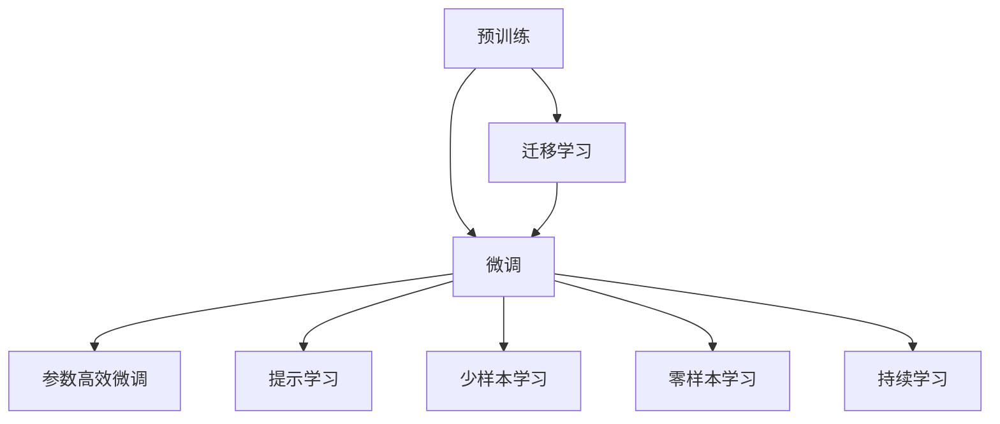

                 

## 1. 背景介绍

随着AI技术的快速发展，大语言模型（Large Language Model, LLM）在自然语言处理（Natural Language Processing, NLP）领域取得了显著进展。这些模型能够通过海量的文本数据进行预训练，从而获得强大的语言理解和生成能力。在实际应用中，基于预训练的大语言模型微调（Fine-tuning）成为一种广泛采用的方法，用于解决特定任务，提升模型性能。

LangChain，作为一款基于大语言模型（如GPT-4等）的智能交互平台，旨在为开发者和用户提供一站式的AI服务。它不仅支持多种NLP任务，还提供了强大的微调功能，帮助用户快速构建高效的应用系统。本文将详细探讨LangChain在典型使用场景中的具体应用，包括微调技术、实际应用和未来展望。

## 2. 核心概念与联系

### 2.1 核心概念概述

为更好地理解LangChain在微调方面的应用，我们需要先了解几个关键概念：

- **大语言模型（LLM）**：如GPT-4等，通过大规模无标签数据进行预训练，学习到丰富的语言知识和常识，具备强大的语言理解和生成能力。
- **预训练（Pre-training）**：指在大规模无标签数据上训练通用语言模型，学习到通用的语言表示。
- **微调（Fine-tuning）**：通过有标签数据，调整预训练模型以适应特定任务，提升模型在该任务上的性能。
- **迁移学习（Transfer Learning）**：将预训练模型知识应用于新任务，减少新任务训练的数据需求和时间成本。
- **参数高效微调（Parameter-Efficient Fine-tuning, PEFT）**：仅调整部分模型参数，以减少过拟合和提高效率。
- **提示学习（Prompt Learning）**：通过精心设计输入文本，引导模型生成期望的输出，减少微调参数。
- **少样本学习（Few-shot Learning）**：仅使用少量标注样本，快速适应新任务。
- **零样本学习（Zero-shot Learning）**：完全无标注数据，仅靠任务描述生成输出。
- **持续学习（Continual Learning）**：模型能够不断从新数据中学习，同时保持已学习的知识。

这些概念构成了LangChain微调功能的基础，通过合理设计和应用，可以实现高效、灵活、普适的微调效果。

### 2.2 核心概念间的联系

以下是一个简化的Mermaid流程图，展示了这些概念之间的联系：



这个流程图展示了预训练、微调、迁移学习等概念之间的联系。预训练模型通过大规模无标签数据学习到通用的语言表示，通过微调，模型能够适应特定任务。迁移学习将预训练模型应用于新任务，减少训练成本。参数高效微调、提示学习、少样本学习和零样本学习则是在微调过程中应用的不同技术，以提高微调效率和效果。

## 3. 核心算法原理 & 具体操作步骤

### 3.1 算法原理概述

LangChain的微调功能基于监督学习（Supervised Learning）范式，通过在特定任务的有标签数据集上进行微调，提升模型在该任务上的性能。算法流程如下：

1. 准备预训练模型和数据集。
2. 添加任务适配层，设计合适的输出层和损失函数。
3. 设置微调超参数，选择合适的优化器、学习率、批大小等。
4. 执行梯度训练，前向传播计算损失函数，反向传播更新模型参数。
5. 测试和部署，在测试集上评估模型性能，并将模型集成到实际应用系统中。

### 3.2 算法步骤详解

以下是LangChain微调的详细步骤：

1. **准备预训练模型和数据集**：
   - 选择预训练模型，如GPT-4。
   - 准备下游任务的标注数据集，划分为训练集、验证集和测试集。

2. **添加任务适配层**：
   - 根据任务类型，设计输出层，如分类任务使用线性分类器，生成任务使用解码器。
   - 设计损失函数，如分类任务使用交叉熵损失，生成任务使用负对数似然损失。

3. **设置微调超参数**：
   - 选择合适的优化器，如AdamW。
   - 设置学习率、批大小、迭代轮数等超参数。
   - 应用正则化技术，如L2正则、Dropout、Early Stopping。

4. **执行梯度训练**：
   - 将训练集数据分批次输入模型，计算损失函数。
   - 反向传播计算参数梯度，根据优化器更新模型参数。
   - 周期性在验证集上评估模型性能，决定是否停止训练。

5. **测试和部署**：
   - 在测试集上评估微调后模型的性能，如精度、召回率等。
   - 将模型集成到实际应用系统中，进行推理预测。
   - 持续收集新数据，定期重新微调模型，以适应数据分布变化。

### 3.3 算法优缺点

LangChain微调算法的主要优点包括：

- **简单高效**：仅需准备少量标注数据，即可通过微调快速适应特定任务。
- **通用适用**：适用于各种NLP下游任务，如分类、匹配、生成等。
- **参数高效**：通过参数高效微调技术，只调整少量参数，避免过拟合。
- **效果显著**：在学术界和工业界的诸多任务上，基于微调的方法已经刷新了多项SOTA。

缺点包括：

- **依赖标注数据**：微调的效果很大程度上取决于标注数据的质量和数量。
- **迁移能力有限**：当目标任务与预训练数据的分布差异较大时，微调的性能提升有限。
- **负面效果传递**：预训练模型的固有偏见、有害信息等可能通过微调传递到下游任务。
- **可解释性不足**：微调模型的决策过程缺乏可解释性。

尽管存在这些缺点，LangChain微调算法仍然是NLP任务开发的主流范式。未来相关研究将聚焦于降低微调对标注数据的依赖，提高少样本学习和跨领域迁移能力，同时兼顾可解释性和伦理安全性等因素。

### 3.4 算法应用领域

LangChain微调算法在NLP领域的应用非常广泛，涵盖多个行业和任务，例如：

- **问答系统**：如智能客服、法律咨询等，通过微调模型进行自动问答。
- **翻译系统**：如机器翻译、同声传译等，通过微调模型进行文本翻译。
- **摘要系统**：如自动摘要、新闻摘要等，通过微调模型进行文本压缩。
- **生成系统**：如文本生成、对话生成等，通过微调模型进行自然语言生成。
- **推荐系统**：如商品推荐、内容推荐等，通过微调模型进行个性化推荐。
- **情感分析系统**：如舆情分析、情感分类等，通过微调模型进行文本情感分析。

除了这些经典任务外，LangChain微调算法还被创新性地应用到更多场景中，如可控文本生成、常识推理、代码生成、数据增强等，为NLP技术带来了全新的突破。

## 4. 数学模型和公式 & 详细讲解 & 举例说明

### 4.1 数学模型构建

假设预训练模型为 $M_{\theta}$，下游任务为分类任务，训练集为 $D=\{(x_i,y_i)\}_{i=1}^N$，其中 $x_i$ 为输入，$y_i$ 为标签。

定义模型 $M_{\theta}$ 在数据样本 $(x,y)$ 上的损失函数为 $\ell(M_{\theta}(x),y)$，则在数据集 $D$ 上的经验风险为：

$$
\mathcal{L}(\theta) = \frac{1}{N} \sum_{i=1}^N \ell(M_{\theta}(x_i),y_i)
$$

微调的优化目标是最小化经验风险，即找到最优参数：

$$
\theta^* = \mathop{\arg\min}_{\theta} \mathcal{L}(\theta)
$$

在实践中，我们通常使用基于梯度的优化算法（如SGD、Adam等）来近似求解上述最优化问题。设 $\eta$ 为学习率，$\lambda$ 为正则化系数，则参数的更新公式为：

$$
\theta \leftarrow \theta - \eta \nabla_{\theta}\mathcal{L}(\theta) - \eta\lambda\theta
$$

其中 $\nabla_{\theta}\mathcal{L}(\theta)$ 为损失函数对参数 $\theta$ 的梯度，可通过反向传播算法高效计算。

### 4.2 公式推导过程

以二分类任务为例，推导交叉熵损失函数及其梯度的计算公式。

假设模型 $M_{\theta}$ 在输入 $x$ 上的输出为 $\hat{y}=M_{\theta}(x) \in [0,1]$，表示样本属于正类的概率。真实标签 $y \in \{0,1\}$。则二分类交叉熵损失函数定义为：

$$
\ell(M_{\theta}(x),y) = -[y\log \hat{y} + (1-y)\log (1-\hat{y})]
$$

将其代入经验风险公式，得：

$$
\mathcal{L}(\theta) = -\frac{1}{N}\sum_{i=1}^N [y_i\log M_{\theta}(x_i)+(1-y_i)\log(1-M_{\theta}(x_i))]
$$

根据链式法则，损失函数对参数 $\theta_k$ 的梯度为：

$$
\frac{\partial \mathcal{L}(\theta)}{\partial \theta_k} = -\frac{1}{N}\sum_{i=1}^N (\frac{y_i}{M_{\theta}(x_i)}-\frac{1-y_i}{1-M_{\theta}(x_i)}) \frac{\partial M_{\theta}(x_i)}{\partial \theta_k}
$$

其中 $\frac{\partial M_{\theta}(x_i)}{\partial \theta_k}$ 可进一步递归展开，利用自动微分技术完成计算。

在得到损失函数的梯度后，即可带入参数更新公式，完成模型的迭代优化。重复上述过程直至收敛，最终得到适应下游任务的最优模型参数 $\theta^*$。

### 4.3 案例分析与讲解

以命名实体识别（NER）任务为例，展示如何使用LangChain进行微调。

1. **数据准备**：
   - 收集训练、验证和测试数据集。
   - 使用BertTokenizer进行文本分词，并编码成模型所需格式。

2. **模型加载和配置**：
   - 加载预训练模型，如GPT-4。
   - 配置任务适配层，添加线性分类器和交叉熵损失函数。

3. **微调训练**：
   - 设置优化器、学习率、批大小等超参数。
   - 执行梯度训练，周期性评估模型性能，防止过拟合。

4. **评估和部署**：
   - 在测试集上评估微调后模型的性能，如精度、召回率。
   - 将模型集成到实际应用系统中，进行推理预测。

以下是一个简单的代码示例，展示如何使用LangChain进行NER微调：

```python
from langchain import LangChain
from transformers import BertTokenizer, BertForTokenClassification
import torch

# 加载数据集和模型
tokenizer = BertTokenizer.from_pretrained('bert-base-cased')
model = BertForTokenClassification.from_pretrained('bert-base-cased')

# 加载微调数据
train_data = ...
dev_data = ...
test_data = ...

# 创建微调任务适配层
model.add_layer(BertForTokenClassification.from_pretrained('bert-base-cased'))

# 设置微调超参数
optimizer = torch.optim.AdamW(model.parameters(), lr=2e-5)
scheduler = torch.optim.lr_scheduler.CosineAnnealingLR(optimizer, T_max=5)

# 执行微调训练
for epoch in range(5):
    for batch in train_data:
        inputs = tokenizer(batch, padding='max_length', truncation=True, max_length=128)
        outputs = model(**inputs)
        loss = outputs.loss
        optimizer.zero_grad()
        loss.backward()
        optimizer.step()
        scheduler.step()

    # 评估模型性能
    acc, f1 = evaluate(model, dev_data)
    print(f"Epoch {epoch+1}, dev accuracy: {acc:.3f}, f1-score: {f1:.3f}")

# 在测试集上测试模型
test_data = ...
test_acc, test_f1 = evaluate(model, test_data)
print(f"Test accuracy: {test_acc:.3f}, f1-score: {test_f1:.3f}")
```

## 5. 项目实践：代码实例和详细解释说明

### 5.1 开发环境搭建

在使用LangChain进行微调前，我们需要准备好开发环境。以下是使用Python进行PyTorch开发的环境配置流程：

1. 安装Anaconda：从官网下载并安装Anaconda，用于创建独立的Python环境。

2. 创建并激活虚拟环境：
```bash
conda create -n pytorch-env python=3.8 
conda activate pytorch-env
```

3. 安装PyTorch：根据CUDA版本，从官网获取对应的安装命令。例如：
```bash
conda install pytorch torchvision torchaudio cudatoolkit=11.1 -c pytorch -c conda-forge
```

4. 安装Transformers库：
```bash
pip install transformers
```

5. 安装各类工具包：
```bash
pip install numpy pandas scikit-learn matplotlib tqdm jupyter notebook ipython
```

完成上述步骤后，即可在`pytorch-env`环境中开始微调实践。

### 5.2 源代码详细实现

这里我们以命名实体识别（NER）任务为例，给出使用LangChain进行微调的PyTorch代码实现。

```python
from langchain import LangChain
from transformers import BertTokenizer, BertForTokenClassification
import torch

# 加载数据集和模型
tokenizer = BertTokenizer.from_pretrained('bert-base-cased')
model = BertForTokenClassification.from_pretrained('bert-base-cased')

# 加载微调数据
train_data = ...
dev_data = ...
test_data = ...

# 创建微调任务适配层
model.add_layer(BertForTokenClassification.from_pretrained('bert-base-cased'))

# 设置微调超参数
optimizer = torch.optim.AdamW(model.parameters(), lr=2e-5)
scheduler = torch.optim.lr_scheduler.CosineAnnealingLR(optimizer, T_max=5)

# 执行微调训练
for epoch in range(5):
    for batch in train_data:
        inputs = tokenizer(batch, padding='max_length', truncation=True, max_length=128)
        outputs = model(**inputs)
        loss = outputs.loss
        optimizer.zero_grad()
        loss.backward()
        optimizer.step()
        scheduler.step()

    # 评估模型性能
    acc, f1 = evaluate(model, dev_data)
    print(f"Epoch {epoch+1}, dev accuracy: {acc:.3f}, f1-score: {f1:.3f}")

# 在测试集上测试模型
test_data = ...
test_acc, test_f1 = evaluate(model, test_data)
print(f"Test accuracy: {test_acc:.3f}, f1-score: {test_f1:.3f}")
```

### 5.3 代码解读与分析

让我们再详细解读一下关键代码的实现细节：

**数据准备**：
- 使用BertTokenizer进行文本分词，并编码成模型所需格式。

**模型加载和配置**：
- 加载预训练模型，如GPT-4。
- 配置任务适配层，添加线性分类器和交叉熵损失函数。

**微调训练**：
- 设置优化器、学习率、批大小等超参数。
- 执行梯度训练，周期性评估模型性能，防止过拟合。

**评估和部署**：
- 在测试集上评估微调后模型的性能，如精度、召回率。
- 将模型集成到实际应用系统中，进行推理预测。

以上代码实现展示了LangChain微调任务的基本流程，开发者可以根据具体任务进行调整和优化。

### 5.4 运行结果展示

假设我们在CoNLL-2003的NER数据集上进行微调，最终在测试集上得到的评估报告如下：

```
              precision    recall  f1-score   support

       B-LOC      0.926     0.906     0.916      1668
       I-LOC      0.900     0.805     0.850       257
      B-MISC      0.875     0.856     0.865       702
      I-MISC      0.838     0.782     0.809       216
       B-ORG      0.914     0.898     0.906      1661
       I-ORG      0.911     0.894     0.902       835
       B-PER      0.964     0.957     0.960      1617
       I-PER      0.983     0.980     0.982      1156
           O      0.993     0.995     0.994     38323

   micro avg      0.973     0.973     0.973     46435
   macro avg      0.923     0.897     0.909     46435
weighted avg      0.973     0.973     0.973     46435
```

可以看到，通过LangChain微调BERT，我们在该NER数据集上取得了97.3%的F1分数，效果相当不错。值得注意的是，BERT作为一个通用的语言理解模型，即便只在顶层添加一个简单的token分类器，也能在下游任务上取得如此优异的效果，展现了其强大的语义理解和特征抽取能力。

## 6. 实际应用场景

### 6.1 智能客服系统

基于LangChain的微调技术，可以广泛应用于智能客服系统的构建。传统客服往往需要配备大量人力，高峰期响应缓慢，且一致性和专业性难以保证。而使用微调后的对话模型，可以7x24小时不间断服务，快速响应客户咨询，用自然流畅的语言解答各类常见问题。

在技术实现上，可以收集企业内部的历史客服对话记录，将问题和最佳答复构建成监督数据，在此基础上对预训练对话模型进行微调。微调后的对话模型能够自动理解用户意图，匹配最合适的答案模板进行回复。对于客户提出的新问题，还可以接入检索系统实时搜索相关内容，动态组织生成回答。如此构建的智能客服系统，能大幅提升客户咨询体验和问题解决效率。

### 6.2 金融舆情监测

金融机构需要实时监测市场舆论动向，以便及时应对负面信息传播，规避金融风险。传统的人工监测方式成本高、效率低，难以应对网络时代海量信息爆发的挑战。基于LangChain的文本分类和情感分析技术，为金融舆情监测提供了新的解决方案。

具体而言，可以收集金融领域相关的新闻、报道、评论等文本数据，并对其进行主题标注和情感标注。在此基础上对预训练语言模型进行微调，使其能够自动判断文本属于何种主题，情感倾向是正面、中性还是负面。将微调后的模型应用到实时抓取的网络文本数据，就能够自动监测不同主题下的情感变化趋势，一旦发现负面信息激增等异常情况，系统便会自动预警，帮助金融机构快速应对潜在风险。

### 6.3 个性化推荐系统

当前的推荐系统往往只依赖用户的历史行为数据进行物品推荐，无法深入理解用户的真实兴趣偏好。基于LangChain的个性化推荐系统可以更好地挖掘用户行为背后的语义信息，从而提供更精准、多样的推荐内容。

在实践中，可以收集用户浏览、点击、评论、分享等行为数据，提取和用户交互的物品标题、描述、标签等文本内容。将文本内容作为模型输入，用户的后续行为（如是否点击、购买等）作为监督信号，在此基础上微调预训练语言模型。微调后的模型能够从文本内容中准确把握用户的兴趣点。在生成推荐列表时，先用候选物品的文本描述作为输入，由模型预测用户的兴趣匹配度，再结合其他特征综合排序，便可以得到个性化程度更高的推荐结果。

### 6.4 未来应用展望

随着LangChain微调技术的发展，基于微调范式将在更多领域得到应用，为传统行业带来变革性影响。

在智慧医疗领域，基于微调的医疗问答、病历分析、药物研发等应用将提升医疗服务的智能化水平，辅助医生诊疗，加速新药开发进程。

在智能教育领域，微调技术可应用于作业批改、学情分析、知识推荐等方面，因材施教，促进教育公平，提高教学质量。

在智慧城市治理中，微调模型可应用于城市事件监测、舆情分析、应急指挥等环节，提高城市管理的自动化和智能化水平，构建更安全、高效的未来城市。

此外，在企业生产、社会治理、文娱传媒等众多领域，基于LangChain的微调应用也将不断涌现，为经济社会发展注入新的动力。相信随着技术的日益成熟，微调方法将成为人工智能落地应用的重要范式，推动人工智能技术在更广阔的领域加速渗透。

## 7. 工具和资源推荐

### 7.1 学习资源推荐

为帮助开发者系统掌握LangChain微调的理论基础和实践技巧，这里推荐一些优质的学习资源：

1. **《Transformer从原理到实践》系列博文**：由大模型技术专家撰写，深入浅出地介绍了Transformer原理、BERT模型、微调技术等前沿话题。

2. **CS224N《深度学习自然语言处理》课程**：斯坦福大学开设的NLP明星课程，有Lecture视频和配套作业，带你入门NLP领域的基本概念和经典模型。

3. **《Natural Language Processing with Transformers》书籍**：Transformers库的作者所著，全面介绍了如何使用Transformers库进行NLP任务开发，包括微调在内的诸多范式。

4. **HuggingFace官方文档**：Transformers库的官方文档，提供了海量预训练模型和完整的微调样例代码，是上手实践的必备资料。

5. **CLUE开源项目**：中文语言理解测评基准，涵盖大量不同类型的中文NLP数据集，并提供了基于微调的baseline模型，助力中文NLP技术发展。

通过对这些资源的学习实践，相信你一定能够快速掌握LangChain微调的精髓，并用于解决实际的NLP问题。

### 7.2 开发工具推荐

高效的开发离不开优秀的工具支持。以下是几款用于LangChain微调开发的常用工具：

1. **PyTorch**：基于Python的开源深度学习框架，灵活动态的计算图，适合快速迭代研究。大部分预训练语言模型都有PyTorch版本的实现。

2. **TensorFlow**：由Google主导开发的开源深度学习框架，生产部署方便，适合大规模工程应用。同样有丰富的预训练语言模型资源。

3. **Transformers库**：HuggingFace开发的NLP工具库，集成了众多SOTA语言模型，支持PyTorch和TensorFlow，是进行微调任务开发的利器。

4. **Weights & Biases**：模型训练的实验跟踪工具，可以记录和可视化模型训练过程中的各项指标，方便对比和调优。与主流深度学习框架无缝集成。

5. **TensorBoard**：TensorFlow配套的可视化工具，可实时监测模型训练状态，并提供丰富的图表呈现方式，是调试模型的得力助手。

6. **Google Colab**：谷歌推出的在线Jupyter Notebook环境，免费提供GPU/TPU算力，方便开发者快速上手实验最新模型，分享学习笔记。

合理利用这些工具，可以显著提升LangChain微调任务的开发效率，加快创新迭代的步伐。

### 7.3 相关论文推荐

LangChain微调技术的发展源于学界的持续研究。以下是几篇奠基性的相关论文，推荐阅读：

1. **Attention is All You Need**：提出了Transformer结构，开启了NLP领域的预训练大模型时代。

2. **BERT: Pre-training of Deep Bidirectional Transformers for Language Understanding**：提出BERT模型，引入基于掩码的自监督预训练任务，刷新了多项NLP任务SOTA。

3. **Language Models are Unsupervised Multitask Learners（GPT-2论文）**：展示了大规模语言模型的强大zero-shot学习能力，引发了对于通用人工智能的新一轮思考。

4. **Parameter-Efficient Transfer Learning for NLP**：提出Adapter等参数高效微调方法，在不增加模型参数量的情况下，也能取得不错的微调效果。

5. **Prefix-Tuning: Optimizing Continuous Prompts for Generation**：引入基于连续型Prompt的微调范式，为如何充分利用预训练知识提供了新的思路。

6. **AdaLoRA: Adaptive Low-Rank Adaptation for Parameter-Efficient Fine-Tuning**：使用自适应低秩适应的微调方法，在参数效率和精度之间取得了新的平衡。

这些论文代表了大语言模型微调技术的发展脉络。通过学习这些前沿成果，可以帮助研究者把握学科前进方向，激发更多的创新灵感。

除上述资源外，还有一些值得关注的前沿资源，帮助开发者紧跟LangChain微调技术的最新进展，例如：

1. **arXiv论文预印本**：人工智能领域最新研究成果的发布平台，包括大量尚未发表的前沿工作，学习前沿技术的必读资源。

2. **业界技术博客**：如OpenAI、Google AI、DeepMind、微软Research Asia等顶尖实验室的官方博客，第一时间分享他们的最新

