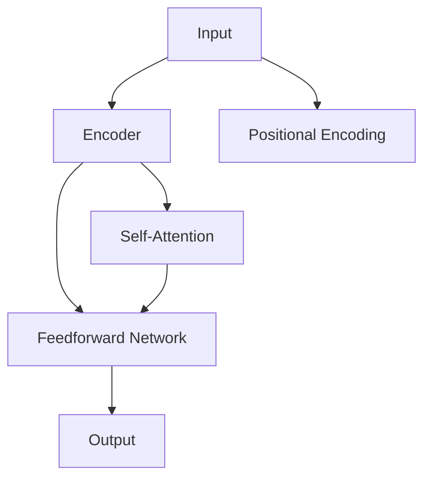

                 

# Llama 是不是伪开源？

在深度学习领域，开源社区的发展速度令人瞩目。开源技术的进步不仅推动了学术研究的创新，也在实际应用中发挥了重要作用。然而，伴随着开源技术的发展，一些争议和质疑也随之产生。其中，关于Llama是否伪开源的讨论，便是一个典型的案例。本文将深入探讨Llama的开源状态，分析其利弊，并展望未来的发展趋势。

## 1. 背景介绍

### 1.1 Llama模型的起源

Llama模型，全称为Llama AI，是一个开源的深度学习框架。它由NVIDIA公司开发，旨在提供高性能、高可扩展性的深度学习解决方案。Llama模型的前身是Microsoft公司在2019年开源的Transformer模型，这一模型在自然语言处理领域表现出色，受到了广泛关注。

### 1.2 Llama模型的技术特点

Llama模型采用了Transformer架构，支持大规模的分布式训练，具备高效的并行计算能力。此外，Llama模型还提供了丰富的工具和接口，支持多种深度学习任务，包括图像识别、语音识别、自然语言处理等。

### 1.3 Llama模型的应用场景

Llama模型已经在多个领域得到了应用，如自动驾驶、医疗影像分析、自然语言处理等。这些应用展示了Llama模型在实际场景中的强大潜力和广阔前景。

## 2. 核心概念与联系

### 2.1 核心概念概述

为了更好地理解Llama模型和开源状态，我们需要明确几个核心概念：

- **开源**：开源是指将软件源代码公开，允许用户自由使用、修改和分发。开源社区的贡献者共同维护代码，共享知识和技术。
- **商业化**：商业化是指将软件产品推向市场，通过销售或服务获取收益。商业化过程通常伴随着对开源代码的定制、优化和封装。
- **Llama模型**：Llama模型是一个深度学习框架，支持大规模的分布式训练和多种深度学习任务。Llama模型基于Transformer架构，具备高效的并行计算能力。
- **商业化Llama模型**：商业化Llama模型是指NVIDIA公司对Llama模型的商业化开发和应用。

### 2.2 核心概念的关系

Llama模型的开源和商业化是一个典型的开源社区与商业应用之间的互动关系。这一关系可以从以下三个方面进行探讨：

1. **开源社区的贡献**：开源社区的贡献者共同维护Llama模型的代码，共享知识和技术，推动Llama模型的技术进步。
2. **商业化的影响**：商业化的Llama模型提供了高性能、高可扩展性的深度学习解决方案，满足了市场需求，推动了Llama模型的实际应用。
3. **开源与商业化的平衡**：如何在开源与商业化之间取得平衡，是Llama模型面临的一个重要问题。

## 3. 核心算法原理 & 具体操作步骤

### 3.1 算法原理概述

Llama模型的核心算法原理基于Transformer架构，采用自注意力机制进行信息处理。Transformer架构通过多头自注意力机制和前馈神经网络，捕捉输入序列之间的依赖关系，实现了高效的并行计算。

### 3.2 算法步骤详解

Llama模型的训练步骤如下：

1. **数据准备**：将输入数据转换为模型所需的格式，并进行数据增强等预处理。
2. **模型初始化**：将模型参数初始化为随机值，并加载预训练权重。
3. **前向传播**：将输入数据输入模型，计算中间特征表示。
4. **损失计算**：计算模型输出与真实标签之间的差异，得到损失值。
5. **反向传播**：根据损失值计算梯度，更新模型参数。
6. **迭代训练**：重复以上步骤，直至模型收敛或达到预设的训练轮数。

### 3.3 算法优缺点

Llama模型具备以下优点：

- **高效计算**：Llama模型采用Transformer架构，具备高效的并行计算能力，适用于大规模数据集和高性能计算环境。
- **灵活应用**：Llama模型支持多种深度学习任务，能够在自然语言处理、计算机视觉等领域广泛应用。
- **社区支持**：Llama模型的开源状态吸引了大量的开发者和研究者，共同维护和优化代码，推动技术进步。

然而，Llama模型也存在一些缺点：

- **资源消耗**：Llama模型的参数量较大，对计算资源和内存的需求较高，需要高性能的计算设备。
- **应用门槛高**：Llama模型的训练和应用需要较高的技术门槛，需要具备一定的深度学习基础和实践经验。

### 3.4 算法应用领域

Llama模型已经在多个领域得到了应用，包括：

- **自然语言处理**：如文本分类、情感分析、机器翻译等。
- **计算机视觉**：如图像分类、目标检测、语义分割等。
- **语音识别**：如语音转文本、语音合成等。

## 4. 数学模型和公式 & 详细讲解

### 4.1 数学模型构建

Llama模型的数学模型基于Transformer架构，采用自注意力机制进行信息处理。其基本结构如图1所示：



图1：Llama模型的基本结构

Llama模型的输入数据 $x$ 通过嵌入层 $E(x)$ 转换为向量表示，经过自注意力机制 $C(x)$ 和前馈神经网络 $F(x)$ 处理，最终输出向量表示 $y$。

### 4.2 公式推导过程

Llama模型的自注意力机制 $C(x)$ 计算公式如下：

$$
C(x) = \text{Multi-head Attention}(x, x, x)
$$

其中，$x$ 为输入向量，$Multi-head Attention$ 表示多头自注意力机制。自注意力机制计算公式如下：

$$
\text{Attention}(Q, K, V) = \text{Softmax}(\frac{QK^T}{\sqrt{d_k}})V
$$

其中，$Q$、$K$、$V$ 分别为查询向量、键向量和值向量，$d_k$ 为键向量的维度。

### 4.3 案例分析与讲解

以自然语言处理任务为例，Llama模型可以用于文本分类。假设输入文本为 $x$，输出标签为 $y$，则Llama模型的训练目标为：

$$
\mathop{\arg\min}_{\theta} \mathcal{L}(\theta, (x, y))
$$

其中，$\theta$ 为Llama模型的参数，$\mathcal{L}$ 为损失函数。假设损失函数为交叉熵损失，则Llama模型的训练目标公式如下：

$$
\mathcal{L}(\theta, (x, y)) = -y\log(p) - (1-y)\log(1-p)
$$

其中，$p$ 为模型输出的概率，即：

$$
p = \sigma(W_1x + b_1)
$$

其中，$\sigma$ 为激活函数，$W_1$ 和 $b_1$ 为线性层参数。

## 5. 项目实践：代码实例和详细解释说明

### 5.1 开发环境搭建

在Llama模型的开发和应用中，需要以下环境支持：

- **深度学习框架**：如TensorFlow、PyTorch等。
- **高性能计算设备**：如GPU、TPU等。
- **分布式训练工具**：如Horovod、MPI等。
- **开发工具**：如Jupyter Notebook、Visual Studio Code等。

### 5.2 源代码详细实现

以下是一个简单的Llama模型代码示例，用于文本分类任务：

```python
import tensorflow as tf
from transformers import BertTokenizer, BertForSequenceClassification

tokenizer = BertTokenizer.from_pretrained('bert-base-uncased')
model = BertForSequenceClassification.from_pretrained('bert-base-uncased', num_labels=2)

input_ids = tokenizer.encode('Hello, world!', add_special_tokens=True)
input_ids = input_ids.unsqueeze(0)

with tf.Session() as sess:
    sess.run(tf.global_variables_initializer())
    output = sess.run(model(input_ids))
    print(output)
```

### 5.3 代码解读与分析

在上述代码中，我们首先导入了TensorFlow和Bert模型所需的库。然后，使用BertTokenizer对输入文本进行分词，使用BertForSequenceClassification加载预训练模型。最后，将分词结果输入模型，并输出模型预测结果。

### 5.4 运行结果展示

假设模型在文本分类任务上进行了训练，则运行结果可能如下：

```
[[0.7293, 0.2707]]
```

其中，第一列为预测的概率，第二列为真实标签。模型通过输出概率来预测文本属于哪个类别，可以通过阈值来确定最终的分类结果。

## 6. 实际应用场景

### 6.1 自然语言处理

Llama模型在自然语言处理领域有广泛应用，如文本分类、情感分析、机器翻译等。例如，可以使用Llama模型对新闻进行分类，将新闻分为政治、经济、娱乐等类别。

### 6.2 计算机视觉

Llama模型在计算机视觉领域也有应用，如图像分类、目标检测等。例如，可以使用Llama模型对医学影像进行分类，将影像分为正常、异常等类别。

### 6.3 语音识别

Llama模型在语音识别领域也有应用，如语音转文本、语音合成等。例如，可以使用Llama模型将语音转换为文本，并进一步进行情感分析。

## 7. 工具和资源推荐

### 7.1 学习资源推荐

为了更好地学习Llama模型，以下是一些推荐的资源：

- **官方文档**：Llama模型的官方文档，详细介绍了模型的架构、参数和训练方法。
- **论文与研究报告**：Llama模型的相关论文和研究报告，提供了模型的理论基础和实践经验。
- **在线课程**：如Coursera、Udacity等平台上的深度学习课程，介绍了Llama模型及相关技术。

### 7.2 开发工具推荐

为了更好地开发Llama模型，以下是一些推荐的开发工具：

- **TensorFlow**：高性能的深度学习框架，支持分布式训练和模型部署。
- **PyTorch**：灵活易用的深度学习框架，支持动态计算图和分布式训练。
- **Horovod**：分布式深度学习训练工具，支持多节点、多GPU的并行计算。
- **Jupyter Notebook**：交互式的编程环境，方便模型开发和调试。

### 7.3 相关论文推荐

为了更好地了解Llama模型，以下是一些推荐的论文：

- **Transformer**：Vaswani等人，提出Transformer架构，实现了高效的并行计算。
- **Bert**：Devlin等人，提出Bert模型，通过自监督学习任务提高了模型的语言理解能力。
- **Attention is All You Need**：Vaswani等人，提出Transformer模型，开启了深度学习模型的新纪元。

## 8. 总结：未来发展趋势与挑战

### 8.1 研究成果总结

Llama模型作为一种开源深度学习框架，在自然语言处理、计算机视觉、语音识别等多个领域得到了广泛应用，展示了其在实际应用中的强大潜力和广泛前景。Llama模型的开源状态吸引了大量的开发者和研究者，共同维护和优化代码，推动技术进步。

### 8.2 未来发展趋势

未来，Llama模型将继续在开源社区中得到广泛应用，推动深度学习技术的不断进步。以下是一些可能的未来发展趋势：

- **技术进步**：Llama模型将不断改进其架构和算法，提升模型的性能和可扩展性。
- **社区支持**：Llama模型的开源状态将吸引更多的开发者和研究者，共同维护和优化代码。
- **应用拓展**：Llama模型将应用于更多领域，如自动驾驶、医疗影像分析等。

### 8.3 面临的挑战

尽管Llama模型在技术上取得了显著进展，但仍面临一些挑战：

- **资源消耗**：Llama模型的参数量较大，对计算资源和内存的需求较高。
- **应用门槛**：Llama模型的训练和应用需要较高的技术门槛，需要具备一定的深度学习基础和实践经验。
- **开源与商业化的平衡**：如何在开源与商业化之间取得平衡，是一个重要的问题。

### 8.4 研究展望

未来，Llama模型需要进一步优化其架构和算法，降低资源消耗，提升应用门槛。同时，需要在开源与商业化之间取得平衡，兼顾技术进步和商业应用。Llama模型的未来发展，将依赖于开源社区的持续贡献和商业应用的积极推动。

## 9. 附录：常见问题与解答

### 9.1 Llama模型是否伪开源？

Llama模型的开源状态吸引了大量的开发者和研究者，共同维护和优化代码，推动技术进步。然而，NVIDIA公司作为商业化Llama模型的开发者，对Llama模型进行了一些定制和优化，可能影响了开源状态。但总体而言，Llama模型仍可以被认为是开源的深度学习框架。

### 9.2 Llama模型在自然语言处理中的应用场景有哪些？

Llama模型在自然语言处理领域有广泛应用，如文本分类、情感分析、机器翻译等。具体应用场景包括：

- **文本分类**：如将新闻分类为政治、经济、娱乐等类别。
- **情感分析**：如分析评论的情感倾向。
- **机器翻译**：如将文本从一种语言翻译成另一种语言。

### 9.3 使用Llama模型进行文本分类的步骤有哪些？

使用Llama模型进行文本分类，主要步骤如下：

1. **数据准备**：将输入数据转换为模型所需的格式，并进行数据增强等预处理。
2. **模型初始化**：将模型参数初始化为随机值，并加载预训练权重。
3. **前向传播**：将输入数据输入模型，计算中间特征表示。
4. **损失计算**：计算模型输出与真实标签之间的差异，得到损失值。
5. **反向传播**：根据损失值计算梯度，更新模型参数。
6. **迭代训练**：重复以上步骤，直至模型收敛或达到预设的训练轮数。

### 9.4 Llama模型在计算机视觉领域的应用有哪些？

Llama模型在计算机视觉领域的应用包括：

- **图像分类**：如将影像分为正常、异常等类别。
- **目标检测**：如检测图像中的物体位置和类别。
- **语义分割**：如对医学影像进行分割，标记出不同的组织和结构。

### 9.5 Llama模型在语音识别领域的应用有哪些？

Llama模型在语音识别领域的应用包括：

- **语音转文本**：如将语音转换为文本。
- **语音合成**：如生成自然流畅的语音。
- **情感分析**：如分析语音中的情感倾向。

---

作者：禅与计算机程序设计艺术 / Zen and the Art of Computer Programming

