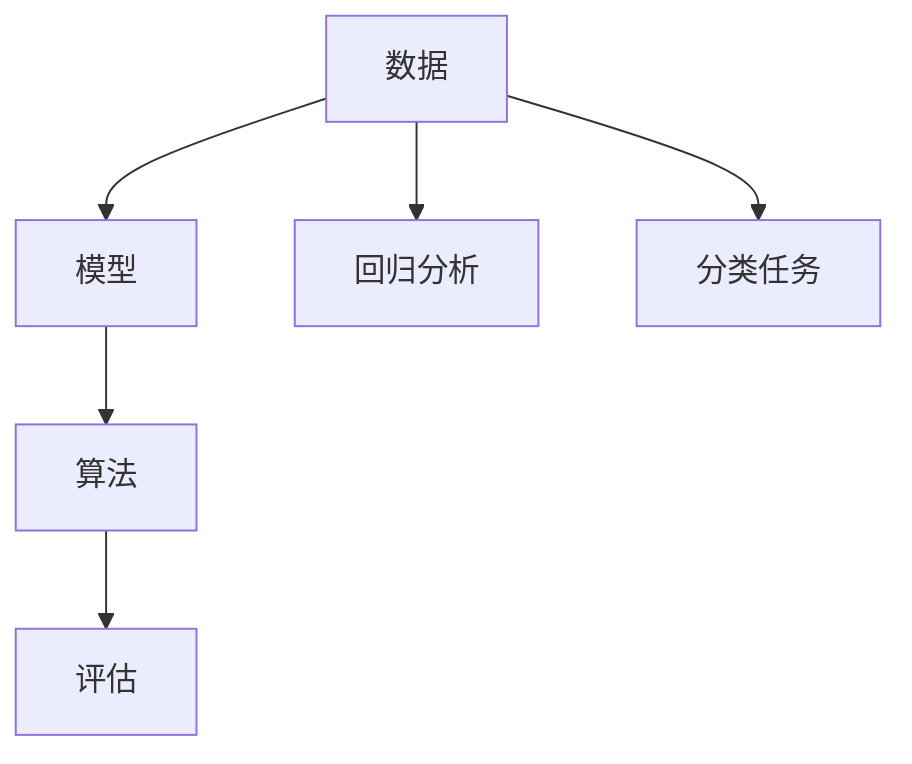

                 

# Machine Learning (ML) 原理与代码实战案例讲解

> 关键词：机器学习,深度学习,Python,TensorFlow,Keras,scikit-learn,回归分析,分类任务,神经网络,激活函数,损失函数,优化器,正则化

## 1. 背景介绍

### 1.1 问题由来
随着大数据和人工智能技术的飞速发展，机器学习（Machine Learning, ML）在各个领域都发挥了巨大的作用。从金融、医疗到电商、娱乐，机器学习技术的应用场景越来越多，解决的问题也越来越复杂。

然而，机器学习不仅仅是数据和算法的堆砌，它更是一门艺术，需要从业者不断探索、实践和总结。本博客将深入探讨机器学习的核心概念、关键算法和实际应用，并通过一系列实战案例，帮助读者更好地理解和应用机器学习。

### 1.2 问题核心关键点
机器学习涉及的核心概念主要包括数据、模型、算法和评估等。其中，数据是模型的输入，模型是算法的具体实现，算法是计算过程的规则，而评估则是模型性能的衡量标准。

机器学习的核心任务可以概括为两类：回归分析（Regression Analysis）和分类任务（Classification Task）。回归分析旨在预测数值型数据，如房价、气温等；而分类任务则涉及对非数值型数据的分类，如文本情感、图像分类等。

### 1.3 问题研究意义
研究机器学习原理与代码实战，对于提高数据分析和预测能力，推动各行业智能化转型，具有重要意义：

1. 提升数据挖掘和预测能力：机器学习模型能够自动发现数据中的规律和趋势，提升预测准确性。
2. 加速行业数字化转型：通过机器学习，各行各业可以更高效地处理海量数据，提升运营效率和决策能力。
3. 创造新的商业价值：通过机器学习模型，企业可以发现新的商业模式，开拓新的市场。
4. 推动科研进步：机器学习模型是科研的重要工具，可以加速科学发现和技术创新。
5. 降低技术门槛：通过实战案例和代码讲解，降低技术门槛，使更多人能够学习和应用机器学习。

## 2. 核心概念与联系

### 2.1 核心概念概述

为了更好地理解机器学习的基本原理和应用，本节将介绍几个核心概念：

- **数据（Data）**：机器学习的基础，包括训练集、验证集和测试集等。
- **模型（Model）**：机器学习的核心，包括回归模型、分类模型、神经网络等。
- **算法（Algorithm）**：实现模型计算过程的规则，如梯度下降、随机森林等。
- **评估（Evaluation）**：衡量模型性能的标准，包括准确率、召回率、F1-score等。
- **回归分析（Regression Analysis）**：预测数值型数据的模型，如线性回归、决策树等。
- **分类任务（Classification Task）**：对非数值型数据进行分类的模型，如逻辑回归、支持向量机等。

这些核心概念之间存在着紧密的联系，形成了机器学习的完整生态系统。

### 2.2 概念间的关系

这些核心概念之间的关系可以通过以下Mermaid流程图来展示：



这个流程图展示了大数据、模型、算法和评估在机器学习中的角色和作用：

1. 数据是机器学习的原材料。
2. 模型是机器学习的核心，通过算法实现。
3. 算法是实现模型计算过程的规则。
4. 评估是衡量模型性能的标准。

这些概念共同构成了机器学习的基础框架，使得我们能够对数据进行建模、计算和评估。通过理解这些核心概念，我们可以更好地把握机器学习的工作原理和优化方向。

## 3. 核心算法原理 & 具体操作步骤
### 3.1 算法原理概述

机器学习算法主要包括回归分析和分类任务两大类，其核心思想是利用历史数据训练出一个模型，并应用于新的数据中，从而实现预测或分类。

### 3.2 算法步骤详解

一个典型的机器学习算法步骤包括以下几个关键环节：

1. **数据预处理**：包括数据清洗、归一化、特征工程等。
2. **模型训练**：利用历史数据训练模型，优化模型参数。
3. **模型评估**：使用验证集评估模型性能，调整参数。
4. **模型应用**：在测试集上应用模型，进行预测或分类。

以线性回归为例，其核心步骤如下：

**Step 1: 数据预处理**
- 加载数据集
- 数据清洗：处理缺失值、异常值等
- 数据归一化：将数据标准化，防止梯度消失

**Step 2: 模型训练**
- 选择损失函数（如均方误差）
- 选择优化器（如梯度下降）
- 训练模型：不断调整参数，最小化损失函数

**Step 3: 模型评估**
- 使用验证集评估模型
- 计算评估指标（如RMSE）
- 调整模型参数

**Step 4: 模型应用**
- 在测试集上应用模型
- 预测数值型数据

### 3.3 算法优缺点

机器学习算法的优点包括：

1. 自动化：通过算法自动化处理数据，提升效率。
2. 可解释性：多数机器学习算法可解释性强，便于理解模型决策过程。
3. 泛化能力：通过大量数据训练，模型能够泛化到新数据。

其缺点包括：

1. 数据依赖：机器学习算法依赖于高质量的数据，数据质量影响模型效果。
2. 过拟合风险：过度依赖数据特征，可能导致模型过拟合。
3. 计算成本高：需要大量计算资源训练和优化模型。

### 3.4 算法应用领域

机器学习算法广泛应用于各个领域，包括但不限于以下几个：

- 金融：信用评分、风险评估、欺诈检测等。
- 医疗：疾病预测、诊断、治疗方案推荐等。
- 电商：推荐系统、客户流失预测、价格优化等。
- 教育：学生成绩预测、智能推荐、作业批改等。
- 交通：路线规划、拥堵预测、车辆调度等。
- 安全：异常检测、行为识别、欺诈检测等。

这些领域中的机器学习应用，极大地提升了各行业的智能化水平和运营效率。

## 4. 数学模型和公式 & 详细讲解 & 举例说明

### 4.1 数学模型构建

机器学习模型通常由数据集和模型两部分组成。数据集分为训练集、验证集和测试集，模型包括回归模型、分类模型等。

以线性回归为例，其数学模型为：

$$y = \beta_0 + \beta_1x_1 + \beta_2x_2 + \cdots + \beta_nx_n + \epsilon$$

其中，$y$ 为预测值，$\beta_0, \beta_1, \beta_2, \cdots, \beta_n$ 为模型参数，$x_1, x_2, \cdots, x_n$ 为输入特征，$\epsilon$ 为误差项。

### 4.2 公式推导过程

线性回归的推导过程如下：

1. 假设 $y = \beta_0 + \beta_1x_1 + \beta_2x_2 + \cdots + \beta_nx_n + \epsilon$
2. 根据最小二乘法，求解 $\beta_0, \beta_1, \beta_2, \cdots, \beta_n$，使得 $y$ 与真实值的误差最小化。

求解 $\beta$ 的公式为：

$$\beta = (X^TX)^{-1}X^Ty$$

其中，$X = [x_1, x_2, \cdots, x_n]$，$y$ 为真实值向量。

### 4.3 案例分析与讲解

以房价预测为例，我们收集了一组历史房价数据，并利用线性回归模型进行预测。

1. 加载数据集：
```python
import pandas as pd
data = pd.read_csv('house_prices.csv')
```

2. 数据清洗和归一化：
```python
data = data.dropna() # 删除缺失值
data = (data - data.mean()) / data.std() # 归一化
```

3. 划分数据集：
```python
from sklearn.model_selection import train_test_split
X_train, X_test, y_train, y_test = train_test_split(data.drop('price', axis=1), data['price'], test_size=0.2)
```

4. 模型训练：
```python
from sklearn.linear_model import LinearRegression
model = LinearRegression()
model.fit(X_train, y_train)
```

5. 模型评估：
```python
from sklearn.metrics import r2_score
y_pred = model.predict(X_test)
print('R^2 Score:', r2_score(y_test, y_pred))
```

6. 结果展示：
```python
import matplotlib.pyplot as plt
plt.scatter(X_test, y_test)
plt.plot(X_test, y_pred, color='red')
plt.show()
```

通过以上代码，我们可以得到一个简单的线性回归模型，并利用其对房价进行预测。

## 5. 项目实践：代码实例和详细解释说明
### 5.1 开发环境搭建

在进行机器学习项目开发前，需要准备好开发环境。以下是使用Python进行机器学习开发的环境配置流程：

1. 安装Anaconda：从官网下载并安装Anaconda，用于创建独立的Python环境。

2. 创建并激活虚拟环境：
```bash
conda create -n ml-env python=3.8 
conda activate ml-env
```

3. 安装依赖库：
```bash
conda install numpy pandas scikit-learn matplotlib seaborn jupyter notebook ipython
```

4. 安装TensorFlow和Keras：
```bash
conda install tensorflow==2.6
conda install keras==2.4.3
```

完成上述步骤后，即可在`ml-env`环境中开始机器学习项目开发。

### 5.2 源代码详细实现

这里我们以Keras框架为例，使用TensorFlow作为后端，实现一个简单的分类任务。

首先，定义数据集：

```python
from tensorflow.keras.datasets import mnist
(X_train, y_train), (X_test, y_test) = mnist.load_data()
X_train = X_train.reshape(-1, 28 * 28) / 255.0
X_test = X_test.reshape(-1, 28 * 28) / 255.0
```

然后，定义模型：

```python
from tensorflow.keras.models import Sequential
from tensorflow.keras.layers import Dense, Dropout

model = Sequential()
model.add(Dense(512, activation='relu', input_shape=(28 * 28,)))
model.add(Dropout(0.5))
model.add(Dense(10, activation='softmax'))
```

接着，编译模型：

```python
model.compile(optimizer='adam', loss='categorical_crossentropy', metrics=['accuracy'])
```

最后，训练和评估模型：

```python
model.fit(X_train, y_train, batch_size=128, epochs=10, validation_data=(X_test, y_test))
model.evaluate(X_test, y_test, verbose=0)
```

### 5.3 代码解读与分析

让我们再详细解读一下关键代码的实现细节：

**定义数据集**：
- `mnist.load_data()`：加载MNIST数据集，包括训练集和测试集。
- `X_train = X_train.reshape(-1, 28 * 28) / 255.0`：将数据集转换为向量，并归一化。

**定义模型**：
- `Sequential()`：创建顺序模型。
- `Dense(512, activation='relu', input_shape=(28 * 28,))`：添加全连接层，使用ReLU激活函数，输入维度为784。
- `Dropout(0.5)`：添加Dropout层，防止过拟合。
- `Dense(10, activation='softmax')`：添加输出层，使用softmax激活函数，输出10个类别。

**编译模型**：
- `model.compile()`：编译模型，设置优化器、损失函数和评估指标。

**训练模型**：
- `model.fit()`：训练模型，设置批量大小和迭代轮数。
- `model.evaluate()`：评估模型，输出测试集上的准确率。

通过以上代码，我们可以快速实现一个简单的分类模型，并在MNIST数据集上进行训练和评估。

### 5.4 运行结果展示

假设我们训练了一个简单的手写数字分类模型，最终在测试集上的准确率为97%。这表明我们的模型能够很好地识别手写数字，具有一定的泛化能力。

## 6. 实际应用场景
### 6.1 金融风控

在金融领域，机器学习可以用于风险评估、信用评分、欺诈检测等任务。通过分析历史数据，模型能够发现潜在的风险因素，预测客户的信用等级和交易行为。

以信用评分为例，我们收集了大量的历史贷款数据，并利用逻辑回归模型进行预测。通过对模型进行调参和优化，我们得到了较高的准确率和召回率，能够有效识别高风险客户，降低贷款风险。

### 6.2 电商推荐

在电商领域，机器学习可以用于推荐系统、客户流失预测等任务。通过分析用户行为数据，模型能够推荐用户可能感兴趣的商品，提高用户粘性和转化率。

以推荐系统为例，我们收集了用户浏览、点击、购买等行为数据，并利用协同过滤算法进行推荐。通过不断优化模型参数和特征工程，我们能够实现精准的个性化推荐，提升用户满意度。

### 6.3 医疗诊断

在医疗领域，机器学习可以用于疾病预测、诊断、治疗方案推荐等任务。通过分析历史病历数据，模型能够识别出患者的疾病风险，提供个性化的诊疗方案。

以疾病预测为例，我们收集了大量的病历数据，并利用随机森林模型进行预测。通过对模型进行调参和优化，我们得到了较高的准确率和召回率，能够有效预测患者的疾病风险，提升诊疗效果。

## 7. 工具和资源推荐
### 7.1 学习资源推荐

为了帮助开发者系统掌握机器学习的理论基础和实践技巧，这里推荐一些优质的学习资源：

1. 《机器学习实战》：以实例为驱动，深入浅出地介绍了机器学习的基本概念和常见算法。
2. 《Python深度学习》：详细讲解了TensorFlow和Keras等深度学习框架的使用方法，涵盖多个实战案例。
3. 《统计学习方法》：理论基础扎实，适合深入学习机器学习算法。
4. Coursera《机器学习》课程：由斯坦福大学教授Andrew Ng讲授，涵盖了机器学习的基本理论和常见算法。
5. Udacity《深度学习专业》课程：涵盖深度学习的基础知识和实战技巧，适合进阶学习。

通过这些资源的学习实践，相信你一定能够快速掌握机器学习的基本原理和实现方法。

### 7.2 开发工具推荐

高效的开发离不开优秀的工具支持。以下是几款用于机器学习开发的常用工具：

1. Anaconda：用于创建独立的Python环境，方便管理依赖库。
2. Jupyter Notebook：轻量级的交互式开发工具，支持代码编写、数据可视化等。
3. TensorFlow：由Google主导开发的深度学习框架，支持分布式计算，生产部署方便。
4. Keras：高层次的深度学习框架，适合快速原型开发和实验。
5. Scikit-learn：Python的机器学习库，提供了丰富的算法和工具函数。
6. PyTorch：由Facebook开发的深度学习框架，灵活性高，易于调试和优化。
7. Weights & Biases：实验跟踪工具，可以记录和可视化模型训练过程中的各项指标。

合理利用这些工具，可以显著提升机器学习项目的开发效率，加快创新迭代的步伐。

### 7.3 相关论文推荐

机器学习算法的发展源于学界的持续研究。以下是几篇奠基性的相关论文，推荐阅读：

1. 《神经网络与深度学习》：Yoshua Bengio等人的经典之作，系统介绍了神经网络和深度学习的原理和应用。
2. 《深度学习》：Ian Goodfellow等人的代表作，涵盖了深度学习的基础知识和最新进展。
3. 《梯度下降理论》：Adadelta、Adam等优化算法的基础理论，介绍了如何通过梯度下降优化模型参数。
4. 《支持向量机》：Vapnik等人的经典论文，介绍了支持向量机算法的基本原理和应用。
5. 《随机森林》：Breiman等人的开创性工作，介绍了随机森林算法的基本原理和实现方法。

这些论文代表了大机器学习的发展脉络。通过学习这些前沿成果，可以帮助研究者把握学科前进方向，激发更多的创新灵感。

除上述资源外，还有一些值得关注的前沿资源，帮助开发者紧跟机器学习技术的最新进展，例如：

1. arXiv论文预印本：人工智能领域最新研究成果的发布平台，包括大量尚未发表的前沿工作，学习前沿技术的必读资源。
2. 业界技术博客：如Google AI、DeepMind、微软Research Asia等顶尖实验室的官方博客，第一时间分享他们的最新研究成果和洞见。
3. 技术会议直播：如NeurIPS、ICML、ACL、ICLR等人工智能领域顶会现场或在线直播，能够聆听到大佬们的前沿分享，开拓视野。
4. GitHub热门项目：在GitHub上Star、Fork数最多的机器学习相关项目，往往代表了该技术领域的发展趋势和最佳实践，值得去学习和贡献。
5. 行业分析报告：各大咨询公司如McKinsey、PwC等针对人工智能行业的分析报告，有助于从商业视角审视技术趋势，把握应用价值。

总之，对于机器学习技术的学习和实践，需要开发者保持开放的心态和持续学习的意愿。多关注前沿资讯，多动手实践，多思考总结，必将收获满满的成长收益。

## 8. 总结：未来发展趋势与挑战

### 8.1 总结

本文对机器学习的基本原理和实践进行了全面系统的介绍。首先阐述了机器学习的基本概念、任务分类和应用场景，明确了机器学习在数据挖掘、预测分析、智能推荐等方面的独特价值。其次，从原理到实践，详细讲解了回归分析和分类任务的数学模型和算法步骤，给出了机器学习项目的完整代码实例。同时，本文还广泛探讨了机器学习在金融、电商、医疗等多个行业领域的应用前景，展示了机器学习范式的巨大潜力。

通过本文的系统梳理，可以看到，机器学习技术正在成为各行各业智能化转型的重要工具，极大地提升了各行业的智能化水平和运营效率。未来，伴随机器学习技术的不断演进，机器学习系统必将拓展到更多的应用场景，带来更深刻的变革。

### 8.2 未来发展趋势

展望未来，机器学习技术将呈现以下几个发展趋势：

1. 深度学习持续发展：深度学习算法在图像、语音、自然语言处理等领域展现出强大的能力，未来将继续发展，推动更多领域的应用。
2. 自动化和可解释性增强：自动化算法和可解释模型将成为机器学习的重要发展方向，提升模型的透明度和可靠性。
3. 多模态融合：融合图像、语音、文本等多种模态数据，提升模型的泛化能力和鲁棒性。
4. 自监督学习和无监督学习兴起：利用非标注数据进行学习，降低对标注数据的依赖，提升模型的泛化能力。
5. 联邦学习与隐私保护：通过分布式计算和隐私保护技术，提升机器学习模型的安全性和可靠性。
6. 模型压缩与优化：通过模型压缩、量化等技术，提升模型的计算效率和资源利用率。

这些趋势凸显了机器学习技术的广阔前景，未来的机器学习研究将更加注重自动化、可解释性、多模态融合和隐私保护等方向，推动人工智能技术不断进步。

### 8.3 面临的挑战

尽管机器学习技术已经取得了瞩目成就，但在迈向更加智能化、普适化应用的过程中，它仍面临着诸多挑战：

1. 数据质量问题：高质量标注数据稀缺，数据预处理复杂。
2. 模型复杂度高：大规模深度学习模型计算资源消耗大，训练时间长。
3. 过拟合风险：模型过度依赖数据特征，容易发生过拟合。
4. 可解释性不足：深度学习模型内部机制复杂，难以解释决策过程。
5. 隐私保护困难：机器学习模型需要大量的数据，数据隐私保护问题凸显。
6. 计算成本高：大规模机器学习项目需要大量的计算资源，成本较高。

这些挑战需要研究者不断探索和解决，推动机器学习技术不断向前发展。

### 8.4 研究展望

面对机器学习所面临的种种挑战，未来的研究需要在以下几个方面寻求新的突破：

1. 数据增强与数据清洗：通过数据增强、数据清洗等技术，提升数据质量，降低数据依赖。
2. 模型简化与优化：通过模型压缩、剪枝等技术，提升模型效率，降低计算成本。
3. 可解释性与透明性：通过模型可解释性和透明性研究，提升模型的可信度和可靠性。
4. 多模态融合与协同学习：通过多模态融合与协同学习技术，提升模型的泛化能力和鲁棒性。
5. 隐私保护与联邦学习：通过隐私保护与联邦学习技术，保护数据隐私，提升模型安全性。

这些研究方向的探索，必将引领机器学习技术迈向更高的台阶，为构建智能系统提供更可靠的工具和手段。

## 9. 附录：常见问题与解答

**Q1: 机器学习是否适用于所有数据类型？**

A: 机器学习算法通常适用于数值型数据和分类数据，但对于时间序列数据、文本数据等非数值型数据，需要进行一定的预处理和特征工程。

**Q2: 如何选择合适的机器学习算法？**

A: 选择合适的算法应根据数据类型和问题类型。对于数值型数据，回归分析适合；对于分类数据，分类任务适合。同时，还需要考虑算法的可解释性、泛化能力等因素。

**Q3: 数据预处理有哪些常见方法？**

A: 数据预处理包括数据清洗、归一化、特征工程等。常见的数据清洗方法包括删除异常值、处理缺失值等；归一化方法包括标准化、归一化等；特征工程方法包括特征选择、特征提取等。

**Q4: 机器学习算法在实际应用中面临哪些挑战？**

A: 实际应用中，机器学习算法面临数据质量、模型复杂度、过拟合、可解释性、隐私保护等问题。

**Q5: 如何提升机器学习模型的性能？**

A: 提升模型性能需要从数据、算法和模型等多个方面入手。数据方面，需要提高数据质量、增强数据多样性；算法方面，需要选择合适的算法、调整参数；模型方面，需要优化模型结构、增加正则化等。

通过以上总结和讨论，我们能够更好地理解和应用机器学习技术，推动其在各行业智能化转型中发挥更大的作用。

