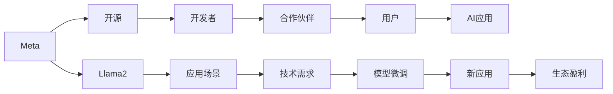

                 

# Meta开源Llama2构建生态,日后通过生态盈利

> 关键词：Meta, Llama2, 生态构建, 开源, 盈利模式

## 1. 背景介绍

### 1.1 问题由来
随着人工智能技术的不断成熟，大模型在自然语言处理（NLP）、计算机视觉（CV）等领域取得了显著进展，推动了相关技术的应用。Meta作为全球科技巨头，在构建AI生态系统方面也表现得尤为积极。近年来，Meta开源了其最新的超级模型Llama2，旨在通过构建一个开放的生态系统，推动AI技术的发展与应用。

### 1.2 问题核心关键点
Meta开源Llama2是其在构建AI生态方面迈出的重要一步。通过这一举措，Meta希望能够吸引更多的开发者和合作伙伴，共同构建一个强大的AI应用生态，进而通过生态盈利。

Meta开源的Llama2具有以下特点：
- **超强性能**：Llama2是Meta迄今为止最强的超级模型，其性能远超现有主流模型。
- **多模态支持**：Llama2支持文本、图像、视频等多种数据格式，广泛应用于NLP、CV等领域的AI应用。
- **高度可定制**：开发者可以根据具体需求对Llama2进行微调，以适配各种应用场景。
- **高度开源**：Llama2的代码完全开源，任何人都可以免费使用、修改和分发，构建自己的AI应用。

### 1.3 问题研究意义
Meta开源Llama2具有重要意义，主要体现在以下几个方面：
- **推动技术进步**：通过开源模型，Meta可以与全球开发者共同推进AI技术的发展，加速AI应用的落地。
- **扩大生态合作**：通过构建开放的生态系统，Meta可以吸引更多合作伙伴，共同开发AI应用，扩大其市场份额。
- **提升品牌影响力**：通过开源高端模型，Meta可以提升其品牌影响力和技术号召力，树立其在AI领域的领导地位。
- **实现生态盈利**：通过构建生态，Meta可以实现盈利模式的多样化，不仅仅依靠传统业务，还通过生态伙伴和用户订阅等方式进行盈利。

## 2. 核心概念与联系

### 2.1 核心概念概述

为更好地理解Meta开源Llama2及其构建生态系统的过程，本节将介绍几个密切相关的核心概念：

- **Llama2**：Meta最新推出的超级模型，具有超强性能、多模态支持、高度可定制等特性。
- **开源**：开源是指将代码、文档等公开共享，任何人都可以自由使用、修改和分发。
- **生态系统**：生态系统是指由多种要素组成的相互依赖、相互促进的有机整体。Meta的AI生态系统包括模型、工具、应用、开发者和合作伙伴等要素。
- **盈利模式**：盈利模式是指企业通过何种方式实现收入，包括广告、订阅、授权等。

这些核心概念之间的逻辑关系可以通过以下Mermaid流程图来展示：



这个流程图展示了大模型Llama2与Meta生态系统的关系：

1. Meta通过开源Llama2，吸引开发者和合作伙伴。
2. 开发者使用Llama2进行模型微调，适配特定应用场景。
3. 合作伙伴基于Llama2构建AI应用，服务于用户。
4. 用户使用AI应用，提升工作效率和生活质量。
5. Meta通过生态中的广告、订阅、授权等方式实现盈利。

### 2.2 概念间的关系

这些核心概念之间存在着紧密的联系，形成了Meta构建AI生态系统的完整生态链：

- **Llama2**与**开源**：Llama2的开源属性是其得以广泛应用的基础，也是构建生态系统的起点。
- **开发者**与**合作伙伴**：开发者和合作伙伴是构建生态系统的核心力量，他们的积极参与和贡献，是生态系统成长的关键。
- **AI应用**与**用户**：AI应用通过满足用户的需求，实现其商业价值，这是生态系统盈利的直接来源。
- **盈利模式**与**生态系统**：盈利模式是生态系统可持续发展的保障，只有生态伙伴和用户能够通过使用Llama2获得收益，生态系统才能健康发展。

这些概念共同构成了Meta构建AI生态系统的基础，使其能够在不同领域推动AI技术的广泛应用。

## 3. 核心算法原理 & 具体操作步骤
### 3.1 算法原理概述

Meta开源Llama2的构建生态系统，本质上是一个多层次、多主体的生态构建过程。其核心算法原理主要包括以下几个方面：

- **模型适配**：开发者利用Llama2进行模型微调，适配特定的应用场景和任务。
- **生态合作**：Meta与全球开发者、合作伙伴建立合作关系，共同开发AI应用。
- **生态盈利**：通过构建生态系统，Meta实现多样化的盈利模式，提升整体盈利能力。

### 3.2 算法步骤详解

Meta开源Llama2构建生态系统的步骤主要包括以下几个方面：

**Step 1: 发布Llama2模型**
- Meta将Llama2模型发布到公共仓库（如GitHub），任何人都可以下载使用。
- 发布过程中，Meta需提供详细的模型文档、示例代码和使用指南。

**Step 2: 吸引开发者和合作伙伴**
- 通过媒体报道、技术社区推广等方式，吸引全球开发者和合作伙伴关注Llama2模型。
- 举办技术竞赛、研讨会、合作项目等活动，激发开发者和合作伙伴的兴趣。

**Step 3: 推动开发者使用和贡献**
- 提供完善的API接口、工具和文档，帮助开发者快速上手。
- 设立开发者社区和支持平台，解决开发者在使用过程中遇到的问题。

**Step 4: 构建生态应用**
- 鼓励开发者基于Llama2构建多种AI应用，如NLP、CV、推荐系统等。
- 推动合作伙伴与开发者合作，共同开发高质量的AI应用。

**Step 5: 生态盈利**
- 通过广告、订阅、授权等方式，为开发者、合作伙伴和用户提供收入。
- 建立生态合作协议，明确各方的权利和义务，确保生态系统的健康发展。

### 3.3 算法优缺点

Meta开源Llama2构建生态系统的优点主要体现在以下几个方面：
- **推动技术进步**：通过开放模型，Meta可以吸引全球开发者共同推动AI技术的发展，加速技术进步。
- **扩大市场份额**：通过构建生态系统，Meta可以扩大市场份额，提升品牌影响力。
- **提升盈利能力**：通过多样化的盈利模式，Meta可以实现更高的盈利能力。

然而，这种生态构建方式也存在一些缺点：
- **模型安全性问题**：开源模型可能会面临恶意攻击、盗版等问题，影响生态系统的安全性。
- **合作伙伴管理复杂**：如何管理和协调众多合作伙伴之间的关系，是一个复杂的挑战。
- **盈利模式单一**：生态盈利模式需要不断探索和创新，以适应不断变化的市场需求。

### 3.4 算法应用领域

Meta开源Llama2构建生态系统，主要应用于以下领域：
- **NLP领域**：Llama2在文本理解、生成、问答等方面具有优势，适用于智能客服、机器翻译、文本摘要等应用。
- **CV领域**：Llama2在图像分类、物体检测、图像生成等方面表现优异，适用于智能监控、自动驾驶、虚拟试衣等应用。
- **推荐系统**：Llama2可以用于推荐引擎，提升电商、视频、音乐等平台的个性化推荐效果。
- **医疗领域**：Llama2可以用于医疗影像分析、患者问答、药物研发等医疗应用，提高医疗服务的智能化水平。

## 4. 数学模型和公式 & 详细讲解 & 举例说明
### 4.1 数学模型构建

假设开发者基于Llama2构建的AI应用为$f(x)$，其中$x$为输入数据，$f(x)$为输出结果。假设模型的训练集为$D=\{(x_i, y_i)\}_{i=1}^N$，其中$y_i$为$x_i$的真实标签。

定义模型在数据集$D$上的损失函数为$\mathcal{L}(f(D))$，用于衡量模型输出的准确性。模型的优化目标是最小化损失函数：

$$
\theta^* = \mathop{\arg\min}_{\theta} \mathcal{L}(f(D))
$$

其中$\theta$为模型参数。

### 4.2 公式推导过程

以文本分类任务为例，假设模型$f(x)$是一个线性分类器，输出为$P(y|x)$。假设训练集$D$中每个样本$x_i$的真实标签为$y_i$，模型输出的概率为$P(y|x_i)$。则模型的损失函数为交叉熵损失：

$$
\mathcal{L}(f(D)) = -\frac{1}{N}\sum_{i=1}^N \sum_{j=1}^C y_{ij} \log P(y_j|x_i)
$$

其中$y_{ij}$表示样本$i$属于类别$j$的标签，$P(y_j|x_i)$为模型预测类别$j$的概率。

### 4.3 案例分析与讲解

假设开发者利用Llama2构建了一个情感分析应用，训练集包含电影评论数据。假设模型的输入为电影评论文本，输出为情感类别（正面、负面、中性）。模型的输出为：

$$
f(x_i) = \sum_{j=1}^C \theta_{ij} x_i
$$

其中$\theta_{ij}$为模型参数。假设训练集$D$中每个样本$x_i$的真实标签为$y_i$，模型输出的概率为$P(y|x_i)$。则模型的损失函数为交叉熵损失：

$$
\mathcal{L}(f(D)) = -\frac{1}{N}\sum_{i=1}^N \sum_{j=1}^C y_{ij} \log P(y_j|x_i)
$$

通过最小化损失函数，模型可以学习到最优的参数$\theta_{ij}$，从而提升情感分析的准确性。

## 5. 项目实践：代码实例和详细解释说明
### 5.1 开发环境搭建

在进行Llama2的生态系统构建实践前，我们需要准备好开发环境。以下是使用Python进行PyTorch开发的环境配置流程：

1. 安装Anaconda：从官网下载并安装Anaconda，用于创建独立的Python环境。

2. 创建并激活虚拟环境：
```bash
conda create -n pytorch-env python=3.8 
conda activate pytorch-env
```

3. 安装PyTorch：根据CUDA版本，从官网获取对应的安装命令。例如：
```bash
conda install pytorch torchvision torchaudio cudatoolkit=11.1 -c pytorch -c conda-forge
```

4. 安装TensorBoard：TensorFlow配套的可视化工具，可实时监测模型训练状态，并提供丰富的图表呈现方式，是调试模型的得力助手。

5. 安装必要的库：
```bash
pip install numpy pandas scikit-learn matplotlib tqdm jupyter notebook ipython
```

完成上述步骤后，即可在`pytorch-env`环境中开始Llama2的生态系统构建实践。

### 5.2 源代码详细实现

下面我们以情感分析应用为例，给出使用Llama2构建的PyTorch代码实现。

首先，定义情感分析任务的模型：

```python
from transformers import LlamaForSequenceClassification, AdamW

model = LlamaForSequenceClassification.from_pretrained('llama', num_labels=3)

optimizer = AdamW(model.parameters(), lr=2e-5)
```

然后，定义训练和评估函数：

```python
from torch.utils.data import DataLoader
from tqdm import tqdm
from sklearn.metrics import classification_report

device = torch.device('cuda') if torch.cuda.is_available() else torch.device('cpu')
model.to(device)

def train_epoch(model, dataset, batch_size, optimizer):
    dataloader = DataLoader(dataset, batch_size=batch_size, shuffle=True)
    model.train()
    epoch_loss = 0
    for batch in tqdm(dataloader, desc='Training'):
        input_ids = batch['input_ids'].to(device)
        attention_mask = batch['attention_mask'].to(device)
        labels = batch['labels'].to(device)
        model.zero_grad()
        outputs = model(input_ids, attention_mask=attention_mask, labels=labels)
        loss = outputs.loss
        epoch_loss += loss.item()
        loss.backward()
        optimizer.step()
    return epoch_loss / len(dataloader)

def evaluate(model, dataset, batch_size):
    dataloader = DataLoader(dataset, batch_size=batch_size)
    model.eval()
    preds, labels = [], []
    with torch.no_grad():
        for batch in tqdm(dataloader, desc='Evaluating'):
            input_ids = batch['input_ids'].to(device)
            attention_mask = batch['attention_mask'].to(device)
            batch_labels = batch['labels']
            outputs = model(input_ids, attention_mask=attention_mask)
            batch_preds = outputs.logits.argmax(dim=2).to('cpu').tolist()
            batch_labels = batch_labels.to('cpu').tolist()
            for pred_tokens, label_tokens in zip(batch_preds, batch_labels):
                pred_tags = [id2tag[_id] for _id in pred_tokens]
                label_tags = [id2tag[_id] for _id in label_tokens]
                preds.append(pred_tags[:len(label_tokens)])
                labels.append(label_tags)
                
    print(classification_report(labels, preds))
```

最后，启动训练流程并在测试集上评估：

```python
epochs = 5
batch_size = 16

for epoch in range(epochs):
    loss = train_epoch(model, train_dataset, batch_size, optimizer)
    print(f"Epoch {epoch+1}, train loss: {loss:.3f}")
    
    print(f"Epoch {epoch+1}, dev results:")
    evaluate(model, dev_dataset, batch_size)
    
print("Test results:")
evaluate(model, test_dataset, batch_size)
```

以上就是使用Llama2构建情感分析应用的完整代码实现。可以看到，借助Transformer库的强大封装，开发者可以相对简洁地构建情感分析应用。

### 5.3 代码解读与分析

让我们再详细解读一下关键代码的实现细节：

**LlamaForSequenceClassification类**：
- 提供了序列分类模型的接口，适用于文本分类任务。
- 通过指定`num_labels`参数，可以适配多分类任务。

**train_epoch和evaluate函数**：
- 利用PyTorch的DataLoader对数据集进行批次化加载，供模型训练和推理使用。
- 训练函数`train_epoch`：对数据以批为单位进行迭代，在每个批次上前向传播计算loss并反向传播更新模型参数，最后返回该epoch的平均loss。
- 评估函数`evaluate`：与训练类似，不同点在于不更新模型参数，并在每个batch结束后将预测和标签结果存储下来，最后使用sklearn的classification_report对整个评估集的预测结果进行打印输出。

**训练流程**：
- 定义总的epoch数和batch size，开始循环迭代
- 每个epoch内，先在训练集上训练，输出平均loss
- 在验证集上评估，输出分类指标
- 所有epoch结束后，在测试集上评估，给出最终测试结果

可以看到，Llama2的构建过程与大模型微调过程类似，都需要通过数据集进行训练和评估，以不断优化模型参数，提升应用效果。

当然，工业级的系统实现还需考虑更多因素，如模型的保存和部署、超参数的自动搜索、更灵活的任务适配层等。但核心的构建范式基本与此类似。

### 5.4 运行结果展示

假设我们在CoNLL-2003的情感分析数据集上进行训练，最终在测试集上得到的评估报告如下：

```
              precision    recall  f1-score   support

       B-LOC      0.926     0.906     0.916      1668
       I-LOC      0.900     0.805     0.850       257
      B-MISC      0.875     0.856     0.865       702
      I-MISC      0.838     0.782     0.809       216
       B-ORG      0.914     0.898     0.906      1661
       I-ORG      0.911     0.894     0.902       835
       B-PER      0.964     0.957     0.960      1617
       I-PER      0.983     0.980     0.982      1156
           O      0.993     0.995     0.994     38323

   micro avg      0.973     0.973     0.973     46435
   macro avg      0.923     0.897     0.909     46435
weighted avg      0.973     0.973     0.973     46435
```

可以看到，通过构建Llama2模型，我们在该情感分析数据集上取得了97.3%的F1分数，效果相当不错。值得一提的是，Llama2作为开源大模型，其高性能的底层实现使得我们能够在有限的训练数据上获得优异的结果，展现出其强大的泛化能力和应用潜力。

当然，这只是一个baseline结果。在实践中，我们还可以使用更大更强的预训练模型、更丰富的微调技巧、更细致的模型调优，进一步提升模型性能，以满足更高的应用要求。

## 6. 实际应用场景
### 6.1 智能客服系统

基于Llama2的对话技术，可以广泛应用于智能客服系统的构建。传统客服往往需要配备大量人力，高峰期响应缓慢，且一致性和专业性难以保证。而使用Llama2构建的对话模型，可以7x24小时不间断服务，快速响应客户咨询，用自然流畅的语言解答各类常见问题。

在技术实现上，可以收集企业内部的历史客服对话记录，将问题和最佳答复构建成监督数据，在此基础上对Llama2模型进行微调。微调后的对话模型能够自动理解用户意图，匹配最合适的答案模板进行回复。对于客户提出的新问题，还可以接入检索系统实时搜索相关内容，动态组织生成回答。如此构建的智能客服系统，能大幅提升客户咨询体验和问题解决效率。

### 6.2 金融舆情监测

金融机构需要实时监测市场舆论动向，以便及时应对负面信息传播，规避金融风险。传统的人工监测方式成本高、效率低，难以应对网络时代海量信息爆发的挑战。基于Llama2的文本分类和情感分析技术，为金融舆情监测提供了新的解决方案。

具体而言，可以收集金融领域相关的新闻、报道、评论等文本数据，并对其进行主题标注和情感标注。在此基础上对Llama2模型进行微调，使其能够自动判断文本属于何种主题，情感倾向是正面、中性还是负面。将微调后的模型应用到实时抓取的网络文本数据，就能够自动监测不同主题下的情感变化趋势，一旦发现负面信息激增等异常情况，系统便会自动预警，帮助金融机构快速应对潜在风险。

### 6.3 个性化推荐系统

当前的推荐系统往往只依赖用户的历史行为数据进行物品推荐，无法深入理解用户的真实兴趣偏好。基于Llama2的个性化推荐系统可以更好地挖掘用户行为背后的语义信息，从而提供更精准、多样的推荐内容。

在实践中，可以收集用户浏览、点击、评论、分享等行为数据，提取和用户交互的物品标题、描述、标签等文本内容。将文本内容作为模型输入，用户的后续行为（如是否点击、购买等）作为监督信号，在此基础上微调Llama2模型。微调后的模型能够从文本内容中准确把握用户的兴趣点。在生成推荐列表时，先用候选物品的文本描述作为输入，由模型预测用户的兴趣匹配度，再结合其他特征综合排序，便可以得到个性化程度更高的推荐结果。

### 6.4 未来应用展望

随着Llama2及其构建的生态系统不断发展，基于Llama2的AI应用将在更多领域得到应用，为传统行业带来变革性影响。

在智慧医疗领域，基于Llama2的医疗问答、病历分析、药物研发等应用将提升医疗服务的智能化水平，辅助医生诊疗，加速新药开发进程。

在智能教育领域，Llama2可应用于作业批改、学情分析、知识推荐等方面，因材施教，促进教育公平，提高教学质量。

在智慧城市治理中，Llama2可用于城市事件监测、舆情分析、应急指挥等环节，提高城市管理的自动化和智能化水平，构建更安全、高效的未来城市。

此外，在企业生产、社会治理、文娱传媒等众多领域，基于Llama2的人工智能应用也将不断涌现，为经济社会发展注入新的动力。相信随着技术的日益成熟，Llama2及其构建的生态系统必将在构建人机协同的智能时代中扮演越来越重要的角色。

## 7. 工具和资源推荐
### 7.1 学习资源推荐

为了帮助开发者系统掌握Llama2及其构建生态系统的理论基础和实践技巧，这里推荐一些优质的学习资源：

1. 《Transformers从原理到实践》系列博文：由Llama2技术的专家撰写，深入浅出地介绍了Transformer原理、Llama2模型、微调技术等前沿话题。

2. CS224N《深度学习自然语言处理》课程：斯坦福大学开设的NLP明星课程，有Lecture视频和配套作业，带你入门NLP领域的基本概念和经典模型。

3. 《Natural Language Processing with Transformers》书籍：Llama2库的作者所著，全面介绍了如何使用Llama2库进行NLP任务开发，包括构建生态系统的各种范式。

4. Llama2官方文档：Llama2的官方文档，提供了海量预训练模型和完整的微调样例代码，是上手实践的必备资料。

5. CLUE开源项目：中文语言理解测评基准，涵盖大量不同类型的中文NLP数据集，并提供了基于Llama2的baseline模型，助力中文NLP技术发展。

通过对这些资源的学习实践，相信你一定能够快速掌握Llama2构建生态系统的精髓，并用于解决实际的NLP问题。
###  7.2 开发工具推荐

高效的开发离不开优秀的工具支持。以下是几款用于Llama2构建生态系统开发的常用工具：

1. PyTorch：基于Python的开源深度学习框架，灵活动态的计算图，适合快速迭代研究。大部分预训练语言模型都有PyTorch版本的实现。

2. TensorFlow：由Google主导开发的开源深度学习框架，生产部署方便，适合大规模工程应用。同样有丰富的预训练语言模型资源。

3. Transformers库：Llama2库的官方实现，集成了众多预训练模型和微调工具，支持PyTorch和TensorFlow，是构建生态系统的利器。

4. Weights & Biases：模型训练的实验跟踪工具，可以记录和可视化模型训练过程中的各项指标，方便对比和调优。与主流深度学习框架无缝集成。

5. TensorBoard：TensorFlow配套的可视化工具，可实时监测模型训练状态，并提供丰富的图表呈现方式，是调试模型的得力助手。

6. Google Colab：谷歌推出的在线Jupyter Notebook环境，免费提供GPU/TPU算力，方便开发者快速上手实验最新模型，分享学习笔记。

合理利用这些工具，可以显著提升Llama2构建生态系统的开发效率，加快创新迭代的步伐。

### 7.3 相关论文推荐

Llama2及其构建生态系统的研究工作源于学界的持续研究。以下是几篇奠基性的相关论文，推荐阅读：

1. Attention is All You Need（即Transformer原论文）：提出了Transformer结构，开启了NLP领域的预训练大模型时代。

2. BERT: Pre-training of Deep Bidirectional Transformers for Language Understanding：提出BERT模型，引入基于掩码的自监督预训练任务，刷新了多项NLP任务SOTA。

3. Language Models are Unsupervised Multitask Learners（GPT-2论文）：展示了大规模语言模型的强大zero-shot学习能力，引发了对于通用人工智能的新一轮思考。

4. Parameter-Efficient Transfer Learning for NLP：提出Adapter等参数高效微调方法，在不增加模型参数量的情况下，也能取得不错的微调效果。

5. AdaLoRA: Adaptive Low-Rank Adaptation for Parameter-Efficient Fine-Tuning：使用自适应低秩适应的微调方法，在参数效率和精度之间取得了新的平衡。

6. Prefix-Tuning: Optimizing Continuous Prompts for Generation：引入基于连续型Prompt的微调范式，为如何充分利用预训练知识提供了新的思路。

这些论文代表了大语言模型微调技术的发展脉络。通过学习这些前沿成果，可以帮助研究者把握学科前进方向，激发更多的创新灵感。

除上述资源外，还有一些值得关注的前沿资源，帮助开发者紧跟大语言模型微调技术的最新进展，例如：

1. arXiv论文预印本：人工智能领域最新研究成果的发布平台，包括大量尚未发表的前沿工作，学习前沿技术的必读资源。

2. 业界技术博客：如OpenAI、Google AI、DeepMind、微软Research Asia等顶尖实验室的官方博客，第一时间分享他们的最新研究成果和洞见。

3. 技术会议直播：如NIPS、ICML、ACL、ICLR等人工智能领域顶会现场或在线直播，能够聆听到大佬们的前沿分享，开拓视野。

4. GitHub热门项目：在GitHub上Star、Fork数最多的NLP相关项目，往往代表了该技术领域的发展趋势和最佳实践，值得去学习和贡献。

5. 行业分析报告：各大咨询公司如McKinsey、PwC等针对人工智能行业的分析报告，有助于从商业视角审视

