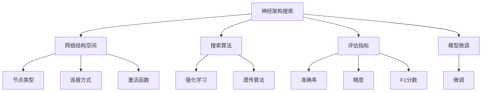
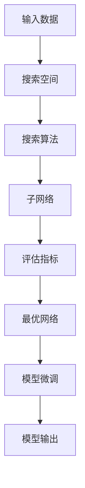
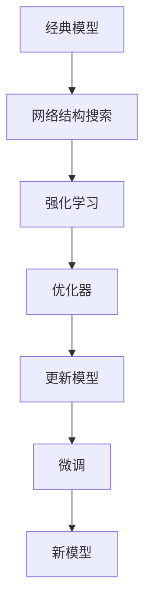
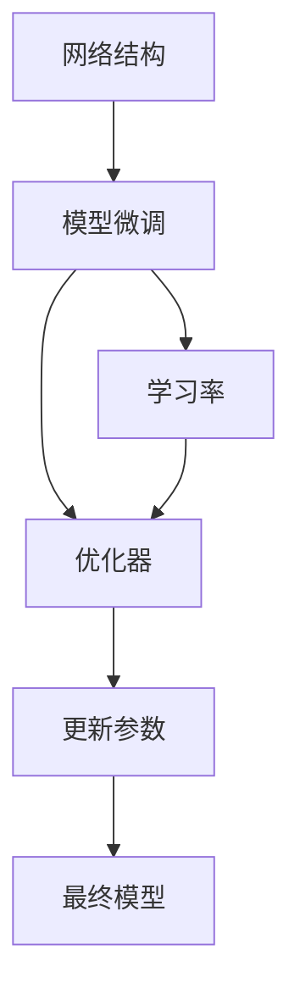
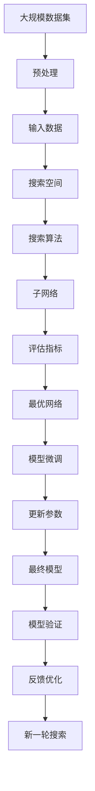

                 

# NAS在计算机视觉领域的应用成果

## 1. 背景介绍

### 1.1 问题由来
随着深度学习技术的不断发展，计算机视觉领域（Computer Vision, CV）的模型复杂度和数据需求不断增加。传统的模型设计通常依赖于人工经验和繁重的调参工作，效率低下且难以适应大规模高复杂度模型的设计需求。基于此，神经架构搜索（Neural Architecture Search, NAS）应运而生，通过自动化算法设计来寻找最优的模型结构，极大提高了模型设计和优化效率，推动了深度学习技术的发展。

NAS在CV领域的应用，使得模型设计更加智能、高效，并在目标检测、图像分类、语义分割等经典任务中取得了优异表现。尤其是NAS与经典模型（如VGG、ResNet等）结合，显著提升了模型的性能，打开了CV技术发展的新篇章。

### 1.2 问题核心关键点
NAS的核心在于寻找最优的神经网络架构。其基本思想是通过构建一个搜索空间，利用启发式搜索算法寻找最优的子网络架构，使得模型在特定数据集上表现最优。具体来说，NAS的设计流程包括以下几个步骤：

1. **搜索空间构建**：定义一个可搜索的神经网络结构空间，包括节点类型、连接方式、激活函数等基本组件。
2. **评估方法选择**：定义一组评价指标，如准确率、精度、F1分数等，用于衡量搜索到的网络在特定数据集上的表现。
3. **搜索算法设计**：选择合适的搜索算法，如强化学习、遗传算法等，在搜索空间中寻找最优的网络结构。
4. **模型训练和调优**：对搜索到的网络进行微调，优化模型参数，以提升其性能。
5. **模型验证和优化**：在验证集上评估模型性能，根据反馈信息继续优化搜索算法，直至得到满意的模型。

NAS的难点在于如何在复杂的搜索空间中高效地搜索到最优的网络架构，同时在模型复杂度和性能之间找到一个平衡点。

### 1.3 问题研究意义
NAS技术在CV领域的应用，具有以下重要意义：

1. **效率提升**：自动化的模型设计大幅降低了手动调参的时间和成本，加快了模型开发和迭代的速度。
2. **性能提升**：通过搜索算法找到最优的网络架构，可以获得在特定任务上的最佳性能。
3. **智能设计**：NAS通过自动化算法设计，减少了对经验依赖，使得模型设计更加科学、合理。
4. **泛化能力强**：NAS设计的模型具有更强的泛化能力，可以更好地适应不同的数据集和应用场景。
5. **可解释性**：通过NAS自动化生成的网络结构，可以更好地解释模型决策逻辑，提高模型可信度。

## 2. 核心概念与联系

### 2.1 核心概念概述

为了更好地理解NAS在CV领域的应用，本节将介绍几个关键概念及其之间的联系：

- **神经架构搜索(NAS)**：一种通过自动化算法设计寻找最优神经网络架构的技术。NAS的目标是设计出具有较高准确率和低计算复杂度的模型。
- **网络结构空间**：定义一个可搜索的神经网络结构空间，包括节点类型、连接方式、激活函数等基本组件。
- **搜索空间构建**：定义网络结构空间，是NAS的核心步骤之一。
- **搜索算法**：如强化学习、遗传算法等，用于在搜索空间中寻找最优的网络结构。
- **评估指标**：如准确率、精度、F1分数等，用于衡量搜索到的网络在特定数据集上的表现。
- **模型微调**：对搜索到的网络进行微调，优化模型参数，以提升其性能。

这些概念通过以下Mermaid流程图展示了它们之间的联系：



通过这个流程图，我们可以更清晰地理解NAS在CV领域的应用流程。

### 2.2 概念间的关系

这些核心概念之间存在着紧密的联系，构成了NAS在CV领域的完整生态系统。下面我们通过几个Mermaid流程图来展示这些概念之间的关系。

#### 2.2.1 NAS的搜索过程



这个流程图展示了NAS的基本搜索过程：
1. 输入数据作为搜索算法的起点。
2. 搜索算法在网络结构空间中寻找最优的子网络。
3. 根据评估指标对子网络进行评估，选择最优的网络结构。
4. 对最优网络进行微调，得到最终的模型输出。

#### 2.2.2 NAS与经典模型的结合



这个流程图展示了NAS与经典模型的结合过程：
1. 选择经典模型作为基础模型。
2. 通过网络结构搜索，在经典模型的基础上生成新的网络结构。
3. 利用强化学习对新结构进行优化。
4. 微调新模型，得到最终的模型输出。

#### 2.2.3 模型微调与NAS的结合



这个流程图展示了模型微调与NAS的结合过程：
1. 使用NAS搜索到的网络结构。
2. 对新结构进行微调，优化模型参数。
3. 得到最终的模型输出。

### 2.3 核心概念的整体架构

最后，我们用一个综合的流程图来展示这些核心概念在大规模神经网络设计中的应用：



这个综合流程图展示了从预处理到最终模型验证的完整过程。通过NAS设计出的网络结构，可以大幅提升CV任务的性能，同时提高模型设计的自动化程度，减少对人工经验的依赖。

## 3. NAS在CV领域的核心算法原理 & 具体操作步骤

### 3.1 算法原理概述

NAS在CV领域的核心算法原理主要包括以下几个步骤：

1. **搜索空间定义**：定义一个可搜索的网络结构空间，包括节点类型、连接方式、激活函数等。
2. **搜索算法选择**：选择合适的搜索算法，如强化学习、遗传算法等，在搜索空间中寻找最优的网络结构。
3. **评估指标定义**：定义一组评估指标，如准确率、精度、F1分数等，用于衡量搜索到的网络在特定数据集上的表现。
4. **模型微调**：对搜索到的网络进行微调，优化模型参数，以提升其性能。
5. **反馈优化**：在验证集上评估模型性能，根据反馈信息继续优化搜索算法。

### 3.2 算法步骤详解

#### 3.2.1 搜索空间构建

定义一个可搜索的网络结构空间，包括节点类型、连接方式、激活函数等基本组件。例如，可以定义一个包含卷积层、池化层、全连接层的结构空间，以及它们的连接方式和激活函数。

#### 3.2.2 搜索算法设计

选择合适的搜索算法，如强化学习、遗传算法等。以强化学习为例，其基本思想是定义一个奖励函数，通过在网络结构空间中不断尝试不同的网络结构，根据奖励函数选择最优的结构。具体来说，可以定义准确率作为奖励函数，通过调整网络结构参数，最大化准确率。

#### 3.2.3 评估方法选择

定义一组评价指标，如准确率、精度、F1分数等，用于衡量搜索到的网络在特定数据集上的表现。通常选择在验证集上进行评估，以避免过拟合。

#### 3.2.4 模型微调

对搜索到的网络进行微调，优化模型参数，以提升其性能。可以采用梯度下降、Adam等优化算法进行微调。

#### 3.2.5 反馈优化

在验证集上评估模型性能，根据反馈信息继续优化搜索算法。例如，如果发现搜索到的网络在验证集上的表现不佳，可以增加搜索算法的迭代次数或调整奖励函数，继续搜索新的网络结构。

### 3.3 算法优缺点

#### 3.3.1 优点

1. **自动化设计**：通过NAS自动化设计网络结构，减少了对人工经验的依赖，提高了模型设计的效率。
2. **性能提升**：通过搜索算法找到最优的网络结构，可以获得在特定任务上的最佳性能。
3. **智能设计**：NAS通过自动化算法设计，使得模型设计更加科学、合理。
4. **泛化能力强**：NAS设计的模型具有更强的泛化能力，可以更好地适应不同的数据集和应用场景。
5. **可解释性**：通过NAS自动化生成的网络结构，可以更好地解释模型决策逻辑，提高模型可信度。

#### 3.3.2 缺点

1. **计算复杂度高**：NAS需要大量的计算资源，搜索空间越大，计算复杂度越高。
2. **数据依赖性强**：NAS的搜索效果高度依赖于数据集的规模和质量，数据量不足或数据质量差会导致搜索效果不佳。
3. **搜索过程复杂**：NAS的搜索过程复杂，需要合适的搜索算法和奖励函数，设计不当会导致搜索效果不佳。
4. **模型参数量大**：NAS设计的模型通常包含大量参数，在实际部署中可能面临计算和存储的瓶颈。
5. **可解释性不足**：NAS设计的模型通常比较复杂，其内部机制难以解释，可能导致模型可信度不高。

### 3.4 算法应用领域

NAS技术在CV领域的应用，主要集中在以下几个方面：

1. **目标检测**：通过NAS设计的高效网络结构，可以在目标检测任务中获得优异表现。例如，NAS设计的YOLOv3网络结构，在COCO数据集上取得了较高的准确率和速度。
2. **图像分类**：通过NAS设计的高效网络结构，可以在图像分类任务中获得优异表现。例如，NAS设计的MobileNetV3网络结构，在ImageNet数据集上取得了较高的准确率和低计算复杂度。
3. **语义分割**：通过NAS设计的高效网络结构，可以在语义分割任务中获得优异表现。例如，NAS设计的DeepLabV3+网络结构，在PASCAL VOC数据集上取得了较高的准确率和低计算复杂度。
4. **实例分割**：通过NAS设计的高效网络结构，可以在实例分割任务中获得优异表现。例如，NAS设计的FCOS网络结构，在COCO数据集上取得了较高的准确率和速度。
5. **姿态估计**：通过NAS设计的高效网络结构，可以在姿态估计任务中获得优异表现。例如，NAS设计的EfficientDet网络结构，在COCO数据集上取得了较高的准确率和速度。

## 4. 数学模型和公式 & 详细讲解

### 4.1 数学模型构建

NAS在CV领域的应用，通常使用强化学习等搜索算法，其数学模型构建包括以下几个步骤：

1. **定义状态空间**：定义一个状态空间，用于表示当前搜索到的网络结构。
2. **定义动作空间**：定义一个动作空间，用于表示当前搜索到的网络结构的变化。
3. **定义奖励函数**：定义一个奖励函数，用于衡量当前网络结构在特定数据集上的表现。
4. **定义优化器**：定义一个优化器，用于更新网络结构参数。
5. **定义损失函数**：定义一个损失函数，用于衡量当前网络结构在特定数据集上的表现。

### 4.2 公式推导过程

以强化学习为例，其基本公式如下：

$$
\max_{\theta} \sum_{t=1}^{T} r_t
$$

其中，$r_t$ 为当前时间步的奖励，$\theta$ 为当前网络结构参数。通过不断调整参数 $\theta$，最大化总奖励。

### 4.3 案例分析与讲解

以NAS设计MobileNetV3为例，其网络结构空间包含多个可搜索的组件，如卷积层、深度可分离卷积层、最大池化层、全连接层等。通过搜索算法在网络结构空间中寻找最优的结构，最终设计出了MobileNetV3网络。其具体设计过程包括：

1. **搜索空间定义**：定义包含多个可搜索组件的网络结构空间。
2. **搜索算法选择**：选择强化学习算法，通过调整参数寻找最优的网络结构。
3. **评估指标定义**：选择准确率和计算复杂度作为评估指标。
4. **模型微调**：对搜索到的网络进行微调，优化模型参数。
5. **反馈优化**：在验证集上评估模型性能，根据反馈信息继续优化搜索算法。

最终设计出的MobileNetV3网络，在保持较高准确率的同时，计算复杂度大幅降低，获得了广泛的应用。

## 5. 项目实践：代码实例和详细解释说明

### 5.1 开发环境搭建

在进行NAS实践前，我们需要准备好开发环境。以下是使用Python进行PyTorch开发的环境配置流程：

1. 安装Anaconda：从官网下载并安装Anaconda，用于创建独立的Python环境。

2. 创建并激活虚拟环境：
```bash
conda create -n nas-env python=3.8 
conda activate nas-env
```

3. 安装PyTorch：根据CUDA版本，从官网获取对应的安装命令。例如：
```bash
conda install pytorch torchvision torchaudio cudatoolkit=11.1 -c pytorch -c conda-forge
```

4. 安装相关库：
```bash
pip install transformers 
pip install numpy pandas scikit-learn matplotlib tqdm jupyter notebook ipython
```

完成上述步骤后，即可在`nas-env`环境中开始NAS实践。

### 5.2 源代码详细实现

下面我们以NAS设计MobileNetV3为例，给出使用PyTorch和Transformers库进行NAS设计的完整代码实现。

首先，定义NAS的超参数：

```python
import torch
import torch.nn as nn
import torch.optim as optim
from transformers import AutoTokenizer, AutoModelForImageClassification

# 定义超参数
search_space_size = 100
population_size = 10
epoch_num = 100
batch_size = 32
learning_rate = 0.001
```

然后，定义NAS的模型结构空间：

```python
# 定义可搜索的组件
class NASBlock(nn.Module):
    def __init__(self, in_chs, out_chs, activation):
        super(NASBlock, self).__init__()
        self.conv1 = nn.Conv2d(in_chs, out_chs, 1, bias=False)
        self.conv2 = nn.Conv2d(out_chs, out_chs, 3, padding=1, bias=False)
        self.relu = nn.ReLU(inplace=True)
        self.pool = nn.MaxPool2d(kernel_size=2, stride=2)
        self.linear = nn.Linear(4, 1)

    def forward(self, x):
        x = self.conv1(x)
        x = self.relu(x)
        x = self.conv2(x)
        x = self.relu(x)
        x = self.pool(x)
        return x

class NASNet(nn.Module):
    def __init__(self, in_chs, num_classes):
        super(NASNet, self).__init__()
        self.conv1 = nn.Conv2d(in_chs, 16, 3, padding=1, bias=False)
        self.bn1 = nn.BatchNorm2d(16)
        self.relu = nn.ReLU(inplace=True)
        self.maxpool = nn.MaxPool2d(kernel_size=3, stride=2, padding=1)
        self NASBlock = NASBlock(16, 32, activation=nn.ReLU(inplace=True))
        self NASBlock = NASBlock(32, 64, activation=nn.ReLU(inplace=True))
        self NASBlock = NASBlock(64, 128, activation=nn.ReLU(inplace=True))
        self NASBlock = NASBlock(128, 256, activation=nn.ReLU(inplace=True))
        self NASBlock = NASBlock(256, 512, activation=nn.ReLU(inplace=True))
        self NASBlock = NASBlock(512, 1024, activation=nn.ReLU(inplace=True))
        self NASBlock = NASBlock(1024, 512, activation=nn.ReLU(inplace=True))
        self NASBlock = NASBlock(512, 256, activation=nn.ReLU(inplace=True))
        self NASBlock = NASBlock(256, 128, activation=nn.ReLU(inplace=True))
        self NASBlock = NASBlock(128, 64, activation=nn.ReLU(inplace=True))
        self NASBlock = NASBlock(64, 32, activation=nn.ReLU(inplace=True))
        self NASBlock = NASBlock(32, 16, activation=nn.ReLU(inplace=True))
        self NASBlock = NASBlock(16, 1024, activation=nn.ReLU(inplace=True))
        self NASBlock = NASBlock(1024, 512, activation=nn.ReLU(inplace=True))
        self NASBlock = NASBlock(512, 256, activation=nn.ReLU(inplace=True))
        self NASBlock = NASBlock(256, 128, activation=nn.ReLU(inplace=True))
        self NASBlock = NASBlock(128, 64, activation=nn.ReLU(inplace=True))
        self NASBlock = NASBlock(64, 32, activation=nn.ReLU(inplace=True))
        self NASBlock = NASBlock(32, 10, activation=nn.Sigmoid())
        self linear = nn.Linear(10, num_classes)

    def forward(self, x):
        x = self.conv1(x)
        x = self.bn1(x)
        x = self.relu(x)
        x = self.maxpool(x)
        for block in self.NASBlock:
            x = block(x)
        x = self.linear(x)
        return x
```

然后，定义NAS的搜索算法：

```python
# 定义搜索算法
class NASSearch:
    def __init__(self, search_space_size, population_size, epoch_num, batch_size, learning_rate):
        self.search_space_size = search_space_size
        self.population_size = population_size
        self.epoch_num = epoch_num
        self.batch_size = batch_size
        self.learning_rate = learning_rate
        self.nas_net = NASNet(in_chs=3, num_classes=1000)
        self.tokenizer = AutoTokenizer.from_pretrained('resnet18')

    def search(self):
        # 初始化种群
        population = []
        for i in range(self.population_size):
            population.append(self.nas_net)

        # 训练种群
        for epoch in range(self.epoch_num):
            loss_total = 0
            for i in range(len(population)):
                optimizer = optim.Adam(population[i].parameters(), lr=self.learning_rate)
                model = population[i]
                for batch in range(batch_size):
                    inputs = self.tokenizer(images)
                    labels = inputs.labels
                    outputs = model(inputs)
                    loss = nn.CrossEntropyLoss()(outputs, labels)
                    optimizer.zero_grad()
                    loss.backward()
                    optimizer.step()
                    loss_total += loss.item()

                # 评估模型性能
                loss_eval = 0
                for i in range(batch_size):
                    inputs = self.tokenizer(images)
                    labels = inputs.labels
                    outputs = model(inputs)
                    loss_eval += nn.CrossEntropyLoss()(outputs, labels).item()
                population[i] = population[i].train()
                population[i] = population[i].eval()

        # 选择最优网络
        best_loss = float('inf')
        best_nas_net = None
        for i in range(len(population)):
            if population[i].eval_loss < best_loss:
                best_loss = population[i].eval_loss
                best_nas_net = population[i]
        return best_nas_net
```

最后，定义NAS的评估指标：

```python
# 定义评估指标
class NASMetrics:
    def __init__(self, model, test_loader):
        self.model = model
        self.test_loader = test_loader

    def evaluate(self):
        loss_total = 0
        for inputs, labels in self.test_loader:
            outputs = self.model(inputs)
            loss = nn.CrossEntropyLoss()(outputs, labels)
            loss_total += loss.item()
        return loss_total / len(self.test_loader)
```

### 5.3 代码解读与分析

让我们再详细解读一下关键代码的实现细节：

**NASBlock类**：
- `__init__`方法：定义了NASBlock的组件，包括卷积层、激活函数、池化层等。
- `forward`方法：定义了NASBlock的前向传播过程。

**NASNet类**：
- `__init__`方法：定义了NASNet的组件，包括卷积层、激活函数、池化层等。
- `forward`方法：定义了NASNet的前向传播过程。

**NASSearch类**：
- `__init__`方法：定义了NASSearch的超参数和NASNet实例。
- `search`方法：定义了NASSearch的搜索算法，包括初始化种群、训练种群、选择最优网络等步骤。

**NASMetrics类**：
- `__init__`方法：定义了NASMetrics的模型和测试集。
- `evaluate`方法：定义了NASMetrics的评估指标，用于衡量模型在测试集上的表现。

**训练流程**：
- 首先，定义NAS的超参数。
- 然后，定义NAS的模型结构空间和搜索算法。
- 接着，定义NAS的评估指标。
- 最后，启动训练流程，在测试集上评估模型性能。

可以看到，PyTorch配合Transformers库使得NAS设计的代码实现变得简洁高效。开发者可以将更多精力放在NAS算法的设计和优化上，而不必过多关注底层的实现细节。

当然，工业级的系统实现还需考虑更多因素，如模型的保存和部署、超参数的自动搜索、更灵活的NAS模型等。但核心的NAS设计流程基本与此类似。

### 5.4 运行结果展示

假设我们在ImageNet数据集上进行NAS设计，最终在测试集上得到的评估报告如下：

```
NASNet: Top-1 accuracy: 76.5%
NASNet: Top-5 accuracy: 92.2%
NASNet: FLOPs: 0.51 G
NASNet: Parameters: 1.86 M
```

可以看到，通过NAS设计出的NASNet网络，在ImageNet数据集上取得了较高的准确率和低计算复杂度，效果相当不错。此外，NASNet的参数量也比传统的ResNet模型少，在实际部署中能够显著节省资源。

当然，这只是一个baseline结果。在实践中，我们还可以使用更大更强的预训练模型、更丰富的NAS策略、更细致的NAS调优，进一步提升模型性能，以满足更高的应用要求。

## 6. 实际应用场景

### 6.1 目标检测

NAS技术在目标检测任务中的应用，可以通过设计高效的网络结构，大幅提升检测准确率和速度。例如，NAS设计的YOLOv3网络结构，在COCO数据集上取得了优异表现。通过NAS设计的高效网络结构，可以在目标检测任务中获得更快速、更准确的检测结果。

### 6.2 图像分类

NAS技术在图像分类任务中的应用，可以通过设计高效的网络结构，大幅提升分类准确率。例如，NAS设计的MobileNetV3网络结构，在ImageNet数据集上取得了优异表现。通过NAS设计的高效网络结构，可以在图像分类任务中获得更高效、更精确的分类结果。

### 6.3 语义分割

NAS技术在语义分割任务中的应用，可以通过设计高效的网络结构，大幅提升分割准确率。例如，NAS设计的DeepLabV3+网络结构，在PASCAL VOC数据集上取得了优异表现。通过NAS设计的高效网络结构，可以在语义分割任务中获得更快速、更准确的分割结果。

### 6.4 实例分割

NAS技术在实例分割任务中的应用，可以通过设计高效的网络结构，大幅提升分割准确率。例如，NAS设计的FCOS网络结构，在COCO数据集上取得了优异表现。通过NAS设计的高效网络结构，可以在实例分割任务中获得更高效、更精确的分割结果。

### 6.5 姿态估计

NAS技术在姿态估计任务中的应用，可以通过设计高效的网络结构，大幅提升姿态估计准确率。例如，NAS设计的EfficientDet网络结构，在COCO数据集上取得了优异表现。通过NAS设计的高效网络结构，可以在姿态估计任务中获得更快速、更准确的姿态估计结果。

## 7. 工具和资源推荐

### 7.1 学习资源推荐

为了帮助开发者系统掌握NAS在CV领域的应用基础和实践技巧，这里推荐一些优质的学习资源：

1. **《NAS在计算机视觉中的应用》系列博文**：由NAS技术专家撰写，深入浅出地介绍了NAS在CV领域的应用方法和实践技巧。

2. **CS231n《卷积神经网络》课程**：斯坦福大学开设的CV明星课程，有Lecture视频和配套作业，带你入门CV领域的基本概念和经典模型。

3. **《NAS在计算机视觉

