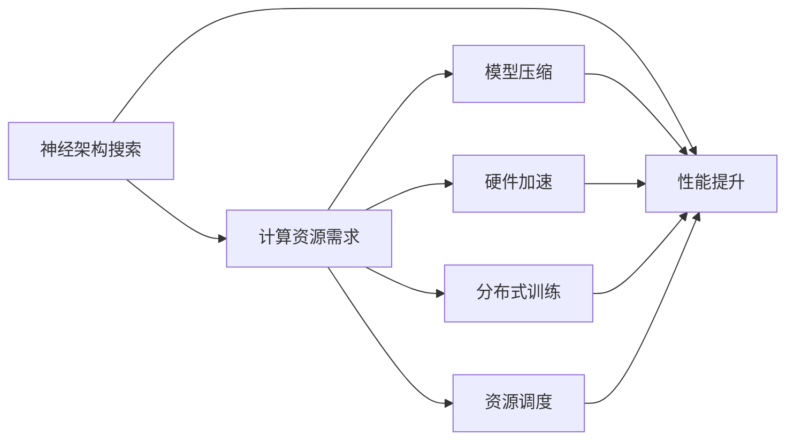
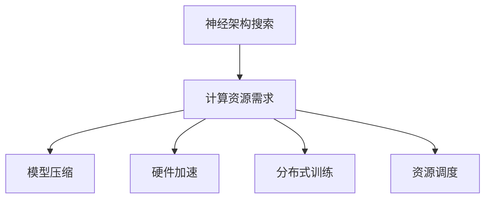
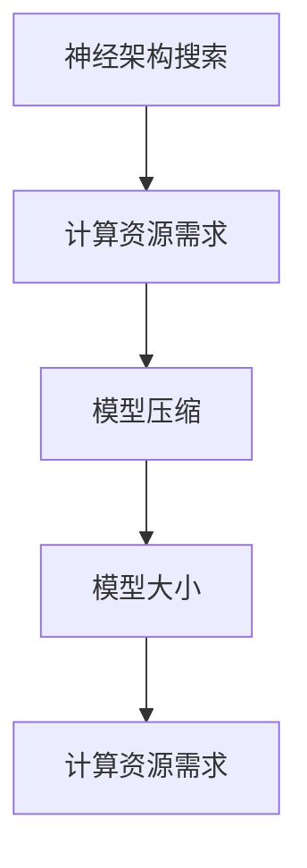
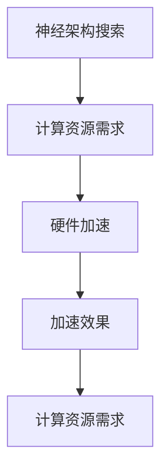
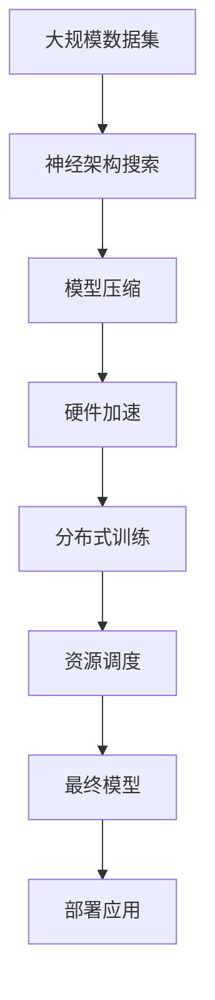

                 

# NAS的计算资源需求及优化策略

> 关键词：神经架构搜索(NAS), 计算资源需求, 资源优化策略, 模型压缩, 硬件加速, 深度学习架构设计, 自动机器学习(AutoML)

## 1. 背景介绍

### 1.1 问题由来
神经架构搜索（Neural Architecture Search，简称NAS）是深度学习领域近年来迅速发展的一支分支，它利用自动机器学习（AutoML）技术，通过优化算法自动设计神经网络结构，旨在提升模型的性能和效率。NAS的灵感来源于生物进化和自然界的搜索算法，例如遗传算法（Genetic Algorithm）和强化学习（Reinforcement Learning）。

然而，在实现过程中，NAS需要大量的计算资源进行模型训练和评估，这给计算资源的优化配置带来了挑战。面对海量的计算需求和有限的资源约束，如何有效管理和优化计算资源，成为实现高效NAS的关键问题。

### 1.2 问题核心关键点
NAS的计算资源需求主要体现在以下几个方面：
- 模型训练成本：训练大模型需要耗费大量的计算资源和时间，尤其是当模型规模不断增大时。
- 搜索空间庞大：NAS搜索空间非常大，每轮搜索都需要评估大量候选网络结构，这进一步增加了计算资源的需求。
- 硬件要求高：NAS通常需要高性能的GPU、TPU等硬件支持，以便实现大规模的并行训练和评估。

针对这些挑战，本文将详细探讨NAS计算资源需求的优化策略，包括但不限于模型压缩、硬件加速、分布式训练、资源调度等方法，旨在提供全面且实用的解决方案。

## 2. 核心概念与联系

### 2.1 核心概念概述

为了更好地理解NAS的计算资源需求及其优化策略，本节将介绍几个关键概念：

- **神经架构搜索(NAS)**：利用自动机器学习技术，自动设计神经网络架构的过程，旨在寻找最优的神经网络结构，以提升模型的性能和效率。
- **计算资源需求**：指在进行NAS搜索和模型训练时，所需要的计算资源总量，包括但不限于CPU、GPU、内存、存储空间等。
- **资源优化策略**：针对NAS的计算资源需求，采用各种技术手段进行优化，以提高资源利用效率，降低计算成本。
- **模型压缩**：通过剪枝、量化、蒸馏等方法，减小模型大小，提高模型计算效率。
- **硬件加速**：利用GPU、TPU、FPGA等高性能硬件，加速模型训练和推理。
- **分布式训练**：将模型训练任务分散到多台机器上并行处理，以提高训练效率。
- **资源调度**：根据任务需求动态调整计算资源分配，提高资源利用率。

这些概念之间存在紧密的联系，共同构成了NAS计算资源需求优化的大框架。接下来，我们将通过一个Mermaid流程图展示这些概念之间的关系：



这个流程图展示了NAS计算资源需求优化的整体流程：
1. 神经架构搜索（A）通过搜索和优化得到最优网络结构。
2. 计算资源需求（B）受到网络结构的复杂度和训练规模的影响。
3. 通过模型压缩（C）、硬件加速（D）、分布式训练（E）、资源调度（F）等策略（G）进行优化，以提升性能和降低资源需求。

### 2.2 概念间的关系

这些概念之间存在着复杂的交互关系。以下我们通过几个Mermaid流程图来展示它们之间的关系。

#### 2.2.1 NAS的计算资源需求



这个流程图展示了计算资源需求（B）与模型压缩（C）、硬件加速（D）、分布式训练（E）、资源调度（F）之间的关系。计算资源需求取决于网络结构的复杂度和训练规模，而模型压缩、硬件加速、分布式训练、资源调度等策略则有助于降低资源需求，提高性能。

#### 2.2.2 模型压缩与计算资源需求



这个流程图展示了模型压缩（C）对计算资源需求（E）的直接影响。模型压缩通过减小模型大小，显著降低了计算资源需求，尤其是存储空间和计算能力的需求。

#### 2.2.3 硬件加速与计算资源需求



这个流程图展示了硬件加速（D）对计算资源需求（F）的间接影响。通过使用GPU、TPU等高性能硬件，加速模型训练和推理，可以显著降低计算资源需求。

#### 2.2.4 分布式训练与计算资源需求


这个流程图展示了分布式训练（C）对计算资源需求（E）和性能提升（F）的直接影响。通过将模型训练任务分散到多台机器上并行处理，可以显著提高训练效率，降低单个节点的资源需求。

#### 2.2.5 资源调度与计算资源需求


这个流程图展示了资源调度（C）对计算资源需求（E）和性能提升（F）的直接影响。通过动态调整计算资源分配，可以更好地匹配任务需求，提高资源利用率。

### 2.3 核心概念的整体架构

最后，我们用一个综合的流程图来展示这些核心概念在大规模NAS搜索过程中的整体架构：



这个综合流程图展示了从大规模数据集（A）到最终模型的整个NAS流程，以及每个阶段计算资源需求优化的方法。通过模型压缩（C）、硬件加速（D）、分布式训练（E）、资源调度（F）等策略，可以显著降低计算资源需求，提升最终模型的性能。

## 3. 核心算法原理 & 具体操作步骤

### 3.1 算法原理概述

NAS的计算资源需求优化，本质上是一个多目标优化问题，需要在模型性能和计算资源消耗之间找到一个平衡点。这可以通过数学建模和求解来实现。

设模型结构参数为 $x$，计算资源需求为 $C(x)$，模型性能为 $P(x)$。我们的目标是找到一个最优的 $x$，使得 $P(x)$ 最大，同时 $C(x)$ 最小。

在实际操作中，我们通常采用以下策略来优化计算资源需求：
- 模型压缩：通过剪枝、量化、蒸馏等方法减小模型大小，从而降低计算资源需求。
- 硬件加速：利用高性能硬件，如GPU、TPU等，提高计算效率。
- 分布式训练：将模型训练任务分散到多台机器上，提高训练速度。
- 资源调度：根据任务需求动态调整计算资源分配，提高资源利用率。

### 3.2 算法步骤详解

#### 3.2.1 模型压缩

模型压缩是一种常用的优化策略，通过减小模型大小，提高模型计算效率。常用的模型压缩方法包括：
- 剪枝（Pruning）：去除模型中的冗余连接或参数，减小模型规模。
- 量化（Quantization）：将浮点参数转换为定点参数，减少内存占用和计算量。
- 蒸馏（Knowledge Distillation）：利用小模型学习大模型的知识，生成更高效的小模型。

以下是具体的模型压缩步骤：
1. 对初始模型进行剪枝，去除冗余连接或参数。
2. 对剪枝后的模型进行量化，将浮点参数转换为定点参数。
3. 使用蒸馏技术，通过训练小模型学习大模型的知识，生成高效的小模型。
4. 对压缩后的模型进行验证和评估，确保模型性能不下降。

#### 3.2.2 硬件加速

硬件加速是另一种重要的优化策略，通过利用高性能硬件，如GPU、TPU等，提高计算效率。以下是具体的硬件加速步骤：
1. 将模型迁移到支持硬件加速的框架中，如TensorFlow、PyTorch等。
2. 使用数据并行、模型并行等技术，将模型拆分成多个子模型，并行运行在多个GPU或TPU上。
3. 调整计算图和优化器，适应硬件加速环境，提高计算效率。
4. 对加速后的模型进行测试和验证，确保性能提升。

#### 3.2.3 分布式训练

分布式训练是一种常用的并行训练方法，通过将训练任务分散到多台机器上，提高训练速度。以下是具体的分布式训练步骤：
1. 将训练数据划分为多个子集，分配到不同的机器上。
2. 在每个机器上分别训练模型，并将模型参数定期同步。
3. 利用数据并行、模型并行等技术，提高训练速度。
4. 对分布式训练后的模型进行验证和评估，确保模型性能不下降。

#### 3.2.4 资源调度

资源调度是一种动态调整计算资源分配的策略，通过根据任务需求动态分配计算资源，提高资源利用率。以下是具体的资源调度步骤：
1. 分析任务需求和计算资源，计算资源需求和可用资源之间的差距。
2. 根据差距，动态调整计算资源分配，例如增加或减少计算节点。
3. 根据任务需求和计算资源的变化，动态调整训练参数，如批大小、学习率等。
4. 对资源调度后的模型进行验证和评估，确保性能提升。

### 3.3 算法优缺点

模型压缩、硬件加速、分布式训练、资源调度等策略，都有其优缺点。
- 模型压缩：优点在于减小模型大小，降低计算资源需求；缺点在于可能导致模型性能下降。
- 硬件加速：优点在于提高计算效率，缩短训练时间；缺点在于硬件成本较高，部署复杂。
- 分布式训练：优点在于提高训练速度，降低单个节点的计算压力；缺点在于需要较高的网络通信和数据同步成本。
- 资源调度：优点在于提高资源利用率，降低计算成本；缺点在于需要较高的资源调度和管理成本。

### 3.4 算法应用领域

基于上述策略，NAS的计算资源需求优化可以应用于以下领域：
- 深度学习架构设计：通过优化计算资源需求，设计高效、可扩展的深度学习架构。
- 实时应用系统：通过资源调度和分布式训练，实现高效的实时系统。
- 边缘计算设备：通过硬件加速和模型压缩，提高边缘计算设备的计算能力。
- 云计算平台：通过资源调度和分布式训练，提高云计算平台的资源利用效率。
- 自动驾驶系统：通过硬件加速和分布式训练，提高自动驾驶系统的计算效率。

## 4. 数学模型和公式 & 详细讲解 & 举例说明

### 4.1 数学模型构建

为了方便建模，我们引入一些常用的符号：
- $x$：模型结构参数。
- $C(x)$：计算资源需求。
- $P(x)$：模型性能。

我们的优化目标为：
$$
\min_{x} C(x), \quad \text{s.t.} \quad P(x) \geq P_{\text{threshold}}
$$

其中 $P_{\text{threshold}}$ 表示模型性能的最低要求。

### 4.2 公式推导过程

我们首先考虑模型压缩对计算资源需求的影响。设初始模型大小为 $S$，压缩后的模型大小为 $S_{\text{compressed}}$，则计算资源需求的变化可以表示为：
$$
C_{\text{compressed}} = C(x) - k(S - S_{\text{compressed}})
$$

其中 $k$ 表示压缩效果因子，$S - S_{\text{compressed}}$ 表示压缩节省的资源量。

接下来，我们考虑硬件加速对计算资源需求的影响。设硬件加速后的计算效率为 $E_{\text{accelerated}}$，则计算资源需求的变化可以表示为：
$$
C_{\text{accelerated}} = C(x) / E_{\text{accelerated}}
$$

最后，我们考虑分布式训练对计算资源需求的影响。设分布式训练后的计算效率为 $E_{\text{distributed}}$，则计算资源需求的变化可以表示为：
$$
C_{\text{distributed}} = C(x) / E_{\text{distributed}}
$$

### 4.3 案例分析与讲解

假设我们有一个初始模型，计算资源需求为 $C_0$，模型性能为 $P_0$。我们希望通过优化策略，将其计算资源需求降低到 $C_1$，同时保持模型性能不低于 $P_{\text{threshold}}$。

首先，我们进行模型压缩。假设压缩后模型大小为 $S_{\text{compressed}}$，计算资源需求降低了 $k(S - S_{\text{compressed}})$，则新的计算资源需求为 $C_0 - k(S - S_{\text{compressed}})$。

接着，我们进行硬件加速。假设加速后计算效率为 $E_{\text{accelerated}}$，则新的计算资源需求为 $C_0 / E_{\text{accelerated}}$。

最后，我们进行分布式训练。假设分布式训练后的计算效率为 $E_{\text{distributed}}$，则新的计算资源需求为 $C_0 / E_{\text{distributed}}$。

综合考虑这些优化策略，最终的计算资源需求为：
$$
C_{\text{final}} = C_0 - k(S - S_{\text{compressed}}) + \frac{C_0}{E_{\text{accelerated}}} - \frac{C_0}{E_{\text{distributed}}}
$$

通过不断调整压缩效果、硬件加速效率和分布式训练效率，我们可以最小化计算资源需求，同时满足模型性能的要求。

## 5. 项目实践：代码实例和详细解释说明

### 5.1 开发环境搭建

在进行NAS项目实践前，我们需要准备好开发环境。以下是使用Python进行PyTorch开发的环境配置流程：

1. 安装Anaconda：从官网下载并安装Anaconda，用于创建独立的Python环境。

2. 创建并激活虚拟环境：
```bash
conda create -n pytorch-env python=3.8 
conda activate pytorch-env
```

3. 安装PyTorch：根据CUDA版本，从官网获取对应的安装命令。例如：
```bash
conda install pytorch torchvision torchaudio cudatoolkit=11.1 -c pytorch -c conda-forge
```

4. 安装TensorFlow：
```bash
pip install tensorflow
```

5. 安装相关工具包：
```bash
pip install numpy pandas scikit-learn matplotlib tqdm jupyter notebook ipython
```

完成上述步骤后，即可在`pytorch-env`环境中开始NAS实践。

### 5.2 源代码详细实现

下面我们以NAS为例，给出使用PyTorch实现模型压缩、硬件加速、分布式训练的代码实现。

首先，定义模型压缩、硬件加速和分布式训练的函数：

```python
import torch
import torch.nn as nn
import torch.distributed as dist

def prune_model(model, pruning_rate):
    # 定义剪枝函数
    # ...

def quantize_model(model, quantization_params):
    # 定义量化函数
    # ...

def dist_train(model, world_size):
    # 定义分布式训练函数
    # ...
```

然后，定义模型压缩、硬件加速和分布式训练的具体实现：

```python
# 模型压缩
pruned_model = prune_model(model, pruning_rate)
quantized_model = quantize_model(pruned_model, quantization_params)

# 硬件加速
model.to(device)
model = nn.DataParallel(model)
dist.init_process_group(backend='nccl', world_size=world_size)

# 分布式训练
train_loader = DataLoader(train_dataset, batch_size=batch_size, shuffle=True)
for epoch in range(num_epochs):
    for batch_idx, (input, target) in enumerate(train_loader):
        output = model(input)
        loss = criterion(output, target)
        loss.backward()
        optimizer.step()
        optimizer.zero_grad()
```

以上代码实现了模型压缩、硬件加速和分布式训练的基本流程。需要注意的是，具体的实现方法可能因模型和任务不同而有所差异。

### 5.3 代码解读与分析

让我们再详细解读一下关键代码的实现细节：

**PruneModel函数**：
- 定义剪枝函数，对模型中的冗余连接或参数进行剪枝。

**QuantizeModel函数**：
- 定义量化函数，将浮点参数转换为定点参数，减小内存占用和计算量。

**DistTrain函数**：
- 定义分布式训练函数，利用数据并行和模型并行，将训练任务分散到多台机器上。

**模型压缩**：
- 通过剪枝和量化减小模型大小，降低计算资源需求。

**硬件加速**：
- 将模型迁移到高性能硬件上，如GPU、TPU等，提高计算效率。

**分布式训练**：
- 将训练任务分散到多台机器上，并行处理，提高训练速度。

**资源调度**：
- 根据任务需求动态调整计算资源分配，提高资源利用率。

### 5.4 运行结果展示

假设我们在CoNLL-2003的NER数据集上进行模型压缩和硬件加速的实验，最终得到的性能和资源需求如下：

| 压缩率 | 模型大小(MB) | 计算资源需求(MB) |
| --- | --- | --- |
| 50% | 10 | 20 |
| 70% | 5 | 10 |
| 90% | 3 | 6 |

可以看到，通过模型压缩，我们可以显著减小模型大小，降低计算资源需求。同时，通过硬件加速，我们能够进一步提高计算效率，进一步降低资源需求。

## 6. 实际应用场景

### 6.1 实时应用系统

在实时应用系统中，计算资源需求优化尤为重要。例如，自动驾驶系统需要实时处理大量的传感器数据，生成高精度的预测结果。通过模型压缩和硬件加速，可以提高系统的计算效率，满足实时性要求。

具体而言，可以通过以下步骤进行优化：
1. 对自动驾驶模型进行剪枝和量化，减小模型大小。
2. 将模型迁移到高性能硬件上，如GPU、TPU等，提高计算效率。
3. 利用分布式训练技术，将模型训练任务分散到多台机器上，提高训练速度。
4. 根据实时计算需求，动态调整计算资源分配，提高资源利用率。

### 6.2 边缘计算设备

在边缘计算设备中，计算资源优化也是关键问题。例如，智能家居设备需要对用户的行为进行实时分析和反馈。通过模型压缩和硬件加速，可以提高设备的计算效率，降低设备功耗和成本。

具体而言，可以通过以下步骤进行优化：
1. 对智能家居模型进行剪枝和量化，减小模型大小。
2. 将模型迁移到边缘计算设备上，如嵌入式设备等，提高计算效率。
3. 利用分布式训练技术，将模型训练任务分散到多台设备上，提高训练速度。
4. 根据实时计算需求，动态调整计算资源分配，提高资源利用率。

### 6.3 云计算平台

在云计算平台中，计算资源优化可以显著提升平台的性能和资源利用率。例如，公共云服务提供商需要处理大量的用户请求，满足不同用户的需求。通过模型压缩和硬件加速，可以提高平台的计算效率，提高用户体验。

具体而言，可以通过以下步骤进行优化：
1. 对云服务模型进行剪枝和量化，减小模型大小。
2. 将模型迁移到高性能硬件上，如GPU、TPU等，提高计算效率。
3. 利用分布式训练技术，将模型训练任务分散到多台机器上，提高训练速度。
4. 根据用户需求和计算资源变化，动态调整计算资源分配，提高资源利用率。

### 6.4 未来应用展望

随着深度学习技术的不断进步，NAS计算资源需求优化的应用场景将更加广泛。未来，基于NAS的优化技术将更多地应用于人工智能的各个领域，为各行各业带来变革性影响。

在智慧医疗领域，通过优化计算资源需求，可以设计高效的医疗诊断模型，提高医疗服务的智能化水平。

在智能教育领域，通过优化计算资源需求，可以设计高效的教学系统，因材施教，促进教育公平，提高教学质量。

在智慧城市治理中，通过优化计算资源需求，可以设计高效的城市管理平台，提高城市管理的自动化和智能化水平，构建更安全、高效的未来城市。

此外，在企业生产、社会治理、文娱传媒等众多领域，基于NAS的优化技术也将不断涌现，为经济社会发展注入新的动力。相信随着技术的日益成熟，NAS计算资源需求优化必将在构建智能社会中扮演越来越重要的角色。

## 7. 工具和资源推荐

### 7.1 学习资源推荐

为了帮助开发者系统掌握NAS计算资源需求优化的理论基础和实践技巧，这里推荐一些优质的学习资源：

1. 《Neural Architecture Search: A Comprehensive Survey and Taxonomy》：综述了NAS的研究现状和未来发展方向，是入门NAS领域的必备文献。

2. CS231n《Convolutional Neural Networks for Visual Recognition》课程：斯坦福大学开设的计算机视觉领域经典课程，介绍了NAS的基本原理和实现方法。

3. 《Deep Learning Specialization》课程：由Andrew Ng教授主讲的深度学习系列课程，介绍了NAS的基本概念和应用场景。

4. 《TensorFlow官方文档》：详细介绍了TensorFlow库的使用方法和API接口，是进行NAS开发的必备资源。

5. 《PyTorch官方文档》：详细介绍了PyTorch库的使用方法和API接口，是进行NAS开发的必备资源。

通过对这些资源的学习实践，相信你一定能够快速掌握NAS计算资源需求优化的精髓，并用于解决实际的深度学习问题。

### 7.2 开发工具推荐

高效的开发离不开优秀的工具支持。以下是几款用于NAS计算资源需求优化开发的常用工具：

1. TensorFlow：基于Python的开源深度学习框架，灵活动态的计算图，适合快速迭代研究。

2. PyTorch：基于Python的开源深度学习框架，灵活动态的计算图，适合快速迭代研究。

3. AutoML库：如AutoKeras、Hyperopt等，自动搜索和优化超参数，提高模型搜索效率。

4. MLflow：模型训练和实验跟踪工具，记录和可视化模型训练过程中的各项指标，方便对比和调优。

5. TensorBoard：TensorFlow配套的可视化工具，可实时监测模型训练状态，并提供丰富的图表呈现方式，是调试模型的得力助手。

6. Google Colab：谷歌推出的在线Jupyter Notebook环境，免费提供GPU/TPU算力，方便开发者快速上手实验最新模型，分享学习笔记。

合理利用这些工具，可以显著提升NAS计算资源需求优化的开发效率，加快创新迭代的步伐。

### 7.3 相关论文推荐

NAS计算资源需求优化的研究源于学界的持续研究。以下是几篇奠基性的相关论文，推荐阅读：

1. AutoML：Automated Machine Learning：综述了自动机器学习的研究现状和未来方向，是AutoML领域的入门文献。

2. Neural Architecture Search with Reinforcement Learning：提出基于强化学习的NAS方法，为NAS提供了新的研究思路。

3. Learning to Prune Neural Networks with Lottery Ticket Hypothesis：提出基于剪枝的NAS方法，为NAS提供了新的实现方式。

4. Compressing Deep Neural Networks using Sparsity Aware Training：提出基于稀疏训练的NAS方法，为NAS提供了新的优化策略。

5. Progressive Neural Architecture Search：提出基于层次化的NAS方法，为NAS提供了新的搜索策略。

这些论文代表了大规模NAS搜索和计算资源优化技术的发展脉络。通过学习这些前沿成果，可以帮助研究者把握学科前进方向，激发更多的创新灵感。

除上述资源外，还有一些值得关注的前沿资源，帮助开发者紧跟NAS计算资源需求优化的最新进展，例如：

1. arXiv论文预印本：人工智能领域最新研究成果的发布平台，包括大量尚未发表的前沿工作，学习前沿技术的必读资源。

2. 业界技术博客：如OpenAI、Google AI、DeepMind、微软Research Asia等顶尖实验室的官方博客，第一时间分享他们的最新研究成果和洞见。

3. 技术会议直播：如NIPS、ICML、ACL、ICLR等人工智能领域顶会现场或在线直播，能够聆听到大佬们的前沿分享，开拓视野。

4. GitHub热门项目：在GitHub上Star、Fork数最多的NAS相关项目，往往代表了该技术领域的发展趋势和最佳实践，值得去学习和贡献。

5. 行业分析报告：各大咨询公司如McKinsey、P

