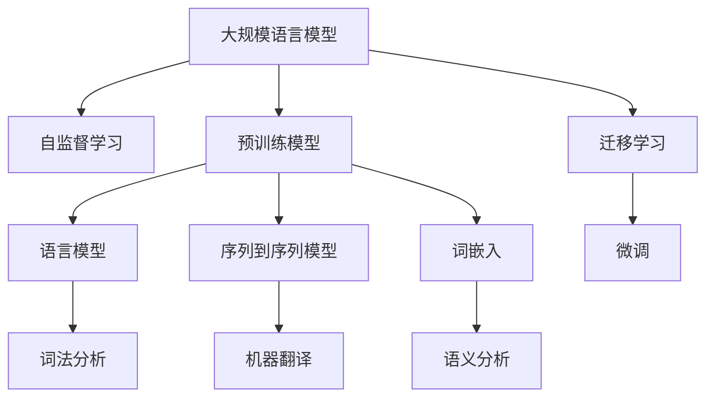

                 

# NLP是人类和计算机沟通的桥梁

## 1. 背景介绍

### 1.1 问题由来
随着人工智能技术的迅猛发展，自然语言处理(Natural Language Processing, NLP)在众多领域发挥着越来越重要的作用。从智能客服到自动驾驶，从金融风控到医疗诊断，NLP技术正逐步成为人类和计算机沟通的重要桥梁。然而，尽管NLP技术已取得长足进步，人类语言的多样性和复杂性仍对其提出了巨大挑战。如何在不丢失语言的丰富内涵和上下文信息的前提下，使计算机理解和处理自然语言，仍是一个亟待解决的问题。

### 1.2 问题核心关键点
在NLP领域，我们面临着以下几个核心挑战：
- 语言的开放性：人类语言是开放和动态的，词汇、语法和语义不断变化，难以用固定规则完全描述。
- 上下文依赖性：自然语言的理解和生成往往需要依赖上下文信息，而上下文信息往往散落在文本的各处，难以提取。
- 歧义性和多义性：同一句话可以有多种解释，同一词汇在不同语境下可能有不同的含义。
- 大规模数据需求：构建高性能的NLP模型往往需要海量的标注数据和计算资源，数据获取和模型训练成本较高。

这些挑战推动了NLP技术的快速发展，也促进了对深度学习、表示学习、迁移学习等前沿技术的研究和应用。本文将聚焦于NLP技术的前沿进展，探讨NLP如何成为人类和计算机沟通的桥梁。

### 1.3 问题研究意义
深入理解和掌握NLP技术，不仅能够提升计算系统对自然语言的理解能力，还能够促进信息获取、知识整合、智能交互等诸多应用领域的创新发展。NLP技术的应用，将使人类与计算机的沟通更加自然、高效，从而开启智能时代的新篇章。

## 2. 核心概念与联系

### 2.1 核心概念概述

为更好地理解NLP技术，本节将介绍几个关键概念：

- 自然语言处理(NLP)：研究如何让计算机理解和处理人类语言的技术领域。涉及文本预处理、词法分析、语法分析、语义分析、信息抽取、问答系统、机器翻译等多个子任务。

- 词嵌入(Word Embedding)：将词汇表中的单词映射到高维向量空间中的方法。每个单词被表示为一个固定长度的向量，其语义信息嵌入到向量中，从而使得计算机可以更好地理解单词之间的关系。

- 语言模型(Language Model)：用于预测下一个词汇的概率分布的模型。常见模型包括n-gram模型、神经网络语言模型(Neural Network Language Model, NNLM)、Transformer语言模型等。

- 序列到序列模型(Sequence to Sequence, Seq2Seq)：将输入序列映射到输出序列的模型结构。常用于机器翻译、对话生成等任务。

- 预训练模型(Pre-trained Model)：在无标签的大规模语料上进行预训练，学习语言模型的结构化表示，然后在特定任务上进行微调，以适应特定应用。常见预训练模型包括BERT、GPT、T5等。

- 迁移学习(Transfer Learning)：利用源任务学到的知识，迁移到目标任务上，以提高模型在新任务上的表现。通过预训练-微调的方法，可以在新任务上获得更好的性能。

- 自监督学习(Self-supervised Learning)：在没有标签的情况下，通过自监督任务让模型学习到有意义的表示。常见自监督任务包括掩码语言模型(Masked Language Model, MLM)、下一句预测(Next Sentence Prediction, NSP)等。

- 大规模语言模型(Large Language Model, LLM)：参数量超过数十亿的预训练语言模型，具备强大的语言理解和生成能力，能够处理大规模文本数据。

这些核心概念构成了NLP技术的框架，共同支撑着自然语言理解和生成任务的实现。通过理解这些概念，我们可以更好地把握NLP技术的发展脉络和应用前景。

### 2.2 概念间的关系

这些核心概念之间存在着紧密的联系，形成了NLP技术的完整生态系统。我们可以用以下Mermaid流程图来展示这些概念之间的关系：



这个流程图展示了NLP技术的主要概念及其之间的关系：

1. 大规模语言模型通过自监督学习任务进行预训练，学习语言模型的结构化表示。
2. 预训练模型作为通用表示学习器，应用于各种NLP任务，如词法分析、机器翻译、语义分析等。
3. 序列到序列模型用于处理输入序列和输出序列，常用于对话生成、文本摘要等任务。
4. 词嵌入将单词映射到高维向量空间中，增强模型对单词关系的理解。
5. 迁移学习通过预训练-微调的方法，利用已有的语言知识，在特定任务上获得更好的性能。

这些概念共同构成了NLP技术的核心，使得计算机能够更好地理解和处理自然语言。

## 3. 核心算法原理 & 具体操作步骤
### 3.1 算法原理概述

NLP技术的核心是让计算机理解自然语言的语义和语法结构，从而进行信息抽取、文本生成等任务。基于深度学习的NLP算法通常包括词嵌入、语言模型、序列到序列模型等。以下是NLP算法的关键步骤和原理：

**Step 1: 数据预处理**
- 分词：将文本按照词汇单位进行分割，生成词汇序列。
- 去除停用词：移除常见的无意义词汇，如"的"、"是"等。
- 词干提取：将不同形式的词汇转换为词干形式，如将"running"转换为"run"。
- 词性标注：标注每个词汇的词性，如名词、动词等。
- 实体识别：识别文本中的实体，如人名、地名、组织名等。

**Step 2: 词嵌入生成**
- 使用预训练的词嵌入模型（如Word2Vec、GloVe等）生成词汇向量。
- 对每个词汇进行编码，得到一个固定长度的向量，表示其语义信息。

**Step 3: 语言模型训练**
- 收集大量文本数据，对语言模型进行训练，学习词汇之间的概率分布。
- 常见语言模型包括n-gram模型、神经网络语言模型等。

**Step 4: 序列到序列模型训练**
- 设计输入序列和输出序列的结构。
- 训练序列到序列模型，如循环神经网络(RNN)、长短时记忆网络(LSTM)、Transformer等。

**Step 5: 微调**
- 对预训练模型进行微调，适应特定任务。
- 微调过程通常使用梯度下降算法，最小化损失函数，更新模型参数。

### 3.2 算法步骤详解

NLP算法的详细步骤包括数据预处理、词嵌入生成、语言模型训练、序列到序列模型训练和微调等。下面将对每个步骤进行详细讲解：

**数据预处理**
在NLP任务中，数据预处理是关键的一环。文本数据往往包含大量的噪音和冗余信息，需要进行预处理以提高数据质量。以下是一个简化的文本预处理流程：

1. 分词：使用分词工具将文本分割成词汇序列。
2. 去除停用词：使用停用词表去除常见的无意义词汇，如"的"、"是"等。
3. 词干提取：使用词干提取工具将不同形式的词汇转换为词干形式，如将"running"转换为"run"。
4. 词性标注：使用自然语言处理工具对每个词汇进行词性标注，如名词、动词等。
5. 实体识别：使用命名实体识别工具识别文本中的实体，如人名、地名、组织名等。

**词嵌入生成**
词嵌入是NLP任务中重要的表示学习技术。它将词汇表中的单词映射到高维向量空间中，每个单词被表示为一个固定长度的向量，其语义信息嵌入到向量中，从而使得计算机可以更好地理解单词之间的关系。以下是一个简单的词嵌入生成流程：

1. 收集大量文本数据。
2. 将文本数据进行分词、去除停用词等预处理。
3. 使用预训练的词嵌入模型（如Word2Vec、GloVe等）生成词汇向量。
4. 对每个词汇进行编码，得到一个固定长度的向量，表示其语义信息。

**语言模型训练**
语言模型用于预测下一个词汇的概率分布，是NLP任务中的重要基础模型。以下是一个简单的语言模型训练流程：

1. 收集大量文本数据。
2. 将文本数据进行分词、去除停用词等预处理。
3. 设计语言模型的结构，如n-gram模型、神经网络语言模型等。
4. 使用文本数据对语言模型进行训练，学习词汇之间的概率分布。

**序列到序列模型训练**
序列到序列模型用于将输入序列映射到输出序列，常用于机器翻译、对话生成等任务。以下是一个简单的序列到序列模型训练流程：

1. 设计输入序列和输出序列的结构，如循环神经网络(RNN)、长短时记忆网络(LSTM)、Transformer等。
2. 收集大量文本数据，将文本数据进行分词、去除停用词等预处理。
3. 对序列到序列模型进行训练，最小化损失函数，更新模型参数。

**微调**
微调是NLP任务中常用的优化方法，用于适应特定任务。以下是一个简单的微调流程：

1. 选择预训练模型作为初始化参数，如BERT、GPT等。
2. 准备下游任务的标注数据集，划分为训练集、验证集和测试集。
3. 添加任务适配层，如分类器、解码器等。
4. 设置微调超参数，如学习率、批大小、迭代轮数等。
5. 使用梯度下降算法，最小化损失函数，更新模型参数。
6. 在验证集上评估模型性能，根据性能指标决定是否触发Early Stopping。
7. 重复上述步骤直到满足预设的迭代轮数或Early Stopping条件。

### 3.3 算法优缺点

NLP算法的优点包括：
1. 强大的语言理解能力：通过深度学习技术，NLP算法能够理解复杂的自然语言结构。
2. 广泛的应用场景：NLP技术已经广泛应用于智能客服、机器翻译、情感分析等多个领域。
3. 高效的学习能力：通过预训练和微调，NLP算法能够快速适应新任务，提升性能。

NLP算法的缺点包括：
1. 高数据需求：NLP任务通常需要大量的标注数据，数据获取和标注成本较高。
2. 计算资源需求高：大规模NLP模型需要大量的计算资源，训练和推理成本较高。
3. 难以处理歧义性：自然语言的多义性和歧义性问题，仍是一个未解决的难题。
4. 理解上下文能力不足：NLP算法通常难以理解长文本的上下文信息。

尽管存在这些缺点，NLP算法仍具有广阔的应用前景和研究价值，是实现人机自然语言交互的重要手段。

### 3.4 算法应用领域

NLP技术已经广泛应用于多个领域，以下是几个典型的应用场景：

- 机器翻译：将一种语言的文本翻译成另一种语言。常用的模型包括Seq2Seq、Transformer等。
- 情感分析：分析文本的情感倾向，如正面、负面、中性等。常用的模型包括LSTM、BERT等。
- 问答系统：对自然语言问题给出答案。常用的模型包括BERT、T5等。
- 文本摘要：将长文本压缩成简短摘要。常用的模型包括BERT、T5等。
- 命名实体识别：识别文本中的实体，如人名、地名、组织名等。常用的模型包括BERT、LSTM等。
- 文本分类：将文本分类到不同的类别中，如新闻、评论、博客等。常用的模型包括BERT、CNN等。
- 对话生成：生成自然语言对话，如智能客服、智能助手等。常用的模型包括Seq2Seq、Transformer等。

## 4. 数学模型和公式 & 详细讲解 & 举例说明

### 4.1 数学模型构建

在NLP任务中，我们通常使用以下数学模型进行表示学习：

- 词嵌入：将词汇表中的单词映射到高维向量空间中的方法。

  $$
  \mathbf{e}(w) = f(w)
  $$

- 语言模型：用于预测下一个词汇的概率分布。

  $$
  P(w_t|w_{<t}) = \frac{e^{E(w_t|w_{<t})}}{\sum_{w_t}e^{E(w_t|w_{<t})}}
  $$

- 序列到序列模型：将输入序列映射到输出序列的模型结构。

  $$
  P(Y|X) = \prod_{t=1}^nP(y_t|y_{<t}, x)
  $$

- 微调：对预训练模型进行微调，适应特定任务。

  $$
  \theta^* = \arg\min_{\theta} \mathcal{L}(M_{\theta}, D)
  $$

其中，$w$ 表示词汇，$e(w)$ 表示词汇的词嵌入，$E$ 表示语言模型的能量函数，$P$ 表示概率分布，$y_t$ 表示输出序列中的第 $t$ 个词汇，$x$ 表示输入序列，$D$ 表示标注数据集，$\mathcal{L}$ 表示损失函数，$\theta$ 表示模型参数，$\theta^*$ 表示最优参数。

### 4.2 公式推导过程

以下我们将对上述数学模型进行推导，以更好地理解NLP算法的原理。

**词嵌入的推导**
词嵌入将词汇表中的单词映射到高维向量空间中，每个单词被表示为一个固定长度的向量，其语义信息嵌入到向量中，从而使得计算机可以更好地理解单词之间的关系。设 $w_i$ 表示第 $i$ 个词汇，$e(w_i)$ 表示 $w_i$ 的词嵌入，则词嵌入的推导公式如下：

$$
e(w_i) = f(w_i)
$$

其中 $f(w_i)$ 表示一个映射函数，将 $w_i$ 映射到高维向量空间中。

**语言模型的推导**
语言模型用于预测下一个词汇的概率分布。设 $w_t$ 表示第 $t$ 个词汇，$w_{<t}$ 表示前 $t-1$ 个词汇，$E(w_t|w_{<t})$ 表示 $w_t$ 在上下文 $w_{<t}$ 下的能量函数，则语言模型的推导公式如下：

$$
P(w_t|w_{<t}) = \frac{e^{E(w_t|w_{<t})}}{\sum_{w_t}e^{E(w_t|w_{<t})}}
$$

其中 $E(w_t|w_{<t})$ 表示 $w_t$ 在上下文 $w_{<t}$ 下的能量函数，$P(w_t|w_{<t})$ 表示 $w_t$ 在上下文 $w_{<t}$ 下的概率分布。

**序列到序列模型的推导**
序列到序列模型用于将输入序列映射到输出序列，常用于机器翻译、对话生成等任务。设 $X$ 表示输入序列，$Y$ 表示输出序列，$y_t$ 表示输出序列中的第 $t$ 个词汇，则序列到序列模型的推导公式如下：

$$
P(Y|X) = \prod_{t=1}^nP(y_t|y_{<t}, x)
$$

其中 $P(y_t|y_{<t}, x)$ 表示输出序列中的第 $t$ 个词汇在上下文 $y_{<t}$ 和输入 $x$ 下的概率分布。

**微调的推导**
微调是对预训练模型进行任务特定的优化，使其适应特定任务。设 $M_{\theta}$ 表示预训练模型，$D$ 表示标注数据集，$\theta$ 表示模型参数，则微调的推导公式如下：

$$
\theta^* = \arg\min_{\theta} \mathcal{L}(M_{\theta}, D)
$$

其中 $\mathcal{L}$ 表示损失函数，$M_{\theta}$ 表示预训练模型，$D$ 表示标注数据集，$\theta$ 表示模型参数，$\theta^*$ 表示最优参数。

### 4.3 案例分析与讲解

以下我们将通过几个具体的NLP任务，详细讲解数学模型的应用。

**机器翻译**
机器翻译是NLP领域的一个重要任务。设 $s$ 表示源语言文本，$t$ 表示目标语言文本，则机器翻译的目标是：

$$
P(t|s) = \frac{P(t|s, \theta)}{P(s)}
$$

其中 $P(t|s, \theta)$ 表示在模型 $M_{\theta}$ 下，源语言文本 $s$ 翻译成目标语言文本 $t$ 的概率分布，$P(s)$ 表示源语言文本 $s$ 的概率分布。常用的模型包括Seq2Seq、Transformer等。

**情感分析**
情感分析用于分析文本的情感倾向，如正面、负面、中性等。设 $x$ 表示文本，$y$ 表示情感标签，则情感分析的目标是：

$$
P(y|x) = \frac{e^{E(y|x)}}{\sum_{y}e^{E(y|x)}}
$$

其中 $E(y|x)$ 表示情感标签 $y$ 在文本 $x$ 下的能量函数，$P(y|x)$ 表示情感标签 $y$ 在文本 $x$ 下的概率分布。常用的模型包括LSTM、BERT等。

**问答系统**
问答系统用于对自然语言问题给出答案。设 $q$ 表示自然语言问题，$a$ 表示答案，则问答系统的目标是：

$$
P(a|q) = \frac{e^{E(a|q)}}{\sum_{a}e^{E(a|q)}}
$$

其中 $E(a|q)$ 表示答案 $a$ 在问题 $q$ 下的能量函数，$P(a|q)$ 表示答案 $a$ 在问题 $q$ 下的概率分布。常用的模型包括BERT、T5等。

**文本摘要**
文本摘要是将长文本压缩成简短摘要的任务。设 $X$ 表示长文本，$Y$ 表示摘要，则文本摘要的目标是：

$$
P(Y|X) = \frac{e^{E(Y|X)}}{\sum_{Y}e^{E(Y|X)}}
$$

其中 $E(Y|X)$ 表示摘要 $Y$ 在长文本 $X$ 下的能量函数，$P(Y|X)$ 表示摘要 $Y$ 在长文本 $X$ 下的概率分布。常用的模型包括BERT、T5等。

## 5. 项目实践：代码实例和详细解释说明

### 5.1 开发环境搭建

在进行NLP项目实践前，我们需要准备好开发环境。以下是使用Python进行PyTorch开发的环境配置流程：

1. 安装Anaconda：从官网下载并安装Anaconda，用于创建独立的Python环境。

2. 创建并激活虚拟环境：
```bash
conda create -n nlp-env python=3.8 
conda activate nlp-env
```

3. 安装PyTorch：根据CUDA版本，从官网获取对应的安装命令。例如：
```bash
conda install pytorch torchvision torchaudio cudatoolkit=11.1 -c pytorch -c conda-forge
```

4. 安装Transformers库：
```bash
pip install transformers
```

5. 安装各类工具包：
```bash
pip install numpy pandas scikit-learn matplotlib tqdm jupyter notebook ipython
```

完成上述步骤后，即可在`nlp-env`环境中开始NLP项目实践。

### 5.2 源代码详细实现

下面我们以机器翻译为例，给出使用Transformers库进行BERT模型微调的PyTorch代码实现。

首先，定义机器翻译的数据处理函数：

```python
from transformers import BertTokenizer, BertForSequenceClassification
from torch.utils.data import Dataset
import torch

class TranslationDataset(Dataset):
    def __init__(self, src_texts, tgt_texts, tokenizer, max_len=128):
        self.src_texts = src_texts
        self.tgt_texts = tgt_texts
        self.tokenizer = tokenizer
        self.max_len = max_len
        
    def __len__(self):
        return len(self.src_texts)
    
    def __getitem__(self, item):
        src_text = self.src_texts[item]
        tgt_text = self.tgt_texts[item]
        
        encoding = self.tokenizer(src_text, return_tensors='pt', max_length=self.max_len, padding='max_length', truncation=True)
        input_ids = encoding['input_ids'][0]
        attention_mask = encoding['attention_mask'][0]
        
        tgt_input_ids = self.tokenizer(tgt_text, return_tensors='pt', max_length=self.max_len, padding='max_length', truncation=True)["input_ids"]
        
        return {'src_ids': input_ids, 'tgt_ids': tgt_input_ids, 'attention_mask': attention_mask}
```

然后，定义模型和优化器：

```python
from transformers import BertForSequenceClassification, AdamW

model = BertForSequenceClassification.from_pretrained('bert-base-cased', num_labels=2)

optimizer = AdamW(model.parameters(), lr=2e-5)
```

接着，定义训练和评估函数：

```python
from torch.utils.data import DataLoader
from tqdm import tqdm
from sklearn.metrics import classification_report

device = torch.device('cuda') if torch.cuda.is_available() else torch.device('cpu')
model.to(device)

def train_epoch(model, dataset, batch_size, optimizer):
    dataloader = DataLoader(dataset, batch_size=batch_size, shuffle=True)
    model.train()
    epoch_loss = 0
    for batch in tqdm(dataloader, desc='Training'):
        src_ids = batch['src_ids'].to(device)
        tgt_ids = batch['tgt_ids'].to(device)
        attention_mask = batch['attention_mask'].to(device)
        model.zero_grad()
        outputs = model(src_ids, attention_mask=attention_mask, labels=tgt_ids)
        loss = outputs.loss
        epoch_loss += loss.item()
        loss.backward()
        optimizer.step()
    return epoch_loss / len(dataloader)

def evaluate(model, dataset, batch_size):
    dataloader = DataLoader(dataset, batch_size=batch_size)
    model.eval()
    preds, labels = [], []
    with torch.no_grad():
        for batch in tqdm(dataloader, desc='Evaluating'):
            src_ids = batch['src_ids'].to(device)
            tgt_ids = batch['tgt_ids'].to(device)
            attention_mask = batch['attention_mask'].to(device)
            batch_labels = tgt_ids
            outputs = model(src_ids, attention_mask=attention_mask)
            batch_preds = outputs.logits.argmax(dim=2).to('cpu').tolist()
            batch_labels = batch_labels.to('cpu').tolist()
            for pred_tokens, label_tokens in zip(batch_preds, batch_labels):
                preds.append(pred_tokens[:len(label_tokens)])
                labels.append(label_tokens)
                
    print(classification_report(labels, preds))
```

最后，启动训练流程并在测试集上评估：

```python
epochs = 5
batch_size = 16

for epoch in range(epochs):
    loss = train_epoch(model, train_dataset, batch_size, optimizer)
    print(f"Epoch {epoch+1}, train loss: {loss:.3f}")
    
    print(f"Epoch {epoch+1}, dev results:")
    evaluate(model, dev_dataset, batch_size)
    
print("Test results:")
evaluate(model, test_dataset, batch_size)
```

以上就是使用PyTorch对BERT进行机器翻译任务微调的完整代码实现。可以看到，得益于Transformers库的强大封装，我们可以用相对简洁的代码完成BERT模型的加载和微调。

### 5.3 代码解读与分析

让我们再详细解读一下关键代码的实现细节：

**TranslationDataset类**：
- `__init__`方法：初始化源语言文本、目标语言文本、分词器等关键组件。
- `__len__`方法：返回数据集的样本数量。
- `__getitem__`方法：对单个样本进行处理，将源语言和目标语言输入编码为token ids，最终返回模型所需的输入。

**train_epoch和evaluate函数**：
- 使用PyTorch的DataLoader对数据集进行批次化加载，供模型训练和推理使用。
- 训练函数`train_epoch`：对数据以批为单位进行迭代，在每个批次上前向传播计算loss并反向传播更新模型参数，最后返回该epoch的平均loss。
- 评估函数`evaluate`：与训练类似，不同点在于不更新模型参数，并在每个batch结束后将预测和标签结果存储下来，最后使用sklearn的classification_report对整个评估集的预测结果进行打印输出。

**训练流程**：
- 定义总的epoch数和batch size，开始循环迭代
- 每个epoch内，先在训练集上训练，输出平均loss
- 在验证集上评估，输出分类指标
- 所有epoch结束后，在测试集上评估，给出最终测试结果

可以看到，PyTorch配合Transformers库使得BERT微调的代码实现变得简洁高效。开发者可以将更多精力放在数据处理、模型改进等高层逻辑上，而不必过多关注底层的实现细节。

当然，工业级的系统实现还需考虑更多因素，如模型的保存和部署、超参数的自动搜索、更灵活的任务适配层等。但

