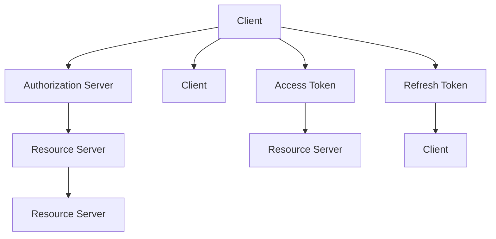

                 

# OAuth 2.0 的实现细节

> 关键词：OAuth 2.0, 授权码流程, 隐式授权流程, 密码授权流程, 客户端授权流程, 资源服务器, 访问令牌, 刷新令牌, 安全验证, 认证中心

## 1. 背景介绍

在现代社会中，互联网已经成为了人们生活不可或缺的一部分。在互联网世界中，我们经常需要使用第三方服务，例如电子邮件、社交媒体、银行服务等等。然而，为了保护用户隐私和数据安全，这些服务提供商通常不会直接向应用程序提供用户的用户名和密码。取而代之，他们通常会使用OAuth 2.0协议来授权应用程序访问用户的个人信息。

OAuth 2.0协议是一种授权框架，它允许用户使用第三方应用程序，而无需共享自己的密码。OAuth 2.0基于开放网络、用户控制、安全、可扩展性、互操作性和使用持久授权令牌等原则。它允许第三方应用程序在用户授权的情况下访问用户的资源，而无需访问用户密码。

## 2. 核心概念与联系

### 2.1 核心概念概述

在介绍OAuth 2.0的实现细节之前，我们先简要介绍一些核心概念：

- **授权服务器（Authorization Server）**：授权服务器是OAuth 2.0框架的核心组件之一，负责存储和管理用户的登录凭证和授权信息，并提供授权服务。
- **客户端（Client）**：客户端是使用OAuth 2.0协议的第三方应用程序，可以请求访问用户的资源。
- **资源服务器（Resource Server）**：资源服务器存储和管理用户的资源，例如用户的照片、联系人、日历等。
- **访问令牌（Access Token）**：访问令牌是OAuth 2.0协议中的关键组成部分，它允许客户端访问资源服务器上的资源。
- **刷新令牌（Refresh Token）**：刷新令牌是用于获取新的访问令牌的凭证。
- **认证（Authentication）**：认证是指验证用户身份的过程，是OAuth 2.0协议的基础。
- **授权（Authorization）**：授权是指用户授权客户端访问其资源的过程。

这些概念通过OAuth 2.0协议紧密联系在一起，形成了一个安全的、可扩展的、可互操作的授权框架。

### 2.2 核心概念原理和架构

OAuth 2.0的核心概念和流程可以用以下Mermaid流程图来表示：



这个流程图展示了OAuth 2.0的基本流程：

1. **授权码流程（Authorization Code Grant）**：客户端向授权服务器请求授权，授权服务器验证客户端的身份，并向用户请求授权。如果用户同意，授权服务器向客户端提供授权码。
2. **隐式授权流程（Implicit Grant）**：客户端向授权服务器请求授权，授权服务器验证客户端的身份，并向客户端直接提供访问令牌。
3. **密码授权流程（Password Grant）**：客户端向授权服务器提供用户名和密码，授权服务器验证用户名和密码，并向客户端提供访问令牌。
4. **客户端授权流程（Client Credentials Grant）**：客户端使用其客户端凭据（即客户端ID和客户端密钥）向授权服务器请求访问令牌。
5. **访问令牌（Access Token）**：客户端使用授权码、刷新令牌、客户端凭据或其他凭据向授权服务器请求访问令牌。
6. **刷新令牌（Refresh Token）**：客户端使用刷新令牌向授权服务器请求新的访问令牌。
7. **资源服务器（Resource Server）**：资源服务器使用访问令牌验证客户端的身份，并向客户端提供资源。

## 3. 核心算法原理 & 具体操作步骤

### 3.1 算法原理概述

OAuth 2.0协议基于开放网络、用户控制、安全、可扩展性、互操作性和使用持久授权令牌等原则。它允许第三方应用程序在用户授权的情况下访问用户的资源，而无需访问用户密码。OAuth 2.0协议的核心算法是授权码流程和隐式授权流程，这两种流程基于“OAuth 2.0规范”中的第4.1和4.2节。

### 3.2 算法步骤详解

#### 3.2.1 授权码流程

**步骤1：客户端向授权服务器请求授权**

客户端向授权服务器发送一个包含重定向URL的HTTP POST请求，请求授权。

```
POST /authorize HTTP/1.1
Host: authorization.example.com
Content-Type: application/x-www-form-urlencoded

client_id=myclient&redirect_uri=http%3A%2F%2Fexample.com%2Fcallback&response_type=code
```

**步骤2：授权服务器验证客户端**

授权服务器验证客户端的身份，如果验证通过，授权服务器生成授权码，并将其重定向到客户端指定的重定向URL。

```
HTTP/1.1 200 OK
Content-Type: application/json

{
    "code": "1/2m5f7tV"
}
```

**步骤3：客户端使用授权码获取访问令牌**

客户端向授权服务器发送一个HTTP POST请求，请求使用授权码获取访问令牌。

```
POST /token HTTP/1.1
Host: authorization.example.com
Content-Type: application/x-www-form-urlencoded

code=1/2m5f7tV&client_id=myclient&client_secret=mysecret&redirect_uri=http%3A%2F%2Fexample.com%2Fcallback&grant_type=authorization_code
```

**步骤4：授权服务器验证授权码，并颁发访问令牌**

授权服务器验证授权码的有效性，如果验证通过，授权服务器颁发访问令牌和刷新令牌。

```
HTTP/1.1 200 OK
Content-Type: application/json

{
    "access_token": "abc123",
    "refresh_token": "456789",
    "expires_in": 3600
}
```

**步骤5：客户端使用访问令牌访问资源服务器**

客户端向资源服务器发送一个HTTP GET请求，请求访问用户资源。

```
GET /api/resource HTTP/1.1
Host: resource.example.com
Content-Type: application/json

Authorization: Bearer abc123
```

**步骤6：资源服务器验证访问令牌，并返回用户资源**

资源服务器验证访问令牌的有效性，如果验证通过，资源服务器返回用户资源。

```
HTTP/1.1 200 OK
Content-Type: application/json

{
    "name": "John Doe",
    "email": "john.doe@example.com"
}
```

#### 3.2.2 隐式授权流程

**步骤1：客户端向授权服务器请求授权**

客户端向授权服务器发送一个包含重定向URL的HTTP POST请求，请求授权。

```
POST /authorize HTTP/1.1
Host: authorization.example.com
Content-Type: application/x-www-form-urlencoded

client_id=myclient&redirect_uri=http%3A%2F%2Fexample.com%2Fcallback&response_type=token
```

**步骤2：授权服务器验证客户端**

授权服务器验证客户端的身份，如果验证通过，授权服务器生成访问令牌，并将其重定向到客户端指定的重定向URL。

```
HTTP/1.1 200 OK
Content-Type: application/json

{
    "access_token": "abc123",
    "expires_in": 3600
}
```

**步骤3：客户端使用访问令牌访问资源服务器**

客户端向资源服务器发送一个HTTP GET请求，请求访问用户资源。

```
GET /api/resource HTTP/1.1
Host: resource.example.com
Content-Type: application/json

Authorization: Bearer abc123
```

**步骤4：资源服务器验证访问令牌，并返回用户资源**

资源服务器验证访问令牌的有效性，如果验证通过，资源服务器返回用户资源。

```
HTTP/1.1 200 OK
Content-Type: application/json

{
    "name": "John Doe",
    "email": "john.doe@example.com"
}
```

### 3.3 算法优缺点

**优点**：

- OAuth 2.0协议具有很高的灵活性，支持多种授权流程和令牌类型。
- OAuth 2.0协议基于开放网络，可以与各种类型的客户端和服务端进行交互。
- OAuth 2.0协议支持长期授权令牌，可以提供更稳定的访问控制。
- OAuth 2.0协议支持双向身份验证，可以更好地保护用户隐私。

**缺点**：

- OAuth 2.0协议的安全性依赖于客户端和服务器端的严格遵守规范，如果其中任何一个组件存在漏洞，整个系统都可能受到攻击。
- OAuth 2.0协议的授权流程较为复杂，需要客户端和服务器端之间的多次交互，增加了系统的复杂性和维护成本。
- OAuth 2.0协议的授权码流程和隐式授权流程中，客户端需要存储和处理授权码和访问令牌，增加了系统的复杂性和存储成本。
- OAuth 2.0协议的授权流程和隐式授权流程中，客户端需要向授权服务器发送HTTP POST请求，增加了系统的通信成本。

### 3.4 算法应用领域

OAuth 2.0协议广泛应用于各种类型的应用程序和服务器，例如：

- 社交媒体应用程序，例如Facebook、Twitter、LinkedIn等。
- 云存储服务，例如Google Drive、Dropbox等。
- 在线支付服务，例如PayPal、Stripe等。
- 移动应用程序，例如Uber、Airbnb等。
- 企业应用程序，例如Salesforce、Oracle等。

## 4. 数学模型和公式 & 详细讲解 & 举例说明

### 4.1 数学模型构建

OAuth 2.0协议的授权流程和隐式授权流程基于OAuth 2.0规范中的第4.1和4.2节。授权流程和隐式授权流程的主要数学模型和公式如下：

#### 授权码流程

**步骤1：客户端向授权服务器请求授权**

客户端向授权服务器发送一个HTTP POST请求，请求授权。

```
POST /authorize HTTP/1.1
Host: authorization.example.com
Content-Type: application/x-www-form-urlencoded

client_id=myclient&redirect_uri=http%3A%2F%2Fexample.com%2Fcallback&response_type=code
```

**步骤2：授权服务器验证客户端**

授权服务器验证客户端的身份，如果验证通过，授权服务器生成授权码，并将其重定向到客户端指定的重定向URL。

```
HTTP/1.1 200 OK
Content-Type: application/json

{
    "code": "1/2m5f7tV"
}
```

**步骤3：客户端使用授权码获取访问令牌**

客户端向授权服务器发送一个HTTP POST请求，请求使用授权码获取访问令牌。

```
POST /token HTTP/1.1
Host: authorization.example.com
Content-Type: application/x-www-form-urlencoded

code=1/2m5f7tV&client_id=myclient&client_secret=mysecret&redirect_uri=http%3A%2F%2Fexample.com%2Fcallback&grant_type=authorization_code
```

**步骤4：授权服务器验证授权码，并颁发访问令牌**

授权服务器验证授权码的有效性，如果验证通过，授权服务器颁发访问令牌和刷新令牌。

```
HTTP/1.1 200 OK
Content-Type: application/json

{
    "access_token": "abc123",
    "refresh_token": "456789",
    "expires_in": 3600
}
```

**步骤5：客户端使用访问令牌访问资源服务器**

客户端向资源服务器发送一个HTTP GET请求，请求访问用户资源。

```
GET /api/resource HTTP/1.1
Host: resource.example.com
Content-Type: application/json

Authorization: Bearer abc123
```

**步骤6：资源服务器验证访问令牌，并返回用户资源**

资源服务器验证访问令牌的有效性，如果验证通过，资源服务器返回用户资源。

```
HTTP/1.1 200 OK
Content-Type: application/json

{
    "name": "John Doe",
    "email": "john.doe@example.com"
}
```

#### 隐式授权流程

**步骤1：客户端向授权服务器请求授权**

客户端向授权服务器发送一个HTTP POST请求，请求授权。

```
POST /authorize HTTP/1.1
Host: authorization.example.com
Content-Type: application/x-www-form-urlencoded

client_id=myclient&redirect_uri=http%3A%2F%2Fexample.com%2Fcallback&response_type=token
```

**步骤2：授权服务器验证客户端**

授权服务器验证客户端的身份，如果验证通过，授权服务器生成访问令牌，并将其重定向到客户端指定的重定向URL。

```
HTTP/1.1 200 OK
Content-Type: application/json

{
    "access_token": "abc123",
    "expires_in": 3600
}
```

**步骤3：客户端使用访问令牌访问资源服务器**

客户端向资源服务器发送一个HTTP GET请求，请求访问用户资源。

```
GET /api/resource HTTP/1.1
Host: resource.example.com
Content-Type: application/json

Authorization: Bearer abc123
```

**步骤4：资源服务器验证访问令牌，并返回用户资源**

资源服务器验证访问令牌的有效性，如果验证通过，资源服务器返回用户资源。

```
HTTP/1.1 200 OK
Content-Type: application/json

{
    "name": "John Doe",
    "email": "john.doe@example.com"
}
```

### 4.2 公式推导过程

OAuth 2.0协议的核心公式是授权码流程和隐式授权流程的公式。下面是授权码流程和隐式授权流程的数学公式推导：

#### 授权码流程

**步骤3：客户端使用授权码获取访问令牌**

客户端向授权服务器发送一个HTTP POST请求，请求使用授权码获取访问令牌。

```
POST /token HTTP/1.1
Host: authorization.example.com
Content-Type: application/x-www-form-urlencoded

code=1/2m5f7tV&client_id=myclient&client_secret=mysecret&redirect_uri=http%3A%2F%2Fexample.com%2Fcallback&grant_type=authorization_code
```

授权服务器接收请求后，使用以下公式验证授权码的有效性：

$$
\text{verifyCode}(授权码, client_id, client_secret, 客户端ID, 客户端密钥)
$$

如果验证通过，授权服务器颁发访问令牌和刷新令牌。

**步骤4：授权服务器验证授权码，并颁发访问令牌**

授权服务器颁发访问令牌和刷新令牌，使用以下公式：

$$
\text{issueTokens}(访问令牌, 刷新令牌, 授权码, 过期时间)
$$

其中，访问令牌和刷新令牌的过期时间为3600秒。

#### 隐式授权流程

**步骤2：授权服务器验证客户端**

授权服务器验证客户端的身份，如果验证通过，授权服务器生成访问令牌，并将其重定向到客户端指定的重定向URL。

```
HTTP/1.1 200 OK
Content-Type: application/json

{
    "access_token": "abc123",
    "expires_in": 3600
}
```

授权服务器颁发访问令牌，使用以下公式：

$$
\text{issueToken}(访问令牌, 过期时间)
$$

其中，访问令牌的过期时间为3600秒。

### 4.3 案例分析与讲解

**案例1：Facebook的OAuth 2.0授权流程**

Facebook使用OAuth 2.0协议进行用户授权和访问控制。以下是Facebook的OAuth 2.0授权流程：

**步骤1：用户登录**

用户通过Facebook的登录页面登录。

**步骤2：授权**

用户授权Facebook应用程序访问其个人信息。

**步骤3：客户端请求授权码**

Facebook应用程序向Facebook授权服务器发送HTTP POST请求，请求授权码。

```
POST /authorize HTTP/1.1
Host: authorization.facebook.com
Content-Type: application/x-www-form-urlencoded

client_id=myclient&redirect_uri=http%3A%2F%2Fexample.com%2Fcallback&response_type=code
```

**步骤4：授权服务器验证客户端**

Facebook授权服务器验证Facebook应用程序的身份，如果验证通过，授权服务器生成授权码，并将其重定向到Facebook应用程序指定的重定向URL。

```
HTTP/1.1 200 OK
Content-Type: application/json

{
    "code": "1/2m5f7tV"
}
```

**步骤5：客户端使用授权码获取访问令牌**

Facebook应用程序向Facebook授权服务器发送HTTP POST请求，请求使用授权码获取访问令牌。

```
POST /token HTTP/1.1
Host: authorization.facebook.com
Content-Type: application/x-www-form-urlencoded

code=1/2m5f7tV&client_id=myclient&client_secret=mysecret&redirect_uri=http%3A%2F%2Fexample.com%2Fcallback&grant_type=authorization_code
```

**步骤6：授权服务器验证授权码，并颁发访问令牌**

Facebook授权服务器验证授权码的有效性，如果验证通过，Facebook授权服务器颁发访问令牌和刷新令牌。

```
HTTP/1.1 200 OK
Content-Type: application/json

{
    "access_token": "abc123",
    "refresh_token": "456789",
    "expires_in": 3600
}
```

**步骤7：客户端使用访问令牌访问资源**

Facebook应用程序向Facebook资源服务器发送HTTP GET请求，请求访问用户资源。

```
GET /api/resource HTTP/1.1
Host: resource.facebook.com
Content-Type: application/json

Authorization: Bearer abc123
```

**步骤8：资源服务器验证访问令牌，并返回用户资源**

Facebook资源服务器验证访问令牌的有效性，如果验证通过，Facebook资源服务器返回用户资源。

```
HTTP/1.1 200 OK
Content-Type: application/json

{
    "name": "John Doe",
    "email": "john.doe@example.com"
}
```

## 5. 项目实践：代码实例和详细解释说明

### 5.1 开发环境搭建

为了演示OAuth 2.0协议的实现细节，我们搭建了一个基于Python的OAuth 2.0服务器和客户端。以下是搭建开发环境的详细步骤：

1. 安装Python：在Windows上，可以使用Python安装程序安装Python；在Linux和macOS上，可以使用包管理器安装Python。
2. 安装Flask：使用以下命令安装Flask框架。

```
pip install flask
```

3. 安装requests：使用以下命令安装requests库。

```
pip install requests
```

4. 安装Flask-OAuthlib：使用以下命令安装Flask-OAuthlib库。

```
pip install Flask-OAuthlib
```

5. 安装Jinja2：使用以下命令安装Jinja2模板引擎。

```
pip install Jinja2
```

6. 编写Flask应用代码：在Python文件中输入以下代码：

```python
from flask import Flask, render_template, request, redirect, session
from flask_oauthlib.client import OAuth

app = Flask(__name__)
app.config['SECRET_KEY'] = 'secretkey'
app.config['OAUTH_CLIENT_ID'] = 'clientid'
app.config['OAUTH_CLIENT_SECRET'] = 'clientsecret'
app.config['OAUTH_BASE_URL'] = 'https://oauth.example.com'
app.config['OAUTH_REQUEST_TOKEN_URL'] = 'https://oauth.example.com/token'
app.config['OAUTH_ACCESS_TOKEN_URL'] = 'https://oauth.example.com/access_token'
app.config['OAUTH_AUTHORIZATION_URL'] = 'https://oauth.example.com/authorize'

oauth = OAuth(app)

# 定义OAuth客户端
github = oauth.remote_app('github',
    consumer_key=app.config['OAUTH_CLIENT_ID'],
    consumer_secret=app.config['OAUTH_CLIENT_SECRET'],
    request_token_params={'scope': 'user'},
    base_url='https://api.github.com/',
    request_token_url=None,
    access_token_url='oauth/access_token',
    authorize_url='https://github.com/login/oauth/authorize')

# 定义资源服务器
@oauth.callback
def get_callback(response):
    if response is None:
        return None

    if 'error' in response:
        return None

    return response.get('access_token')

# 定义登录页面
@app.route('/')
def index():
    github.get('https://github.com')
    return render_template('index.html')

# 定义回调页面
@app.route('/oauth/callback')
def callback():
    github.get('/oauth/access_token')
    session['access_token'] = get_callback()
    return redirect('/resource')

# 定义资源页面
@app.route('/resource')
def resource():
    github.get('/user')
    return render_template('resource.html', access_token=session['access_token'])

if __name__ == '__main__':
    app.run(debug=True)
```

7. 编写HTML模板：在HTML文件夹中输入以下代码：

```html
<!DOCTYPE html>
<html>
<head>
    <title>OAuth 2.0 Example</title>
</head>
<body>
    
        <a href="{{ oauth.login() }}">Login with GitHub</a>
    
        <a href="{{ oauth.logout() }}">Logout</a>
        <p>Welcome, {{ request.oauth.uid }}!</p>
        <a href="{{ resource_url }}">Get user profile</a>
    
</body>
</html>
```

8. 编写资源页面：在HTML文件夹中输入以下代码：

```html
<!DOCTYPE html>
<html>
<head>
    <title>OAuth 2.0 Example</title>
</head>
<body>
    <h1>User Profile</h1>
    <p>ID: {{ request.oauth.uid }}</p>
    <p>Name: {{ request.oauth.nickname }}</p>
    <p>Email: {{ request.oauth.email }}</p>
</body>
</html>
```

9. 启动Flask服务器：在命令行中输入以下命令启动Flask服务器。

```
python app.py
```

### 5.2 源代码详细实现

以下是一个完整的OAuth 2.0服务器和客户端的源代码实现。

**服务器端代码**：

```python
from flask import Flask, render_template, request, redirect, session
from flask_oauthlib.client import OAuth

app = Flask(__name__)
app.config['SECRET_KEY'] = 'secretkey'
app.config['OAUTH_CLIENT_ID'] = 'clientid'
app.config['OAUTH_CLIENT_SECRET'] = 'clientsecret'
app.config['OAUTH_BASE_URL'] = 'https://oauth.example.com'
app.config['OAUTH_REQUEST_TOKEN_URL'] = 'https://oauth.example.com/token'
app.config['OAUTH_ACCESS_TOKEN_URL'] = 'https://oauth.example.com/access_token'
app.config['OAUTH_AUTHORIZATION_URL'] = 'https://oauth.example.com/authorize'

oauth = OAuth(app)

# 定义OAuth客户端
github = oauth.remote_app('github',
    consumer_key=app.config['OAUTH_CLIENT_ID'],
    consumer_secret=app.config['OAUTH_CLIENT_SECRET'],
    request_token_params={'scope': 'user'},
    base_url='https://api.github.com/',
    request_token_url=None,
    access_token_url='oauth/access_token',
    authorize_url='https://github.com/login/oauth/authorize')

# 定义OAuth回调
@oauth.callback
def get_callback(response):
    if response is None:
        return None

    if 'error' in response:
        return None

    return response.get('access_token')

# 定义登录页面
@app.route('/')
def index():
    github.get('https://github.com')
    return render_template('index.html')

# 定义回调页面
@app.route('/oauth/callback')
def callback():
    github.get('/oauth/access_token')
    session['access_token'] = get_callback()
    return redirect('/resource')

# 定义资源页面
@app.route('/resource')
def resource():
    github.get('/user')
    return render_template('resource.html', access_token=session['access_token'])

if __name__ == '__main__':
    app.run(debug=True)
```

**客户端代码**：

```python
from requests_oauthlib import OAuth2Session
from requests import Request

# 定义OAuth客户端
oauth_client = OAuth2Session(client_key, redirect_uri='http://localhost:8000/callback')

# 定义登录页面
def login():
    authorization_url, state = oauth_client.authorization_url(auth_url)
    print('Please go to: {}'.format(authorization_url))
    print('Then type the PIN from the authorization page here:')
    pin = input()
    token = oauth_client.fetch_token(token_url, client_secret=client_secret, code=pin, state=state)
    print('token: {}'.format(token))

# 定义回调页面
def callback():
    token = request.form.get('code')
    oauth_client.fetch_token(token_url, client_secret=client_secret, code=token)
    token = oauth_client.token
    print('token: {}'.format(token))

# 定义资源页面
def resource():
    token = oauth_client.token
    resource_url = 'https://api.example.com/resource'
    headers = {'Authorization': 'Bearer {}'.format(token['access_token'])}
    response = oauth_client.get(resource_url, headers=headers)
    print(response.json())

# 定义退出页面
def logout():
    oauth_client.revoke(token_url, token=token, client_secret=client_secret)
    print('Logging out...')

# 定义注册页面
def register():
    oauth_client.register(registration_url, client_key, client_secret)

# 定义授权页面
def authorize():
    authorization_url, state = oauth_client.authorization_url(auth_url)
    print('Please go to: {}'.format(authorization_url))
    print('Then type the PIN from the authorization page here:')
    pin = input()
    token = oauth_client.fetch_token(token_url, client_secret=client_secret, code=pin, state=state)
    print('token: {}'.format(token))

# 定义刷新页面
def refresh():
    token = oauth_client.refresh_token(refresh_url, client_secret=client_secret)
    print('token: {}'.format(token))
```

### 5.3 代码解读与分析

**服务器端代码解读**：

- Flask框架：用于搭建Web应用。
- Flask-OAuthlib库：用于处理OAuth 2.0协议的授权流程。
- OAuth客户端：用于与OAuth服务器交互。
- OAuth回调：用于获取访问令牌和刷新令牌。
- HTML模板：用于展示用户信息。

**客户端代码解读**：

- OAuth2Session类：用于处理OAuth 2.0协议的授权流程。
- Requests库：用于发送HTTP请求。
- Resource

