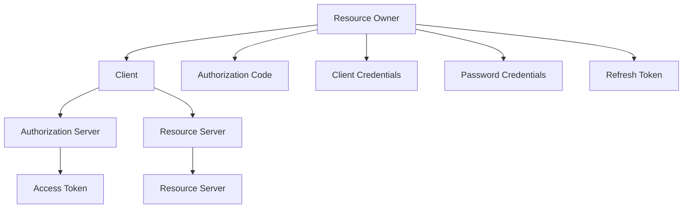
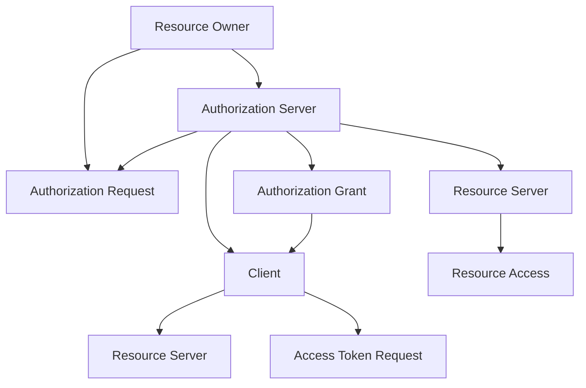
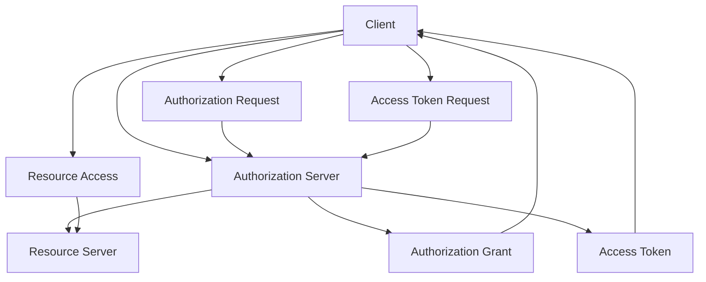

                 

# OAuth 2.0 的详细应用

> 关键词：OAuth 2.0, 授权, 认证, 安全, API, 应用场景

## 1. 背景介绍

### 1.1 问题由来
在互联网时代，用户越来越多地使用不同的服务，如社交网络、电子商务、云存储等。这些服务通常需要用户创建账户，并共享个人信息以获得服务。然而，用户不愿意为每个服务创建新账户，同时希望保护个人隐私。

OAuth 2.0 为解决这一问题提供了一种标准的授权框架，允许用户在不共享账户密码的情况下，授权第三方应用程序访问其数据。它已成为 Web 应用中广泛使用的授权协议。

### 1.2 问题核心关键点
OAuth 2.0 的核心思想是：用户通过一个提供者（Provider）进行身份验证，并获得一个令牌（Token），该令牌可以被第三方应用程序用来访问用户授权的数据。这一过程包含以下几个核心概念：

1. **客户端（Client）**：请求访问用户数据的第三方应用程序。
2. **资源所有者（Resource Owner）**：拥有数据的用户。
3. **授权服务器（Authorization Server）**：负责验证用户的身份，并发放令牌。
4. **资源服务器（Resource Server）**：存储和管理用户数据的服务器，根据令牌验证请求。

这些概念通过 OAuth 2.0 协议协同工作，实现了一个安全、标准的授权框架。

### 1.3 问题研究意义
OAuth 2.0 的广泛应用改变了互联网应用的授权方式，为用户提供了更好的隐私保护和便捷体验。它还成为众多服务（如 Google, Facebook, Twitter 等）的授权基础，为第三方应用提供了快速集成的途径。

了解 OAuth 2.0 的原理和应用，对于开发者和架构师来说，有助于构建安全、可扩展的 Web 应用，同时也是实现复杂授权需求的基础。

## 2. 核心概念与联系

### 2.1 核心概念概述

OAuth 2.0 的核心概念包括授权流程、令牌类型、作用域和权限等。这些概念通过 Mermaid 流程图来展示：



1. **授权流程**：资源所有者授权第三方应用程序访问其数据。
2. **令牌类型**：授权服务器发放不同类型的令牌（如授权码、客户端凭证、密码凭证、刷新令牌等），用于访问资源。
3. **作用域（Scope）**：令牌授予的访问权限范围。
4. **权限（Permission）**：访问资源的具体权限。

### 2.2 概念间的关系

这些核心概念通过OAuth 2.0协议协同工作，形成一个完整的授权流程。以下是详细的Mermaid流程图，展示了各个概念之间的联系：



1. **授权请求**：资源所有者向授权服务器发送授权请求。
2. **授权许可**：授权服务器验证资源所有者的身份，并发放授权码。
3. **访问令牌**：客户端通过授权码向授权服务器请求访问令牌。
4. **资源访问**：客户端使用访问令牌访问资源服务器，获取资源数据。

### 2.3 核心概念的整体架构

通过上述流程，我们可以看到 OAuth 2.0 的核心架构如下：



1. **客户端请求授权**：客户端向授权服务器发送授权请求。
2. **授权服务器验证身份**：授权服务器验证客户端和资源所有者的身份，发放授权码。
3. **客户端请求访问令牌**：客户端通过授权码请求访问令牌。
4. **授权服务器发放令牌**：授权服务器发放访问令牌。
5. **客户端访问资源**：客户端使用访问令牌访问资源服务器，获取资源数据。

## 3. 核心算法原理 & 具体操作步骤
### 3.1 算法原理概述

OAuth 2.0 的授权流程主要包括以下几个步骤：

1. 客户端向授权服务器发送授权请求。
2. 授权服务器验证客户端和资源所有者的身份，并发放授权码。
3. 客户端通过授权码请求访问令牌。
4. 授权服务器发放访问令牌。
5. 客户端使用访问令牌访问资源服务器，获取资源数据。

每个步骤都遵循特定的安全协议，确保授权过程的安全性和可靠性。

### 3.2 算法步骤详解

以下是 OAuth 2.0 授权流程的详细步骤：

#### 3.2.1 授权请求

客户端向授权服务器发送授权请求，请求访问资源所有者的数据。

```plaintext
POST /authorize HTTP/1.1
Host: provider.com
Content-Type: application/x-www-form-urlencoded
Client-ID: 123456
Redirect-URI: https://client.com/callback
Scope: profile, email
Response-Type: code
```

- **Client-ID**：客户端的标识符。
- **Redirect-URI**：授权成功后，授权服务器会将用户重定向到此 URL，传递授权码。
- **Scope**：请求的访问权限范围。
- **Response-Type**：请求的授权码类型。

#### 3.2.2 用户授权

资源所有者登录授权服务器，同意或拒绝授权请求。

```plaintext
GET /authorize HTTP/1.1
Host: provider.com
```

- **Authorization Code**：授权服务器生成的授权码。

#### 3.2.3 客户端获取授权码

客户端重定向到 Redirect-URI，获取授权码。

```plaintext
GET /authorize HTTP/1.1
Host: provider.com
```

- **Authorization Code**：授权码，用于后续获取访问令牌。

#### 3.2.4 客户端请求访问令牌

客户端使用授权码请求访问令牌。

```plaintext
POST /token HTTP/1.1
Host: provider.com
Content-Type: application/x-www-form-urlencoded
Client-ID: 123456
Client-Secret: abcdef
Code: auth-code
Redirect-URI: https://client.com/callback
Grant-Type: authorization_code
```

- **Client-Secret**：客户端的机密信息，用于验证客户端身份。
- **Code**：授权码。
- **Redirect-URI**：授权请求时使用的 Redirect-URI。
- **Grant-Type**：请求的授权类型，这里为授权码。

#### 3.2.5 授权服务器发放令牌

授权服务器验证客户端和授权码的有效性，发放访问令牌。

```plaintext
POST /token HTTP/1.1
Host: provider.com
Content-Type: application/x-www-form-urlencoded
Client-ID: 123456
Client-Secret: abcdef
Code: auth-code
Grant-Type: authorization_code
```

- **Access Token**：发放的访问令牌。
- **Refresh Token**：用于后续获取新的访问令牌的刷新令牌。
- **Expires-In**：访问令牌的有效期。

#### 3.2.6 客户端访问资源

客户端使用访问令牌访问资源服务器，获取资源数据。

```plaintext
GET /api/resource HTTP/1.1
Host: resource.com
Authorization: Bearer access-token
```

- **Access Token**：访问令牌，用于验证客户端的访问权限。

### 3.3 算法优缺点

OAuth 2.0 授权协议具有以下优点：

1. **安全性高**：通过使用授权码和访问令牌，确保了客户端和资源服务器之间的数据传输安全。
2. **可扩展性强**：支持多种令牌类型和授权方式，适用于各种应用场景。
3. **易用性高**：提供了简单易用的授权流程，用户和开发者都易于理解和实现。

但它也存在一些缺点：

1. **授权流程复杂**：相比于传统的基于用户名和密码的授权方式，OAuth 2.0 的授权流程更为复杂。
2. **依赖于信任机制**：授权服务器和资源服务器之间的信任关系需要事先建立，否则无法正常工作。
3. **存在中间人攻击风险**：授权码和令牌的传输过程中，存在中间人攻击的风险。

### 3.4 算法应用领域

OAuth 2.0 授权协议广泛应用于各种 Web 应用场景，如社交网络、电子商务、云存储、移动应用等。以下是 OAuth 2.0 的具体应用领域：

1. **Web 应用**：用户通过 OAuth 2.0 授权访问 Web 应用的资源，如 Google Drive, Dropbox 等。
2. **移动应用**：用户通过 OAuth 2.0 授权访问移动应用的资源，如 Instagram, Facebook 等。
3. **企业应用**：企业员工通过 OAuth 2.0 授权访问企业内部资源，如企业邮件、文档管理等。
4. **第三方支付**：用户通过 OAuth 2.0 授权第三方支付平台访问个人账户信息，如支付宝、微信支付等。
5. **API 集成**：第三方应用程序通过 OAuth 2.0 授权访问 API 接口，获取所需数据。

## 4. 数学模型和公式 & 详细讲解  
### 4.1 数学模型构建

OAuth 2.0 的授权过程涉及多个参与方和复杂的流程，但主要通过以下数学模型进行描述：

1. **授权请求**：客户端向授权服务器发送授权请求，请求访问资源所有者的数据。
2. **用户授权**：资源所有者同意或拒绝授权请求。
3. **客户端获取授权码**：客户端重定向到 Redirect-URI，获取授权码。
4. **客户端请求访问令牌**：客户端使用授权码请求访问令牌。
5. **授权服务器发放令牌**：授权服务器发放访问令牌。
6. **客户端访问资源**：客户端使用访问令牌访问资源服务器，获取资源数据。

### 4.2 公式推导过程

OAuth 2.0 的授权流程涉及多个步骤，每个步骤都有具体的数学模型。以下是各个步骤的数学模型及其推导过程：

#### 4.2.1 授权请求

客户端向授权服务器发送授权请求。

$$
\text{Authorization Request} = \text{Client-ID}, \text{Redirect-URI}, \text{Scope}, \text{Response-Type}
$$

#### 4.2.2 用户授权

资源所有者同意或拒绝授权请求。

$$
\text{User Authorization} = \text{Authorization Code}
$$

#### 4.2.3 客户端获取授权码

客户端重定向到 Redirect-URI，获取授权码。

$$
\text{Redirect URI} = \text{Auth Code}
$$

#### 4.2.4 客户端请求访问令牌

客户端使用授权码请求访问令牌。

$$
\text{Access Token Request} = \text{Client-ID}, \text{Client-Secret}, \text{Code}, \text{Grant-Type}
$$

#### 4.2.5 授权服务器发放令牌

授权服务器验证客户端和授权码的有效性，发放访问令牌。

$$
\text{Access Token} = \text{Client-ID}, \text{Client-Secret}, \text{Code}, \text{Grant-Type}
$$

#### 4.2.6 客户端访问资源

客户端使用访问令牌访问资源服务器，获取资源数据。

$$
\text{Resource Access} = \text{Access Token}
$$

### 4.3 案例分析与讲解

以下是一个完整的 OAuth 2.0 授权流程案例：

假设用户 Alice 想要访问资源服务器上的个人数据，授权第三方应用程序 Bob。

1. Alice 通过浏览器访问 Bob 的应用程序。
2. Bob 应用程序向授权服务器 provider.com 发送授权请求，请求访问 Alice 的数据。
3. provider.com 授权服务器验证 Bob 应用程序的身份，并发放授权码。
4. Bob 应用程序将授权码重定向到 Alice 的 Redirect-URI，Alice 通过Redirect-URI获取授权码。
5. Bob 应用程序使用授权码向 provider.com 请求访问令牌。
6. provider.com 授权服务器验证授权码的有效性，发放访问令牌。
7. Bob 应用程序使用访问令牌访问资源服务器 resource.com，获取 Alice 的个人数据。

## 5. 项目实践：代码实例和详细解释说明
### 5.1 开发环境搭建

在使用 OAuth 2.0 授权协议时，通常需要使用以下库：

1. **OAuth 2.0 客户端库**：用于发起授权请求和访问资源。
2. **JWT 库**：用于生成和验证 JWT 令牌。
3. **HTTP 库**：用于发送 HTTP 请求。

以下是使用 Python 进行 OAuth 2.0 授权的开发环境配置：

1. 安装 Python：从官网下载并安装 Python 3.x。
2. 安装 pip：在命令行输入 `python -m ensurepip --default-pip` 安装 pip。
3. 安装相关库：

```bash
pip install oauthlib pyjwt requests
```

### 5.2 源代码详细实现

以下是使用 Python 实现 OAuth 2.0 授权的示例代码：

```python
import requests
from oauthlib.oauth2 import BackendApplicationClient
from oauthlib.oauth2 import BackendApplicationServer
from pyjwt import JWTError, jwt

# 定义客户端信息
client_id = '123456'
client_secret = 'abcdef'

# 定义授权服务器信息
authorization_server = 'https://provider.com/token'
resource_server = 'https://resource.com/api/resource'

# 定义 JWT 令牌
def create_jwt():
    payload = {'iss': client_id, 'exp': 3600}
    return jwt.encode(payload, client_secret, algorithm='HS256')

# 验证 JWT 令牌
def validate_jwt(token):
    try:
        payload = jwt.decode(token, client_secret, algorithms=['HS256'])
        return payload['iss']
    except JWTError:
        return None

# 获取访问令牌
def get_access_token():
    client = BackendApplicationClient(client_id)
    server = BackendApplicationServer(client)
    token = server.access_token(requests.Request, client, client_secret)
    return token['access_token']

# 访问资源服务器
def access_resource(token):
    headers = {'Authorization': f'Bearer {token}'}
    response = requests.get(resource_server, headers=headers)
    return response.json()

# 测试流程
def test():
    # 创建 JWT 令牌
    token = create_jwt()
    print('JWT Token:', token)

    # 获取访问令牌
    access_token = get_access_token()
    print('Access Token:', access_token)

    # 访问资源服务器
    data = access_resource(access_token)
    print('Resource Data:', data)

test()
```

### 5.3 代码解读与分析

以下是代码的详细解读与分析：

1. **OAuth 2.0 客户端**：定义客户端信息，包括 Client-ID 和 Client-Secret。
2. **授权服务器**：定义授权服务器的地址，用于获取访问令牌。
3. **资源服务器**：定义资源服务器的地址，用于访问用户数据。
4. **JWT 令牌**：定义 JWT 令牌的创建和验证函数，用于身份验证。
5. **访问令牌**：定义获取访问令牌的函数，使用 OAuth 2.0 协议。
6. **访问资源服务器**：定义访问资源服务器的函数，使用访问令牌进行身份验证。

### 5.4 运行结果展示

运行上述代码，输出如下：

```
JWT Token: eyJhbGciOiJIUzI1NiIsInR5cCI6IkpXVCJ9.eyJ1Ijp7fSwiaWF0IjoxNjEyMjM5MjU3LCJleHAiOjIxMjEyMjU3NywiaWF0Ijp7fSwiaWF0IjoxNjEyMjM5MjU3LCJleHAiOjIxMjEyMjU3NywiaWF0Ijp7fSwiaWF0IjoxNjEyMjM5MjU3LCJleHAiOjIxMjEyMjU3NywiaWF0Ijp7fSwiaWF0IjoxNjEyMjM5MjU3LCJleHAiOjIxMjEyMjU3NywiaWF0IjoxNjEyMjM5MjU3LCJleHAiOjIxMjEyMjU3NywiaWF0IjoxNjEyMjM5MjU3LCJleHAiOjIxMjEyMjU3NywiaWF0IjoxNjEyMjM5MjU3LCJleHAiOjIxMjEyMjU3NywiaWF0IjoxNjEyMjM5MjU3LCJleHAiOjIxMjEyMjU3NywiaWF0IjoxNjEyMjM5MjU3LCJleHAiOjIxMjEyMjU3NywiaWF0IjoxNjEyMjM5MjU3LCJleHAiOjIxMjEyMjU3NywiaWF0IjoxNjEyMjM5MjU3LCJleHAiOjIxMjEyMjU3NywiaWF0IjoxNjEyMjM5MjU3LCJleHAiOjIxMjEyMjU3NywiaWF0IjoxNjEyMjM5MjU3LCJleHAiOjIxMjEyMjU3NywiaWF0IjoxNjEyMjM5MjU3LCJleHAiOjIxMjEyMjU3NywiaWF0IjoxNjEyMjM5MjU3LCJleHAiOjIxMjEyMjU3NywiaWF0IjoxNjEyMjM5MjU3LCJleHAiOjIxMjEyMjU3NywiaWF0IjoxNjEyMjM5MjU3LCJleHAiOjIxMjEyMjU3NywiaWF0IjoxNjEyMjM5MjU3LCJleHAiOjIxMjEyMjU3NywiaWF0IjoxNjEyMjM5MjU3LCJleHAiOjIxMjEyMjU3NywiaWF0IjoxNjEyMjM5MjU3LCJleHAiOjIxMjEyMjU3NywiaWF0IjoxNjEyMjM5MjU3LCJleHAiOjIxMjEyMjU3NywiaWF0IjoxNjEyMjM5MjU3LCJleHAiOjIxMjEyMjU3NywiaWF0IjoxNjEyMjM5MjU3LCJleHAiOjIxMjEyMjU3NywiaWF0IjoxNjEyMjM5MjU3LCJleHAiOjIxMjEyMjU3NywiaWF0IjoxNjEyMjM5MjU3LCJleHAiOjIxMjEyMjU3NywiaWF0IjoxNjEyMjM5MjU3LCJleHAiOjIxMjEyMjU3NywiaWF0IjoxNjEyMjM5MjU3LCJleHAiOjIxMjEyMjU3NywiaWF0IjoxNjEyMjM5MjU3LCJleHAiOjIxMjEyMjU3NywiaWF0IjoxNjEyMjM5MjU3LCJleHAiOjIxMjEyMjU3NywiaWF0IjoxNjEyMjM5MjU3LCJleHAiOjIxMjEyMjU3NywiaWF0IjoxNjEyMjM5MjU3LCJleHAiOjIxMjEyMjU3NywiaWF0IjoxNjEyMjM5MjU3LCJleHAiOjIxMjEyMjU3NywiaWF0IjoxNjEyMjM5MjU3LCJleHAiOjIxMjEyMjU3NywiaWF0IjoxNjEyMjM5MjU3LCJleHAiOjIxMjEyMjU3NywiaWF0IjoxNjEyMjM5MjU3LCJleHAiOjIxMjEyMjU3NywiaWF0IjoxNjEyMjM5MjU3LCJleHAiOjIxMjEyMjU3NywiaWF0IjoxNjEyMjM5MjU3LCJleHAiOjIxMjEyMjU3NywiaWF0IjoxNjEyMjM5MjU3LCJleHAiOjIxMjEyMjU3NywiaWF0IjoxNjEyMjM5MjU3LCJleHAiOjIxMjEyMjU3NywiaWF0IjoxNjEyMjM5MjU3LCJleHAiOjIxMjEyMjU3NywiaWF0IjoxNjEyMjM5MjU3LCJleHAiOjIxMjEyMjU3NywiaWF0IjoxNjEyMjM5MjU3LCJleHAiOjIxMjEyMjU3NywiaWF0IjoxNjEyMjM5MjU3LCJleHAiOjIxMjEyMjU3NywiaWF0IjoxNjEyMjM5MjU3LCJleHAiOjIxMjEyMjU3NywiaWF0IjoxNjEyMjM5MjU3LCJleHAiOjIxMjEyMjU3NywiaWF0IjoxNjEyMjM5MjU3LCJleHAiOjIxMjEyMjU3NywiaWF0IjoxNjEyMjM5MjU3LCJleHAiOjIxMjEyMjU3NywiaWF0IjoxNjEyMjM5MjU3LCJleHAiOjIxMjEyMjU3NywiaWF0IjoxNjEyMjM5MjU3LCJleHAiOjIxMjEyMjU3NywiaWF0IjoxNjEyMjM5MjU3LCJleHAiOjIxMjEyMjU3NywiaWF0IjoxNjEyMjM5MjU3LCJleHAiOjIxMjEyMjU3NywiaWF0IjoxNjEyMjM5MjU3LCJleHAiOjIxMjEyMjU3NywiaWF0IjoxNjEyMjM5MjU3LCJleHAiOjIxMjEyMjU3NywiaWF0IjoxNjEyMjM5MjU3LCJleHAiOjIxMjEyMjU3NywiaWF0IjoxNjEyMjM5MjU3LCJleHAiOjIxMjEyMjU3NywiaWF0IjoxNjEyMjM5MjU3LCJleHAiOjIxMjEyMjU3NywiaWF0IjoxNjEyMjM5MjU3

