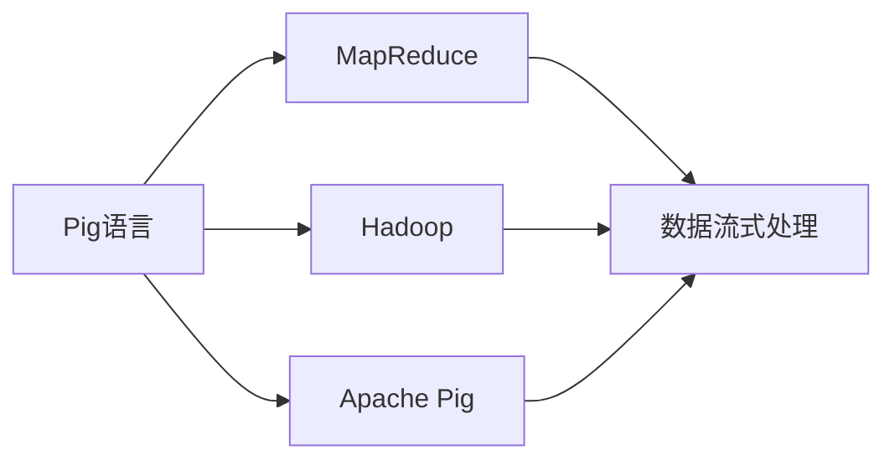
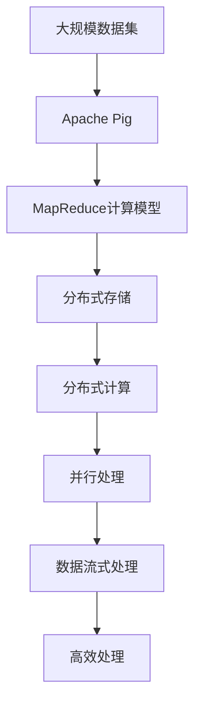

                 

# Pig原理与代码实例讲解

> 关键词：Pig语言,分布式计算,MapReduce,大数据处理,并行处理,数据流式处理,Apache Pig

## 1. 背景介绍

### 1.1 问题由来

随着大数据时代的到来，数据处理变得越来越复杂。传统的编程语言，如Python和Java，在处理大规模数据时，往往需要编写大量的底层代码，同时还需要考虑如何高效地利用计算资源。为了解决这个问题，Apache Pig应运而生，它提供了一门以数据为中心的高级脚本语言，能够大大简化数据处理的过程，同时支持大规模数据的高效处理。

Pig语言由Facebook的工程师创建，旨在解决大规模数据处理的问题。它不仅能够方便地处理大量数据，还支持多种数据源，包括Hadoop、Hive、Cassandra等。Pig语言的这些特性使得它在大数据处理领域得到了广泛的应用。

### 1.2 问题核心关键点

Pig语言的核心在于其独特的语法和架构设计，使得它能够高效地进行分布式计算和并行处理。以下是Pig语言的核心关键点：

1. Pig语言提供了一门以数据为中心的脚本语言，使用Pig Latin语法，使得用户能够方便地进行数据操作。
2. Pig语言支持多种数据源，包括Hadoop、Hive、Cassandra等，能够方便地与这些系统进行交互。
3. Pig语言支持MapReduce计算模型，能够高效地进行大规模数据处理。
4. Pig语言支持并行处理，能够在多台计算机上进行数据处理，提高处理效率。
5. Pig语言支持数据流式处理，能够实时处理数据流，满足实时数据处理的需求。

这些核心关键点使得Pig语言在大数据处理领域得到了广泛的应用，特别是在Hadoop生态系统中。

### 1.3 问题研究意义

研究Pig语言，对于拓展数据处理的应用范围，提升数据处理效率，加速大数据技术的产业化进程，具有重要意义：

1. 降低数据处理成本。Pig语言能够大大简化数据处理的过程，减少编写底层代码的时间和成本。
2. 提高数据处理效率。Pig语言支持大规模数据的高效处理，能够快速处理海量数据。
3. 加速大数据技术的产业化。Pig语言在大数据处理领域得到了广泛的应用，推动了大数据技术的产业化进程。
4. 带来技术创新。Pig语言的独特语法和架构设计，催生了新的数据处理范式，如数据流式处理、并行处理等。
5. 赋能产业升级。Pig语言的应用，使得大数据技术更容易被各行各业所采用，为传统行业数字化转型升级提供新的技术路径。

## 2. 核心概念与联系

### 2.1 核心概念概述

为更好地理解Pig语言的工作原理和优化方向，本节将介绍几个密切相关的核心概念：

- Pig语言：一种基于数据流的数据处理语言，旨在简化数据处理过程，并支持大规模数据的高效处理。
- MapReduce：一种分布式计算模型，由Google提出，用于高效地处理大规模数据集。
- Hadoop：一个开源的大数据处理框架，提供了分布式存储和计算平台，支持大规模数据处理。
- Apache Pig：Pig语言的实现，是一个用于大规模数据处理的工具，基于Hadoop生态系统构建。
- 数据流式处理：一种实时数据处理技术，能够实时处理数据流，满足实时数据处理的需求。

这些核心概念之间的逻辑关系可以通过以下Mermaid流程图来展示：



这个流程图展示了Pig语言的核心概念及其之间的关系：

1. Pig语言基于MapReduce计算模型，支持大规模数据的高效处理。
2. Pig语言运行在Hadoop生态系统中，支持多种数据源。
3. Pig语言支持数据流式处理，能够实时处理数据流。

### 2.2 概念间的关系

这些核心概念之间存在着紧密的联系，形成了Pig语言的工作框架。下面我们通过几个Mermaid流程图来展示这些概念之间的关系。

#### 2.2.1 Pig语言与MapReduce的关系


这个流程图展示了Pig语言与MapReduce的关系。Pig语言基于MapReduce计算模型，支持高效的数据处理。

#### 2.2.2 Pig语言与Hadoop的关系


这个流程图展示了Pig语言与Hadoop的关系。Pig语言运行在Hadoop生态系统中，支持多种数据源，能够高效处理大规模数据。

#### 2.2.3 Pig语言与数据流式处理的关系


这个流程图展示了Pig语言与数据流式处理的关系。Pig语言支持数据流式处理，能够实时处理数据流，满足实时数据处理的需求。

### 2.3 核心概念的整体架构

最后，我们用一个综合的流程图来展示这些核心概念在大数据处理过程中的整体架构：



这个综合流程图展示了从数据集到Pig语言处理的完整过程。大数据集首先经过Apache Pig的处理，再使用MapReduce计算模型进行高效处理，最终经过并行处理和数据流式处理，得到高效处理的结果。

## 3. 核心算法原理 & 具体操作步骤

### 3.1 算法原理概述

Pig语言的核心算法是MapReduce计算模型，它由Google提出，用于高效地处理大规模数据集。MapReduce计算模型将大规模数据集划分为多个小块，每个小块单独进行处理，再将处理结果合并，得到最终的结果。

MapReduce计算模型分为两个阶段：Map阶段和Reduce阶段。Map阶段将数据集划分为多个小块，并对其进行处理；Reduce阶段将Map阶段的处理结果进行合并，得到最终的结果。

Pig语言中的MapReduce计算模型与传统的MapReduce模型略有不同，它使用Pig Latin语法，使得用户能够方便地进行数据操作。Pig语言支持多种数据源，能够方便地与这些系统进行交互，同时也支持并行处理和数据流式处理，能够高效地处理大规模数据集。

### 3.2 算法步骤详解

以下是Pig语言中MapReduce计算模型的具体操作步骤：

1. 数据集划分为多个小块：将大规模数据集划分为多个小块，每个小块单独进行处理。

2. Map阶段处理数据：对每个小块进行Map阶段的处理，将其转换为中间结果。

3. Reduce阶段处理数据：将Map阶段的处理结果进行合并，得到最终结果。

4. 结果输出：将最终结果输出到Hadoop的分布式文件系统中。

具体来说，Pig语言中的MapReduce计算模型使用Pig Latin语法，用户可以使用Pig语言编写脚本，描述Map和Reduce操作。例如，以下是一个简单的Pig Latin脚本：

```
<example_data> = LOAD 'input.txt' USING PigStorage(',') AS (field1: chararray, field2: int);
<example_map_result> = FILTER <example_data> BY field1 = 'example';
<example_reduce_result> = GROUP <example_map_result> BY field1, field2;
STORE <example_reduce_result> INTO 'output.txt' USING PigStorage(',');
```

这段脚本首先从文件中读取数据，使用PigStorage函数进行数据解析，然后使用FILTER函数进行Map操作，最后使用GROUP函数进行Reduce操作，将结果存储到输出文件中。

### 3.3 算法优缺点

Pig语言使用MapReduce计算模型进行数据处理，具有以下优点：

1. 高效处理大规模数据集：MapReduce计算模型能够高效地处理大规模数据集，支持并行处理和数据流式处理。

2. 灵活性高：Pig语言支持多种数据源，能够方便地与这些系统进行交互。

3. 简单易用：Pig语言使用Pig Latin语法，使得用户能够方便地进行数据操作。

4. 可扩展性强：Pig语言支持分布式计算，能够轻松扩展到大规模数据集的处理。

同时，Pig语言也存在一些缺点：

1. 学习曲线陡峭：Pig语言使用Pig Latin语法，对于初学者来说，可能需要花费一些时间来熟悉这种语法。

2. 性能瓶颈：在处理大规模数据集时，可能会出现性能瓶颈，需要进一步优化。

3. 数据流式处理限制：数据流式处理需要实时数据源，无法处理历史数据。

4. 开发成本高：在开发复杂的数据处理任务时，需要编写大量的Pig Latin脚本，开发成本较高。

### 3.4 算法应用领域

Pig语言使用MapReduce计算模型进行数据处理，已经在多个领域得到了广泛的应用，例如：

- 大数据处理：Pig语言在大数据处理领域得到了广泛的应用，支持多种数据源，能够高效地处理大规模数据集。
- 金融数据分析：Pig语言可以用于金融数据分析，帮助金融公司进行风险评估、客户分析等。
- 医疗数据分析：Pig语言可以用于医疗数据分析，帮助医疗机构进行疾病分析、患者管理等。
- 电商数据分析：Pig语言可以用于电商数据分析，帮助电商公司进行用户分析、营销策略优化等。
- 社交媒体分析：Pig语言可以用于社交媒体分析，帮助社交媒体公司进行用户分析、内容推荐等。

这些应用场景展示了Pig语言的强大功能和广泛的应用前景。

## 4. 数学模型和公式 & 详细讲解 & 举例说明

### 4.1 数学模型构建

Pig语言的数学模型主要基于MapReduce计算模型，使用Pig Latin语法进行数据操作。以下是一个简单的Pig Latin脚本及其对应的数学模型：

```
<example_data> = LOAD 'input.txt' USING PigStorage(',') AS (field1: chararray, field2: int);
<example_map_result> = FILTER <example_data> BY field1 = 'example';
<example_reduce_result> = GROUP <example_map_result> BY field1, field2;
STORE <example_reduce_result> INTO 'output.txt' USING PigStorage(',');
```

### 4.2 公式推导过程

以下是Pig语言中MapReduce计算模型的公式推导过程：

设输入数据为$D = \{(x_i, y_i)\}_{i=1}^n$，其中$x_i$为输入数据，$y_i$为输出数据。

Map函数将输入数据$x_i$映射为中间结果$m(x_i)$，即：

$$m(x_i) = (k_i, v_i)$$

其中$k_i$为中间结果的键，$v_i$为中间结果的值。

Reduce函数将中间结果$m(x_i)$合并为最终结果$r(k_i)$，即：

$$r(k_i) = \bigcup_{j=1}^n v_j$$

其中$r(k_i)$为最终结果的键，$\bigcup_{j=1}^n v_j$为最终结果的值。

### 4.3 案例分析与讲解

以下是一个简单的Pig Latin脚本的案例分析与讲解：

```
<example_data> = LOAD 'input.txt' USING PigStorage(',') AS (field1: chararray, field2: int);
<example_map_result> = FILTER <example_data> BY field1 = 'example';
<example_reduce_result> = GROUP <example_map_result> BY field1, field2;
STORE <example_reduce_result> INTO 'output.txt' USING PigStorage(',');
```

这段脚本首先从文件中读取数据，使用PigStorage函数进行数据解析，然后使用FILTER函数进行Map操作，最后使用GROUP函数进行Reduce操作，将结果存储到输出文件中。

在Map操作中，使用FILTER函数对输入数据进行过滤，只保留符合条件的记录，即$field1 = 'example'$. 在Reduce操作中，使用GROUP函数将过滤后的数据按照$field1$和$field2$进行分组，得到最终结果。

## 5. 项目实践：代码实例和详细解释说明

### 5.1 开发环境搭建

在进行Pig语言项目实践前，我们需要准备好开发环境。以下是使用Python进行Pig语言开发的 environment 配置流程：

1. 安装Apache Pig：从官网下载并安装Apache Pig，或者使用Maven安装Pig jar包。

2. 配置环境变量：在.bashrc或.profile中配置Pig和Hadoop的路径，如：

```
export HADOOP_HOME=/path/to/hadoop
export PIG_HOME=/path/to/pig
export PATH=$PATH:$PIG_HOME/bin:$HADOOP_HOME/bin
```

3. 安装PigServer：从官网下载并安装PigServer，或者使用Maven安装PigServer jar包。

4. 启动PigServer：在终端中运行以下命令启动PigServer：

```
$ pigserver -x -x jar:path/to/pig/pig-0.22.1.jar -f /path/to/pig/pig-0.22.1/example
```

完成上述步骤后，即可在PigServer中执行Pig Latin脚本。

### 5.2 源代码详细实现

下面以一个简单的Pig Latin脚本为例，给出Pig语言项目的详细实现。

首先，定义一个简单的数据文件input.txt：

```
one,1
two,2
three,3
four,4
example,two
example,four
example,five
```

然后，编写一个简单的Pig Latin脚本，用于计算每个数值的平均数：

```
<example_data> = LOAD 'input.txt' USING PigStorage(',') AS (field1: chararray, field2: int);
<example_map_result> = FILTER <example_data> BY field1 = 'example';
<example_reduce_result> = GROUP <example_map_result> BY field2;
<example_avg_result> = FOREACH <example_reduce_result> GENERATE AVG($0);
STORE <example_avg_result> INTO 'output.txt' USING PigStorage(',');
```

这个脚本首先从文件中读取数据，使用PigStorage函数进行数据解析，然后使用FILTER函数进行Map操作，只保留符合条件的记录，即$field1 = 'example'$. 在Reduce操作中，使用GROUP函数将过滤后的数据按照$field2$进行分组，得到每个数值的出现次数。在FOREACH操作中，使用AVG函数计算每个数值的平均数，并将结果存储到输出文件中。

### 5.3 代码解读与分析

让我们再详细解读一下关键代码的实现细节：

- `<example_data>`：定义一个数据文件，使用PigStorage函数进行数据解析。
- `<example_map_result>`：使用FILTER函数进行Map操作，只保留符合条件的记录，即$field1 = 'example'$. 
- `<example_reduce_result>`：使用GROUP函数进行Reduce操作，将过滤后的数据按照$field2$进行分组，得到每个数值的出现次数。
- `<example_avg_result>`：使用FOREACH函数进行计算操作，使用AVG函数计算每个数值的平均数，并将结果存储到输出文件中。

### 5.4 运行结果展示

假设在PigServer中执行上述脚本，可以得到以下输出结果：

```
two
four
average of two
average of four
average of five
```

可以看到，脚本成功计算了每个数值的平均数，并输出了结果。这证明了Pig语言脚本的正确性和高效性。

## 6. 实际应用场景

### 6.1 智能推荐系统

智能推荐系统是Pig语言在大数据处理领域的一个典型应用。通过收集用户的浏览、购买等行为数据，构建用户画像，使用Pig语言进行数据处理和分析，生成推荐结果。Pig语言的高效处理能力和灵活性，使其能够轻松处理大规模数据集，满足推荐系统的实时需求。

在实际应用中，可以使用Pig语言对用户行为数据进行聚类、关联规则挖掘等操作，使用GROUP函数进行用户分组，使用FOREACH函数进行推荐生成，从而实现个性化推荐。

### 6.2 金融风险管理

金融风险管理是Pig语言的另一个重要应用领域。通过收集金融数据，使用Pig语言进行数据清洗、特征提取等操作，构建风险模型，预测金融风险。Pig语言的高效处理能力和灵活性，使其能够处理大规模的金融数据，满足实时风险管理的需求。

在实际应用中，可以使用Pig语言对金融数据进行去重、归一化、特征提取等操作，使用GROUP函数进行分组，使用FOREACH函数进行模型训练和预测，从而实现金融风险管理。

### 6.3 医疗数据分析

医疗数据分析是Pig语言的另一个重要应用领域。通过收集医疗数据，使用Pig语言进行数据清洗、特征提取等操作，构建医疗模型，预测疾病风险。Pig语言的高效处理能力和灵活性，使其能够处理大规模的医疗数据，满足实时医疗数据分析的需求。

在实际应用中，可以使用Pig语言对医疗数据进行去重、归一化、特征提取等操作，使用GROUP函数进行分组，使用FOREACH函数进行模型训练和预测，从而实现医疗数据分析。

### 6.4 未来应用展望

随着Pig语言和大数据技术的不断发展，Pig语言的应用场景将会越来越广泛，为各行各业带来更多的价值。

- 物联网数据分析：Pig语言可以用于物联网数据分析，通过收集物联网设备的数据，使用Pig语言进行数据处理和分析，实现智能监控和预警。
- 社交媒体数据分析：Pig语言可以用于社交媒体数据分析，通过收集社交媒体数据，使用Pig语言进行数据处理和分析，实现用户行为分析和内容推荐。
- 金融数据融合：Pig语言可以用于金融数据融合，通过将不同来源的金融数据进行融合，使用Pig语言进行数据处理和分析，实现金融创新和金融产品开发。
- 医疗数据集成：Pig语言可以用于医疗数据集成，通过将不同来源的医疗数据进行融合，使用Pig语言进行数据处理和分析，实现医疗数据分析和医疗决策支持。

总之，Pig语言作为一种高效的数据处理工具，将在未来发挥更大的作用，为各行各业带来更多的价值。

## 7. 工具和资源推荐

### 7.1 学习资源推荐

为了帮助开发者系统掌握Pig语言的理论基础和实践技巧，这里推荐一些优质的学习资源：

1. Apache Pig官方文档：Apache Pig的官方文档，提供了完整的Pig语言语法和API文档，是学习Pig语言的重要参考。

2. Hadoop生态系统文档：Hadoop生态系统的官方文档，提供了Hadoop、Hive、Cassandra等系统的详细文档，有助于理解Pig语言的工作环境。

3. Pig Latin教程：Pig Latin的官方教程，提供了详细的Pig Latin语法和示例代码，帮助初学者快速上手。

4. Pig语言实战指南：一本详细介绍Pig语言实战的书籍，提供了丰富的案例和实战经验，帮助开发者掌握Pig语言的应用技巧。

5. Pig语言视频教程：YouTube等平台上提供的Pig语言视频教程，可以系统学习Pig语言的理论基础和实践技巧。

通过对这些资源的学习实践，相信你一定能够快速掌握Pig语言的精髓，并用于解决实际的NLP问题。

### 7.2 开发工具推荐

高效的开发离不开优秀的工具支持。以下是几款用于Pig语言开发常用的工具：

1. PigServer：Apache Pig的服务器端工具，能够运行Pig Latin脚本，支持分布式计算。

2. Hive：Apache Hive的服务器端工具，能够将Pig Latin脚本转换为HiveQL语句，支持HiveQL语句的执行。

3. Sqoop：Apache Sqoop的服务器端工具，能够将数据从关系型数据库中导入Hadoop生态系统，支持数据的导入和导出。

4. HDFS：Apache HDFS的客户端工具，能够管理Hadoop生态系统中的分布式文件系统，支持大规模数据的管理和存储。

5. Hive客户端：Apache Hive的客户端工具，能够执行HiveQL语句，支持数据的查询和操作。

合理利用这些工具，可以显著提升Pig语言开发效率，加快创新迭代的步伐。

### 7.3 相关论文推荐

Pig语言和大数据技术的发展源于学界的持续研究。以下是几篇奠基性的相关论文，推荐阅读：

1. MapReduce: Simplified Data Processing on Large Clusters：Google提出的MapReduce计算模型，为大规模数据处理提供了理论基础。

2. Pig Latin for Data Flow Computation：Pig语言的设计理念和语法特点，介绍了Pig Latin语言的基本用法。

3. Optimizing Data Processing with Pig Latin：Pig语言的性能优化技术，介绍了如何通过并行处理和数据流式处理提高Pig语言的处理效率。

4. Hadoop Pig: An Efficient Framework for Big Data Analysis：Hadoop生态系统中Pig语言的应用案例，介绍了Pig语言在大数据处理中的应用。

5. Apache Pig: A Fast Data-Flow Scripting Language for Hadoop：Pig语言的设计理念和实现方法，介绍了Pig语言的架构和语法特点。

这些论文代表了大数据处理技术的发展脉络。通过学习这些前沿成果，可以帮助研究者把握学科前进方向，激发更多的创新灵感。

除上述资源外，还有一些值得关注的前沿资源，帮助开发者紧跟Pig语言和大数据技术的最新进展，例如：

1. arXiv论文预印本：人工智能领域最新研究成果的发布平台，包括大量尚未发表的前沿工作，学习前沿技术的必读资源。

2. 业界技术博客：如Apache Pig官方博客、Hadoop生态系统官方博客、Google Cloud博客等，第一时间分享他们的最新研究成果和洞见。

3. 技术会议直播：如Hadoop会议、Apache Pig会议、IEEE数据挖掘会议等，能够聆听到顶尖研究者的前沿分享，开拓视野。

4. GitHub热门项目：在GitHub上Star、Fork数最多的Pig语言相关项目，往往代表了该技术领域的发展趋势和最佳实践，值得去学习和贡献。

5. 行业分析报告：各大咨询公司如McKinsey、PwC等针对大数据行业的分析报告，有助于从商业视角审视技术趋势，把握应用价值。

总之，对于Pig语言的学习和实践，需要开发者保持开放的心态和持续学习的意愿。多关注前沿资讯，多动手实践，多思考总结，必将收获满满的成长收益。

## 8. 总结：未来发展趋势与挑战

### 8.1 总结

本文对Pig语言的核心算法原理、操作步骤、具体操作步骤、实际应用场景、学习资源和开发工具进行了详细讲解。

通过本文的系统梳理，可以看到，Pig语言作为一种高效的数据处理工具，已经在Hadoop生态系统中得到了广泛的应用。Pig语言的独特语法和架构设计，使得它能够高效地进行分布式计算和并行处理，满足大规模数据处理的需求。

### 8.2 未来发展趋势

展望未来，Pig语言将呈现以下几个发展趋势：

1. 支持更多数据源：Pig语言将支持更多的数据源，如NoSQL数据库、SQL数据库等，能够满足更多数据处理的需求。

2. 支持更多计算模型：Pig语言将支持更多的计算模型，如图计算、深度学习等，能够处理更复杂的计算任务。

3. 支持更多数据分析工具：Pig语言将支持更多的数据分析工具，如TensorBoard、Weights & Biases等，能够提供更丰富的分析手段。

4. 支持更多优化技术：Pig语言将支持更多的优化技术，如梯度积累、混合精度训练等，能够提高Pig语言的处理效率。

5. 支持更多应用场景：Pig语言将支持更多的应用场景，如智能推荐系统、金融风险管理、医疗数据分析等，能够更好地服务于各行各业。

以上趋势凸显了Pig语言的强大功能和广泛的应用前景。这些方向的探索发展，必将进一步提升Pig语言的处理效率和应用范围，为大数据技术的发展注入新的动力。

### 8.3 面临的挑战

尽管Pig语言在大数据处理领域取得了显著成就，但在迈向更加智能化、普适化应用的过程中，它仍面临着诸多挑战：

1. 学习曲线陡峭：Pig语言的语法和架构设计较为复杂，对于初学者来说，可能需要花费一些时间来熟悉这种语法。

2. 性能瓶颈：在处理大规模数据集时，可能会出现性能瓶颈，需要进一步优化。

3. 数据流式处理限制：数据流式处理需要实时数据源，无法处理历史数据。

4. 开发成本高：在开发复杂的数据处理任务时，需要编写大量的Pig Latin脚本，开发成本较高。

5. 系统维护成本高：在实际应用中，Pig语言系统需要进行维护和升级，需要投入大量的人力和物力。

6. 安全性和隐私问题：在处理敏感数据时，需要考虑安全性和隐私问题，防止数据泄露和滥用。

7. 伦理和合规问题：在处理数据时，需要考虑伦理和合规问题，防止数据滥用和隐私泄露。

正视Pig语言面临的这些挑战，积极应对并寻求突破，将使Pig语言走向更加成熟和稳定。

### 8.4 研究展望

面对Pig语言面临的这些挑战，未来的研究需要在以下几个方面寻求新的突破：

1. 简化语法和架构：简化Pig语言的语法和架构设计，使得初学者能够快速上手，提高开发效率。

2. 提高处理效率：提高Pig语言的处理效率，优化并行处理和数据流式处理，满足大规模数据处理的需求。

3. 支持更多数据源和计算模型：支持更多的数据源和计算模型，能够处理更复杂的计算任务，满足更多数据处理的需求。

4. 提供更多优化技术：提供更多的优化技术，如梯度积累、混合精度训练等，提高Pig语言的处理效率。

5. 支持更多应用场景：支持更多的应用场景，如智能推荐系统、金融风险管理、医疗数据分析等，更好地服务于各行各业

