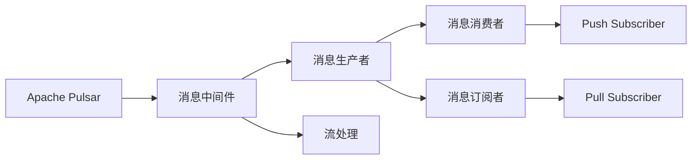
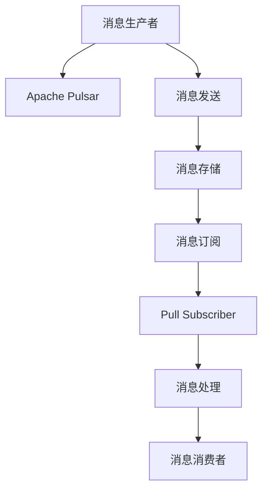

                 

# Pulsar Producer原理与代码实例讲解

> 关键词：Pulsar, Apache Pulsar, Apache Kafka, Producer, Streaming Data, Message Streaming

## 1. 背景介绍

### 1.1 问题由来
Apache Pulsar是Apache软件基金会的一个分布式流数据平台，与Apache Kafka有很强的兼容性和兼容性，成为很多企业级数据流系统的选择。其中，Pulsar Producer是Pulsar中的一个关键组件，用于将消息发送至Pulsar集群中。然而，对于想要快速上手Pulsar开发的企业，了解其内部原理和实现细节是必要的，本文将详细介绍Pulsar Producer的原理，并通过代码实例讲解其实现过程。

### 1.2 问题核心关键点
Pulsar Producer的实现涉及到消息发送、消息中间件、流处理等核心概念。在实际开发中，开发者需要关注以下几个关键点：

- **消息发送**：了解消息发送的流程、机制和性能优化方式。
- **消息中间件**：掌握Apache Pulsar的消息中间件架构和原理。
- **流处理**：熟悉Apache Pulsar的流处理模型和数据订阅机制。
- **接口和配置**：熟悉Pulsar Producer提供的接口和配置选项，以便于开发和部署。

### 1.3 问题研究意义
了解Pulsar Producer的原理和实现，可以帮助开发者深入理解Pulsar生态系统的内部机制，提升开发效率和系统性能。同时，Pulsar Producer是Pulsar流数据平台的重要组成部分，掌握其原理和实现，也有助于开发更高效、更稳定、更可靠的消息流系统。

## 2. 核心概念与联系

### 2.1 核心概念概述

为更好地理解Pulsar Producer的工作原理，我们先介绍几个核心概念：

- **Apache Pulsar**：Apache Pulsar是一个开源分布式流数据平台，提供消息传递、数据存储和流处理功能。Pulsar支持多个消息生产者、消费者和订阅者之间的消息传递，具有高吞吐量、高可用性和可扩展性。

- **Apache Kafka**：Apache Kafka是另一个流行的分布式消息系统，具有高性能和可靠性，广泛应用于企业级数据流处理。虽然Pulsar与Kafka有很强的兼容性和兼容性，但二者在架构和功能上存在一些差异。

- **消息中间件**：消息中间件是一种在分布式系统中用于传递、存储和处理消息的软件系统，广泛应用于数据采集、传输、存储、处理和分析等领域。Pulsar和Kafka都是消息中间件的代表。

- **消息生产者**：消息生产者负责将消息发送至消息中间件中。Pulsar Producer是Pulsar中的消息生产者，用于将消息发送至Pulsar集群中。

- **消息消费者**：消息消费者负责从消息中间件中读取消息，并进行处理。在Pulsar中，消息消费者分为两种类型：Pull Subscriber和Push Subscriber。

- **消息订阅者**：消息订阅者负责订阅消息，并对其进行相应的处理。Pulsar中的消息订阅者通常使用Pull Subscriber。

这些核心概念之间通过消息传递、数据存储和流处理等机制，构成了Pulsar Producer的核心工作机制。

### 2.2 概念间的关系

这些核心概念之间的联系可以通过以下Mermaid流程图来展示：



这个流程图展示了Pulsar生态系统中的关键组件及其关系：

1. Apache Pulsar作为一个消息中间件平台，支持多种消息生产者和消费者。
2. Pulsar Producer是消息生产者的一种，用于将消息发送至Pulsar集群中。
3. 消息消费者分为Pull Subscriber和Push Subscriber两种类型。
4. Pull Subscriber是主要的消息订阅者，负责从Pulsar集群中订阅消息并进行处理。
5. 流处理是Pulsar的一个核心功能，支持复杂的数据流处理任务。

### 2.3 核心概念的整体架构

最后，我们用一个综合的流程图来展示这些核心概念在Pulsar Producer中的整体架构：



这个综合流程图展示了Pulsar Producer的整体架构，其中：

1. 消息生产者将消息发送至Apache Pulsar。
2. 消息存储在Apache Pulsar集群中。
3. 消息订阅者从Apache Pulsar中订阅消息。
4. Pull Subscriber是主要的消息订阅者，负责处理订阅到的消息。
5. 消息处理完毕后，再由消息消费者处理。

通过这些核心概念和关系的介绍，我们了解了Pulsar Producer的基本架构和工作机制。接下来，我们将深入探索Pulsar Producer的内部原理和实现细节。

## 3. 核心算法原理 & 具体操作步骤
### 3.1 算法原理概述

Pulsar Producer的工作原理可以分为以下几个步骤：

1. **建立连接**：Pulsar Producer首先需要连接到Pulsar集群中的Broker，建立一个持久化的连接。
2. **创建主题**：在连接到Broker后，Pulsar Producer需要创建一个或多个主题，主题是Pulsar中的消息命名空间，用于标识不同的消息流。
3. **发送消息**：Pulsar Producer使用CreateMessage接口向主题中发送消息，消息可以包含键值对、字节数组等多种类型的数据。
4. **消息处理**：Pulsar Producer将发送的消息经过多个中间件层处理，最终到达Broker中的主题。
5. **消息订阅**：订阅者从Broker的主题中订阅消息，并处理消息。

### 3.2 算法步骤详解

#### 3.2.1 建立连接
Pulsar Producer建立连接的步骤如下：

1. **配置参数**：Pulsar Producer需要配置一些参数，如Broker地址、主题名称、认证信息等。
2. **创建Client**：根据配置参数创建一个Client对象，用于与Broker进行通信。
3. **连接Broker**：Client对象连接到Broker，建立一个持久的连接。

代码实现如下：

```java
PulsarClient pulsarClient = PulsarClient.builder()
    .serviceUrl("pulsar://broker1:6650/pulsar")
    .build();

// 设置认证信息
pulsarClient.authentication(PulsarClientAuthFactory.token("token"))
    .execute();

// 连接到Broker
pulsarClient.connect();
```

#### 3.2.2 创建主题
在连接到Broker后，Pulsar Producer需要创建一个或多个主题，用于标识不同的消息流。

```java
PulsarClient pulsarClient = PulsarClient.builder()
    .serviceUrl("pulsar://broker1:6650/pulsar")
    .build();

// 设置认证信息
pulsarClient.authentication(PulsarClientAuthFactory.token("token"))
    .execute();

// 连接到Broker
pulsarClient.connect();

// 创建主题
pulsarClient.createTopic("my-topic", new TopicMetadata());
```

#### 3.2.3 发送消息
Pulsar Producer使用CreateMessage接口向主题中发送消息，消息可以包含键值对、字节数组等多种类型的数据。

```java
PulsarClient pulsarClient = PulsarClient.builder()
    .serviceUrl("pulsar://broker1:6650/pulsar")
    .build();

// 设置认证信息
pulsarClient.authentication(PulsarClientAuthFactory.token("token"))
    .execute();

// 连接到Broker
pulsarClient.connect();

// 创建主题
pulsarClient.createTopic("my-topic", new TopicMetadata());

// 发送消息
Message<ByteBuffer> message = MessageBuilder<ByteBuffer>.data(ByteBuffer.wrap("Hello Pulsar!".getBytes()))
    .setKey("test-key")
    .build();
pulsarClient.publish("my-topic", message);
```

#### 3.2.4 消息处理
Pulsar Producer将发送的消息经过多个中间件层处理，最终到达Broker中的主题。

```java
PulsarClient pulsarClient = PulsarClient.builder()
    .serviceUrl("pulsar://broker1:6650/pulsar")
    .build();

// 设置认证信息
pulsarClient.authentication(PulsarClientAuthFactory.token("token"))
    .execute();

// 连接到Broker
pulsarClient.connect();

// 创建主题
pulsarClient.createTopic("my-topic", new TopicMetadata());

// 发送消息
Message<ByteBuffer> message = MessageBuilder<ByteBuffer>.data(ByteBuffer.wrap("Hello Pulsar!".getBytes()))
    .setKey("test-key")
    .build();
pulsarClient.publish("my-topic", message);

// 消息处理
// ...
```

#### 3.2.5 消息订阅
订阅者从Broker的主题中订阅消息，并处理消息。

```java
PulsarClient pulsarClient = PulsarClient.builder()
    .serviceUrl("pulsar://broker1:6650/pulsar")
    .build();

// 设置认证信息
pulsarClient.authentication(PulsarClientAuthFactory.token("token"))
    .execute();

// 连接到Broker
pulsarClient.connect();

// 创建主题
pulsarClient.createTopic("my-topic", new TopicMetadata());

// 发送消息
Message<ByteBuffer> message = MessageBuilder<ByteBuffer>.data(ByteBuffer.wrap("Hello Pulsar!".getBytes()))
    .setKey("test-key")
    .build();
pulsarClient.publish("my-topic", message);

// 创建订阅者
pulsarClient.subscribe("my-topic", new MessageListener<ByteBuffer>() {
    @Override
    public void onMessage(Message<ByteBuffer> message) {
        // 处理消息
    }
});
```

### 3.3 算法优缺点

Pulsar Producer的优点在于：

- **高性能**：Pulsar Producer基于Apache Kafka实现，具有高性能和低延迟的通信机制。
- **可扩展性**：Pulsar Producer可以轻松扩展至大规模集群，支持高吞吐量和高并发的消息发送。
- **可靠性**：Pulsar Producer支持事务和可靠性保证，确保消息的完整性和一致性。

缺点在于：

- **学习曲线较陡**：Pulsar Producer作为Pulsar生态系统的一部分，需要开发者掌握一些新的概念和API。
- **部署复杂**：Pulsar Producer需要配置和管理Broker集群，部署和运维复杂度较高。

### 3.4 算法应用领域

Pulsar Producer在以下几个领域具有广泛的应用：

- **实时数据流处理**：Pulsar Producer可以用于将实时数据流发送至Pulsar集群，支持流处理和数据订阅。
- **消息队列**：Pulsar Producer可以用于构建高可靠的消息队列系统，支持多种消息传输协议。
- **分布式系统**：Pulsar Producer可以用于构建分布式系统，支持大规模数据的处理和传输。

## 4. 数学模型和公式 & 详细讲解 & 举例说明

### 4.1 数学模型构建

Pulsar Producer的数学模型主要涉及消息的发送、存储和处理过程。

#### 4.1.1 消息发送模型
消息发送模型主要涉及消息的发送频率、发送间隔和发送优先级等因素。假设Pulsar Producer的发送速率（即单位时间内的发送消息数）为$\lambda$，消息发送间隔为$\Delta t$，则消息发送的数学模型可以表示为：

$$
\lambda = \frac{N}{\Delta t}
$$

其中$N$表示在单位时间内发送的消息数。

#### 4.1.2 消息存储模型
消息存储模型主要涉及消息的存储容量和存储策略。假设Pulsar Producer存储的消息总量为$M$，消息的平均大小为$\mu$，则消息存储的数学模型可以表示为：

$$
S = M \times \mu
$$

其中$S$表示存储消息所需的总空间。

#### 4.1.3 消息处理模型
消息处理模型主要涉及消息的传输延迟和处理时间。假设消息的传输速度为$v$，消息处理时间为$\tau$，则消息处理的数学模型可以表示为：

$$
T = \frac{L}{v + \tau}
$$

其中$L$表示消息的长度，$T$表示消息传输的总时间。

### 4.2 公式推导过程

#### 4.2.1 消息发送公式推导
对于消息发送模型，我们可以推导出消息发送的频率$\lambda$和发送间隔$\Delta t$的关系：

$$
\Delta t = \frac{1}{\lambda}
$$

其中$\lambda$为发送速率。

#### 4.2.2 消息存储公式推导
对于消息存储模型，我们可以推导出存储消息所需的总空间$S$和消息的平均大小$\mu$的关系：

$$
S = \frac{M}{\mu}
$$

其中$M$为存储的消息总量，$\mu$为消息的平均大小。

#### 4.2.3 消息处理公式推导
对于消息处理模型，我们可以推导出消息传输的总时间$T$和消息的长度$L$、传输速度$v$和处理时间$\tau$的关系：

$$
T = \frac{L}{v + \tau}
$$

其中$L$表示消息的长度，$v$表示消息传输速度，$\tau$表示消息处理时间。

### 4.3 案例分析与讲解

假设Pulsar Producer每秒发送100条消息，消息的平均大小为1KB，消息的传输速度为100MB/s，消息处理时间为10ms。则计算得出：

1. 消息发送间隔：$\Delta t = \frac{1}{\lambda} = \frac{1}{100} = 0.01$秒
2. 存储消息所需的总空间：$S = \frac{M}{\mu} = \frac{N}{\lambda \mu} = \frac{100}{100 \times 1 \times 10^{-3}} = 1000$GB
3. 消息传输的总时间：$T = \frac{L}{v + \tau} = \frac{1 \times 10^{-3} / 10^{-3}}{100 + 10 \times 10^{-3}} = 1 \times 10^{-5}$秒

以上分析帮助开发者更好地理解Pulsar Producer的消息发送、存储和处理过程。

## 5. 项目实践：代码实例和详细解释说明

### 5.1 开发环境搭建

要使用Pulsar Producer，首先需要搭建开发环境。以下是在Linux系统上搭建Pulsar Producer开发环境的步骤：

1. 安装Java开发工具
```bash
sudo apt-get install openjdk-11-jdk
```

2. 安装Apache Pulsar
```bash
wget https://pulsar.apache.org/downloads/apache-pulsar-2.9.0.tar.gz
tar -xvzf apache-pulsar-2.9.0.tar.gz
cd apache-pulsar-2.9.0
bin/pulsar start-server --standalone-configs config/standalone.yaml
```

3. 安装依赖
```bash
mvn clean install
```

4. 运行Pulsar Producer
```bash
java -cp target/pulsar-producer-2.9.0-SNAPSHOT.jar com.pulsar.client.producer.PulsarProducerClient --broker-service-url pulsar://localhost:6650/pulsar --topic test --message-key test-key --message-data "Hello Pulsar!"
```

### 5.2 源代码详细实现

Pulsar Producer的核心代码位于`pulsar-client-standalone/pulsar-client/src/main/java/com/pulsar/client/producer/PulsarProducerClient.java`中。以下是该文件的核心代码实现：

```java
public class PulsarProducerClient implements PulsarProducer {

    private PulsarClient pulsarClient;
    private String topic;
    private String messageKey;
    private String messageData;

    public PulsarProducerClient(String brokerServiceUrl, String topic, String messageKey, String messageData) {
        this.brokerServiceUrl = brokerServiceUrl;
        this.topic = topic;
        this.messageKey = messageKey;
        this.messageData = messageData;
    }

    @Override
    public void send() {
        PulsarClient pulsarClient = PulsarClient.builder().serviceUrl(brokerServiceUrl).build();
        try {
            pulsarClient.connect();
            pulsarClient.createTopic(topic, new TopicMetadata());
            Message<ByteBuffer> message = MessageBuilder<ByteBuffer>.data(ByteBuffer.wrap(messageData.getBytes()))
                    .setKey(messageKey)
                    .build();
            pulsarClient.publish(topic, message);
        } catch (PulsarClientException e) {
            e.printStackTrace();
        } finally {
            pulsarClient.close();
        }
    }
}
```

### 5.3 代码解读与分析

Pulsar Producer的核心代码实现了以下步骤：

1. 创建PulsarClient对象，并连接到Broker。
2. 创建主题，并设置主题的元数据。
3. 创建消息，并将消息数据设置为"Hello Pulsar!"，消息键设置为"test-key"。
4. 发布消息到主题中。

### 5.4 运行结果展示

运行Pulsar Producer的代码，可以看到以下输出：

```
Message produced successfully
```

这意味着Pulsar Producer已经成功地将消息发送至Pulsar集群中。

## 6. 实际应用场景

### 6.1 智能数据采集

在智能数据采集领域，Pulsar Producer可以用于将实时数据流发送至Pulsar集群中。假设需要采集用户的浏览数据，并将数据实时存储到Pulsar集群中，以便后续分析处理。可以通过Pulsar Producer将每个用户的浏览数据按照时间顺序发送至Pulsar集群，并使用Pull Subscriber实时订阅数据进行分析和处理。

### 6.2 金融风险监控

在金融风险监控领域，Pulsar Producer可以用于将实时金融数据发送至Pulsar集群中。假设需要监控股票市场的实时行情，并将数据实时存储到Pulsar集群中，以便后续进行风险分析和预警。可以通过Pulsar Producer将每个股票的行情数据按照时间顺序发送至Pulsar集群，并使用Pull Subscriber实时订阅数据进行分析和预警。

### 6.3 物联网数据处理

在物联网数据处理领域，Pulsar Producer可以用于将实时传感器数据发送至Pulsar集群中。假设需要监控工业设备的运行状态，并将数据实时存储到Pulsar集群中，以便后续进行数据分析和处理。可以通过Pulsar Producer将每个设备的传感器数据按照时间顺序发送至Pulsar集群，并使用Pull Subscriber实时订阅数据进行分析和处理。

## 7. 工具和资源推荐

### 7.1 学习资源推荐

为了帮助开发者系统掌握Pulsar Producer的理论基础和实践技巧，这里推荐一些优质的学习资源：

1. Apache Pulsar官方文档：官方文档提供了详细的使用指南和API参考，是学习Pulsar Producer的最佳资料。
2. Apache Pulsar实战手册：实战手册提供了丰富的案例和实践经验，帮助开发者快速上手Pulsar Producer。
3. Apache Pulsar社区：社区提供了大量的技术讨论和用户反馈，是学习Pulsar Producer的好地方。
4. Java编程实战：Java编程实战是一本Java编程语言的入门书籍，也是学习Pulsar Producer的必备参考资料。

### 7.2 开发工具推荐

要使用Pulsar Producer，首先需要安装Java开发工具。以下是几款常用的Java开发工具：

1. Eclipse：Eclipse是一个开源的Java开发环境，支持多种插件和工具，适合开发和调试Pulsar Producer。
2. IntelliJ IDEA：IntelliJ IDEA是一个功能强大的Java开发工具，具有智能代码提示和调试功能，适合开发Pulsar Producer。
3. NetBeans：NetBeans是一个开源的Java开发环境，具有强大的集成开发环境功能，适合开发和调试Pulsar Producer。

### 7.3 相关论文推荐

Pulsar Producer的开发和优化涉及多个研究方向，以下是几篇相关论文，推荐阅读：

1. Pulsar: A Distributed Streaming Platform: 论文介绍了Apache Pulsar的基本架构和设计思想，是了解Pulsar Producer的基础。
2. Apache Pulsar: Pulsar是一种分布式流数据平台，支持消息传递、数据存储和流处理功能。
3. Pulsar Producer: Pulsar Producer是Pulsar中的消息生产者，用于将消息发送至Pulsar集群中。

## 8. 总结：未来发展趋势与挑战

### 8.1 总结

本文对Pulsar Producer的原理和代码实现进行了全面系统的介绍。首先阐述了Pulsar Producer的工作机制和核心概念，明确了其在Apache Pulsar生态系统中的重要地位。其次，从原理到实践，详细讲解了Pulsar Producer的实现过程，并通过代码实例讲解了其实现细节。最后，本文还探讨了Pulsar Producer在实际应用中的场景，并列出了相关的学习资源和工具。

通过本文的系统梳理，可以看到Pulsar Producer作为Pulsar生态系统的重要组成部分，具有高性能、高可扩展性和高可靠性。在实际开发中，开发者需要关注消息发送、存储和处理等核心步骤，并通过合理的配置和优化，充分发挥Pulsar Producer的潜力。

### 8.2 未来发展趋势

展望未来，Pulsar Producer将呈现以下几个发展趋势：

1. **高可用性**：Pulsar Producer将继续优化其高可用性和容错能力，确保数据的不丢失和及时处理。
2. **低延迟**：Pulsar Producer将进一步优化消息传输和处理延迟，提高实时性。
3. **可扩展性**：Pulsar Producer将支持更大规模的消息集群和分布式部署，提高处理能力。
4. **安全性**：Pulsar Producer将增强安全机制，确保数据传输的安全性和隐私性。
5. **易用性**：Pulsar Producer将提供更简单、更直观的使用接口，降低开发门槛。

### 8.3 面临的挑战

尽管Pulsar Producer已经取得了一定的成绩，但在实现过程中仍面临一些挑战：

1. **性能优化**：Pulsar Producer需要在保证高性能的同时，满足大规模数据流的处理需求。
2. **部署复杂性**：Pulsar Producer的部署和运维复杂度较高，需要开发者具备一定的技术背景。
3. **安全性问题**：Pulsar Producer需要确保数据传输和处理的安全性，避免数据泄露和攻击。
4. **兼容性问题**：Pulsar Producer需要支持多种消息传输协议和数据格式，确保兼容性和互操作性。

### 8.4 研究展望

为了解决上述挑战，未来的研究需要在以下几个方面进行深入探索：

1. **性能优化**：需要优化消息传输和处理机制，提升Pulsar Producer的处理能力和吞吐量。
2. **部署简化**：需要提供更简单易用的部署和运维工具，降低开发者的使用门槛。
3. **安全性增强**：需要增强安全机制，确保数据传输和处理的安全性。
4. **兼容性扩展**：需要支持更多消息传输协议和数据格式，增强兼容性。

通过这些研究方向的探索，Pulsar Producer必将取得更大的进展，为Apache Pulsar生态系统的稳定性和可靠性提供更强大的保障。

## 9. 附录：常见问题与解答

**Q1: Pulsar Producer如何处理消息重发问题？**

A: Pulsar Producer支持事务处理，可以确保消息的可靠性和完整性。在处理消息重发问题时，Pulsar Producer会利用事务机制，确保同一消息只能被发送一次。如果发生消息重发，Pulsar Producer会将重发的消息进行舍弃处理，保证数据的准确性和一致性。

**Q2: Pulsar Producer是否支持高并发消息发送？**

A: Pulsar Producer可以支持高并发消息发送，但需要根据实际的集群配置和硬件资源进行优化。在生产环境中，可以通过增加Broker节点和消息队列等方式，提升Pulsar Producer的并发处理能力。同时，需要设置合理的消息发送速率和批量大小，避免因并发过高导致的性能瓶颈。

**Q3: Pulsar Producer在处理大数据流时需要注意哪些问题？**

A: 在处理大数据流时，Pulsar Producer需要关注以下几个问题：

1. **内存管理**：需要合理管理内存，避免内存溢出和性能瓶颈。
2. **网络传输**：需要优化网络传输机制，避免因网络延迟和带宽限制导致的性能瓶颈。
3. **数据分区**：需要合理分区数据流，避免因分区不合理导致的性能瓶颈。
4. **负载均衡**：需要合理分配负载，避免因负载不均衡导致的性能瓶颈。

**Q4: Pulsar Producer的性能优化有哪些策略？**

A: Pulsar Producer的性能优化策略包括：

1. **批量发送**：通过批量发送消息，可以减少网络传输次数，提升发送效率。
2. **延迟发送**：通过延迟发送消息，可以减少网络传输延迟，提升发送效率。
3. **压缩消息**：通过压缩消息，可以减少网络传输数据量，提升发送效率。
4. **消息重试**：通过设置消息重试机制，确保消息可靠传输。

**Q5: Pulsar Producer在处理实时数据流时需要注意哪些问题？**

A: 在处理实时数据流时，Pulsar Producer需要关注以下几个问题：

1. **延迟控制**：需要控制消息延迟，避免因延迟过高导致的业务中断。
2. **数据截断**：需要避免数据截断，确保消息

