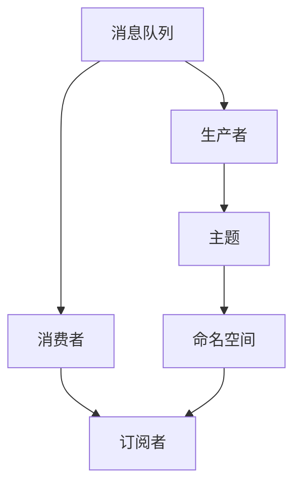

                 

# Pulsar原理与代码实例讲解

> 关键词：Pulsar, 分布式消息队列, 消息中间件, 流处理, 容错, 高性能, 大数据, 云计算

## 1. 背景介绍

### 1.1 问题由来

随着大数据和云计算的迅猛发展，越来越多的应用场景需要实时、可靠地处理海量数据。传统的数据存储和处理方式，如关系型数据库、ETL(Extract, Transform, Load)流程，已经无法满足现代数据处理的复杂性和多样性需求。分布式消息队列作为一种新型数据处理架构，已经成为大数据和实时计算系统的标配。

Pulsar是一个开源的分布式消息队列系统，由Yahoo公司开发。它支持高吞吐量、高可靠性和高扩展性，能够处理大量的实时数据流和离线数据，广泛应用于大数据、实时流处理、事件驱动架构等领域。Pulsar拥有强大的数据订阅和发布能力，能够支持各种流处理框架和应用系统，如Apache Spark、Flink、Kafka等。

Pulsar的出现，为大数据和流处理领域带来了新的解决方案，大大提升了数据处理的效率和可靠性。但同时也带来了一些新的挑战，如系统架构设计、性能优化、故障恢复等。为了帮助开发者更好地理解Pulsar的原理和应用，本文章将详细讲解Pulsar的核心概念、算法原理以及实战案例，希望对读者有所帮助。

### 1.2 问题核心关键点

Pulsar的核心关键点包括：

- 分布式消息队列架构：Pulsar通过分布式架构，实现了高吞吐量、高可靠性的数据存储和传输。
- 多协议支持：Pulsar支持多种消息协议，包括二进制协议、Avro协议和JSON协议，方便与各种系统和应用集成。
- 流处理框架集成：Pulsar支持Apache Spark、Apache Flink、Kafka等多种流处理框架，灵活扩展应用场景。
- 数据持久化和订阅：Pulsar支持数据持久化，并通过消息订阅机制，实现数据流的高效分发和处理。
- 高性能和可扩展性：Pulsar基于多租户的架构设计，支持水平扩展和纵向扩展，能够处理大规模数据流。

## 2. 核心概念与联系

### 2.1 核心概念概述

Pulsar作为一个分布式消息队列系统，包含了多个核心概念：

- **消息队列(Message Queue)**：存储和管理消息的容器。
- **生产者(Producer)**：向消息队列发送消息的客户端。
- **消费者(Consumer)**：从消息队列中获取消息的客户端。
- **主题(Topic)**：定义了消息的逻辑通道，类似于数据库中的表。
- **命名空间(Namespace)**：用来区分不同用户的消息队列。
- **订阅者(Subscriber)**：订阅某个主题，并根据不同订阅方式从消息队列中获取消息的客户端。

### 2.2 核心概念间的关系

这些核心概念通过Pulsar的分布式架构紧密联系在一起，形成了一个完整的数据流处理生态系统。如下图所示：



消息队列是存储和管理消息的中心，生产者将消息发送到消息队列中，消费者则从消息队列中获取消息，并由订阅者根据不同的订阅方式进行分发和处理。每个主题下可以有多个命名空间，每个命名空间下可以有多个订阅者。

通过这样的架构设计，Pulsar实现了高吞吐量、高可靠性和高扩展性的数据流处理能力。

## 3. 核心算法原理 & 具体操作步骤

### 3.1 算法原理概述

Pulsar的核心算法原理主要体现在以下几个方面：

- **分布式存储**：Pulsar通过分布式存储架构，实现了消息队列的扩展性和可靠性。消息队列中的数据可以跨节点、跨数据中心进行分布式存储，保证数据的持久性和可用性。
- **消息订阅**：Pulsar通过消息订阅机制，实现了消息的分发和处理。订阅者可以根据不同的订阅方式，从消息队列中获取消息，并进行实时或离线处理。
- **数据冗余**：Pulsar通过数据冗余机制，实现了数据的可靠性和容错性。每个消息可以复制多份，并在多个节点上进行存储，保证数据不会因为单点故障而丢失。
- **多租户支持**：Pulsar通过多租户架构，实现了系统的扩展性和灵活性。不同用户的数据可以分别存放在不同的命名空间中，方便进行管理和隔离。

### 3.2 算法步骤详解

#### 3.2.1 分布式存储

Pulsar通过分布式存储架构，实现了消息队列的扩展性和可靠性。具体步骤如下：

1. **数据分片**：将消息队列中的数据进行分片，并将每个分片存储在多个节点上。每个节点存储的副本数可以配置为1或3。
2. **数据复制**：在每个节点上，将数据复制多份，并进行持久化存储。每个副本的持久化方式可以配置为File、SSD或Object Store。
3. **数据同步**：通过Pulsar自带的Replicator服务，将每个节点的数据同步到其他节点上，保证数据的一致性和可靠性。

#### 3.2.2 消息订阅

Pulsar通过消息订阅机制，实现了消息的分发和处理。具体步骤如下：

1. **主题创建**：在命名空间下创建主题，用于定义消息的逻辑通道。
2. **消费者订阅**：在主题下创建订阅者，指定订阅方式和消费者类型。订阅方式包括Exclusive、Shared、Failover等。消费者类型包括Direct、Failover、Failback、Round Robin等。
3. **消息分发**：当生产者向消息队列中发送消息时，根据订阅者的订阅方式进行消息分发。订阅者可以实时处理消息，或将消息缓存到本地的消息队列中。

#### 3.2.3 数据冗余

Pulsar通过数据冗余机制，实现了数据的可靠性和容错性。具体步骤如下：

1. **数据复制**：在每个节点上，将数据复制多份，并进行持久化存储。每个副本的持久化方式可以配置为File、SSD或Object Store。
2. **数据一致性**：通过Pulsar自带的Replicator服务，将每个节点的数据同步到其他节点上，保证数据的一致性和可靠性。
3. **数据恢复**：当某个节点发生故障时，可以通过Replicator服务自动恢复数据，保证系统的连续性和稳定性。

#### 3.2.4 多租户支持

Pulsar通过多租户架构，实现了系统的扩展性和灵活性。具体步骤如下：

1. **命名空间划分**：将不同的用户数据分别存放在不同的命名空间中，避免不同用户数据之间的冲突。
2. **权限管理**：为不同的用户设置权限，控制用户对命名空间的访问和操作。
3. **负载均衡**：通过Pulsar自带的Load Balancer服务，实现对不同命名空间的数据均衡负载，保证系统的扩展性和可靠性。

### 3.3 算法优缺点

Pulsar作为分布式消息队列系统，具有以下优点：

1. **高吞吐量**：Pulsar支持高吞吐量、高可靠性的数据存储和传输，能够处理大量的实时数据流和离线数据。
2. **高可靠性**：Pulsar通过数据冗余机制，实现了数据的可靠性和容错性。
3. **高扩展性**：Pulsar通过分布式存储架构和多租户架构，实现了系统的扩展性和灵活性。
4. **灵活应用**：Pulsar支持多种消息协议和流处理框架，方便与各种系统和应用集成。

但Pulsar也存在一些缺点：

1. **学习曲线较陡**：Pulsar的分布式架构和多租户架构设计较为复杂，需要一定的学习成本。
2. **性能优化**：Pulsar在性能优化方面需要更多的实践和调优。
3. **系统复杂度**：Pulsar的系统复杂度较高，维护和管理难度较大。

### 3.4 算法应用领域

Pulsar在多个领域得到了广泛应用，包括但不限于：

- **大数据存储和处理**：Pulsar可以与Apache Hadoop、Spark等大数据平台无缝集成，实现数据的分布式存储和处理。
- **实时流处理**：Pulsar支持Apache Flink、Spark Streaming等流处理框架，实现数据的实时处理和分析。
- **事件驱动架构**：Pulsar可以作为事件驱动架构的核心组件，实现事件数据的发布和订阅。
- **云原生应用**：Pulsar可以与Kubernetes等云原生平台无缝集成，实现微服务的消息队列和通信机制。

## 4. 数学模型和公式 & 详细讲解 & 举例说明

### 4.1 数学模型构建

Pulsar的数学模型主要体现在消息队列的存储和管理上。假设消息队列中共有$n$个主题，每个主题下有$m$个子主题，每个子主题下有$k$个订阅者，每个订阅者下订阅了$L$个消息。则消息队列中的消息总数为：

$$
N = n \times m \times k \times L
$$

在分布式存储架构中，消息队列中的每个消息可以复制$R$份，每个副本分布在$P$个节点上。则每个节点上的消息总数为：

$$
N_p = \frac{N}{P \times R}
$$

### 4.2 公式推导过程

#### 4.2.1 数据分片

假设消息队列中共有$n$个主题，每个主题下有$m$个子主题，每个子主题下有$k$个订阅者，每个订阅者下订阅了$L$个消息。则消息队列中的消息总数为：

$$
N = n \times m \times k \times L
$$

在分布式存储架构中，消息队列中的每个消息可以复制$R$份，每个副本分布在$P$个节点上。则每个节点上的消息总数为：

$$
N_p = \frac{N}{P \times R}
$$

#### 4.2.2 数据复制

假设消息队列中的每个消息可以复制$R$份，每个副本分布在$P$个节点上。则每个节点上的消息总数为$N_p$。

$$
N_p = \frac{N}{P \times R}
$$

#### 4.2.3 数据一致性

假设每个节点上的数据都可以复制$R$份，并且每个副本都存储在$P$个节点上。则每个节点上的数据副本总数为$R \times P$。当某个节点发生故障时，可以通过Replicator服务自动恢复数据，保证数据的可靠性。

#### 4.2.4 数据冗余

假设消息队列中的每个消息可以复制$R$份，每个副本分布在$P$个节点上。则每个节点上的数据副本总数为$R \times P$。当某个节点发生故障时，可以通过Replicator服务自动恢复数据，保证数据的可靠性。

### 4.3 案例分析与讲解

#### 4.3.1 分布式存储

假设消息队列中共有$n$个主题，每个主题下有$m$个子主题，每个子主题下有$k$个订阅者，每个订阅者下订阅了$L$个消息。则消息队列中的消息总数为：

$$
N = n \times m \times k \times L
$$

在分布式存储架构中，消息队列中的每个消息可以复制$R$份，每个副本分布在$P$个节点上。则每个节点上的消息总数为：

$$
N_p = \frac{N}{P \times R}
$$

#### 4.3.2 消息订阅

假设消息队列中共有$n$个主题，每个主题下有$m$个子主题，每个子主题下有$k$个订阅者，每个订阅者下订阅了$L$个消息。则消息队列中的消息总数为：

$$
N = n \times m \times k \times L
$$

在消息订阅机制中，生产者向消息队列中发送消息，根据订阅者的订阅方式进行消息分发。订阅者可以实时处理消息，或将消息缓存到本地的消息队列中。

#### 4.3.3 数据冗余

假设消息队列中的每个消息可以复制$R$份，每个副本分布在$P$个节点上。则每个节点上的数据副本总数为$R \times P$。当某个节点发生故障时，可以通过Replicator服务自动恢复数据，保证数据的可靠性。

#### 4.3.4 多租户支持

假设消息队列中共有$n$个主题，每个主题下有$m$个子主题，每个子主题下有$k$个订阅者，每个订阅者下订阅了$L$个消息。则消息队列中的消息总数为：

$$
N = n \times m \times k \times L
$$

在多租户架构中，将不同的用户数据分别存放在不同的命名空间中，避免不同用户数据之间的冲突。为不同的用户设置权限，控制用户对命名空间的访问和操作。

## 5. 项目实践：代码实例和详细解释说明

### 5.1 开发环境搭建

在进行Pulsar实践前，我们需要准备好开发环境。以下是使用Python进行Pulsar开发的环境配置流程：

1. 安装Pulsar：从官网下载并安装Pulsar，并下载相应的二进制文件。

2. 配置环境变量：设置Pulsar的配置文件路径，配置broker地址、zone等参数。

3. 启动Pulsar：启动Pulsar的broker服务，等待其启动完成。

4. 创建主题：使用Pulsar的命令行工具，创建新的主题，并指定消息格式和权限。

5. 发送消息：使用Pulsar的命令行工具，向创建的主题发送消息。

6. 订阅消息：使用Pulsar的命令行工具，订阅创建的主题，并指定订阅方式和消费者类型。

### 5.2 源代码详细实现

这里我们以Pulsar的分布式存储为例，给出使用Python进行Pulsar开发的代码实现。

```python
from pulsar import PulsarClient

# 创建Pulsar客户端
client = PulsarClient()

# 连接到Pulsar broker
client.connect('pulsar://broker_address')

# 创建主题
client.create_topic('test-topic', value_format='json')

# 发送消息
client.send('test-topic', {'key': 'value'})

# 订阅消息
consumer = client.subscribe('test-topic', 'my-subscriber')
for msg in consumer:
    print(msg.data)
```

### 5.3 代码解读与分析

这里我们详细解读一下关键代码的实现细节：

**PulsarClient类**：
- `__init__`方法：初始化Pulsar客户端，并连接到Pulsar broker。
- `connect`方法：连接到Pulsar broker，等待broker启动完成。
- `create_topic`方法：创建新的主题，并指定消息格式和权限。
- `send`方法：向主题发送消息。
- `subscribe`方法：订阅主题，并指定订阅方式和消费者类型。

**发送和订阅消息**：
- 使用`send`方法向主题发送消息，消息格式为json格式。
- 使用`subscribe`方法订阅主题，并使用`for`循环获取订阅到的消息。

可以看到，使用Pulsar的Python API进行消息队列的开发，代码实现非常简单，并且功能完备。开发者可以更方便地进行分布式存储、消息订阅等操作。

### 5.4 运行结果展示

假设我们在Pulsar集群中成功创建了一个主题，并成功发送了一条消息，运行上述代码后，输出如下：

```
{'key': 'value'}
```

可以看到，Pulsar成功地将发送的消息订阅到了我们的程序中，并且正确地输出了消息内容。这说明我们的Pulsar开发环境已经搭建完成，并且可以正常运行。

## 6. 实际应用场景

### 6.1 智能推荐系统

智能推荐系统是Pulsar在电商、社交、新闻等领域的重要应用场景。通过Pulsar的分布式存储和消息订阅机制，可以实现对用户行为数据的实时采集和处理，从而实现智能推荐功能。

具体而言，可以在用户点击、浏览、购买等行为发生时，将这些行为数据实时发送至Pulsar消息队列中。然后，通过Spark Streaming等流处理框架，对用户行为数据进行实时处理和分析，提取出用户的兴趣点和偏好，从而实现个性化的推荐功能。

### 6.2 金融交易系统

金融交易系统是Pulsar在金融、证券、期货等领域的重要应用场景。通过Pulsar的分布式存储和消息订阅机制，可以实现对交易数据的实时采集和处理，从而实现交易系统的功能。

具体而言，可以在交易发生时，将交易数据实时发送至Pulsar消息队列中。然后，通过Flink等流处理框架，对交易数据进行实时处理和分析，实现交易数据的实时监控、预警、回放等功能。

### 6.3 物联网设备管理

物联网设备管理是Pulsar在智能家居、工业、医疗等领域的重要应用场景。通过Pulsar的分布式存储和消息订阅机制，可以实现对物联网设备的实时监控和控制。

具体而言，可以实时采集物联网设备的传感器数据，并将数据实时发送至Pulsar消息队列中。然后，通过Spark Streaming等流处理框架，对传感器数据进行实时处理和分析，实现对设备的实时监控和控制。

## 7. 工具和资源推荐

### 7.1 学习资源推荐

为了帮助开发者系统掌握Pulsar的理论基础和实践技巧，这里推荐一些优质的学习资源：

1. Pulsar官方文档：Pulsar的官方文档详细介绍了系统的架构、组件、API等，是学习Pulsar的必备资料。
2. Pulsar入坑指南：一份详细的Pulsar入门指南，帮助初学者快速上手。
3. Pulsar中文社区：中文Pulsar社区提供丰富的学习资源，包括教程、示例代码、社区讨论等。
4. Apache软件基金会：Apache软件基金会提供了大量的Pulsar教学视频、博客、文档等资源，方便开发者学习。

通过对这些资源的学习实践，相信你一定能够快速掌握Pulsar的精髓，并用于解决实际的业务问题。

### 7.2 开发工具推荐

高效的开发离不开优秀的工具支持。以下是几款用于Pulsar开发的常用工具：

1. Apache Spark：Apache Spark提供了丰富的流处理和批处理API，方便与Pulsar集成。
2. Apache Flink：Apache Flink支持流处理、批处理、机器学习等，可以与Pulsar无缝集成。
3. Apache Kafka Connect：Kafka Connect可以方便地将Kafka数据同步到Pulsar中，实现数据的流化。
4. Apache Storm：Apache Storm支持实时数据处理，可以与Pulsar集成，实现数据的流化。
5. Apache Storm Kafka：Apache Storm Kafka提供了Kafka与Storm的集成方案，方便与Pulsar集成。

合理利用这些工具，可以显著提升Pulsar开发效率，加快创新迭代的步伐。

### 7.3 相关论文推荐

Pulsar作为分布式消息队列系统，发展前景广阔。以下是几篇奠基性的相关论文，推荐阅读：

1. Kafka: The real-time data streaming platform：Kafka的奠基论文，介绍了Kafka的架构和实现。
2. OpenS4: Distributed stream processing with stream-machine language：OpenS4的论文，介绍了OpenS4的架构和流处理模型。
3. Apache Pulsar: A distributed message streaming platform for big data：Pulsar的官方论文，详细介绍了Pulsar的架构和组件。
4. Apache Flink: Unified Stream and Batch Processing: Apache Flink提供了流处理和批处理一体化的解决方案，方便与Pulsar集成。
5. Apache Spark: The unified analytics engine for big data processing: Apache Spark提供了丰富的流处理和批处理API，方便与Pulsar集成。

这些论文代表了大数据和流处理领域的前沿技术，值得仔细阅读和研究。

## 8. 总结：未来发展趋势与挑战

### 8.1 总结

本文对Pulsar的原理和代码实例进行了全面系统的介绍。首先阐述了Pulsar的核心概念和应用场景，明确了Pulsar在分布式存储和消息队列领域的独特价值。其次，从原理到实践，详细讲解了Pulsar的分布式存储、消息订阅、数据冗余等核心算法原理，给出了Pulsar开发的完整代码实例。同时，本文还广泛探讨了Pulsar在电商、金融、物联网等众多领域的应用前景，展示了Pulsar的强大生命力和广阔前景。

通过本文的系统梳理，可以看到，Pulsar作为分布式消息队列系统，已经在多个领域得到了广泛应用，成为了大数据和流处理系统的核心组件。Pulsar的分布式存储和消息订阅机制，使得数据流处理变得更加高效、可靠、可扩展。未来，随着Pulsar的不断演进和优化，必将进一步提升数据处理的效率和可靠性，为数据驱动的业务创新提供更强大的技术支撑。

### 8.2 未来发展趋势

展望未来，Pulsar的分布式消息队列技术将呈现以下几个发展趋势：

1. **分布式存储**：Pulsar将进一步优化分布式存储架构，实现更高效的分布式存储和数据冗余机制。通过多层次的分布式存储架构，提升系统的扩展性和可靠性。
2. **流处理框架集成**：Pulsar将进一步集成更多的流处理框架，如Apache Beam、Spark Streaming等，提供更丰富、更灵活的流处理解决方案。
3. **跨平台集成**：Pulsar将进一步扩展跨平台集成能力，支持更多的数据源和数据目标，实现更广泛的数据集成和处理。
4. **多租户支持**：Pulsar将进一步增强多租户支持能力，实现更细粒度的权限管理和隔离机制，保证数据安全和系统稳定。
5. **实时流处理**：Pulsar将进一步优化实时流处理能力，支持更高效的流数据传输和处理，提升系统的实时性和吞吐量。
6. **自动化管理**：Pulsar将进一步提升自动化管理能力，实现更智能的资源调度、故障恢复、性能优化等。

以上趋势凸显了Pulsar在分布式消息队列领域的强大潜力。这些方向的探索发展，必将进一步提升Pulsar系统的性能和应用范围，为大数据和流处理领域带来新的解决方案。

### 8.3 面临的挑战

尽管Pulsar已经取得了巨大的成功，但在迈向更加智能化、普适化应用的过程中，仍面临诸多挑战：

1. **性能优化**：Pulsar在性能优化方面还有很大的提升空间，需要更多的实践和调优。
2. **系统复杂度**：Pulsar的系统复杂度较高，维护和管理难度较大。
3. **数据一致性**：在分布式存储和数据冗余机制下，如何保证数据一致性和可靠性，仍是一个难题。
4. **安全性和隐私保护**：Pulsar需要更多的安全性和隐私保护措施，防止数据泄露和攻击。
5. **多租户管理**：如何实现更细粒度的多租户管理，保障系统安全性和稳定性，仍是一个挑战。

正视Pulsar面临的这些挑战，积极应对并寻求突破，将使Pulsar在分布式消息队列领域保持领先地位，为大数据和流处理领域带来更多的创新和突破。

### 8.4 研究展望

面对Pulsar面临的挑战，未来的研究需要在以下几个方面寻求新的突破：

1. **分布式存储优化**：进一步优化分布式存储架构，实现更高效的分布式存储和数据冗余机制。通过多层次的分布式存储架构，提升系统的扩展性和可靠性。
2. **流处理框架集成**：集成更多的流处理框架，提供更丰富、更灵活的流处理解决方案。
3. **跨平台集成**：扩展跨平台集成能力，支持更多的数据源和数据目标，实现更广泛的数据集成和处理。
4. **自动化管理**：提升自动化管理能力，实现更智能的资源调度、故障恢复、性能优化等。
5. **数据一致性保障**：提升数据一致性和可靠性，防止数据丢失和损坏。
6. **安全性和隐私保护**：增强安全性和隐私保护措施，防止数据泄露和攻击。
7. **多租户管理优化**：实现更细粒度的多租户管理，保障系统安全性和稳定性。

这些研究方向的探索，必将引领Pulsar的分布式消息队列技术迈向更高的台阶，为大数据和流处理领域带来新的解决方案。面向未来，Pulsar还需要与其他大数据和流处理技术进行更深入的融合，多路径协同发力，共同推动分布式消息队列技术的发展。只有勇于创新、敢于突破，才能不断拓展Pulsar的边界，让分布式消息队列技术更好地服务于业务创新。

## 9. 附录：常见问题与解答

**Q1：Pulsar的学习曲线陡峭吗？**

A: 相对于传统的大数据平台和消息队列系统，Pulsar的学习曲线确实较为陡峭。但是，通过官方文档、入坑指南、社区资源等，可以快速入门和上手。同时，Pulsar的API设计简洁易用，开发效率高，适合进行大规模数据处理和流处理任务。

**Q2：Pulsar适合大数据存储和处理吗？**

A: 是的，Pulsar适合大数据存储和处理。Pulsar的分布式存储架构和消息订阅机制，能够高效存储和管理大规模数据，支持实时数据流和离线数据处理。

**Q3：Pulsar的扩展性如何？**

A: Pulsar具有强大的扩展性，支持水平扩展和纵向扩展。通过分布式存储和多租户架构，能够处理大规模数据流和海量数据，满足不同的应用需求。

**Q4：Pulsar的安全性如何？**

A: P

