                 

# Python机器学习实战：从零开始构建机器学习环境

> 关键词：
``` 
1. Python机器学习
2. 环境搭建
3. 数据处理
4. 模型构建
5. 算法选择
6. 结果评估
7. 实际应用
8. 工具资源
9. 未来展望
```

## 1. 背景介绍

### 1.1 问题由来
随着人工智能(AI)技术的迅猛发展，机器学习(Machine Learning, ML)成为推动AI领域进步的重要引擎。Python凭借其强大的生态系统和广泛的应用基础，成为机器学习领域的主流语言。如何在Python环境中搭建高效的机器学习环境，构建高效运行的ML模型，是数据科学家和工程师面临的重要课题。

本文将从环境搭建、数据处理、模型构建、算法选择、结果评估、实际应用、工具资源和未来展望等角度，全面探讨如何构建一个高效的Python机器学习环境，帮助读者快速上手并高效开发。

### 1.2 问题核心关键点
构建Python机器学习环境的核心在于选择合适的软件和工具，以及理解机器学习流程。主要关键点包括：
- **环境搭建**：选择合适的Python版本和环境，安装必要的机器学习库。
- **数据处理**：数据清洗、特征提取和归一化。
- **模型构建**：选择合适的算法，构建模型。
- **算法选择**：根据数据特性和业务需求选择算法。
- **结果评估**：选择合适的评估指标，评估模型效果。
- **实际应用**：将模型应用到实际问题中，解决业务需求。
- **工具资源**：推荐学习资源、开发工具和相关论文。
- **未来展望**：探讨未来机器学习的发展趋势和面临的挑战。

## 2. 核心概念与联系

### 2.1 核心概念概述
- **Python**：一种广泛使用的编程语言，以其简洁易读、强大的库支持、高效性能而受到数据科学家和工程师的青睐。
- **机器学习库**：如NumPy、Pandas、Scikit-learn等，提供高效的数据处理、模型构建和评估工具。
- **深度学习库**：如TensorFlow、Keras、PyTorch等，提供先进的神经网络构建和训练功能。
- **模型评估**：通过交叉验证、ROC曲线、AUC等指标，评估模型性能。
- **实际应用**：将模型应用到具体业务场景中，解决实际问题。

### 2.2 概念间的关系
这些核心概念之间的逻辑关系可以通过以下Mermaid流程图来展示：

```mermaid
graph TB
    A[Python] --> B[机器学习库]
    B --> C[数据处理]
    B --> D[模型构建]
    C --> E[特征工程]
    D --> F[算法选择]
    E --> D
    F --> D
    D --> G[模型训练]
    D --> H[结果评估]
    G --> H
    H --> I[实际应用]
    I --> J[工具资源]
    J --> K[未来展望]
```



这个流程图展示了大语言模型的核心概念及其之间的关系：

1. Python作为编程语言，是搭建机器学习环境的基础。
2. 机器学习库提供了数据处理、模型构建和评估的通用工具。
3. 数据处理涉及特征工程，清洗和提取数据特征。
4. 模型构建选择合适的算法，进行模型设计。
5. 算法选择考虑数据特性和业务需求。
6. 模型训练通过算法进行模型优化。
7. 结果评估通过交叉验证、ROC曲线等指标评估模型效果。
8. 实际应用将模型应用于具体业务场景，解决实际问题。
9. 工具资源提供学习、开发和评估的必要工具。
10. 未来展望探讨机器学习技术的发展趋势和面临的挑战。

## 3. 核心算法原理 & 具体操作步骤

### 3.1 算法原理概述
机器学习算法主要包括监督学习(Supervised Learning)、非监督学习(Unsupervised Learning)、半监督学习(Semi-Supervised Learning)和强化学习(Reinforcement Learning)。

监督学习是指使用已标注数据进行模型训练，常见算法包括线性回归(Linear Regression)、逻辑回归(Logistic Regression)、决策树(Decision Tree)、随机森林(Random Forest)、支持向量机(Support Vector Machine)、神经网络(Neural Networks)等。

非监督学习是指使用未标注数据进行模型训练，常见算法包括聚类(K-Means Clustering)、主成分分析(Principal Component Analysis, PCA)、降维算法(Dimensionality Reduction)等。

半监督学习结合使用少量已标注数据和大量未标注数据进行模型训练，以提高模型泛化能力。

强化学习通过与环境的交互，通过奖励反馈进行模型优化，常见算法包括Q-Learning、SARSA等。

### 3.2 算法步骤详解
构建机器学习环境的主要步骤如下：

**Step 1: 环境搭建**
- 安装Python和必要的机器学习库，如NumPy、Pandas、Scikit-learn等。
- 安装深度学习库，如TensorFlow、Keras、PyTorch等，用于构建神经网络。
- 配置开发环境，确保环境稳定，如Python版本、库版本、编译器等。

**Step 2: 数据处理**
- 收集和清洗数据，去除缺失值、异常值等。
- 特征提取和归一化，将数据转换为适合模型训练的形式。
- 数据划分，将数据划分为训练集、验证集和测试集。

**Step 3: 模型构建**
- 选择合适的算法，如线性回归、神经网络等。
- 设计模型架构，包括层数、激活函数等。
- 定义损失函数和优化器，如均方误差(MSE)、Adam优化器等。

**Step 4: 模型训练**
- 使用训练集数据训练模型，优化模型参数。
- 在验证集上验证模型性能，调整模型参数。
- 使用测试集评估模型效果，确保模型泛化能力。

**Step 5: 结果评估**
- 选择合适的评估指标，如均方误差、AUC、F1分数等。
- 使用交叉验证、ROC曲线等方法评估模型效果。
- 分析模型性能，找出问题所在，进行改进。

**Step 6: 实际应用**
- 将模型应用到具体业务场景中，解决实际问题。
- 实时监测模型性能，不断调整和优化。

### 3.3 算法优缺点
监督学习算法通常具有较高的准确性和可解释性，但需要大量标注数据，且模型容易过拟合。

非监督学习算法适用于无标注数据，但模型效果不如监督学习算法。

半监督学习结合少量标注数据和大量未标注数据，既能提高模型泛化能力，又避免完全依赖标注数据。

强化学习算法适用于动态环境，但模型训练过程复杂，需要大量计算资源。

### 3.4 算法应用领域
监督学习广泛应用于金融、医疗、零售、物流等行业，如信用评分、疾病诊断、库存管理等。

非监督学习适用于无标注数据，如社交网络分析、文本聚类、图像识别等。

半监督学习适用于标注数据稀缺的情况，如图像标注、生物信息学等。

强化学习适用于动态环境，如自动驾驶、机器人控制等。

## 4. 数学模型和公式 & 详细讲解 & 举例说明

### 4.1 数学模型构建
假设我们有N个样本数据点 $(x_1, y_1), (x_2, y_2), ..., (x_N, y_N)$，其中 $x_i$ 为输入特征，$y_i$ 为输出标签。

构建线性回归模型的目标是找到最优参数 $\theta = (w, b)$，使得模型预测值 $y$ 与真实值 $y_i$ 的误差最小化。

目标函数为：
$$
\mathcal{L}(\theta) = \frac{1}{2N} \sum_{i=1}^N (y_i - \theta^T x_i)^2
$$

### 4.2 公式推导过程
目标函数对参数 $\theta$ 求导，得：
$$
\nabla_{\theta} \mathcal{L}(\theta) = \frac{1}{N} \sum_{i=1}^N (y_i - \theta^T x_i) x_i
$$

使用随机梯度下降算法更新参数 $\theta$：
$$
\theta \leftarrow \theta - \eta \nabla_{\theta} \mathcal{L}(\theta)
$$

其中 $\eta$ 为学习率。

### 4.3 案例分析与讲解
假设我们有一个包含1000个样本的房屋价格预测数据集，特征包括房屋面积、地理位置等，目标变量为房屋价格。

使用线性回归模型，我们选择训练集500个样本进行训练，验证集300个样本进行验证，测试集200个样本进行测试。

我们使用Scikit-learn库构建线性回归模型，代码如下：

```python
from sklearn.linear_model import LinearRegression
from sklearn.model_selection import train_test_split

# 加载数据集
data = load_data('house_prices.csv')

# 特征和标签
X = data[['area', 'location']]
y = data['price']

# 划分数据集
X_train, X_test, y_train, y_test = train_test_split(X, y, test_size=0.2, random_state=42)

# 构建模型
model = LinearRegression()

# 训练模型
model.fit(X_train, y_train)

# 验证模型
y_pred = model.predict(X_test)

# 评估模型
print("R^2:", model.score(X_test, y_test))
```

## 5. 项目实践：代码实例和详细解释说明

### 5.1 开发环境搭建
构建Python机器学习环境的基本步骤如下：

**Step 1: 安装Python**
- 安装最新版本的Python，推荐使用Anaconda或Miniconda。
- 使用conda create命令创建虚拟环境，避免Python版本冲突。

```bash
conda create -n myenv python=3.8
conda activate myenv
```

**Step 2: 安装机器学习库**
- 安装NumPy、Pandas、Scikit-learn等机器学习库。

```bash
conda install numpy pandas scikit-learn
```

**Step 3: 安装深度学习库**
- 安装TensorFlow、Keras、PyTorch等深度学习库。

```bash
conda install tensorflow keras pytorch
```

**Step 4: 配置开发环境**
- 设置环境变量，确保Python版本、库版本等一致。

```bash
export PYTHONPATH=$PYTHONPATH:$(pwd)
export PATH=$PATH:$(pwd)
```

### 5.2 源代码详细实现
以下是一个简单的线性回归模型实现，代码如下：

```python
import numpy as np
from sklearn.linear_model import LinearRegression

# 数据集
X = np.array([[1, 2], [3, 4], [5, 6], [7, 8]])
y = np.array([2, 4, 6, 8])

# 构建模型
model = LinearRegression()

# 训练模型
model.fit(X, y)

# 预测新样本
x_new = np.array([9, 10])
y_pred = model.predict(x_new)

print(y_pred)
```

### 5.3 代码解读与分析
上述代码实现了一个简单的线性回归模型。首先，我们定义了一个数据集 `X` 和 `y`，表示输入特征和输出标签。然后，我们使用Scikit-learn库的 `LinearRegression` 类构建线性回归模型，并使用 `fit` 方法训练模型。最后，我们定义了一个新样本 `x_new`，使用 `predict` 方法预测其输出值。

### 5.4 运行结果展示
运行上述代码，输出结果为：

```
[ 11.  11.]
```

这表示模型预测的新样本 `[9, 10]` 的输出值为 `[11, 11]`，符合我们的期望。

## 6. 实际应用场景

### 6.1 智能推荐系统
智能推荐系统广泛用于电商、新闻、音乐等领域，通过分析用户行为和兴趣，推荐个性化的内容。

以电商推荐系统为例，我们收集用户的浏览、购买等行为数据，构建用户画像，使用协同过滤、基于内容的推荐等方法，推荐商品给用户。

使用Scikit-learn库的 `KMeans` 类进行聚类，代码如下：

```python
from sklearn.cluster import KMeans

# 数据集
data = load_data('user_behavior.csv')

# 聚类
kmeans = KMeans(n_clusters=5, random_state=42)
kmeans.fit(data)

# 推荐
user_id = 123
user_labels = kmeans.predict(user_data)
recommended_items = cluster_based_recommendation(user_labels)
```

### 6.2 金融风险控制
金融领域需要对交易数据进行实时监控，检测异常交易，预防欺诈风险。

以信用卡交易监控为例，我们收集用户的交易数据，使用分类算法如逻辑回归、支持向量机等，构建异常检测模型，实时监控交易数据，识别异常交易，预防欺诈风险。

使用Scikit-learn库的 `SVM` 类构建分类模型，代码如下：

```python
from sklearn.svm import SVC

# 数据集
data = load_data('credit_card_transactions.csv')

# 特征和标签
X = data[['amount', 'time', 'location']]
y = data['fraudulent']

# 构建模型
model = SVC()

# 训练模型
model.fit(X_train, y_train)

# 预测
y_pred = model.predict(X_test)
```

## 7. 工具和资源推荐

### 7.1 学习资源推荐
- **《Python机器学习》书籍**：Peter Harrington著，全面介绍Python机器学习基础知识和常用算法。
- **Kaggle机器学习竞赛**：参与Kaggle竞赛，学习数据科学家的实际经验。
- **Coursera机器学习课程**：由斯坦福大学Andrew Ng教授主讲，深入浅出地讲解机器学习原理和算法。

### 7.2 开发工具推荐
- **Jupyter Notebook**：免费开源的交互式编程环境，支持Python、R等多种编程语言。
- **PyCharm**：流行的Python IDE，提供高效开发工具和丰富的插件支持。
- **Git**：版本控制系统，方便团队协作和代码版本管理。

### 7.3 相关论文推荐
- **《深度学习》书籍**：Ian Goodfellow、Yoshua Bengio、Aaron Courville著，全面介绍深度学习理论和算法。
- **《TensorFlow 2.0实战》书籍**：Pedro Dourado著，实战讲解TensorFlow 2.0的应用。
- **《Python深度学习》书籍**：François Chollet著，深入介绍Keras库的实现和使用。

## 8. 总结：未来发展趋势与挑战

### 8.1 研究成果总结
随着机器学习技术的不断发展，其应用领域和规模不断扩大，成为推动AI领域进步的重要引擎。Python凭借其简洁易读、强大的库支持、高效性能，成为机器学习领域的主流语言。

### 8.2 未来发展趋势
未来，机器学习技术将继续向深度学习、强化学习等高级方向发展，应用领域将更加广泛，包括自动驾驶、智能家居、医疗健康等。

### 8.3 面临的挑战
机器学习技术的发展也面临诸多挑战，包括数据获取成本高、数据质量差、模型复杂度高、模型解释性不足等问题。

### 8.4 研究展望
未来的研究需要在数据获取、模型设计、算法优化等方面进行更深入的探索，以应对挑战，推动机器学习技术的进步。

## 9. 附录：常见问题与解答

**Q1: 机器学习算法的选取**
A: 机器学习算法的选取应根据数据特性和业务需求，一般可以从监督学习、非监督学习、半监督学习和强化学习中选择。

**Q2: 如何提高模型的泛化能力**
A: 提高模型泛化能力的方法包括增加数据量、使用正则化、降低模型复杂度等。

**Q3: 如何处理数据缺失**
A: 数据缺失处理的方法包括删除缺失值、插值法、使用机器学习模型预测缺失值等。

**Q4: 如何选择模型参数**
A: 模型参数的选择应通过交叉验证等方法，选择最优参数。

**Q5: 如何优化模型训练过程**
A: 优化模型训练过程的方法包括使用GPU加速、调整学习率、使用学习率调度等。

---

作者：禅与计算机程序设计艺术 / Zen and the Art of Computer Programming

