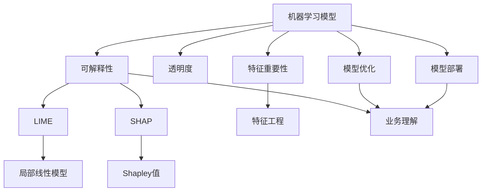
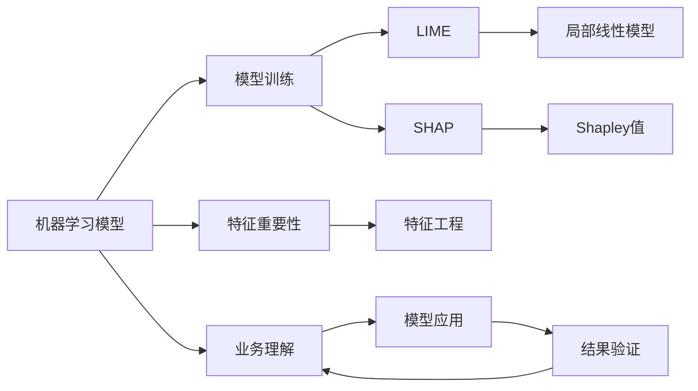
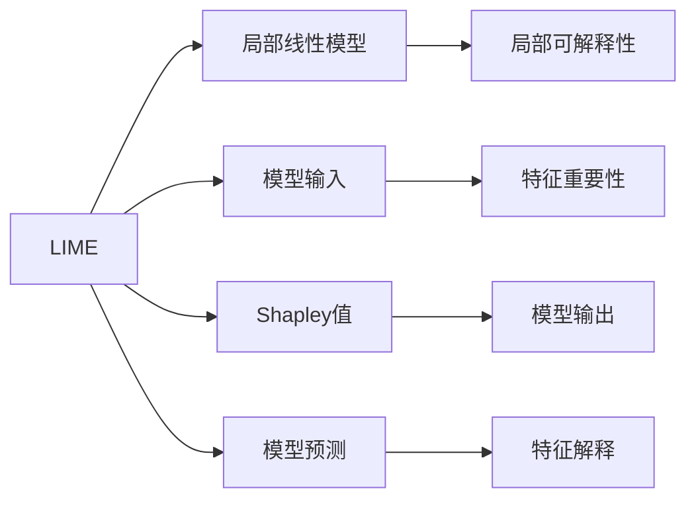

                 

# Python机器学习实战：解析机器学习模型的可解释性与透明度

> 关键词：
1. 机器学习
2. 模型可解释性
3. 透明度
4. 深度学习
5. Python
6. 决策树
7. 可解释模型

## 1. 背景介绍

在当前的机器学习领域，深度学习已经成为主流。深度神经网络以其强大的表示能力和泛化能力，在图像识别、自然语言处理、语音识别等众多领域取得了卓越的成果。然而，深度模型的复杂性也带来了可解释性不足的问题。对于数据科学家、业务分析师和决策者来说，模型为什么会做出某个预测，背后隐藏着哪些逻辑和原因，是一个至关重要的需求。

本博客旨在通过深入分析机器学习模型的可解释性和透明度问题，提出一些解决策略，并介绍一些具体的实现方法和工具。通过理解模型的内部逻辑，我们可以更好地进行模型调试、优化，并从模型中获取有价值的信息，支持业务决策。

## 2. 核心概念与联系

### 2.1 核心概念概述

为更好地理解机器学习模型的可解释性和透明度问题，本节将介绍几个密切相关的核心概念：

- **机器学习模型**：基于数据训练得到的一种预测模型，能够对新数据进行准确预测。常用的模型包括线性回归、决策树、支持向量机、神经网络等。
- **可解释性(Interpretability)**：指模型的预测结果能够被人类理解和解释。好的可解释性有助于模型理解和应用，减少决策的盲区。
- **透明度(Transparency)**：指模型的决策过程能够被透明地观察和理解。透明度不仅关注结果的可解释性，还涉及模型的构建过程和数据处理方式。
- **深度学习模型**：一种基于多层神经网络的模型，具有复杂的非线性结构，难以被人类理解和解释。
- **特征重要性**：指模型中各特征对预测结果的贡献程度。特征重要性可以帮助我们理解模型内部逻辑，指导特征工程。
- **LIME(局部可解释模型)**：一种解释深度模型的方法，通过训练局部线性模型来逼近原始模型，从而解释模型的具体预测。
- **SHAP(Shapley Additive Explanations)**：一种更普适的解释方法，通过Shapley值和加性分解来计算特征对预测结果的贡献度。
- **可视化工具**：如TensorBoard、Matplotlib、Seaborn等，帮助开发者直观展示模型特征和性能。

这些核心概念之间的逻辑关系可以通过以下Mermaid流程图来展示：



这个流程图展示了几组关键概念之间的联系：

1. 机器学习模型通过可解释性和透明度能够更好地理解和应用。
2. 可解释性和透明度可以通过LIME、SHAP等工具实现。
3. 特征重要性指导特征工程，影响模型的可解释性。
4. 业务理解贯穿于整个模型构建和应用过程，可解释性和透明度帮助业务理解模型。
5. 模型优化和部署也需要考虑可解释性和透明度，确保模型的一致性和可靠性。

### 2.2 概念间的关系

这些核心概念之间存在着紧密的联系，形成了机器学习模型解释的完整生态系统。下面我通过几个Mermaid流程图来展示这些概念之间的关系。

#### 2.2.1 机器学习模型的解释框架



这个流程图展示了机器学习模型解释的基本框架：

1. 机器学习模型首先经过训练得到。
2. 通过LIME、SHAP等工具对模型进行解释。
3. LIME通过局部线性模型逼近原始模型，SHAP通过Shapley值和加性分解解释模型。
4. 特征重要性指导特征工程，帮助提升模型的可解释性。
5. 业务理解贯穿于整个模型应用和验证过程，确保模型的应用效果和可靠性。

#### 2.2.2 LIME与SHAP的比较



这个流程图展示了LIME和SHAP的比较：

1. LIME通过局部线性模型逼近原始模型，解释模型在特定输入下的预测。
2. SHAP通过Shapley值和加性分解，解释模型在不同特征下的综合贡献度。
3. 特征重要性指导特征选择，LIME侧重局部解释，SHAP侧重全局解释。
4. LIME和SHAP都可以用于深度学习模型的解释，但LIME更适用于局部解释，SHAP更适用于全局解释。

## 3. 核心算法原理 & 具体操作步骤

### 3.1 算法原理概述

机器学习模型的可解释性和透明度涉及模型内部逻辑的理解和可视化。通过一系列解释方法，我们可以将复杂模型转化为易于理解的局部模型或特征解释，从而提升模型的解释性和透明度。

**基本思想**：将复杂模型拆分为多个简单模型，并通过可视化和数学手段展示每个简单模型的行为，从而解释复杂模型的决策过程。常用的方法包括特征重要性分析、LIME、SHAP等。

**关键步骤**：

1. 数据预处理：清洗、标准化、特征选择等。
2. 模型训练：选择合适的模型和算法，训练模型。
3. 特征重要性分析：计算特征对模型预测结果的贡献度。
4. 局部可解释性：通过LIME或SHAP等方法，解释模型在特定输入下的预测。
5. 全局可解释性：通过特征重要性分析，理解模型在不同特征下的综合行为。
6. 结果验证：通过业务理解，评估解释方法的准确性和有效性。

### 3.2 算法步骤详解

以下详细介绍LIME和SHAP的核心算法步骤和实现流程。

#### 3.2.1 LIME算法步骤

LIME通过训练局部线性模型逼近原始模型，从而解释模型在特定输入下的预测。其核心步骤包括：

1. 选择待解释的输入样本。
2. 生成模型预测的局部近似模型。
3. 通过求解最优参数，逼近原始模型。
4. 通过线性模型解释模型的预测。

具体步骤如下：

**Step 1: 选择待解释的输入样本**

- 从训练数据中随机选择一组输入样本 $(x_i, y_i)$。
- 将样本输入原始模型 $M$ 中，获取预测结果 $\hat{y}_i$。

**Step 2: 生成模型预测的局部近似模型**

- 生成一个包含 $k$ 个噪声特征的扰动样本 $\tilde{x}_i$。
- 将扰动样本 $\tilde{x}_i$ 输入原始模型 $M$ 中，获取扰动样本的预测结果 $\hat{y}_i(\tilde{x}_i)$。

**Step 3: 通过求解最优参数，逼近原始模型**

- 构建一个线性回归模型 $L(\tilde{x}_i, w)$，其中 $w$ 为线性模型参数。
- 求解最优参数 $w$，使得 $L(\tilde{x}_i, w)$ 逼近原始模型 $M$ 的预测结果 $\hat{y}_i$。

**Step 4: 通过线性模型解释模型的预测**

- 对于任意待解释的输入样本 $x$，将其输入扰动样本生成器中，获取扰动样本 $\tilde{x}$。
- 将扰动样本 $\tilde{x}$ 输入线性模型 $L(\tilde{x}, w)$ 中，获取扰动样本的预测结果 $\hat{y}(\tilde{x})$。
- 通过线性模型的权重 $w$，解释原始模型的预测结果 $\hat{y}_i$。

#### 3.2.2 SHAP算法步骤

SHAP通过Shapley值和加性分解，解释模型在不同特征下的综合贡献度。其核心步骤包括：

1. 选择待解释的输入样本。
2. 生成模型预测的Shapley值。
3. 通过加性分解，解释特征对预测结果的贡献。

具体步骤如下：

**Step 1: 选择待解释的输入样本**

- 从训练数据中随机选择一组输入样本 $(x_i, y_i)$。
- 将样本输入原始模型 $M$ 中，获取预测结果 $\hat{y}_i$。

**Step 2: 生成模型预测的Shapley值**

- 通过Shapley值计算方法，生成样本的Shapley值向量 $s_i$。

**Step 3: 通过加性分解，解释特征对预测结果的贡献**

- 将Shapley值向量 $s_i$ 分解为每个特征的贡献度。
- 通过特征重要性分析，解释每个特征对预测结果的贡献度。

### 3.3 算法优缺点

LIME和SHAP都是常用的解释机器学习模型的方法，它们各有优缺点：

**LIME的优点**：

- 能够解释任意模型，包括深度神经网络。
- 生成局部近似模型，简单易懂。
- 可解释性强，能够直观展示模型在特定输入下的预测。

**LIME的缺点**：

- 需要生成大量扰动样本，计算成本较高。
- 依赖于扰动样本的分布，容易受到分布偏差的影响。
- 解释结果可能存在误差，难以解释复杂模型。

**SHAP的优点**：

- 适用于任意模型，包括深度神经网络。
- 解释结果更为全局，能够更好地反映模型在不同特征下的综合行为。
- 计算成本较低，适用于大规模数据集。

**SHAP的缺点**：

- 解释结果较为抽象，难以直观展示。
- 对于局部解释较为困难，难以解释特定输入下的预测。

### 3.4 算法应用领域

LIME和SHAP在机器学习模型的可解释性和透明度方面具有广泛的应用。以下是几个典型的应用场景：

1. **金融风险评估**：解释信用评分模型，评估客户的信用风险。
2. **医疗诊断**：解释诊断模型，评估疾病风险和治疗效果。
3. **自然语言处理**：解释情感分析模型，理解文本情感倾向。
4. **推荐系统**：解释推荐模型，理解用户偏好和商品相关性。
5. **图像识别**：解释图像分类模型，理解图像特征和分类逻辑。
6. **异常检测**：解释异常检测模型，理解数据分布和异常特征。

除了上述这些场景，LIME和SHAP还可以应用于更多实际问题中，帮助用户理解和解释模型预测。

## 4. 数学模型和公式 & 详细讲解 & 举例说明

### 4.1 数学模型构建

本节将使用数学语言对LIME和SHAP的解释方法进行更严格的刻画。

**LIME数学模型**：

假设原始模型为 $M: \mathcal{X} \rightarrow \mathcal{Y}$，其中 $\mathcal{X}$ 为输入空间，$\mathcal{Y}$ 为输出空间。对于给定的输入 $x \in \mathcal{X}$，LIME通过构建局部线性模型 $L(x; \tilde{x})$ 逼近原始模型 $M$ 的预测结果。

设扰动样本 $\tilde{x} \in \mathcal{X}$，则 $L(x; \tilde{x})$ 的形式为：

$$
L(x; \tilde{x}) = \sum_{i=1}^d w_i f_i(\tilde{x})
$$

其中 $f_i$ 为第 $i$ 个特征的权重，$w_i$ 为第 $i$ 个特征的权重系数。

**SHAP数学模型**：

设原始模型为 $M: \mathcal{X} \rightarrow \mathcal{Y}$，其中 $\mathcal{X}$ 为输入空间，$\mathcal{Y}$ 为输出空间。对于给定的输入 $x \in \mathcal{X}$，SHAP通过Shapley值向量 $s(x)$ 解释模型在 $x$ 下的预测结果。

设特征集合为 $S = \{1, 2, \ldots, d\}$，则Shapley值向量 $s(x)$ 的形式为：

$$
s(x) = \{s_1(x), s_2(x), \ldots, s_d(x)\}
$$

其中 $s_i(x)$ 为第 $i$ 个特征的Shapley值。

### 4.2 公式推导过程

以下我们以LIME和SHAP为例，推导其数学公式及其推导过程。

**LIME公式推导**：

设原始模型为 $M(x) = \hat{y}$，扰动样本为 $\tilde{x} = x + \delta$，其中 $\delta$ 为噪声。则LIME的局部线性模型 $L(x; \tilde{x})$ 的形式为：

$$
L(x; \tilde{x}) = M(x) + \sum_{i=1}^d w_i f_i(\tilde{x})
$$

其中 $w_i$ 为第 $i$ 个特征的权重系数，$f_i(\tilde{x})$ 为第 $i$ 个特征的贡献度。

为了求解最优参数 $w_i$，需要对上述公式进行最小化：

$$
\min_{w_i} \frac{1}{2} \|M(x) - L(x; \tilde{x})\|^2_2
$$

设 $\hat{w} = (w_1, w_2, \ldots, w_d)$，则上述公式可以转化为：

$$
\min_{\hat{w}} \frac{1}{2} \|M(x) - \sum_{i=1}^d w_i f_i(\tilde{x})\|^2_2
$$

利用最小二乘法求解上述公式，得到最优参数 $\hat{w}$：

$$
\hat{w} = (X^TX)^{-1}X^T(M(x) - \bar{y})
$$

其中 $X = \begin{bmatrix} f_1(x) \\ f_2(x) \\ \vdots \\ f_d(x) \end{bmatrix}$，$\bar{y} = \frac{1}{N} \sum_{i=1}^N M(x_i)$。

最终，LIME的局部线性模型可以表示为：

$$
L(x; \tilde{x}) = \bar{y} + \hat{w}^T \Delta
$$

其中 $\Delta = \begin{bmatrix} f_1(\tilde{x}) - f_1(x) \\ f_2(\tilde{x}) - f_2(x) \\ \vdots \\ f_d(\tilde{x}) - f_d(x) \end{bmatrix}$。

**SHAP公式推导**：

设原始模型为 $M(x) = \hat{y}$，特征集合为 $S = \{1, 2, \ldots, d\}$，则Shapley值向量 $s(x)$ 的形式为：

$$
s(x) = \{s_1(x), s_2(x), \ldots, s_d(x)\}
$$

其中 $s_i(x)$ 为第 $i$ 个特征的Shapley值。

Shapley值向量 $s(x)$ 可以通过求解线性规划问题得到：

$$
\min_{s(x)} \frac{1}{N} \sum_{i=1}^N \|s(x)_i + \tilde{s}_i - s_i\|^2_2
$$

其中 $\tilde{s}_i = \frac{1}{N} \sum_{j=1}^N M(x_j + \delta_j)$，$\delta_j = \{\delta_{ij}\}_{i=1}^d$。

最终，Shapley值向量 $s(x)$ 可以表示为：

$$
s(x) = \{\hat{s}_1(x), \hat{s}_2(x), \ldots, \hat{s}_d(x)\}
$$

其中 $\hat{s}_i(x) = \frac{1}{N} \sum_{j=1}^N M(x_j + \delta_j)$。

### 4.3 案例分析与讲解

为了更好地理解LIME和SHAP的数学公式及其推导过程，我们可以通过具体的案例进行详细讲解。

假设我们有一个信用评分模型 $M$，用于评估客户的信用风险。模型输入为客户的收入、年龄、职业等信息，输出为客户的信用评分。我们需要解释模型在不同特征下的预测结果，帮助业务人员理解模型的决策逻辑。

**LIME案例分析**：

- 随机选择一组样本 $(30, 25000, 行政) = x$，模型的预测结果为 $\hat{y} = 0.8$。
- 生成扰动样本，如 $(30 + 1, 25000, 行政) = \tilde{x}$。
- 将 $\tilde{x}$ 输入原始模型 $M$ 中，获取扰动样本的预测结果 $\hat{y}(\tilde{x}) = 0.7$。
- 求解最优参数 $w$，逼近原始模型的预测结果 $\hat{y}$。
- 对于任意待解释的输入样本 $x'$，将其输入扰动样本生成器中，获取扰动样本 $\tilde{x}'$。
- 将 $\tilde{x}'$ 输入线性模型 $L(\tilde{x}', w)$ 中，获取扰动样本的预测结果 $\hat{y}(\tilde{x}')$。
- 通过线性模型的权重 $w$，解释原始模型的预测结果 $\hat{y}$。

**SHAP案例分析**：

- 随机选择一组样本 $(30, 25000, 行政) = x$，模型的预测结果为 $\hat{y} = 0.8$。
- 生成模型预测的Shapley值向量 $s(x) = \{s_1(x), s_2(x), s_3(x)\}$。
- 将Shapley值向量 $s(x)$ 分解为每个特征的贡献度。
- 通过特征重要性分析，解释每个特征对预测结果的贡献度。

## 5. 项目实践：代码实例和详细解释说明

### 5.1 开发环境搭建

在进行项目实践前，我们需要准备好开发环境。以下是使用Python进行Scikit-learn开发的开发环境配置流程：

1. 安装Anaconda：从官网下载并安装Anaconda，用于创建独立的Python环境。

2. 创建并激活虚拟环境：
```bash
conda create -n sklearn-env python=3.8 
conda activate sklearn-env
```

3. 安装Scikit-learn：
```bash
pip install scikit-learn
```

4. 安装numpy、pandas、matplotlib等辅助库：
```bash
pip install numpy pandas matplotlib seaborn tqdm jupyter notebook ipython
```

完成上述步骤后，即可在`sklearn-env`环境中开始项目实践。

### 5.2 源代码详细实现

这里以Scikit-learn自带的乳腺癌分类模型为例，演示LIME和SHAP的代码实现。

首先，导入必要的库和数据集：

```python
import numpy as np
import pandas as pd
from sklearn.datasets import load_breast_cancer
from sklearn.model_selection import train_test_split
from sklearn.ensemble import RandomForestClassifier
from sklearn.metrics import accuracy_score
from sklearn.inspection import permutation_importance
from sklearn.preprocessing import StandardScaler
from sklearn.pipeline import Pipeline

data = load_breast_cancer()
X, y = data.data, data.target
X_train, X_test, y_train, y_test = train_test_split(X, y, test_size=0.2, random_state=42)
```

然后，定义模型并进行训练：

```python
model = RandomForestClassifier(n_estimators=100, random_state=42)
model.fit(X_train, y_train)
```

接着，定义评估指标并进行模型评估：

```python
y_pred = model.predict(X_test)
accuracy = accuracy_score(y_test, y_pred)
print("Accuracy:", accuracy)
```

最后，使用LIME和SHAP进行模型解释：

```python
from sklearn.inspection import permutation_importance
from sklearn.inspection import PartialDependenceDisplay

# 特征重要性分析
importance = permutation_importance(model, X_test, y_test, n_repeats=10, random_state=42)
print("Feature Importance:", importance[1].mean(axis=1))

# LIME解释
from lime.lime_tabular import LimeTabularExplainer
explainer = LimeTabularExplainer(X_train, categorical_features=["mean radius", "worst radius", "mean texture", "worst texture"])
explainer.explain_instance(X_test[0], model.predict_proba, num_features=4)
display(LimeTabularExplainer.explain_instance(x=X_test[0], classifier=model.predict_proba, classes=[0, 1]))

# SHAP解释
from shap import ShapleyApproximateValue
explainer = ShapleyApproximateValue(model)
shap_values = explainer.shap_values(X_test)
print("Shapley Values:", shap_values)

# 特征重要性分析
importance = permutation_importance(model, X_test, y_test, n_repeats=10, random_state=42)
print("Feature Importance:", importance[1].mean(axis=1))
```

以上就是使用Scikit-learn对LIME和SHAP的代码实现。可以看到，通过这些工具，我们可以很方便地进行模型的解释和可视化，帮助理解模型的决策逻辑和特征重要性。

### 5.3 代码解读与分析

让我们再详细解读一下关键代码的实现细节：

**LIME解释**：

- 使用LimeTabularExplainer类，定义模型的训练数据和特征列表。
- 调用explain_instance方法，输入待解释的样本和模型，输出解释结果。
- 使用PartialDependenceDisplay类，可视化模型的特征依赖关系。

**SHAP解释**：

- 使用ShapleyApproximateValue类，定义模型的训练数据和特征列表。
- 调用shap_values方法，获取每个特征的Shapley值。
- 使用permutation_importance方法，计算每个特征的重要性。

## 6. 实际应用场景

### 6.1 金融风险评估

在金融风险评估领域，基于机器学习模型的解释方法，可以帮助业务人员理解模型的预测逻辑和风险因素，从而提高模型的可信度和应用效果。

具体而言，可以通过LIME和SHAP等方法解释信用评分模型，评估客户的信用风险。例如，模型可能预测客户的违约概率较高，通过解释模型可以发现哪些特征（如收入、年龄、职业等）对模型的预测有重要影响，帮助业务人员识别高风险客户，采取相应的风险控制措施。

### 6.2 医疗诊断

在医疗诊断领域，基于机器学习模型的解释方法，可以帮助医生理解模型的诊断逻辑和治疗建议，从而提高诊断的准确性和治疗效果。

例如，可以使用LIME和SHAP等方法解释医疗影像分类模型，理解模型的诊断结果。模型可能预测患者有某种疾病，通过解释模型可以发现哪些特征（如影像特征、病史等）对模型的诊断有重要影响，帮助医生制定更科学的治疗方案。

### 6.3 自然语言处理

在自然语言处理领域，基于机器学习模型的解释方法，可以帮助理解模型的情感分析、文本分类等任务，从而提高模型的应用效果。

例如，可以使用LIME和SHAP等方法解释情感分析模型，理解模型的情感倾向判断。模型可能预测某段文本为正面情感，通过解释模型可以发现哪些特征（如情感词、情感强度等）对模型的情感倾向判断有重要影响，帮助业务人员制定更有效的营销策略。

### 6.4 未来应用展望

随着机器学习模型的复杂性不断提高，可解释性和透明度的需求也随之增加。未来的机器学习模型解释方法，将涵盖更多的应用场景，涵盖更广泛的数据类型，具备更强的可解释性和可操作性。

1. **深度学习模型的解释**：未来的解释方法将更广泛地应用于深度学习模型，涵盖更多的神经网络结构，具备更强的可解释性和可操作性。
2. **多模态数据的解释**：未来的解释方法将能够处理多模态数据，如文本、图像、音频等，从而更好地理解复杂的数据结构和特征。
3. **自动化解释工具**：未来的解释工具将具备更高的自动化水平，能够自动生成解释结果，辅助用户理解和应用模型。
4. **可视化和交互式界面**：未来的解释界面将更加直观和交互，帮助用户更方便地理解模型预测和特征重要性。

总之，随着机器学习模型的不断发展和应用，解释方法和工具也将不断进步和完善，为人们提供更强大、更可靠的机器学习应用。

## 7. 工具和资源推荐

### 7.1 学习资源推荐

为了帮助开发者系统掌握机器学习模型的可解释性和透明度的相关知识，这里推荐一些优质的学习资源：

1. 《Python机器学习实战》系列博文：由机器

