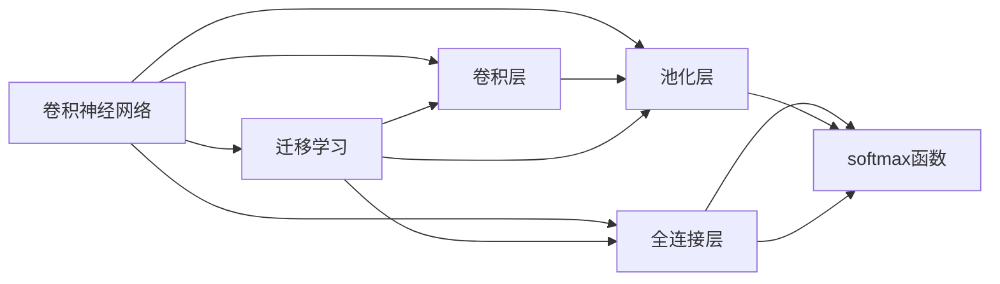

                 

# Python深度学习实践：构建深度卷积网络识别图像

> 关键词：深度卷积网络,图像分类,PyTorch,图像处理,卷积层,池化层,全连接层,softmax函数,数据增强,交叉熵损失,训练集,验证集,测试集,超参数调优,训练曲线,模型保存,迁移学习

## 1. 背景介绍

### 1.1 问题由来

在计算机视觉领域，图像分类是一个经典且重要的问题。它涉及将输入图像映射到一个预定义的类别标签。随着深度学习技术的快速发展，卷积神经网络（Convolutional Neural Networks, CNNs）成为了解决图像分类问题的主要方法。这些网络通过学习从图像中提取有意义的特征，进而实现对图像的高效分类。

本文将深入介绍如何利用Python和PyTorch库，构建并训练一个简单的深度卷积网络以识别图像。我们将从数据预处理、网络设计、模型训练、评估和优化等各个环节进行详细的探讨，并分析模型的应用场景及其优缺点。

### 1.2 问题核心关键点

图像分类问题的关键在于如何设计一个高效的卷积神经网络，以及如何有效地训练和优化模型。具体的核心点包括：

- 卷积层和池化层的设计。
- 全连接层和softmax函数的选用。
- 数据增强和交叉熵损失函数的应用。
- 超参数调优和模型保存。
- 迁移学习的利用。

理解这些关键点，能够帮助开发者更有效地设计、训练和优化图像分类模型。

## 2. 核心概念与联系

### 2.1 核心概念概述

在深入探讨算法原理之前，首先需要明确几个核心概念：

- **卷积神经网络（CNNs）**：一种特殊类型的神经网络，特别擅长处理具有网格结构的数据，如图像和视频。CNNs通过卷积层和池化层来提取和降维特征，并使用全连接层进行分类。

- **卷积层**：一种特殊的层，通过滤波器在输入数据上滑动，提取特征。卷积操作可以保持特征的位置信息，非常适合于图像处理。

- **池化层**：一种降维操作，通过滑动窗口的方式对输入数据进行降维，保留最显著的特征。

- **全连接层**：一种典型的神经网络层，将所有特征向量展平为一维向量，通过权重矩阵进行线性变换。

- **softmax函数**：一种常用的激活函数，用于多分类问题。它将神经网络输出映射到概率分布，使得输出可以解释为类别概率。

- **迁移学习**：一种利用预训练模型的技术，通过将在大规模数据上训练得到的模型迁移到小规模任务中，从而加速模型训练并提高模型性能。

这些概念共同构成了卷积神经网络的基础框架，使得深度学习在图像分类等计算机视觉任务上取得了显著的成功。

### 2.2 概念间的关系

这些核心概念之间的联系可以通过以下Mermaid流程图来展示：



这个流程图展示了卷积神经网络的主要组成部分及其相互关系。卷积层和池化层通过特征提取和降维，为全连接层提供输入。全连接层通过softmax函数将特征映射到类别概率。迁移学习可以将预训练模型迁移到新任务中，进一步提升模型性能。

## 3. 核心算法原理 & 具体操作步骤

### 3.1 算法原理概述

深度卷积网络用于图像分类的主要原理是：通过多层卷积和池化操作提取图像的特征，然后将这些特征映射到不同的类别。具体的步骤如下：

1. **数据预处理**：将原始图像转换成网络可以处理的格式，如将像素值归一化。

2. **特征提取**：通过卷积层和池化层逐步提取图像的特征，减小特征向量的大小。

3. **分类**：使用全连接层和softmax函数将提取的特征映射到类别概率。

4. **损失函数和优化器**：选择交叉熵损失函数来衡量模型预测与真实标签之间的差异，并使用优化器（如Adam）更新模型参数。

5. **训练与评估**：通过在训练集上进行反向传播和参数更新，不断调整模型参数，以最小化损失函数。在验证集上评估模型性能，防止过拟合。

6. **保存模型**：将训练好的模型保存下来，以便于后续的预测和部署。

### 3.2 算法步骤详解

以下是构建和训练深度卷积网络的具体步骤：

#### 3.2.1 数据预处理

使用Python的PIL库加载图像，并将像素值归一化到[0, 1]范围内。此外，对图像进行中心裁剪和随机水平翻转等数据增强操作，以增加数据集的多样性。

#### 3.2.2 网络设计

使用PyTorch库定义卷积神经网络结构。网络结构包括多个卷积层、池化层和全连接层。最后一层使用softmax函数进行多分类输出。

#### 3.2.3 模型训练

在训练集上使用交叉熵损失函数和优化器（如Adam）进行训练。通过反向传播更新模型参数，并记录训练过程中的损失函数和精度变化。

#### 3.2.4 模型评估

在验证集上评估模型性能，并记录验证集上的准确率和损失函数值。通过绘制训练曲线，观察模型在训练集和验证集上的表现。

#### 3.2.5 模型保存

将训练好的模型保存为PyTorch的checkpoint文件，以便于后续的预测和部署。

### 3.3 算法优缺点

深度卷积网络在图像分类问题上表现出色，具有以下优点：

- **高效特征提取**：卷积层和池化层能够高效地提取和降维图像特征。
- **泛化能力强**：通过预训练和迁移学习，模型能够在小规模数据上取得优异性能。
- **并行计算**：卷积操作可以通过并行计算加速，适用于大规模数据集。

同时，深度卷积网络也存在一些缺点：

- **参数量较大**：卷积神经网络中的参数量较大，需要大量的计算资源。
- **过拟合风险**：在大规模数据上训练得到的模型可能存在过拟合问题。
- **模型复杂度高**：网络结构复杂，调试和优化难度较大。

了解这些优缺点，有助于开发者在设计和使用深度卷积网络时，权衡不同的需求和限制。

### 3.4 算法应用领域

深度卷积网络在图像分类、物体检测、人脸识别等多个计算机视觉领域中得到了广泛应用。以下是一些具体的应用场景：

- **物体检测**：通过识别和定位图像中的物体，并进行分类。常用的方法包括RCNN、Fast R-CNN、Faster R-CNN等。
- **人脸识别**：通过将图像中的人脸特征提取出来，并映射到不同的身份标签。
- **医疗影像分析**：通过分析医疗影像中的细胞、器官等特征，进行疾病的诊断和预测。
- **视频分类**：通过提取视频帧中的特征，对视频内容进行分类。

## 4. 数学模型和公式 & 详细讲解

### 4.1 数学模型构建

在卷积神经网络中，主要涉及卷积层、池化层、全连接层和softmax函数。下面将以一个简单的图像分类问题为例，构建数学模型。

设输入图像为 $X$，卷积层的滤波器为 $W$，输出特征图为 $F$。卷积操作可以表示为：

$$
F = W * X
$$

其中，$*$ 表示卷积运算，$*$ 的展开形式为：

$$
F_{i,j,k} = \sum_{m,n} W_{m,n} X_{i+m,j+n,k}
$$

在卷积层之后，通常会添加一个激活函数（如ReLU），以及一个池化层。池化操作可以表示为：

$$
H = MaxPooling(F)
$$

其中，$MaxPooling$ 表示最大池化操作，即在池化窗口内选取最大值。

经过池化操作后，特征图 $H$ 被进一步压缩和降维。然后，将特征图展平为一个向量，并通过全连接层和softmax函数进行分类：

$$
Z = FC(H)
$$

$$
P = Softmax(Z)
$$

其中，$FC$ 表示全连接层，$Softmax$ 表示softmax函数。

### 4.2 公式推导过程

以二分类问题为例，推导损失函数和优化器的更新公式。

假设模型对输入图像 $X$ 的预测概率为 $P$，真实标签为 $Y$。则交叉熵损失函数可以表示为：

$$
L = -\frac{1}{N} \sum_{i=1}^N (y_i \log P_i + (1-y_i) \log (1-P_i))
$$

其中，$N$ 为样本数，$y_i$ 为第 $i$ 个样本的真实标签，$P_i$ 为模型对第 $i$ 个样本的预测概率。

在反向传播时，求取模型参数的梯度，并使用优化器（如Adam）更新参数。具体公式如下：

$$
\frac{\partial L}{\partial \theta} = -\frac{1}{N} \sum_{i=1}^N \left[ y_i \frac{\partial P_i}{\partial Z_i} + (1-y_i) \frac{\partial (1-P_i)}{\partial Z_i} \right]
$$

其中，$\theta$ 为模型参数，$Z_i$ 为第 $i$ 个样本的全连接层输出。

通过求解上述梯度，并使用优化器（如Adam）更新参数，最小化交叉熵损失函数。

### 4.3 案例分析与讲解

以MNIST手写数字识别为例，展示卷积神经网络的训练过程。MNIST数据集包含60,000个训练样本和10,000个测试样本，每张图像大小为28x28像素。

使用PyTorch库构建一个简单的卷积神经网络，包括两个卷积层、一个池化层、一个全连接层和一个softmax层。在训练集上使用交叉熵损失函数和Adam优化器进行训练。训练过程如下：

```python
import torch
import torch.nn as nn
import torchvision
import torchvision.transforms as transforms
import torch.nn.functional as F

# 数据预处理
transform = transforms.Compose([
    transforms.ToTensor(),
    transforms.Normalize((0.1307,), (0.3081,))
])

trainset = torchvision.datasets.MNIST(root='./data', train=True,
                                     download=True, transform=transform)
trainloader = torch.utils.data.DataLoader(trainset, batch_size=64,
                                        shuffle=True, num_workers=2)

testset = torchvision.datasets.MNIST(root='./data', train=False,
                                    download=True, transform=transform)
testloader = torch.utils.data.DataLoader(testset, batch_size=64,
                                       shuffle=False, num_workers=2)

# 网络结构定义
class Net(nn.Module):
    def __init__(self):
        super(Net, self).__init__()
        self.conv1 = nn.Conv2d(1, 10, kernel_size=5)
        self.conv2 = nn.Conv2d(10, 20, kernel_size=5)
        self.pool = nn.MaxPool2d(2, 2)
        self.fc1 = nn.Linear(320, 50)
        self.fc2 = nn.Linear(50, 10)

    def forward(self, x):
        x = self.pool(F.relu(self.conv1(x)))
        x = self.pool(F.relu(self.conv2(x)))
        x = x.view(-1, 320)
        x = F.relu(self.fc1(x))
        x = self.fc2(x)
        return F.softmax(x, dim=1)

# 定义模型、损失函数和优化器
net = Net()
criterion = nn.CrossEntropyLoss()
optimizer = torch.optim.Adam(net.parameters(), lr=0.001)

# 训练过程
for epoch in range(5):
    running_loss = 0.0
    for i, data in enumerate(trainloader, 0):
        inputs, labels = data
        optimizer.zero_grad()
        outputs = net(inputs)
        loss = criterion(outputs, labels)
        loss.backward()
        optimizer.step()
        running_loss += loss.item()
        if i % 100 == 99:
            print('[%d, %5d] loss: %.3f' %
                  (epoch + 1, i + 1, running_loss / 100))
            running_loss = 0.0

print('Finished Training')
```

在这个例子中，我们定义了一个简单的卷积神经网络，并使用交叉熵损失函数和Adam优化器进行训练。训练过程中，每100个batch输出一次损失函数值，并在5个epoch后输出训练结果。

## 5. 项目实践：代码实例和详细解释说明

### 5.1 开发环境搭建

在进行深度卷积网络的项目实践前，需要先准备好开发环境。以下是使用Python和PyTorch搭建开发环境的步骤：

1. 安装Anaconda：从官网下载并安装Anaconda，用于创建独立的Python环境。

2. 创建并激活虚拟环境：
```bash
conda create -n pytorch-env python=3.8 
conda activate pytorch-env
```

3. 安装PyTorch：根据CUDA版本，从官网获取对应的安装命令。例如：
```bash
conda install pytorch torchvision torchaudio cudatoolkit=11.1 -c pytorch -c conda-forge
```

4. 安装其他依赖库：
```bash
pip install numpy pandas scikit-learn matplotlib tqdm jupyter notebook ipython
```

完成上述步骤后，即可在`pytorch-env`环境中进行深度卷积网络的构建和训练。

### 5.2 源代码详细实现

以下是使用PyTorch库构建和训练一个简单的卷积神经网络的完整代码实现。

```python
import torch
import torch.nn as nn
import torch.nn.functional as F
import torchvision
import torchvision.transforms as transforms

# 数据预处理
transform = transforms.Compose([
    transforms.ToTensor(),
    transforms.Normalize((0.1307,), (0.3081,))
])

trainset = torchvision.datasets.MNIST(root='./data', train=True,
                                     download=True, transform=transform)
trainloader = torch.utils.data.DataLoader(trainset, batch_size=64,
                                        shuffle=True, num_workers=2)

testset = torchvision.datasets.MNIST(root='./data', train=False,
                                    download=True, transform=transform)
testloader = torch.utils.data.DataLoader(testset, batch_size=64,
                                       shuffle=False, num_workers=2)

# 网络结构定义
class Net(nn.Module):
    def __init__(self):
        super(Net, self).__init__()
        self.conv1 = nn.Conv2d(1, 10, kernel_size=5)
        self.conv2 = nn.Conv2d(10, 20, kernel_size=5)
        self.pool = nn.MaxPool2d(2, 2)
        self.fc1 = nn.Linear(320, 50)
        self.fc2 = nn.Linear(50, 10)

    def forward(self, x):
        x = self.pool(F.relu(self.conv1(x)))
        x = self.pool(F.relu(self.conv2(x)))
        x = x.view(-1, 320)
        x = F.relu(self.fc1(x))
        x = self.fc2(x)
        return F.softmax(x, dim=1)

# 定义模型、损失函数和优化器
net = Net()
criterion = nn.CrossEntropyLoss()
optimizer = torch.optim.Adam(net.parameters(), lr=0.001)

# 训练过程
for epoch in range(5):
    running_loss = 0.0
    for i, data in enumerate(trainloader, 0):
        inputs, labels = data
        optimizer.zero_grad()
        outputs = net(inputs)
        loss = criterion(outputs, labels)
        loss.backward()
        optimizer.step()
        running_loss += loss.item()
        if i % 100 == 99:
            print('[%d, %5d] loss: %.3f' %
                  (epoch + 1, i + 1, running_loss / 100))
            running_loss = 0.0

print('Finished Training')

# 模型评估
correct = 0
total = 0
with torch.no_grad():
    for data in testloader:
        images, labels = data
        outputs = net(images)
        _, predicted = torch.max(outputs.data, 1)
        total += labels.size(0)
        correct += (predicted == labels).sum().item()

print('Accuracy of the network on the 10000 test images: %d %%' % (
    100 * correct / total))
```

在这个例子中，我们定义了一个简单的卷积神经网络，并使用交叉熵损失函数和Adam优化器进行训练。训练过程中，每100个batch输出一次损失函数值，并在5个epoch后输出训练结果。最后，在测试集上评估模型性能。

### 5.3 代码解读与分析

下面我们对代码进行详细解读：

**数据预处理**：
- `transform = transforms.Compose(...)`：定义数据预处理步骤，包括将图像转换为张量形式和归一化像素值。
- `trainset` 和 `testset`：加载MNIST数据集，并使用 `transform` 进行数据预处理。
- `trainloader` 和 `testloader`：创建DataLoader对象，用于批量读取数据集。

**网络结构定义**：
- `Net` 类：定义卷积神经网络结构。包括卷积层、池化层和全连接层。
- `__init__` 方法：初始化网络结构，包括定义卷积层、池化层和全连接层。
- `forward` 方法：定义前向传播过程，将输入图像通过卷积层和全连接层得到输出概率。

**模型训练**：
- `criterion` 对象：定义交叉熵损失函数。
- `optimizer` 对象：定义Adam优化器。
- `for` 循环：训练模型，每个epoch迭代训练集的所有batch。
- `optimizer.zero_grad()`：重置优化器梯度。
- `outputs = net(inputs)`：前向传播，得到模型输出。
- `loss = criterion(outputs, labels)`：计算交叉熵损失函数。
- `loss.backward()`：反向传播，计算梯度。
- `optimizer.step()`：更新模型参数。

**模型评估**：
- `correct` 和 `total` 变量：记录测试集上的正确预测和总样本数。
- `with torch.no_grad():`：关闭梯度计算，只进行前向传播。
- `outputs = net(images)`：前向传播，得到模型输出。
- `_, predicted = torch.max(outputs.data, 1)`：获取预测结果。
- `correct += (predicted == labels).sum().item()`：计算正确预测数。
- `total += labels.size(0)`：更新总样本数。

**运行结果展示**：
- `print('Accuracy of the network on the 10000 test images: %d %%' % (100 * correct / total))`：输出测试集上的准确率。

## 6. 实际应用场景

### 6.1 智能交通系统

在智能交通系统中，深度卷积网络可以用于识别交通信号、行人、车辆等，并进行交通流量分析和预测。通过训练一个高效的卷积神经网络，可以实现交通管理中的实时监控和自动控制。

### 6.2 医疗影像分析

在医疗影像分析中，深度卷积网络可以用于图像分割、疾病诊断和预测。例如，通过训练一个卷积神经网络来自动识别肺部结节、肿瘤等病变区域，从而辅助医生的诊断和治疗。

### 6.3 金融市场分析

在金融市场分析中，深度卷积网络可以用于分析股票、商品等市场数据的趋势和模式。通过卷积层和池化层提取关键特征，并进行分类和预测，可以实现自动化的投资策略和风险管理。

### 6.4 未来应用展望

随着深度卷积网络技术的发展，其在计算机视觉领域的潜力将进一步被挖掘。未来，深度卷积网络将在更多应用场景中发挥重要作用，如自动驾驶、虚拟现实、遥感分析等。

## 7. 工具和资源推荐

### 7.1 学习资源推荐

为了帮助开发者系统掌握深度卷积网络的理论基础和实践技巧，这里推荐一些优质的学习资源：

1. 《深度学习》书籍：Ian Goodfellow等人所著，全面介绍了深度学习的基本概念和算法。
2. 《动手学深度学习》：李沐等人所著，提供了丰富的代码实例和实验环境。
3. CS231n《卷积神经网络》课程：斯坦福大学开设的计算机视觉课程，包括CNN的原理和实现。
4. DeepLearning.ai《深度学习专项课程》：Andrew Ng等人主讲的深度学习课程，涵盖卷积神经网络的原理和应用。

通过对这些资源的学习实践，相信你一定能够快速掌握深度卷积网络的精髓，并用于解决实际的计算机视觉问题。

### 7.2 开发工具推荐

高效的开发离不开优秀的工具支持。以下是几款用于深度卷积网络开发的常用工具：

1. PyTorch：基于Python的开源深度学习框架，灵活动态的计算图，适合快速迭代研究。

2. TensorFlow：由Google主导开发的开源深度学习框架，生产部署方便，适合大规模工程应用。

3. Keras：基于Python的高级神经网络API，易于使用，适合初学者快速上手。

4. Jupyter Notebook：交互式编程环境，支持Python代码的实时执行和调试。

5. Visual Studio Code：轻量级的IDE，支持多种编程语言和开发工具的插件扩展。

6. Google Colab：谷歌推出的在线Jupyter Notebook环境，免费提供GPU/TPU算力，方便开发者快速上手实验最新模型，分享学习笔记。

合理利用这些工具，可以显著提升深度卷积网络的开发效率，加快创新迭代的步伐。

### 7.3 相关论文推荐

深度卷积网络在计算机视觉领域的研究非常活跃，以下是几篇奠基性的相关论文，推荐阅读：

1. AlexNet: One Million Training Examples for Deep Neural Networks：提出了深度卷积神经网络的概念，并在ImageNet数据集上取得了突破性结果。

2. VGGNet: Very Deep Convolutional Networks for Large-Scale Image Recognition：通过堆叠多个卷积层和池化层，实现了更深的卷积神经网络。

3. ResNet: Deep Residual Learning for Image Recognition：提出了残差网络的概念，使得更深的网络训练变得更加容易。

4. InceptionNet: Go Deeper, Go Broader, Go Faster：通过使用不同的卷积核大小和通道数，增加了网络的表达能力。

5. DenseNet: Dense Connections for Deep Learning：通过密集连接的方式，增加了网络的信息传递和特征共享。

6. NASNet: Building MobileNets for Mobile Image Recognition：提出了网络结构搜索的方法，优化了网络的结构和参数。

这些论文代表了深度卷积网络发展的关键节点，通过学习这些前沿成果，可以帮助研究者把握学科前进方向，激发更多的创新灵感。

## 8. 总结：未来发展趋势与挑战

### 8.1 总结

本文对深度卷积网络在图像分类中的应用进行了详细探讨。首先介绍了图像分类问题的背景和核心概念，然后通过具体的数学模型和代码实现，展示了卷积神经网络的基本原理和训练过程。最后，分析了深度卷积网络的应用场景及其优缺点，并推荐了一些学习资源和开发工具。

通过本文的系统梳理，可以看到，深度卷积网络在图像分类等计算机视觉任务上取得了显著的成功，成为推动人工智能发展的重要技术之一。

### 8.2 未来发展趋势

展望未来，深度卷积网络在计算机视觉领域的发展将呈现以下几个趋势：

1. **模型更深更大**：随着算力成本的下降和数据规模的扩大，深度卷积网络将向更深更大方向发展，以提升模型的表达能力和性能。

2. **迁移学习与数据增强**：利用迁移学习和数据增强技术，提高模型在小规模数据上的性能，使得深度卷积网络在更多应用场景中得到应用。

3. **多任务学习**：通过多任务学习，使得深度卷积网络在多个相关任务上同时取得提升，进一步提升模型的泛化能力和实用性。

4. **硬件加速**：随着深度卷积网络的发展，对硬件加速的需求将进一步提升，如GPU/TPU等高性能设备，以支持更大规模的模型训练和推理。

5. **跨模态融合**：将深度卷积网络与其他模态（如音频、视频等）结合，实现跨模态融合，提升模型的鲁棒性和通用性。

6. **可解释性**：通过引入可解释性技术，使得深度卷积网络输出的决策过程更加透明和可信，满足安全和伦理要求。

### 8.3 面临的挑战

尽管深度卷积网络在计算机视觉领域取得了显著进展，但在推广和应用过程中仍面临诸多挑战：

1. **过拟合风险**：深度卷积网络在大规模数据上训练时，容易发生过拟合问题，需要更多的正则化和数据增强方法。

2. **计算资源消耗大**：深度卷积网络中的参数量较大，训练和推理过程需要大量的计算资源，需要高效的硬件和算法支持。

3. **模型解释性差**：深度卷积网络通常被视为"黑盒"系统，难以解释其内部工作机制和决策逻辑，限制了其在实际应用中的可信度和可解释性。

4. **数据标注成本高**：深度卷积网络需要大量的标注数据进行训练，标注成本高且质量

