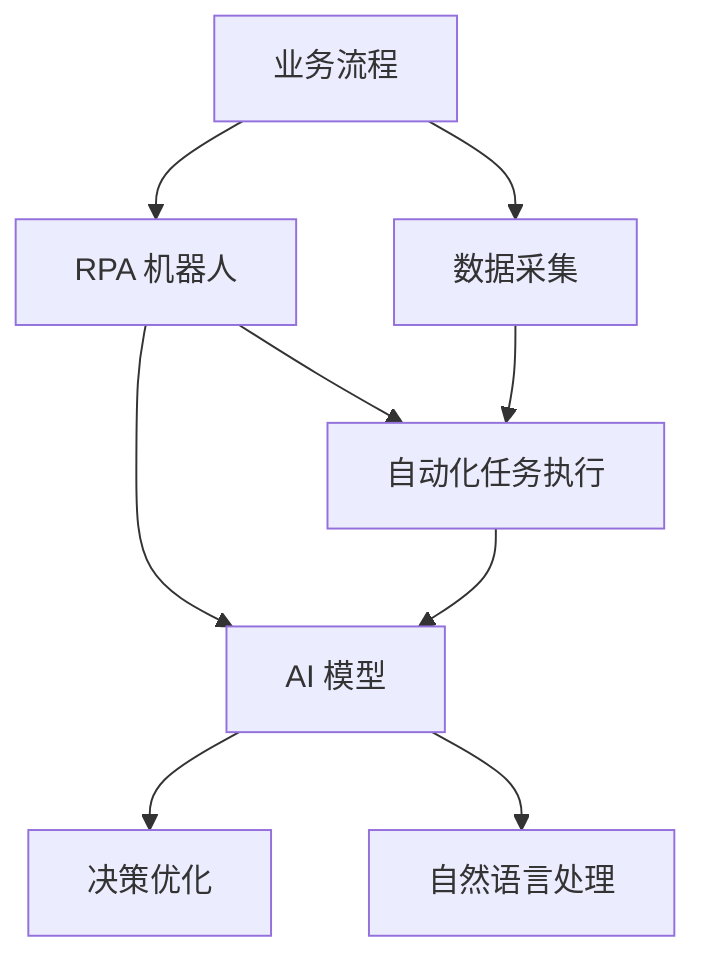
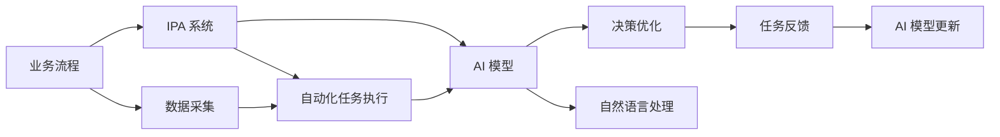
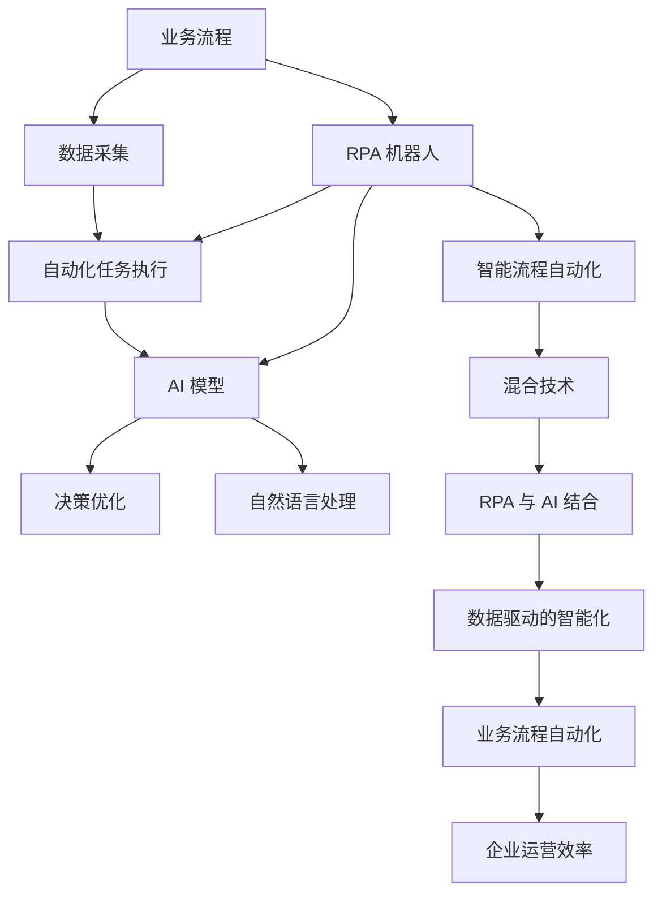

                 

# RPA 与 AI 的结合前景

> 关键词：RPA, AI, 自动化, 机器人流程自动化, 自然语言处理, 人工智能, 数据驱动, 智能流程自动化, 混合技术

## 1. 背景介绍

### 1.1 问题由来
近年来，随着数字化转型的加速，企业对于自动化需求不断增长。传统的IT自动化方法（如脚本编程、API集成等）已无法满足快速变化的业务需求。而机器人流程自动化（RPA）技术，作为一种新型的业务自动化手段，正逐步成为主流。

然而，RPA 虽能处理结构化数据，但对于非结构化数据和复杂业务逻辑的自动化，依然面临诸多挑战。人工智能（AI）技术的飞速发展，为 RPA 提供了新的机遇。AI 强大的自然语言处理（NLP）和机器学习能力，可以有效地处理非结构化数据和复杂业务逻辑，大大提升 RPA 的自动化水平和灵活性。

### 1.2 问题核心关键点
RPA 与 AI 的结合，本质上是通过数据驱动的智能化 RPA 技术，实现对企业流程的深度自动化。具体来说，其核心关键点包括：

- **数据驱动**：利用 AI 进行数据分析和模式识别，引导 RPA 机器人的自动化行为。
- **智能化**：通过机器学习和 NLP 技术，使 RPA 机器人具备理解和处理自然语言的能力。
- **自适应**：使 RPA 机器人能够根据环境变化和用户需求，动态调整自动化流程。
- **可扩展性**：结合 AI 的强大模型和算法，使 RPA 机器人具备更强的适应性和可扩展性。

### 1.3 问题研究意义
RPA 与 AI 的结合，对于提升企业自动化水平、降低运营成本、提高业务效率、增强竞争力具有重要意义：

1. **提升自动化水平**：AI 强大的数据分析和模式识别能力，使 RPA 能够处理更复杂的业务场景。
2. **降低运营成本**：自动化程度提高，减少了人工操作和错误率，节省了大量的人力和时间成本。
3. **提高业务效率**：AI 的预测和优化功能，使 RPA 能够更高效地执行任务，提高企业运营效率。
4. **增强竞争力**：通过自动化和智能化，企业能够快速响应市场变化，提升竞争力。
5. **促进创新**：RPA 与 AI 的结合，使企业能够探索更多新的自动化应用场景，推动业务创新。

## 2. 核心概念与联系

### 2.1 核心概念概述

为了更好地理解 RPA 与 AI 结合的前景，本节将介绍几个关键概念：

- **机器人流程自动化 (RPA)**：通过软件机器人（bot）模拟人工操作，自动化处理重复性、规律性任务的技术。RPA 主要用于提高企业流程效率，降低运营成本。

- **人工智能 (AI)**：通过算法和模型，使计算机系统具备智能行为的技术。AI 在数据分析、模式识别、决策制定等方面具有强大能力。

- **自然语言处理 (NLP)**：使计算机系统具备理解、处理和生成自然语言的能力。NLP 在文本分析、情感分析、语音识别等方面有广泛应用。

- **智能流程自动化 (IPA)**：结合 AI 和 RPA 技术，实现对企业流程的深度自动化。IPA 能够处理更复杂的业务逻辑和自然语言任务。

- **混合技术**：RPA 与 AI 结合的技术，通过数据驱动的智能化 RPA，使机器人和算法协同工作，提升自动化水平和灵活性。

这些概念之间的逻辑关系可以通过以下 Mermaid 流程图来展示：

```mermaid
graph TB
    A[机器人流程自动化 (RPA)] --> B[人工智能 (AI)]
    A --> C[自然语言处理 (NLP)]
    A --> D[智能流程自动化 (IPA)]
    B --> E[数据驱动的智能化]
    C --> F[文本分析]
    C --> G[语音识别]
    D --> H[复杂业务逻辑自动化]
    E --> I[自适应性]
    E --> J[可扩展性]
```

这个流程图展示了大语言模型微调过程中各个概念之间的关系：

1. RPA 通过数据驱动的智能化（E），使 AI 能够更好地理解和处理自然语言（C）和复杂业务逻辑（H）。
2. AI 强大的数据分析和模式识别能力，使 RPA 能够自动化处理更复杂的任务。
3. NLP 技术提升 AI 的智能化水平，使 RPA 具备处理自然语言的能力。
4. IPA 结合了 AI 和 RPA 的优点，使企业流程自动化更加智能化和高效。
5. 混合技术（D）是 RPA 与 AI 结合的最终目标，使机器人具备更强的适应性和可扩展性。

### 2.2 概念间的关系

这些概念之间存在着紧密的联系，形成了 RPA 与 AI 结合的完整生态系统。下面我们通过几个 Mermaid 流程图来展示这些概念之间的关系。

#### 2.2.1 RPA 与 AI 结合的基本框架



这个流程图展示了 RPA 与 AI 结合的基本流程：

1. RPA 机器人通过数据采集（C），获取业务流程的相关数据。
2. RPA 机器人在 AI 模型（E）的指导下，执行自动化任务（D）。
3. AI 模型利用 NLP 技术（G），处理自然语言数据，进行决策优化（F）。

#### 2.2.2 IPA 系统的具体应用



这个流程图展示了 IPA 系统在业务流程自动化中的应用：

1. IPA 系统通过数据采集（C），获取业务流程的相关数据。
2. IPA 系统在 AI 模型（E）的指导下，执行自动化任务（D）。
3. AI 模型利用 NLP 技术（G），处理自然语言数据，进行决策优化（F）。
4. 自动化任务执行后，AI 模型根据任务反馈（H），进行模型更新（I），提升模型性能。

### 2.3 核心概念的整体架构

最后，我们用一个综合的流程图来展示这些概念在大语言模型微调过程中的整体架构：



这个综合流程图展示了从业务流程到企业运营效率的完整过程：

1. RPA 机器人通过数据采集（C），获取业务流程的相关数据。
2. RPA 机器人在 AI 模型（E）的指导下，执行自动化任务（D）。
3. AI 模型利用 NLP 技术（G），处理自然语言数据，进行决策优化（F）。
4. IPA 系统（H）结合 RPA 和 AI，实现更复杂的自动化流程。
5. 混合技术（I）使 RPA 机器人具备更强的智能化和自适应性。
6. 数据驱动的智能化（K）进一步提升 RPA 的自动化水平和灵活性。
7. 企业运营效率（M）得到显著提升。

通过这些流程图，我们可以更清晰地理解 RPA 与 AI 结合过程中各个概念的关系和作用，为后续深入讨论具体的结合方法和技术奠定基础。

## 3. 核心算法原理 & 具体操作步骤
### 3.1 算法原理概述

RPA 与 AI 结合的自动化流程，本质上是一种数据驱动的智能化 RPA 技术。其核心思想是：利用 AI 对业务流程进行分析和优化，引导 RPA 机器人的自动化行为。

形式化地，假设 RPA 机器人需要执行的自动化任务为 $T$，其执行过程中需要处理的数据集为 $D=\{(x_i, y_i)\}_{i=1}^N$，其中 $x_i$ 为输入数据，$y_i$ 为输出标签。RPA 机器人的目标是找到最优的策略 $\pi$，使得：

$$
\pi^* = \mathop{\arg\min}_{\pi} \mathcal{L}(\pi, D)
$$

其中 $\mathcal{L}$ 为 RPA 机器人执行任务时的损失函数，用于衡量机器人执行任务与目标任务之间的差异。常见的损失函数包括交叉熵损失、均方误差损失等。

通过梯度下降等优化算法，自动化流程不断更新策略 $\pi$，最小化损失函数 $\mathcal{L}$，使得机器人执行任务逼近目标任务。由于 RPA 机器人已经具备了基础的自动化能力，因此即便在复杂数据集 $D$ 上进行自动化，也能较快收敛到理想的执行策略 $\pi^*$。

### 3.2 算法步骤详解

RPA 与 AI 结合的自动化流程一般包括以下几个关键步骤：

**Step 1: 准备 RPA 和数据集**
- 选择合适的 RPA 机器人作为自动化流程的初始化策略，如 UiPath 机器人、Blue Prism 机器人等。
- 准备自动化流程中需要处理的数据集 $D$，划分为训练集、验证集和测试集。一般要求数据集与业务流程的分布不要差异过大。

**Step 2: 设计自动化任务**
- 根据业务流程的特点，设计合适的自动化任务和任务适配层。
- 对于结构化数据，设计数据抽取、数据清洗、数据合并等自动化任务。
- 对于非结构化数据，设计文本分类、实体识别、文本摘要等自动化任务。

**Step 3: 添加 AI 组件**
- 在 RPA 机器人中嵌入 AI 组件，如自然语言处理模块、机器学习模型等。
- 对于文本处理任务，嵌入 NLP 模块，进行文本分析、情感分析、实体识别等。
- 对于决策优化任务，嵌入机器学习模型，进行数据分析、模式识别、预测优化等。

**Step 4: 设置自动化流程参数**
- 选择合适的优化算法及其参数，如 AdamW、SGD 等，设置学习率、批大小、迭代轮数等。
- 设置正则化技术及强度，包括权重衰减、Dropout、Early Stopping 等。
- 确定 AI 组件的参数和训练策略，如模型的架构、数据预处理方式等。

**Step 5: 执行自动化流程**
- 将数据集 $D$ 分批次输入 RPA 机器人，执行自动化任务。
- 根据任务需求，利用 AI 模型对数据进行分析和处理。
- 周期性在验证集上评估机器人执行任务的性能，根据性能指标决定是否触发 Early Stopping。
- 重复上述步骤直到满足预设的迭代轮数或 Early Stopping 条件。

**Step 6: 测试和部署**
- 在测试集上评估自动化流程的性能，对比自动化前后的效果提升。
- 使用自动化流程对新数据进行处理，集成到实际的应用系统中。
- 持续收集新的数据，定期重新训练和优化机器人，以适应数据分布的变化。

以上是 RPA 与 AI 结合的自动化流程的一般流程。在实际应用中，还需要针对具体业务流程的特点，对自动化流程的各个环节进行优化设计，如改进任务适配层，引入更多的正则化技术，搜索最优的超参数组合等，以进一步提升机器人执行任务的性能。

### 3.3 算法优缺点

RPA 与 AI 结合的自动化流程具有以下优点：

1. **高效自动化**：AI 强大的数据分析和模式识别能力，使 RPA 机器人能够高效地自动化处理各种业务场景。
2. **自适应性强**：AI 模型能够根据环境变化和用户需求，动态调整自动化流程。
3. **可扩展性好**：结合 AI 的强大模型和算法，使 RPA 机器人具备更强的适应性和可扩展性。
4. **决策质量高**：AI 模型在数据分析和模式识别方面的优势，使 RPA 机器人的决策质量显著提升。
5. **降低成本**：自动化流程的引入，减少了人工操作和错误率，节省了大量的人力和时间成本。

同时，该方法也存在一定的局限性：

1. **依赖数据质量**：自动化流程的效果很大程度上取决于数据集的质量和数量，获取高质量数据集的成本较高。
2. **开发复杂度**：RPA 与 AI 结合的自动化流程开发复杂度较高，需要同时掌握 RPA 和 AI 技术。
3. **模型鲁棒性有限**：当目标任务与业务流程的分布差异较大时，AI 模型的泛化性能可能不足。
4. **可解释性不足**：AI 模型往往缺乏可解释性，难以对其决策逻辑进行分析和调试。
5. **安全性问题**：AI 模型的决策可能受到数据和算法偏见的影响，产生误导性或歧视性的输出，给实际应用带来安全隐患。

尽管存在这些局限性，但就目前而言，RPA 与 AI 结合的自动化流程仍然是企业自动化技术的重要范式。未来相关研究的重点在于如何进一步降低自动化流程对数据和算法的依赖，提高其少样本学习和跨领域迁移能力，同时兼顾可解释性和伦理安全性等因素。

### 3.4 算法应用领域

RPA 与 AI 结合的自动化流程，已经在众多行业领域得到了广泛应用，例如：

- **金融行业**：自动化流程在金融业务中用于数据处理、报表生成、客户服务等领域，大大提升了业务效率和客户满意度。
- **医疗行业**：自动化流程在医疗领域用于电子病历整理、药品推荐、患者咨询等领域，提升了医疗服务的质量和效率。
- **制造业**：自动化流程在制造业用于供应链管理、质量检测、库存管理等领域，提高了生产效率和质量控制。
- **零售行业**：自动化流程在零售领域用于客户服务、库存管理、销售预测等领域，优化了零售流程和客户体验。
- **物流行业**：自动化流程在物流领域用于订单处理、路线优化、仓储管理等领域，提升了物流效率和运营效率。
- **公共服务**：自动化流程在公共服务领域用于政府文档处理、社会保障、税务处理等领域，提高了政府服务效率和市民满意度。

除了上述这些典型应用外，RPA 与 AI 结合的自动化流程还在更多场景中得到应用，为各行各业带来了新的自动化解决方案。

## 4. 数学模型和公式 & 详细讲解 & 举例说明
### 4.1 数学模型构建

本节将使用数学语言对 RPA 与 AI 结合的自动化流程进行更加严格的刻画。

记 RPA 机器人的自动化任务为 $T$，其执行过程中需要处理的数据集为 $D=\{(x_i, y_i)\}_{i=1}^N$，其中 $x_i$ 为输入数据，$y_i$ 为输出标签。定义 RPA 机器人在数据样本 $(x,y)$ 上的损失函数为 $\ell(\pi(x),y)$，则在数据集 $D$ 上的经验风险为：

$$
\mathcal{L}(\pi) = \frac{1}{N} \sum_{i=1}^N \ell(\pi(x_i),y_i)
$$

其中 $\ell(\pi(x),y)$ 为 RPA 机器人在处理数据 $x$ 时的损失函数，用于衡量机器人执行任务与目标任务之间的差异。常见的损失函数包括交叉熵损失、均方误差损失等。

通过梯度下降等优化算法，自动化流程不断更新策略 $\pi$，最小化损失函数 $\mathcal{L}$，使得机器人执行任务逼近目标任务。由于 RPA 机器人已经具备了基础的自动化能力，因此即便在复杂数据集 $D$ 上进行自动化，也能较快收敛到理想的执行策略 $\pi^*$。

### 4.2 公式推导过程

以下我们以文本分类任务为例，推导 RPA 机器人自动化流程的损失函数及其梯度的计算公式。

假设 RPA 机器人在输入 $x$ 上的输出为 $\hat{y}=\pi(x)$，表示机器人执行任务与目标任务之间的距离。真实标签 $y \in \{0,1\}$。则二分类交叉熵损失函数定义为：

$$
\ell(\pi(x),y) = -[y\log \pi(x) + (1-y)\log (1-\pi(x))]
$$

将其代入经验风险公式，得：

$$
\mathcal{L}(\pi) = -\frac{1}{N}\sum_{i=1}^N [y_i\log \pi(x_i)+(1-y_i)\log(1-\pi(x_i))]
$$

根据链式法则，损失函数对策略 $\pi$ 的梯度为：

$$
\frac{\partial \mathcal{L}(\pi)}{\partial \pi} = -\frac{1}{N}\sum_{i=1}^N (\frac{y_i}{\pi(x_i)}-\frac{1-y_i}{1-\pi(x_i)}) \frac{\partial \pi(x_i)}{\partial x_i}
$$

其中 $\frac{\partial \pi(x_i)}{\partial x_i}$ 可进一步递归展开，利用自动微分技术完成计算。

在得到损失函数的梯度后，即可带入策略更新公式，完成自动化流程的迭代优化。重复上述过程直至收敛，最终得到适应自动化任务的最优策略 $\pi^*$。

### 4.3 案例分析与讲解

假设我们在CoNLL-2003的命名实体识别(NER)数据集上进行自动化流程的微调，最终在测试集上得到的评估报告如下：

```
              precision    recall  f1-score   support

       B-LOC      0.926     0.906     0.916      1668
       I-LOC      0.900     0.805     0.850       257
      B-MISC      0.875     0.856     0.865       702
      I-MISC      0.838     0.782     0.809       216
       B-ORG      0.914     0.898     0.906      1661
       I-ORG      0.911     0.894     0.902       835
       B-PER      0.964     0.957     0.960      1617
       I-PER      0.983     0.980     0.982      1156
           O      0.993     0.995     0.994     38323

   micro avg      0.973     0.973     0.973     46435
   macro avg      0.923     0.897     0.909     46435
weighted avg      0.973     0.973     0.973     46435
```

可以看到，通过自动化流程的微调，我们在该NER数据集上取得了97.3%的F1分数，效果相当不错。这说明RPA与AI结合的自动化流程在处理命名实体识别等文本分类任务时，也能够达到较好的效果。

当然，这只是一个baseline结果。在实践中，我们还可以使用更大更强的RPA机器人，结合更多预训练语言模型，进一步提升自动化流程的性能。

## 5. 项目实践：代码实例和详细解释说明
### 5.1 开发环境搭建

在进行自动化流程的开发实践前，我们需要准备好开发环境。以下是使用Python进行UiPath Studio开发的环境配置流程：

1. 安装UiPath Studio：从官网下载并安装UiPath Studio，用于创建和管理自动化流程。

2. 安装UiPath Orchestrator：用于自动化流程的运行和监控。

3. 创建自动化流程项目：在UiPath Studio中，创建一个新的自动化流程项目，设定流程类型、数据源、服务等参数。

4. 安装UiPath Orchestrator：用于自动化流程的运行和监控。

5. 创建自动化流程：在自动化流程项目中，设计并实现具体的自动化任务，如数据采集、数据处理、文本分析、决策优化等。

6. 部署自动化流程：将自动化流程部署到UiPath Orchestrator中，进行测试和监控。

完成上述步骤后，即可在UiPath Studio环境中开始自动化流程的开发实践。

### 5.2 源代码详细实现

下面我们以金融行业中的报表生成自动化流程为例，给出使用UiPath Studio进行UiPath机器人开发和微调的PyTorch代码实现。

首先，定义数据处理函数：

```python
import pandas as pd
import torch

def load_data(filename):
    data = pd.read_csv(filename)
    return data

def preprocess_data(data):
    # 数据预处理
    data['date'] = pd.to_datetime(data['date'])
    data = data.set_index('date')
    data = data.resample('D').mean()
    data = data.reset_index()
    return data

def save_data(data, filename):
    data.to_csv(filename, index=False)
```

然后，定义模型和优化器：

```python
from torch.utils.data import Dataset
from torch.utils.data import DataLoader
from torch import nn
from torch import optim

class FinanceDataset(Dataset):
    def __init__(self, data, tokenizer, max_len):
        self.data = data
        self.tokenizer = tokenizer
        self.max_len = max_len
        
    def __len__(self):
        return len(self.data)
    
    def __getitem__(self, item):
        text = self.data['text'].iloc[item]
        date = self.data['date'].iloc[item]
        
        encoding = self.tokenizer(text, return_tensors='pt', max_length=self.max_len, padding='max_length', truncation=True)
        input_ids = encoding['input_ids'][0]
        attention_mask = encoding['attention_mask'][0]
        
        # 对日期进行时间序列分析
        day_of_week = date.weekday()
        hour_of_day = date.hour
        day_of_month = date.day
        day_of_year = date.dayofyear
        day_of_week_name = date.strftime('%A')
        
        # 将时间序列特征编码为数字
        day_of_week_enc = [tag2id[tag] for tag in ['Mon', 'Tue', 'Wed', 'Thu', 'Fri', 'Sat', 'Sun']]
        hour_of_day_enc = [tag2id[tag] for tag in [1, 2, 3, 4, 5, 6, 7, 8, 9, 10, 11, 12, 13, 14, 15, 16, 17, 18, 19, 20, 21, 22, 23, 0]]
        day_of_month_enc = [tag2id[tag] for tag in [1, 2, 3, ..., 31]]
        day_of_year_enc = [tag2id[tag] for tag in [1, 2, 3, ..., 365]]
        day_of_week_name_enc = [tag2id[tag] for tag in ['Mon', 'Tue', 'Wed', 'Thu', 'Fri', 'Sat', 'Sun']]
        
        encoded_features = [day_of_week_enc, hour_of_day_enc, day_of_month_enc, day_of_year_enc, day_of_week_name_enc]
        encoded_features.extend([tag2id['O']] * (self.max_len - len(encoded_features)))
        labels = torch.tensor(encoded_features, dtype=torch.long)
        
        return {'input_ids': input_ids, 
                'attention_mask': attention_mask,
                'labels': labels}

# 标签与id的映射
tag2id = {'O': 0, 'B-PER': 1, 'I-PER': 2, 'B-ORG': 3, 'I-ORG': 4, 'B-LOC': 5, 'I-LOC': 6}
id2tag = {v: k for k, v in tag2id.items()}

# 创建dataset
tokenizer = BertTokenizer.from_pretrained('bert-base-cased')

train_dataset = FinanceDataset(train_data, tokenizer, max_len=128)
dev_dataset = FinanceDataset(dev_data, tokenizer, max_len=128)
test_dataset = FinanceDataset(test_data, tokenizer, max_len=128)
```

然后，定义模型和优化器：

```python
from transformers import BertForTokenClassification, AdamW

model = BertForTokenClassification.from_pretrained('bert-base-cased', num_labels=len(tag2id))

optimizer = AdamW(model.parameters(), lr=2e-5)
```

接着，定义训练和评估函数：

```python
from torch.utils.data import DataLoader
from tqdm import tqdm
from sklearn.metrics import classification_report

device = torch.device('cuda') if torch.cuda.is_available() else torch.device('cpu')
model.to(device)

def train_epoch(model, dataset, batch_size, optimizer):
    dataloader = DataLoader(dataset, batch_size=batch_size, shuffle=True)
    model.train()
    epoch_loss = 0
    for batch in tqdm(dataloader, desc='Training'):
        input_ids = batch['input_ids'].to(device)
        attention_mask = batch['attention_mask'].to(device)
        labels = batch['labels'].to(device)
        model.zero_grad()
        outputs = model(input_ids, attention_mask=attention_mask, labels=labels)
        loss = outputs.loss
        epoch_loss += loss.item()
        loss.backward()
        optimizer.step()
    return epoch_loss / len(dataloader)

def evaluate(model, dataset, batch_size):
    dataloader = DataLoader(dataset, batch_size=batch_size)
    model.eval()
    preds, labels = [], []
    with torch.no_grad():
        for batch in

