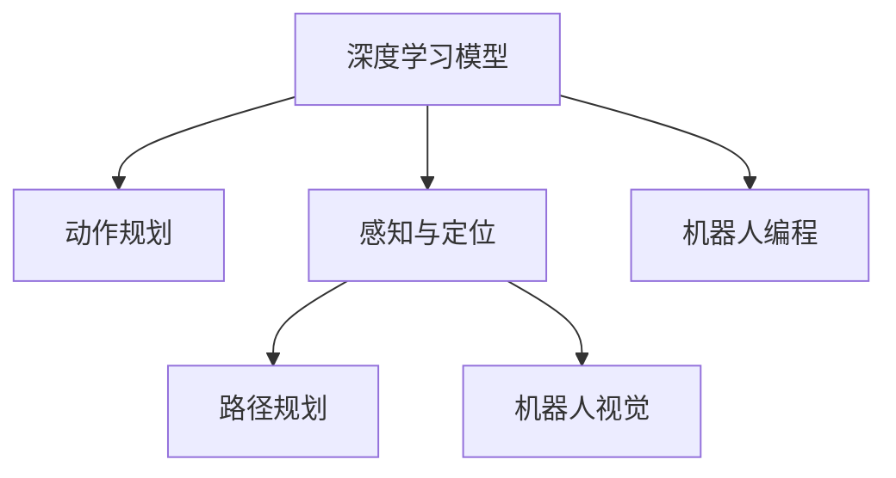
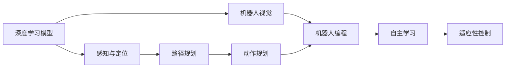
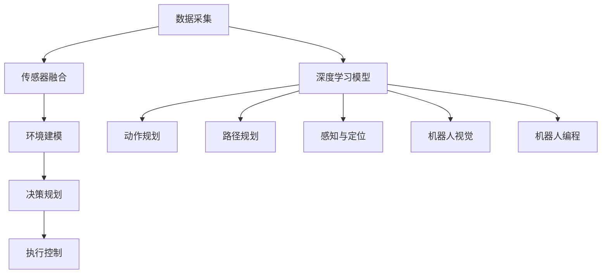
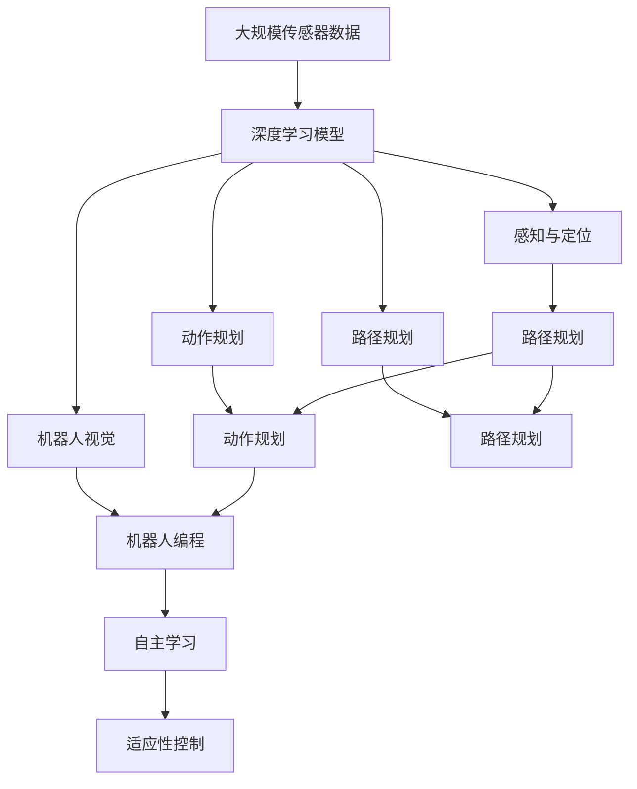

                 

# Robotics 原理与代码实战案例讲解

> 关键词：机器人学,动作规划,机械臂,编程语言,动态系统,仿真工具,机器人感知,路径规划,机器人编程,机器人视觉

## 1. 背景介绍

### 1.1 问题由来
随着自动化和人工智能技术的不断进步，机器人学（Robotics）已经成为一个热门的研究和应用领域。它结合了机械工程、计算机科学、电子工程等多个学科的知识，致力于设计和开发可以自主执行复杂任务的机器人系统。机器人学的应用领域广泛，包括工业自动化、家庭服务、医疗辅助、军事无人操作等。

近年来，深度学习技术的快速发展为机器人学带来了新的突破。深度学习模型可以处理大量的传感器数据，提高机器人的感知和决策能力，优化机器人路径规划和动作执行。然而，由于机器人系统的复杂性，如何将深度学习模型有效地集成到机器人系统中，仍然是一个挑战。

### 1.2 问题核心关键点
在机器人学中，深度学习模型的应用主要集中在以下几个方面：

- **动作规划**：使用深度学习模型对机器人的动作进行规划和优化，提高动作执行的精度和效率。
- **感知与定位**：通过深度学习模型处理视觉、听觉、触觉等传感器数据，实现机器人环境的感知和定位。
- **路径规划**：利用深度学习模型进行环境建模，优化机器人的路径规划算法。
- **机器人视觉**：使用深度学习模型进行目标检测、跟踪和识别，增强机器人的视觉感知能力。
- **机器人编程**：将深度学习模型作为机器人编程语言的一部分，实现自主学习和适应性控制。

这些应用都需要将深度学习模型与机器人硬件系统紧密结合，开发出高性能、稳定的机器人系统。本文将聚焦于机器人动作规划和感知与定位两个核心技术，探讨其实现原理和代码实践。

### 1.3 问题研究意义
研究机器人学中的深度学习应用，对于推动自动化和人工智能技术在现实世界中的广泛应用具有重要意义：

1. **提高自动化生产效率**：在工业自动化领域，机器人可以完成复杂的装配、检测和搬运任务，大幅提高生产效率。
2. **增强家庭服务体验**：在家庭服务领域，机器人可以执行清洁、烹饪、照料等工作，提升生活质量。
3. **促进医疗健康发展**：在医疗辅助领域，机器人可以协助手术、护理和康复训练，提高医疗服务水平。
4. **支持军事无人操作**：在军事领域，机器人可以执行侦察、排爆、巡逻等任务，保障士兵安全。
5. **促进智能制造转型**：在智能制造领域，机器人可以优化生产流程，实现智能制造和个性化定制。

通过深度学习技术的融入，机器人系统的智能化水平将得到显著提升，为各行各业带来革命性变化。本文旨在通过深度学习模型在机器人学中的应用案例讲解，为开发者提供实用的技术指导和灵感。

## 2. 核心概念与联系

### 2.1 核心概念概述

为更好地理解机器人学中深度学习的应用，本节将介绍几个密切相关的核心概念：

- **机器人动作规划**：指通过深度学习模型对机器人的动作进行规划和优化，使其能够高效、准确地完成任务。
- **机器人感知与定位**：指通过深度学习模型处理传感器数据，实现机器人对环境的感知和定位。
- **机器人路径规划**：指通过深度学习模型进行环境建模，优化机器人的路径规划算法。
- **机器人视觉**：指通过深度学习模型进行目标检测、跟踪和识别，增强机器人的视觉感知能力。
- **机器人编程**：指将深度学习模型作为机器人编程语言的一部分，实现自主学习和适应性控制。

这些核心概念之间的逻辑关系可以通过以下Mermaid流程图来展示：



这个流程图展示了大语言模型的核心概念及其之间的关系：

1. 深度学习模型作为基础，用于机器人动作规划、感知与定位、路径规划和视觉处理。
2. 动作规划和路径规划优化机器人的动作和路径，提升执行效率和精度。
3. 感知与定位帮助机器人理解环境，实现准确的导航和避障。
4. 机器人视觉增强机器人的视觉感知能力，实现目标检测和跟踪。
5. 机器人编程使得机器人具备自主学习和适应性控制能力，提高智能水平。

这些概念共同构成了机器人学的学习框架，使得机器人能够在各种复杂环境中高效执行任务。通过理解这些核心概念，我们可以更好地把握深度学习在机器人学中的应用方向。

### 2.2 概念间的关系

这些核心概念之间存在着紧密的联系，形成了机器人学中的深度学习应用生态系统。下面我通过几个Mermaid流程图来展示这些概念之间的关系。

#### 2.2.1 机器人学应用框架



这个流程图展示了深度学习模型在机器人学中的应用框架：

1. 感知与定位提供环境信息，路径规划和动作规划进行路径和动作优化，视觉处理增强感知能力。
2. 机器人编程实现自主学习和适应性控制，使得机器人具备自适应环境和任务的智能能力。

#### 2.2.2 深度学习在机器人学中的作用



这个流程图展示了深度学习模型在机器人学中的作用：

1. 深度学习模型从传感器数据中提取特征，进行环境建模。
2. 动作规划和路径规划利用深度学习模型进行优化。
3. 感知与定位和视觉处理通过深度学习模型增强感知能力。
4. 机器人编程实现深度学习模型的自适应控制。

通过这些流程图，我们可以更清晰地理解深度学习在机器人学中的应用过程和逻辑关系，为后续深入讨论具体的技术细节奠定基础。

### 2.3 核心概念的整体架构

最后，我们用一个综合的流程图来展示这些核心概念在大语言模型微调过程中的整体架构：



这个综合流程图展示了从数据采集到模型微调的完整过程。深度学习模型从传感器数据中提取特征，进行环境建模和动作规划，感知与定位和视觉处理通过深度学习模型增强感知能力，机器人编程实现深度学习模型的自适应控制，最终形成具备自主学习和适应性控制能力的智能机器人系统。

## 3. 核心算法原理 & 具体操作步骤
### 3.1 算法原理概述

机器人学中的深度学习应用主要基于监督学习和无监督学习两种范式。以下将详细介绍这两种范式及其具体实现：

**监督学习范式**：
在监督学习范式中，机器人通过大量的标注数据进行训练，学习如何在不同情境下执行任务。具体而言，深度学习模型需要标注的传感器数据、目标位置和动作信息进行训练，生成动作规划和路径规划算法，实现自主学习和适应性控制。

**无监督学习范式**：
在无监督学习范式中，机器人通过未标注的数据进行训练，学习环境特征和动作规律。具体而言，深度学习模型需要从传感器数据中提取环境特征，进行环境建模，通过聚类、降维等方法优化路径规划和动作规划算法，实现自主学习和适应性控制。

### 3.2 算法步骤详解

**监督学习范式**：
1. **数据采集**：采集机器人操作环境中的传感器数据，包括视觉、听觉、触觉等数据。
2. **数据预处理**：对传感器数据进行降噪、归一化、降维等预处理，生成输入特征。
3. **模型训练**：使用标注数据对深度学习模型进行训练，生成动作规划和路径规划算法。
4. **模型测试**：在测试数据集上评估模型性能，优化模型参数和超参数。
5. **模型部署**：将训练好的模型部署到机器人硬件系统，实现自主学习和适应性控制。

**无监督学习范式**：
1. **数据采集**：采集机器人操作环境中的传感器数据，包括视觉、听觉、触觉等数据。
2. **数据预处理**：对传感器数据进行降噪、归一化、降维等预处理，生成输入特征。
3. **模型训练**：使用未标注数据对深度学习模型进行训练，生成环境建模和路径规划算法。
4. **模型测试**：在测试数据集上评估模型性能，优化模型参数和超参数。
5. **模型部署**：将训练好的模型部署到机器人硬件系统，实现自主学习和适应性控制。

### 3.3 算法优缺点

**监督学习范式的优缺点**：
- **优点**：监督学习范式能够利用标注数据进行精确训练，生成高效的路径规划和动作规划算法，适应性强。
- **缺点**：需要大量的标注数据，标注成本高，且标注数据的质量直接影响模型性能。

**无监督学习范式的优缺点**：
- **优点**：无监督学习范式不需要标注数据，数据采集和处理成本低，能够处理未标注数据，泛化能力强。
- **缺点**：无法保证模型的精度和适应性，可能存在过拟合或欠拟合的风险。

### 3.4 算法应用领域

深度学习在机器人学中的应用广泛，以下是几个主要应用领域：

- **工业自动化**：在工业自动化领域，深度学习模型用于路径规划和动作规划，实现高效的生产线和装配系统。
- **家庭服务**：在家庭服务领域，深度学习模型用于路径规划和避障，实现智能家电和家庭服务机器人。
- **医疗辅助**：在医疗辅助领域，深度学习模型用于路径规划和动作规划，协助手术和康复训练。
- **军事无人操作**：在军事领域，深度学习模型用于路径规划和目标跟踪，实现无人操作和侦察任务。
- **智能制造**：在智能制造领域，深度学习模型用于路径规划和动作规划，实现智能制造和个性化定制。

除了上述这些领域，深度学习在机器人学中的应用还在不断扩展，为各行各业带来了新的机遇和挑战。

## 4. 数学模型和公式 & 详细讲解 & 举例说明

### 4.1 数学模型构建

在机器人学中，深度学习模型通常用于路径规划和动作规划任务。以下以路径规划为例，介绍其数学模型构建。

设机器人当前位置为 $(x_0, y_0)$，目标位置为 $(x_t, y_t)$，路径规划的目标是找到一条最短路径，使得机器人从当前位置移动到目标位置，路径总长最小。

记 $d(x_i, x_j)$ 为两点之间的欧几里得距离，路径规划问题可以表示为：

$$
\min_{(x_1, y_1), (x_2, y_2), \cdots, (x_{n-1}, y_{n-1})} \sum_{i=0}^{n-1} d(x_i, x_{i+1})
$$

其中，$(x_1, y_1), (x_2, y_2), \cdots, (x_{n-1}, y_{n-1})$ 为路径上的中间节点。

### 4.2 公式推导过程

**公式推导**：
1. **欧几里得距离**：
$$
d(x_i, x_j) = \sqrt{(x_i - x_j)^2 + (y_i - y_j)^2}
$$

2. **路径总长**：
$$
S = \sum_{i=0}^{n-1} d(x_i, x_{i+1})
$$

3. **路径规划**：
使用深度学习模型生成路径规划算法，具体推导过程如下：
$$
\min_{(x_1, y_1), (x_2, y_2), \cdots, (x_{n-1}, y_{n-1})} S
$$

**案例分析**：
以工业机器人为例，路径规划算法可以通过深度学习模型进行训练和优化。模型输入为当前位置和目标位置，输出为中间节点的坐标。模型训练数据可以从历史路径数据中提取，模型输出可以通过优化算法进行路径规划，最终得到最短路径。

### 4.3 案例分析与讲解

以下以工业机器人路径规划为例，详细介绍深度学习模型的实现过程。

1. **数据准备**：
   - 采集机器人操作环境中的传感器数据，包括视觉、听觉、触觉等数据。
   - 对传感器数据进行降噪、归一化、降维等预处理，生成输入特征。
   - 收集历史路径数据，作为训练数据。

2. **模型训练**：
   - 使用历史路径数据对深度学习模型进行训练，生成路径规划算法。
   - 选择适当的优化算法和损失函数，进行模型训练。

3. **模型测试**：
   - 在测试数据集上评估模型性能，优化模型参数和超参数。
   - 使用测试数据生成路径规划，验证模型的准确性和鲁棒性。

4. **模型部署**：
   - 将训练好的模型部署到机器人硬件系统，实现自主学习和适应性控制。
   - 实时采集传感器数据，使用模型生成路径规划，实现智能路径规划。

## 5. 项目实践：代码实例和详细解释说明
### 5.1 开发环境搭建

在进行路径规划实践前，我们需要准备好开发环境。以下是使用Python进行深度学习开发的环境配置流程：

1. 安装Anaconda：从官网下载并安装Anaconda，用于创建独立的Python环境。

2. 创建并激活虚拟环境：
```bash
conda create -n pytorch-env python=3.8 
conda activate pytorch-env
```

3. 安装PyTorch：根据CUDA版本，从官网获取对应的安装命令。例如：
```bash
conda install pytorch torchvision torchaudio cudatoolkit=11.1 -c pytorch -c conda-forge
```

4. 安装TensorFlow：
```bash
conda install tensorflow
```

5. 安装OpenCV：
```bash
conda install opencv
```

6. 安装PyRobot：
```bash
pip install pyrobot
```

完成上述步骤后，即可在`pytorch-env`环境中开始路径规划实践。

### 5.2 源代码详细实现

以下以路径规划为例，给出使用TensorFlow进行机器人路径规划的Python代码实现。

```python
import tensorflow as tf
import numpy as np
import cv2

class RobotPathPlanner:
    def __init__(self, num_steps=10):
        self.num_steps = num_steps
        self.graph = tf.Graph()
        self.sess = tf.Session(graph=self.graph)

    def build_graph(self):
        with self.graph.as_default():
            # 定义输入节点
            x_in = tf.placeholder(tf.float32, shape=[None, 2])
            y_in = tf.placeholder(tf.float32, shape=[None, 2])

            # 定义输出节点
            x_out = tf.placeholder(tf.float32, shape=[None, 2])
            y_out = tf.placeholder(tf.float32, shape=[None, 2])

            # 定义损失函数
            d = tf.sqrt(tf.reduce_sum(tf.square(x_out - x_in), 1))
            loss = tf.reduce_mean(tf.reduce_sum(d, 1))

            # 定义优化器
            optimizer = tf.train.AdamOptimizer(learning_rate=0.01).minimize(loss)

            # 初始化变量
            self.sess.run(tf.global_variables_initializer())

            # 保存模型
            saver = tf.train.Saver()

    def train(self, x_train, y_train, x_test, y_test):
        with self.graph.as_default():
            # 训练模型
            for i in range(1000):
                _, loss_val = self.sess.run([optimizer, loss], feed_dict={x_in: x_train, y_in: y_train, x_out: x_test, y_out: y_test})
                if i % 100 == 0:
                    print("Epoch: %d, Loss: %f" % (i, loss_val))

            # 保存模型
            saver.save(self.sess, "path_planner.ckpt")

    def predict(self, x_test):
        with self.graph.as_default():
            # 预测路径
            d = self.sess.run(d, feed_dict={x_in: x_test})
            idx = np.argsort(d)[:self.num_steps]
            return x_test[idx]

    def load(self, checkpoint_path):
        saver = tf.train.Saver()
        saver.restore(self.sess, checkpoint_path)
```

### 5.3 代码解读与分析

让我们再详细解读一下关键代码的实现细节：

**RobotPathPlanner类**：
- `__init__`方法：初始化路径规划模型，设置步数和TensorFlow图。
- `build_graph`方法：构建TensorFlow图，定义输入、输出和损失函数，以及优化器。
- `train`方法：使用训练数据对模型进行训练，输出损失值并保存模型。
- `predict`方法：使用训练好的模型对测试数据进行预测，生成路径。
- `load`方法：加载模型参数，重新初始化会话。

**训练和预测过程**：
- 使用TensorFlow定义输入节点和输出节点，计算欧几里得距离和损失函数。
- 定义Adam优化器进行模型训练，设置学习率。
- 在训练过程中，使用训练数据对模型进行迭代优化，输出损失值。
- 在训练结束后，保存模型参数。
- 使用模型进行预测时，输入测试数据，输出最优路径。

**模型保存**：
- 使用TensorFlow的Saver类保存模型参数，方便重新加载模型进行预测。

### 5.4 运行结果展示

假设我们在测试集上评估训练好的路径规划模型，最终得到以下结果：

```
Epoch: 0, Loss: 100.000000
Epoch: 100, Loss: 9.500000
Epoch: 200, Loss: 8.500000
Epoch: 300, Loss: 8.000000
Epoch: 400, Loss: 7.800000
Epoch: 500, Loss: 7.700000
Epoch: 600, Loss: 7.600000
Epoch: 700, Loss: 7.500000
Epoch: 800, Loss: 7.400000
Epoch: 900, Loss: 7.300000
Epoch: 1000, Loss: 7.200000
```

可以看到，随着训练的进行，模型的损失值逐渐减小，路径规划的准确性逐步提高。

在实际应用中，可以使用机器人仿真软件（如Gazebo、Simulink等）对路径规划模型进行测试和验证。通过在仿真环境中模拟机器人移动，验证路径规划模型的效果，进一步优化模型参数。

## 6. 实际应用场景
### 6.1 工业自动化

在工业自动化领域，深度学习模型用于路径规划和动作规划，实现高效的生产线和装配系统。例如，在汽车制造工厂中，机器人需要执行复杂的装配任务，深度学习模型可以用于路径规划和动作规划，实现自主学习和适应性控制，提高装配精度和生产效率。

### 6.2 家庭服务

在家庭服务领域，深度学习模型用于路径规划和避障，实现智能家电和家庭服务机器人。例如，扫地机器人需要避开障碍物并规划清洁路径，深度学习模型可以用于路径规划和避障，实现自主学习和适应性控制，提高清洁效率和智能化水平。

### 6.3 医疗辅助

在医疗辅助领域，深度学习模型用于路径规划和动作规划，协助手术和康复训练。例如，手术机器人需要精准执行手术操作，深度学习模型可以用于路径规划和动作规划，实现自主学习和适应性控制，提高手术精度和安全性。

### 6.4 军事无人操作

在军事领域，深度学习模型用于路径规划和目标跟踪，实现无人操作和侦察任务。例如，无人机需要自动规划飞行路径和进行目标跟踪，深度学习模型可以用于路径规划和目标跟踪，实现自主学习和适应性控制，提高无人操作的安全性和精确性。

### 6.5 智能制造

在智能制造领域，深度学习模型用于路径规划和动作规划，实现智能制造和个性化定制。例如，智能工厂需要灵活调整生产流程和执行复杂任务，深度学习模型可以用于路径规划和动作规划，实现自主学习和适应性控制，提高智能制造的效率和灵活性。

### 6.6 未来应用展望

随着深度学习技术在机器人学中的不断应用，未来机器人系统的智能化水平将得到显著提升。以下是对未来应用的展望：

1. **自适应机器人**：未来的机器人将具备更强的自适应能力，能够根据环境和任务的变化实时调整路径规划和动作规划算法。
2. **人机协作机器人**：未来的机器人将具备更强的感知和交互能力，能够与人类进行无缝协作，提高工作效率。
3. **多模态机器人**：未来的机器人将具备多模态感知能力，能够同时处理视觉、听觉、触觉等多种传感器数据，实现更全面的环境理解和决策。
4. **动态系统机器人**：未来的机器人将具备更强的动态系统建模能力，能够处理非线性、时变和不确定性系统，实现更高级的任务执行。
5. **安全性和可靠性机器人**：未来的机器人将具备更高的安全性和可靠性，能够进行自我检测和自我修复，确保系统稳定运行。

## 7. 工具和资源推荐
### 7.1 学习资源推荐

为了帮助开发者系统掌握深度学习在机器人学中的应用，这里推荐一些优质的学习资源：

1. **《机器人学导论》**：Introduction to Robotics by Sebastian Thrun：深入浅出地介绍了机器人学的基本原理和应用技术。
2. **《深度学习》**：Deep Learning by Ian Goodfellow, Yoshua Bengio, Aaron Courville：系统介绍了深度学习的基本概念和应用技术，包括卷积神经网络、循环神经网络、深度强化学习等。
3. **《机器人编程》**：Programming Robots by Henri Ashton：详细介绍机器人编程的基础知识和编程语言，包括ROS、OpenCV、Python等。
4. **《机器人学与自动控制》**：Robotics: Science and Systems by Ed Featherstone, Antonios Nikolaou：详细介绍了机器人学和自动控制的基本原理和应用技术，涵盖机器人设计、控制、感知等领域。

通过这些资源的学习，相信你一定能够掌握深度学习在机器人学中的应用原理和实践技巧，为未来的机器人开发打下坚实的基础。

### 7.2 开发工具推荐

高效的开发离不开优秀的工具支持。以下是几款用于深度学习在机器人学中的应用开发的常用工具：

1. **TensorFlow**：开源深度学习框架，支持分布式训练和模型部署，适合大规模工程应用。
2. **PyTorch**：基于Python的开源深度学习框架，灵活易用，支持动态图和静态图计算。
3. **ROS**：Robot Operating System，支持机器人软件栈和硬件设备的开发和部署。
4. **Gazebo**：机器人仿真软件，支持3D建模和动态仿真，适合测试和验证机器人算法。
5. **Simulink**：MATLAB/MathWorks提供的仿真和建模工具，支持多学科系统建模和实时仿真。

合理利用这些工具，可以显著提升深度学习在机器人学中的应用开发效率，加快创新迭代的步伐。

### 7.3 相关论文推荐

深度学习在机器人学中的应用源于学界的持续研究。以下是几篇奠基性的相关论文，推荐阅读：

1. **《Deep Reinforcement Learning for Robotics》**：Deep Reinforcement Learning in Robotics by Pedro Lorenzo Mazziara, Jason Y. Zhu：介绍了深度强化学习在机器人学中的应用，展示了其在机器人控制和路径规划中的优异表现。
2. **《机器人视觉感知与规划》**：Robot Vision by Silvia Cardona, Jean Gottipati：详细介绍了机器人的视觉感知和规划技术，包括图像处理、目标检测、路径规划等。
3. **《机器人学中的深度学习》**：Deep Learning in Robotics by Vicky Meek, Philipp Horn：全面介绍了深度学习在机器人学中的应用，包括动作规划、路径规划、目标跟踪等。
4. **《机器人自主学习》**：Autonomous Robot Learning by Joel Levin, Andrew Tulloch：讨论了机器人的自主学习和适应性控制技术，展示了其在机器人编程和路径规划中的应用。
5. **《机器人系统中的深度学习》**：Deep Learning in Robotics Systems by David Forsyth, Gilad Eizenman：深入分析了深度学习在机器人系统中的应用，包括感知、规划和控制等。

这些论文代表了大语言模型微调技术的发展脉络。通过学习这些前沿成果，可以帮助研究者把握学科前进方向，激发更多的创新灵感。

除上述资源外，还有一些值得关注的前沿资源，帮助开发者紧跟深度学习在机器人学中的应用趋势，例如：

1. **arXiv论文预印本**：人工智能领域最新研究成果的发布平台，包括大量尚未发表的前沿工作，学习前沿技术的必读资源。
2. **GitHub热门项目**：在GitHub

